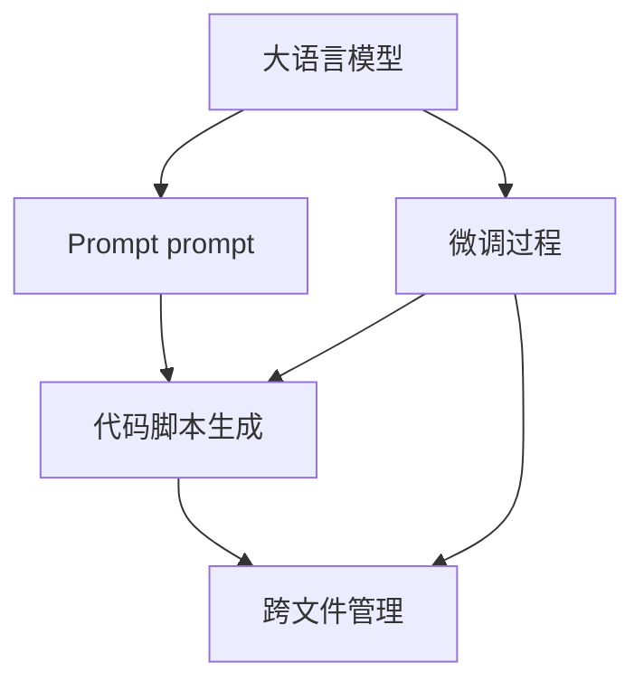

                 

# AI大模型Prompt提示词最佳实践：生成跨文件的代码脚本

> 关键词：大语言模型,Prompt prompt,代码脚本,模型微调,跨文件管理,自动化开发,模型转换

## 1. 背景介绍

### 1.1 问题由来
随着深度学习技术和大模型（Large Language Models, LLMs）的迅速发展，模型在自然语言处理（Natural Language Processing, NLP）、计算机视觉（Computer Vision, CV）、语音识别（Speech Recognition, SR）等领域的性能不断提升。这些大模型通常依赖于大规模无监督预训练数据，如GPT系列、BERT等。但在实际应用中，模型需要针对特定的任务进行微调（Fine-tuning），以适应特定领域的知识。

微调的过程通常涉及对模型结构进行调整，如修改网络层数、调整模型参数等。此外，生成高质量的代码脚本是模型应用的关键步骤。传统的脚本生成方式往往需要人工编写和调试，效率低下且容易出错。因此，自动化生成代码脚本成为大模型微调的重要研究课题。

### 1.2 问题核心关键点
Prompt prompt技术是一种有效的模型微调方法，通过在模型输入中添加特定格式的文本模板，引导模型按照期望的方式生成输出。这一技术在大模型微调中有着广泛的应用，能够显著提高微调的效率和效果。然而，如何在跨文件的场景下，自动化生成高质量的代码脚本，是一个值得深入探讨的问题。

## 2. 核心概念与联系

### 2.1 核心概念概述

为更好地理解Prompt prompt技术在大模型微调中的应用，本节将介绍几个密切相关的核心概念：

- **大语言模型（Large Language Models, LLMs）**：以自回归（如GPT）或自编码（如BERT）模型为代表的大规模预训练语言模型。通过在大规模无标签文本语料上进行预训练，学习通用的语言表示，具备强大的语言理解和生成能力。

- **Prompt prompt技术**：通过在模型输入中添加特定格式的文本模板，引导模型按照期望的方式生成输出。Prompt prompt技术在大模型微调中，能显著提高模型的性能和微调的效率。

- **代码脚本生成**：在模型微调过程中，生成符合特定格式要求的代码脚本，用于自动化开发和部署。代码脚本的生成质量直接影响模型应用的易用性和稳定性。

- **跨文件管理**：在实际开发中，模型微调和代码生成通常涉及到多个文件和文件间的协同工作。如何有效地管理和组织这些文件，是实现自动化生成代码脚本的关键。

这些核心概念之间的逻辑关系可以通过以下Mermaid流程图来展示：



这个流程图展示了Prompt prompt技术在大模型微调中的应用，以及代码脚本生成和跨文件管理的紧密联系。

## 3. 核心算法原理 & 具体操作步骤
### 3.1 算法原理概述

Prompt prompt技术在大模型微调中的应用，主要基于以下原理：

- **输入引导**：通过在模型输入中添加特定的文本模板，引导模型生成符合预期格式的代码脚本。模板通常包括模型的名称、输入输出类型、参数等关键信息。

- **输出控制**：根据模板，模型输出的代码脚本具有特定的结构和格式。模板中包含的语言提示（Language Prompt）帮助模型生成符合规范的代码。

- **模型微调**：在生成代码脚本的同时，模型参数根据特定的微调目标进行更新。微调过程可以通过监督学习、半监督学习等方法进行，以提升模型的性能。

### 3.2 算法步骤详解

基于Prompt prompt技术的大模型微调和代码脚本生成主要包括以下几个步骤：

**Step 1: 准备预训练模型和数据集**
- 选择合适的预训练语言模型（如BERT、GPT等）作为初始化参数。
- 准备下游任务的标注数据集，包括输入输出格式和微调目标。

**Step 2: 设计Prompt prompt模板**
- 根据任务的特定需求，设计符合格式的Prompt prompt模板。
- 模板应包含模型名称、输入输出类型、参数等信息。

**Step 3: 设置微调超参数**
- 选择合适的优化算法及其参数，如AdamW、SGD等，设置学习率、批大小、迭代轮数等。
- 设置正则化技术及强度，包括权重衰减、Dropout、Early Stopping等。

**Step 4: 执行梯度训练**
- 将训练集数据分批次输入模型，前向传播计算损失函数。
- 反向传播计算参数梯度，根据设定的优化算法和学习率更新模型参数。
- 周期性在验证集上评估模型性能，根据性能指标决定是否触发Early Stopping。
- 重复上述步骤直到满足预设的迭代轮数或Early Stopping条件。

**Step 5: 生成代码脚本**
- 在微调过程中，通过Prompt prompt模板生成符合特定格式的代码脚本。
- 脚本中包含模型输入输出、参数配置、模型调用等关键信息。

**Step 6: 测试和部署**
- 在测试集上评估微调后模型和生成的代码脚本的性能，对比微调前后的精度提升。
- 使用生成的代码脚本进行模型部署和测试，验证其在实际应用中的效果。

### 3.3 算法优缺点

Prompt prompt技术在大模型微调中的应用，具有以下优点：
1. 简单高效。通过特定的模板设计，可以显著提升微调的效率和效果。
2. 适用范围广。适用于各种NLP和CV任务，只需设计符合格式的Prompt prompt模板即可。
3. 生成代码脚本。在微调过程中自动生成高质量的代码脚本，大大降低了开发成本。
4. 提高模型的泛化能力。通过Prompt prompt模板，模型能够更好地理解任务需求，提高微调的泛化性能。

同时，该方法也存在一定的局限性：
1. 依赖模板设计。模板设计的好坏直接影响代码脚本的质量和性能。
2. 模板编写复杂。对于复杂的任务，需要编写详细的Prompt prompt模板，增加了设计和调试的难度。
3. 模型微调的局限性。模板设计不当可能导致模型输出不符合预期，影响微调效果。

尽管存在这些局限性，但Prompt prompt技术仍是大模型微调的重要手段之一。未来相关研究的重点在于如何进一步提升Prompt prompt模板设计的智能化和自动化，以及如何在复杂任务中设计更有效的Prompt prompt模板。

### 3.4 算法应用领域

Prompt prompt技术在大模型微调中的应用已经涵盖了多个领域，例如：

- **自然语言处理（NLP）**：如文本分类、命名实体识别、情感分析等任务。通过在模板中定义输入输出格式，引导模型生成符合规范的代码脚本。
- **计算机视觉（CV）**：如图像分类、目标检测、图像分割等任务。通过在模板中定义图像处理步骤，引导模型生成符合规范的代码脚本。
- **语音识别（SR）**：如语音转文本、语音识别等任务。通过在模板中定义音频处理和转换步骤，引导模型生成符合规范的代码脚本。

除了上述这些经典任务外，Prompt prompt技术在大模型微调中的应用还在不断拓展，为AI技术在更多领域的应用提供了新的可能性。

## 4. 数学模型和公式 & 详细讲解
### 4.1 数学模型构建

Prompt prompt技术在大模型微调中的应用，主要涉及模型的输入输出和参数更新。假设模型为$f(x, \theta)$，其中$x$为输入，$\theta$为模型参数。Prompt prompt模板为$T$，其中包含模型的输入输出格式、参数配置等信息。

**输入格式**：$x = (x_{in}, T)$，其中$x_{in}$为实际输入，$T$为Prompt prompt模板。
**输出格式**：$y = f(x, \theta)$，其中$y$为模型输出。

### 4.2 公式推导过程

假设模型的损失函数为$\mathcal{L}(\theta)$，Prompt prompt模板为$T$。微调过程的目标是最小化损失函数：

$$
\hat{\theta} = \mathop{\arg\min}_{\theta} \mathcal{L}(f(x, \theta), y)
$$

其中$f(x, \theta)$为模型的输出，$y$为真实标签。

根据上述目标，微调过程的优化方程为：

$$
\nabla_{\theta}\mathcal{L}(f(x, \theta), y) = 0
$$

其中$\nabla_{\theta}\mathcal{L}(f(x, \theta), y)$为损失函数对模型参数的梯度。

### 4.3 案例分析与讲解

以自然语言处理（NLP）中的文本分类任务为例，假设模型为BERT，输入为文本$x$，输出为类别标签$y$。Prompt prompt模板为：

```
from transformers import BertForSequenceClassification, BertTokenizer
tokenizer = BertTokenizer.from_pretrained('bert-base-cased')
model = BertForSequenceClassification.from_pretrained('bert-base-cased', num_labels=2)
input_ids = tokenizer.encode('Input text', return_tensors='pt')
labels = torch.tensor([1])
outputs = model(input_ids)
```

在微调过程中，通过上述Prompt prompt模板，模型可以自动生成符合规范的代码脚本，并根据特定任务的标注数据进行微调。微调后的模型能够在新的文本数据上实现准确的分类。

## 5. 项目实践：代码实例和详细解释说明
### 5.1 开发环境搭建

在进行Prompt prompt技术和大模型微调的应用实践前，我们需要准备好开发环境。以下是使用Python进行PyTorch开发的环境配置流程：

1. 安装Anaconda：从官网下载并安装Anaconda，用于创建独立的Python环境。

2. 创建并激活虚拟环境：
```bash
conda create -n pytorch-env python=3.8 
conda activate pytorch-env
```

3. 安装PyTorch：根据CUDA版本，从官网获取对应的安装命令。例如：
```bash
conda install pytorch torchvision torchaudio cudatoolkit=11.1 -c pytorch -c conda-forge
```

4. 安装Transformers库：
```bash
pip install transformers
```

5. 安装各类工具包：
```bash
pip install numpy pandas scikit-learn matplotlib tqdm jupyter notebook ipython
```

完成上述步骤后，即可在`pytorch-env`环境中开始Prompt prompt技术和大模型微调的应用实践。

### 5.2 源代码详细实现

这里我们以自然语言处理（NLP）中的文本分类任务为例，给出使用Transformers库进行BERT模型微调的PyTorch代码实现。

首先，定义文本分类任务的数据处理函数：

```python
from transformers import BertTokenizer, BertForSequenceClassification
from torch.utils.data import Dataset
import torch

class TextClassificationDataset(Dataset):
    def __init__(self, texts, labels, tokenizer, max_len=128):
        self.texts = texts
        self.labels = labels
        self.tokenizer = tokenizer
        self.max_len = max_len
        
    def __len__(self):
        return len(self.texts)
    
    def __getitem__(self, item):
        text = self.texts[item]
        label = self.labels[item]
        
        encoding = self.tokenizer(text, return_tensors='pt', max_length=self.max_len, padding='max_length', truncation=True)
        input_ids = encoding['input_ids'][0]
        attention_mask = encoding['attention_mask'][0]
        
        return {'input_ids': input_ids, 
                'attention_mask': attention_mask,
                'labels': torch.tensor(label)}
```

然后，定义模型和优化器：

```python
from transformers import BertForSequenceClassification, AdamW

model = BertForSequenceClassification.from_pretrained('bert-base-cased', num_labels=2)

optimizer = AdamW(model.parameters(), lr=2e-5)
```

接着，定义训练和评估函数：

```python
from torch.utils.data import DataLoader
from tqdm import tqdm
from sklearn.metrics import classification_report

device = torch.device('cuda') if torch.cuda.is_available() else torch.device('cpu')
model.to(device)

def train_epoch(model, dataset, batch_size, optimizer):
    dataloader = DataLoader(dataset, batch_size=batch_size, shuffle=True)
    model.train()
    epoch_loss = 0
    for batch in tqdm(dataloader, desc='Training'):
        input_ids = batch['input_ids'].to(device)
        attention_mask = batch['attention_mask'].to(device)
        labels = batch['labels'].to(device)
        model.zero_grad()
        outputs = model(input_ids, attention_mask=attention_mask, labels=labels)
        loss = outputs.loss
        epoch_loss += loss.item()
        loss.backward()
        optimizer.step()
    return epoch_loss / len(dataloader)

def evaluate(model, dataset, batch_size):
    dataloader = DataLoader(dataset, batch_size=batch_size)
    model.eval()
    preds, labels = [], []
    with torch.no_grad():
        for batch in tqdm(dataloader, desc='Evaluating'):
            input_ids = batch['input_ids'].to(device)
            attention_mask = batch['attention_mask'].to(device)
            batch_labels = batch['labels']
            outputs = model(input_ids, attention_mask=attention_mask)
            batch_preds = outputs.logits.argmax(dim=1).to('cpu').tolist()
            batch_labels = batch_labels.to('cpu').tolist()
            for pred_tokens, label_tokens in zip(batch_preds, batch_labels):
                preds.append(pred_tokens)
                labels.append(label_tokens)
                
    print(classification_report(labels, preds))
```

最后，启动训练流程并在测试集上评估：

```python
epochs = 5
batch_size = 16

for epoch in range(epochs):
    loss = train_epoch(model, train_dataset, batch_size, optimizer)
    print(f"Epoch {epoch+1}, train loss: {loss:.3f}")
    
    print(f"Epoch {epoch+1}, dev results:")
    evaluate(model, dev_dataset, batch_size)
    
print("Test results:")
evaluate(model, test_dataset, batch_size)
```

以上就是使用PyTorch对BERT进行文本分类任务微调的完整代码实现。可以看到，得益于Transformers库的强大封装，我们可以用相对简洁的代码完成BERT模型的加载和微调。

### 5.3 代码解读与分析

让我们再详细解读一下关键代码的实现细节：

**TextClassificationDataset类**：
- `__init__`方法：初始化文本、标签、分词器等关键组件。
- `__len__`方法：返回数据集的样本数量。
- `__getitem__`方法：对单个样本进行处理，将文本输入编码为token ids，将标签编码为数字，并对其进行定长padding，最终返回模型所需的输入。

**BertForSequenceClassification模型**：
- 使用BertForSequenceClassification模型进行文本分类。

**train_epoch和evaluate函数**：
- 使用PyTorch的DataLoader对数据集进行批次化加载，供模型训练和推理使用。
- 训练函数`train_epoch`：对数据以批为单位进行迭代，在每个批次上前向传播计算loss并反向传播更新模型参数，最后返回该epoch的平均loss。
- 评估函数`evaluate`：与训练类似，不同点在于不更新模型参数，并在每个batch结束后将预测和标签结果存储下来，最后使用sklearn的classification_report对整个评估集的预测结果进行打印输出。

**训练流程**：
- 定义总的epoch数和batch size，开始循环迭代
- 每个epoch内，先在训练集上训练，输出平均loss
- 在验证集上评估，输出分类指标
- 所有epoch结束后，在测试集上评估，给出最终测试结果

可以看到，PyTorch配合Transformers库使得BERT微调的代码实现变得简洁高效。开发者可以将更多精力放在数据处理、模型改进等高层逻辑上，而不必过多关注底层的实现细节。

当然，工业级的系统实现还需考虑更多因素，如模型的保存和部署、超参数的自动搜索、更灵活的任务适配层等。但核心的微调范式基本与此类似。

## 6. 实际应用场景
### 6.1 智能客服系统

基于Prompt prompt技术的智能客服系统，能够实时处理客户的咨询请求，自动生成符合规范的代码脚本，用于与客户进行自然的交互。系统能够理解客户的意图，提供针对性的解决方案，大大提升了客户服务的效率和质量。

在技术实现上，可以收集企业内部的历史客服对话记录，将问题和最佳答复构建成监督数据，在此基础上对预训练模型进行微调。微调后的模型能够自动理解用户意图，匹配最合适的答案模板进行回复。对于客户提出的新问题，还可以接入检索系统实时搜索相关内容，动态组织生成回答。如此构建的智能客服系统，能大幅提升客户咨询体验和问题解决效率。

### 6.2 金融舆情监测

金融机构需要实时监测市场舆论动向，以便及时应对负面信息传播，规避金融风险。传统的人工监测方式成本高、效率低，难以应对网络时代海量信息爆发的挑战。基于Prompt prompt技术的文本分类和情感分析技术，为金融舆情监测提供了新的解决方案。

具体而言，可以收集金融领域相关的新闻、报道、评论等文本数据，并对其进行主题标注和情感标注。在此基础上对预训练语言模型进行微调，使其能够自动判断文本属于何种主题，情感倾向是正面、中性还是负面。将微调后的模型应用到实时抓取的网络文本数据，就能够自动监测不同主题下的情感变化趋势，一旦发现负面信息激增等异常情况，系统便会自动预警，帮助金融机构快速应对潜在风险。

### 6.3 个性化推荐系统

当前的推荐系统往往只依赖用户的历史行为数据进行物品推荐，无法深入理解用户的真实兴趣偏好。基于Prompt prompt技术的个性化推荐系统，能够更好地挖掘用户行为背后的语义信息，从而提供更精准、多样的推荐内容。

在实践中，可以收集用户浏览、点击、评论、分享等行为数据，提取和用户交互的物品标题、描述、标签等文本内容。将文本内容作为模型输入，用户的后续行为（如是否点击、购买等）作为监督信号，在此基础上微调预训练语言模型。微调后的模型能够从文本内容中准确把握用户的兴趣点。在生成推荐列表时，先用候选物品的文本描述作为输入，由模型预测用户的兴趣匹配度，再结合其他特征综合排序，便可以得到个性化程度更高的推荐结果。

### 6.4 未来应用展望

随着Prompt prompt技术和微调方法的不断发展，基于微调范式将在更多领域得到应用，为传统行业带来变革性影响。

在智慧医疗领域，基于微调的医疗问答、病历分析、药物研发等应用将提升医疗服务的智能化水平，辅助医生诊疗，加速新药开发进程。

在智能教育领域，微调技术可应用于作业批改、学情分析、知识推荐等方面，因材施教，促进教育公平，提高教学质量。

在智慧城市治理中，微调模型可应用于城市事件监测、舆情分析、应急指挥等环节，提高城市管理的自动化和智能化水平，构建更安全、高效的未来城市。

此外，在企业生产、社会治理、文娱传媒等众多领域，基于Prompt prompt技术的微调方法也将不断涌现，为NLP技术带来全新的突破。相信随着预训练语言模型和微调方法的持续演进，Prompt prompt技术必将引领自然语言理解和智能交互系统的进步。

## 7. 工具和资源推荐
### 7.1 学习资源推荐

为了帮助开发者系统掌握Prompt prompt技术和大模型微调的理论基础和实践技巧，这里推荐一些优质的学习资源：

1. 《Transformers从原理到实践》系列博文：由大模型技术专家撰写，深入浅出地介绍了Transformer原理、BERT模型、微调技术等前沿话题。

2. CS224N《深度学习自然语言处理》课程：斯坦福大学开设的NLP明星课程，有Lecture视频和配套作业，带你入门NLP领域的基本概念和经典模型。

3. 《Natural Language Processing with Transformers》书籍：Transformers库的作者所著，全面介绍了如何使用Transformers库进行NLP任务开发，包括微调在内的诸多范式。

4. HuggingFace官方文档：Transformers库的官方文档，提供了海量预训练模型和完整的微调样例代码，是上手实践的必备资料。

5. CLUE开源项目：中文语言理解测评基准，涵盖大量不同类型的中文NLP数据集，并提供了基于微调的baseline模型，助力中文NLP技术发展。

通过对这些资源的学习实践，相信你一定能够快速掌握Prompt prompt技术和大模型微调的精髓，并用于解决实际的NLP问题。
###  7.2 开发工具推荐

高效的开发离不开优秀的工具支持。以下是几款用于Prompt prompt技术和大模型微调开发的常用工具：

1. PyTorch：基于Python的开源深度学习框架，灵活动态的计算图，适合快速迭代研究。大部分预训练语言模型都有PyTorch版本的实现。

2. TensorFlow：由Google主导开发的开源深度学习框架，生产部署方便，适合大规模工程应用。同样有丰富的预训练语言模型资源。

3. Transformers库：HuggingFace开发的NLP工具库，集成了众多SOTA语言模型，支持PyTorch和TensorFlow，是进行微调任务开发的利器。

4. Weights & Biases：模型训练的实验跟踪工具，可以记录和可视化模型训练过程中的各项指标，方便对比和调优。与主流深度学习框架无缝集成。

5. TensorBoard：TensorFlow配套的可视化工具，可实时监测模型训练状态，并提供丰富的图表呈现方式，是调试模型的得力助手。

6. Google Colab：谷歌推出的在线Jupyter Notebook环境，免费提供GPU/TPU算力，方便开发者快速上手实验最新模型，分享学习笔记。

合理利用这些工具，可以显著提升Prompt prompt技术和大模型微调的开发效率，加快创新迭代的步伐。

### 7.3 相关论文推荐

Prompt prompt技术和微调方法的发展源于学界的持续研究。以下是几篇奠基性的相关论文，推荐阅读：

1. Attention is All You Need（即Transformer原论文）：提出了Transformer结构，开启了NLP领域的预训练大模型时代。

2. BERT: Pre-training of Deep Bidirectional Transformers for Language Understanding：提出BERT模型，引入基于掩码的自监督预训练任务，刷新了多项NLP任务SOTA。

3. Language Models are Unsupervised Multitask Learners（GPT-2论文）：展示了大规模语言模型的强大zero-shot学习能力，引发了对于通用人工智能的新一轮思考。

4. Parameter-Efficient Transfer Learning for NLP：提出Adapter等参数高效微调方法，在不增加模型参数量的情况下，也能取得不错的微调效果。

5. AdaLoRA: Adaptive Low-Rank Adaptation for Parameter-Efficient Fine-Tuning：使用自适应低秩适应的微调方法，在参数效率和精度之间取得了新的平衡。

6. Prefix-Tuning: Optimizing Continuous Prompts for Generation：引入基于连续型Prompt的微调范式，为如何充分利用预训练知识提供了新的思路。

这些论文代表了大语言模型微调技术的发展脉络。通过学习这些前沿成果，可以帮助研究者把握学科前进方向，激发更多的创新灵感。

## 8. 总结：未来发展趋势与挑战

### 8.1 总结

本文对Prompt prompt技术在大模型微调中的应用进行了全面系统的介绍。首先阐述了Prompt prompt技术在大模型微调中的应用背景和意义，明确了Prompt prompt技术在大模型微调中的独特价值。其次，从原理到实践，详细讲解了Prompt prompt技术的数学模型和核心算法，给出了Prompt prompt技术和大模型微调的完整代码实例。同时，本文还广泛探讨了Prompt prompt技术在智能客服、金融舆情、个性化推荐等多个行业领域的应用前景，展示了Prompt prompt技术在大模型微调中的巨大潜力。最后，本文精选了Prompt prompt技术的各类学习资源，力求为读者提供全方位的技术指引。

通过本文的系统梳理，可以看到，Prompt prompt技术在大模型微调中的应用前景广阔，极具潜力和市场价值。Prompt prompt技术能够显著提升微调的效率和效果，推动AI技术在各个领域的快速落地。

### 8.2 未来发展趋势

展望未来，Prompt prompt技术在大模型微调中的应用将呈现以下几个发展趋势：

1. **技术成熟度提升**：随着Prompt prompt技术的发展，其应用范围将进一步扩大，技术成熟度将不断提升。
2. **跨领域应用拓展**：Prompt prompt技术将不仅应用于自然语言处理领域，还将拓展到计算机视觉、语音识别等多个领域，促进AI技术的交叉融合。
3. **智能化设计**：未来的Prompt prompt模板设计将更加智能化，能够自动生成符合任务需求的模板，减少人工设计的工作量。
4. **多模态融合**：Prompt prompt技术将与多模态信息融合技术相结合，促进文本、图像、语音等多种模态信息的协同建模，提升AI系统的综合能力。
5. **个性化推荐**：Prompt prompt技术将广泛应用于个性化推荐系统，通过理解用户语义信息，提供更加精准、个性化的推荐结果。
6. **自动化微调**：Prompt prompt技术与自动化微调技术相结合，可以实现更高效的模型训练和优化，进一步提升AI系统的性能。

以上趋势凸显了Prompt prompt技术在大模型微调中的重要性和应用前景，相信随着技术的发展，Prompt prompt技术将为AI系统的智能化和自动化提供更多可能性。

### 8.3 面临的挑战

尽管Prompt prompt技术在大模型微调中具有显著优势，但在应用过程中也面临诸多挑战：

1. **模板设计复杂**：Prompt prompt技术的核心在于模板设计，模板设计的好坏直接影响微调效果。对于复杂任务，模板设计需要大量的人工干预，增加了工作量和设计难度。
2. **数据依赖性强**：Prompt prompt技术需要大量的监督数据，对于数据稀少或分布不均的任务，效果可能不佳。
3. **泛化能力有限**：由于模板设计的局限性，Prompt prompt技术在特定任务上的泛化能力可能有限，难以应对复杂多变的任务需求。
4. **部署成本高**：尽管Prompt prompt技术能够显著提升微调效率，但在大规模部署时，仍然需要考虑成本问题，特别是在硬件资源和计算资源方面。
5. **模型鲁棒性不足**：在实际应用中，模型可能会受到各种噪声和干扰，导致输出不稳定，影响系统性能。

尽管存在这些挑战，但通过技术创新和优化，相信这些挑战可以逐步被克服，Prompt prompt技术将在AI系统的应用中发挥更大的作用。

### 8.4 研究展望

面对Prompt prompt技术在大模型微调中面临的挑战，未来的研究需要在以下几个方面寻求新的突破：

1. **模板自动化设计**：通过自然语言处理技术，自动生成符合特定任务需求的Prompt prompt模板，减少人工设计的工作量。
2. **多模态融合**：将文本、图像、语音等多种模态信息融合，提升AI系统的综合能力。
3. **知识整合**：将符号化的先验知识，如知识图谱、逻辑规则等，与神经网络模型进行融合，提升系统的推理能力和泛化性能。
4. **跨领域迁移**：通过Prompt prompt技术，实现跨领域的知识迁移，提升模型在多个领域的性能。
5. **模型鲁棒性增强**：通过引入噪声鲁棒性训练、对抗训练等技术，提升模型的鲁棒性和稳定性。
6. **高效部署**：通过模型压缩、量化等技术，提升模型在实际部署中的效率和性能。

这些研究方向的探索，必将引领Prompt prompt技术在大模型微调中的应用不断突破，为AI系统带来更多的智能化和自动化功能。

## 9. 附录：常见问题与解答

**Q1：Prompt prompt技术是否适用于所有NLP任务？**

A: Prompt prompt技术在大模型微调中的应用，通常需要根据特定任务进行模板设计。对于某些特定领域的任务，如医学、法律等，仅仅依靠通用语料预训练的模型可能难以很好地适应。此时需要在特定领域语料上进一步预训练，再进行微调，才能获得理想效果。此外，对于一些需要时效性、个性化很强的任务，如对话、推荐等，Prompt prompt方法也需要针对性的改进优化。

**Q2：如何选择合适的Prompt prompt模板？**

A: 在选择Prompt prompt模板时，需要考虑任务的特定需求和模型的输入输出格式。通常情况下，模板应包括模型名称、输入输出类型、参数等信息。对于复杂的任务，模板设计需要更多的人工干预，增加设计难度。因此，为了提高模板设计的效率和效果，可以借鉴其他领域的高质量模板，或使用自动化模板设计工具。

**Q3：Prompt prompt技术在微调过程中如何保持模型的泛化能力？**

A: 在微调过程中，需要避免模板设计过于复杂或过度拟合训练数据，以保持模型的泛化能力。可以采用正则化技术，如L2正则、Dropout等，避免模型过拟合。此外，可以通过多次微调实验，选择泛化性能最好的模板，优化模板设计。

**Q4：Prompt prompt技术在跨文件场景中的应用如何处理？**

A: 在跨文件场景中，Prompt prompt技术的应用需要考虑文件之间的协同工作。可以采用版本控制工具（如Git）管理文件，确保不同文件之间的数据一致性和代码可读性。此外，可以通过API接口将不同文件中的代码脚本进行整合，形成完整的自动化开发流程。

**Q5：Prompt prompt技术在大模型微调中的局限性是什么？**

A: Prompt prompt技术在大模型微调中的应用，其局限性主要在于模板设计和数据依赖性。模板设计的好坏直接影响微调效果，需要大量人工干预。此外，对于数据稀少或分布不均的任务，效果可能不佳。因此，需要进一步提升模板自动化设计和多模态融合技术，减少人工工作量和数据依赖性，提升微调的效率和效果。

**Q6：Prompt prompt技术在实际应用中的部署成本如何控制？**

A: 在实际应用中，Prompt prompt技术的部署成本主要体现在硬件资源和计算资源上。为了降低部署成本，可以采用模型压缩、量化加速等技术，优化模型的计算效率。此外，可以通过分布式训练、GPU加速等技术，提升训练和推理的效率。

通过本文的系统梳理，可以看到，Prompt prompt技术在大模型微调中的应用前景广阔，具有显著的优势和潜力。尽管面临一些挑战，但通过技术创新和优化，这些挑战可以逐步被克服，Prompt prompt技术将为AI系统的智能化和自动化提供更多可能性。相信随着技术的发展，Prompt prompt技术将为AI系统的智能化和自动化带来更多的突破和创新。

