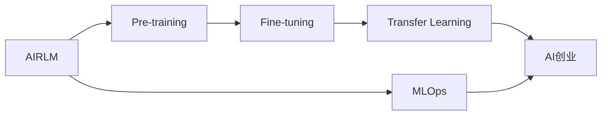

                 

# AI大模型创业战：挑战与机遇并存的现状与未来

## 1. 背景介绍

### 1.1 问题由来

近年来，人工智能大模型（AI Big Models）在各个行业取得了显著进展，尤其在自然语言处理、计算机视觉等领域的突破性成果，引领了新一轮科技革命。从GPT-3到Transformer，再到ChatGPT，大模型的能力不断提升，应用范围日益广泛。

与此同时，随着深度学习技术的成熟和普及，越来越多的创业公司开始关注AI大模型领域，意图在这一新兴赛道中分一杯羹。然而，AI大模型领域的研发、落地、商业化过程中，存在着诸多挑战与机遇。

### 1.2 问题核心关键点

大模型创业公司面临的核心挑战主要包括：
1. 数据获取和处理：大模型需要海量数据进行预训练，如何获取高质量、多样化、分布均衡的数据集，是一个重要难题。
2. 模型复杂度：大模型往往拥有上亿甚至数十亿参数，其训练、推理效率如何优化，也是需要重点解决的问题。
3. 计算资源：大规模预训练和微调需要高性能计算设备，成本较高，如何高效利用计算资源，降低成本，是创业公司的痛点之一。
4. 用户体验：如何将复杂的大模型封装成易于使用的API或服务，提升用户体验，是商业化过程中的关键。
5. 伦理与安全：大模型可能带来隐私泄露、偏见歧视等问题，如何确保模型的公平、透明、安全，需要建立完善的治理机制。

## 2. 核心概念与联系

### 2.1 核心概念概述

为更好地理解AI大模型创业过程中的挑战与机遇，本节将介绍几个关键概念：

- AI Big Models：指拥有庞大参数量的深度学习模型，如BERT、GPT、ViT等。这些模型通过在大规模无标签数据上自监督预训练，学习到通用的语言或图像表示，具备强大的推理能力。

- Pre-training & Fine-tuning：预训练指在大规模数据上自监督学习，抽取通用特征；微调则是在特定任务上，对预训练模型进行调整优化，以适应具体应用。

- Transfer Learning：将一个领域的知识迁移到另一个领域，通过微调大模型，可以在较少的标注数据下，获得较好的性能。

- MLOps：机器学习工程，涉及模型训练、部署、监控、优化等环节，是AI模型落地应用的必要技术栈。

- AI创业：利用AI技术进行创业，包括模型开发、应用场景挖掘、商业化转化等环节，需要跨学科知识。

这些核心概念之间存在紧密联系，共同构成AI大模型创业的技术框架：

1. AI Big Models通过预训练学习到通用特征，通过微调在特定任务上进行优化。
2. Transfer Learning帮助模型在特定领域内快速提高性能，减少标注数据需求。
3. MLOps提供模型生命周期的管理与优化，确保模型质量与性能。
4. AI创业将AI技术转化为产品或服务，实现商业化转化。

### 2.2 核心概念原理和架构的 Mermaid 流程图



这个流程图展示了AI大模型创业中的关键步骤及其内在联系。

## 3. 核心算法原理 & 具体操作步骤
### 3.1 算法原理概述

AI大模型的创业过程，本质上是一个模型工程化的过程，涉及模型设计、训练、优化、部署等多个环节。核心算法原理包括：

1. 模型架构：选择适合的模型架构，如Transformer、CNN等，并调整其参数、层数等超参数。
2. 数据预处理：对输入数据进行清洗、归一化、编码等预处理，确保数据质量。
3. 训练算法：选择适合模型的优化算法，如SGD、Adam等，并设置学习率、批大小等超参数。
4. 正则化：通过L2正则、Dropout等技术，防止过拟合。
5. 模型评估：在验证集上评估模型性能，选择合适的模型进行微调。
6. 微调优化：调整模型参数，使其适应特定任务。

### 3.2 算法步骤详解

1. **模型选择与设计**
   - 选择适合的预训练模型（如BERT、GPT、ViT等），并对其架构进行调整，如增加层数、修改激活函数等。
   - 设定模型参数，如隐藏层大小、学习率、批大小等超参数。

2. **数据准备与预处理**
   - 收集与任务相关的数据集，并进行清洗、标注、划分等处理。
   - 将文本数据进行分词、编码，图像数据进行归一化、扩充等预处理。

3. **模型训练**
   - 将数据集划分为训练集、验证集、测试集，并使用随机梯度下降（SGD）或Adam等优化算法进行训练。
   - 在训练过程中，定期在验证集上评估模型性能，调整超参数，防止过拟合。

4. **模型微调**
   - 在验证集上选择性能最优的模型，使用特定任务的标注数据进行微调。
   - 设定微调学习率、批大小等超参数，并使用微调优化算法（如自适应学习率、参数共享等）进行优化。

5. **模型评估与部署**
   - 在测试集上评估微调后的模型性能，进行最终验证。
   - 将模型部署到生产环境，确保其稳定性和性能。

### 3.3 算法优缺点

AI大模型的创业过程具有以下优点：

1. **泛化能力强**：大模型通过自监督预训练，能够学习到通用的特征，在特定任务上的微调能够快速提升性能。
2. **迁移学习效果显著**：通过微调，大模型能够适应新任务，减少标注样本需求，提高模型效果。
3. **模型可解释性强**：大模型基于神经网络架构，其推理过程具有较好的可解释性，便于调试和优化。

但同时也存在一些缺点：

1. **数据依赖高**：模型训练和微调需要大量高质量数据，数据获取和处理成本较高。
2. **计算资源消耗大**：大规模模型的训练和推理需要高性能设备，成本较高。
3. **模型复杂度高**：模型参数量庞大，训练和推理过程复杂，需要专业的技术团队支持。
4. **伦理与安全问题**：大模型可能带来隐私泄露、偏见歧视等问题，需要建立完善的治理机制。

### 3.4 算法应用领域

AI大模型创业技术在多个领域得到了广泛应用，例如：

1. **自然语言处理**：文本分类、情感分析、问答系统等任务，通过微调大模型，能够在较少的标注样本下获得较高性能。
2. **计算机视觉**：图像分类、目标检测、图像生成等任务，通过微调大模型，能够在图像领域内取得较好的效果。
3. **推荐系统**：通过微调大模型，能够学习用户行为和物品特征，实现个性化推荐。
4. **金融科技**：通过微调大模型，能够进行金融数据分析、风险评估等任务。
5. **医疗健康**：通过微调大模型，能够进行病历分析、诊断辅助等任务。
6. **智能制造**：通过微调大模型，能够进行生产流程优化、质量控制等任务。

## 4. 数学模型和公式 & 详细讲解 & 举例说明

### 4.1 数学模型构建

AI大模型的创业过程涉及多个数学模型，包括：

- 预训练模型：通过自监督任务，如掩码语言模型、下一步预测等，在大规模数据上进行预训练。
- 微调模型：在特定任务上，通过监督学习任务，对预训练模型进行调整优化。
- 训练算法：选择适合模型的优化算法，并设置超参数。

以文本分类任务为例，使用BERT模型进行微调：

1. 预训练模型：BERT模型通过掩码语言模型和下一句预测任务进行预训练。
2. 微调模型：将文本分类任务作为监督学习任务，对BERT模型进行微调。

### 4.2 公式推导过程

以BERT模型的微调过程为例，推导其损失函数和梯度更新公式：

1. 损失函数：
$$
\mathcal{L} = -\frac{1}{N}\sum_{i=1}^N(y_i \log(\hat{y_i}) + (1-y_i) \log(1-\hat{y_i}))
$$

2. 梯度更新：
$$
\theta \leftarrow \theta - \eta \nabla_{\theta}\mathcal{L}(\theta) - \eta\lambda\theta
$$

其中，$\theta$为模型参数，$\eta$为学习率，$y_i$为真实标签，$\hat{y_i}$为模型预测概率，$\lambda$为正则化系数。

### 4.3 案例分析与讲解

以自然语言处理（NLP）领域的BERT模型为例，分析其微调过程：

1. 数据准备：收集文本分类任务的数据集，并进行清洗、标注、划分。
2. 模型选择：选择BERT模型作为预训练模型。
3. 模型微调：将文本分类任务作为监督学习任务，对BERT模型进行微调，调整其分类层权重。
4. 模型评估：在测试集上评估微调后模型的性能，并进行验证。
5. 模型部署：将模型部署到生产环境，进行实际应用。

## 5. 项目实践：代码实例和详细解释说明
### 5.1 开发环境搭建

1. 安装Python：确保系统已安装Python 3.x版本。
2. 安装Pip：使用`pip install pip`命令安装Pip。
3. 安装TensorFlow或PyTorch：根据个人习惯选择安装TensorFlow或PyTorch。
4. 安装Hugging Face Transformers库：使用`pip install transformers`命令安装。
5. 安装GPU驱动程序：确保系统已安装NVIDIA GPU驱动程序，并启用了CUDA支持。

### 5.2 源代码详细实现

以下以BERT模型进行文本分类任务微调的示例代码：

```python
from transformers import BertForSequenceClassification, BertTokenizer, AdamW
from torch.utils.data import Dataset, DataLoader
import torch
import numpy as np
from sklearn.metrics import accuracy_score

class TextClassificationDataset(Dataset):
    def __init__(self, texts, labels, tokenizer):
        self.texts = texts
        self.labels = labels
        self.tokenizer = tokenizer
        
    def __len__(self):
        return len(self.texts)
    
    def __getitem__(self, item):
        text = self.texts[item]
        label = self.labels[item]
        encoding = self.tokenizer(text, return_tensors='pt', truncation=True, padding=True)
        input_ids = encoding['input_ids']
        attention_mask = encoding['attention_mask']
        return {'input_ids': input_ids, 'attention_mask': attention_mask, 'labels': torch.tensor(label, dtype=torch.long)}
        
# 加载数据集
train_dataset = TextClassificationDataset(train_texts, train_labels, tokenizer)
val_dataset = TextClassificationDataset(val_texts, val_labels, tokenizer)
test_dataset = TextClassificationDataset(test_texts, test_labels, tokenizer)
        
# 定义模型和优化器
model = BertForSequenceClassification.from_pretrained('bert-base-uncased', num_labels=2)
optimizer = AdamW(model.parameters(), lr=2e-5)
        
# 训练过程
epochs = 5
batch_size = 32
device = torch.device('cuda' if torch.cuda.is_available() else 'cpu')
model.to(device)
        
for epoch in range(epochs):
    model.train()
    train_loss = 0
    train_acc = 0
    for batch in DataLoader(train_dataset, batch_size=batch_size, shuffle=True):
        input_ids = batch['input_ids'].to(device)
        attention_mask = batch['attention_mask'].to(device)
        labels = batch['labels'].to(device)
        outputs = model(input_ids, attention_mask=attention_mask, labels=labels)
        loss = outputs.loss
        logits = outputs.logits
        predictions = torch.argmax(logits, dim=1)
        train_loss += loss.item()
        train_acc += accuracy_score(labels, predictions)
        optimizer.zero_grad()
        loss.backward()
        optimizer.step()
        
    print(f'Epoch {epoch+1}, train loss: {train_loss/len(train_dataset):.4f}, train acc: {train_acc/len(train_dataset):.4f}')
        
# 评估过程
model.eval()
val_loss = 0
val_acc = 0
for batch in DataLoader(val_dataset, batch_size=batch_size, shuffle=False):
    input_ids = batch['input_ids'].to(device)
    attention_mask = batch['attention_mask'].to(device)
    labels = batch['labels'].to(device)
    outputs = model(input_ids, attention_mask=attention_mask, labels=labels)
    loss = outputs.loss
    logits = outputs.logits
    predictions = torch.argmax(logits, dim=1)
    val_loss += loss.item()
    val_acc += accuracy_score(labels, predictions)
    
print(f'Validation loss: {val_loss/len(val_dataset):.4f}, validation acc: {val_acc/len(val_dataset):.4f}')

# 测试过程
model.eval()
test_loss = 0
test_acc = 0
for batch in DataLoader(test_dataset, batch_size=batch_size, shuffle=False):
    input_ids = batch['input_ids'].to(device)
    attention_mask = batch['attention_mask'].to(device)
    labels = batch['labels'].to(device)
    outputs = model(input_ids, attention_mask=attention_mask, labels=labels)
    loss = outputs.loss
    logits = outputs.logits
    predictions = torch.argmax(logits, dim=1)
    test_loss += loss.item()
    test_acc += accuracy_score(labels, predictions)
    
print(f'Test loss: {test_loss/len(test_dataset):.4f}, test acc: {test_acc/len(test_dataset):.4f}')
```

### 5.3 代码解读与分析

- 数据集准备：通过继承`Dataset`类，定义了一个`TextClassificationDataset`，用于处理文本分类任务的数据集。
- 模型定义：使用`BertForSequenceClassification`定义了一个BERT模型，并设定了其输出层结构。
- 训练过程：通过循环遍历训练集，使用`AdamW`优化器进行梯度更新，计算并记录训练损失和准确率。
- 评估过程：通过循环遍历验证集，计算并记录验证损失和准确率。
- 测试过程：通过循环遍历测试集，计算并记录测试损失和准确率。

## 6. 实际应用场景
### 6.1 智能客服系统

AI大模型在智能客服系统中的应用，可以帮助企业快速构建7x24小时不间断的智能客服。通过微调，可以使大模型能够理解用户的自然语言问题，并提供精准的解决方案。

### 6.2 金融舆情监测

在金融领域，AI大模型可以通过微调，实时监测市场舆情，及时发现异常情况，并发出预警，帮助金融机构防范风险。

### 6.3 个性化推荐系统

AI大模型在个性化推荐系统中的应用，可以通过微调，学习用户的兴趣偏好，推荐更符合用户需求的商品或内容。

### 6.4 未来应用展望

未来，AI大模型将在更多领域发挥作用，带来新的应用场景和业务模式：

1. 智慧医疗：通过微调，AI大模型可以辅助医生进行病历分析、诊断辅助等任务。
2. 智能制造：通过微调，AI大模型可以优化生产流程、质量控制等任务。
3. 智能交通：通过微调，AI大模型可以优化交通流量、预测交通拥堵等任务。
4. 智能教育：通过微调，AI大模型可以辅助教师进行教学、学生作业批改等任务。

## 7. 工具和资源推荐
### 7.1 学习资源推荐

1. 《深度学习》（Ian Goodfellow等著）：深度学习领域的经典教材，涵盖模型设计、训练优化、应用实例等多个方面。
2. 《Python深度学习》（Francois Chollet著）：TensorFlow深度学习库的官方教程，适合学习TensorFlow及其应用。
3. 《Transformers: State-of-the-art Natural Language Processing》（Hugging Face官方文档）：详细介绍了Transformer模型的架构和应用。
4. Kaggle：数据科学竞赛平台，提供大量开源数据集和机器学习竞赛，适合实践和交流。
5. GitHub：代码托管平台，提供丰富的开源项目和资源，适合查找和学习代码。

### 7.2 开发工具推荐

1. Jupyter Notebook：Python代码交互式编程工具，支持代码展示、运行、保存等功能。
2. TensorFlow：Google开源的深度学习框架，功能强大，支持多种模型和应用。
3. PyTorch：Facebook开源的深度学习框架，灵活性高，适合研究和实践。
4. Hugging Face Transformers：NLP领域的应用库，提供了多种预训练模型和工具。
5. Annotate：代码注释工具，帮助理解代码结构和逻辑。

### 7.3 相关论文推荐

1. Attention is All You Need（Transformer论文）：引入了自注意力机制，推动了NLP领域的发展。
2. BERT: Pre-training of Deep Bidirectional Transformers for Language Understanding（BERT论文）：提出预训练大模型的思路，在NLP任务上取得突破。
3. Multilingual BERT: A Multilingual Pre-trained Language Representation System（mBERT论文）：提出多语言预训练模型，推动了跨语言NLP研究。
4. GPT-3: Language Models are Unsupervised Multitask Learners（GPT-3论文）：展示了大模型在少样本学习和多任务学习中的潜力。

## 8. 总结：未来发展趋势与挑战
### 8.1 研究成果总结

1. AI大模型在自然语言处理、计算机视觉等领域取得了显著进展，推动了相关技术的发展。
2. 微调技术通过调整预训练模型，能够在特定任务上快速提升性能，减少了标注数据需求。
3. 大模型的泛化能力、迁移学习能力、模型可解释性等，使其在多个领域具有广泛应用前景。

### 8.2 未来发展趋势

1. 模型规模进一步增大：随着计算资源的提升，模型参数量将持续增加，推动模型性能提升。
2. 计算效率进一步优化：优化训练和推理算法，降低计算成本，提升模型性能。
3. 多模态融合技术发展：将文本、图像、语音等多模态信息进行融合，提升模型的综合能力。
4. 自监督学习与半监督学习：利用非监督数据进行预训练，提高模型泛化能力。
5. 知识图谱与规则库的结合：将外部知识与模型进行结合，提升模型的逻辑推理能力。

### 8.3 面临的挑战

1. 数据获取与处理：获取高质量、多样化的数据集，是模型训练和微调的关键。
2. 计算资源成本：高性能计算设备成本较高，需要有效利用和管理。
3. 模型可解释性与公平性：提高模型的可解释性和公平性，避免偏见和歧视。
4. 模型部署与优化：模型部署到生产环境后，需要持续优化和维护。

### 8.4 研究展望

1. 提升模型泛化能力：利用自监督和半监督学习，减少标注样本需求，提高模型泛化能力。
2. 优化模型结构与训练算法：通过模型裁剪、量化等技术，提升模型效率。
3. 建立完善的治理机制：确保模型的公平性、透明性和安全性。
4. 推动跨领域融合：将AI大模型与其他技术结合，拓展应用场景。

## 9. 附录：常见问题与解答

**Q1：AI大模型创业需要哪些核心技术？**

A: AI大模型创业需要以下核心技术：
1. 深度学习：掌握深度学习模型设计、训练优化等技术。
2. 自然语言处理：掌握文本分类、情感分析、问答系统等NLP任务。
3. 计算机视觉：掌握图像分类、目标检测、图像生成等CV任务。
4. 数据分析：掌握数据处理、标注、预处理等技术。
5. 模型部署：掌握模型部署、优化、监控等技术。

**Q2：AI大模型的训练和微调需要多少计算资源？**

A: AI大模型的训练和微调需要大量的计算资源，通常需要使用GPU或TPU等高性能设备。计算资源的成本较高，需要根据具体情况进行合理规划。

**Q3：AI大模型的微调效果如何保证？**

A: AI大模型的微调效果可以通过以下措施保证：
1. 数据质量：使用高质量、多样化的数据集进行微调。
2. 超参数调整：通过调整学习率、批大小、正则化等超参数，优化模型性能。
3. 模型评估：在验证集上评估模型性能，选择最优模型进行微调。
4. 模型优化：通过优化算法和模型结构，提升模型效果。

**Q4：AI大模型的伦理与安全问题如何解决？**

A: AI大模型的伦理与安全问题可以通过以下措施解决：
1. 数据隐私保护：确保数据隐私安全，采用加密、脱敏等技术。
2. 模型公平性：确保模型公平性，避免偏见和歧视。
3. 模型可解释性：提高模型的可解释性，增强透明度。
4. 模型监控：建立模型监控机制，及时发现和修复模型问题。

**Q5：AI大模型创业的商业化路径有哪些？**

A: AI大模型创业的商业化路径可以包括以下几个方面：
1. 产品化：将AI大模型封装成API或服务，供用户调用。
2. 场景应用：将AI大模型应用到具体业务场景中，实现落地。
3. 云服务：提供AI大模型的云服务，方便用户使用。
4. 生态系统：建立AI大模型生态系统，推动模型应用和创新。

**Q6：AI大模型的开发流程包括哪些环节？**

A: AI大模型的开发流程包括以下环节：
1. 需求分析：明确需求和目标，确定模型架构。
2. 数据准备：收集、清洗、标注数据集，确保数据质量。
3. 模型设计：选择适合模型的架构，调整超参数。
4. 模型训练：使用优化算法进行模型训练，防止过拟合。
5. 模型微调：在特定任务上进行微调，优化模型性能。
6. 模型评估：在验证集上评估模型性能，选择最优模型。
7. 模型部署：将模型部署到生产环境，确保性能和稳定性。
8. 模型优化：优化模型结构和算法，提升性能。
9. 模型监控：建立监控机制，确保模型安全稳定。

**Q7：AI大模型创业成功的关键因素有哪些？**

A: AI大模型创业成功的关键因素包括：
1. 团队能力：拥有技术能力强、经验丰富的团队。
2. 数据质量：获取高质量、多样化的数据集。
3. 技术创新：不断进行技术创新和改进。
4. 市场需求：明确市场需求，找到应用场景。
5. 商业化能力：具备较强的商业化能力，将AI技术转化为产品或服务。
6. 客户反馈：及时获取客户反馈，优化产品和服务。

通过系统总结AI大模型创业的技术、市场、商业化等方面的问题，相信对有志于进入这一领域的创业者有所帮助，助力其顺利实现AI大模型创业的梦想。

