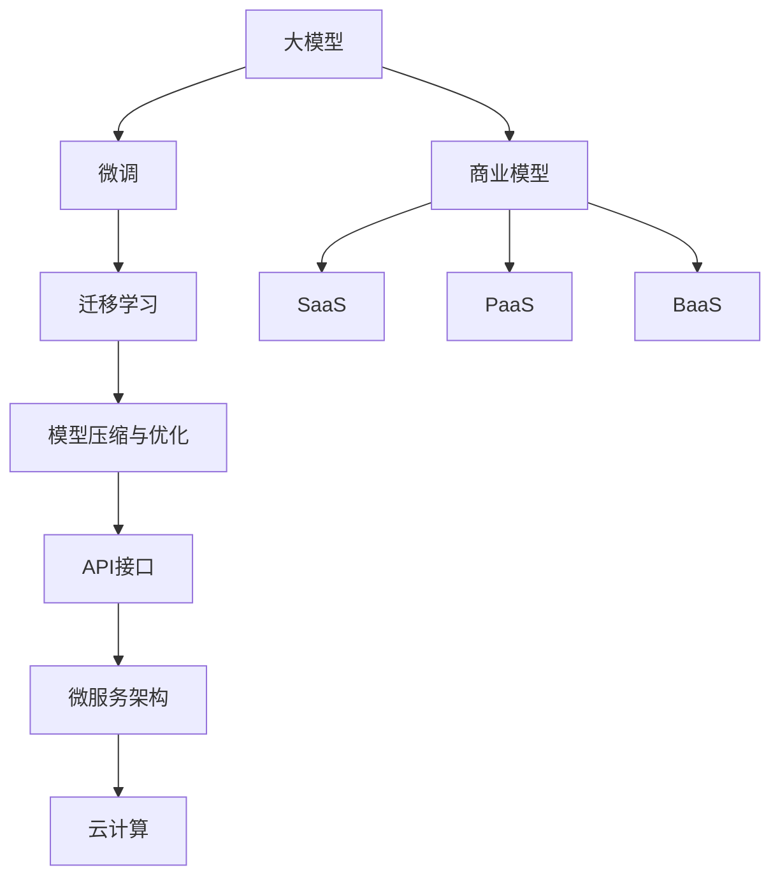

                 

## 1. 背景介绍

### 1.1 问题由来

近年来，人工智能（AI）技术的快速发展，尤其是大模型（如GPT-3、BERT等）的崛起，使得AI创业公司迎来了前所未有的机遇和挑战。大模型的强大能力在自然语言处理（NLP）、计算机视觉（CV）等领域表现出色，引发了广泛关注和应用。然而，尽管大模型的技术实力强大，如何实现商业化、创造盈利成为众多AI创业公司的核心问题。

### 1.2 问题核心关键点

1. **数据隐私和合规性**：在大模型的训练和应用过程中，数据的隐私和合规性是一个重大挑战。
2. **模型性能与成本**：如何平衡模型性能和开发成本，降低资源的消耗，是每个AI创业公司需要面对的问题。
3. **应用场景的广度和深度**：如何拓展大模型的应用场景，提升其在特定行业或领域的价值，是公司盈利的重要保障。
4. **市场竞争与合作**：在AI领域，市场竞争激烈，如何寻找合作机会，共同开发新技术，是提升市场份额的关键。
5. **商业模式设计**：选择何种商业模式，如何通过产品或服务创造持续收入，是创业公司能否成功的关键。

### 1.3 问题研究意义

研究如何实现AI大模型的商业化，对于推动AI技术的普及和应用，促进产业升级，具有重要意义：

1. **加速技术落地**：通过合理的商业模式设计，加速AI技术的商业化进程，加速产业升级。
2. **优化资源配置**：优化大模型训练和应用过程中的资源配置，降低成本，提升效率。
3. **提升市场竞争力**：通过拓展应用场景，提升模型在特定领域或行业的影响力，增强市场竞争力。
4. **实现持续盈利**：通过创新商业模式，创造持续收入，确保公司的长期可持续发展。
5. **推动行业发展**：促进AI技术在更多领域的应用，推动行业整体的数字化转型。

## 2. 核心概念与联系

### 2.1 核心概念概述

为更好地理解如何实现AI大模型的商业化，本节将介绍几个关键概念及其之间的关系：

- **大模型（Large Model）**：如GPT-3、BERT等，具有大规模参数和强大的自监督学习能力的模型，能够处理复杂任务。
- **微调（Fine-tuning）**：通过在特定任务的数据集上进行训练，优化模型在该任务上的性能，提高模型准确率。
- **迁移学习（Transfer Learning）**：通过在其他任务上预训练模型，将其知识迁移到新任务上，降低新任务训练成本。
- **模型压缩与优化（Model Compression and Optimization）**：通过剪枝、量化等技术，减小模型规模，降低资源消耗，提高模型效率。
- **API接口（API Interface）**：提供标准化的API接口，方便其他应用或平台调用，实现模型的商业化部署。
- **微服务架构（Microservices Architecture）**：通过模块化的设计，实现系统的灵活扩展和高效维护。
- **云计算（Cloud Computing）**：利用云服务提供大模型训练、推理等计算资源，降低本地资源配置要求。
- **商业模式（Business Model）**：如SaaS、PaaS、BaaS等，通过不同形式的商业活动创造收入。

这些概念之间存在紧密的联系，通过合理地应用这些技术，可以提升大模型的商业化效率，创造更多盈利机会。

### 2.2 核心概念原理和架构的 Mermaid 流程图



## 3. 核心算法原理 & 具体操作步骤

### 3.1 算法原理概述

AI大模型的商业化涉及多个核心算法和技术，包括模型训练、微调、模型压缩与优化、API接口设计和微服务架构等。这些技术相互协作，共同推动大模型的商业化进程。

- **模型训练（Training）**：使用大数据集对大模型进行预训练，提升模型性能。
- **微调（Fine-tuning）**：在特定任务的数据集上进行微调，优化模型在该任务上的表现。
- **模型压缩与优化（Model Compression and Optimization）**：通过剪枝、量化等技术，减小模型规模，降低资源消耗。
- **API接口（API Interface）**：设计标准化的API接口，方便外部应用调用。
- **微服务架构（Microservices Architecture）**：将系统拆分为多个微服务，实现灵活扩展和高效维护。
- **云计算（Cloud Computing）**：利用云服务提供计算资源，降低本地资源配置要求。

### 3.2 算法步骤详解

1. **数据准备**：收集和整理大模型训练所需的数据集。
2. **模型训练**：使用大数据集对大模型进行预训练，提升模型性能。
3. **微调**：在特定任务的数据集上进行微调，优化模型在该任务上的表现。
4. **模型压缩与优化**：通过剪枝、量化等技术，减小模型规模，降低资源消耗。
5. **API接口设计**：设计标准化的API接口，方便外部应用调用。
6. **微服务架构设计**：将系统拆分为多个微服务，实现灵活扩展和高效维护。
7. **云计算部署**：利用云服务提供计算资源，降低本地资源配置要求。
8. **商业模型设计**：选择适合的商业模式，创造持续收入。

### 3.3 算法优缺点

AI大模型商业化的核心算法和技术具有以下优点：

- **高效性**：通过预训练和微调，提升模型性能，降低训练成本。
- **可扩展性**：通过微服务架构，实现系统的灵活扩展和高效维护。
- **易用性**：通过标准化的API接口，降低使用门槛。
- **低成本**：通过云计算，降低本地资源配置要求，降低成本。

同时，这些技术也存在一些缺点：

- **资源需求高**：大模型训练和应用需要高计算资源，可能面临资源瓶颈。
- **数据隐私问题**：数据隐私和合规性是一个重大挑战。
- **模型泛化能力**：模型在特定任务上的表现可能优于通用任务，泛化能力有限。

### 3.4 算法应用领域

AI大模型商业化技术在多个领域具有广泛应用，例如：

- **NLP（自然语言处理）**：聊天机器人、情感分析、文本生成等。
- **CV（计算机视觉）**：图像识别、物体检测、视频分析等。
- **金融科技**：信用评分、风险评估、客户服务等。
- **医疗健康**：疾病诊断、病历分析、健康管理等。
- **教育**：智能辅导、学习分析、内容推荐等。

## 4. 数学模型和公式 & 详细讲解 & 举例说明

### 4.1 数学模型构建

本节将使用数学语言对AI大模型商业化过程进行更加严格的刻画。

假设大模型的训练集为 $D=\{(x_i,y_i)\}_{i=1}^N$，其中 $x_i$ 为输入样本，$y_i$ 为输出标签。大模型为 $M_{\theta}$，其中 $\theta$ 为模型参数。

定义模型 $M_{\theta}$ 在数据样本 $(x,y)$ 上的损失函数为 $\ell(M_{\theta}(x),y)$，则在数据集 $D$ 上的经验风险为：

$$
\mathcal{L}(\theta) = \frac{1}{N} \sum_{i=1}^N \ell(M_{\theta}(x_i),y_i)
$$

### 4.2 公式推导过程

以一个简单的二分类任务为例，推导损失函数的梯度计算过程。

假设模型 $M_{\theta}$ 在输入 $x$ 上的输出为 $\hat{y}=M_{\theta}(x) \in [0,1]$，表示样本属于正类的概率。真实标签 $y \in \{0,1\}$。则二分类交叉熵损失函数定义为：

$$
\ell(M_{\theta}(x),y) = -[y\log \hat{y} + (1-y)\log (1-\hat{y})]
$$

将其代入经验风险公式，得：

$$
\mathcal{L}(\theta) = -\frac{1}{N}\sum_{i=1}^N [y_i\log M_{\theta}(x_i)+(1-y_i)\log(1-M_{\theta}(x_i))]
$$

根据链式法则，损失函数对参数 $\theta_k$ 的梯度为：

$$
\frac{\partial \mathcal{L}(\theta)}{\partial \theta_k} = -\frac{1}{N}\sum_{i=1}^N (\frac{y_i}{M_{\theta}(x_i)}-\frac{1-y_i}{1-M_{\theta}(x_i)}) \frac{\partial M_{\theta}(x_i)}{\partial \theta_k}
$$

其中 $\frac{\partial M_{\theta}(x_i)}{\partial \theta_k}$ 可进一步递归展开，利用自动微分技术完成计算。

## 5. 项目实践：代码实例和详细解释说明

### 5.1 开发环境搭建

在进行AI大模型商业化实践前，我们需要准备好开发环境。以下是使用Python进行TensorFlow开发的环境配置流程：

1. 安装Anaconda：从官网下载并安装Anaconda，用于创建独立的Python环境。

2. 创建并激活虚拟环境：
```bash
conda create -n tensorflow-env python=3.8 
conda activate tensorflow-env
```

3. 安装TensorFlow：根据CUDA版本，从官网获取对应的安装命令。例如：
```bash
conda install tensorflow tensorflow-cpu -c conda-forge
```

4. 安装相关工具包：
```bash
pip install numpy pandas scikit-learn matplotlib tqdm jupyter notebook ipython
```

完成上述步骤后，即可在`tensorflow-env`环境中开始商业化实践。

### 5.2 源代码详细实现

这里以构建一个简单的聊天机器人为例，展示如何使用TensorFlow进行AI大模型的商业化部署。

首先，定义数据处理函数：

```python
import tensorflow as tf
from tensorflow.keras.layers import Input, Dense, Embedding, LSTM
from tensorflow.keras.models import Model

def create_model(vocab_size, embedding_dim, lstm_units):
    input_seq = Input(shape=(None,), dtype=tf.int32)
    x = Embedding(vocab_size, embedding_dim)(input_seq)
    x = LSTM(lstm_units)(x)
    x = Dense(vocab_size, activation='softmax')(x)
    model = Model(inputs=input_seq, outputs=x)
    return model
```

然后，定义训练和评估函数：

```python
def train_model(model, data, epochs, batch_size):
    dataset = tf.data.Dataset.from_tensor_slices(data).shuffle(buffer_size=10000).batch(batch_size)
    model.compile(optimizer='adam', loss='categorical_crossentropy', metrics=['accuracy'])
    model.fit(dataset, epochs=epochs)

def evaluate_model(model, data, batch_size):
    dataset = tf.data.Dataset.from_tensor_slices(data).batch(batch_size)
    loss, accuracy = model.evaluate(dataset)
    print(f'Loss: {loss:.4f}, Accuracy: {accuracy:.4f}')
```

最后，启动训练流程并在测试集上评估：

```python
vocab_size = 10000
embedding_dim = 128
lstm_units = 128
epochs = 10
batch_size = 32

# 创建模型
model = create_model(vocab_size, embedding_dim, lstm_units)

# 训练模型
train_data = ...
train_model(model, train_data, epochs, batch_size)

# 评估模型
test_data = ...
evaluate_model(model, test_data, batch_size)
```

以上就是使用TensorFlow进行AI大模型商业化部署的完整代码实现。可以看到，通过TensorFlow的模块化设计，可以方便地构建和训练大模型，并进行商业化部署。

### 5.3 代码解读与分析

让我们再详细解读一下关键代码的实现细节：

**create_model函数**：
- `Input`层：定义输入序列。
- `Embedding`层：将输入序列转化为嵌入向量。
- `LSTM`层：对嵌入向量进行长短期记忆处理。
- `Dense`层：将LSTM输出转换为预测向量。
- `Model`层：构建模型。

**train_model函数**：
- `Dataset.from_tensor_slices`：将数据集转化为张量切片。
- `shuffle`：对数据集进行随机打乱。
- `batch`：将数据集分为多个批次。
- `compile`：配置优化器和损失函数。
- `fit`：开始训练模型。

**evaluate_model函数**：
- `Dataset.from_tensor_slices`：将测试数据集转化为张量切片。
- `batch`：将数据集分为多个批次。
- `evaluate`：评估模型性能。

**训练流程**：
- 定义模型参数，如词汇表大小、嵌入维度、LSTM单元数等。
- 创建模型。
- 训练模型。
- 评估模型。

可以看到，TensorFlow的模块化设计使得大模型的构建和训练过程变得更加简洁和高效。开发者可以将更多精力放在数据处理和业务逻辑上，而不必过多关注底层的实现细节。

当然，工业级的系统实现还需考虑更多因素，如模型的保存和部署、超参数的自动搜索、更灵活的任务适配层等。但核心的商业化范式基本与此类似。

## 6. 实际应用场景

### 6.1 智能客服系统

AI大模型商业化技术在智能客服系统的构建中具有广泛应用。传统客服往往需要配备大量人力，高峰期响应缓慢，且一致性和专业性难以保证。使用AI大模型进行商业化部署，可以构建7x24小时不间断服务的智能客服系统，快速响应客户咨询，用自然流畅的语言解答各类常见问题。

在技术实现上，可以收集企业内部的历史客服对话记录，将问题和最佳答复构建成监督数据，在此基础上对AI大模型进行微调。微调后的模型能够自动理解用户意图，匹配最合适的答案模板进行回复。对于客户提出的新问题，还可以接入检索系统实时搜索相关内容，动态组织生成回答。如此构建的智能客服系统，能大幅提升客户咨询体验和问题解决效率。

### 6.2 金融舆情监测

金融机构需要实时监测市场舆论动向，以便及时应对负面信息传播，规避金融风险。AI大模型的商业化技术可以应用于金融舆情监测。具体而言，可以收集金融领域相关的新闻、报道、评论等文本数据，并对其进行主题标注和情感标注。在此基础上对AI大模型进行微调，使其能够自动判断文本属于何种主题，情感倾向是正面、中性还是负面。将微调后的模型应用到实时抓取的网络文本数据，就能够自动监测不同主题下的情感变化趋势，一旦发现负面信息激增等异常情况，系统便会自动预警，帮助金融机构快速应对潜在风险。

### 6.3 个性化推荐系统

当前的推荐系统往往只依赖用户的历史行为数据进行物品推荐，无法深入理解用户的真实兴趣偏好。AI大模型的商业化技术可以应用于个性化推荐系统。具体而言，可以收集用户浏览、点击、评论、分享等行为数据，提取和用户交互的物品标题、描述、标签等文本内容。将文本内容作为模型输入，用户的后续行为（如是否点击、购买等）作为监督信号，在此基础上对AI大模型进行微调。微调后的模型能够从文本内容中准确把握用户的兴趣点。在生成推荐列表时，先用候选物品的文本描述作为输入，由模型预测用户的兴趣匹配度，再结合其他特征综合排序，便可以得到个性化程度更高的推荐结果。

### 6.4 未来应用展望

随着AI大模型商业化技术的发展，未来的应用场景将更加广阔。以下是几个可能的应用方向：

- **智慧医疗**：基于AI大模型的商业化技术，可以构建智能诊疗系统，提升医疗服务的智能化水平，辅助医生诊疗，加速新药开发进程。
- **智能教育**：AI大模型的商业化技术可以应用于作业批改、学情分析、知识推荐等方面，因材施教，促进教育公平，提高教学质量。
- **智慧城市治理**：AI大模型的商业化技术可以应用于城市事件监测、舆情分析、应急指挥等环节，提高城市管理的自动化和智能化水平，构建更安全、高效的未来城市。
- **企业生产**：AI大模型的商业化技术可以应用于企业生产流程的自动化、智能化，提高生产效率和产品质量。
- **社会治理**：AI大模型的商业化技术可以应用于社会治理中的数据分析、预测预警等方面，提升社会治理的智能化水平。

## 7. 工具和资源推荐

### 7.1 学习资源推荐

为了帮助开发者系统掌握AI大模型的商业化理论基础和实践技巧，这里推荐一些优质的学习资源：

1. **TensorFlow官方文档**：提供完整的API接口和详细的使用指南，是TensorFlow开发的基础。
2. **TensorFlow Tutorials**：丰富的学习教程，覆盖从基础到高级的内容。
3. **TensorFlow Hub**：提供预训练模型和组件，方便快速构建AI应用。
4. **Google Cloud AI Platform**：提供云服务支持，降低本地资源配置要求，提升开发效率。
5. **Kaggle**：提供丰富的数据集和竞赛，提升模型性能和开发水平。

通过对这些资源的学习实践，相信你一定能够快速掌握AI大模型的商业化精髓，并用于解决实际的NLP问题。

### 7.2 开发工具推荐

高效的开发离不开优秀的工具支持。以下是几款用于AI大模型商业化开发的常用工具：

1. **TensorFlow**：基于Python的开源深度学习框架，灵活动态的计算图，适合快速迭代研究。
2. **PyTorch**：支持动态计算图，易于开发和调试，适用于研究和生产。
3. **Keras**：高级神经网络API，方便快速构建和训练模型。
4. **Jupyter Notebook**：交互式开发环境，支持代码块和数据可视化。
5. **Weights & Biases**：模型训练的实验跟踪工具，可以记录和可视化模型训练过程中的各项指标。
6. **TensorBoard**：TensorFlow配套的可视化工具，可实时监测模型训练状态，并提供丰富的图表呈现方式。

合理利用这些工具，可以显著提升AI大模型商业化任务的开发效率，加快创新迭代的步伐。

### 7.3 相关论文推荐

AI大模型商业化技术的发展源于学界的持续研究。以下是几篇奠基性的相关论文，推荐阅读：

1. **TensorFlow 2.0 White Paper**：介绍TensorFlow 2.0的设计理念和核心功能。
2. **Using Pre-trained Models for Transfer Learning**：介绍预训练模型在迁移学习中的应用。
3. **Training Pruned Neural Networks with Iterative Cutting-plane Algorithms**：介绍模型剪枝技术的最新进展。
4. **High-Performance Low-Precision Arithmetic for Deep Neural Networks: Training with Half-Precision Matrices and Full-Precision Gradients**：介绍模型量化技术的最新进展。
5. **Attention is All You Need**：介绍Transformer模型的原理和应用。
6. **Google's Natural Language Understanding Models**：介绍BERT模型的原理和应用。

这些论文代表了大模型商业化技术的发展脉络。通过学习这些前沿成果，可以帮助研究者把握学科前进方向，激发更多的创新灵感。

## 8. 总结：未来发展趋势与挑战

### 8.1 总结

本文对AI大模型商业化过程进行了全面系统的介绍。首先阐述了AI大模型商业化的背景和意义，明确了其商业化路径。其次，从原理到实践，详细讲解了模型训练、微调、模型压缩与优化、API接口设计和微服务架构等关键技术，并给出了商业化部署的完整代码实例。同时，本文还广泛探讨了AI大模型在多个领域的应用前景，展示了其商业化技术的广泛适用性。

通过本文的系统梳理，可以看到，AI大模型的商业化过程涉及多个技术环节，需要从数据、算法、工程、业务等多个维度协同发力，才能实现理想的商业效果。未来，伴随AI技术的不断发展，大模型的商业化将不断深化，为更多行业带来变革性影响。

### 8.2 未来发展趋势

展望未来，AI大模型商业化技术将呈现以下几个发展趋势：

1. **高效计算资源**：随着计算能力的提升，大模型训练和推理效率将不断提升，商业化进程加速。
2. **智能决策引擎**：AI大模型将更多地应用于智能决策引擎，提升决策的智能化水平。
3. **多模态融合**：AI大模型将更多地与视觉、听觉等模态数据结合，实现多模态智能应用。
4. **边缘计算**：AI大模型将更多地应用于边缘计算，降低延迟和带宽消耗。
5. **隐私保护**：随着数据隐私和合规性的重视，AI大模型的隐私保护技术将不断提升。
6. **自动机器学习**：AI大模型将更多地与自动机器学习（AutoML）技术结合，降低开发门槛，提升模型性能。
7. **业务流程自动化**：AI大模型将更多地应用于业务流程自动化，提升企业效率和竞争力。
8. **行业定制化**：AI大模型将更多地定制化应用于特定行业，提升行业智能化水平。

### 8.3 面临的挑战

尽管AI大模型商业化技术已经取得了显著成果，但在迈向更加智能化、普适化应用的过程中，仍面临诸多挑战：

1. **数据隐私和合规性**：数据隐私和合规性是一个重大挑战，如何平衡商业价值和隐私保护需要更多探讨。
2. **计算资源瓶颈**：大模型训练和应用需要高计算资源，可能面临资源瓶颈。
3. **模型泛化能力**：模型在特定任务上的表现可能优于通用任务，泛化能力有限。
4. **市场竞争**：AI大模型商业化市场竞争激烈，如何寻找合作机会，共同开发新技术，是提升市场份额的关键。
5. **商业模型设计**：选择何种商业模式，如何通过产品或服务创造持续收入，是创业公司能否成功的关键。

### 8.4 研究展望

面对AI大模型商业化面临的挑战，未来的研究需要在以下几个方面寻求新的突破：

1. **隐私保护技术**：开发更有效的数据隐私保护技术，确保数据安全。
2. **高效计算技术**：开发更高效的计算资源管理技术，降低成本。
3. **模型泛化技术**：提升模型泛化能力，增强模型在不同任务上的表现。
4. **自动化技术**：开发更智能的自动化技术，降低开发门槛。
5. **行业定制化**：开发更定制化的AI大模型，满足行业需求。

这些研究方向的探索，必将引领AI大模型商业化技术迈向更高的台阶，为构建智能系统和推动产业发展提供更多可能。

## 9. 附录：常见问题与解答

**Q1：如何评估AI大模型的性能？**

A: 评估AI大模型的性能通常通过以下几个指标：

1. **准确率（Accuracy）**：模型在测试集上的正确预测率。
2. **召回率（Recall）**：模型正确预测的正样本占实际正样本的比例。
3. **F1-score**：准确率和召回率的调和平均数。
4. **ROC曲线（Receiver Operating Characteristic Curve）**：显示模型在不同阈值下的真阳性率和假阳性率。
5. **混淆矩阵（Confusion Matrix）**：显示模型在不同类别上的预测结果和真实结果的对应关系。

通过综合评估这些指标，可以全面了解模型的性能表现。

**Q2：如何优化AI大模型的训练过程？**

A: 优化AI大模型的训练过程可以从以下几个方面入手：

1. **数据增强**：通过对训练数据进行扩充，增加数据的多样性，提升模型泛化能力。
2. **学习率调度**：采用自适应学习率调度策略，如学习率衰减、学习率调整等。
3. **正则化技术**：使用L2正则、Dropout等技术，防止模型过拟合。
4. **模型剪枝**：通过剪枝技术，减少模型参数，提升模型效率。
5. **量化技术**：通过量化技术，将浮点数模型转换为定点数模型，减小内存消耗。
6. **分布式训练**：使用分布式训练技术，加速模型训练。

通过综合应用这些技术，可以显著提升模型的训练效率和性能表现。

**Q3：如何选择适合的AI大模型商业化商业模式？**

A: 选择适合的AI大模型商业化商业模式，需要考虑以下几个因素：

1. **市场需求**：根据市场需求选择适合的市场模式，如SaaS、PaaS、BaaS等。
2. **商业模式成本**：考虑商业模式的运营成本，选择低成本的商业模式。
3. **市场竞争**：考虑市场竞争环境，选择有竞争力的商业模式。
4. **用户使用习惯**：考虑用户的接受和使用习惯，选择适合用户习惯的商业模式。
5. **公司资源**：考虑公司的资源和技术能力，选择适合的商业模式。

通过综合考虑这些因素，可以制定适合的AI大模型商业化商业模式，创造持续收入。

**Q4：如何降低AI大模型的计算资源需求？**

A: 降低AI大模型的计算资源需求可以从以下几个方面入手：

1. **模型压缩**：通过剪枝、量化等技术，减小模型规模，降低计算资源需求。
2. **分布式训练**：使用分布式训练技术，加速模型训练，降低计算资源需求。
3. **硬件加速**：使用GPU、TPU等硬件加速技术，提高计算效率，降低计算资源需求。
4. **模型优化**：优化模型结构，减少计算资源需求。
5. **算法优化**：优化算法，提高计算效率，降低计算资源需求。

通过综合应用这些技术，可以显著降低AI大模型的计算资源需求，提高计算效率。

**Q5：如何处理AI大模型的隐私和合规性问题？**

A: 处理AI大模型的隐私和合规性问题可以从以下几个方面入手：

1. **数据匿名化**：对数据进行匿名化处理，保护用户隐私。
2. **数据加密**：对数据进行加密处理，确保数据安全。
3. **合规审查**：进行合规审查，确保数据使用符合法律法规要求。
4. **用户同意**：获取用户同意，确保数据使用透明。
5. **隐私保护技术**：开发隐私保护技术，确保数据隐私。

通过综合应用这些技术，可以有效处理AI大模型的隐私和合规性问题，确保数据安全和用户隐私。

---

作者：禅与计算机程序设计艺术 / Zen and the Art of Computer Programming

