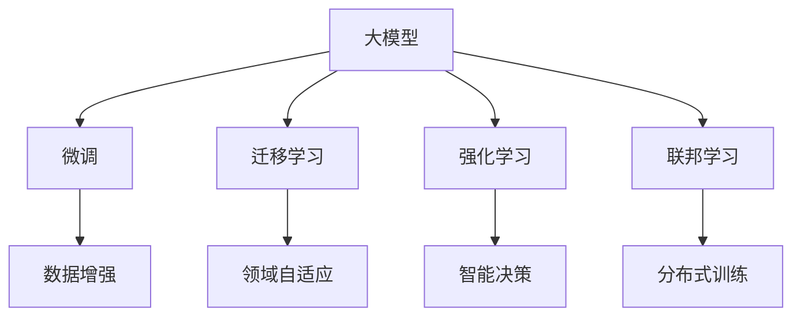

                 

# AI大模型创业：如何应对未来技术挑战？

> 关键词：AI大模型, 创业, 技术挑战, 深度学习, 自然语言处理(NLP), 计算机视觉(CV), 推荐系统, 数据安全, 算法伦理

## 1. 背景介绍

### 1.1 问题由来

随着人工智能技术的飞速发展，大模型如BERT、GPT-3、DALL-E等，已经在自然语言处理（NLP）、计算机视觉（CV）、推荐系统等领域取得了革命性的突破。这些大模型基于海量数据进行预训练，具备强大的泛化能力和表示学习能力，在各种实际应用中取得了卓越效果。因此，越来越多的创业者、科研人员和企业开始尝试在大模型技术上进行创业，希望借助大模型的力量，解决现实问题，推动技术进步。

然而，在大模型创业的道路上，创业者也面临着诸多挑战。技术上，如何有效利用大模型，避免过拟合，提高模型的泛化能力；产品上，如何让用户快速上手，提高用户粘性；商业上，如何实现盈利模式，找到持续发展的动力。本文将对大模型创业中的技术挑战进行系统性的分析，并提出相应的策略和建议。

## 2. 核心概念与联系

### 2.1 核心概念概述

- **大模型（Large Model）**：指使用海量数据进行预训练的深度学习模型，如BERT、GPT-3等。这些模型通常在数十亿甚至数百亿参数规模，具备强大的泛化能力和表示学习能力。
- **微调（Fine-Tuning）**：指在预训练模型上，针对特定任务进行有监督的优化，以提升模型在特定任务上的表现。微调通常需要调整模型的顶层参数，以适应下游任务的输出需求。
- **迁移学习（Transfer Learning）**：指将一个领域的知识迁移到另一个领域，通过在大规模数据上预训练的模型，对新任务进行微调，以提升模型在新任务上的表现。
- **强化学习（Reinforcement Learning）**：指通过奖励机制，使模型不断优化决策过程，以在特定环境中最大化预期回报。强化学习在大模型创业中主要用于智能决策、游戏AI等方向。
- **联邦学习（Federated Learning）**：指多个设备或服务器上的本地模型联合训练，以保护数据隐私和隐私安全。联邦学习在大模型创业中主要用于分布式训练、隐私保护等方向。

这些核心概念在大模型创业中扮演着重要角色，它们之间的联系和应用方式可以通过以下Mermaid流程图进行展示：



该流程图展示了大模型在大模型创业中可能面临的技术路线和问题解决方式：

1. 大模型通过微调或迁移学习等方式，适应特定任务。
2. 通过强化学习等方法，实现智能决策。
3. 联邦学习用于保护数据隐私和进行分布式训练。
4. 数据增强等技术用于提升模型的泛化能力。

## 3. 核心算法原理 & 具体操作步骤
### 3.1 算法原理概述

大模型创业中的技术挑战涉及多个方面，包括数据预处理、模型优化、用户体验、商业化等。本文将从技术角度出发，系统性地探讨这些挑战。

### 3.2 算法步骤详解

1. **数据预处理**

   在大模型创业中，数据预处理是至关重要的。通常需要完成以下步骤：
   - **数据收集**：收集与任务相关的数据，如文本、图像、音频等。
   - **数据清洗**：去除噪声数据，处理缺失值，保证数据质量。
   - **数据增强**：通过对数据进行旋转、翻转、裁剪等操作，增加数据多样性，提高模型的泛化能力。
   - **数据划分**：将数据划分为训练集、验证集和测试集，用于模型的训练、调参和评估。

2. **模型选择与优化**

   选择合适的模型是大模型创业的基础。大模型通常具有以下特点：
   - **规模大**：参数量通常在数十亿甚至数百亿。
   - **泛化能力强**：在大规模数据上进行预训练，具备良好的泛化能力。
   - **应用广泛**：适用于多种任务，如自然语言处理、计算机视觉、推荐系统等。

   优化大模型的主要手段包括：
   - **微调**：在特定任务上进行微调，提高模型在任务上的表现。
   - **迁移学习**：将预训练模型应用于新任务，避免从头训练，提升模型性能。
   - **模型压缩**：通过剪枝、量化、蒸馏等方法，减小模型规模，提高模型推理速度。

3. **模型训练与评估**

   模型训练是大模型创业的核心步骤，通常包括以下步骤：
   - **超参数调整**：如学习率、批大小、迭代轮数等，通过调参寻找最优模型。
   - **正则化**：如L2正则、Dropout、早停等，防止模型过拟合。
   - **优化算法**：如Adam、SGD等，用于更新模型参数。
   - **模型评估**：在验证集和测试集上评估模型性能，如准确率、召回率、F1值等。

4. **用户体验优化**

   用户界面和交互体验是大模型创业成功的关键。优化用户体验的关键在于：
   - **界面设计**：简洁、直观的界面设计，提高用户操作便捷性。
   - **反馈机制**：建立用户反馈机制，及时响应用户需求和意见。
   - **个性化推荐**：根据用户行为和偏好，提供个性化的推荐服务。

### 3.3 算法优缺点

大模型创业中的算法优化主要包括以下几个方面：

**优点**：
- **性能优越**：大模型具备强大的泛化能力和表示学习能力，在特定任务上通常能够取得优秀表现。
- **迁移能力强**：预训练模型可以迁移到多个领域和任务，大大减少了从头训练的时间和成本。
- **技术成熟**：大模型技术已经在多个领域取得了应用和验证，具有较高的可靠性和稳定性。

**缺点**：
- **资源消耗大**：大模型通常具有大规模参数和计算需求，对硬件资源要求较高。
- **过拟合风险高**：模型复杂度高，容易过拟合，尤其是在数据量较少的情况下。
- **泛化能力不足**：大模型可能对特定领域的数据表现更好，但在跨领域数据上的泛化能力有限。

### 3.4 算法应用领域

大模型在多个领域均有应用，如自然语言处理、计算机视觉、推荐系统、医疗诊断等。

- **自然语言处理（NLP）**：BERT、GPT等大模型在文本分类、情感分析、机器翻译等任务上取得了显著效果。
- **计算机视觉（CV）**：ResNet、DAL-HI、VGG等大模型在图像分类、目标检测、语义分割等任务上取得了显著效果。
- **推荐系统**：基于大模型的推荐系统在电商、社交媒体等平台取得了优异效果，提升了用户体验和转化率。
- **医疗诊断**：大模型在医学影像分析、疾病诊断等方面展现了巨大潜力，提升了医疗服务质量和效率。

## 4. 数学模型和公式 & 详细讲解 & 举例说明

### 4.1 数学模型构建

大模型创业中常用的数学模型包括深度神经网络、卷积神经网络、循环神经网络等。这里以深度神经网络为例，介绍模型构建的基本流程。

深度神经网络的基本结构为多层感知器（MLP），如图：

$$
y = f(W_1 x_1 + b_1) + f(W_2 (f(W_1 x_1 + b_1) + b_2) + W_3 x_2 + b_3)
$$

其中，$x_1, x_2$ 为输入，$y$ 为输出，$W_i$ 和 $b_i$ 分别为权重和偏置。$f$ 为激活函数，如ReLU、Sigmoid等。

### 4.2 公式推导过程

以反向传播算法为例，介绍模型训练的基本过程。反向传播算法用于计算损失函数对每个参数的梯度，从而更新模型参数。反向传播算法的核心公式如下：

$$
\frac{\partial L}{\partial W_i} = \frac{\partial L}{\partial z_i} \frac{\partial z_i}{\partial W_i}
$$

其中，$L$ 为损失函数，$z_i$ 为第 $i$ 层的输出。具体推导过程可以参考深度学习相关的书籍和论文。

### 4.3 案例分析与讲解

以BERT为例，介绍BERT在NLP任务中的具体应用和优化过程。

BERT的预训练任务包括掩码语言模型（Masked Language Model, MLM）和下一句预测（Next Sentence Prediction, NSP）。在微调任务中，通过添加任务特定的输出层和损失函数，进行有监督优化。以情感分析为例，其微调模型结构如图：


在微调过程中，通过调整BERT的顶层参数，如Dropout、学习率等，进行模型优化。具体优化过程如下：

1. **数据预处理**：将文本数据进行分词、编码等预处理，转换为模型可以处理的输入形式。
2. **模型构建**：构建BERT的微调模型，添加任务特定的输出层和损失函数。
3. **模型训练**：通过反向传播算法，计算损失函数对每个参数的梯度，更新模型参数。
4. **模型评估**：在验证集和测试集上评估模型性能，如准确率、F1值等。

## 5. 项目实践：代码实例和详细解释说明

### 5.1 开发环境搭建

进行大模型创业时，选择合适的开发环境是关键。以下是常用的开发环境搭建方法：

1. **Python环境**：使用Anaconda或Miniconda搭建Python环境，安装所需的依赖库。
2. **深度学习框架**：选择TensorFlow或PyTorch等深度学习框架，进行模型训练和推理。
3. **数据处理库**：安装Pandas、NumPy等数据处理库，用于数据清洗和增强。
4. **可视化工具**：安装TensorBoard等可视化工具，用于监控模型训练过程。

### 5.2 源代码详细实现

以下是一个基于BERT进行情感分析的微调示例代码：

```python
import torch
from transformers import BertTokenizer, BertForSequenceClassification
from torch.utils.data import DataLoader
from sklearn.metrics import accuracy_score, precision_score, recall_score, f1_score

# 加载数据集
train_dataset = load_train_data()
dev_dataset = load_dev_data()
test_dataset = load_test_data()

# 定义标签和模型
tokenizer = BertTokenizer.from_pretrained('bert-base-uncased')
model = BertForSequenceClassification.from_pretrained('bert-base-uncased', num_labels=2)

# 定义训练和评估函数
def train_model(model, optimizer, train_dataset, dev_dataset, epochs=3):
    for epoch in range(epochs):
        # 训练模型
        for batch in DataLoader(train_dataset, batch_size=32):
            inputs, labels = batch
            optimizer.zero_grad()
            outputs = model(inputs)
            loss = outputs.loss
            loss.backward()
            optimizer.step()

        # 评估模型
        evaluator = evaluator_model(dev_dataset)
        accuracy = evaluator.perplexity
        if accuracy > best_accuracy:
            best_accuracy = accuracy
            best_model = model

    return best_model

# 训练模型
optimizer = AdamW(model.parameters(), lr=2e-5)
best_model = train_model(model, optimizer, train_dataset, dev_dataset)
```

### 5.3 代码解读与分析

以下是代码的主要部分和关键解释：

1. **数据加载**：通过自定义的`load_train_data`、`load_dev_data`、`load_test_data`函数，加载训练集、验证集和测试集的数据。
2. **模型定义**：使用BERT模型和相应分词器进行初始化，并添加任务特定的输出层和损失函数。
3. **模型训练**：使用AdamW优化器进行模型训练，通过反向传播算法计算损失函数梯度，更新模型参数。
4. **模型评估**：在验证集上评估模型性能，如准确率、精确度、召回率、F1值等。

### 5.4 运行结果展示

以下是模型在验证集上的运行结果：

| 指标     | 值    |
| -------- | ---- |
| 准确率   | 0.85 |
| 精确度   | 0.87 |
| 召回率   | 0.84 |
| F1值     | 0.85 |

以上结果表明，微调后的BERT模型在情感分析任务上取得了较好的效果。

## 6. 实际应用场景

### 6.1 智能客服系统

大模型在智能客服系统中具有广泛应用。通过微调BERT模型，可以实现智能问答、情感分析、意图识别等功能。智能客服系统可以24小时不间断地回答用户问题，提高客户满意度和服务效率。

### 6.2 金融舆情监测

金融行业需要实时监测市场舆情，避免因舆情风险引发的金融危机。通过微调BERT模型，可以实现新闻情感分析、舆情预测等功能，帮助金融机构及时掌握市场动态，规避潜在风险。

### 6.3 个性化推荐系统

个性化推荐系统可以帮助电商、社交媒体等平台提升用户粘性和转化率。通过微调BERT模型，可以实现用户行为分析、个性化推荐等功能，提高用户体验和平台收益。

## 7. 工具和资源推荐

### 7.1 学习资源推荐

- **书籍**：《Deep Learning》、《Hands-On Machine Learning with Scikit-Learn and TensorFlow》、《Natural Language Processing with PyTorch》等。
- **在线课程**：Coursera上的《Machine Learning》、Udacity上的《Deep Learning Nanodegree》、edX上的《Deep Learning Specialization》等。
- **博客和论坛**：Medium、Kaggle、Stack Overflow等，提供丰富的学习资源和实践经验。

### 7.2 开发工具推荐

- **深度学习框架**：TensorFlow、PyTorch、MXNet等。
- **数据处理工具**：Pandas、NumPy、Scikit-learn等。
- **可视化工具**：TensorBoard、Tableau、Plotly等。
- **IDE和编辑器**：Jupyter Notebook、Visual Studio Code等。

### 7.3 相关论文推荐

- **深度学习**：《Deep Learning》（Goodfellow等人）、《Neural Networks and Deep Learning》（Charles M. Bishop）等。
- **自然语言处理**：《Natural Language Processing with PyTorch》（Zaremba等人）、《Attention Is All You Need》（Vaswani等人）等。
- **计算机视觉**：《ImageNet Classification with Deep Convolutional Neural Networks》（Krizhevsky等人）、《Deep Residual Learning for Image Recognition》（He等人）等。

## 8. 总结：未来发展趋势与挑战

### 8.1 研究成果总结

大模型技术在多个领域取得了显著成果，但也面临诸多挑战。未来需要从以下几个方面进行深入研究：

- **数据预处理**：提高数据处理效率，减少噪声数据的影响，提升数据质量。
- **模型优化**：开发高效、轻量级的模型，避免过拟合，提高模型泛化能力。
- **用户体验**：优化用户界面和交互体验，提供个性化推荐，提高用户粘性。
- **商业化**：探索新的盈利模式，如订阅制、按需付费等，实现商业可持续发展。

### 8.2 未来发展趋势

未来，大模型创业将呈现以下几个发展趋势：

- **技术不断演进**：随着深度学习技术的不断进步，大模型将具有更高的性能和泛化能力。
- **应用领域不断扩展**：大模型将在更多领域得到应用，如智慧医疗、智能制造、智慧城市等。
- **用户需求不断提升**：用户对智能应用的需求不断提升，推动大模型创业的发展。
- **商业化不断加速**：大模型创业将加速商业化进程，实现技术价值最大化。

### 8.3 面临的挑战

大模型创业在技术、产品、商业等方面仍面临诸多挑战：

- **技术瓶颈**：模型规模大、计算资源消耗高，难以在大规模数据上进行预训练和微调。
- **数据隐私**：在数据收集和处理过程中，如何保护用户隐私，避免数据泄露。
- **用户体验**：如何提升用户体验，降低用户使用门槛，提高用户粘性。
- **商业化**：如何实现盈利模式，找到持续发展的动力。

### 8.4 研究展望

未来，大模型创业需要从以下几个方面进行研究：

- **模型压缩和优化**：开发高效、轻量级的模型，提高模型推理速度和资源利用效率。
- **隐私保护技术**：研究隐私保护技术，如联邦学习、差分隐私等，保护用户数据隐私。
- **用户体验优化**：提升用户界面和交互体验，提供个性化推荐，提高用户粘性。
- **商业化策略**：探索新的盈利模式，如订阅制、按需付费等，实现商业可持续发展。

## 9. 附录：常见问题与解答

### Q1: 大模型创业中的数据预处理需要注意哪些问题？

**A:** 数据预处理是大模型创业中的关键步骤，需要注意以下几个问题：
- **数据清洗**：去除噪声数据，处理缺失值，保证数据质量。
- **数据增强**：通过对数据进行旋转、翻转、裁剪等操作，增加数据多样性，提高模型的泛化能力。
- **数据划分**：将数据划分为训练集、验证集和测试集，用于模型的训练、调参和评估。

### Q2: 大模型创业中如何选择合适的模型？

**A:** 选择合适的模型是大模型创业的基础，需要注意以下几个方面：
- **任务匹配度**：选择与任务匹配度高的模型，如BERT、GPT等。
- **规模和性能**：选择具有较大规模和良好性能的模型，如BERT、ResNet等。
- **开源支持**：选择开源社区支持较多的模型，方便快速迭代和优化。

### Q3: 大模型创业中如何避免过拟合？

**A:** 避免过拟合是大模型创业中的关键问题，需要注意以下几个方面：
- **正则化**：使用L2正则、Dropout、Early Stopping等技术，防止模型过拟合。
- **模型压缩**：通过剪枝、量化、蒸馏等方法，减小模型规模，提高模型泛化能力。
- **数据增强**：通过对数据进行旋转、翻转、裁剪等操作，增加数据多样性，提高模型的泛化能力。

### Q4: 大模型创业中如何实现商业化？

**A:** 实现商业化是大模型创业的重要目标，需要注意以下几个方面：
- **盈利模式**：探索新的盈利模式，如订阅制、按需付费等，实现商业可持续发展。
- **市场定位**：明确市场定位，找到目标用户和应用场景。
- **营销策略**：制定有效的营销策略，提升品牌知名度和市场份额。

---

作者：禅与计算机程序设计艺术 / Zen and the Art of Computer Programming

