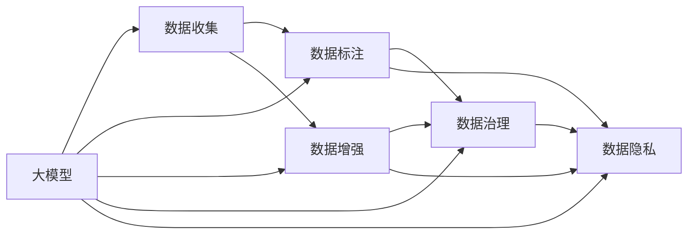

                 

# AI大模型创业：如何应对未来数据挑战？

## 1. 背景介绍

### 1.1 问题由来

随着人工智能技术的快速发展，尤其是深度学习和自然语言处理（NLP）领域的巨大突破，大模型在各种应用场景中展现出卓越的性能和广泛的应用前景。然而，尽管大模型在许多基准测试中取得了领先的成绩，但在实际应用中，尤其是在创业环境下，仍面临诸多挑战，其中最为显著的挑战之一就是数据问题。

首先，数据的质量和数量对大模型的训练和优化至关重要。数据的多样性、代表性和准确性直接影响模型的泛化能力和实际应用效果。此外，数据收集、标注和处理的成本和时间投入，对创业公司来说也是一个沉重的负担。因此，如何在有限的资源条件下，高效地获取和利用数据，是大模型创业的关键问题。

### 1.2 问题核心关键点

面对数据挑战，大模型创业公司需要综合考虑以下关键点：

- 数据收集：如何获取高质量、大规模的数据集，以满足大模型的训练需求。
- 数据标注：如何高效地标注数据，确保数据质量并降低标注成本。
- 数据增强：如何通过数据增强技术提升模型的泛化能力。
- 数据治理：如何管理和维护数据，确保数据的完整性和可用性。
- 数据隐私：如何保护用户数据隐私，遵守法律法规。

这些问题不仅关系到模型的性能和效率，还影响到公司的商业模式和可持续发展能力。因此，了解并掌握应对未来数据挑战的方法，对大模型创业至关重要。

## 2. 核心概念与联系

### 2.1 核心概念概述

为更好地理解大模型在数据挑战中的应对策略，本节将介绍几个核心概念：

- 大模型(Large Models)：指的是具有大量参数（通常超过10亿）的深度学习模型，如GPT-3、BERT等。
- 数据收集(Data Collection)：指从不同渠道获取原始数据的过程，包括网络爬虫、API接口、第三方数据提供商等。
- 数据标注(Data Annotation)：指对原始数据进行人工标注，以生成监督学习所需的训练集。
- 数据增强(Data Augmentation)：指通过一系列数据转换技术，扩充数据集，提高模型的泛化能力。
- 数据治理(Data Governance)：指制定和实施数据管理策略，确保数据质量和安全。
- 数据隐私(Data Privacy)：指保护用户隐私，遵守相关法律法规，如GDPR等。

这些概念之间的逻辑关系可以通过以下Mermaid流程图来展示：



这个流程图展示了大模型在数据挑战中的各个环节，以及各环节之间的相互关系。

## 3. 核心算法原理 & 具体操作步骤

### 3.1 算法原理概述

大模型创业的核心算法原理主要围绕数据收集、标注、增强和治理等方面展开。其核心思想是通过高效的算法和技术，在有限资源条件下，最大化数据利用效率，提高模型性能，并确保数据质量和安全。

### 3.2 算法步骤详解

#### 数据收集

数据收集是大模型创业的第一步，涉及到从不同渠道获取原始数据，并将其清洗、筛选、合并。常用的数据收集方法包括：

- 网络爬虫：使用Python等编程语言，通过API接口或网页解析技术，自动从互联网收集数据。
- API接口：与第三方数据提供商合作，获取经过预处理的数据。
- 手动输入：通过调查问卷、在线表单等方式，收集用户数据。

在数据收集过程中，需要关注数据的多样性、代表性、时效性和准确性。例如，使用网络爬虫时，需要设置合理的爬取频率和范围，以避免获取到的数据过时或重复。

#### 数据标注

数据标注是大模型训练的重要环节，通过人工标注生成监督学习所需的训练集。常用的数据标注方法包括：

- 众包标注：利用平台如Amazon Mechanical Turk、CrowdFlower等，将标注任务外包给大量人工。
- 自标注：通过半监督学习或弱监督学习技术，自动标注数据。
- 手动标注：专业团队进行高质量的标注，确保标注准确性。

在标注过程中，需要设计合理的标注流程和标准，确保标注的一致性和质量。例如，使用众包标注时，需要设置详细的标注规则和样例，并进行标注质量控制。

#### 数据增强

数据增强是通过一系列技术手段，扩充数据集，提高模型的泛化能力。常用的数据增强方法包括：

- 回译增强：使用不同的语言模型对文本进行回译，生成新的文本样本。
- 数据合成：通过数据生成模型，生成与原始数据相似但不同的样本。
- 噪声注入：在原始数据中加入噪声，生成新的数据样本。

在数据增强过程中，需要考虑增强技术的效果和成本。例如，使用回译增强时，需要选择合适的语言模型和参数，避免生成的数据质量下降。

#### 数据治理

数据治理是大模型创业的重要环节，涉及到数据的存储、管理和维护。常用的数据治理方法包括：

- 数据仓库：使用如Hadoop、Spark等技术，集中管理和存储数据。
- 数据质量控制：通过定期检查和清洗数据，确保数据的完整性和一致性。
- 数据备份：定期备份数据，防止数据丢失。

在数据治理过程中，需要制定合理的数据管理策略，确保数据的安全和可用性。例如，使用数据仓库时，需要设计合理的数据模型和索引，确保数据查询效率。

#### 数据隐私

数据隐私是大模型创业的关键问题，涉及到用户数据的保护和法律法规的遵守。常用的数据隐私保护方法包括：

- 匿名化处理：通过脱敏、加密等技术，保护用户隐私。
- 差分隐私：通过添加噪声，确保查询结果不泄露个体信息。
- 合规检查：定期检查数据处理流程，确保符合相关法律法规。

在数据隐私保护过程中，需要制定严格的数据保护策略，确保用户数据的安全和合规。例如，使用匿名化处理时，需要选择合适的脱敏技术，并定期评估数据隐私风险。

### 3.3 算法优缺点

大模型创业中的数据挑战算法具有以下优点：

- 高效性：通过高效的数据收集、标注和增强技术，可以在有限时间内获取和利用大量数据。
- 可扩展性：数据收集、标注和治理技术具有可扩展性，可以适应不同规模的创业公司。
- 成本效益：通过自动化和半自动化的标注和增强技术，降低了人力和时间成本。

然而，这些算法也存在一些缺点：

- 数据质量：自动标注和增强技术可能存在错误，需要人工校验。
- 数据隐私：数据隐私保护技术可能增加数据处理的复杂度。
- 数据存储：大规模数据存储和处理需要高性能设备和计算资源。

尽管存在这些缺点，但通过综合应用各种技术和策略，可以最大程度地克服这些缺点，确保大模型创业的成功。

### 3.4 算法应用领域

大模型创业中的数据挑战算法广泛应用于各种领域，包括但不限于以下几类：

- 自然语言处理（NLP）：用于文本分类、情感分析、机器翻译等任务。
- 计算机视觉（CV）：用于图像识别、物体检测、图像生成等任务。
- 推荐系统：用于个性化推荐、广告投放等任务。
- 金融科技（Fintech）：用于风险评估、信用评分等任务。
- 健康医疗：用于疾病诊断、医疗影像分析等任务。

在这些领域中，数据挑战算法可以帮助创业公司获取高质量的数据，提高模型的性能和泛化能力，从而实现商业成功。

## 4. 数学模型和公式 & 详细讲解 & 举例说明

### 4.1 数学模型构建

大模型创业中的数据挑战算法，涉及到多个数学模型和公式。下面以文本分类任务为例，详细讲解数学模型的构建和优化过程。

假设有一个文本分类任务，需要训练一个二分类模型。设文本特征为 $\mathbf{x} \in \mathbb{R}^n$，目标标签为 $y \in \{0,1\}$。模型参数为 $\mathbf{\theta}$，包括权重和偏置等。模型的预测输出为 $\hat{y} = \text{sigmoid}(\mathbf{\theta} \cdot \mathbf{x})$。则损失函数为交叉熵损失：

$$
L(y, \hat{y}) = -y \log \hat{y} - (1-y) \log (1-\hat{y})
$$

模型训练的目标是最大化似然函数：

$$
L(\mathbf{\theta}) = \frac{1}{N} \sum_{i=1}^N L(y_i, \hat{y}_i)
$$

其中 $N$ 为样本数量。

### 4.2 公式推导过程

在上述模型中，需要求解模型参数 $\mathbf{\theta}$，使得损失函数最小化。可以使用梯度下降算法进行求解，即：

$$
\mathbf{\theta} \leftarrow \mathbf{\theta} - \eta \nabla_{\mathbf{\theta}} L(\mathbf{\theta})
$$

其中 $\eta$ 为学习率。梯度 $\nabla_{\mathbf{\theta}} L(\mathbf{\theta})$ 可以通过反向传播算法计算，公式如下：

$$
\nabla_{\mathbf{\theta}} L(\mathbf{\theta}) = \frac{1}{N} \sum_{i=1}^N [\hat{y}_i - y_i] \nabla_{\mathbf{\theta}} \text{sigmoid}(\mathbf{\theta} \cdot \mathbf{x}_i)
$$

其中 $\nabla_{\mathbf{\theta}} \text{sigmoid}(\mathbf{\theta} \cdot \mathbf{x}_i) = \mathbf{x}_i \cdot \text{sigmoid}(\mathbf{\theta} \cdot \mathbf{x}_i) \cdot (1 - \text{sigmoid}(\mathbf{\theta} \cdot \mathbf{x}_i))$。

### 4.3 案例分析与讲解

以情感分析任务为例，分析数据挑战算法的应用效果。假设有一个情感分析数据集，包含大量的电影评论和对应的情感标签。可以使用以下步骤进行数据挑战：

1. 数据收集：使用网络爬虫从电影评论网站获取原始数据。
2. 数据清洗：去除噪声和无用信息，如特殊符号、停用词等。
3. 数据增强：使用回译增强，将文本翻译成不同语言，并使用语言模型回译回原始语言。
4. 数据标注：使用众包标注，通过标注平台将标注任务外包给大量人工。
5. 数据治理：使用数据仓库技术，集中管理和存储标注数据。
6. 数据隐私：使用差分隐私技术，确保用户数据不泄露。

通过上述步骤，可以构建高质量的情感分析数据集，用于训练大模型。

## 5. 项目实践：代码实例和详细解释说明

### 5.1 开发环境搭建

在进行数据挑战算法实践前，需要准备好开发环境。以下是使用Python进行PyTorch开发的环境配置流程：

1. 安装Anaconda：从官网下载并安装Anaconda，用于创建独立的Python环境。

2. 创建并激活虚拟环境：
```bash
conda create -n pytorch-env python=3.8 
conda activate pytorch-env
```

3. 安装PyTorch：根据CUDA版本，从官网获取对应的安装命令。例如：
```bash
conda install pytorch torchvision torchaudio cudatoolkit=11.1 -c pytorch -c conda-forge
```

4. 安装各类工具包：
```bash
pip install numpy pandas scikit-learn matplotlib tqdm jupyter notebook ipython
```

完成上述步骤后，即可在`pytorch-env`环境中开始数据挑战算法实践。

### 5.2 源代码详细实现

下面我们以情感分析任务为例，给出使用Transformers库对BERT模型进行数据挑战的PyTorch代码实现。

首先，定义情感分析任务的数据处理函数：

```python
from transformers import BertTokenizer
from torch.utils.data import Dataset
import torch

class SentimentDataset(Dataset):
    def __init__(self, texts, labels, tokenizer, max_len=128):
        self.texts = texts
        self.labels = labels
        self.tokenizer = tokenizer
        self.max_len = max_len
        
    def __len__(self):
        return len(self.texts)
    
    def __getitem__(self, item):
        text = self.texts[item]
        label = self.labels[item]
        
        encoding = self.tokenizer(text, return_tensors='pt', max_length=self.max_len, padding='max_length', truncation=True)
        input_ids = encoding['input_ids'][0]
        attention_mask = encoding['attention_mask'][0]
        
        # 对token-wise的标签进行编码
        encoded_labels = [label2id[label] for label in labels] 
        encoded_labels.extend([label2id['O']] * (self.max_len - len(encoded_labels)))
        labels = torch.tensor(encoded_labels, dtype=torch.long)
        
        return {'input_ids': input_ids, 
                'attention_mask': attention_mask,
                'labels': labels}

# 标签与id的映射
label2id = {'positive': 1, 'negative': 0, 'O': 0}
id2label = {v: k for k, v in label2id.items()}

# 创建dataset
tokenizer = BertTokenizer.from_pretrained('bert-base-cased')

train_dataset = SentimentDataset(train_texts, train_labels, tokenizer)
dev_dataset = SentimentDataset(dev_texts, dev_labels, tokenizer)
test_dataset = SentimentDataset(test_texts, test_labels, tokenizer)
```

然后，定义模型和优化器：

```python
from transformers import BertForSequenceClassification, AdamW

model = BertForSequenceClassification.from_pretrained('bert-base-cased', num_labels=len(label2id))

optimizer = AdamW(model.parameters(), lr=2e-5)
```

接着，定义训练和评估函数：

```python
from torch.utils.data import DataLoader
from tqdm import tqdm
from sklearn.metrics import classification_report

device = torch.device('cuda') if torch.cuda.is_available() else torch.device('cpu')
model.to(device)

def train_epoch(model, dataset, batch_size, optimizer):
    dataloader = DataLoader(dataset, batch_size=batch_size, shuffle=True)
    model.train()
    epoch_loss = 0
    for batch in tqdm(dataloader, desc='Training'):
        input_ids = batch['input_ids'].to(device)
        attention_mask = batch['attention_mask'].to(device)
        labels = batch['labels'].to(device)
        model.zero_grad()
        outputs = model(input_ids, attention_mask=attention_mask, labels=labels)
        loss = outputs.loss
        epoch_loss += loss.item()
        loss.backward()
        optimizer.step()
    return epoch_loss / len(dataloader)

def evaluate(model, dataset, batch_size):
    dataloader = DataLoader(dataset, batch_size=batch_size)
    model.eval()
    preds, labels = [], []
    with torch.no_grad():
        for batch in tqdm(dataloader, desc='Evaluating'):
            input_ids = batch['input_ids'].to(device)
            attention_mask = batch['attention_mask'].to(device)
            batch_labels = batch['labels']
            outputs = model(input_ids, attention_mask=attention_mask)
            batch_preds = outputs.logits.argmax(dim=2).to('cpu').tolist()
            batch_labels = batch_labels.to('cpu').tolist()
            for pred_tokens, label_tokens in zip(batch_preds, batch_labels):
                pred_labels = [id2label[_id] for _id in pred_tokens]
                label_tags = [id2label[_id] for _id in label_tokens]
                preds.append(pred_labels[:len(label_tags)])
                labels.append(label_tags)
                
    print(classification_report(labels, preds))
```

最后，启动训练流程并在测试集上评估：

```python
epochs = 5
batch_size = 16

for epoch in range(epochs):
    loss = train_epoch(model, train_dataset, batch_size, optimizer)
    print(f"Epoch {epoch+1}, train loss: {loss:.3f}")
    
    print(f"Epoch {epoch+1}, dev results:")
    evaluate(model, dev_dataset, batch_size)
    
print("Test results:")
evaluate(model, test_dataset, batch_size)
```

以上就是使用PyTorch对BERT进行情感分析任务数据挑战的完整代码实现。可以看到，得益于Transformers库的强大封装，我们可以用相对简洁的代码完成BERT模型的加载和数据挑战。

### 5.3 代码解读与分析

让我们再详细解读一下关键代码的实现细节：

**SentimentDataset类**：
- `__init__`方法：初始化文本、标签、分词器等关键组件。
- `__len__`方法：返回数据集的样本数量。
- `__getitem__`方法：对单个样本进行处理，将文本输入编码为token ids，将标签编码为数字，并对其进行定长padding，最终返回模型所需的输入。

**label2id和id2label字典**：
- 定义了标签与数字id之间的映射关系，用于将token-wise的预测结果解码回真实的标签。

**训练和评估函数**：
- 使用PyTorch的DataLoader对数据集进行批次化加载，供模型训练和推理使用。
- 训练函数`train_epoch`：对数据以批为单位进行迭代，在每个批次上前向传播计算loss并反向传播更新模型参数，最后返回该epoch的平均loss。
- 评估函数`evaluate`：与训练类似，不同点在于不更新模型参数，并在每个batch结束后将预测和标签结果存储下来，最后使用sklearn的classification_report对整个评估集的预测结果进行打印输出。

**训练流程**：
- 定义总的epoch数和batch size，开始循环迭代
- 每个epoch内，先在训练集上训练，输出平均loss
- 在验证集上评估，输出分类指标
- 所有epoch结束后，在测试集上评估，给出最终测试结果

可以看到，PyTorch配合Transformers库使得BERT数据挑战的代码实现变得简洁高效。开发者可以将更多精力放在数据处理、模型改进等高层逻辑上，而不必过多关注底层的实现细节。

当然，工业级的系统实现还需考虑更多因素，如模型的保存和部署、超参数的自动搜索、更灵活的任务适配层等。但核心的数据挑战范式基本与此类似。

## 6. 实际应用场景

### 6.1 智能客服系统

基于大模型数据挑战的对话技术，可以广泛应用于智能客服系统的构建。传统客服往往需要配备大量人力，高峰期响应缓慢，且一致性和专业性难以保证。而使用数据挑战后的对话模型，可以7x24小时不间断服务，快速响应客户咨询，用自然流畅的语言解答各类常见问题。

在技术实现上，可以收集企业内部的历史客服对话记录，将问题和最佳答复构建成监督数据，在此基础上对预训练对话模型进行数据挑战。数据挑战后的对话模型能够自动理解用户意图，匹配最合适的答案模板进行回复。对于客户提出的新问题，还可以接入检索系统实时搜索相关内容，动态组织生成回答。如此构建的智能客服系统，能大幅提升客户咨询体验和问题解决效率。

### 6.2 金融舆情监测

金融机构需要实时监测市场舆论动向，以便及时应对负面信息传播，规避金融风险。传统的人工监测方式成本高、效率低，难以应对网络时代海量信息爆发的挑战。基于大语言模型数据挑战的文本分类和情感分析技术，为金融舆情监测提供了新的解决方案。

具体而言，可以收集金融领域相关的新闻、报道、评论等文本数据，并对其进行主题标注和情感标注。在此基础上对预训练语言模型进行数据挑战，使其能够自动判断文本属于何种主题，情感倾向是正面、中性还是负面。将数据挑战后的模型应用到实时抓取的网络文本数据，就能够自动监测不同主题下的情感变化趋势，一旦发现负面信息激增等异常情况，系统便会自动预警，帮助金融机构快速应对潜在风险。

### 6.3 个性化推荐系统

当前的推荐系统往往只依赖用户的历史行为数据进行物品推荐，无法深入理解用户的真实兴趣偏好。基于大语言模型数据挑战的个性化推荐系统，可以更好地挖掘用户行为背后的语义信息，从而提供更精准、多样的推荐内容。

在实践中，可以收集用户浏览、点击、评论、分享等行为数据，提取和用户交互的物品标题、描述、标签等文本内容。将文本内容作为模型输入，用户的后续行为（如是否点击、购买等）作为监督信号，在此基础上对预训练语言模型进行数据挑战。数据挑战后的模型能够从文本内容中准确把握用户的兴趣点。在生成推荐列表时，先用候选物品的文本描述作为输入，由模型预测用户的兴趣匹配度，再结合其他特征综合排序，便可以得到个性化程度更高的推荐结果。

### 6.4 未来应用展望

随着大语言模型数据挑战技术的不断发展，基于数据挑战范式将在更多领域得到应用，为传统行业带来变革性影响。

在智慧医疗领域，基于数据挑战的医疗问答、病历分析、药物研发等应用将提升医疗服务的智能化水平，辅助医生诊疗，加速新药开发进程。

在智能教育领域，数据挑战技术可应用于作业批改、学情分析、知识推荐等方面，因材施教，促进教育公平，提高教学质量。

在智慧城市治理中，数据挑战模型可应用于城市事件监测、舆情分析、应急指挥等环节，提高城市管理的自动化和智能化水平，构建更安全、高效的未来城市。

此外，在企业生产、社会治理、文娱传媒等众多领域，基于数据挑战的人工智能应用也将不断涌现，为经济社会发展注入新的动力。相信随着技术的日益成熟，数据挑战方法将成为人工智能落地应用的重要范式，推动人工智能技术在垂直行业的规模化落地。

## 7. 工具和资源推荐

### 7.1 学习资源推荐

为了帮助开发者系统掌握大语言模型数据挑战的理论基础和实践技巧，这里推荐一些优质的学习资源：

1. 《Transformers从原理到实践》系列博文：由大模型技术专家撰写，深入浅出地介绍了Transformer原理、BERT模型、数据挑战技术等前沿话题。

2. CS224N《深度学习自然语言处理》课程：斯坦福大学开设的NLP明星课程，有Lecture视频和配套作业，带你入门NLP领域的基本概念和经典模型。

3. 《Natural Language Processing with Transformers》书籍：Transformers库的作者所著，全面介绍了如何使用Transformers库进行NLP任务开发，包括数据挑战在内的诸多范式。

4. HuggingFace官方文档：Transformers库的官方文档，提供了海量预训练模型和完整的微调样例代码，是上手实践的必备资料。

5. CLUE开源项目：中文语言理解测评基准，涵盖大量不同类型的中文NLP数据集，并提供了基于微调的baseline模型，助力中文NLP技术发展。

通过对这些资源的学习实践，相信你一定能够快速掌握大语言模型数据挑战的精髓，并用于解决实际的NLP问题。

### 7.2 开发工具推荐

高效的开发离不开优秀的工具支持。以下是几款用于大语言模型数据挑战开发的常用工具：

1. PyTorch：基于Python的开源深度学习框架，灵活动态的计算图，适合快速迭代研究。大部分预训练语言模型都有PyTorch版本的实现。

2. TensorFlow：由Google主导开发的开源深度学习框架，生产部署方便，适合大规模工程应用。同样有丰富的预训练语言模型资源。

3. Transformers库：HuggingFace开发的NLP工具库，集成了众多SOTA语言模型，支持PyTorch和TensorFlow，是进行数据挑战任务开发的利器。

4. Weights & Biases：模型训练的实验跟踪工具，可以记录和可视化模型训练过程中的各项指标，方便对比和调优。与主流深度学习框架无缝集成。

5. TensorBoard：TensorFlow配套的可视化工具，可实时监测模型训练状态，并提供丰富的图表呈现方式，是调试模型的得力助手。

6. Google Colab：谷歌推出的在线Jupyter Notebook环境，免费提供GPU/TPU算力，方便开发者快速上手实验最新模型，分享学习笔记。

合理利用这些工具，可以显著提升大语言模型数据挑战任务的开发效率，加快创新迭代的步伐。

### 7.3 相关论文推荐

大语言模型数据挑战技术的发展源于学界的持续研究。以下是几篇奠基性的相关论文，推荐阅读：

1. Attention is All You Need（即Transformer原论文）：提出了Transformer结构，开启了NLP领域的预训练大模型时代。

2. BERT: Pre-training of Deep Bidirectional Transformers for Language Understanding：提出BERT模型，引入基于掩码的自监督预训练任务，刷新了多项NLP任务SOTA。

3. Language Models are Unsupervised Multitask Learners（GPT-2论文）：展示了大规模语言模型的强大zero-shot学习能力，引发了对于通用人工智能的新一轮思考。

4. Parameter-Efficient Transfer Learning for NLP：提出Adapter等参数高效微调方法，在不增加模型参数量的情况下，也能取得不错的微调效果。

5. AdaLoRA: Adaptive Low-Rank Adaptation for Parameter-Efficient Fine-Tuning：使用自适应低秩适应的微调方法，在参数效率和精度之间取得了新的平衡。

6. Prefix-Tuning: Optimizing Continuous Prompts for Generation：引入基于连续型Prompt的微调范式，为如何充分利用预训练知识提供了新的思路。

这些论文代表了大语言模型数据挑战技术的发展脉络。通过学习这些前沿成果，可以帮助研究者把握学科前进方向，激发更多的创新灵感。

## 8. 总结：未来发展趋势与挑战

### 8.1 总结

本文对大模型数据挑战算法进行了全面系统的介绍。首先阐述了数据挑战在人工智能创业中的重要性，明确了数据挑战在模型训练和优化中的独特价值。其次，从原理到实践，详细讲解了数据挑战的数学模型和算法步骤，给出了数据挑战任务开发的完整代码实例。同时，本文还广泛探讨了数据挑战技术在多个领域的应用前景，展示了数据挑战范式的巨大潜力。

通过本文的系统梳理，可以看到，基于大模型数据挑战技术的应用场景非常广泛，为传统行业带来了巨大的变革。然而，在应用过程中，仍需面对诸多挑战，如数据质量、标注成本、隐私保护等。这些挑战需要通过持续的算法和工程改进，才能实现数据挑战算法的全面落地。

### 8.2 未来发展趋势

展望未来，大模型数据挑战技术将呈现以下几个发展趋势：

1. 数据收集技术的改进：未来，数据收集技术将更加自动化和智能化，能够高效、准确地获取大规模高质量数据。例如，使用高级爬虫技术和网络抓取API，快速获取最新新闻和社交媒体数据。

2. 数据标注工具的提升：随着自然语言处理技术的进步，数据标注工具将更加智能和高效，能够自动识别标注错误并进行修正。例如，使用半监督学习技术，结合标注工具的智能提示，提升标注质量。

3. 数据增强技术的多样化：未来，数据增强技术将更加多样化，能够生成更加多样、高质量的数据样本。例如，使用生成对抗网络（GAN）生成合成数据，增强模型的泛化能力。

4. 数据治理策略的优化：随着数据规模的不断增大，数据治理策略将更加精细化，能够实时监控和优化数据质量。例如，使用数据流处理平台，如Apache Kafka，实时处理和存储数据。

5. 数据隐私保护技术的进步：随着数据隐私保护意识的增强，数据隐私保护技术将更加先进和安全，能够有效保护用户隐私。例如，使用差分隐私技术和联邦学习技术，在保证隐私的前提下，进行模型训练和优化。

这些趋势凸显了大模型数据挑战技术的广阔前景。这些方向的探索发展，必将进一步提升大模型的性能和应用范围，为人工智能技术在各垂直行业的落地应用提供坚实基础。

### 8.3 面临的挑战

尽管大模型数据挑战技术已经取得了显著进展，但在迈向更加智能化、普适化应用的过程中，仍面临诸多挑战：

1. 数据质量：自动化标注和增强技术可能存在错误，需要人工校验。
2. 标注成本：大规模数据标注需要大量人力和时间，成本较高。
3. 数据隐私：保护用户隐私，遵守相关法律法规，如GDPR等。
4. 数据存储：大规模数据存储和处理需要高性能设备和计算资源。
5. 数据安全：数据泄露和恶意攻击的风险仍然存在，需要加强数据安全防护。

尽管存在这些挑战，但通过综合应用各种技术和策略，可以最大程度地克服这些挑战，确保大模型数据挑战的成功。

### 8.4 研究展望

未来，大模型数据挑战技术的研究方向将集中在以下几个方面：

1. 无监督和半监督学习：探索如何利用未标注数据进行模型训练，减少标注成本。

2. 多模态数据融合：研究如何将文本、图像、语音等多模态数据融合，提升模型的泛化能力。

3. 因果学习和对抗训练：研究如何引入因果学习和对抗训练技术，增强模型的鲁棒性和泛化能力。

4. 隐私保护技术：研究如何结合差分隐私和联邦学习技术，在保护隐私的前提下进行模型训练和优化。

5. 数据治理策略：研究如何通过数据流处理平台，实现实时数据监控和优化。

这些研究方向将进一步推动大模型数据挑战技术的发展，为人工智能技术在各垂直行业的落地应用提供强有力的支持。

## 9. 附录：常见问题与解答

**Q1：大模型数据挑战是否适用于所有NLP任务？**

A: 大模型数据挑战在大多数NLP任务上都能取得不错的效果，特别是对于数据量较小的任务。但对于一些特定领域的任务，如医学、法律等，仅仅依靠通用语料预训练的模型可能难以很好地适应。此时需要在特定领域语料上进一步预训练，再进行数据挑战，才能获得理想效果。此外，对于一些需要时效性、个性化很强的任务，如对话、推荐等，数据挑战方法也需要针对性的改进优化。

**Q2：数据挑战过程中如何选择合适的学习率？**

A: 数据挑战的学习率一般要比预训练时小1-2个数量级，如果使用过大的学习率，容易破坏预训练权重，导致过拟合。一般建议从1e-5开始调参，逐步减小学习率，直至收敛。也可以使用warmup策略，在开始阶段使用较小的学习率，再逐渐过渡到预设值。需要注意的是，不同的优化器(如AdamW、Adafactor等)以及不同的学习率调度策略，可能需要设置不同的学习率阈值。

**Q3：数据挑战算法在实际部署时需要注意哪些问题？**

A: 将数据挑战算法转化为实际应用，还需要考虑以下因素：

1. 模型裁剪：去除不必要的层和参数，减小模型尺寸，加快推理速度。
2. 量化加速：将浮点模型转为定点模型，压缩存储空间，提高计算效率。
3. 服务化封装：将模型封装为标准化服务接口，便于集成调用。
4. 弹性伸缩：根据请求流量动态调整资源配置，平衡服务质量和成本。
5. 监控告警：实时采集系统指标，设置异常告警阈值，确保服务稳定性。
6. 安全防护：采用访问鉴权、数据脱敏等措施，保障数据和模型安全。

大模型数据挑战为NLP应用开启了广阔的想象空间，但如何将强大的性能转化为稳定、高效、安全的业务价值，还需要工程实践的不断打磨。唯有从数据、算法、工程、业务等多个维度协同发力，才能真正实现人工智能技术在垂直行业的规模化落地。总之，数据挑战需要开发者根据具体任务，不断迭代和优化模型、数据和算法，方能得到理想的效果。

---

作者：禅与计算机程序设计艺术 / Zen and the Art of Computer Programming

