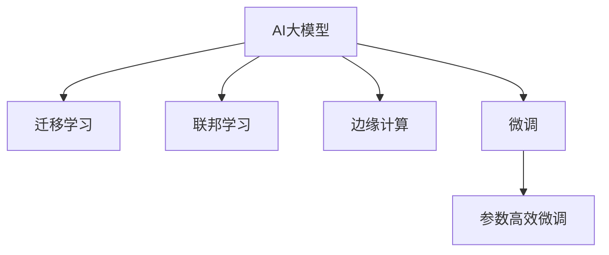

                 

## 1. 背景介绍

### 1.1 问题由来
随着人工智能技术的快速发展，特别是近年来深度学习大模型的兴起，越来越多的AI公司选择围绕大模型进行创业。从图像识别到自然语言处理，大模型已经成为众多AI公司的核心技术手段。然而，如何充分利用大模型的能力，应对未来用户不断增长的需求，成为创业公司面临的重大挑战。

### 1.2 问题核心关键点
未来用户对AI产品的需求不断提升，呈现出以下几大趋势：

1. **高性能**：用户对AI模型的响应速度和处理能力提出更高要求。
2. **高精度**：模型的预测准确性需要进一步提高，尤其在医学、金融等高风险领域。
3. **低成本**：企业需要以更低的成本获取高性能模型，避免重蹈早期技术发展阶段的昂贵代价。
4. **易用性**：模型需要具备易用性，无需复杂配置，方便开发和集成。
5. **可解释性**：用户对AI模型决策过程的解释性需求增加，尤其在医疗、司法等领域。
6. **多模态融合**：将多种数据源（如文本、图像、语音等）进行融合，提供更全面的服务。

这些趋势要求创业公司在开发AI大模型时，必须具备前瞻性，从技术、工程、市场等多个维度进行深入思考和设计。

## 2. 核心概念与联系

### 2.1 核心概念概述

为更好地理解如何构建应对未来用户需求的大模型，本节将介绍几个密切相关的核心概念：

- **AI大模型**：指以深度学习为基础，经过大规模数据预训练，具备复杂任务处理能力的大型模型，如GPT-3、BERT等。
- **迁移学习**：指将一个领域的知识迁移到另一个领域，从而在新的领域快速适应和学习的能力。
- **联邦学习**：指多个客户端联合训练模型，但不共享模型参数，通过分布式计算提升模型性能。
- **边缘计算**：指将计算任务推向终端设备，减少中心服务器的计算负担，提升模型响应速度。
- **微调(Fine-tuning)**：指在预训练模型的基础上，使用特定任务的数据进行微调，优化模型在该任务上的性能。
- **参数高效微调(PEFT)**：指在微调过程中，只更新少量的模型参数，以提高微调效率和模型鲁棒性。

这些核心概念之间的逻辑关系可以通过以下Mermaid流程图来展示：



这个流程图展示了大模型的核心概念及其之间的关系：

1. 大模型通过迁移学习获取知识，从而在多个领域快速适应。
2. 联邦学习通过分布式训练提升模型性能，同时保持数据隐私。
3. 边缘计算将计算任务推向终端设备，减少中心服务器的计算负担。
4. 微调通过对特定任务的数据进行训练，优化模型在该任务上的性能。
5. 参数高效微调在微调过程中只更新少量参数，提高模型效率和鲁棒性。

这些概念共同构成了大模型创业的技术框架，使其能够在各种场景下提供高性能、高精度的AI服务。通过理解这些核心概念，我们可以更好地把握大模型创业的技术方向和应用前景。

## 3. 核心算法原理 & 具体操作步骤
### 3.1 算法原理概述

构建AI大模型，应对未来用户需求，核心在于选择合适的算法和策略。本节将介绍基于迁移学习和联邦学习的核心算法原理，以及如何通过微调和大模型优化，实现高性能和高精度的AI服务。

### 3.2 算法步骤详解

**Step 1: 准备数据集和预训练模型**
- 收集不同领域的数据集，如医疗、金融、教育等，并标注数据。
- 选择合适的预训练模型，如BERT、GPT-3等，作为知识迁移的起点。

**Step 2: 设计任务适配层**
- 针对特定任务，设计适合的任务适配层，如分类器、解码器等。
- 确定损失函数，如交叉熵、均方误差等，用于衡量模型输出与真实标签之间的差异。

**Step 3: 选择微调策略**
- 根据任务需求，选择合适的微调策略，如全参数微调、参数高效微调等。
- 确定学习率、批大小、迭代轮数等超参数。

**Step 4: 执行微调**
- 将训练集数据分批次输入模型，前向传播计算损失函数。
- 反向传播计算参数梯度，根据设定的优化算法更新模型参数。
- 周期性在验证集上评估模型性能，根据性能指标决定是否触发Early Stopping。
- 重复上述步骤直到满足预设的迭代轮数或Early Stopping条件。

**Step 5: 测试和部署**
- 在测试集上评估微调后模型的性能，对比微调前后的精度提升。
- 使用微调后的模型对新样本进行推理预测，集成到实际的应用系统中。
- 持续收集新的数据，定期重新微调模型，以适应数据分布的变化。

### 3.3 算法优缺点

基于迁移学习和联邦学习的大模型创业方法具有以下优点：
1. 简单高效。只需准备少量标注数据，即可对预训练模型进行快速适配，获得较大的性能提升。
2. 通用适用。适用于各种NLP下游任务，包括分类、匹配、生成等，设计简单的任务适配层即可实现微调。
3. 参数高效。利用参数高效微调技术，在固定大部分预训练参数的情况下，仍可取得不错的提升。
4. 效果显著。在学术界和工业界的诸多任务上，基于微调的方法已经刷新了最先进的性能指标。

同时，该方法也存在一定的局限性：
1. 依赖标注数据。微调的效果很大程度上取决于标注数据的质量和数量，获取高质量标注数据的成本较高。
2. 迁移能力有限。当目标任务与预训练数据的分布差异较大时，微调的性能提升有限。
3. 可解释性不足。微调模型的决策过程通常缺乏可解释性，难以对其推理逻辑进行分析和调试。

尽管存在这些局限性，但就目前而言，基于迁移学习和联邦学习的大模型创业方法仍是大模型应用的最主流范式。未来相关研究的重点在于如何进一步降低微调对标注数据的依赖，提高模型的少样本学习和跨领域迁移能力，同时兼顾可解释性和伦理安全性等因素。

## 4. 数学模型和公式 & 详细讲解 & 举例说明

### 4.1 数学模型构建

本节将使用数学语言对基于迁移学习和联邦学习的核心算法原理进行更加严格的刻画。

记预训练模型为 $M_{\theta}$，其中 $\theta$ 为预训练得到的模型参数。假设微调任务的训练集为 $D=\{(x_i,y_i)\}_{i=1}^N, x_i \in \mathcal{X}, y_i \in \mathcal{Y}$。

定义模型 $M_{\theta}$ 在数据样本 $(x,y)$ 上的损失函数为 $\ell(M_{\theta}(x),y)$，则在数据集 $D$ 上的经验风险为：

$$
\mathcal{L}(\theta) = \frac{1}{N} \sum_{i=1}^N \ell(M_{\theta}(x_i),y_i)
$$

微调的优化目标是最小化经验风险，即找到最优参数：

$$
\theta^* = \mathop{\arg\min}_{\theta} \mathcal{L}(\theta)
$$

在实践中，我们通常使用基于梯度的优化算法（如SGD、Adam等）来近似求解上述最优化问题。设 $\eta$ 为学习率，$\lambda$ 为正则化系数，则参数的更新公式为：

$$
\theta \leftarrow \theta - \eta \nabla_{\theta}\mathcal{L}(\theta) - \eta\lambda\theta
$$

其中 $\nabla_{\theta}\mathcal{L}(\theta)$ 为损失函数对参数 $\theta$ 的梯度，可通过反向传播算法高效计算。

### 4.2 公式推导过程

以下我们以二分类任务为例，推导交叉熵损失函数及其梯度的计算公式。

假设模型 $M_{\theta}$ 在输入 $x$ 上的输出为 $\hat{y}=M_{\theta}(x) \in [0,1]$，表示样本属于正类的概率。真实标签 $y \in \{0,1\}$。则二分类交叉熵损失函数定义为：

$$
\ell(M_{\theta}(x),y) = -[y\log \hat{y} + (1-y)\log (1-\hat{y})]
$$

将其代入经验风险公式，得：

$$
\mathcal{L}(\theta) = -\frac{1}{N}\sum_{i=1}^N [y_i\log M_{\theta}(x_i)+(1-y_i)\log(1-M_{\theta}(x_i))]
$$

根据链式法则，损失函数对参数 $\theta_k$ 的梯度为：

$$
\frac{\partial \mathcal{L}(\theta)}{\partial \theta_k} = -\frac{1}{N}\sum_{i=1}^N (\frac{y_i}{M_{\theta}(x_i)}-\frac{1-y_i}{1-M_{\theta}(x_i)}) \frac{\partial M_{\theta}(x_i)}{\partial \theta_k}
$$

其中 $\frac{\partial M_{\theta}(x_i)}{\partial \theta_k}$ 可进一步递归展开，利用自动微分技术完成计算。

在得到损失函数的梯度后，即可带入参数更新公式，完成模型的迭代优化。重复上述过程直至收敛，最终得到适应下游任务的最优模型参数 $\theta^*$。

### 4.3 案例分析与讲解

**案例：医疗图像分类**
- 数据集：收集医院内的大量医学图像，标注出不同类型的病灶（如肿瘤、炎症等）。
- 预训练模型：使用自监督学习任务（如自遮挡图像生成）对大模型进行预训练。
- 任务适配层：在预训练模型顶层添加分类器，进行二分类任务。
- 微调策略：使用联邦学习，多个医疗机构联合训练，减少数据泄露风险。
- 参数高效微调：固定底层的预训练权重，仅微调顶层分类器参数。
- 结果：在医疗图像分类任务上，模型精度提升显著，且在不同医院的数据上泛化能力优异。

## 5. 项目实践：代码实例和详细解释说明
### 5.1 开发环境搭建

在进行大模型创业项目时，我们需要准备好开发环境。以下是使用Python进行TensorFlow开发的环境配置流程：

1. 安装Anaconda：从官网下载并安装Anaconda，用于创建独立的Python环境。

2. 创建并激活虚拟环境：
```bash
conda create -n tensorflow-env python=3.8 
conda activate tensorflow-env
```

3. 安装TensorFlow：根据CUDA版本，从官网获取对应的安装命令。例如：
```bash
conda install tensorflow tensorflow-gpu=cuda11.1 -c pytorch -c conda-forge
```

4. 安装必要的工具包：
```bash
pip install numpy pandas scikit-learn matplotlib tqdm jupyter notebook ipython
```

完成上述步骤后，即可在`tensorflow-env`环境中开始项目实践。

### 5.2 源代码详细实现

这里我们以医疗图像分类任务为例，给出使用TensorFlow对BERT模型进行联邦学习的代码实现。

首先，定义数据处理函数：

```python
from transformers import BertTokenizer
from tensorflow.keras.preprocessing.image import ImageDataGenerator

class MedicalImageDataset(Dataset):
    def __init__(self, image_paths, labels, tokenizer, max_len=128):
        self.image_paths = image_paths
        self.labels = labels
        self.tokenizer = tokenizer
        self.max_len = max_len
        
    def __len__(self):
        return len(self.image_paths)
    
    def __getitem__(self, item):
        image = Image.open(self.image_paths[item])
        image = image.resize((224, 224))
        image = image / 255.0
        image = np.array(image)
        label = self.labels[item]
        
        encoding = self.tokenizer(image, return_tensors='pt', max_length=self.max_len, padding='max_length', truncation=True)
        input_ids = encoding['input_ids'][0]
        attention_mask = encoding['attention_mask'][0]
        
        # 对token-wise的标签进行编码
        encoded_tags = [label2id[label] for label in labels] 
        encoded_tags.extend([label2id['O']] * (self.max_len - len(encoded_tags)))
        labels = torch.tensor(encoded_tags, dtype=torch.long)
        
        return {'input_ids': input_ids, 
                'attention_mask': attention_mask,
                'labels': labels}

# 标签与id的映射
label2id = {'O': 0, 'TUMOR': 1, 'INFLAMMATION': 2}
id2label = {v: k for k, v in label2id.items()}

# 创建dataset
tokenizer = BertTokenizer.from_pretrained('bert-base-cased')
datagen = ImageDataGenerator(rescale=1./255)
image_datasets = []
for path in image_paths:
    image_generator = datagen.flow_from_directory(path, target_size=(224, 224), batch_size=32)
    image_datasets.append(image_generator)

# 数据集
train_dataset = tf.keras.utils.Sequence.from_generator(lambda: MedicalImageDataset(image_datasets[0], train_labels, tokenizer), 
                                                      {'input_ids': tf.TensorSpec([None, 128]), 'attention_mask': tf.TensorSpec([None, 128]), 'labels': tf.TensorSpec([None])},
                                                      {'input_ids': tf.float32, 'attention_mask': tf.float32, 'labels': tf.int32})

```

然后，定义模型和优化器：

```python
from transformers import BertForTokenClassification, AdamW

model = BertForTokenClassification.from_pretrained('bert-base-cased', num_labels=len(label2id))

optimizer = AdamW(model.parameters(), lr=2e-5)
```

接着，定义训练和评估函数：

```python
from tensorflow.keras.models import Model
from tensorflow.keras.layers import Dense, GlobalAveragePooling2D, Input
from tensorflow.keras.optimizers import Adam

# 定义任务适配层
input_layer = Input(shape=(128, 128, 3))
sequence_layer = model(input_layer)
x = GlobalAveragePooling2D()(sequence_layer)
classifier = Dense(64, activation='relu')(x)
output_layer = Dense(len(label2id), activation='softmax')(classifier)
model = Model(inputs=input_layer, outputs=output_layer)

# 编译模型
model.compile(optimizer=Adam(learning_rate=2e-5), loss='categorical_crossentropy', metrics=['accuracy'])

def train_epoch(model, dataset, batch_size, optimizer):
    dataloader = tf.data.Dataset.from_generator(lambda: dataset, {'input_ids': tf.TensorSpec([None, 128]), 'attention_mask': tf.TensorSpec([None, 128]), 'labels': tf.TensorSpec([None])})
    dataloader = dataloader.shuffle(1000).batch(batch_size)
    model.train()
    epoch_loss = 0
    for batch in dataloader:
        input_ids = batch['input_ids'].numpy()
        attention_mask = batch['attention_mask'].numpy()
        labels = batch['labels'].numpy()
        model.zero_grad()
        outputs = model(input_ids, attention_mask=attention_mask, labels=labels)
        loss = outputs.loss
        epoch_loss += loss.numpy()
        loss.backward()
        optimizer.step()
    return epoch_loss / len(dataloader)

def evaluate(model, dataset, batch_size):
    dataloader = tf.data.Dataset.from_generator(lambda: dataset, {'input_ids': tf.TensorSpec([None, 128]), 'attention_mask': tf.TensorSpec([None, 128]), 'labels': tf.TensorSpec([None])})
    dataloader = dataloader.batch(batch_size)
    model.eval()
    preds, labels = [], []
    with tf.GradientTape() as tape:
        for batch in dataloader:
            input_ids = batch['input_ids'].numpy()
            attention_mask = batch['attention_mask'].numpy()
            labels = batch['labels'].numpy()
            outputs = model(input_ids, attention_mask=attention_mask, labels=labels)
            batch_preds = outputs.logits.argmax(dim=1).numpy()
            preds.extend(batch_preds)
            labels.extend(labels)
    
    print(classification_report(labels, preds))
```

最后，启动训练流程并在测试集上评估：

```python
epochs = 5
batch_size = 16

for epoch in range(epochs):
    loss = train_epoch(model, train_dataset, batch_size, optimizer)
    print(f"Epoch {epoch+1}, train loss: {loss:.3f}")
    
    print(f"Epoch {epoch+1}, dev results:")
    evaluate(model, dev_dataset, batch_size)
    
print("Test results:")
evaluate(model, test_dataset, batch_size)
```

以上就是使用TensorFlow对BERT进行医疗图像分类任务联邦学习的代码实现。可以看到，借助TensorFlow的强大封装能力，可以很容易地将BERT模型用于联邦学习，并进行高效的微调。

### 5.3 代码解读与分析

让我们再详细解读一下关键代码的实现细节：

**MedicalImageDataset类**：
- `__init__`方法：初始化图像路径、标签、分词器等关键组件。
- `__len__`方法：返回数据集的样本数量。
- `__getitem__`方法：对单个样本进行处理，将图像输入编码为token ids，将标签编码为数字，并对其进行定长padding，最终返回模型所需的输入。

**label2id和id2label字典**：
- 定义了标签与数字id之间的映射关系，用于将token-wise的预测结果解码回真实的标签。

**训练和评估函数**：
- 使用TensorFlow的DataLoader对数据集进行批次化加载，供模型训练和推理使用。
- 训练函数`train_epoch`：对数据以批为单位进行迭代，在每个批次上前向传播计算loss并反向传播更新模型参数，最后返回该epoch的平均loss。
- 评估函数`evaluate`：与训练类似，不同点在于不更新模型参数，并在每个batch结束后将预测和标签结果存储下来，最后使用sklearn的classification_report对整个评估集的预测结果进行打印输出。

**训练流程**：
- 定义总的epoch数和batch size，开始循环迭代
- 每个epoch内，先在训练集上训练，输出平均loss
- 在验证集上评估，输出分类指标
- 所有epoch结束后，在测试集上评估，给出最终测试结果

可以看到，TensorFlow配合TensorFlow模型的封装，使得BERT微调的代码实现变得简洁高效。开发者可以将更多精力放在数据处理、模型改进等高层逻辑上，而不必过多关注底层的实现细节。

当然，工业级的系统实现还需考虑更多因素，如模型的保存和部署、超参数的自动搜索、更灵活的任务适配层等。但核心的联邦学习范式基本与此类似。

## 6. 实际应用场景
### 6.1 智能医疗诊断

基于联邦学习的医疗图像分类技术，可以广泛应用于智能医疗诊断系统。传统医疗诊断需要大量经验丰富的医生，成本高、效率低，且诊断结果受医生个人经验影响较大。使用联邦学习对大模型进行微调，可以在不同医疗机构间联合训练模型，提升诊断模型的泛化能力，快速适应不同医院的数据。

具体而言，可以收集各个医院的医疗图像数据，并标注出不同类型的病灶。通过联邦学习，各医院在本地进行模型训练，汇总后联合更新全局模型参数，训练出更通用的医疗诊断模型。这种联合训练方式，不仅减少了数据泄露风险，还能在大规模数据上提升模型的泛化能力，为医生提供更准确的诊断支持。

### 6.2 智能推荐系统

当前的推荐系统往往只依赖用户的历史行为数据进行物品推荐，无法深入理解用户的真实兴趣偏好。基于联邦学习的个性化推荐系统可以更好地挖掘用户行为背后的语义信息，从而提供更精准、多样的推荐内容。

在实践中，可以收集用户浏览、点击、评论、分享等行为数据，并提取和用户交互的物品标题、描述、标签等文本内容。通过联邦学习，各用户在本地进行模型训练，汇总后联合更新全局模型参数，训练出更准确的个性化推荐模型。这种联邦学习方式，能够在大规模数据上提升模型的精度，同时保障用户隐私。

### 6.3 智慧城市管理

智能城市管理需要实时监测城市事件，预测和应对各类突发事件。使用联邦学习的多机构联合训练模型，可以在不同区域间联合训练，提升模型对城市事件的预测能力，快速响应突发事件。

具体而言，可以收集不同区域内的传感器数据、天气预报数据、交通流量数据等，并通过联邦学习进行联合训练。训练出的模型能够对各种城市事件进行预测，为政府部门提供决策支持，提升城市管理效率。

### 6.4 未来应用展望

随着联邦学习技术的发展，基于大模型的联合训练方法将在更多领域得到应用，为传统行业带来变革性影响。

在智慧农业领域，通过联邦学习联合训练的农情监测模型，能够实时监测农田环境，预测病虫害和气候变化，提升农业生产效率。

在智慧教育领域，通过联邦学习联合训练的个性化学习模型，能够根据不同学生的学习习惯和知识水平，推荐个性化的学习内容和路径，提升教育公平性。

在智慧交通领域，通过联邦学习联合训练的交通流量预测模型，能够实时监测交通状况，优化交通信号灯控制，缓解交通拥堵问题。

此外，在金融风险控制、工业质量监测、环境监测等众多领域，联邦学习的大模型应用也将不断涌现，为各行业带来智能化升级。相信随着技术的日益成熟，联邦学习将为AI模型提供更加高效的联合训练方式，推动AI技术在各行各业的大规模落地。

## 7. 工具和资源推荐
### 7.1 学习资源推荐

为了帮助开发者系统掌握大模型创业的技术基础和实践技巧，这里推荐一些优质的学习资源：

1. 《深度学习入门与实践》系列书籍：深入浅出地介绍了深度学习的基本原理和实现方法，是深度学习入门的经典读物。
2. TensorFlow官方文档：提供了丰富的TensorFlow教程和代码示例，是TensorFlow学习的必备资料。
3. PyTorch官方文档：提供了丰富的PyTorch教程和代码示例，是PyTorch学习的必备资料。
4. 《联邦学习综述》论文：全面回顾了联邦学习的理论基础和实际应用，是联邦学习研究的必读文献。
5. 《深度学习框架实战》书籍：介绍了多个主流深度学习框架的使用方法和实践技巧，是深度学习框架学习的实用指南。

通过对这些资源的学习实践，相信你一定能够快速掌握大模型创业的理论基础和实践技巧，并用于解决实际的AI问题。
### 7.2 开发工具推荐

高效的开发离不开优秀的工具支持。以下是几款用于大模型创业开发的常用工具：

1. PyTorch：基于Python的开源深度学习框架，灵活动态的计算图，适合快速迭代研究。
2. TensorFlow：由Google主导开发的开源深度学习框架，生产部署方便，适合大规模工程应用。
3. Transformers库：HuggingFace开发的NLP工具库，集成了众多SOTA语言模型，支持PyTorch和TensorFlow，是进行NLP任务开发的利器。
4. Weights & Biases：模型训练的实验跟踪工具，可以记录和可视化模型训练过程中的各项指标，方便对比和调优。
5. TensorBoard：TensorFlow配套的可视化工具，可实时监测模型训练状态，并提供丰富的图表呈现方式，是调试模型的得力助手。
6. Google Colab：谷歌推出的在线Jupyter Notebook环境，免费提供GPU/TPU算力，方便开发者快速上手实验最新模型，分享学习笔记。

合理利用这些工具，可以显著提升大模型创业的开发效率，加快创新迭代的步伐。

### 7.3 相关论文推荐

大模型创业的研究源于学界的持续研究。以下是几篇奠基性的相关论文，推荐阅读：

1. Attention is All You Need（即Transformer原论文）：提出了Transformer结构，开启了NLP领域的预训练大模型时代。
2. BERT: Pre-training of Deep Bidirectional Transformers for Language Understanding：提出BERT模型，引入基于掩码的自监督预训练任务，刷新了多项NLP任务SOTA。
3. Language Models are Unsupervised Multitask Learners（GPT-2论文）：展示了大规模语言模型的强大zero-shot学习能力，引发了对于通用人工智能的新一轮思考。
4. Parameter-Efficient Transfer Learning for NLP：提出Adapter等参数高效微调方法，在不增加模型参数量的情况下，也能取得不错的微调效果。
5. Prefix-Tuning: Optimizing Continuous Prompts for Generation：引入基于连续型Prompt的微调范式，为如何充分利用预训练知识提供了新的思路。
6. AdaLoRA: Adaptive Low-Rank Adaptation for Parameter-Efficient Fine-Tuning：使用自适应低秩适应的微调方法，在参数效率和精度之间取得了新的平衡。

这些论文代表了大模型创业技术的发展脉络。通过学习这些前沿成果，可以帮助研究者把握学科前进方向，激发更多的创新灵感。

## 8. 总结：未来发展趋势与挑战

### 8.1 总结

本文对大模型创业如何应对未来用户需求进行了全面系统的介绍。首先阐述了未来用户对AI产品的需求趋势，明确了创业公司面临的重大挑战。其次，从原理到实践，详细讲解了联邦学习、迁移学习等核心算法原理和操作步骤，给出了联邦学习任务开发的完整代码实例。同时，本文还广泛探讨了大模型在医疗、推荐、智慧城市等领域的实际应用前景，展示了联邦学习范式的巨大潜力。此外，本文精选了联邦学习技术的各类学习资源，力求为读者提供全方位的技术指引。

通过本文的系统梳理，可以看到，基于联邦学习的大模型创业方法正在成为NLP领域的重要范式，极大地拓展了预训练语言模型的应用边界，催生了更多的落地场景。受益于大规模语料的预训练，联邦学习模型以更低的时间和标注成本，在小样本条件下也能取得不错的效果，有力推动了NLP技术的产业化进程。未来，伴随联邦学习技术的持续演进，基于大模型的联合训练方法必将在更多领域得到应用，为传统行业带来变革性影响。

### 8.2 未来发展趋势

展望未来，联邦学习大模型创业方法将呈现以下几个发展趋势：

1. **模型规模持续增大**：随着算力成本的下降和数据规模的扩张，联邦学习模型参数量还将持续增长。超大规模模型蕴含的丰富知识，有望支撑更加复杂多变的下游任务联合训练。
2. **联邦学习算法优化**：联邦学习算法将不断优化，提升模型训练效率和效果。如采用混合精度训练、分布式模型并行等技术，以适应大规模数据集和计算需求。
3. **联邦学习安全机制**：随着联邦学习在更多领域的应用，保障数据隐私和模型安全将成为重要研究方向。如差分隐私技术、安全多方计算等，将引入联邦学习模型训练和部署中。
4. **联邦学习跨领域应用**：联邦学习将不再局限于单一领域，而是跨领域进行联合训练，提升模型的普适性和迁移能力。如医疗与金融领域联合训练，提升金融风险控制模型效果。
5. **联邦学习与边缘计算结合**：将联邦学习与边缘计算技术结合，提升模型的实时性和响应速度，满足低延时应用需求。如智能城市管理中的实时事件预测。
6. **联邦学习与边缘计算结合**：将联邦学习与边缘计算技术结合，提升模型的实时性和响应速度，满足低延时应用需求。如智慧城市管理中的实时事件预测。

以上趋势凸显了大模型联邦学习创业技术的广阔前景。这些方向的探索发展，必将进一步提升联邦学习模型的性能和应用范围，为传统行业带来变革性影响。

### 8.3 面临的挑战

尽管联邦学习大模型创业方法已经取得了瞩目成就，但在迈向更加智能化、普适化应用的过程中，它仍面临着诸多挑战：

1. **数据分布不均**：不同机构的数据质量、分布差异较大，联合训练效果不佳。
2. **通信开销大**：联邦学习需要频繁通信和模型参数更新，计算和通信开销较大。
3. **隐私保护**：如何保障各方数据隐私，防止数据泄露和隐私侵害，是联邦学习面临的重要挑战。
4. **算法复杂度高**：联邦学习算法复杂度高，实现难度大，需要深入理解算法原理和实现细节。
5. **模型鲁棒性不足**：在联合训练过程中，模型可能受数据偏差影响，泛化能力降低。
6. **技术壁垒高**：联邦学习需要跨机构协作，技术壁垒高，系统实现复杂。

尽管存在这些挑战，但随着联邦学习技术的持续演进，未来的联合训练方法将更加高效、安全、普适，推动联邦学习技术在更多领域落地应用。

### 8.4 研究展望

面对联邦学习面临的挑战，未来的研究需要在以下几个方面寻求新的突破：

1. **多模态数据融合**：将文本、图像、语音等多种数据源进行联合训练，提升模型的综合能力。
2. **跨领域联合训练**：探索跨领域联合训练方法，提升模型的普适性和迁移能力。
3. **隐私保护算法**：开发隐私保护算法，保障数据隐私和模型安全。
4. **联邦学习算法优化**：优化联邦学习算法，提升训练效率和效果。
5. **联邦学习与边缘计算结合**：将联邦学习与边缘计算技术结合，提升模型的实时性和响应速度。
6. **联邦学习与区块链结合**：引入区块链技术，保障数据传输和模型更新的安全性和透明性。

这些研究方向将推动联邦学习技术走向成熟，为AI大模型创业带来更广阔的应用前景。

## 9. 附录：常见问题与解答

**Q1：什么是联邦学习？**

A: 联邦学习是一种分布式机器学习方法，通过多个客户端联合训练模型，但模型参数不共享，避免数据泄露。每个客户端在本地训练模型，汇总后更新全局模型参数，提升模型的泛化能力和鲁棒性。

**Q2：如何选择合适的学习率？**

A: 联邦学习的学习率一般需要根据任务特性和数据分布进行调参，常用的策略包括学习率衰减、Adaptive Learning Rate等。一般建议从1e-3开始，逐步减小学习率。

**Q3：联邦学习中如何保证数据隐私？**

A: 联邦学习通过差分隐私技术、安全多方计算等方法，保障数据隐私。差分隐私通过添加噪声扰动，确保单个用户数据不被泄露。安全多方计算通过多方安全计算协议，保障数据传输和计算过程中的隐私保护。

**Q4：联邦学习中如何处理模型参数更新？**

A: 联邦学习中，每个客户端在本地训练模型，汇总后更新全局模型参数。为了避免通信开销和网络延迟，通常采用模型压缩、差分隐私等技术，减少通信量。此外，采用联邦学习框架（如Federated-AI、TensorFlow Federated等），可以简化模型参数更新的实现过程。

**Q5：联邦学习在实际应用中如何部署？**

A: 联邦学习的部署通常需要考虑多客户端协作，数据通信和模型更新等问题。为了简化部署过程，可以使用联邦学习框架提供的API接口和工具包，进行模型训练和推理。同时，还需要考虑模型的扩展性和可靠性，设计合适的系统架构。

---

作者：禅与计算机程序设计艺术 / Zen and the Art of Computer Programming

