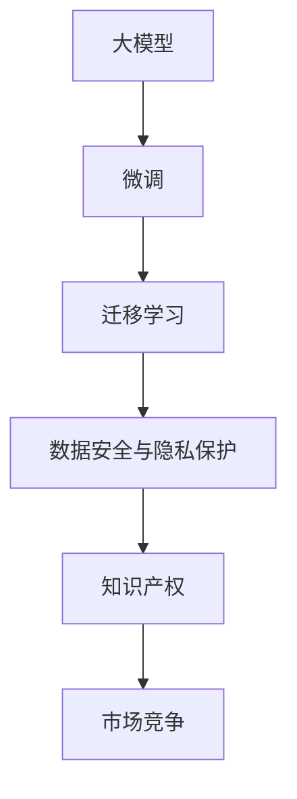

                 

# AI大模型创业：挑战与机遇并存的思考探讨

> 关键词：大模型创业, AI创业, 技术挑战, 商业机遇, 数据安全, 知识产权, 市场竞争

## 1. 背景介绍

随着人工智能技术的快速发展和落地应用，AI大模型逐渐成为产业创新和升级的重要引擎。无论是初创公司还是传统企业，都在积极布局AI大模型的研发和商业化应用。本文将从技术、商业、法律、伦理等多个维度，全面探讨AI大模型创业中的挑战与机遇，为有志于从事AI创业的朋友们提供有价值的参考。

### 1.1 行业背景

人工智能技术自20世纪末以来迅速发展，特别是在深度学习、自然语言处理、计算机视觉等领域的突破，使得大模型应用成为可能。当前，大模型在金融、医疗、教育、娱乐等多个领域展现出巨大的应用潜力。例如，AlphaGo战胜世界围棋冠军，OpenAI的GPT-3展示了强大的自然语言处理能力，Google的BERT在NLP任务上刷新了多项SOTA。

### 1.2 技术发展

大模型技术主要依赖于深度学习，通过自监督学习、迁移学习、半监督学习等方法，在大量数据上预训练得到高质量的语言表示。随后，通过微调、精调等技术，使其适应特定任务，实现高性能预测和生成。这一过程不仅需要高度专业化的技术人才，还需要强大的计算资源和数据支持。

## 2. 核心概念与联系

### 2.1 核心概念概述

在探讨AI大模型创业的挑战与机遇之前，需要先理解几个核心概念：

- **大模型**：指的是在特定任务上具有强大表现能力的深度学习模型，如BERT、GPT-3等。
- **微调(Fine-Tuning)**：在大模型上进行任务特定的调整，使其适应特定的应用场景。
- **迁移学习(Transfer Learning)**：利用已有模型的知识，在新任务上进行微调，加速模型训练。
- **数据安全与隐私保护**：涉及模型训练数据的获取、存储、使用过程中，如何保护用户隐私和数据安全。
- **知识产权**：涉及模型算法、代码、数据集的版权归属，如何在商业化过程中保护原创者的权益。
- **市场竞争**：涉及大模型创业公司如何在激烈的市场竞争中脱颖而出，获取商业成功。

这些概念构成了AI大模型创业的基石，对其理解是进行深入探讨的基础。

### 2.2 核心概念原理和架构的 Mermaid 流程图



## 3. 核心算法原理 & 具体操作步骤

### 3.1 算法原理概述

AI大模型的创业过程，涉及从模型构建、数据获取、模型训练、微调、商业化部署等多个环节。核心算法原理包括：

- **自监督学习(SSL)**：在大规模无标注数据上进行学习，构建语言表示。
- **迁移学习(Transfer Learning)**：利用已有模型的知识，在新任务上进行微调。
- **微调(Fine-Tuning)**：在特定任务上调整模型，使其适应新应用场景。

### 3.2 算法步骤详解

以下是AI大模型创业的主要步骤和具体操作步骤：

1. **需求分析**：明确目标应用场景，确定所需模型功能和性能指标。
2. **数据获取**：收集并预处理高质量的训练和测试数据，确保数据质量。
3. **模型选择与构建**：选择合适的模型架构，并使用自监督学习进行预训练。
4. **微调与精调**：在目标任务上对预训练模型进行微调，并根据反馈进行精调优化。
5. **模型部署与优化**：将训练好的模型部署到生产环境，并根据实际使用情况进行优化。
6. **商业化应用**：将AI大模型转化为实际产品，面向市场进行推广和销售。

### 3.3 算法优缺点

AI大模型创业的主要优点包括：

- **高性能**：利用深度学习模型的强大表达能力，能够在特定任务上获得优异性能。
- **泛化能力强**：迁移学习使得模型能够较好地适应不同领域的应用场景。
- **数据利用率高**：在无标注数据上进行的预训练，可以大幅提高数据利用率。

然而，该方法也存在以下缺点：

- **计算资源消耗大**：大模型训练需要高性能计算资源，前期投入成本高。
- **模型复杂度高**：模型结构复杂，难以调试和优化。
- **数据隐私风险高**：在获取和使用数据时，如何保护用户隐私是重要问题。
- **市场竞争激烈**：大模型领域竞争激烈，如何突破重围，获取市场份额，是关键挑战。

### 3.4 算法应用领域

AI大模型创业的应用领域非常广泛，涵盖金融、医疗、教育、娱乐等多个领域：

- **金融领域**：利用大模型进行信用评分、欺诈检测、投资建议等。
- **医疗领域**：利用大模型进行疾病诊断、个性化治疗方案推荐等。
- **教育领域**：利用大模型进行智能辅导、教育资源推荐等。
- **娱乐领域**：利用大模型进行内容推荐、自动生成文章、视频等。

## 4. 数学模型和公式 & 详细讲解 & 举例说明

### 4.1 数学模型构建

AI大模型的数学模型构建涉及深度学习框架、模型架构和损失函数等多个方面。

以BERT为例，其模型架构包括Transformer编码器、多头注意力机制和残差连接等。在训练过程中，通过自监督学习任务（如掩码语言模型、下一句预测）进行预训练。预训练模型的损失函数为：

$$
\mathcal{L} = -\sum_{i=1}^N \log P(y_i | x_i)
$$

其中 $P(y_i | x_i)$ 为模型在输入 $x_i$ 下的预测概率，$y_i$ 为真实标签。

### 4.2 公式推导过程

在BERT的预训练过程中，通过掩码语言模型和下一句预测任务进行训练。以掩码语言模型为例，其目标是在一个句子中随机掩盖一些词，然后让模型预测被掩盖的词。公式如下：

$$
\mathcal{L} = -\sum_{i=1}^N \log P(x_i) + \lambda \sum_{i=1}^N \log P(\hat{x}_i)
$$

其中 $\lambda$ 为正则化系数，$\hat{x}_i$ 为掩盖后的句子，$P(x_i)$ 和 $P(\hat{x}_i)$ 分别为原始句子和掩盖句子的概率。

### 4.3 案例分析与讲解

以医疗领域的疾病诊断为例，利用BERT进行任务微调。首先，在医疗数据集上进行预训练，然后对特定疾病的诊断数据进行微调，得到针对该疾病的诊断模型。微调过程通过交叉熵损失函数进行优化：

$$
\mathcal{L} = -\sum_{i=1}^N \log P(d_i | x_i)
$$

其中 $d_i$ 为疾病的真实标签，$x_i$ 为病人的症状描述，$P(d_i | x_i)$ 为模型对病人症状描述 $x_i$ 的疾病诊断概率。

## 5. 项目实践：代码实例和详细解释说明

### 5.1 开发环境搭建

AI大模型创业需要良好的开发环境支持。以下是在Python环境下搭建开发环境的步骤：

1. 安装Python 3.8及以上版本。
2. 安装Anaconda，创建虚拟环境。
3. 安装必要的依赖库，如TensorFlow、PyTorch、Keras等。
4. 配置GPU环境，安装CUDA和cuDNN库。
5. 搭建数据集处理和模型训练的Python环境。

### 5.2 源代码详细实现

以下是一个基于TensorFlow和Keras进行BERT微调的示例代码：

```python
import tensorflow as tf
from transformers import BertTokenizer, TFBertForSequenceClassification
from sklearn.model_selection import train_test_split
from keras.preprocessing.sequence import pad_sequences

# 加载BERT模型和分词器
tokenizer = BertTokenizer.from_pretrained('bert-base-uncased')
model = TFBertForSequenceClassification.from_pretrained('bert-base-uncased', num_labels=2)

# 加载训练数据和标签
train_texts, train_labels, dev_texts, dev_labels = ...

# 分词和编码
train_encodings = tokenizer(train_texts, truncation=True, padding=True)
dev_encodings = tokenizer(dev_texts, truncation=True, padding=True)

# 构建训练数据集
train_dataset = tf.data.Dataset.from_tensor_slices((train_encodings['input_ids'], train_encodings['attention_mask']))
train_dataset = train_dataset.shuffle(10000).batch(16)

# 构建验证数据集
dev_dataset = tf.data.Dataset.from_tensor_slices((dev_encodings['input_ids'], dev_encodings['attention_mask']))
dev_dataset = dev_dataset.batch(16)

# 定义损失函数和优化器
loss = tf.keras.losses.SparseCategoricalCrossentropy(from_logits=True)
optimizer = tf.keras.optimizers.Adam()

# 定义评估指标
accuracy = tf.keras.metrics.SparseCategoricalAccuracy()

# 训练过程
@tf.function
def train_step(encodings, labels):
    with tf.GradientTape() as tape:
        outputs = model(encodings['input_ids'], attention_mask=encodings['attention_mask'])
        loss_value = loss(labels, outputs)
    gradients = tape.gradient(loss_value, model.trainable_variables)
    optimizer.apply_gradients(zip(gradients, model.trainable_variables))
    return loss_value

@tf.function
def evaluate_step(encodings, labels):
    outputs = model(encodings['input_ids'], attention_mask=encodings['attention_mask'])
    predictions = tf.argmax(outputs, axis=1)
    accuracy_value = accuracy(predictions, labels)
    return accuracy_value

# 训练模型
epochs = 5
batch_size = 16

for epoch in range(epochs):
    for batch in train_dataset:
        encodings = batch
        labels = batch
        loss = train_step(encodings, labels)
        tf.print('Epoch {} loss: {}'.format(epoch, loss.numpy()))

    for batch in dev_dataset:
        encodings = batch
        labels = batch
        accuracy = evaluate_step(encodings, labels)
        tf.print('Epoch {} accuracy: {}'.format(epoch, accuracy.numpy()))

# 模型保存与部署
checkpoint_path = 'model.ckpt'
model.save(checkpoint_path)

# 加载模型并进行推理
loaded_model = TFBertForSequenceClassification.from_pretrained('bert-base-uncased', num_labels=2)
loaded_model.load_weights(checkpoint_path)
```

### 5.3 代码解读与分析

上述代码展示了使用TensorFlow和Keras进行BERT微调的完整过程。主要步骤如下：

1. 加载BERT模型和分词器。
2. 加载训练数据和标签，并进行分词和编码。
3. 构建训练数据集和验证数据集，并定义损失函数、优化器和评估指标。
4. 定义训练和评估过程，并进行多轮训练。
5. 保存模型，并加载模型进行推理。

## 6. 实际应用场景

### 6.4 未来应用展望

AI大模型在各个领域的应用前景广阔，以下列出几个典型应用场景：

- **金融风控**：利用大模型进行信用评分、欺诈检测、投资建议等。
- **医疗诊断**：利用大模型进行疾病诊断、个性化治疗方案推荐等。
- **教育辅导**：利用大模型进行智能辅导、教育资源推荐等。
- **内容生成**：利用大模型进行文章自动生成、视频生成等。

未来，随着大模型的不断演进和应用场景的拓展，其市场潜力将进一步释放。

## 7. 工具和资源推荐

### 7.1 学习资源推荐

- **《深度学习》课程**：斯坦福大学的Andrew Ng教授主讲的深度学习课程，系统介绍了深度学习的基础理论和实践。
- **《TensorFlow官方文档》**：TensorFlow的官方文档，详细介绍了TensorFlow的使用方法、API接口等。
- **Kaggle平台**：提供了丰富的数据集和竞赛项目，可以实践和测试AI大模型的效果。
- **GitHub代码库**：GitHub上的开源项目和代码库，可以借鉴和学习最新的技术实现和应用案例。

### 7.2 开发工具推荐

- **Jupyter Notebook**：用于数据探索和模型训练的交互式编程环境。
- **PyCharm**：一款功能强大的Python IDE，支持代码调试和项目管理。
- **TensorBoard**：TensorFlow配套的可视化工具，用于监控训练过程和模型性能。
- **HuggingFace Transformers库**：提供了多种预训练语言模型的封装，方便微调模型的开发。

### 7.3 相关论文推荐

- **"Attention Is All You Need"**：Transformer论文，提出自注意力机制，开启了NLP领域的预训练大模型时代。
- **"BERT: Pre-training of Deep Bidirectional Transformers for Language Understanding"**：BERT论文，提出双向掩码语言模型，刷新了多项NLP任务SOTA。
- **"GPT-3: Language Models are Unsupervised Multitask Learners"**：GPT-3论文，展示了大语言模型的强大zero-shot学习能力。
- **"AdaLoRA: Adaptive Low-Rank Adaptation for Parameter-Efficient Fine-Tuning"**：AdaLoRA论文，提出自适应低秩适应的微调方法，提高了微调效率。
- **"Prompt-Based Transfer Learning for Transformers"**：Prompt学习论文，提出使用提示模板进行微调，减少了微调参数。

## 8. 总结：未来发展趋势与挑战

### 8.1 研究成果总结

AI大模型创业是一个复杂的过程，涉及技术、市场、法律、伦理等多个方面。当前，大模型技术在多个领域取得了显著进展，但仍面临诸多挑战。本文从多个维度对AI大模型创业进行了系统探讨。

### 8.2 未来发展趋势

未来，AI大模型将呈现以下发展趋势：

- **高性能大模型的普及**：大模型技术将进一步普及，更多企业和开发者将利用大模型进行应用开发。
- **跨领域应用的拓展**：大模型将从传统领域拓展到更多新兴领域，如智慧城市、智慧农业等。
- **个性化服务的提升**：利用大模型提供个性化推荐、智能客服等服务，提升用户体验。
- **隐私和安全技术的进步**：随着数据安全意识的提升，隐私和安全技术将进一步发展，保障用户数据安全。

### 8.3 面临的挑战

AI大模型创业虽然前景广阔，但也面临诸多挑战：

- **计算资源成本高**：大模型训练和推理需要高性能计算资源，前期投入成本高。
- **数据获取难**：获取高质量标注数据难度大，数据隐私问题也需注意。
- **模型部署复杂**：大模型部署到生产环境复杂，需要考虑性能、安全等问题。
- **市场竞争激烈**：大模型领域竞争激烈，如何突出重围是关键。

### 8.4 研究展望

未来，AI大模型创业的研究方向包括：

- **算法优化**：优化模型架构和训练算法，提高模型性能和效率。
- **数据隐私保护**：研究数据隐私保护技术，确保用户数据安全。
- **跨领域应用**：拓展大模型的应用领域，提升其在更多场景下的实用性。
- **伦理和安全**：研究模型伦理和安全问题，确保AI技术的公正性和安全性。

## 9. 附录：常见问题与解答

**Q1：AI大模型的计算资源消耗大，如何降低成本？**

A: 可以通过分布式训练、模型剪枝、量化加速等方法，降低计算资源消耗。

**Q2：如何处理数据隐私问题？**

A: 采用数据匿名化、差分隐私等技术，确保数据安全。

**Q3：AI大模型在市场竞争中如何脱颖而出？**

A: 注重产品质量和服务，建立良好的品牌信誉，积极参与行业合作和标准制定。

**Q4：AI大模型创业需要哪些关键技术？**

A: 大模型技术、数据获取和管理、模型部署和优化、市场推广等。

---

作者：禅与计算机程序设计艺术 / Zen and the Art of Computer Programming

