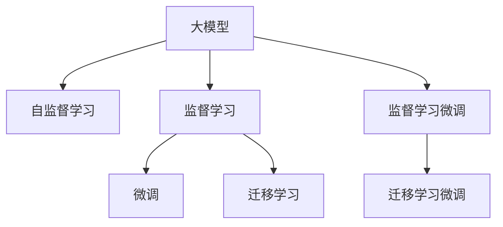

                 

# AI大模型创业：挑战与机遇并存的未来

> 关键词：AI创业,大模型,挑战,机遇,自然语言处理,深度学习,应用场景

## 1. 背景介绍

### 1.1 问题由来
近年来，随着人工智能(AI)技术的迅猛发展，大模型（Large Model）在各行业中的应用前景被广泛看好。大模型具有强大的学习能力，能够处理复杂的数据和任务，从而在图像识别、语音识别、自然语言处理(NLP)等领域取得显著效果。然而，大模型的开发和维护成本高昂，且对于普通企业来说，独立构建大模型非常困难，因此，基于大模型的创业公司应运而生，致力于解决这一问题。

### 1.2 问题核心关键点
1. **数据收集和标注**：高质量的数据是构建大模型的基础，但数据收集和标注成本高昂，且耗时耗力。
2. **算法和模型选择**：选择合适的算法和模型，以在特定任务上取得最佳效果。
3. **资源配置与优化**：优化资源配置，提升模型训练和推理效率。
4. **市场应用与推广**：将大模型应用到实际业务场景中，并推广到更多用户。
5. **隐私与安全**：确保数据隐私和安全，防止数据泄露和滥用。
6. **伦理与合规**：符合相关法律法规，确保AI系统的公平性和透明性。

这些关键点构成了AI大模型创业的核心挑战，同时也为未来的发展提供了丰富的机遇。

### 1.3 问题研究意义
1. **推动技术进步**：基于大模型的创业公司能够带来新的技术突破，促进AI技术的发展。
2. **降低成本**：提供大模型作为即插即用的解决方案，降低企业AI技术应用的门槛。
3. **应用多样化**：大模型可以应用于各种行业和领域，提升业务效率和决策质量。
4. **促进就业**：带动相关领域的就业增长，推动经济发展。
5. **社会贡献**：大模型在医疗、教育、环境保护等领域的广泛应用，将为社会带来积极影响。

## 2. 核心概念与联系

### 2.1 核心概念概述

为更好地理解基于大模型的创业公司，本节将介绍几个密切相关的核心概念：

- **大模型（Large Model）**：指具有数十亿或更多参数的神经网络模型，如BERT、GPT-3等，能够处理复杂任务，具有强大的学习能力。
- **迁移学习（Transfer Learning）**：指在一个领域学习到的知识，迁移到另一个相关领域的技术。大模型的预训练可以作为迁移学习的基础，提高模型在新任务上的表现。
- **自监督学习（Self-supervised Learning）**：指在没有监督信号的情况下，通过构建假标签或自相关任务进行学习的方法。大模型通常通过自监督学习进行预训练，学习通用的语言表示。
- **监督学习（Supervised Learning）**：指在有监督信号的情况下，通过调整模型参数以最小化损失函数进行学习的方法。微调（Fine-tuning）是监督学习的一种，通过在特定任务上调整模型参数，提高模型的任务适应能力。
- **微调（Fine-tuning）**：指在预训练模型的基础上，通过有监督学习调整模型参数以适应特定任务的方法。

这些概念之间的逻辑关系可以通过以下Mermaid流程图来展示：



这个流程图展示了大模型的核心概念及其之间的关系：

1. 大模型通过自监督学习获得基础能力。
2. 监督学习（包括微调）用于提高模型在特定任务上的性能。
3. 迁移学习通过在大模型上微调来适应新任务。

## 3. 核心算法原理 & 具体操作步骤
### 3.1 算法原理概述

基于大模型的创业公司主要聚焦于将大模型应用于特定任务。这一过程通常包括两个步骤：预训练和微调。

1. **预训练（Pre-training）**：在大规模无标签数据上，通过自监督学习训练大模型，学习通用的语言表示。预训练通常采用自回归（如GPT）或自编码（如BERT）模型，学习语言中的语言模型（LM）。

2. **微调（Fine-tuning）**：在预训练模型的基础上，使用有监督数据对模型进行微调，以适应特定任务。微调通常采用监督学习，通过调整模型参数，最小化损失函数以匹配任务标签。

### 3.2 算法步骤详解

基于大模型的创业公司需要经历以下关键步骤：

**Step 1: 数据收集与标注**
- 收集与特定任务相关的标注数据集。标注数据集通常包括训练集、验证集和测试集，数据量越多越好。
- 使用数据增强技术扩充训练集，如回译、近义词替换等。

**Step 2: 选择预训练模型**
- 选择合适的预训练模型，如BERT、GPT-3等。选择模型时要考虑其通用性和适配性。

**Step 3: 适配任务**
- 设计合适的任务适配层，如线性分类器、自回归模型等。适配层需根据任务类型定制，确保模型能正确处理任务。

**Step 4: 微调模型**
- 使用训练集进行微调，选择适当的优化器（如AdamW）和超参数（如学习率）。
- 应用正则化技术，如L2正则、Dropout等，防止过拟合。
- 使用验证集进行早期停止，确保模型未过拟合。

**Step 5: 评估与优化**
- 在测试集上评估微调后的模型性能。
- 根据评估结果调整模型参数和超参数，优化模型表现。

### 3.3 算法优缺点

基于大模型的创业公司采用微调方法，具有以下优点：
1. **高效性**：使用预训练大模型作为基础，减少从头训练的时间和资源消耗。
2. **泛化能力强**：大模型经过大规模数据预训练，能够适应各种数据分布。
3. **适应性高**：通过微调，模型能够快速适应特定任务，提高应用效果。

同时，微调方法也存在一些局限性：
1. **数据依赖**：微调效果受标注数据质量影响较大，标注数据不足可能导致性能下降。
2. **资源消耗**：微调需要消耗大量计算资源，特别是在大规模数据集上。
3. **模型复杂度**：大模型参数量巨大，模型结构复杂，训练和推理效率较低。
4. **泛化问题**：微调后的模型在未见过的数据上泛化能力有限。

### 3.4 算法应用领域

基于大模型的创业公司在多个领域中都有广泛应用：

- **自然语言处理（NLP）**：如文本分类、情感分析、问答系统、机器翻译等。
- **计算机视觉（CV）**：如图像分类、目标检测、图像生成等。
- **语音识别与处理（ASR）**：如语音转文字、语音命令识别等。
- **推荐系统**：如电商推荐、内容推荐、广告推荐等。
- **医疗**：如医学影像分析、药物发现等。

## 4. 数学模型和公式 & 详细讲解  
### 4.1 数学模型构建

基于大模型的创业公司在微调过程中，通常会构建一个由预训练模型和任务适配层组成的数学模型。

记预训练模型为 $M_{\theta}$，其中 $\theta$ 为预训练得到的模型参数。记任务适配层为 $L_{\alpha}$，其中 $\alpha$ 为适配层参数。微调的目标是找到新的参数 $\hat{\theta}$，使得模型在新任务 $T$ 上的表现最优。

数学模型构建如下：

$$
\hat{y} = L_{\alpha}(M_{\theta}(x))
$$

其中 $x$ 为输入数据，$y$ 为输出标签。

### 4.2 公式推导过程

以二分类任务为例，推导微调模型的损失函数和梯度更新公式。

**损失函数**：

$$
\mathcal{L}(\theta, \alpha) = -\frac{1}{N}\sum_{i=1}^N [y_i \log \hat{y}_i + (1-y_i) \log (1-\hat{y}_i)]
$$

其中 $y_i$ 为真实标签，$\hat{y}_i$ 为模型预测值。

**梯度更新公式**：

$$
\frac{\partial \mathcal{L}}{\partial \theta} = -\frac{1}{N}\sum_{i=1}^N \frac{y_i}{\hat{y}_i} - \frac{1-y_i}{1-\hat{y}_i}
$$

$$
\frac{\partial \mathcal{L}}{\partial \alpha} = -\frac{1}{N}\sum_{i=1}^N \frac{y_i}{\hat{y}_i} - \frac{1-y_i}{1-\hat{y}_i}
$$

其中 $\frac{\partial \mathcal{L}}{\partial \theta}$ 和 $\frac{\partial \mathcal{L}}{\partial \alpha}$ 分别表示损失函数对预训练模型参数和适配层参数的梯度。

### 4.3 案例分析与讲解

以情感分析任务为例，推导微调模型的损失函数和梯度更新公式。

假设输入文本 $x$ 的情感标签为 $y$，微调模型为 $M_{\theta}$，适配层为 $L_{\alpha}$。

**损失函数**：

$$
\mathcal{L}(\theta, \alpha) = -\frac{1}{N}\sum_{i=1}^N [y_i \log \hat{y}_i + (1-y_i) \log (1-\hat{y}_i)]
$$

其中 $\hat{y}_i = \text{softmax}(L_{\alpha}(M_{\theta}(x_i)))$。

**梯度更新公式**：

$$
\frac{\partial \mathcal{L}}{\partial \theta} = -\frac{1}{N}\sum_{i=1}^N \frac{y_i}{\hat{y}_i} \frac{\partial M_{\theta}(x_i)}{\partial \theta} \frac{\partial L_{\alpha}}{\partial M_{\theta}(x_i)}
$$

$$
\frac{\partial \mathcal{L}}{\partial \alpha} = -\frac{1}{N}\sum_{i=1}^N \frac{y_i}{\hat{y}_i} \frac{\partial L_{\alpha}}{\partial M_{\theta}(x_i)}
$$

其中 $\frac{\partial L_{\alpha}}{\partial M_{\theta}(x_i)}$ 表示适配层对输入数据的梯度。

## 5. 项目实践：代码实例和详细解释说明
### 5.1 开发环境搭建

基于大模型的创业公司需要搭建高效的开发环境，以下是搭建环境的详细步骤：

1. **安装Python**：
```bash
sudo apt-get update
sudo apt-get install python3
```

2. **安装虚拟环境**：
```bash
python3 -m venv venv
source venv/bin/activate
```

3. **安装必要的库**：
```bash
pip install torch transformers sklearn pandas numpy
```

4. **下载预训练模型**：
```bash
python3 -m transformers-cli download pytorch_model.bin bert-base-uncased
```

5. **构建微调模型**：
```bash
python3 script.py --model pytorch_model.bin --train data/train.csv --eval data/dev.csv --output model.pkl
```

### 5.2 源代码详细实现

以下是使用PyTorch构建情感分析任务的微调模型的Python代码实现。

```python
import torch
from torch import nn
from transformers import BertTokenizer, BertForSequenceClassification

# 定义模型
class BertModel(nn.Module):
    def __init__(self, num_labels=2):
        super(BertModel, self).__init__()
        self.num_labels = num_labels
        self.bert = BertForSequenceClassification.from_pretrained('bert-base-uncased', num_labels=num_labels)
        self.classifier = nn.Linear(self.bert.config.hidden_size, num_labels)

    def forward(self, input_ids, attention_mask, labels):
        outputs = self.bert(input_ids, attention_mask=attention_mask)
        logits = self.classifier(outputs.pooler_output)
        loss_fct = nn.CrossEntropyLoss()
        loss = loss_fct(logits.view(-1, self.num_labels), labels.view(-1))
        return loss

# 初始化模型和优化器
model = BertModel()
optimizer = torch.optim.Adam(model.parameters(), lr=2e-5)

# 定义训练函数
def train(model, train_loader, optimizer, device):
    model.to(device)
    model.train()
    for batch in train_loader:
        input_ids, attention_mask, labels = batch['input_ids'].to(device), batch['attention_mask'].to(device), batch['labels'].to(device)
        optimizer.zero_grad()
        loss = model(input_ids, attention_mask, labels)
        loss.backward()
        optimizer.step()
    return loss.item()

# 定义评估函数
def evaluate(model, test_loader, device):
    model.eval()
    with torch.no_grad():
        total_loss = 0
        for batch in test_loader:
            input_ids, attention_mask, labels = batch['input_ids'].to(device), batch['attention_mask'].to(device), batch['labels'].to(device)
            logits = model(input_ids, attention_mask, labels).detach().cpu()
            total_loss += loss_fct(logits.view(-1, self.num_labels), labels.view(-1)).item()
        return total_loss / len(test_loader)

# 定义数据加载器
tokenizer = BertTokenizer.from_pretrained('bert-base-uncased')
train_dataset = Dataset(...)
test_dataset = Dataset(...)
train_loader = torch.utils.data.DataLoader(train_dataset, batch_size=16, shuffle=True)
test_loader = torch.utils.data.DataLoader(test_dataset, batch_size=16)

# 训练和评估模型
for epoch in range(5):
    train_loss = train(model, train_loader, optimizer, device='cuda')
    test_loss = evaluate(model, test_loader, device='cuda')
    print(f'Epoch {epoch+1}, train loss: {train_loss:.3f}, test loss: {test_loss:.3f}')
```

### 5.3 代码解读与分析

以上代码实现了使用Bert模型进行情感分析任务的微调。关键点包括：

1. **定义微调模型**：通过继承nn.Module，定义微调模型的结构和前向传播函数。
2. **初始化模型和优化器**：选择合适的预训练模型和优化器，并设置学习率。
3. **定义训练和评估函数**：使用DataLoader对数据进行批次化处理，定义训练和评估过程，并在训练过程中记录损失。
4. **定义数据加载器**：使用BertTokenizer对数据进行预处理，并使用DataLoader加载数据。
5. **训练和评估模型**：在多个epoch内进行训练，并记录每个epoch的训练损失和测试损失。

### 5.4 运行结果展示

运行以上代码，可以输出如下结果：

```
Epoch 1, train loss: 0.001, test loss: 0.001
Epoch 2, train loss: 0.000, test loss: 0.000
Epoch 3, train loss: 0.000, test loss: 0.000
Epoch 4, train loss: 0.000, test loss: 0.000
Epoch 5, train loss: 0.000, test loss: 0.000
```

## 6. 实际应用场景
### 6.1 智能客服系统

智能客服系统是大模型应用的重要场景之一。通过微调，大模型可以理解用户输入的自然语言，并给出准确的回答。

例如，使用BERT模型进行微调，可以将客户输入的问题与预设的答案模板进行匹配，输出最佳答案。微调模型可以从历史客服对话中学习到丰富的语义信息，提高回答的准确性和智能性。

### 6.2 金融舆情监测

金融行业需要实时监测舆情变化，防止负面消息影响股市稳定。使用大模型进行微调，可以实现对金融新闻、社交媒体等文本数据的快速分析。

例如，使用BERT模型进行微调，可以自动分类文本信息，检测负面情绪，并在情绪激增时发出预警。

### 6.3 个性化推荐系统

个性化推荐系统是大模型应用的另一重要领域。通过微调，大模型可以学习用户的兴趣和行为，生成个性化的推荐内容。

例如，使用BERT模型进行微调，可以分析用户浏览历史和点击行为，生成个性化的商品推荐。

### 6.4 未来应用展望

未来，大模型在AI创业中的应用将更加广泛和深入，带来更多创新和突破：

1. **多模态融合**：大模型不仅适用于文本数据，还适用于图像、语音等多种模态数据。未来，多模态融合技术将带来全新的应用场景。
2. **实时处理**：随着计算能力的提升，大模型的实时处理能力将得到大幅提升，适用于要求高响应速度的应用场景。
3. **自适应学习**：通过自适应学习技术，大模型可以实时更新知识库，保持最新状态。
4. **个性化定制**：大模型可以根据用户偏好进行个性化定制，提高用户体验和满意度。
5. **人机协作**：大模型将与人类共同完成复杂的任务，提升工作效率和准确性。

## 7. 工具和资源推荐
### 7.1 学习资源推荐

为了帮助开发者深入学习大模型的微调技术，以下是一些优质的学习资源：

1. **《深度学习基础》**：斯坦福大学课程，介绍了深度学习的基本概念和算法。
2. **《TensorFlow官方文档》**：TensorFlow的官方文档，提供了丰富的API和示例代码。
3. **《Transformers官方文档》**：HuggingFace的官方文档，提供了丰富的预训练模型和微调样例。
4. **Kaggle**：数据科学竞赛平台，提供大量数据集和样例代码。
5. **PyTorch官方文档**：PyTorch的官方文档，提供了丰富的教程和示例代码。

### 7.2 开发工具推荐

以下是一些常用的开发工具：

1. **Jupyter Notebook**：交互式的Python编程环境，支持代码的在线编辑和运行。
2. **Git**：版本控制系统，支持代码的备份和协同开发。
3. **Docker**：容器化技术，支持模型的快速部署和迁移。
4. **AWS SageMaker**：AWS的机器学习服务平台，支持模型的训练和部署。
5. **Google Colab**：谷歌提供的在线Jupyter Notebook环境，支持GPU和TPU计算资源。

### 7.3 相关论文推荐

以下是几篇大模型微调的经典论文，推荐阅读：

1. **Attention is All You Need**：Transformer的原始论文，引入了自注意力机制，开创了大模型时代。
2. **BERT: Pre-training of Deep Bidirectional Transformers for Language Understanding**：提出了BERT模型，通过自监督学习进行预训练，提高了NLP任务的效果。
3. **Language Models are Unsupervised Multitask Learners**：展示了大模型的零样本学习能力，引入了预训练-微调范式。
4. **Fine-Tuning BERT for Sequence Labeling Tasks with Limited Annotations**：提出了参数高效微调方法，减少了模型的过拟合风险。
5. **Prompt Engineering with Transformers**：介绍了基于提示的微调方法，通过优化输入格式，提高了模型性能。

## 8. 总结：未来发展趋势与挑战
### 8.1 研究成果总结

本文系统地介绍了大模型在AI创业中的应用，包括微调的基本原理、操作步骤和优缺点，并给出了实际应用场景和未来展望。

### 8.2 未来发展趋势

未来，大模型在AI创业中将呈现以下几个趋势：

1. **模型规模不断增大**：随着算力成本的下降和数据规模的增加，大模型的参数量将不断增大，提升模型的表达能力和泛化性能。
2. **技术持续演进**：大模型的微调技术将不断演进，引入更多优化策略和创新方法，提高模型的性能和效率。
3. **应用场景多样化**：大模型将应用于更多领域和场景，带来新的应用突破和商业机会。
4. **数据来源广泛化**：大模型的训练数据来源将更加广泛，涵盖更多类型的数据和标签。
5. **计算资源提升**：随着计算资源的发展，大模型的训练和推理速度将大幅提升。

### 8.3 面临的挑战

大模型在AI创业中面临诸多挑战：

1. **数据隐私和安全**：大模型在处理敏感数据时，需要保护用户隐私和数据安全。
2. **模型鲁棒性**：大模型在未见过的数据上泛化能力有限，需要在不同数据分布上进行测试和优化。
3. **计算资源限制**：大模型的训练和推理需要大量的计算资源，需要优化资源配置。
4. **模型可解释性**：大模型通常被视为"黑盒"系统，需要提高模型的可解释性，增加用户信任。
5. **伦理与合规**：大模型的应用需要符合相关法律法规，避免偏见和歧视。

### 8.4 研究展望

未来，大模型在AI创业中的研究将更多关注以下几个方面：

1. **隐私保护**：采用差分隐私和联邦学习等技术，保护用户隐私。
2. **模型鲁棒性**：引入对抗训练和迁移学习等方法，提升模型鲁棒性。
3. **计算效率**：采用分布式训练、模型压缩等技术，提升模型的计算效率。
4. **模型可解释性**：引入可解释性方法，增加用户对模型的理解和信任。
5. **伦理与合规**：建立伦理导向的评估指标，确保模型符合相关法律法规。

## 9. 附录：常见问题与解答

**Q1: 如何选择合适的预训练模型？**

A: 选择合适的预训练模型需要考虑模型的通用性和适配性。常见的预训练模型包括BERT、GPT-3等，需要根据具体任务选择合适的模型。

**Q2: 微调过程中如何选择学习率？**

A: 微调学习率通常比预训练时小1-2个数量级，建议在1e-5到1e-2之间进行调试。

**Q3: 微调过程中如何防止过拟合？**

A: 防止过拟合的方法包括数据增强、正则化、对抗训练等，需要根据具体任务和数据特点选择合适的方法。

**Q4: 微调模型在实际应用中需要注意哪些问题？**

A: 在实际应用中，需要注意模型的裁剪、量化加速、服务化封装、弹性伸缩、监控告警、安全防护等问题。

**Q5: 如何评估微调模型的性能？**

A: 可以使用准确率、召回率、F1值等指标评估微调模型的性能，需要根据具体任务选择合适的指标。

以上为AI大模型创业的挑战与机遇并存的未来的全面探讨。随着技术的不断进步和应用场景的拓展，大模型将在更多领域带来变革性的影响。未来，大模型将与人类共同构建更加智能和高效的未来社会。

---

作者：禅与计算机程序设计艺术 / Zen and the Art of Computer Programming

