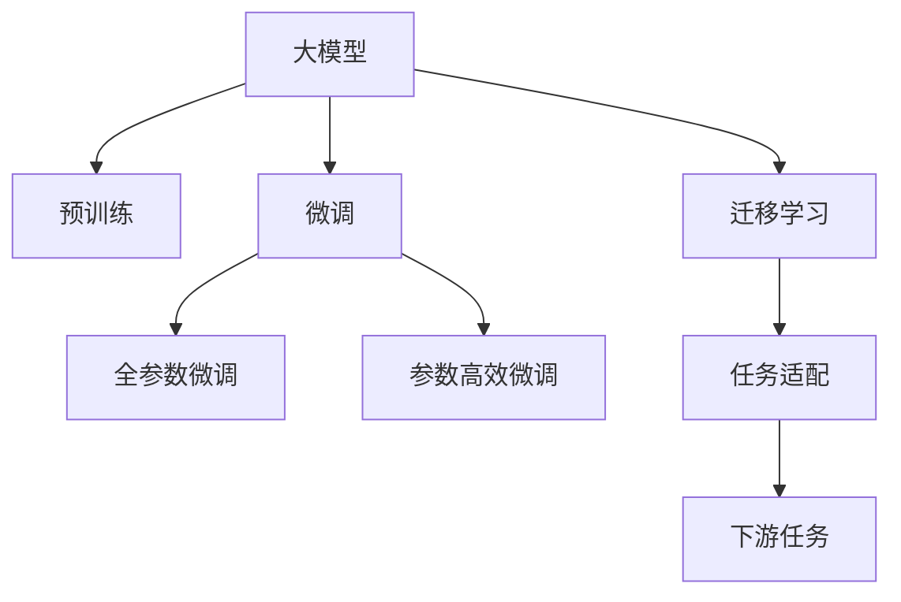

                 

# AI大模型创业：泡沫还是金矿？未来展望

## 1. 背景介绍

### 1.1 问题由来
随着AI技术的迅猛发展，大模型在多个领域展现了巨大的潜力和价值，推动了各行各业的数字化转型。从自然语言处理(NLP)、计算机视觉(CV)到医疗、金融、教育等多个领域，大模型的应用无所不在。然而，在带来巨大机遇的同时，也引发了市场对大模型创业前景的广泛关注和讨论。大模型创业，到底是泡沫还是金矿？本文将通过深入分析大模型的核心技术原理、当前发展现状以及未来趋势，为你提供一份全面而深入的解答。

### 1.2 问题核心关键点
大模型创业的核心关键点主要包括：

- **技术原理与架构**：理解大模型的基本原理与架构，是进行创业的基础。
- **应用场景与领域**：明确大模型的典型应用场景与主要领域，有助于找到目标市场。
- **市场现状与竞争格局**：了解当前大模型市场的竞争态势与主要玩家，有助于制定有效的市场策略。
- **商业模式与盈利模式**：探索大模型创业的商业模式与盈利模式，明确商业模式是创业成功的关键。

## 2. 核心概念与联系

### 2.1 核心概念概述

为深入理解大模型创业的核心概念，我们首先梳理以下几个关键概念及其联系：

- **大模型**：指在深度学习领域，尤其是自然语言处理(NLP)和计算机视觉(CV)领域，具有数十亿参数规模的模型。如GPT-3、BERT、DALL·E等。
- **预训练**：通过在大量无标注数据上进行自监督学习，学习通用特征表示的过程。
- **微调**：在大模型基础上，通过有监督学习进行下游任务适配，提升模型在特定任务上的性能。
- **迁移学习**：将一个领域学到的知识迁移到另一个领域，提高模型在不同任务上的泛化能力。
- **云计算**：利用云计算平台提供的大规模算力，支持大模型的训练和推理。

这些概念之间的关系可以通过以下Mermaid流程图来展示：



这个流程图展示了大模型从预训练到微调的过程，以及如何通过迁移学习实现任务适配，进一步提升模型性能。

## 3. 核心算法原理 & 具体操作步骤
### 3.1 算法原理概述

大模型的核心算法原理基于深度学习中的神经网络模型，特别是Transformer结构。以下是对其核心原理的简要介绍：

- **神经网络**：通过多层神经元之间的连接，学习输入与输出之间的映射关系。
- **Transformer**：一种基于自注意力机制的神经网络结构，能够有效处理长序列数据，广泛应用于大模型。
- **预训练**：通过在大量无标注数据上自监督学习，学习通用特征表示。
- **微调**：在大模型基础上，通过有监督学习进行下游任务适配，提升模型性能。

### 3.2 算法步骤详解

大模型创业的核心步骤包括：

1. **数据准备**：收集和预处理大量的标注数据，确保数据的质量和多样性。
2. **模型选择**：选择合适的预训练模型，如BERT、GPT-3等，并进行微调。
3. **模型训练**：使用云计算平台进行模型训练，优化模型参数。
4. **模型评估**：在验证集上评估模型性能，调整模型参数。
5. **模型部署**：将模型部署到实际应用场景中，进行推理和预测。

### 3.3 算法优缺点

大模型创业的优点包括：

- **高性能**：大模型具备强大的特征提取能力和泛化能力，能够在多种下游任务上取得优异性能。
- **灵活性**：大模型可以适应多种应用场景，如NLP、CV、推荐系统等。
- **高价值**：大模型的高性能和广泛应用，带来了巨大的商业价值和社会价值。

但其缺点也不容忽视：

- **高成本**：大模型的训练和部署需要大量算力，且训练周期较长。
- **高风险**：市场竞争激烈，风险高，成功率不确定。
- **数据依赖**：大模型依赖于大量标注数据，数据获取和处理成本较高。

### 3.4 算法应用领域

大模型在多个领域具有广泛应用，包括但不限于：

- **自然语言处理**：如文本分类、情感分析、机器翻译等。
- **计算机视觉**：如图像分类、物体检测、人脸识别等。
- **推荐系统**：如电商推荐、内容推荐等。
- **金融科技**：如信用评估、风险预测等。
- **医疗健康**：如疾病诊断、基因分析等。

## 4. 数学模型和公式 & 详细讲解

### 4.1 数学模型构建

大模型的数学模型通常包括编码器-解码器结构，如Transformer。以下是对其基本结构的简要介绍：

- **编码器**：通过多层自注意力机制和全连接层，学习输入数据的特征表示。
- **解码器**：通过多层自注意力机制和全连接层，生成输出。

### 4.2 公式推导过程

以Transformer为例，其基本结构可以表示为：

$$
y = \text{Decoder}(\text{Encoder}(x);\theta)
$$

其中，$x$ 为输入数据，$y$ 为输出数据，$\theta$ 为模型参数。

### 4.3 案例分析与讲解

以BERT模型为例，其预训练过程主要通过掩码语言模型和下一句预测任务进行。掩码语言模型的目标是在输入序列中随机遮盖部分单词，预测遮盖单词；下一句预测任务的目标是判断两个句子是否相邻。

## 5. 项目实践：代码实例和详细解释说明

### 5.1 开发环境搭建

大模型创业的开发环境搭建主要依赖于云计算平台和深度学习框架。以下是对开发环境搭建的简要说明：

1. **云计算平台选择**：如AWS、Google Cloud、阿里云等。
2. **深度学习框架选择**：如TensorFlow、PyTorch等。
3. **工具和资源准备**：如Jupyter Notebook、Git等。

### 5.2 源代码详细实现

以BERT模型为例，进行NLP任务的微调代码实现：

```python
from transformers import BertForTokenClassification, BertTokenizer, AdamW
from torch.utils.data import DataLoader, Dataset
from tqdm import tqdm

class NLPDataset(Dataset):
    def __init__(self, texts, tags, tokenizer):
        self.texts = texts
        self.tags = tags
        self.tokenizer = tokenizer
        self.max_len = 128
        
    def __len__(self):
        return len(self.texts)
    
    def __getitem__(self, item):
        text = self.texts[item]
        tags = self.tags[item]
        
        encoding = self.tokenizer(text, return_tensors='pt', max_length=self.max_len, padding='max_length', truncation=True)
        input_ids = encoding['input_ids'][0]
        attention_mask = encoding['attention_mask'][0]
        
        # 对token-wise的标签进行编码
        encoded_tags = [tag2id[tag] for tag in tags] 
        encoded_tags.extend([tag2id['O']] * (self.max_len - len(encoded_tags)))
        labels = torch.tensor(encoded_tags, dtype=torch.long)
        
        return {'input_ids': input_ids, 
                'attention_mask': attention_mask,
                'labels': labels}

# 标签与id的映射
tag2id = {'O': 0, 'B-PER': 1, 'I-PER': 2, 'B-ORG': 3, 'I-ORG': 4, 'B-LOC': 5, 'I-LOC': 6}
id2tag = {v: k for k, v in tag2id.items()}

# 创建dataset
tokenizer = BertTokenizer.from_pretrained('bert-base-cased')

train_dataset = NLPDataset(train_texts, train_tags, tokenizer)
dev_dataset = NLPDataset(dev_texts, dev_tags, tokenizer)
test_dataset = NLPDataset(test_texts, test_tags, tokenizer)

# 定义模型和优化器
model = BertForTokenClassification.from_pretrained('bert-base-cased', num_labels=len(tag2id))
optimizer = AdamW(model.parameters(), lr=2e-5)

# 训练模型
for epoch in range(5):
    train_loss = 0
    for batch in tqdm(train_dataset, desc='Training'):
        input_ids = batch['input_ids'].to(device)
        attention_mask = batch['attention_mask'].to(device)
        labels = batch['labels'].to(device)
        model.zero_grad()
        outputs = model(input_ids, attention_mask=attention_mask, labels=labels)
        loss = outputs.loss
        train_loss += loss.item()
        loss.backward()
        optimizer.step()
        
    print(f'Epoch {epoch+1}, train loss: {train_loss / len(train_dataset)}')

# 评估模型
dev_loss = 0
for batch in tqdm(dev_dataset, desc='Evaluating'):
    input_ids = batch['input_ids'].to(device)
    attention_mask = batch['attention_mask'].to(device)
    labels = batch['labels'].to(device)
    with torch.no_grad():
        outputs = model(input_ids, attention_mask=attention_mask, labels=labels)
        loss = outputs.loss
        dev_loss += loss.item()
        
print(f'Epoch {epoch+1}, dev loss: {dev_loss / len(dev_dataset)}')

# 测试模型
test_loss = 0
for batch in tqdm(test_dataset, desc='Testing'):
    input_ids = batch['input_ids'].to(device)
    attention_mask = batch['attention_mask'].to(device)
    labels = batch['labels'].to(device)
    with torch.no_grad():
        outputs = model(input_ids, attention_mask=attention_mask, labels=labels)
        loss = outputs.loss
        test_loss += loss.item()
        
print(f'Test loss: {test_loss / len(test_dataset)}')
```

### 5.3 代码解读与分析

这段代码实现了BERT模型在NLP任务（如命名实体识别）上的微调过程。主要步骤如下：

1. **数据处理**：将文本数据分词并转换为模型可接受的形式。
2. **模型选择**：选择预训练的BERT模型。
3. **模型训练**：使用训练集对模型进行微调，并记录训练损失。
4. **模型评估**：在验证集上评估模型性能，记录评估损失。
5. **模型测试**：在测试集上测试模型性能，记录测试损失。

## 6. 实际应用场景

### 6.1 自然语言处理

大模型在自然语言处理领域具有广泛应用，如：

- **文本分类**：如情感分析、主题分类等。
- **命名实体识别**：如人名、地名、机构名等。
- **机器翻译**：如中英文互译等。
- **问答系统**：如智能客服、智能助手等。

### 6.2 计算机视觉

大模型在计算机视觉领域也具有重要应用，如：

- **图像分类**：如猫狗识别、花卉分类等。
- **物体检测**：如人脸识别、交通监控等。
- **图像生成**：如DALL·E等。

### 6.3 推荐系统

大模型在推荐系统领域也有重要应用，如：

- **电商推荐**：如淘宝、京东等。
- **内容推荐**：如Netflix、YouTube等。

## 7. 工具和资源推荐

### 7.1 学习资源推荐

为了帮助开发者系统掌握大模型创业的理论基础和实践技巧，我们推荐以下学习资源：

1. **《深度学习》一书**：Ian Goodfellow所著，详细介绍了深度学习的基本原理和应用。
2. **《动手学深度学习》一书**：李沐等人编写，提供丰富的代码示例和实战案例。
3. **Coursera深度学习课程**：由Andrew Ng等人主讲，系统讲解深度学习的理论和方法。
4. **Kaggle竞赛**：参与数据科学竞赛，积累实战经验。

### 7.2 开发工具推荐

为了高效开发大模型应用，我们推荐以下开发工具：

1. **PyTorch**：深度学习框架，提供丰富的深度学习模型和工具。
2. **TensorFlow**：深度学习框架，支持大规模分布式训练。
3. **Jupyter Notebook**：交互式编程环境，支持代码共享和协作。
4. **AWS SageMaker**：云计算平台，提供深度学习模型训练和部署服务。

### 7.3 相关论文推荐

以下是几篇奠基性的相关论文，推荐阅读：

1. **Attention is All You Need**：Transformer论文，提出了Transformer结构。
2. **BERT: Pre-training of Deep Bidirectional Transformers for Language Understanding**：BERT模型，引入掩码语言模型和下一句预测任务。
3. **GPT-3: Language Models are Unsupervised Multitask Learners**：GPT-3模型，展示了自监督预训练的强大能力。
4. **LoRA: Low-Rank Adaptation for Parameter-Efficient Transfer Learning**：LoRA模型，提出了参数高效微调的方法。
5. **ALBERT: A Lite BERT for Self-Supervised Learning of Language Representations**：ALBERT模型，提出了基于低秩矩阵的参数高效微调方法。

## 8. 总结：未来发展趋势与挑战

### 8.1 研究成果总结

本文对大模型创业的技术原理、核心概念、操作步骤进行了详细分析，并结合实际应用场景，探讨了大模型创业的前景和挑战。我们认为，大模型创业具有巨大的市场潜力，但也面临着诸多挑战。

### 8.2 未来发展趋势

未来，大模型创业将呈现以下几个发展趋势：

1. **高性能化**：随着硬件算力的提升，大模型将更加高效，能够在更短的时间内进行训练和推理。
2. **普及化**：大模型将逐渐普及，更多企业将采用大模型进行业务创新。
3. **应用场景多样化**：大模型将应用于更多领域，如金融、医疗、教育等。
4. **智能化**：大模型将具备更强的智能推理能力，能够处理更加复杂的任务。

### 8.3 面临的挑战

尽管大模型创业前景广阔，但也面临以下挑战：

1. **数据获取成本高**：大模型的训练和微调需要大量标注数据，数据获取成本较高。
2. **算力成本高**：大模型的训练和推理需要大量算力，成本较高。
3. **模型泛化能力不足**：大模型在特定领域的泛化能力有限，需要进行针对性微调。
4. **市场竞争激烈**：大模型市场竞争激烈，成功与否取决于多种因素。

### 8.4 研究展望

未来，大模型创业需要在以下方面进行更多研究：

1. **参数高效微调**：探索更多参数高效微调方法，降低模型训练成本。
2. **数据增强**：利用数据增强技术，扩大训练数据集，提升模型泛化能力。
3. **模型压缩**：研究模型压缩技术，提高模型训练和推理效率。
4. **知识图谱融合**：将知识图谱与大模型结合，提升模型的知识整合能力。

## 9. 附录：常见问题与解答

**Q1：大模型创业的难点是什么？**

A: 大模型创业的难点主要包括数据获取成本高、算力成本高、模型泛化能力不足和市场竞争激烈。

**Q2：如何选择合适的大模型？**

A: 选择大模型时，需要考虑模型的性能、参数规模、计算效率等因素，并结合具体应用场景进行选择。

**Q3：大模型的训练和推理需要哪些硬件支持？**

A: 大模型的训练和推理需要高性能的GPU或TPU等硬件支持，以及高效的深度学习框架和工具。

**Q4：大模型创业的商业模式有哪些？**

A: 大模型创业的商业模式主要包括SaaS（软件即服务）、API（应用程序接口）、私有化部署等。

**Q5：大模型创业有哪些风险？**

A: 大模型创业的风险主要包括市场风险、技术风险、数据风险等，需要全面评估和管理。

---

作者：禅与计算机程序设计艺术 / Zen and the Art of Computer Programming

