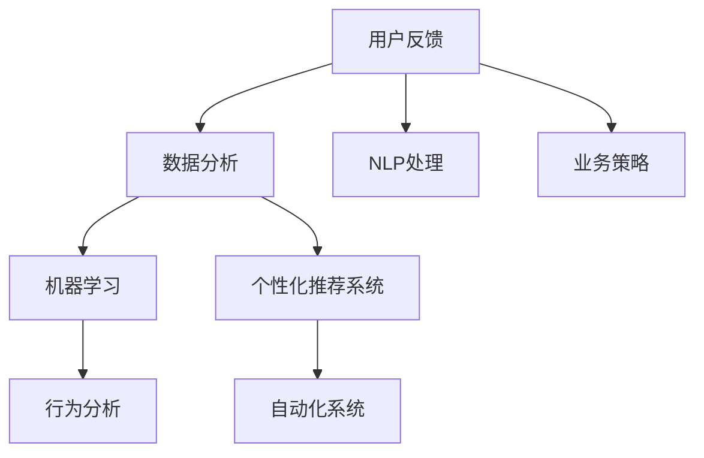

                 

# AI如何通过用户反馈优化电商产品

## 1. 背景介绍

在数字化转型浪潮的推动下，电商行业正在经历前所未有的变革。消费者对个性化、智能化、实时化购物体验的追求日益增加，促使电商企业必须不断提升产品和服务质量，以赢得市场竞争。其中，用户反馈成为电商产品优化的重要依据，帮助企业快速响应用户需求，提升用户满意度。

用户反馈在电商产品优化中扮演着至关重要的角色。通过收集用户评价、点击、浏览、购买等行为数据，电商企业可以准确把握用户偏好和痛点，从而指导产品迭代、改进用户体验、优化供应链管理。然而，面对海量数据和多样化的用户需求，如何高效利用用户反馈进行产品优化，仍然是一个复杂的挑战。

## 2. 核心概念与联系

为了更好地理解AI如何通过用户反馈优化电商产品，我们先介绍一些核心概念及其相互联系：

### 2.1 核心概念概述

- **用户反馈(User Feedback)**：指用户在电商平台上对产品、服务或体验的评价和意见。包括评价、评论、评分、投诉等多种形式。
- **数据分析(Analytics)**：指对用户反馈数据的收集、整理、分析和挖掘，以提取有价值的信息和洞见。
- **自然语言处理(NLP)**：指使用人工智能技术对用户反馈中的文本数据进行处理和分析，提取有用信息。
- **机器学习(Machine Learning)**：指基于用户反馈数据构建预测模型，进行用户行为预测和推荐。
- **个性化推荐系统(Recommendation System)**：指根据用户历史行为和偏好，实时提供个性化的商品推荐。
- **行为分析(Behavioral Analysis)**：指对用户行为数据进行建模分析，识别用户偏好、需求和购买动机。
- **自动化系统(Automation System)**：指使用AI技术自动化处理用户反馈，进行智能分析和响应。

这些核心概念通过以下Mermaid流程图展示其相互关系：



这个流程图展示了用户反馈如何通过数据收集、分析和应用，转化为电商产品优化的实际行动：

1. **用户反馈**：作为电商产品优化的起点，通过收集用户评价、评分、评论等多种形式的数据，获得用户对产品的直接反馈。
2. **数据分析**：对收集到的反馈数据进行整理和分析，识别用户偏好和行为模式，从中提取出有价值的信息。
3. **NLP处理**：利用自然语言处理技术，对用户文本反馈进行情感分析、实体识别、主题分类等处理，提取关键信息。
4. **机器学习**：构建预测模型，对用户行为进行预测，如购买意向、流失风险等，指导产品优化和推荐。
5. **个性化推荐系统**：根据用户历史行为和偏好，实时提供个性化的商品推荐，提升用户体验和转化率。
6. **行为分析**：通过建模分析用户行为数据，识别用户偏好、需求和购买动机，优化产品设计和供应链管理。
7. **自动化系统**：使用AI技术自动化处理用户反馈，进行智能分析和响应，实现快速迭代和优化。
8. **业务策略**：结合数据分析和自动化系统输出，制定科学合理的电商产品优化策略，指导实际应用。

## 3. 核心算法原理 & 具体操作步骤
### 3.1 算法原理概述

AI通过用户反馈优化电商产品的核心算法原理可以概括为：

- **数据采集**：收集用户反馈数据，包括评价、评分、评论等，构成原始数据集。
- **数据清洗**：对收集到的数据进行预处理，如去重、过滤无关信息等，确保数据质量。
- **特征提取**：利用自然语言处理技术，从用户反馈文本中提取关键特征，如情感极性、实体信息、话题等。
- **模型训练**：基于提取的特征和标注数据，使用机器学习算法构建预测模型，如情感分析模型、实体识别模型、用户行为预测模型等。
- **结果应用**：将模型预测结果应用于电商产品优化中，如调整商品价格、更新商品描述、改进推荐系统等。

### 3.2 算法步骤详解

以下是基于用户反馈优化的电商产品AI优化的详细步骤：

1. **数据采集与清洗**：
    - 收集用户评价、评分、评论等多种形式的反馈数据。
    - 对收集到的数据进行去重、过滤无关信息、处理噪声等预处理，确保数据质量。
    
2. **特征提取**：
    - 利用NLP技术，对用户反馈文本进行情感分析、实体识别、主题分类等处理，提取关键信息。
    - 对处理后的文本特征进行向量化，方便后续建模分析。
    
3. **模型训练与评估**：
    - 根据提取的特征和标注数据，选择合适的机器学习算法，如逻辑回归、支持向量机、随机森林等。
    - 使用交叉验证等方法对模型进行训练和评估，选择最优模型。
    
4. **结果应用**：
    - 将训练好的模型应用于电商产品优化中，如调整商品价格、更新商品描述、改进推荐系统等。
    - 实时监控模型效果，根据反馈数据进行动态调整和优化。

### 3.3 算法优缺点

基于用户反馈优化的电商产品AI优化方法具有以下优点：

- **实时性**：利用实时反馈数据，能够快速响应用户需求，进行产品迭代和优化。
- **准确性**：通过机器学习算法构建预测模型，可以准确分析用户行为和偏好，提供有针对性的产品优化建议。
- **个性化**：基于用户历史行为和偏好，提供个性化的商品推荐，提升用户体验和转化率。
- **自动化**：自动化处理用户反馈，进行智能分析和响应，减少人工干预，提高效率。

同时，该方法也存在以下缺点：

- **数据依赖**：依赖于高质量的用户反馈数据，获取数据的成本较高，数据质量也可能影响模型效果。
- **模型泛化**：不同用户群体和产品类型的反馈数据可能存在较大差异，模型泛化性能可能受限。
- **解释性不足**：机器学习模型往往是“黑盒”系统，难以解释其内部工作机制和决策逻辑。
- **伦理风险**：模型可能学习到有害的偏见和负面信息，对用户隐私和公平性带来风险。

### 3.4 算法应用领域

基于用户反馈优化的AI方法广泛应用于电商产品优化中，涵盖了从商品推荐、价格调整、库存管理到客户服务等各个环节：

- **商品推荐**：根据用户历史行为和偏好，实时提供个性化的商品推荐，提升用户体验和转化率。
- **价格优化**：利用用户反馈数据和市场动态，动态调整商品价格，提高销售效率和利润率。
- **库存管理**：预测用户需求变化，优化库存结构，减少库存积压和缺货风险。
- **客户服务**：利用用户反馈数据，改进客户服务流程和质量，提升客户满意度。

此外，该方法还可以在社交媒体、内容平台、旅游业等多个领域得到应用，通过AI技术提升用户体验和运营效率。

## 4. 数学模型和公式 & 详细讲解 & 举例说明

### 4.1 数学模型构建

在电商产品优化的AI应用中，常用的数学模型包括：

- **用户行为预测模型**：预测用户购买意向、流失风险等行为，如逻辑回归、随机森林等。
- **商品评分预测模型**：预测商品评分，如线性回归、神经网络等。
- **情感分析模型**：对用户评论进行情感分析，如情感分类模型、深度学习模型等。

### 4.2 公式推导过程

以用户行为预测模型为例，其推导过程如下：

假设用户行为可以用特征向量 $\mathbf{x} \in \mathbb{R}^n$ 表示，购买行为可以用标签 $y \in \{0, 1\}$ 表示。用户行为预测模型可以表示为：

$$
\hat{y} = \text{sigmoid}(\mathbf{w} \cdot \mathbf{x} + b)
$$

其中 $\mathbf{w} \in \mathbb{R}^n$ 为模型参数，$b$ 为偏置项，sigmoid函数用于将线性组合映射到 $[0, 1]$ 的区间。

模型参数 $\mathbf{w}$ 和 $b$ 的估计值可以通过最小化预测误差进行求解。假设训练数据集为 $\{(\mathbf{x}_i, y_i)\}_{i=1}^N$，则损失函数为：

$$
\mathcal{L}(\mathbf{w}, b) = \frac{1}{N}\sum_{i=1}^N L(y_i, \hat{y}_i)
$$

其中 $L$ 为损失函数，常用的有交叉熵损失函数：

$$
L(y_i, \hat{y}_i) = -y_i \log \hat{y}_i - (1-y_i) \log (1-\hat{y}_i)
$$

最小化损失函数即可求解出最优的模型参数 $\mathbf{w}^*$ 和 $b^*$。

### 4.3 案例分析与讲解

以电商产品价格优化为例，利用用户反馈数据构建价格预测模型：

1. **数据采集与清洗**：
    - 收集用户评价、评分、评论等数据，构成原始数据集。
    - 对数据进行去重、过滤无关信息、处理噪声等预处理，确保数据质量。

2. **特征提取**：
    - 利用NLP技术，对用户反馈文本进行情感分析、实体识别、主题分类等处理，提取关键信息。
    - 对处理后的文本特征进行向量化，方便后续建模分析。

3. **模型训练与评估**：
    - 根据提取的特征和标注数据，使用逻辑回归算法进行训练和评估。
    - 使用交叉验证等方法对模型进行训练和评估，选择最优模型。

4. **结果应用**：
    - 将训练好的模型应用于电商产品优化中，如调整商品价格、更新商品描述、改进推荐系统等。
    - 实时监控模型效果，根据反馈数据进行动态调整和优化。

## 5. 项目实践：代码实例和详细解释说明

### 5.1 开发环境搭建

在进行电商产品优化的AI应用开发前，我们需要准备好开发环境。以下是使用Python进行TensorFlow开发的环境配置流程：

1. 安装Anaconda：从官网下载并安装Anaconda，用于创建独立的Python环境。

2. 创建并激活虚拟环境：
```bash
conda create -n ai-env python=3.8 
conda activate ai-env
```

3. 安装TensorFlow：根据CUDA版本，从官网获取对应的安装命令。例如：
```bash
conda install tensorflow -c tensorflow -c conda-forge
```

4. 安装其他相关库：
```bash
pip install numpy pandas scikit-learn tensorflow_hub
```

5. 安装TensorBoard：
```bash
pip install tensorboard
```

完成上述步骤后，即可在`ai-env`环境中开始电商产品优化的AI应用开发。

### 5.2 源代码详细实现

下面我们以用户行为预测模型为例，给出使用TensorFlow进行电商产品优化的代码实现。

首先，定义数据集类：

```python
import tensorflow as tf
from tensorflow.keras.layers import Input, Dense, Embedding, LSTM
from tensorflow.keras.models import Model

class DataLoader(tf.keras.utils.Sequence):
    def __init__(self, x, y, batch_size=32):
        self.x = x
        self.y = y
        self.batch_size = batch_size

    def __len__(self):
        return len(self.x) // self.batch_size

    def __getitem__(self, idx):
        x_batch, y_batch = self.x[idx * self.batch_size:(idx + 1) * self.batch_size], self.y[idx * self.batch_size:(idx + 1) * self.batch_size]
        return x_batch, y_batch
```

然后，定义模型结构：

```python
def build_model(input_dim, output_dim):
    input_layer = Input(shape=(input_dim,))
    embedding_layer = Embedding(input_dim, 128)(input_layer)
    lstm_layer = LSTM(64)(embedding_layer)
    output_layer = Dense(output_dim, activation='sigmoid')(lstm_layer)
    model = Model(inputs=input_layer, outputs=output_layer)
    return model
```

接着，定义训练和评估函数：

```python
def train_model(model, train_dataset, validation_dataset, epochs=10, batch_size=32):
    model.compile(optimizer='adam', loss='binary_crossentropy', metrics=['accuracy'])
    model.fit(train_dataset, epochs=epochs, batch_size=batch_size, validation_data=validation_dataset)
```

最后，启动训练流程：

```python
input_dim = 100
output_dim = 1

x_train, y_train = load_train_data()
x_val, y_val = load_val_data()

model = build_model(input_dim, output_dim)
train_dataset = DataLoader(x_train, y_train, batch_size=32)
val_dataset = DataLoader(x_val, y_val, batch_size=32)

train_model(model, train_dataset, val_dataset)
```

以上就是使用TensorFlow进行电商产品优化的用户行为预测模型的完整代码实现。可以看到，TensorFlow提供了强大的深度学习框架，使得电商产品优化的AI应用开发变得更加便捷高效。

### 5.3 代码解读与分析

让我们再详细解读一下关键代码的实现细节：

**DataLoader类**：
- `__init__`方法：初始化训练数据集和批量大小。
- `__len__`方法：返回数据集的总样本数。
- `__getitem__`方法：对单个批次进行处理，返回训练数据和标签。

**build_model函数**：
- 定义模型的输入层、嵌入层、LSTM层和输出层，使用Dense层进行二分类输出。
- 返回构建好的模型。

**train_model函数**：
- 编译模型，指定优化器、损失函数和评估指标。
- 使用`fit`方法训练模型，指定训练数据集、批量大小和迭代轮数。

**启动训练流程**：
- 定义输入维度和输出维度，加载训练和验证数据集。
- 构建模型和数据集。
- 调用`train_model`函数进行模型训练。

通过上述代码实现，我们可以看到，使用TensorFlow构建电商产品优化的AI应用相对简单，能够快速完成模型构建、训练和评估等关键步骤。

当然，实际应用中还需要考虑更多因素，如模型的保存和部署、超参数的自动搜索、数据增强等，以进一步优化模型性能。

## 6. 实际应用场景

### 6.1 智能推荐系统

电商平台的智能推荐系统是基于用户反馈优化的典型应用场景。通过收集用户行为数据，如浏览、点击、购买等，利用机器学习模型构建推荐引擎，实时生成个性化推荐结果。推荐系统可以根据用户的历史行为和偏好，推荐最相关和最有吸引力的商品，提升用户购物体验和转化率。

### 6.2 库存管理

电商平台的库存管理也需要利用用户反馈数据进行优化。通过预测用户购买意向和流失风险，动态调整库存结构，避免库存积压和缺货风险。库存管理优化可以显著提高运营效率，减少运营成本。

### 6.3 客户服务

用户反馈数据可以用于优化客户服务流程和质量。通过分析用户投诉、客服记录等数据，识别常见问题和改进点，提升客户满意度。同时，实时监控用户反馈，及时响应和解决用户问题，构建更高效、更人性化的客户服务系统。

### 6.4 未来应用展望

随着电商行业的发展，基于用户反馈优化的AI技术将进一步深入应用。未来，AI技术有望在以下领域发挥更大作用：

- **多渠道协同**：将电商平台的各个渠道（如PC、移动端、社交媒体等）的用户反馈数据进行整合，实现多渠道协同优化。
- **跨域合作**：与第三方数据提供商合作，获取更多外部数据，提升模型预测的准确性和泛化性。
- **用户画像构建**：通过用户行为数据分析，构建详细的用户画像，提供更加个性化的推荐和服务。
- **情感分析**：结合情感分析技术，识别用户情绪变化，及时调整产品和营销策略，提升用户体验。

以上展望展示了大语言模型微调技术在电商产品优化中的广阔前景，相信随着技术的不断进步，AI将在电商行业带来更多创新和突破。

## 7. 工具和资源推荐

### 7.1 学习资源推荐

为了帮助开发者系统掌握基于用户反馈优化的电商产品AI技术，这里推荐一些优质的学习资源：

1. 《深度学习入门：基于TensorFlow》系列书籍：由知名AI专家撰写，深入浅出地介绍了深度学习的基本原理和实践技巧。
2. 《机器学习实战》课程：由Coursera平台提供，涵盖机器学习基础、算法实现和应用场景，适合初学者学习。
3. TensorFlow官方文档：提供了丰富的模型库和示例代码，是学习TensorFlow的必备资源。
4. TensorFlow Hub：包含多种预训练模型和模型组件，方便快速搭建电商产品优化的AI应用。
5. Kaggle竞赛平台：提供大量电商领域的竞赛数据集，通过竞赛实战提升AI应用开发能力。

通过对这些资源的学习实践，相信你一定能够快速掌握基于用户反馈优化的电商产品AI技术，并用于解决实际的NLP问题。

### 7.2 开发工具推荐

高效的开发离不开优秀的工具支持。以下是几款用于电商产品优化的AI开发工具：

1. TensorFlow：由Google主导开发的深度学习框架，生产部署方便，适合大规模工程应用。提供了丰富的模型库和工具支持，是电商产品优化的首选工具。
2. PyTorch：基于Python的开源深度学习框架，灵活动态的计算图，适合快速迭代研究。部分预训练模型和工具也支持PyTorch。
3. Jupyter Notebook：开源的交互式编程环境，支持Python、R等多种编程语言，方便代码开发和结果展示。
4. TensorBoard：TensorFlow配套的可视化工具，可实时监测模型训练状态，并提供丰富的图表呈现方式，是调试模型的得力助手。
5. Weights & Biases：模型训练的实验跟踪工具，可以记录和可视化模型训练过程中的各项指标，方便对比和调优。

合理利用这些工具，可以显著提升电商产品优化的AI应用的开发效率，加快创新迭代的步伐。

### 7.3 相关论文推荐

电商产品优化的AI技术源于学界的持续研究。以下是几篇奠基性的相关论文，推荐阅读：

1. Predicting Customer Purchase Intention：介绍了一种基于用户行为数据的用户购买意向预测模型。
2. Deep Learning for Recommendation Systems：综述了深度学习在推荐系统中的应用，包括CTR预估、序列推荐等。
3. Collaborative Filtering for Implicit Feedback Datasets：讨论了协同过滤算法在电商推荐系统中的实现和优化。
4. Personalized Product Recommendation Using Deep Learning：介绍了深度学习在个性化推荐系统中的应用，如CNN、RNN等。
5. Behavioral Modeling for Recommendation Systems：探讨了用户行为建模在推荐系统中的应用，包括序列模型、社交网络模型等。

这些论文代表了大语言模型微调技术的发展脉络。通过学习这些前沿成果，可以帮助研究者把握学科前进方向，激发更多的创新灵感。

## 8. 总结：未来发展趋势与挑战

### 8.1 总结

本文对基于用户反馈优化的电商产品AI方法进行了全面系统的介绍。首先阐述了用户反馈在电商产品优化中的重要性和当前面临的挑战，明确了AI技术在电商产品优化中的关键作用。其次，从原理到实践，详细讲解了用户行为预测、推荐系统、库存管理等电商产品优化的AI应用流程，给出了电商产品优化的完整代码实现。同时，本文还广泛探讨了电商产品优化的AI应用场景，展示了AI技术在电商行业中的广阔应用前景。

通过本文的系统梳理，可以看到，基于用户反馈优化的AI技术在电商产品优化中具有重要价值。它不仅能够快速响应用户需求，提升用户体验和运营效率，还能够在个性化推荐、库存管理、客户服务等多个环节发挥作用。未来，随着AI技术的不断进步，电商产品优化的AI应用必将迎来更多创新和突破。

### 8.2 未来发展趋势

展望未来，电商产品优化的AI技术将呈现以下几个发展趋势：

1. **实时性提升**：通过大数据分析和实时计算技术，实现对用户行为的实时预测和响应，提升电商产品优化的速度和效率。
2. **多模态融合**：结合文本、图像、视频等多模态数据，构建更加全面和准确的用户行为模型，提升预测和推荐效果。
3. **模型优化**：通过深度学习模型、强化学习模型等技术，进一步提升电商产品优化的精度和鲁棒性。
4. **用户隐私保护**：加强对用户隐私和数据安全的保护，确保用户数据安全，提升用户信任度。
5. **跨平台协同**：将电商平台的各个渠道（如PC、移动端、社交媒体等）的用户反馈数据进行整合，实现多渠道协同优化。
6. **智能决策支持**：结合AI技术，构建智能决策支持系统，提升电商企业的运营决策能力。

以上趋势凸显了电商产品优化的AI技术的广阔前景。这些方向的探索发展，必将进一步提升电商产品的优化效果，为电商企业带来更多的竞争优势。

### 8.3 面临的挑战

尽管电商产品优化的AI技术已经取得了一定进展，但在实际应用中仍面临诸多挑战：

1. **数据质量问题**：用户反馈数据的质量直接影响模型的预测效果，数据缺失、噪声等问题亟需解决。
2. **模型泛化性不足**：不同用户群体和产品类型的反馈数据可能存在较大差异，模型泛化性能可能受限。
3. **伦理和隐私问题**：电商企业必须严格遵守数据隐私保护法规，避免侵犯用户隐私。
4. **计算资源限制**：电商产品优化需要处理海量数据，计算资源和存储资源的高需求是一个挑战。
5. **模型解释性不足**：机器学习模型通常是“黑盒”系统，难以解释其内部工作机制和决策逻辑。
6. **业务集成复杂性**：将AI技术与电商业务系统进行深度集成，需要考虑多方面因素，实现难度较大。

正视电商产品优化的AI技术面临的这些挑战，积极应对并寻求突破，将是大语言模型微调走向成熟的必由之路。相信随着学界和产业界的共同努力，这些挑战终将一一被克服，电商产品优化的AI应用必将在电商行业带来更多创新和突破。

### 8.4 研究展望

面对电商产品优化的AI技术面临的挑战，未来的研究需要在以下几个方面寻求新的突破：

1. **无监督学习**：探索无监督学习算法，从非结构化数据中提取有用信息，提升模型预测能力。
2. **联邦学习**：通过联邦学习技术，在保护用户隐私的前提下，利用多源数据进行模型训练和优化。
3. **多模态融合**：研究多模态数据融合技术，结合文本、图像、视频等多模态数据，构建更加全面和准确的用户行为模型。
4. **可解释AI**：开发可解释AI模型，增强模型预测的透明性和可解释性，提升用户信任度。
5. **个性化推荐**：结合个性化推荐算法，提供更加个性化的商品推荐，提升用户体验和转化率。
6. **实时预测**：结合实时计算技术，实现对用户行为的实时预测和响应，提升电商产品优化的速度和效率。

这些研究方向的探索，必将引领电商产品优化的AI技术迈向更高的台阶，为电商企业带来更多的竞争优势。面向未来，电商产品优化的AI技术还需要与其他AI技术进行更深入的融合，如知识表示、因果推理、强化学习等，多路径协同发力，共同推动电商企业的发展。

## 9. 附录：常见问题与解答

**Q1：电商产品优化的AI方法是否适用于所有电商平台？**

A: 电商产品优化的AI方法对平台规模和类型具有一定的适应性，但对于小型电商或特定类型的电商平台，如B2B、C2C等，可能需要进行适当的调整和优化。不同平台的用户行为和需求可能存在差异，需要根据具体情况进行选择和定制。

**Q2：如何评估电商产品优化的AI效果？**

A: 电商产品优化的AI效果评估可以从以下几个方面入手：
1. **精确度**：预测模型对用户行为预测的准确性，如分类准确率、均方误差等。
2. **召回率**：预测模型对真实用户行为的覆盖率，如召回率、F1值等。
3. **转化率**：预测模型对用户行为的预测结果转化为实际行为的效果，如点击率、购买率等。
4. **用户满意度**：通过用户调查、评分等反馈数据，评估用户对电商产品和服务的满意度。

**Q3：电商产品优化的AI应用是否需要考虑数据隐私问题？**

A: 电商产品优化的AI应用必须严格遵守数据隐私保护法规，保护用户数据隐私。具体的隐私保护措施包括数据匿名化、差分隐私、访问控制等，确保用户数据不被滥用。同时，企业应该建立数据使用透明机制，确保用户知情权和选择权。

**Q4：电商产品优化的AI模型如何应对数据偏差问题？**

A: 电商产品优化的AI模型应对数据偏差问题可以从以下几个方面入手：
1. **数据收集**：确保数据来源多样化和全面性，避免单一来源带来的偏差。
2. **数据清洗**：对数据进行去重、过滤无关信息、处理噪声等预处理，确保数据质量。
3. **特征工程**：在特征提取和建模过程中，考虑数据的平衡性和代表性，避免特征选择偏差。
4. **模型调参**：调整模型参数，如权重衰减、正则化、样本权重等，减少模型对偏见的敏感性。
5. **模型监控**：实时监控模型输出，及时发现和纠正预测偏差。

**Q5：电商产品优化的AI应用如何应对市场变化？**

A: 电商产品优化的AI应用应具备较强的灵活性和适应性，能够及时应对市场变化。具体措施包括：
1. **数据更新**：定期更新数据集，确保模型基于最新数据进行训练和优化。
2. **模型迭代**：根据市场变化和新数据，进行模型重新训练和优化，提高模型泛化性能。
3. **反馈机制**：建立用户反馈机制，实时收集用户意见和建议，指导模型优化。
4. **业务适应性**：结合业务需求和市场变化，调整优化策略和模型结构，确保模型与业务高度匹配。

通过以上措施，电商产品优化的AI应用能够持续优化，保持与市场变化的同步，提升用户体验和运营效率。

---

作者：禅与计算机程序设计艺术 / Zen and the Art of Computer Programming

