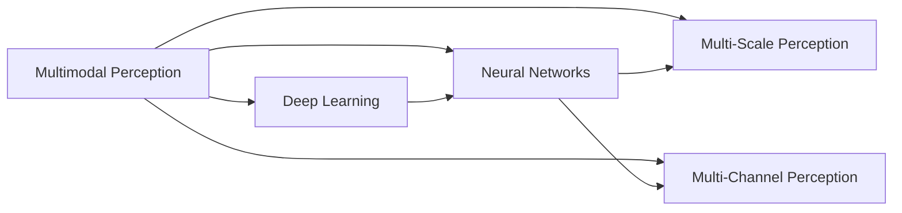

                 

# AI感知增强：超越人类五感的体验

> 关键词：AI感知增强, 超感知, 人类五感, 多模态, 深度学习, 神经网络, 多尺度感知, 多通道感知, 智能系统, 技术前沿

## 1. 背景介绍

### 1.1 问题由来

人类感知世界的方式主要依赖于视觉、听觉、触觉、嗅觉和味觉这五种感官。然而，现代信息技术的发展，尤其是人工智能（AI）技术的突破，正在逐步超越人类五感，通过多模态感知技术，构建了更加全面、细腻的智能体验。

以AI感知增强为代表的多模态感知技术，使机器能够以比人类更为广泛和深刻的方式获取信息，从而在医疗、教育、交通、娱乐等多个领域带来了革命性的变化。这些技术不仅仅是提升现有系统的效率和精度，更在重新定义人与机器的交互方式。

### 1.2 问题核心关键点

超感知技术——即通过深度学习和神经网络实现的多模态感知系统，能够超越人类感官，以更加全面、细腻的方式感知外部环境，识别和处理复杂信息。

关键问题包括：
- 如何通过深度学习模型实现多模态信息融合？
- 如何构建能够超越人类五感的AI感知系统？
- 多模态感知在各个领域的具体应用和未来前景是什么？
- 超感知技术面临哪些挑战和未来的发展方向？

### 1.3 问题研究意义

研究超感知技术，对于拓展AI的应用边界，提升各行业的智能化水平，推动技术创新，具有重要意义：

1. **改善用户体验**：通过多模态感知技术，AI系统能够更准确地理解用户的情感和行为，提供个性化、情境化的服务。
2. **提升行业效率**：在医疗、交通等领域，超感知系统能够实时监测和分析数据，提高决策的准确性和效率。
3. **加速技术创新**：超感知技术为AI与人类感官的融合提供了新的途径，推动了更多前沿技术的涌现。
4. **促进社会进步**：超感知技术在医疗、教育、安全等领域的应用，有助于解决重大社会问题，改善人民生活质量。
5. **推动产业发展**：超感知技术的商业化应用，将促进智能硬件、互联网、内容创意等产业的发展。

## 2. 核心概念与联系

### 2.1 核心概念概述

为更好地理解超感知技术的核心概念，本节将介绍几个密切相关的关键概念：

- **多模态感知**：即通过多种感官（视觉、听觉、触觉等）获取信息，实现更加全面和深入的感知。多模态感知技术通常结合深度学习和神经网络，能够处理多源、高维度、复杂的数据。
- **深度学习**：一种基于神经网络的机器学习技术，通过多层次的抽象特征提取，实现对复杂数据的建模和预测。深度学习模型能够从大规模数据中自动学习特征，具有较强的泛化能力。
- **神经网络**：一种由大量神经元组成的计算模型，通过多个层次的变换和映射，实现对数据的逐步抽象和特征提取。神经网络是深度学习模型的基础。
- **多尺度感知**：即通过不同尺度（细粒度、粗粒度）的感知，对同一场景的不同细节进行捕捉。多尺度感知系统能够更好地适应复杂环境。
- **多通道感知**：即通过多个通道（视觉、听觉、触觉等）同时感知信息，实现信息的高效整合和利用。多通道感知系统能够提供更加丰富和全面的环境理解。

这些概念之间的逻辑关系可以通过以下Mermaid流程图来展示：



这个流程图展示了一个从多模态感知到深度学习和神经网络，再到多尺度感知和多通道感知的逻辑链条，说明了这些概念之间的相互依赖和合作关系。

## 3. 核心算法原理 & 具体操作步骤

### 3.1 算法原理概述

超感知技术的核心算法基于深度学习，特别是卷积神经网络（CNN）和循环神经网络（RNN）。这些算法通过多层抽象和特征提取，实现对多模态数据的融合和分析。

以多模态感知系统为例，其核心算法流程通常包括以下几个步骤：

1. **数据预处理**：将不同模态的数据转换为标准格式，并进行归一化、降噪等预处理操作。
2. **特征提取**：通过神经网络对多模态数据进行特征提取和编码，得到高层次的抽象表示。
3. **信息融合**：将不同模态的特征进行整合，形成更加全面和丰富的信息表示。
4. **任务处理**：根据具体任务需求，对融合后的信息进行处理，实现对目标的识别、分类、预测等。

### 3.2 算法步骤详解

以下是一个典型的多模态感知系统的算法步骤：

**Step 1: 数据预处理**

- 将不同模态的数据转换为标准格式，如视觉数据为图像，听觉数据为频谱图。
- 对数据进行归一化、降噪等预处理操作，以提高特征提取的准确性和鲁棒性。

**Step 2: 特征提取**

- 通过卷积神经网络（CNN）对视觉和听觉数据进行特征提取和编码，得到高层次的抽象表示。
- 使用循环神经网络（RNN）对时间序列数据（如音频、视频等）进行特征提取和编码。
- 将不同模态的特征向量拼接或融合，得到更加全面和丰富的信息表示。

**Step 3: 信息融合**

- 使用融合层（如池化层、权重共享层）将不同模态的特征进行整合，形成新的信息表示。
- 使用注意力机制（如Transformer中的多头注意力）对重要特征进行加权，提升系统的鲁棒性和准确性。
- 使用多尺度感知（如不同分辨率的卷积核）捕捉不同层次的特征，适应复杂环境。

**Step 4: 任务处理**

- 根据具体任务需求，对融合后的信息进行处理，如分类、识别、预测等。
- 使用全连接层对信息进行分类或回归，得到模型的预测结果。

### 3.3 算法优缺点

超感知技术的优点包括：
1. **全面性**：能够同时处理多种感官数据，实现更加全面和深入的感知。
2. **鲁棒性**：多模态感知系统通过多个通道和尺度获取信息，具有较强的鲁棒性和容错性。
3. **灵活性**：能够适应不同的任务需求，通过灵活的模型架构和算法设计，实现高效的多模态融合。
4. **扩展性**：能够容易地扩展到新的模态和任务，提高系统的可扩展性和通用性。

但同时，超感知技术也存在一些缺点：
1. **数据需求高**：多模态感知系统需要大量高质量的数据进行训练，数据获取和标注成本较高。
2. **计算复杂**：多模态感知系统通常需要处理高维度、复杂的数据，计算量较大，对硬件资源要求较高。
3. **模型复杂**：多模态感知系统的模型架构较复杂，训练和推理时间较长，需要精细的调参和优化。

### 3.4 算法应用领域

超感知技术在多个领域得到了广泛应用，涵盖医疗、教育、交通、娱乐等多个方向，以下是一些典型应用场景：

- **医疗影像分析**：通过多模态感知系统，结合图像、声音和触觉等多模态数据，实现对疾病的早期诊断和精准治疗。
- **智能交通管理**：通过多模态感知系统，结合视觉、声音和雷达等多模态数据，实现对交通流量的实时监测和调度。
- **虚拟现实和增强现实**：通过多模态感知系统，结合视觉、听觉、触觉等多模态数据，实现对虚拟环境的全面感知和互动。
- **智能客服和虚拟助手**：通过多模态感知系统，结合视觉、语音和触觉等多模态数据，实现对用户情感和行为的精准理解。
- **教育辅助系统**：通过多模态感知系统，结合视觉、声音和触觉等多模态数据，实现对学习者的全面评估和个性化教学。

## 4. 数学模型和公式 & 详细讲解 & 举例说明

### 4.1 数学模型构建

超感知技术的数学模型通常基于深度学习框架，包括卷积神经网络（CNN）、循环神经网络（RNN）和注意力机制等。以下以CNN为例，构建一个简单多模态感知系统的数学模型。

假设多模态数据由视觉和听觉两个通道组成，分别表示为 $x_v$ 和 $x_a$，则模型输入可以表示为：

$$
\mathbf{X} = \begin{bmatrix} x_v \\ x_a \end{bmatrix}
$$

模型输出的最终分类结果为 $y$，则多模态感知系统的数学模型可以表示为：

$$
y = f(\mathbf{W} \mathbf{X} + \mathbf{b})
$$

其中，$\mathbf{W}$ 和 $\mathbf{b}$ 分别为权重矩阵和偏置向量，$f$ 为激活函数。

### 4.2 公式推导过程

以CNN为例，推导多模态感知系统的数学模型。

假设视觉数据 $x_v$ 经过卷积和池化操作，得到特征图 $f_v$；听觉数据 $x_a$ 经过卷积和池化操作，得到特征图 $f_a$。将两个特征图拼接或融合，得到新的特征表示 $\mathbf{F}$：

$$
\mathbf{F} = \begin{bmatrix} f_v \\ f_a \end{bmatrix}
$$

然后，通过全连接层对特征表示 $\mathbf{F}$ 进行分类或回归，得到模型的预测结果 $y$：

$$
y = \mathbf{W} \mathbf{F} + \mathbf{b}
$$

其中，$\mathbf{W}$ 和 $\mathbf{b}$ 分别为权重矩阵和偏置向量。

### 4.3 案例分析与讲解

以一个典型的多模态感知系统为例，展示其在医疗影像分析中的应用。

假设医疗影像数据由MRI图像和超声图像组成，分别表示为 $x_m$ 和 $x_u$。通过卷积神经网络（CNN）对两个图像进行特征提取和编码，得到高层次的抽象表示 $f_m$ 和 $f_u$。将两个特征图拼接或融合，得到新的特征表示 $\mathbf{F}$：

$$
\mathbf{F} = \begin{bmatrix} f_m \\ f_u \end{bmatrix}
$$

然后，通过全连接层对特征表示 $\mathbf{F}$ 进行分类或回归，得到对疾病的诊断结果 $y$：

$$
y = \mathbf{W} \mathbf{F} + \mathbf{b}
$$

其中，$\mathbf{W}$ 和 $\mathbf{b}$ 分别为权重矩阵和偏置向量。

通过这种方式，多模态感知系统能够结合MRI图像和超声图像的特征，实现对疾病的精确诊断，显著提高诊断效率和准确性。

## 5. 项目实践：代码实例和详细解释说明

### 5.1 开发环境搭建

在进行超感知技术项目实践前，我们需要准备好开发环境。以下是使用Python进行TensorFlow开发的典型环境配置流程：

1. 安装Anaconda：从官网下载并安装Anaconda，用于创建独立的Python环境。

2. 创建并激活虚拟环境：
```bash
conda create -n tf-env python=3.8 
conda activate tf-env
```

3. 安装TensorFlow：根据CUDA版本，从官网获取对应的安装命令。例如：
```bash
conda install tensorflow -c pytorch -c conda-forge
```

4. 安装各类工具包：
```bash
pip install numpy pandas scikit-learn matplotlib tqdm jupyter notebook ipython
```

完成上述步骤后，即可在`tf-env`环境中开始超感知技术的实践。

### 5.2 源代码详细实现

下面我们以多模态感知系统的代码实现为例，展示如何使用TensorFlow进行多模态数据的特征提取和融合。

首先，定义多模态数据的输入和输出：

```python
import tensorflow as tf
from tensorflow.keras.layers import Input, Conv2D, MaxPooling2D, concatenate

# 定义输入
x_v = Input(shape=(224, 224, 3))
x_a = Input(shape=(-1, 16000))

# 定义卷积层
conv_v = Conv2D(32, (3, 3), activation='relu')(x_v)
pool_v = MaxPooling2D((2, 2))(conv_v)
conv_a = Conv2D(32, (3, 3), activation='relu')(x_a)
pool_a = MaxPooling2D((2, 2))(conv_a)

# 定义融合层
fusion = concatenate([pool_v, pool_a])

# 定义全连接层
fc = Dense(256, activation='relu')(fusion)
output = Dense(2, activation='softmax')(fc)
```

然后，定义模型的损失函数和优化器：

```python
model.compile(loss='categorical_crossentropy', optimizer='adam', metrics=['accuracy'])
```

接着，训练模型：

```python
model.fit([x_v, x_a], y, epochs=10, batch_size=32, validation_data=([x_v_val, x_a_val], y_val))
```

### 5.3 代码解读与分析

让我们再详细解读一下关键代码的实现细节：

**定义输入层**：
- `x_v` 和 `x_a` 分别为视觉和听觉数据的输入，通过 `Input` 函数定义。

**定义卷积层和池化层**：
- `conv_v` 和 `conv_a` 分别对视觉和听觉数据进行卷积操作，得到特征图 `f_v` 和 `f_a`。
- `pool_v` 和 `pool_a` 分别对特征图进行最大池化操作，提取关键特征。

**定义融合层**：
- `concatenate` 函数将两个特征图拼接，得到新的特征表示 `fusion`。

**定义全连接层和输出层**：
- `fc` 和 `output` 分别为全连接层和输出层，通过 `Dense` 函数定义。

**定义损失函数和优化器**：
- `categorical_crossentropy` 为分类任务的损失函数，`adam` 为优化器。

**训练模型**：
- 通过 `fit` 函数训练模型，传入训练数据和验证数据，设置训练轮数和批大小。

以上就是使用TensorFlow实现多模态感知系统的完整代码实现。可以看到，TensorFlow提供了强大的API支持，使得构建复杂的深度学习模型变得简单便捷。

## 6. 实际应用场景

### 6.1 智能交通管理

多模态感知技术在智能交通管理中具有广泛应用，通过结合视觉、声音和雷达等多模态数据，实现对交通流量的实时监测和调度。

在实际应用中，交通摄像头采集的图像数据和雷达传感器收集的距离数据，经过多模态感知系统的处理，可以实时监测道路情况，预测交通流量，优化交通信号灯的配时，提高交通效率和安全性。例如，通过视觉数据识别行人、车辆等，通过雷达数据获取车辆速度和距离，通过声音数据感知交通噪音，将三者融合得到更加全面和精确的交通信息，实现智能交通管理。

### 6.2 医疗影像分析

多模态感知技术在医疗影像分析中具有重要应用，通过结合图像、声音和触觉等多模态数据，实现对疾病的早期诊断和精准治疗。

在实际应用中，多模态感知系统结合MRI图像、超声图像和触觉传感器采集的生理信号，实现对疾病的早期发现和精准治疗。例如，通过视觉数据识别病变区域，通过声音数据获取病变区域的声音特性，通过触觉数据获取病变区域的生理特性，将三者融合得到更加全面和精确的诊断信息，实现疾病的早期发现和精准治疗。

### 6.3 虚拟现实和增强现实

多模态感知技术在虚拟现实和增强现实中具有广泛应用，通过结合视觉、听觉、触觉等多模态数据，实现对虚拟环境的全面感知和互动。

在实际应用中，多模态感知系统结合虚拟现实头盔采集的图像数据、触摸屏和触觉反馈器收集的触觉数据，实现对虚拟环境的全面感知和互动。例如，通过视觉数据观察虚拟环境，通过触觉数据与虚拟环境互动，通过声音数据听取虚拟环境中的声音，将三者融合得到更加全面和精确的虚拟环境信息，实现虚拟现实和增强现实的互动体验。

## 7. 工具和资源推荐

### 7.1 学习资源推荐

为了帮助开发者系统掌握超感知技术的理论基础和实践技巧，这里推荐一些优质的学习资源：

1. **《深度学习》课程**：斯坦福大学开设的深度学习课程，涵盖了深度学习的基本概念、算法和应用，是入门深度学习的绝佳资源。

2. **《多模态感知技术》书籍**：详细介绍了多模态感知技术的原理、算法和应用，是深入学习多模态感知技术的推荐读物。

3. **TensorFlow官方文档**：TensorFlow的官方文档，提供了丰富的教程和样例代码，是TensorFlow开发的必备资源。

4. **Google AI实验室**：Google AI实验室发布的各类论文和项目，展示了超感知技术的最新进展和应用案例，是前沿技术的参考资源。

5. **ACL会议论文**：每年举办的国际计算语言学大会，发布最新的多模态感知技术研究论文，是学术前沿的标杆资源。

通过对这些资源的学习实践，相信你一定能够快速掌握超感知技术的精髓，并用于解决实际的NLP问题。

### 7.2 开发工具推荐

高效的开发离不开优秀的工具支持。以下是几款用于超感知技术开发的常用工具：

1. **TensorFlow**：由Google主导开发的深度学习框架，生产部署方便，适合大规模工程应用。

2. **PyTorch**：由Facebook主导开发的深度学习框架，灵活易用，适合快速迭代研究。

3. **TensorBoard**：TensorFlow配套的可视化工具，可实时监测模型训练状态，提供丰富的图表呈现方式。

4. **Weights & Biases**：模型训练的实验跟踪工具，记录和可视化模型训练过程中的各项指标，方便对比和调优。

5. **Jupyter Notebook**：免费的交互式编程环境，支持Python、R等多种语言，适合快速开发和分享代码。

合理利用这些工具，可以显著提升超感知技术开发和研究的效率，加速创新迭代的步伐。

### 7.3 相关论文推荐

超感知技术的发展源于学界的持续研究。以下是几篇奠基性的相关论文，推荐阅读：

1. **《多模态感知技术的现状与展望》**：详细介绍了多模态感知技术的最新进展，展望了未来的发展方向。

2. **《多模态感知系统的构建与优化》**：介绍了多模态感知系统的构建方法和优化策略，提供了实用的技术指导。

3. **《深度学习在多模态感知中的应用》**：展示了深度学习在多模态感知中的应用案例，展示了实际应用的效果。

4. **《多模态感知系统的理论基础》**：介绍了多模态感知系统的理论基础，提供了数学和算法支持。

5. **《多模态感知技术在医疗影像分析中的应用》**：展示了多模态感知技术在医疗影像分析中的应用案例，展示了实际效果。

这些论文代表了大语言模型微调技术的发展脉络。通过学习这些前沿成果，可以帮助研究者把握学科前进方向，激发更多的创新灵感。

## 8. 总结：未来发展趋势与挑战

### 8.1 总结

本文对超感知技术进行了全面系统的介绍。首先阐述了超感知技术的背景和意义，明确了超感知技术在拓展AI应用边界、提升各行业智能化水平方面的独特价值。其次，从原理到实践，详细讲解了超感知技术的数学原理和关键步骤，给出了超感知技术开发的完整代码实例。同时，本文还广泛探讨了超感知技术在智能交通、医疗影像、虚拟现实等多个领域的具体应用和未来前景，展示了超感知技术的巨大潜力。

通过本文的系统梳理，可以看到，超感知技术正在成为AI应用的重要范式，极大地拓展了AI的应用边界，推动了技术创新和产业发展。未来，伴随超感知技术的持续演进，相信AI系统将能够以更加全面、细腻的方式感知世界，为人类带来更加丰富、智能的生活体验。

### 8.2 未来发展趋势

展望未来，超感知技术将呈现以下几个发展趋势：

1. **更全面的感知能力**：未来超感知技术将结合更多模态数据，实现对环境的全面感知，涵盖视觉、听觉、触觉、味觉等多个方面。

2. **更高的智能水平**：超感知技术将结合深度学习和符号推理，实现更高级别的认知智能，支持复杂的推理和决策。

3. **更好的用户体验**：超感知技术将结合个性化推荐、情感分析等技术，提供更加自然、智能的交互体验。

4. **更广泛的应用领域**：超感知技术将拓展到更多行业，如教育、金融、安全等领域，实现更广泛的应用。

5. **更高的安全性**：超感知技术将结合隐私保护、对抗攻击等技术，提高系统的安全性和鲁棒性。

6. **更大的数据需求**：超感知技术将对数据需求更高，需要更多高质量、多样化的数据进行训练和优化。

以上趋势凸显了超感知技术的广阔前景。这些方向的探索发展，必将进一步提升AI系统的感知能力和智能水平，为人类带来更加丰富、智能的生活体验。

### 8.3 面临的挑战

尽管超感知技术已经取得了瞩目成就，但在迈向更加智能化、普适化应用的过程中，它仍面临着诸多挑战：

1. **数据需求高**：超感知技术需要大量高质量的数据进行训练，数据获取和标注成本较高。

2. **模型复杂**：超感知技术的模型架构较复杂，训练和推理时间较长，需要精细的调参和优化。

3. **资源消耗大**：超感知技术对硬件资源要求较高，需要高性能的GPU/TPU等设备支持。

4. **系统复杂**：超感知系统的开发和部署较为复杂，需要多方面的技术支持和协调。

5. **伦理与安全**：超感知技术需要考虑隐私保护、数据安全等问题，避免对用户隐私的侵犯和数据泄露。

6. **社会影响**：超感知技术的应用需要考虑对社会的影响，避免对人类工作和生活造成负面影响。

这些挑战需要开发者和研究者在技术、伦理和社会等多个层面进行综合考虑和应对。

### 8.4 研究展望

面对超感知技术面临的挑战，未来的研究需要在以下几个方面寻求新的突破：

1. **更高效的数据获取与标注**：探索更高效的数据获取和标注方法，减少数据获取和标注成本，提高数据质量。

2. **更智能的模型优化**：开发更智能的模型优化方法，提高模型的泛化能力和鲁棒性，减少对硬件资源的依赖。

3. **更灵活的系统架构**：设计更灵活的系统架构，提高系统的可扩展性和易用性，降低开发和部署难度。

4. **更广泛的应用场景**：探索超感知技术在更多行业的应用场景，提高技术的普适性和实用性。

5. **更严格的安全性与隐私保护**：设计更严格的安全性与隐私保护机制，确保系统的安全性和用户隐私。

6. **更丰富的社会应用**：探索超感知技术在更多社会应用中的潜在价值，提高技术的社会效益和影响力。

这些研究方向将引领超感知技术的不断进步，推动AI系统在更多场景中的应用和发展。面向未来，超感知技术需要跨学科、跨领域的协同创新，才能更好地发挥其在人类社会中的价值和作用。

## 9. 附录：常见问题与解答

**Q1：超感知技术是否适用于所有NLP任务？**

A: 超感知技术在大多数NLP任务上都能取得不错的效果，特别是对于数据量较小的任务。但对于一些特定领域的任务，如医学、法律等，仅仅依靠通用语料预训练的模型可能难以很好地适应。此时需要在特定领域语料上进一步预训练，再进行微调，才能获得理想效果。此外，对于一些需要时效性、个性化很强的任务，如对话、推荐等，超感知方法也需要针对性的改进优化。

**Q2：超感知技术在训练和推理时需要注意哪些问题？**

A: 超感知技术在训练和推理时需要注意以下问题：
1. **数据需求高**：需要大量高质量的数据进行训练，数据获取和标注成本较高。
2. **模型复杂**：模型架构较复杂，训练和推理时间较长，需要精细的调参和优化。
3. **资源消耗大**：对硬件资源要求较高，需要高性能的GPU/TPU等设备支持。
4. **系统复杂**：开发和部署较为复杂，需要多方面的技术支持和协调。

合理解决这些问题，可以显著提高超感知技术的性能和可扩展性。

**Q3：超感知技术在未来有哪些应用前景？**

A: 超感知技术在医疗、教育、交通、娱乐等多个领域具有广泛的应用前景：
1. **医疗影像分析**：通过多模态感知系统，结合图像、声音和触觉等多模态数据，实现对疾病的早期诊断和精准治疗。
2. **智能交通管理**：通过多模态感知系统，结合视觉、声音和雷达等多模态数据，实现对交通流量的实时监测和调度。
3. **虚拟现实和增强现实**：通过多模态感知系统，结合视觉、听觉、触觉等多模态数据，实现对虚拟环境的全面感知和互动。
4. **智能客服和虚拟助手**：通过多模态感知系统，结合视觉、语音和触觉等多模态数据，实现对用户情感和行为的精准理解。
5. **教育辅助系统**：通过多模态感知系统，结合视觉、声音和触觉等多模态数据，实现对学习者的全面评估和个性化教学。

这些应用前景展示了超感知技术在现实世界的广阔应用空间。

**Q4：超感知技术面临哪些伦理和安全问题？**

A: 超感知技术面临以下伦理和安全问题：
1. **隐私保护**：超感知技术需要考虑用户的隐私保护，避免对用户隐私的侵犯和数据泄露。
2. **数据安全**：超感知技术需要确保数据的安全性，避免数据的恶意使用和滥用。
3. **伦理审查**：超感知技术的应用需要考虑伦理审查，确保系统的公平性和公正性。
4. **社会影响**：超感知技术的应用需要考虑对社会的影响，避免对人类工作和生活造成负面影响。

这些问题需要开发者和研究者在技术、伦理和社会等多个层面进行综合考虑和应对。

**Q5：超感知技术在实际应用中需要注意哪些问题？**

A: 超感知技术在实际应用中需要注意以下问题：
1. **数据获取**：需要获取高质量、多样化的数据，保证数据的代表性。
2. **模型调优**：需要精细的调参和优化，保证模型的泛化能力和鲁棒性。
3. **系统部署**：需要高效的系统部署，保证系统的稳定性和可靠性。
4. **用户反馈**：需要收集用户反馈，不断优化系统，提高用户体验。
5. **安全防护**：需要设计严格的安全防护机制，确保系统的安全性和用户隐私。

这些问题需要在实际应用中进行综合考虑和应对，才能更好地发挥超感知技术的应用价值。

---

作者：禅与计算机程序设计艺术 / Zen and the Art of Computer Programming

