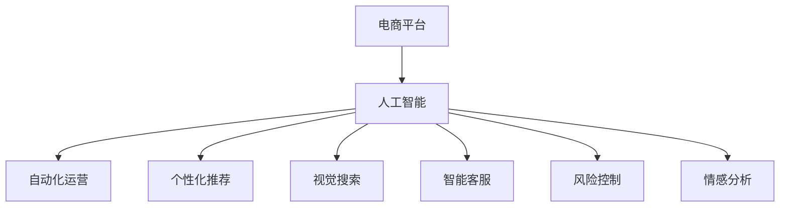

                 

## 1. 背景介绍

### 1.1 问题由来

近年来，电商平台迅速崛起，成为消费者购物的主要渠道。随着用户需求的多样化和电商场景的复杂化，电商平台需要处理的海量数据和实时交互需求也在快速增长。为了提高效率、优化用户体验，电商平台亟需引入人工智能技术，以实现自动化、智能化、个性化的业务管理和服务。本文将系统介绍基于人工智能的电商平台效率提升技术，探讨其在电商场景中的应用，并展望未来的发展趋势。

### 1.2 问题核心关键点

电商平台引入AI技术的主要目标包括：
- **自动化运营**：通过自动处理订单、库存管理、客服交互等业务，大幅提升运营效率，降低人力成本。
- **个性化推荐**：基于用户行为和偏好，精准推荐商品，提升用户粘性和转化率。
- **视觉搜索**：结合图像识别和深度学习技术，实现图像检索，提升用户搜索体验和商品匹配率。
- **智能客服**：应用自然语言处理和对话系统技术，提高客户服务响应速度和质量。
- **风险控制**：利用机器学习和大数据技术，预测和预防欺诈、异常交易等风险，保障平台安全。
- **情感分析**：分析用户反馈和评论，优化产品和服务，提升用户满意度。

本文将围绕上述核心关键点，详细介绍AI技术在电商平台上的应用实践，并探讨其面临的挑战和未来发展方向。

## 2. 核心概念与联系

### 2.1 核心概念概述

为更好地理解基于AI的电商平台效率提升技术，本节将介绍几个密切相关的核心概念：

- **电商平台**：指以互联网为媒介，提供在线商品展示、购买、支付、物流跟踪等服务的应用平台。
- **人工智能(AI)**：包括机器学习、深度学习、自然语言处理、计算机视觉、语音识别等技术，旨在实现机器的智能模拟。
- **自动化**：指通过AI技术实现业务流程的自动化处理，提高运营效率和准确性。
- **个性化推荐**：指根据用户行为和偏好，动态生成商品推荐列表，提升用户体验和满意度。
- **视觉搜索**：利用图像识别技术，实现基于图像的搜索和检索功能，提升用户搜索效率和精度。
- **智能客服**：结合自然语言处理和对话系统技术，实现实时、智能的客户服务，提升客户满意度。
- **风险控制**：应用机器学习和大数据技术，预测和预防交易风险，保障平台安全。
- **情感分析**：通过自然语言处理技术，分析用户反馈和评论，优化产品和服务，提升用户满意度。

这些核心概念之间的逻辑关系可以通过以下Mermaid流程图来展示：



这个流程图展示了大语言模型的核心概念及其之间的关系：

1. 电商平台通过引入人工智能技术，实现了自动化运营、个性化推荐、视觉搜索、智能客服、风险控制和情感分析等功能。
2. AI技术的应用使电商平台运营效率大幅提升，用户满意度提高，业务风险降低。

## 3. 核心算法原理 & 具体操作步骤
### 3.1 算法原理概述

基于AI的电商平台效率提升技术，通常采用以下核心算法原理：

- **监督学习**：通过标注数据训练模型，预测用户行为和交易结果，实现推荐和风险控制等功能。
- **深度学习**：利用多层神经网络，处理大规模非结构化数据，实现自然语言处理和图像识别等任务。
- **强化学习**：通过智能体与环境的交互，优化决策策略，提升自动化运营的效率和准确性。
- **迁移学习**：将某一领域的知识迁移到另一领域，通过少量标注数据，实现快速知识转移。
- **数据增强**：通过数据扩充技术，提高模型的泛化能力和鲁棒性。
- **模型压缩**：通过量化、剪枝等方法，优化模型参数，提升推理速度和资源利用率。

这些算法原理相互关联，共同支撑了电商平台的智能运营和管理。

### 3.2 算法步骤详解

基于AI的电商平台效率提升技术，通常包含以下几个关键步骤：

**Step 1: 数据收集与预处理**

- 收集电商平台的用户行为数据、商品信息数据、交易数据等，包括浏览记录、购买记录、评分评论等。
- 对数据进行清洗、归一化和特征提取，生成模型训练所需的标准数据格式。
- 对数据集进行划分，分为训练集、验证集和测试集，确保模型在未知数据上也能泛化良好。

**Step 2: 模型训练与优化**

- 选择合适的算法模型，如决策树、神经网络、卷积神经网络(CNN)、循环神经网络(RNN)、Transformer等。
- 根据任务需求，设计合适的模型结构和训练流程，如多层感知器(MLP)、深度信念网络(DBN)、变分自编码器(VAE)、自注意力机制(Attention)等。
- 使用标注数据对模型进行训练，优化模型参数，提升模型预测准确性。
- 采用交叉验证等技术，避免过拟合，确保模型在未知数据上的泛化能力。

**Step 3: 模型评估与部署**

- 在测试集上对训练好的模型进行评估，使用准确率、召回率、F1值等指标衡量模型性能。
- 将训练好的模型部署到生产环境中，进行实时预测和推理。
- 监控模型运行状态，及时发现和解决问题，确保模型稳定运行。

### 3.3 算法优缺点

基于AI的电商平台效率提升技术，具有以下优点：
- **自动化**：大幅减少人工操作，提高运营效率，降低成本。
- **个性化**：基于用户行为和偏好，实现精准推荐，提升用户粘性和转化率。
- **实时性**：结合深度学习和大数据技术，实现实时数据处理和响应，提升用户体验。
- **泛化能力**：通过模型优化和数据增强，提升模型在未知数据上的泛化能力，降低误差。

同时，该方法也存在一定的局限性：
- **数据依赖**：需要大量标注数据进行训练，标注成本较高。
- **模型复杂**：深度学习模型通常较为复杂，训练和推理需要较长时间。
- **解释性不足**：AI模型通常缺乏可解释性，难以理解其内部工作机制。
- **安全性风险**：AI模型的决策过程可能存在偏见和漏洞，对用户数据隐私和平台安全构成威胁。

尽管存在这些局限性，但就目前而言，基于AI的电商平台效率提升技术仍是最主流的范式。未来相关研究的重点在于如何进一步降低对标注数据的依赖，提高模型的可解释性和安全性，同时兼顾效率和效果。

### 3.4 算法应用领域

基于AI的电商平台效率提升技术，已经在多个领域得到了广泛应用：

- **自动化运营**：如自动处理订单、库存管理、客服交互等，提高运营效率和准确性。
- **个性化推荐**：如商品推荐、广告推荐、内容推荐等，提升用户粘性和转化率。
- **视觉搜索**：如基于图像的搜索和检索，提升用户搜索体验和商品匹配率。
- **智能客服**：如自然语言处理和对话系统，提高客户服务响应速度和质量。
- **风险控制**：如欺诈检测、异常交易识别、信用评分等，保障平台安全。
- **情感分析**：如用户反馈和评论分析，优化产品和服务，提升用户满意度。

除了上述这些经典应用外，AI技术还被创新性地应用到更多场景中，如商品相似度分析、供应链优化、库存管理优化等，为电商平台带来了全新的突破。随着AI技术的不断进步，相信电商平台的智能运营将更上一层楼，推动电商行业不断向更高层次发展。

## 4. 数学模型和公式 & 详细讲解 & 举例说明

### 4.1 数学模型构建

本节将使用数学语言对基于AI的电商平台效率提升技术进行更加严格的刻画。

假设电商平台收集到的用户行为数据为 $X=\{(x_1, y_1), (x_2, y_2), ..., (x_n, y_n)\}$，其中 $x_i$ 为行为特征，$y_i$ 为行为标签（如购买、浏览、评分等）。

定义一个监督学习模型 $f_{\theta}(x)$，其中 $\theta$ 为模型参数。模型的目标是最小化预测误差：

$$
\min_{\theta} \sum_{i=1}^n \ell(f_{\theta}(x_i), y_i)
$$

其中 $\ell$ 为损失函数，常用的有均方误差损失、交叉熵损失等。

### 4.2 公式推导过程

以深度神经网络为例，假设模型结构为多层感知器(MLP)，输入层为 $x$，输出层为 $y$，模型参数为 $\theta$，则模型输出为：

$$
f_{\theta}(x) = \sigma(W_L \sigma(W_{L-1} ... \sigma(W_1 x) ...))
$$

其中 $\sigma$ 为激活函数，如ReLU、Sigmoid等，$W_i$ 为第 $i$ 层的权重矩阵。

模型的损失函数通常为交叉熵损失：

$$
\ell(f_{\theta}(x), y) = -\sum_{i=1}^n y_i \log(f_{\theta}(x_i))
$$

在训练过程中，模型参数 $\theta$ 的更新公式为：

$$
\theta \leftarrow \theta - \eta \nabla_{\theta}\ell(f_{\theta}(x), y)
$$

其中 $\eta$ 为学习率，$\nabla_{\theta}\ell(f_{\theta}(x), y)$ 为损失函数对模型参数的梯度，可通过反向传播算法高效计算。

### 4.3 案例分析与讲解

以下以电商平台中的个性化推荐系统为例，具体讲解基于深度神经网络的推荐模型训练和应用：

假设平台收集到用户的浏览、购买、评分等行为数据，将其作为训练集，定义目标为预测用户是否会购买某商品。设 $x$ 为用户的浏览记录、购买记录等特征向量，$y$ 为购买标记，$1$ 表示购买，$0$ 表示未购买。

选择深度神经网络作为推荐模型，输入层维度为 $d_1$，隐藏层维度为 $d_2$，输出层维度为 $d_3$，模型参数为 $\theta$。通过标注数据对模型进行训练，最小化交叉熵损失：

$$
\min_{\theta} \sum_{i=1}^n -y_i \log(f_{\theta}(x_i))
$$

在训练过程中，模型参数 $\theta$ 的更新公式为：

$$
\theta \leftarrow \theta - \eta \nabla_{\theta}\ell(f_{\theta}(x), y)
$$

在模型训练完成后，使用验证集和测试集进行评估，计算准确率、召回率、F1值等指标，衡量模型性能。

例如，对于一个简单的二分类问题，模型在验证集上的预测结果为 $[0.9, 0.1]$，真实标签为 $[1, 0]$，则损失函数为：

$$
\ell(f_{\theta}(x), y) = -\sum_{i=1}^n y_i \log(f_{\theta}(x_i)) = -1 \log 0.9 + 0 \log 0.1 = 0.1
$$

模型参数更新量为：

$$
\theta \leftarrow \theta - \eta \nabla_{\theta}\ell(f_{\theta}(x), y) = \theta - \eta (\frac{1}{0.9} - \frac{0}{0.1}) = \theta - \eta 1.11
$$

## 5. 项目实践：代码实例和详细解释说明
### 5.1 开发环境搭建

在进行AI驱动的电商平台效率提升实践前，我们需要准备好开发环境。以下是使用Python进行TensorFlow开发的环境配置流程：

1. 安装Anaconda：从官网下载并安装Anaconda，用于创建独立的Python环境。

2. 创建并激活虚拟环境：
```bash
conda create -n tf-env python=3.8 
conda activate tf-env
```

3. 安装TensorFlow：根据CUDA版本，从官网获取对应的安装命令。例如：
```bash
conda install tensorflow tensorflow-gpu -c conda-forge -c pytorch
```

4. 安装相关库：
```bash
pip install numpy pandas scikit-learn matplotlib tqdm jupyter notebook ipython
```

完成上述步骤后，即可在`tf-env`环境中开始AI驱动的电商平台效率提升实践。

### 5.2 源代码详细实现

下面我们以电商平台中的个性化推荐系统为例，给出使用TensorFlow进行推荐模型开发的PyTorch代码实现。

首先，定义推荐模型的输入和输出：

```python
import tensorflow as tf
from tensorflow.keras.layers import Input, Dense, Activation

input_layer = Input(shape=(d1,))
hidden_layer = Dense(d2, activation='relu')(input_layer)
output_layer = Dense(d3, activation='sigmoid')(hidden_layer)
model = tf.keras.Model(input_layer, output_layer)
```

然后，定义模型的损失函数和优化器：

```python
loss_function = tf.keras.losses.BinaryCrossentropy()
optimizer = tf.keras.optimizers.Adam(learning_rate=0.001)
```

接着，定义训练和评估函数：

```python
def train_epoch(model, dataset, batch_size, optimizer):
    for batch in dataset:
        x, y = batch
        with tf.GradientTape() as tape:
            y_pred = model(x)
            loss = loss_function(y_pred, y)
        gradients = tape.gradient(loss, model.trainable_variables)
        optimizer.apply_gradients(zip(gradients, model.trainable_variables))

def evaluate(model, dataset, batch_size):
    correct_predictions = 0
    total_predictions = 0
    for batch in dataset:
        x, y = batch
        y_pred = model(x)
        correct_predictions += tf.reduce_sum(tf.cast(tf.equal(y_pred, y), tf.int32))
        total_predictions += len(y)
    accuracy = correct_predictions / total_predictions
    return accuracy
```

最后，启动训练流程并在验证集上评估：

```python
epochs = 10
batch_size = 64

for epoch in range(epochs):
    train_epoch(model, train_dataset, batch_size, optimizer)
    accuracy = evaluate(model, val_dataset, batch_size)
    print(f"Epoch {epoch+1}, accuracy: {accuracy:.4f}")
    
print("Test accuracy:", evaluate(model, test_dataset, batch_size))
```

以上就是使用TensorFlow对电商平台个性化推荐系统进行模型训练的完整代码实现。可以看到，得益于TensorFlow的强大封装，我们可以用相对简洁的代码完成推荐模型的构建和训练。

### 5.3 代码解读与分析

让我们再详细解读一下关键代码的实现细节：

**train_epoch函数**：
- 使用TensorFlow的GradientTape记录梯度。
- 计算模型的预测结果和损失函数。
- 使用Adam优化器计算梯度并更新模型参数。

**evaluate函数**：
- 遍历验证集，计算模型的准确率。
- 输出验证集的准确率。

**训练流程**：
- 定义总的epoch数和batch size，开始循环迭代
- 每个epoch内，先在训练集上训练，输出验证集的准确率
- 所有epoch结束后，在测试集上评估，给出最终测试结果

可以看到，TensorFlow提供的强大工具和API，使得AI驱动的电商平台效率提升实践变得简洁高效。开发者可以将更多精力放在数据处理、模型改进等高层逻辑上，而不必过多关注底层的实现细节。

当然，工业级的系统实现还需考虑更多因素，如模型的保存和部署、超参数的自动搜索、更灵活的推荐策略等。但核心的AI驱动推荐范式基本与此类似。

## 6. 实际应用场景

### 6.1 智能推荐系统

基于AI的电商平台智能推荐系统，可以帮助用户快速找到感兴趣的商品，提升购物体验和转化率。推荐系统通常由用户画像、商品画像、行为记录等多个模块组成，通过深度学习算法实现推荐。

在技术实现上，可以收集用户的历史浏览、购买、评分等行为数据，结合商品信息，构建用户行为向量 $u$ 和商品特征向量 $v$。通过模型预测用户对商品 $v$ 的兴趣 $u^Tv$，推荐与兴趣向量 $u$ 相似的商品。例如，当用户对某类商品有较高兴趣时，推荐系统可以基于用户兴趣向量，推荐更多该类商品，提升用户粘性。

### 6.2 风险控制系统

电商平台面临的欺诈、异常交易等问题，对平台安全和运营效率构成重大威胁。通过引入AI技术，可以有效识别和预防这些风险。

在技术实现上，可以收集交易记录、用户行为数据等，使用机器学习算法训练模型。模型可以学习到正常交易和异常交易的特征，预测新交易是否为异常行为。例如，当交易金额、时间、地点等特征与正常行为差异较大时，模型会发出预警，自动阻断交易，保护平台安全。

### 6.3 智能客服系统

电商平台需要处理大量的用户咨询，传统的人工客服方式效率低下。通过引入AI技术，可以实现智能客服系统，提升客户服务响应速度和质量。

在技术实现上，可以收集用户的历史咨询记录、常见问题等，构建知识库。通过自然语言处理技术，实时分析用户咨询内容，匹配并生成最佳回复。例如，当用户咨询商品信息时，智能客服可以自动提取问题关键词，在知识库中搜索答案，并提供快速响应。

### 6.4 未来应用展望

随着AI技术的不断发展，基于AI的电商平台效率提升技术将呈现以下几个发展趋势：

1. **多模态融合**：结合图像、语音、文本等多种数据，实现多模态智能推荐。例如，基于商品图片和描述，通过视觉搜索推荐相似商品。

2. **实时性增强**：通过实时数据处理技术，实现秒级响应。例如，当用户点击商品时，实时分析用户行为，推荐相关商品。

3. **个性化深化**：结合用户行为和社交网络信息，实现更深层次的个性化推荐。例如，根据用户好友和社交关系，推荐更多相关商品。

4. **模型可解释性**：提升模型的可解释性，让用户理解推荐依据。例如，通过可视化技术，展示用户推荐结果的逻辑和理由。

5. **数据隐私保护**：加强数据隐私保护，确保用户数据安全。例如，通过差分隐私技术，保护用户隐私。

以上趋势凸显了基于AI的电商平台效率提升技术的广阔前景。这些方向的探索发展，必将进一步提升电商平台的智能化水平，推动电商行业向更高层次发展。

## 7. 工具和资源推荐
### 7.1 学习资源推荐

为了帮助开发者系统掌握基于AI的电商平台效率提升技术，这里推荐一些优质的学习资源：

1. **TensorFlow官方文档**：提供全面的TensorFlow使用指南和教程，涵盖深度学习、自然语言处理、图像处理等多个领域。

2. **TensorFlow教程**：Kaggle和Google提供的TensorFlow教程，内容丰富，实战性强，适合快速上手。

3. **自然语言处理课程**：斯坦福大学和Coursera提供的自然语言处理课程，系统讲解自然语言处理的基础理论和前沿技术。

4. **深度学习框架比较**：《深度学习框架比较》一书，详细介绍了PyTorch、TensorFlow、Keras等主流深度学习框架的优缺点和使用场景，帮助开发者选择合适的框架。

5. **推荐系统经典算法**：《推荐系统》一书，系统讲解了协同过滤、基于内容的推荐、矩阵分解等经典推荐算法，适合深入理解推荐系统原理。

通过这些学习资源，相信你一定能够快速掌握基于AI的电商平台效率提升技术，并用于解决实际的电商问题。
### 7.2 开发工具推荐

高效的开发离不开优秀的工具支持。以下是几款用于基于AI的电商平台效率提升开发的常用工具：

1. **TensorFlow**：由Google主导开发的开源深度学习框架，生产部署方便，适合大规模工程应用。

2. **PyTorch**：由Facebook主导开发的开源深度学习框架，灵活易用，适合研究型任务和快速原型开发。

3. **Keras**：基于TensorFlow和Theano的高级深度学习API，易于上手，适合快速原型开发和实验验证。

4. **Weights & Biases**：模型训练的实验跟踪工具，可以记录和可视化模型训练过程中的各项指标，方便对比和调优。

5. **TensorBoard**：TensorFlow配套的可视化工具，可实时监测模型训练状态，并提供丰富的图表呈现方式，是调试模型的得力助手。

6. **Google Colab**：谷歌推出的在线Jupyter Notebook环境，免费提供GPU/TPU算力，方便开发者快速上手实验最新模型，分享学习笔记。

合理利用这些工具，可以显著提升基于AI的电商平台效率提升任务的开发效率，加快创新迭代的步伐。

### 7.3 相关论文推荐

基于AI的电商平台效率提升技术的发展源于学界的持续研究。以下是几篇奠基性的相关论文，推荐阅读：

1. **《深度学习》**：Yoshua Bengio、Ian Goodfellow和Aaron Courville合著的深度学习经典教材，系统讲解深度学习的理论和实践。

2. **《推荐系统》**：Zoubin Ghahramani、Jaime Carbonell和Eugene Hochreiter合著的推荐系统经典教材，系统讲解推荐系统算法和实践。

3. **《自然语言处理综述》**：Yoav Artzi、Michael J. Lewis和Hinrich Schütze合著的自然语言处理综述论文，系统讲解自然语言处理的基础理论和前沿技术。

4. **《多模态学习》**：Karol Kurach、Ivo Danihelka和Geoffrey Hinton合著的多模态学习论文，系统讲解多模态学习的理论和方法。

5. **《多任务学习》**：Nitish Srivastava、John Shawe-Taylor和Nando de Freitas合著的多任务学习论文，系统讲解多任务学习的理论和方法。

这些论文代表了大语言模型微调技术的发展脉络。通过学习这些前沿成果，可以帮助研究者把握学科前进方向，激发更多的创新灵感。

## 8. 总结：未来发展趋势与挑战

### 8.1 总结

本文对基于AI的电商平台效率提升技术进行了全面系统的介绍。首先阐述了AI技术在电商平台中的应用背景和目标，明确了个性化推荐、自动化运营、智能客服、风险控制等核心任务。其次，从原理到实践，详细讲解了基于深度神经网络的推荐模型训练和应用，给出了AI驱动的电商平台效率提升实践的完整代码实例。同时，本文还广泛探讨了AI技术在电商平台上的实际应用场景，展示了其广泛的应用前景。

通过本文的系统梳理，可以看到，基于AI的电商平台效率提升技术正在成为电商平台的重要范式，极大地提高了运营效率、用户体验和安全性。AI技术的引入，使得电商平台能够更好地应对用户需求的多样化和复杂化，为电商行业的发展注入了新的动力。

### 8.2 未来发展趋势

展望未来，基于AI的电商平台效率提升技术将呈现以下几个发展趋势：

1. **技术融合**：结合深度学习、自然语言处理、图像处理等多种AI技术，实现更全面、更智能的电商平台。

2. **数据驱动**：利用大数据和实时数据，实现更加精准的推荐和风险控制，提升电商平台的运营效率和安全性。

3. **用户体验**：通过个性化推荐和智能客服，提升用户购物体验和满意度，构建更忠实的用户群体。

4. **实时性增强**：通过实时数据处理和边缘计算，实现秒级响应，提升电商平台的用户体验。

5. **可解释性**：提升模型的可解释性，让用户理解推荐依据，增强用户信任感。

6. **安全性**：加强数据隐私保护和模型安全性，确保用户数据和平台安全。

以上趋势凸显了基于AI的电商平台效率提升技术的广阔前景。这些方向的探索发展，必将进一步提升电商平台的智能化水平，推动电商行业向更高层次发展。

### 8.3 面临的挑战

尽管基于AI的电商平台效率提升技术已经取得了显著成果，但在迈向更加智能化、普适化应用的过程中，仍面临诸多挑战：

1. **数据质量**：电商平台的交易数据、用户行为数据等，可能存在噪声和不一致性，影响模型的训练效果。

2. **模型复杂性**：深度神经网络等模型通常较为复杂，训练和推理需要较长时间，难以满足实时性需求。

3. **可解释性不足**：AI模型的决策过程可能缺乏可解释性，难以理解其内部工作机制。

4. **安全性风险**：AI模型的决策过程可能存在偏见和漏洞，对用户数据隐私和平台安全构成威胁。

5. **计算资源**：深度学习模型通常需要高性能GPU/TPU等硬件支持，计算资源投入较大。

尽管存在这些挑战，但随着技术的不断进步和优化，基于AI的电商平台效率提升技术必将在未来的电商行业发展中发挥更大的作用。

### 8.4 研究展望

面对基于AI的电商平台效率提升技术所面临的挑战，未来的研究需要在以下几个方面寻求新的突破：

1. **数据预处理**：改进数据清洗和特征提取技术，提升数据质量，确保模型训练的稳定性。

2. **模型优化**：优化深度神经网络结构，使用更轻量化的模型，提高训练和推理效率。

3. **模型解释性**：提升模型的可解释性，让用户理解推荐依据，增强用户信任感。

4. **安全性保障**：加强数据隐私保护和模型安全性，确保用户数据和平台安全。

5. **计算资源优化**：优化计算资源配置，使用更高效的计算方法和硬件设备，降低计算成本。

这些研究方向的探索，必将引领基于AI的电商平台效率提升技术迈向更高的台阶，为电商行业带来更多的创新和发展。

## 9. 附录：常见问题与解答

**Q1：电商平台的个性化推荐系统是如何构建的？**

A: 电商平台的个性化推荐系统通常通过以下步骤构建：
1. **数据收集**：收集用户的历史浏览、购买、评分等行为数据，商品信息数据等。
2. **特征提取**：对数据进行清洗、归一化和特征提取，生成模型训练所需的标准数据格式。
3. **模型训练**：选择合适的算法模型，如深度神经网络、协同过滤等，使用标注数据对模型进行训练。
4. **评估和优化**：在验证集上评估模型性能，调整超参数，优化模型。
5. **部署和监控**：将训练好的模型部署到生产环境中，实时处理用户请求，并监控模型运行状态，及时发现和解决问题。

**Q2：电商平台如何实现智能客服系统？**

A: 电商平台实现智能客服系统通常通过以下步骤：
1. **知识库构建**：收集用户的历史咨询记录、常见问题等，构建知识库。
2. **自然语言处理**：使用自然语言处理技术，实时分析用户咨询内容，匹配并生成最佳回复。
3. **语音识别和生成**：结合语音识别和生成技术，实现语音客服系统。
4. **多渠道整合**：整合多种渠道（如网站、APP、微信公众号等）的客服功能，提供统一的客服体验。
5. **用户反馈**：收集用户对智能客服系统的反馈，不断优化模型和知识库。

**Q3：电商平台如何实现风险控制？**

A: 电商平台实现风险控制通常通过以下步骤：
1. **数据收集**：收集交易记录、用户行为数据等。
2. **模型训练**：使用机器学习算法训练模型，学习正常交易和异常交易的特征。
3. **实时检测**：实时监测交易行为，预测新交易是否为异常行为。
4. **风险预警**：当交易金额、时间、地点等特征与正常行为差异较大时，发出预警，自动阻断交易。
5. **效果评估**：定期评估风险控制系统的效果，调整模型参数和策略。

**Q4：电商平台如何实现实时推荐？**

A: 电商平台实现实时推荐通常通过以下步骤：
1. **数据收集**：实时收集用户的行为数据，如点击、浏览、加入购物车等。
2. **模型推理**：使用实时数据输入推荐模型，生成推荐结果。
3. **显示推荐**：将推荐结果显示给用户，供其选择。
4. **反馈学习**：收集用户的反馈数据，用于优化推荐模型。

**Q5：电商平台如何实现个性化推荐？**

A: 电商平台实现个性化推荐通常通过以下步骤：
1. **用户画像**：收集用户的历史行为数据，构建用户画像。
2. **商品画像**：收集商品的信息数据，构建商品画像。
3. **模型训练**：使用协同过滤、基于内容的推荐等算法，对模型进行训练。
4. **推荐策略**：结合用户画像和商品画像，生成个性化推荐列表。
5. **效果评估**：在验证集上评估推荐效果，优化模型和策略。

---

作者：禅与计算机程序设计艺术 / Zen and the Art of Computer Programming

