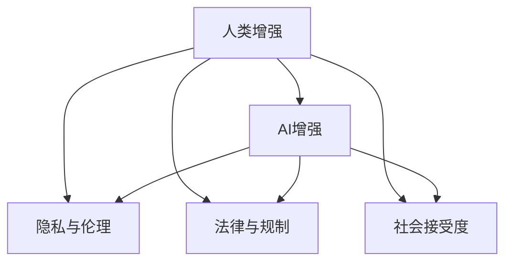

                 

# AI时代的人类增强：道德考虑与身体增强的未来发展机遇分析挑战

## 1. 背景介绍

随着人工智能(AI)技术的迅猛发展，人类增强(Human Enhancement)成为了一个备受关注的话题。尤其是在AI时代，通过技术手段增强人类的智力、体能、感官等能力，逐渐变得可行。然而，这种增强不仅仅涉及到技术上的突破，更涉及到深层次的伦理、道德和社会问题。本文旨在探讨AI时代人类增强的机遇与挑战，特别关注身体增强这一关键领域。

### 1.1 问题由来

人类增强的概念可以追溯到古希腊时期的哲学讨论，但直到现代科技的发展，才逐渐变得现实。AI时代的到来，使得通过AI技术进行人类增强成为可能。例如，智能假肢、增强现实(AR)设备、脑机接口(Brain-Computer Interface, BCI)等技术，已经在一定程度上实现了对人类感官和体能的增强。然而，这些技术的广泛应用，也引发了关于隐私、伦理、安全等方面的广泛讨论。

### 1.2 问题核心关键点

人类增强的核心关键点在于如何平衡技术进步与伦理道德。具体包括：
- **技术可行性**：能否通过AI技术实现对人类能力的增强。
- **伦理考量**：增强技术的应用是否符合伦理规范，是否可能引发社会不平等问题。
- **法律规制**：政府和相关机构应如何制定法规，确保增强技术的安全和公平使用。
- **公众接受度**：社会大众对增强技术的接受程度如何，能否广泛推广应用。

本文将重点探讨身体增强技术在AI时代的应用前景及其面临的伦理和法律挑战。

## 2. 核心概念与联系

### 2.1 核心概念概述

为更好地理解人类增强技术，本节将介绍几个关键概念：

- **人类增强(Human Enhancement)**：通过科技手段提升人类智力和体能等能力的过程。这包括通过基因编辑、药物、AI等技术增强人类感官、智力和体能。

- **AI增强(AI Enhancement)**：利用AI技术实现对人类感官、智力和体能的增强。例如，通过智能假肢、增强现实设备、脑机接口等技术，提升人类的认知和身体能力。

- **隐私与伦理**：在增强技术应用中，如何保护个人隐私，确保增强技术的使用符合伦理规范，防止引发社会不平等。

- **法律与规制**：政府和相关机构应如何制定法规，确保增强技术的安全和公平使用。

- **社会接受度**：社会大众对增强技术的接受程度如何，能否广泛推广应用。

这些概念之间的逻辑关系可以通过以下Mermaid流程图来展示：



这个流程图展示了一系列概念之间的联系：

1. 人类增强是整体目标，AI增强是实现手段之一。
2. 隐私与伦理、法律与规制、社会接受度是应用AI增强时需考虑的关键问题。
3. 隐私与伦理、法律与规制、社会接受度直接影响AI增强技术的普及和接受程度。

## 3. 核心算法原理 & 具体操作步骤
### 3.1 算法原理概述

AI时代的人类增强，主要依赖于AI技术对人类感官、智力和体能的提升。这些提升通常通过增强现实(AR)设备、智能假肢、脑机接口等技术实现。核心算法原理包括以下几个方面：

- **增强现实(AR)技术**：通过在现实世界中叠加数字信息，增强人类的感知能力。例如，AR眼镜可以提供实时的信息提示，帮助盲人和视力受损者更好地适应环境。
- **智能假肢技术**：通过AI控制，使假肢具备更高的灵活性和响应速度，帮助肢体残疾人士恢复正常生活。
- **脑机接口(BCI)技术**：通过读取大脑信号，实现人机交互，帮助瘫痪患者通过思维控制外部设备。

### 3.2 算法步骤详解

基于AI增强的人类增强技术，一般包括以下关键步骤：

**Step 1: 收集与处理数据**
- 收集目标人群的生理和行为数据，如动作轨迹、肌肉电信号、视觉信息等。
- 使用数据清洗和预处理技术，确保数据的准确性和完整性。

**Step 2: 选择合适的增强技术**
- 根据目标人群的具体需求，选择合适的增强技术，如增强现实设备、智能假肢、脑机接口等。
- 进行技术选型和设计，确保技术的可行性、可靠性和安全性。

**Step 3: 设计与开发模型**
- 根据目标人群的需求，设计增强模型。例如，针对视障人士的AR设备，需要设计实时的信息提示和交互界面。
- 使用AI技术进行模型开发，如深度学习、强化学习等，实现增强功能。

**Step 4: 测试与优化**
- 在真实环境中对增强设备进行测试，收集用户反馈。
- 根据测试结果，优化模型和增强设备，提升用户体验和功能性能。

**Step 5: 部署与维护**
- 将增强设备部署到目标人群中，进行大规模应用。
- 定期维护和升级设备，确保设备的长期稳定性和安全性。

### 3.3 算法优缺点

AI增强技术在提升人类能力方面具有以下优点：
1. 提高生活质量：通过增强现实、智能假肢等技术，改善残障人士的生活质量，让他们更好地融入社会。
2. 促进科技创新：增强技术的发展，推动了相关领域如脑科学、机器人技术等的前沿研究。
3. 创造经济价值：增强技术的应用，带动了新的产业链，创造了巨大的经济价值。

同时，也存在一些缺点：
1. 技术复杂度高：增强技术的应用需要复杂的技术支撑，成本较高。
2. 隐私风险：增强技术涉及大量个人数据，数据泄露和隐私保护成为重要问题。
3. 伦理争议：增强技术可能引发社会不平等，加剧贫富差距，引发伦理争议。

### 3.4 算法应用领域

AI增强技术在多个领域得到了广泛应用，包括但不限于：

- **医疗领域**：通过智能假肢、脑机接口等技术，帮助肢体和视听觉受损者恢复正常功能。
- **教育领域**：通过AR技术，提升教学效果，提供沉浸式学习体验。
- **娱乐领域**：通过增强现实设备，提供全新的娱乐体验，如虚拟现实游戏、远程互动等。
- **职业培训**：通过增强现实设备，提供虚拟培训环境，提升职业培训效果。
- **军事领域**：通过脑机接口技术，提高士兵的战场感知能力和反应速度。

## 4. 数学模型和公式 & 详细讲解  
### 4.1 数学模型构建

为了更好地理解AI增强技术的数学模型，本节将介绍几个关键概念和公式。

### 4.2 公式推导过程

以智能假肢为例，假设有$n$个肌电信号，每个信号对应一个传感器，用于测量肌肉的收缩情况。设$x_i$为第$i$个传感器的电信号，$y$为目标关节的角度。智能假肢的输出可以表示为：

$$
y = f(x_1, x_2, \ldots, x_n)
$$

其中，$f$为增强模型，可以使用神经网络、深度学习等方法进行建模。通过反向传播算法，最小化损失函数，训练增强模型$f$。例如，使用均方误差(MSE)损失函数：

$$
L = \frac{1}{N} \sum_{i=1}^N (y_i - \hat{y}_i)^2
$$

其中，$y_i$为真实角度，$\hat{y}_i$为模型预测角度。通过优化算法(如梯度下降)，最小化损失函数，更新模型参数，使得$f(x)$的输出更接近真实值$y$。

### 4.3 案例分析与讲解

以增强现实(AR)技术为例，展示其实现原理和应用场景。增强现实设备通过摄像头捕捉真实世界信息，并将数字信息叠加在屏幕上，提升用户对环境的感知能力。例如，AR眼镜可以提供路线导航、信息提示等功能，提升盲人和视障人士的出行体验。

具体实现步骤如下：
1. 使用摄像头捕捉环境信息，转换为数字图像。
2. 提取图像特征，如颜色、形状、位置等。
3. 将提取的特征与预设的增强信息进行匹配，生成增强图像。
4. 将增强图像叠加在屏幕上，用户通过AR眼镜实时看到。

## 5. 项目实践：代码实例和详细解释说明
### 5.1 开发环境搭建

在进行AI增强技术开发前，需要准备好开发环境。以下是Python环境下开发增强现实(AR)设备的流程：

1. 安装Python：从官网下载并安装Python，确保版本稳定，建议使用3.6及以上版本。
2. 安装Pygame库：通过pip安装Pygame库，用于图形界面开发和图像处理。
3. 安装OpenCV库：通过pip安装OpenCV库，用于摄像头和图像处理。
4. 安装Numpy库：通过pip安装Numpy库，用于数学计算。

完成上述步骤后，即可在Python环境下进行AR设备的开发。

### 5.2 源代码详细实现

以下是一个简单的Python代码示例，展示如何使用OpenCV和Pygame实现一个基本的AR设备：

```python
import cv2
import pygame
import numpy as np

# 初始化Pygame
pygame.init()
screen = pygame.display.set_mode((640, 480))
pygame.display.set_caption('AR Device')

# 初始化OpenCV
cap = cv2.VideoCapture(0)

while True:
    # 实时捕捉摄像头图像
    ret, frame = cap.read()
    
    # 将图像转换为RGB格式
    frame_rgb = cv2.cvtColor(frame, cv2.COLOR_BGR2RGB)
    
    # 在Pygame界面中显示图像
    screen.fill(0)
    pygame.imageSurface = pygame.image.frombuffer(frame_rgb.tobytes(), (640, 480, 3), 'RGB')
    pygame.display.flip()
    
    # 等待按键事件，退出程序
    for event in pygame.event.get():
        if event.type == pygame.QUIT:
            cap.release()
            pygame.quit()
```

该代码展示了如何通过OpenCV捕捉摄像头图像，并使用Pygame在屏幕上实时显示图像。用户可以通过键盘或鼠标控制程序的运行。

### 5.3 代码解读与分析

代码的主要功能是实时捕捉摄像头图像，并使用Pygame显示在屏幕上。具体分析如下：

- `pygame.init()`：初始化Pygame库，创建显示窗口。
- `pygame.display.set_mode()`：设置窗口大小为640x480。
- `pygame.display.set_caption()`：设置窗口标题为"AR Device"。
- `cap = cv2.VideoCapture(0)`：初始化OpenCV库，打开摄像头。
- `while True:`：无限循环，实时捕捉和显示图像。
- `ret, frame = cap.read()`：捕捉摄像头图像。
- `frame_rgb = cv2.cvtColor(frame, cv2.COLOR_BGR2RGB)`：将BGR格式的图像转换为RGB格式。
- `pygame.imageSurface = pygame.image.frombuffer(frame_rgb.tobytes(), (640, 480, 3), 'RGB')`：创建Pygame图像对象，显示在屏幕上。
- `pygame.display.flip()`：刷新屏幕，显示最新图像。
- `for event in pygame.event.get()`：处理按键和鼠标事件。
- `if event.type == pygame.QUIT:`：检测按键事件，如果用户按下了退出键，退出程序。

## 6. 实际应用场景
### 6.1 智能假肢

智能假肢技术已经在部分国家得到应用，帮助肢体残障人士恢复正常生活。以德国OmniProtoche假肢为例，该假肢使用肌电信号控制，通过神经网络模型预测关节角度，实现灵活的机械臂运动。

### 6.2 增强现实(AR)

增强现实技术在多个领域得到了广泛应用，提升了用户体验。例如，谷歌眼镜可以提供导航、信息提示等功能，提升用户的出行体验。AR设备还可以用于医疗诊断、教育培训等领域，提供沉浸式交互体验。

### 6.3 脑机接口(BCI)

脑机接口技术在军事、医疗等领域有重要应用。例如，士兵通过脑机接口技术，可以实现人机交互，提高战场感知能力和反应速度。医生可以通过BCI技术，读取患者的大脑信号，进行康复训练和治疗。

### 6.4 未来应用展望

随着AI技术的不断进步，人类增强技术将进一步发展，未来可能包括以下方向：

- **全身增强**：通过AI技术，实现全身增强，提升整体身体能力。例如，智能假肢和增强现实设备可以进一步整合，提供更加全面的增强体验。
- **多感官融合**：将视觉、听觉、触觉等多感官信息进行融合，提供更加沉浸式的增强体验。例如，使用AR设备提供实时的语音和触觉反馈。
- **AI智能控制**：通过AI技术，实现智能控制增强设备，提升用户体验和功能性能。例如，智能假肢可以通过AI优化控制算法，实现更自然的运动效果。
- **跨平台应用**：将增强技术扩展到更多平台，如手机、智能家居等，实现跨平台增强体验。

## 7. 工具和资源推荐
### 7.1 学习资源推荐

为了帮助开发者系统掌握AI增强技术，以下是一些推荐的资源：

1. **《AI增强技术导论》**：一本全面介绍AI增强技术的书籍，涵盖增强现实、智能假肢、脑机接口等领域的最新研究成果。
2. **Coursera《AI增强技术》课程**：斯坦福大学开设的在线课程，涵盖AI增强技术的理论基础和实践应用，适合初学者学习。
3. **arXiv.org**：学术界最大的预印本服务器，提供大量最新的AI增强技术论文，可以跟踪最新的研究进展。
4. **GitHub**：GitHub上有很多AI增强技术的开源项目，可以学习他人的代码和实现，加速自己的开发进程。
5. **OpenAI的GPT-3技术报告**：了解最新的AI增强技术进展，获取前沿研究动态。

通过对这些资源的深入学习，相信你一定能够掌握AI增强技术的核心原理和应用方法。

### 7.2 开发工具推荐

开发AI增强技术需要借助一些强大的工具和平台，以下是一些推荐的开发工具：

1. **Python**：Python是AI开发的首选语言，支持大量的AI库和框架，如TensorFlow、PyTorch等。
2. **OpenCV**：OpenCV是计算机视觉领域的开源库，支持摄像头图像捕捉、图像处理等功能。
3. **Pygame**：Pygame是Python的图形界面库，支持图像显示、键盘输入等功能，适合实时应用开发。
4. **TensorFlow**：TensorFlow是谷歌开发的深度学习框架，支持大规模模型训练和部署。
5. **PyTorch**：PyTorch是Facebook开发的深度学习框架，支持动态计算图，适合快速原型开发。

合理利用这些工具，可以显著提升AI增强技术的开发效率，加速创新迭代的步伐。

### 7.3 相关论文推荐

以下是一些关于AI增强技术的经典论文，推荐阅读：

1. **《增强现实技术综述》**：综述增强现实技术的现状和未来发展方向，适合入门学习。
2. **《智能假肢技术进展》**：介绍智能假肢技术的最新进展，包括控制算法、传感器设计等。
3. **《脑机接口技术研究进展》**：综述脑机接口技术的最新研究成果，涵盖理论和实践两方面。
4. **《AI增强技术的伦理和社会影响》**：探讨AI增强技术的伦理和社会影响，提出应对策略和建议。
5. **《增强现实设备的设计与实现》**：介绍增强现实设备的设计和实现方法，涵盖硬件和软件两方面。

这些论文代表了大AI增强技术的发展脉络，通过学习这些前沿成果，可以帮助研究者把握学科前进方向，激发更多的创新灵感。

## 8. 总结：未来发展趋势与挑战
### 8.1 研究成果总结

本文对AI增强技术进行了全面系统的介绍，涵盖增强现实、智能假肢、脑机接口等领域的核心概念和应用场景。通过系统的梳理，展示了AI增强技术的广泛应用前景和面临的伦理道德挑战。

### 8.2 未来发展趋势

未来，AI增强技术将在以下几个方面继续发展：

- **技术突破**：AI增强技术将不断突破技术瓶颈，提升用户体验和功能性能。例如，通过更加智能的控制算法和传感器设计，实现更自然、更高效的增强体验。
- **跨领域应用**：AI增强技术将扩展到更多领域，实现跨领域应用。例如，将增强现实技术应用于医疗、教育、娱乐等领域，提升应用场景的广度和深度。
- **伦理与法律**：AI增强技术的伦理和法律问题将受到更多关注，政府和相关机构将制定更加完善的法规，确保技术的安全和公平使用。
- **社会接受度**：社会大众对AI增强技术的接受程度将进一步提高，技术的普及应用将带来新的社会变革。

### 8.3 面临的挑战

尽管AI增强技术的发展前景广阔，但也面临一些挑战：

- **技术复杂度高**：AI增强技术需要复杂的技术支撑，成本较高，推广应用难度较大。
- **隐私与伦理**：增强技术涉及大量个人数据，数据泄露和隐私保护成为重要问题。如何平衡技术进步和伦理道德，是一个重要课题。
- **法律法规**：政府和相关机构应如何制定法规，确保增强技术的安全和公平使用，需要深入探讨。
- **社会公平性**：增强技术的应用可能加剧社会不平等，如何确保技术的普惠性，是一个需要解决的问题。

### 8.4 研究展望

面对AI增强技术面临的挑战，未来的研究需要在以下几个方面寻求新的突破：

- **隐私保护**：开发更加安全的隐私保护技术，确保个人数据的隐私和安全。例如，采用差分隐私、联邦学习等技术，保护用户隐私。
- **伦理考量**：在增强技术的应用中，如何平衡技术进步和伦理道德，是一个重要课题。需要深入探讨技术的社会影响和伦理责任。
- **法律法规**：政府和相关机构应如何制定法规，确保增强技术的安全和公平使用，需要深入探讨。
- **社会公平性**：如何确保增强技术的普惠性，避免技术应用带来的社会不平等，是一个需要解决的问题。

## 9. 附录：常见问题与解答

**Q1: 智能假肢技术目前的发展水平如何？**

A: 智能假肢技术已经取得了一定的进展，部分国家的医疗机构已经将其应用于临床。例如，德国的OmniProtoche假肢通过肌电信号控制，可以实现灵活的机械臂运动。然而，智能假肢技术仍然面临一些挑战，如精确度、耐久度、舒适度等，需要进一步改进。

**Q2: 增强现实(AR)技术在实际应用中存在哪些问题？**

A: 增强现实技术在实际应用中存在一些问题，主要包括以下几个方面：
1. 设备成本较高：AR设备需要高性能的硬件支持，成本较高，难以广泛推广。
2. 技术复杂度高：增强现实技术需要复杂的技术支撑，需要专业知识才能实现。
3. 隐私问题：增强现实技术涉及大量个人数据，数据泄露和隐私保护成为重要问题。
4. 用户接受度：部分用户对增强现实技术存在抵触情绪，需要进一步提高用户体验和接受度。

**Q3: 脑机接口(BCI)技术面临的主要挑战是什么？**

A: 脑机接口(BCI)技术面临的主要挑战包括以下几个方面：
1. 信号采集难度高：脑电信号采集难度较高，需要复杂的硬件设备和算法支持。
2. 信号处理复杂：脑电信号处理复杂，需要高效的算法和模型进行信号提取和解码。
3. 应用场景局限：脑机接口技术目前主要应用于医疗康复和军事领域，在其他领域的推广应用需要进一步探索。
4. 伦理道德问题：脑机接口技术涉及人类意识的探索，引发伦理道德问题，需要深入探讨。

**Q4: 未来AI增强技术的普及应用会带来哪些社会影响？**

A: 未来AI增强技术的普及应用将带来以下社会影响：
1. 提升生活质量：通过增强现实、智能假肢等技术，提升残障人士的生活质量，让他们更好地融入社会。
2. 推动科技创新：增强技术的发展，推动相关领域如脑科学、机器人技术等的前沿研究。
3. 创造经济价值：增强技术的应用，带动了新的产业链，创造了巨大的经济价值。
4. 引发伦理争议：增强技术可能引发社会不平等，加剧贫富差距，引发伦理争议。
5. 面临隐私风险：增强技术涉及大量个人数据，数据泄露和隐私保护成为重要问题。

通过本文的系统梳理，可以看到，AI增强技术在AI时代有着广泛的应用前景和重要的社会影响。然而，面对技术复杂度高、隐私伦理风险等问题，我们需要在技术、伦理、法律等各个层面进行深入研究和探索，确保AI增强技术的健康发展。

