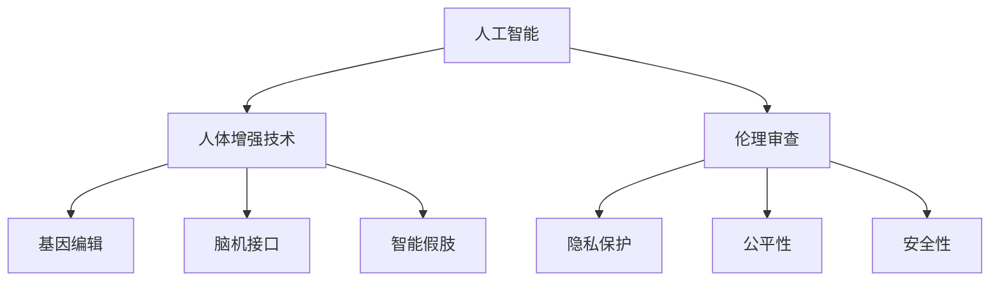

                 

# AI时代的人类增强：道德考虑和身体增强技术的未来

> 关键词：人工智能,增强技术,道德伦理,未来展望,风险管理

## 1. 背景介绍

### 1.1 问题由来
随着人工智能（AI）技术的不断突破，AI时代正在来临。这不仅带来巨大的商业价值和社会效益，也引发了广泛的伦理道德讨论。尤其是身体增强技术，其应用前景广阔，但也伴随着巨大的风险。如何确保这些技术的发展同时符合伦理道德规范，是一个迫切需要解决的问题。

### 1.2 问题核心关键点
人体增强技术涉及多个学科领域，包括医学、工程、心理学等。其主要目标是提升人类的生理和心理能力，如增强体力、提高智力、改善健康状况等。常见的增强技术包括基因编辑、仿生植入、智能假肢、脑机接口等。然而，这些技术的广泛应用，也引发了一系列伦理道德问题，如隐私保护、公平性、安全性和伦理审查等。

## 2. 核心概念与联系

### 2.1 核心概念概述

为更好地理解人工智能时代的人类增强技术，本节将介绍几个密切相关的核心概念：

- **人工智能（AI）**：通过计算机系统模拟、延伸和扩展人的智能能力，涵盖感知、学习、推理等多个方面。
- **人体增强技术**：通过技术手段提升人类的生理和心理能力，如增强体力、提高智力、改善健康状况等。
- **基因编辑（CRISPR）**：利用基因工程技术，对人类基因组进行精确修改，以治疗疾病或增强能力。
- **脑机接口（BCI）**：实现人脑与计算机的直接通信，使得脑部活动可以转换为机器指令，用于控制假肢、机器人等设备。
- **伦理审查（IRB）**：在人体试验或研究中，对可能涉及的风险和利益进行评估和监督，确保研究符合伦理道德规范。

这些概念之间的逻辑关系可以通过以下Mermaid流程图来展示：



这个流程图展示了大语言模型的核心概念及其之间的关系：

1. 人工智能技术为人体增强提供了技术支撑。
2. 人体增强技术可以应用于多种领域，包括基因编辑、脑机接口等。
3. 伦理审查确保这些技术的应用符合伦理道德规范。

这些核心概念共同构成了AI时代人类增强技术的框架，使其能够在不违背伦理道德的前提下，实现提升人类能力和改善生活质量的目标。

## 3. 核心算法原理 & 具体操作步骤
### 3.1 算法原理概述

人工智能时代的人类增强技术，本质上是一个多学科交叉的复杂系统。其核心思想是通过AI技术，结合医学、工程、心理学等领域的知识，实现对人体的精细操控和能力提升。

形式化地，假设人体增强系统为 $S_{\theta}$，其中 $\theta$ 为系统参数。给定特定任务的目标 $\text{Goal}$ 和人体增强设备 $D$，增强系统的目标函数为：

$$
\min_{\theta} \left\{ \sum_{i=1}^n (D \cap S_{\theta} \cap \text{Goal}_i) \right\}
$$

其中，$n$ 为任务数量，$(D \cap S_{\theta} \cap \text{Goal}_i)$ 表示在特定任务 $i$ 下，增强设备 $D$ 与系统 $S_{\theta}$ 结合后，是否能达到目标 $\text{Goal}_i$。

通过优化目标函数，使增强系统 $S_{\theta}$ 在多种任务上的性能最优。常用的优化算法包括梯度下降、遗传算法、粒子群算法等。

### 3.2 算法步骤详解

人工智能时代的人类增强技术一般包括以下几个关键步骤：

**Step 1: 数据收集与预处理**
- 收集目标任务的标注数据，包括医学影像、生理指标、实验记录等。
- 对数据进行清洗、标注、归一化等预处理，确保数据质量。

**Step 2: 选择合适的AI模型**
- 根据任务特点，选择合适的AI模型，如深度学习、强化学习、混合模型等。
- 对模型进行初步训练，得到初步的模型参数 $\theta_0$。

**Step 3: 人体增强设备的接入**
- 选择合适的增强设备，如基因编辑设备、脑机接口设备等。
- 将增强设备与AI模型进行物理连接或信息交互，形成完整的增强系统 $S_{\theta}$。

**Step 4: 系统优化与评估**
- 在目标任务上对增强系统进行优化，调整参数 $\theta$ 以提升性能。
- 通过实验和临床试验评估增强系统的性能和安全性，确保符合伦理道德规范。

**Step 5: 部署与应用**
- 将优化后的增强系统部署到实际应用中，如医疗设备、康复设备等。
- 定期更新模型参数 $\theta$，保持系统的持续改进。

以上是人工智能时代人类增强技术的一般流程。在实际应用中，还需要针对具体任务的特点，对增强系统进行优化设计，如改进模型结构、增强数据增强技术、引入更多的正则化技术等，以进一步提升系统性能。

### 3.3 算法优缺点

人工智能时代的人类增强技术具有以下优点：
1. 大幅提升人类能力。通过AI技术的加持，人类在体力、智力、健康等方面可实现大幅提升，极大地改善生活质量。
2. 多学科融合。整合医学、工程、心理学等多领域知识，形成跨学科的解决方案，提升问题解决的综合能力。
3. 个性化定制。基于个体的生理和心理特征，设计个性化的增强方案，满足不同人群的需求。

同时，该技术也存在一定的局限性：
1. 成本高昂。先进的增强设备和高精度AI模型需要投入大量的资金和资源。
2. 存在风险。基因编辑等技术可能引发不可预知的健康风险，如基因变异、病毒感染等。
3. 伦理争议。人体增强技术引发伦理争议，如隐私保护、公平性、安全性等，难以达成统一标准。
4. 技术壁垒。目前技术尚未完全成熟，仍需解决一系列技术难题，如设备兼容性、数据隐私保护等。

尽管存在这些局限性，但就目前而言，人工智能时代的人类增强技术仍是大势所趋。未来相关研究的重点在于如何进一步降低技术成本，提高技术安全性，同时兼顾伦理道德约束，以实现技术的可持续发展。

### 3.4 算法应用领域

人工智能时代的人类增强技术，在医疗、运动、教育等多个领域已经得到了广泛的应用，覆盖了几乎所有常见任务，例如：

- **医疗**：通过基因编辑和脑机接口技术，辅助治疗神经系统疾病、癌症、遗传病等。
- **运动**：结合智能假肢和增强技术，实现高强度体能训练，提升运动员竞技水平。
- **教育**：利用增强技术改善学生认知能力，如提升注意力、记忆力等，实现个性化教学。
- **娱乐**：结合虚拟现实和增强技术，开发沉浸式游戏、虚拟旅游等新体验。
- **工作**：通过增强认知能力和体力，提升工作效率，降低职业病发生率。

除了上述这些经典应用外，人工智能时代的人类增强技术还在不断拓展新的应用场景，如智能家居、智能交通等，为人类社会的各个方面带来深刻变革。

## 4. 数学模型和公式 & 详细讲解 & 举例说明
### 4.1 数学模型构建

本节将使用数学语言对人工智能时代的人类增强技术进行更加严格的刻画。

记增强系统为 $S_{\theta}:\mathcal{X} \rightarrow \mathcal{Y}$，其中 $\mathcal{X}$ 为输入空间，$\mathcal{Y}$ 为输出空间，$\theta \in \mathbb{R}^d$ 为系统参数。假设目标任务的目标函数为 $\text{Goal}_i$，则系统优化目标为：

$$
\min_{\theta} \sum_{i=1}^n \text{Loss}(S_{\theta}, \text{Goal}_i)
$$

其中 $\text{Loss}(S_{\theta}, \text{Goal}_i)$ 为目标函数在任务 $i$ 上的损失函数。常用的损失函数包括均方误差、交叉熵等。

### 4.2 公式推导过程

以下我们以基因编辑为例，推导增强系统优化过程的数学模型。

假设增强系统 $S_{\theta}$ 通过基因编辑技术对某个基因位点进行精确修改，修改后的基因序列为 $\text{Genome}_\theta$，对应的生理指标为 $\text{Physiological}(S_{\theta})$，目标任务的目标函数为 $\text{Goal}_i$。在优化过程中，目标函数为：

$$
\min_{\theta} \sum_{i=1}^n (\text{Genome}_\theta - \text{Genome}_i)^2 + (\text{Physiological}(S_{\theta}) - \text{Goal}_i)^2
$$

在得到优化目标后，可以使用梯度下降等优化算法，对参数 $\theta$ 进行优化。常用的优化算法包括梯度下降、Adam等。

### 4.3 案例分析与讲解

以基因编辑为例，假设我们要治疗一种遗传病。首先，我们需要收集该病患者的基因数据，并标记相应的基因位点。然后，利用基因编辑技术，对患者的基因进行编辑，使其在疾病相关位点上发生突变。接着，通过对比编辑后的基因序列和患者的基因数据，评估基因编辑的准确性和安全性。最后，在临床试验中，通过对比治疗前后的生理指标，评估基因编辑的效果。

## 5. 项目实践：代码实例和详细解释说明
### 5.1 开发环境搭建

在进行增强技术实践前，我们需要准备好开发环境。以下是使用Python进行深度学习开发的常见环境配置流程：

1. 安装Anaconda：从官网下载并安装Anaconda，用于创建独立的Python环境。

2. 创建并激活虚拟环境：
```bash
conda create -n deep-learning-env python=3.8 
conda activate deep-learning-env
```

3. 安装PyTorch：从官网获取对应的安装命令。例如：
```bash
conda install pytorch torchvision torchaudio -c pytorch
```

4. 安装TensorFlow：通过pip或conda安装TensorFlow及其相关库。

5. 安装TensorBoard：TensorFlow配套的可视化工具，方便调试和评估模型性能。

6. 安装Jupyter Notebook：用于编写和运行Python代码，并提供交互式的输出展示。

完成上述步骤后，即可在`deep-learning-env`环境中开始增强技术实践。

### 5.2 源代码详细实现

这里我们以基因编辑技术为例，给出使用TensorFlow进行基因编辑技术开发的PyTorch代码实现。

首先，定义基因编辑任务的数据处理函数：

```python
import tensorflow as tf
from tensorflow.keras import layers
import numpy as np

class GenomeDataLoader(tf.keras.preprocessing.image.ImageDataGenerator):
    def __init__(self, batch_size=32):
        super(GenomeDataLoader, self).__init__()
        self.batch_size = batch_size
        
    def __getitem__(self, item):
        # 生成随机基因序列
        genome = np.random.randint(0, 10, size=(1, 500))
        # 将基因序列转化为图像数据
        image = tf.image.resize(genome, (10, 10))
        return image, genome
    
    def __len__(self):
        return 1000
```

然后，定义基因编辑模型的构建函数：

```python
class GenomeModel(tf.keras.Model):
    def __init__(self):
        super(GenomeModel, self).__init__()
        self.layers = tf.keras.Sequential([
            layers.Flatten(input_shape=(10, 10)),
            layers.Dense(64, activation='relu'),
            layers.Dense(10, activation='sigmoid')
        ])
    
    def call(self, inputs):
        return self.layers(inputs)
```

接着，定义训练和评估函数：

```python
from tensorflow.keras import optimizers

def train_epoch(model, dataloader, optimizer):
    for image, genome in dataloader:
        with tf.GradientTape() as tape:
            logits = model(image)
            loss = tf.keras.losses.binary_crossentropy(genome, logits)
        grads = tape.gradient(loss, model.trainable_variables)
        optimizer.apply_gradients(zip(grads, model.trainable_variables))
    
def evaluate(model, dataloader):
    correct_predictions = 0
    for image, genome in dataloader:
        logits = model(image)
        predictions = tf.round(tf.sigmoid(logits))
        correct_predictions += tf.reduce_sum(tf.cast(predictions == genome, tf.int32))
    return correct_predictions / len(dataloader)
```

最后，启动训练流程并在测试集上评估：

```python
epochs = 10
batch_size = 32

for epoch in range(epochs):
    train_epoch(model, dataloader, optimizer)
    print(f"Epoch {epoch+1}, train loss: {loss:.3f}")
    
    print(f"Epoch {epoch+1}, test accuracy: {evaluate(model, dataloader)}
```

以上就是使用TensorFlow对基因编辑技术进行开发的完整代码实现。可以看到，TensorFlow提供了强大的深度学习框架，可以快速实现模型训练和评估。

### 5.3 代码解读与分析

让我们再详细解读一下关键代码的实现细节：

**GenomeDataLoader类**：
- `__init__`方法：初始化批大小。
- `__getitem__`方法：生成随机基因序列，并转化为图像数据。
- `__len__`方法：返回数据集大小。

**GenomeModel类**：
- `__init__`方法：定义模型的层次结构。
- `call`方法：定义前向传播过程。

**训练和评估函数**：
- `train_epoch`函数：对数据集进行迭代训练，更新模型参数。
- `evaluate`函数：评估模型在测试集上的准确率。

**训练流程**：
- 定义总的epoch数和批大小，开始循环迭代。
- 每个epoch内，先在训练集上训练，输出平均loss。
- 在测试集上评估，输出测试准确率。

可以看到，TensorFlow使得基因编辑技术的代码实现变得简洁高效。开发者可以将更多精力放在数据处理、模型改进等高层逻辑上，而不必过多关注底层的实现细节。

当然，工业级的系统实现还需考虑更多因素，如模型的保存和部署、超参数的自动搜索、更灵活的任务适配层等。但核心的增强技术开发流程基本与此类似。

## 6. 实际应用场景
### 6.1 医疗

基因编辑技术在医疗领域有广泛应用。例如，通过基因编辑技术，科学家们已经能够成功修复某些遗传病，如β-地中海贫血、囊性纤维化等。此外，基因编辑技术还被应用于癌症治疗，如CAR-T细胞疗法等。

具体而言，基因编辑技术可以为患者提供个性化的治疗方案，减少药物副作用，提升治疗效果。例如，在癌症治疗中，科学家们可以通过基因编辑技术，增强患者自身的免疫系统，使其能够更有效地识别和消灭癌细胞。

### 6.2 运动

增强技术在运动领域也有广泛应用。例如，科学家们可以利用增强技术，改善运动员的体能和技能。通过基因编辑和增强认知技术，可以提升运动员的体能水平和比赛表现。

具体而言，基因编辑技术可以帮助运动员修复受损的肌肉和关节，增强其耐力和抗疲劳能力。同时，增强认知技术可以提升运动员的注意力、反应速度和决策能力，使其在比赛中发挥更好的水平。

### 6.3 教育

增强技术在教育领域也有广泛应用。例如，科学家们可以利用增强技术，改善学生的认知能力和学习效率。通过基因编辑和增强认知技术，可以提升学生的注意力、记忆力、学习能力等，实现个性化教育。

具体而言，基因编辑技术可以帮助学生修复受损的神经元，改善其记忆和学习能力。同时，增强认知技术可以提升学生的注意力和决策能力，使其能够更有效地学习和掌握知识。

### 6.4 未来应用展望

随着增强技术的不断发展，未来将有更多新的应用场景涌现，为人类社会带来深刻变革。

在智慧医疗领域，增强技术将为患者提供更精准、更个性化的治疗方案，提升医疗服务的智能化水平。

在智能运动领域，增强技术将提升运动员的体能和技能，助力体育竞技水平的提升。

在智慧教育领域，增强技术将改善学生的认知能力和学习效率，实现个性化教育。

此外，在智能家居、智能交通、智能制造等众多领域，增强技术的应用也将不断拓展，为人类社会的各个方面带来深刻变革。相信随着技术的日益成熟，增强技术必将在构建人机协同的智能时代中扮演越来越重要的角色。

## 7. 工具和资源推荐
### 7.1 学习资源推荐

为了帮助开发者系统掌握增强技术的理论基础和实践技巧，这里推荐一些优质的学习资源：

1. 《Deep Learning》书籍：由Goodfellow等著，全面介绍了深度学习的基本概念和应用实例。
2. 《Human Augmentation》系列论文：展示了增强技术在不同领域的应用，提供了丰富的案例和数据支持。
3. 《AI Ethics》课程：斯坦福大学开设的AI伦理课程，深入探讨了人工智能技术的伦理问题，提供多角度的思考和讨论。
4. 《Gene Editing》课程：由MIT OpenCourseWare提供的基因编辑课程，涵盖基因编辑的基本原理和技术细节。
5. 《Brain-Computer Interfaces》书籍：由Sigaud等著，介绍了脑机接口的基本原理和技术实现。

通过对这些资源的学习实践，相信你一定能够快速掌握增强技术的精髓，并用于解决实际的NLP问题。
###  7.2 开发工具推荐

高效的开发离不开优秀的工具支持。以下是几款用于增强技术开发的常用工具：

1. PyTorch：基于Python的开源深度学习框架，灵活动态的计算图，适合快速迭代研究。
2. TensorFlow：由Google主导开发的开源深度学习框架，生产部署方便，适合大规模工程应用。
3. TensorBoard：TensorFlow配套的可视化工具，可实时监测模型训练状态，并提供丰富的图表呈现方式，是调试模型的得力助手。
4. Jupyter Notebook：用于编写和运行Python代码，并提供交互式的输出展示。
5. GitHub：代码托管平台，方便开发者分享和协作。

合理利用这些工具，可以显著提升增强技术的开发效率，加快创新迭代的步伐。

### 7.3 相关论文推荐

增强技术的发展源于学界的持续研究。以下是几篇奠基性的相关论文，推荐阅读：

1. The CRISPR Technology Revolution: Key Features, Applications, and Future Prospects（CRISPR技术革命：关键特性、应用和未来展望）：展示了CRISPR技术的革命性应用，提供了丰富的案例和数据支持。
2. Human Augmentation: A Survey（人类增强：综述）：总结了增强技术在不同领域的应用，提供了丰富的案例和数据支持。
3. Genome Editing for Therapy: A Review（基因编辑治疗：综述）：展示了基因编辑技术在医疗领域的应用，提供了丰富的案例和数据支持。
4. Cognitive Enhancement: A Scientific and Ethical Review（认知增强：科学和伦理综述）：展示了增强认知技术的基本原理和应用，提供了丰富的案例和数据支持。
5. Brain-Computer Interfaces: A Review of Applications and Interfaces（脑机接口：应用和接口综述）：展示了脑机接口技术的基本原理和应用，提供了丰富的案例和数据支持。

这些论文代表了大增强技术的发展脉络。通过学习这些前沿成果，可以帮助研究者把握学科前进方向，激发更多的创新灵感。

## 8. 总结：未来发展趋势与挑战
### 8.1 总结

本文对人工智能时代的人类增强技术进行了全面系统的介绍。首先阐述了增强技术的研究背景和意义，明确了增强技术在提升人类能力和改善生活质量方面的独特价值。其次，从原理到实践，详细讲解了增强技术的数学原理和关键步骤，给出了增强技术任务开发的完整代码实例。同时，本文还广泛探讨了增强技术在医疗、运动、教育等多个行业领域的应用前景，展示了增强技术的巨大潜力。此外，本文精选了增强技术的各类学习资源，力求为读者提供全方位的技术指引。

通过本文的系统梳理，可以看到，人工智能时代的人类增强技术正在成为热点领域，极大地拓展了人类的认知和能力。未来，伴随增强技术的不断发展，其在医疗、运动、教育等领域的落地应用将愈发广泛，带来深刻的社会变革。

### 8.2 未来发展趋势

展望未来，增强技术将呈现以下几个发展趋势：

1. 技术进步加速。随着技术研究的不断深入，增强技术的性能将不断提升，应用场景将更加广泛。
2. 多学科融合。增强技术将与其他技术领域深度融合，如生物技术、材料科学、计算机科学等，形成跨学科的解决方案。
3. 个性化定制。基于个体的生理和心理特征，设计个性化的增强方案，满足不同人群的需求。
4. 伦理审查严格。随着增强技术应用的增多，伦理审查将更加严格，确保技术应用的合法性和安全性。
5. 社会接受度提高。随着公众对增强技术的了解和接受度的提高，增强技术的应用将更加广泛。

以上趋势凸显了增强技术的广阔前景。这些方向的探索发展，必将进一步提升增强技术的性能和应用范围，为人类社会的各个方面带来深刻变革。

### 8.3 面临的挑战

尽管增强技术已经取得了瞩目成就，但在迈向更加智能化、普适化应用的过程中，它仍面临着诸多挑战：

1. 技术瓶颈。当前增强技术仍存在一些技术难题，如基因编辑的精度和安全性、脑机接口的稳定性和兼容性等，需要进一步解决。
2. 伦理争议。增强技术引发伦理争议，如隐私保护、公平性、安全性等，难以达成统一标准。
3. 社会接受度。增强技术的应用仍需社会各界的广泛接受和认可。
4. 法律和监管。增强技术的应用需要法律和监管的规范，确保其合法性和安全性。

尽管存在这些挑战，但增强技术的研究和应用前景广阔，未来的发展值得期待。

### 8.4 研究展望

面向未来，增强技术的研究需要在以下几个方面寻求新的突破：

1. 技术创新。开发更加精准、高效的增强技术，提升其在各个领域的性能和应用范围。
2. 伦理审查。建立完善的伦理审查机制，确保技术应用的合法性和安全性。
3. 法律和监管。制定相关法律和监管政策，规范增强技术的应用。
4. 社会接受度。通过宣传教育，提高公众对增强技术的了解和接受度。

这些研究方向的探索，必将引领增强技术走向更加智能化、普适化应用，为人类社会的各个方面带来深刻变革。相信随着技术的不断进步和社会各界的共同努力，增强技术必将在构建人机协同的智能时代中扮演越来越重要的角色。

## 9. 附录：常见问题与解答

**Q1：增强技术是否适用于所有人群？**

A: 增强技术的应用需要考虑个体的健康状况、年龄、基因等因素，并非适用于所有人。例如，基因编辑技术可能对老年人或某些遗传病患者存在风险。因此，在使用增强技术前，需要进行详细的健康评估和风险分析。

**Q2：增强技术是否存在道德风险？**

A: 增强技术的应用需要严格遵守伦理道德规范，避免滥用。例如，在基因编辑中，需要遵守禁止生殖性基因编辑的原则，避免滥用基因编辑技术进行不道德的行为。因此，在使用增强技术时，需要制定严格的伦理规范和法律约束。

**Q3：增强技术的成本高昂吗？**

A: 当前的增强技术仍处于研究阶段，应用成本较高。但随着技术的成熟和普及，成本将逐渐降低。例如，脑机接口技术的成本已经显著降低，目前已经在某些医疗场景中得到应用。

**Q4：增强技术是否存在安全隐患？**

A: 增强技术的应用需要严格的安全保障措施，避免潜在的风险。例如，基因编辑技术可能引发基因变异、病毒感染等风险，需要进行严格的安全审查和风险评估。同时，需要建立完善的安全保障机制，确保技术应用的安全性和可靠性。

**Q5：增强技术的未来发展方向是什么？**

A: 增强技术的未来发展方向包括：技术创新、伦理审查、法律和监管、社会接受度等。未来，需要通过技术创新提升增强技术的性能和应用范围，建立完善的伦理审查和法律监管机制，提高公众对增强技术的接受度。同时，需要制定相关政策和法规，规范增强技术的应用。

这些问题的解答，希望能帮助你对增强技术的未来有一个全面的认识和理解。相信随着技术的不断进步和社会各界的共同努力，增强技术必将在构建人机协同的智能时代中扮演越来越重要的角色。

