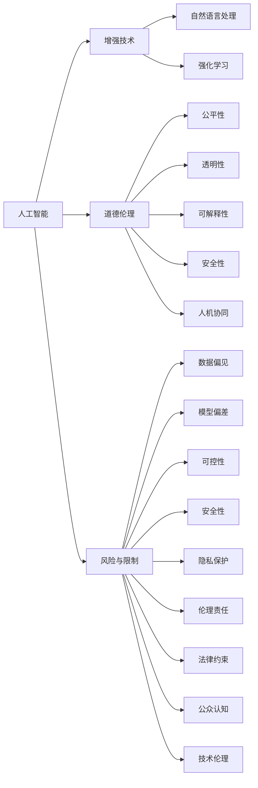

                 

## 1. 背景介绍

随着人工智能(AI)技术的飞速发展，AI不仅在技术层面取得了巨大进步，更在多方面深刻地影响着人类社会的运作。从医疗、教育、交通到金融、法律、娱乐等各个领域，AI都在以越来越深入的方式改变着人们的生活和工作方式。然而，这种“人类增强”并非没有问题。AI的发展带来了道德伦理上的巨大挑战，且对社会的各个方面产生了深远的影响。本博文将深入探讨AI技术的发展对人类社会的道德影响及其可能的限制，并提出一些应对策略。

## 2. 核心概念与联系

### 2.1 核心概念概述

在深入探讨道德问题前，我们需要了解一些核心概念：

- **人工智能**：广义上是指一类能够模拟人类智能行为的计算机系统。狭义上通常指机器学习和深度学习等技术实现的系统。

- **增强技术**：通过AI技术增强人类能力的技术，包括增强学习、强化学习、自然语言处理等。

- **道德伦理**：涉及在人工智能技术开发与应用中应当遵循的原则和规范，如公平性、透明性、可解释性、安全性等。

- **风险与限制**：在AI技术增强人类能力的过程中，可能引发的各种风险，以及应对这些风险所必需的限制措施。

- **人机协同**：AI技术与人类协作，共同解决复杂问题的模式，强调AI并非取代人类，而是提升人类的智能水平。

这些概念之间的联系可以通过以下Mermaid流程图来展示：



这个流程图展示了人工智能增强技术对各领域的影响，以及随之而来的道德伦理问题和相应的风险与限制。

## 3. 核心算法原理 & 操作步骤

### 3.1 算法原理概述

AI技术，尤其是基于深度学习的方法，在处理复杂问题时表现出了强大的能力。这种能力来源于大规模数据的训练，以及算法的复杂性和高效性。然而，这种技术的广泛应用也引发了诸多道德伦理问题。

- **数据偏见**：AI系统依赖于数据进行训练，如果数据本身具有偏见，那么训练出的系统也会带有偏见，导致不公平的决策。
- **算法透明度**：许多AI算法（尤其是深度学习模型）是“黑盒”的，很难解释其决策过程，这引发了公众对AI决策透明性的担忧。
- **安全性与控制**：AI系统的失控可能导致安全问题，如自动化武器、虚假新闻等。如何控制AI系统成为一大挑战。

### 3.2 算法步骤详解

针对这些问题，AI技术的开发和应用应当遵循一定的道德伦理原则，并采取相应的限制措施：

1. **公平性与无偏性**：在数据收集和处理阶段，应当避免选择偏见数据，并对数据进行去偏处理，确保模型对不同群体公平。

2. **透明度与可解释性**：应当尽可能地使AI决策过程透明，并能够为人类所理解。如使用可解释的模型、日志记录等方法。

3. **安全性与控制**：应当在设计阶段就将安全性纳入考量，避免系统失控或被恶意利用。例如，使用对抗性训练、安全性的自动化评估等手段。

4. **隐私保护**：在数据收集和处理过程中，应当遵循隐私保护原则，确保用户数据不被滥用。

5. **伦理责任与法律约束**：在AI系统的设计和使用过程中，应当明确各方责任，并遵守相关法律法规。

6. **公众认知与教育**：应当积极向公众宣传AI知识，提升公众对AI技术的认知和理解，避免因知识缺失导致的误解和恐慌。

7. **技术伦理与科研规范**：科研人员在开发AI技术时，应当遵循相应的伦理规范，避免技术滥用。

### 3.3 算法优缺点

- **优点**：
  - AI技术可以显著提升人类处理复杂问题的能力。
  - 应用广泛，涵盖了医疗、教育、金融等众多领域。
  - 通过不断优化算法，可以提高决策效率和准确性。

- **缺点**：
  - 数据偏见和模型偏差可能导致不公正的结果。
  - 缺乏透明度和可解释性可能引起信任问题。
  - 可能引发安全问题，包括模型失控或被恶意利用。

### 3.4 算法应用领域

AI技术在多个领域中得到了广泛应用：

- **医疗**：如AI辅助诊断、个性化医疗、药物研发等。
- **教育**：如智能教学系统、学习辅助工具、个性化学习方案等。
- **金融**：如风险评估、欺诈检测、量化投资等。
- **自动驾驶**：如无人驾驶车辆、智能交通系统等。
- **法律**：如智能合约、证据分析等。

## 4. 数学模型和公式 & 详细讲解 & 举例说明

### 4.1 数学模型构建

AI系统的核心是机器学习模型，尤其是深度学习模型。以下是一个简单的深度学习模型的数学表达：

$$
y=f(\theta;x)
$$

其中，$y$ 表示模型预测结果，$x$ 表示输入数据，$\theta$ 表示模型参数，$f$ 表示模型的计算函数。

### 4.2 公式推导过程

以神经网络为例，以三层全连接网络为例，其前向传播和反向传播过程如下：

- 前向传播：
  $$
  z^{(1)}=w^{(1)}x+b^{(1)}
  $$
  $$
  a^{(1)}=f(z^{(1)})
  $$
  $$
  z^{(2)}=w^{(2)}a^{(1)}+b^{(2)}
  $$
  $$
  a^{(2)}=f(z^{(2)})
  $$
  $$
  z^{(3)}=w^{(3)}a^{(2)}+b^{(3)}
  $$
  $$
  y^{(3)}=f(z^{(3)})
  $$

- 反向传播：
  $$
  \frac{\partial y}{\partial z^{(3)}}=\frac{\partial y}{\partial a^{(3)}}\frac{\partial a^{(3)}}{\partial z^{(3)}}
  $$
  $$
  \frac{\partial y}{\partial w^{(3)}}=\frac{\partial y}{\partial z^{(3)}}\frac{\partial z^{(3)}}{\partial w^{(3)}}
  $$
  $$
  \frac{\partial y}{\partial b^{(3)}}=\frac{\partial y}{\partial z^{(3)}}
  $$
  $$
  \frac{\partial y}{\partial a^{(2)}}=\frac{\partial y}{\partial z^{(2)}}\frac{\partial z^{(2)}}{\partial a^{(2)}}
  $$
  $$
  \frac{\partial y}{\partial w^{(2)}}=\frac{\partial y}{\partial z^{(2)}}\frac{\partial z^{(2)}}{\partial w^{(2)}}
  $$
  $$
  \frac{\partial y}{\partial b^{(2)}}=\frac{\partial y}{\partial z^{(2)}}
  $$
  $$
  \frac{\partial y}{\partial z^{(1)}}=\frac{\partial y}{\partial a^{(1)}}\frac{\partial a^{(1)}}{\partial z^{(1)}}
  $$
  $$
  \frac{\partial y}{\partial w^{(1)}}=\frac{\partial y}{\partial z^{(1)}}\frac{\partial z^{(1)}}{\partial w^{(1)}}
  $$
  $$
  \frac{\partial y}{\partial b^{(1)}}=\frac{\partial y}{\partial z^{(1)}}
  $$

通过公式推导，我们可以看到深度学习模型的计算过程。这些公式为后续的优化算法提供了理论依据。

### 4.3 案例分析与讲解

以面部识别为例，AI技术可以在大量的数据上训练出高精度的面部识别模型。然而，这种技术在应用中同样存在道德风险。

- **数据偏见**：如果训练数据主要来自某一种族、性别等群体，那么模型可能会对其他群体产生偏见，从而导致不公平的结果。
- **透明性**：面部识别模型的内部机制非常复杂，往往难以解释其如何得出结论。这引发了公众对于隐私和安全的担忧。
- **安全性与控制**：面部识别系统可能被用于监控和追踪，侵犯个人隐私，甚至可能被恶意利用。

## 5. 项目实践：代码实例和详细解释说明

### 5.1 开发环境搭建

要搭建深度学习模型，需要以下环境：

- Python 3.x
- PyTorch 或 TensorFlow
- GPU（推荐使用NVIDIA卡）
- CUDA 或 RoCM

在搭建好环境后，可以开始模型训练。

### 5.2 源代码详细实现

以人脸识别为例，可以使用PyTorch实现：

```python
import torch
import torch.nn as nn
import torch.optim as optim
from torchvision import datasets, transforms

class CNN(nn.Module):
    def __init__(self):
        super(CNN, self).__init__()
        self.conv1 = nn.Conv2d(3, 64, 3, 1, 1)
        self.pool = nn.MaxPool2d(2, 2)
        self.conv2 = nn.Conv2d(64, 128, 3, 1, 1)
        self.fc1 = nn.Linear(128*8*8, 512)
        self.fc2 = nn.Linear(512, 7)

    def forward(self, x):
        x = self.pool(torch.relu(self.conv1(x)))
        x = self.pool(torch.relu(self.conv2(x)))
        x = x.view(-1, 128*8*8)
        x = torch.relu(self.fc1(x))
        x = self.fc2(x)
        return x

# 训练
model = CNN()
criterion = nn.CrossEntropyLoss()
optimizer = optim.Adam(model.parameters(), lr=0.001)
train_dataset = datasets.CIFAR10(root='./data', train=True, download=True, transform=transforms.ToTensor())
train_loader = torch.utils.data.DataLoader(train_dataset, batch_size=4, shuffle=True)

for epoch in range(2):
    running_loss = 0.0
    for i, data in enumerate(train_loader, 0):
        inputs, labels = data
        optimizer.zero_grad()
        outputs = model(inputs)
        loss = criterion(outputs, labels)
        loss.backward()
        optimizer.step()
        running_loss += loss.item()
        if i % 2000 == 1999:    
            print('[%d, %5d] loss: %.3f' % (epoch + 1, i + 1, running_loss / 2000))
            running_loss = 0.0
```

### 5.3 代码解读与分析

上述代码实现了简单的卷积神经网络（CNN）进行面部识别训练。关键步骤如下：

1. **数据准备**：使用`datasets.CIFAR10`加载CIFAR-10数据集。
2. **模型定义**：定义CNN模型。
3. **损失函数和优化器**：使用交叉熵损失函数和Adam优化器。
4. **训练循环**：迭代训练数据，更新模型参数。

## 6. 实际应用场景

### 6.1 医疗领域

AI在医疗领域的应用包括影像诊断、药物研发、个性化医疗等。然而，这些应用同样面临道德挑战。

- **影像诊断**：AI可以辅助医生诊断，但数据集中的偏差可能导致诊断结果不公。例如，某些疾病的图像数据不足，可能导致模型对这种疾病识别效果不佳。
- **药物研发**：AI可以加速药物研发进程，但可能会因为对部分患者不适应而产生副作用。

### 6.2 金融领域

在金融领域，AI被用于风险评估、欺诈检测等。然而，AI的透明性和公平性问题同样存在。

- **风险评估**：AI可以预测客户信用风险，但如果模型存在偏见，可能导致某些群体被不公平对待。
- **欺诈检测**：AI可以检测金融欺诈行为，但如果模型过于严格，可能导致无辜用户被误判。

### 6.3 教育领域

AI在教育领域的应用包括智能教学、学习辅助等。然而，AI的普及可能导致教育资源分配不均。

- **智能教学**：AI可以提供个性化学习方案，但可能导致教育资源集中在某些地区或群体。
- **学习辅助**：AI可以辅助学习，但可能导致某些学生过度依赖AI，而忽略了自主学习。

## 7. 工具和资源推荐

### 7.1 学习资源推荐

1. **《人工智能伦理导论》**：这本书从伦理学角度探讨了AI技术的道德问题。
2. **Coursera《人工智能伦理》课程**：由斯坦福大学教授主讲，介绍了AI技术的伦理和道德问题。
3. **ArXiv论文**：最新的AI伦理论文，涵盖了AI技术的公平性、透明性、可解释性等主题。

### 7.2 开发工具推荐

1. **PyTorch**：灵活的深度学习框架，支持动态计算图。
2. **TensorFlow**：强大的深度学习框架，支持静态和动态计算图。
3. **TensorBoard**：可视化工具，用于监控模型训练过程。
4. **HuggingFace Transformers**：预训练模型库，支持多种语言模型。

### 7.3 相关论文推荐

1. **《深度学习伦理》**：探讨了深度学习技术的伦理问题，提供了一些解决思路。
2. **《AI伦理指南》**：由谷歌推出的AI伦理指南，涵盖了一系列伦理原则和最佳实践。
3. **《公平性在深度学习中的应用》**：探讨了深度学习中的公平性问题，提出了一些解决方案。

## 8. 总结：未来发展趋势与挑战

### 8.1 研究成果总结

本文从AI技术的道德考虑出发，探讨了AI技术在多个领域的应用。AI技术带来了便利，但也引发了诸多道德问题。

### 8.2 未来发展趋势

1. **AI伦理框架**：未来的AI系统需要遵循一套伦理框架，确保其公平、透明和可控。
2. **数据公平性**：将公平性原则引入数据采集和处理，确保模型对不同群体公平。
3. **透明性与可解释性**：开发可解释的模型，提高模型的透明度和可理解性。
4. **安全性与控制**：设计和实现安全性强的AI系统，确保系统不会被恶意利用。
5. **隐私保护**：在数据收集和处理中，采取严格的隐私保护措施。
6. **公众教育与认知提升**：普及AI知识，提升公众对AI技术的理解和信任。

### 8.3 面临的挑战

- **伦理框架的制定**：当前AI伦理框架不完善，需要进一步研究和制定。
- **公平性与数据偏差**：数据偏差和模型偏差的问题难以完全解决。
- **透明性与可解释性**：现有AI模型难以解释，需要进一步研究。
- **安全性与控制**：AI系统可能失控，需要严格控制。
- **隐私保护**：数据隐私问题复杂，需要更完善的保护措施。
- **公众教育与认知提升**：AI知识普及不够，公众对其了解不足。

### 8.4 研究展望

未来的AI研究需要在多方面继续深入探索，如：

- **伦理框架的完善**：建立更完善的AI伦理框架，指导AI技术的开发和应用。
- **公平性保障**：开发公平性更好的数据处理和模型训练方法。
- **透明性与可解释性**：开发更可解释的AI模型，提高模型的透明度。
- **安全性与控制**：研究安全性更好的AI系统设计，确保系统安全。
- **隐私保护**：开发更安全的隐私保护技术，保护用户数据。
- **公众教育与认知提升**：普及AI知识，提升公众对AI技术的认知和信任。

## 9. 附录：常见问题与解答

**Q1：如何确保AI系统的公平性？**

A: 可以从以下几个方面入手：
1. **数据公平性**：确保数据集代表性，避免选择偏差数据。
2. **模型公平性**：开发公平性更好的模型，如使用公平性约束等方法。
3. **算法公平性**：设计公平性更好的算法，如对抗性训练等。

**Q2：如何提高AI模型的透明度和可解释性？**

A: 可以从以下几个方面入手：
1. **可解释性模型**：使用可解释性更好的模型，如线性模型、决策树等。
2. **模型可视化**：使用可视化工具，展示模型的决策过程。
3. **日志记录**：记录模型的训练过程和决策过程，供后人分析。

**Q3：如何确保AI系统的安全性？**

A: 可以从以下几个方面入手：
1. **安全性设计**：在模型设计阶段考虑安全性问题。
2. **对抗训练**：使用对抗样本训练，提高模型的鲁棒性。
3. **监控与检测**：实时监控模型行为，及时检测异常情况。

**Q4：如何保护用户隐私？**

A: 可以从以下几个方面入手：
1. **数据匿名化**：对用户数据进行匿名化处理。
2. **加密技术**：使用加密技术保护用户数据。
3. **隐私保护算法**：开发隐私保护算法，保护用户隐私。

---

作者：禅与计算机程序设计艺术 / Zen and the Art of Computer Programming

