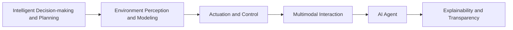

                 

## 1. 背景介绍

### 1.1 问题由来

在数字时代，AI智能体与数字世界的交互成为了一个日益重要的研究方向。随着人工智能技术的飞速发展，越来越多的AI系统被部署到现实世界中，与人、物、环境等实体进行深度交互。这些AI智能体，无论是智能助手、自动驾驶车辆、机器人，还是智能监控系统，都需要具备在复杂多变的环境中进行实时感知、决策和控制的能力。如何设计高效、鲁棒、可解释的AI智能体，使其能够与数字世界无缝对接，成为一个亟待解决的重要问题。

### 1.2 问题核心关键点

AI智能体与数字世界的交互涉及的核心关键点包括：

- **环境感知与建模**：智能体需要能够准确地感知其所在的环境，包括但不限于视觉、听觉、触觉、地理位置等，并能够构建对环境的全局模型。
- **智能决策与规划**：在复杂动态环境中，智能体需要能够实时地进行决策和路径规划，以达成特定目标。
- **行为执行与控制**：智能体需要将决策转化为具体的行动，并对行动进行控制和优化，确保行动的有效性和安全性。
- **多模态交互**：智能体需要具备与人类和其他智能体进行多模态交互的能力，包括语音、文本、图像等。
- **可解释性与透明性**：智能体的决策过程需要具备可解释性，使其能够被人类理解和信任。

这些关键点涵盖了从环境感知到行为执行的整个过程，需要AI智能体具备跨领域的知识、复杂的算法和强大的计算能力。本文将围绕这些关键点，探讨AI智能体与数字世界的交互技术。

### 1.3 问题研究意义

研究AI智能体与数字世界的交互，对于推动人工智能技术的落地应用，提升人机协同能力，具有重要意义：

1. **促进智能技术广泛应用**：通过高效的环境感知和智能决策，AI智能体可以应用于医疗、交通、安防、制造等多个领域，提升行业效率和质量。
2. **增强人机协作**：智能体能够辅助人类完成复杂任务，提高工作效率，减轻人类负担。
3. **推动智能技术创新**：交互技术的研究将推动AI技术的发展，促使更多创新的应用场景涌现。
4. **提升系统透明性与可信度**：可解释的智能体能够增强用户的信任感，避免因黑盒操作带来的误解和误操作。
5. **促进跨学科融合**：交互技术需要融合计算机视觉、自然语言处理、机器人学、神经科学等多学科知识，为学科交叉合作提供新的视角。

## 2. 核心概念与联系

### 2.1 核心概念概述

为更好地理解AI智能体与数字世界的交互，本节将介绍几个密切相关的核心概念：

- **AI智能体(Agent)**：指在数字环境中自主运行、具备感知、决策、执行能力的软件实体。智能体的目标是最大化某个预定义的目标函数。
- **多模态交互(Multimodal Interaction)**：指智能体能够同时处理和融合来自不同模态的信息（如视觉、语音、文本等），以实现更全面、更精确的环境感知。
- **环境感知与建模(Environment Perception and Modeling)**：指智能体通过传感器等手段获取环境信息，并构建环境模型以支持后续的决策和规划。
- **智能决策与规划(Intelligent Decision-making and Planning)**：指智能体在复杂动态环境中，利用环境模型进行智能决策和路径规划，以达成目标。
- **行为执行与控制(Actuation and Control)**：指智能体将决策转化为具体的行动，并对行动进行控制和优化。
- **可解释性与透明性(Explainability and Transparency)**：指智能体的决策和行为具备可解释性，使得用户能够理解和信任其操作。

这些核心概念之间的逻辑关系可以通过以下Mermaid流程图来展示：



这个流程图展示了AI智能体与数字世界交互的主要流程：智能体首先通过环境感知与建模获取环境信息，然后基于环境模型进行智能决策与规划，最后将决策转化为具体的行为执行与控制，并通过多模态交互与外界进行交互，同时保证其决策和行为具备可解释性和透明性。

## 3. 核心算法原理 & 具体操作步骤

### 3.1 算法原理概述

AI智能体与数字世界的交互涉及复杂的算法和技术，主要包括：

- **感知算法(Perception Algorithms)**：用于环境感知与建模，包括计算机视觉、激光雷达、声纳等技术，以获取和处理环境信息。
- **决策算法(Decision Algorithms)**：用于智能决策与规划，包括搜索算法、强化学习、深度学习等技术，以选择最优的行动方案。
- **控制算法(Control Algorithms)**：用于行为执行与控制，包括模型预测控制、逆动力学控制、运动规划等技术，以实现精确的行动执行。
- **交互算法(Interaction Algorithms)**：用于多模态交互，包括语音识别、自然语言处理、手势识别等技术，以实现智能体与人类或其他智能体的沟通。

这些算法和技术相互协作，共同支撑智能体在数字环境中的高效交互。

### 3.2 算法步骤详解

AI智能体与数字世界的交互一般包括以下几个关键步骤：

**Step 1: 环境感知与建模**
- 安装并配置传感器（如摄像头、激光雷达、麦克风等），用于获取环境信息。
- 通过预处理算法（如图像增强、点云滤波等）对传感器数据进行预处理，提升数据质量。
- 构建环境模型，用于存储和表示环境信息。

**Step 2: 智能决策与规划**
- 设计合适的决策算法（如A*搜索、强化学习、深度学习等），基于环境模型进行智能决策。
- 根据决策算法的结果，进行路径规划和行动选择。

**Step 3: 行为执行与控制**
- 设计合适的控制算法（如PID控制、模型预测控制等），将决策转化为具体的行动。
- 执行行动，并对行动进行控制和优化，确保行动的有效性和安全性。

**Step 4: 多模态交互**
- 设计多模态交互算法，支持智能体与人类或其他智能体的沟通。
- 实现语音识别、自然语言处理、手势识别等功能，以支持多模态交互。

**Step 5: 可解释性与透明性**
- 设计可解释性算法，对智能体的决策和行为进行解释，使其可被人类理解和信任。
- 实现可视化界面、决策日志等手段，增强系统的透明性。

以上是AI智能体与数字世界交互的一般流程。在实际应用中，还需要针对具体任务的特点，对交互过程的各个环节进行优化设计，如改进传感器选择、优化算法性能、加强数据安全等，以进一步提升交互效果。

### 3.3 算法优缺点

AI智能体与数字世界交互的算法具有以下优点：

- **灵活性高**：能够适应复杂多变的环境，通过动态调整算法参数，优化决策和行动方案。
- **鲁棒性强**：通过多传感器融合和冗余设计，提高系统的稳定性和可靠性。
- **可解释性强**：通过可解释性算法，使得智能体的决策过程透明，增强用户信任。

同时，该算法也存在一些局限性：

- **计算复杂度高**：涉及感知、决策、控制等多个环节，计算量较大，对硬件资源要求高。
- **算法复杂度高**：涉及多种算法，需要综合考虑，设计合理的算法组合。
- **数据需求量大**：需要大量的标注数据进行训练和调参，数据获取成本高。

尽管存在这些局限性，但就目前而言，AI智能体与数字世界交互的算法仍是大规模应用的重要技术基础。未来相关研究的重点在于如何进一步降低算法对资源的需求，提高交互的实时性和鲁棒性，同时兼顾可解释性和伦理安全性等因素。

### 3.4 算法应用领域

AI智能体与数字世界交互的算法在多个领域得到了广泛应用，例如：

- **自动驾驶**：通过感知、决策、控制等算法，使自动驾驶车辆能够在复杂道路环境中安全行驶。
- **智能监控**：通过多模态交互算法，实现对监控场景中的实时感知和异常行为检测。
- **工业自动化**：通过传感器融合和智能决策，提升工业机器人的操作精度和作业效率。
- **智能医疗**：通过环境感知和智能决策，辅助医生进行疾病诊断和治疗决策。
- **智慧家居**：通过智能家居设备和智能体之间的交互，实现环境感知和智能化控制。

除了上述这些经典领域外，AI智能体与数字世界交互的算法还被创新性地应用到更多场景中，如智慧农业、智慧城市、灾害预警等，为各行各业带来了新的技术突破。

## 4. 数学模型和公式 & 详细讲解 & 举例说明

### 4.1 数学模型构建

为更好地理解AI智能体与数字世界的交互，本节将使用数学语言对交互模型的构建进行更加严格的刻画。

假设AI智能体在数字环境中的状态为 $s$，动作为 $a$，环境奖励为 $r$，下一状态为 $s'$。环境感知与建模可以表示为：

$$
s \sim p_s(\cdot), a \sim p_a(\cdot), r \sim p_r(\cdot)
$$

智能决策与规划可以表示为：

$$
\pi(a|s) = \frac{e^{Q(s,a)}}{Z(s)}
$$

其中，$Q(s,a)$ 为智能体在状态 $s$ 下采取动作 $a$ 的Q值，$Z(s)$ 为归一化因子，$\pi(a|s)$ 为智能体的动作策略。

行为执行与控制可以表示为：

$$
s' = f(s, a, w)
$$

其中，$f$ 为控制算法，$w$ 为控制参数。

多模态交互可以表示为：

$$
I_{in} = g_{in}(\text{input}), I_{out} = g_{out}(\text{output})
$$

其中，$I_{in}$ 为输入信息，$I_{out}$ 为输出信息，$g_{in}$ 和 $g_{out}$ 为多模态交互函数。

可解释性算法可以表示为：

$$
E(\pi, f, g_{in}, g_{out}) = E_s(p_s) \cdot E_a(p_a) \cdot E_r(p_r) \cdot E_{\pi}(\pi) \cdot E_{f}(f) \cdot E_{g_{in}}(g_{in}) \cdot E_{g_{out}}(g_{out})
$$

其中，$E_s$、$E_a$、$E_r$ 分别表示环境、动作和奖励的期望，$E_{\pi}$ 表示动作策略的期望，$E_{f}$ 表示控制算法的期望，$E_{g_{in}}$ 和 $E_{g_{out}}$ 分别表示输入和输出交互函数的期望。

### 4.2 公式推导过程

以下我们以自动驾驶为例，推导感知、决策、控制等关键环节的公式。

**感知算法**

假设智能体采用激光雷达作为环境感知设备，传感器数据表示为 $z \in \mathbb{R}^n$，其中 $n$ 为传感器数据的维度。感知算法的目标是将传感器数据 $z$ 映射到环境状态 $s$，可以表示为：

$$
s \sim p_s(z)
$$

其中，$p_s$ 为传感器数据到环境状态的映射概率。

**决策算法**

智能体通过感知算法获得环境状态 $s$，根据环境状态 $s$ 选择动作 $a$，可以表示为：

$$
a = \arg\max_a Q(s,a)
$$

其中，$Q(s,a)$ 为智能体在状态 $s$ 下采取动作 $a$ 的Q值。

**控制算法**

智能体通过决策算法选择动作 $a$，将其转化为具体的行动 $u$，可以表示为：

$$
u = f(s, a, w)
$$

其中，$f$ 为控制算法，$w$ 为控制参数。

**多模态交互**

假设智能体同时处理视觉、语音、文本等多种模态信息，可以表示为：

$$
I_{in} = g_{in}(\text{visual, auditory, text})
$$

其中，$I_{in}$ 为输入信息，包括视觉图像 $visual$、语音信号 $auditory$、文本信息 $text$ 等，$g_{in}$ 为多模态交互函数。

**可解释性算法**

可解释性算法用于解释智能体的决策和行为，可以表示为：

$$
E(\pi, f, g_{in}, g_{out}) = E_s(p_s) \cdot E_a(p_a) \cdot E_r(p_r) \cdot E_{\pi}(\pi) \cdot E_{f}(f) \cdot E_{g_{in}}(g_{in}) \cdot E_{g_{out}}(g_{out})
$$

其中，$E_s$、$E_a$、$E_r$ 分别表示环境、动作和奖励的期望，$E_{\pi}$ 表示动作策略的期望，$E_{f}$ 表示控制算法的期望，$E_{g_{in}}$ 和 $E_{g_{out}}$ 分别表示输入和输出交互函数的期望。

## 5. 项目实践：代码实例和详细解释说明

### 5.1 开发环境搭建

在进行交互实践前，我们需要准备好开发环境。以下是使用Python进行ROS（Robot Operating System）开发的环境配置流程：

1. 安装ROS：从官网下载并安装ROS，选择合适的ROS发行版。
2. 安装Gazebo：作为ROS的仿真环境，用于模拟自动驾驶车辆在虚拟世界中的运行。
3. 安装传感器库：安装激光雷达、摄像头等传感器库，用于获取环境信息。
4. 安装ROS开发工具：安装Rviz、Gazebo等工具，用于可视化环境信息和车辆状态。

完成上述步骤后，即可在ROS环境中开始交互实践。

### 5.2 源代码详细实现

下面我以自动驾驶为例，给出使用ROS进行感知、决策、控制等核心模块的Python代码实现。

**感知模块**

```python
import rosbag
import sensor_msgs.msg as sensor_msgs
import std_msgs.msg as std_msgs

def callback(msg):
    # 处理激光雷达数据
    # ...

# 订阅激光雷达数据
rospy.Subscriber('/scan', sensor_msgs.LaserScan, callback)

# 运行感知算法
rospy.spin()
```

**决策模块**

```python
import rospy
import actionlib
import control_msgs.msg as control_msgs
import nav_msgs.msg as nav_msgs

class DecisionClient:
    def __init__(self):
        self.client = actionlib.SimpleActionClient('move_base', nav_msgs goal)
        self.client.wait_for_server()
    
    def send_goal(self, goal):
        # 发送目标位置
        # ...

# 决策算法
def decision_algorithm(goal):
    client = DecisionClient()
    client.send_goal(goal)
```

**控制模块**

```python
import rospy
import control_msgs.msg as control_msgs

class ControlClient:
    def __init__(self):
        self.client = actionlib.SimpleActionClient('move_base', nav_msgs goal)
        self.client.wait_for_server()
    
    def send_goal(self, goal):
        # 发送目标位置
        # ...

# 控制算法
def control_algorithm(goal):
    client = ControlClient()
    client.send_goal(goal)
```

**多模态交互模块**

```python
import rospy
import std_msgs.msg as std_msgs
import actionlib
import move_base_msgs.msg as move_base_msgs

class InteractionClient:
    def __init__(self):
        self.client = actionlib.SimpleActionClient('move_base', move_base_msgs goal)
        self.client.wait_for_server()
    
    def send_goal(self, goal):
        # 发送目标位置
        # ...

# 多模态交互
def multi_modal_interaction():
    client = InteractionClient()
    goal = ...
    client.send_goal(goal)
```

**可解释性模块**

```python
import rospy
import sensor_msgs.msg as sensor_msgs
import std_msgs.msg as std_msgs
import visualization_msgs.msg as vis_msgs

def callback(msg):
    # 可视化环境信息
    # ...

# 订阅视觉图像数据
rospy.Subscriber('/image_raw', sensor_msgs.Image, callback)
```

### 5.3 代码解读与分析

让我们再详细解读一下关键代码的实现细节：

**感知模块**

- `callback`函数：处理激光雷达数据，可以采用开源算法（如FastSLAM）实现环境感知与建模。
- `rospy.Subscriber`：订阅激光雷达数据，实现对环境信息的实时获取。

**决策模块**

- `DecisionClient`类：封装ROS动作客户端，用于发送移动基地的目标位置。
- `decision_algorithm`函数：调用决策客户端，发送目标位置，执行决策算法。

**控制模块**

- `ControlClient`类：封装ROS动作客户端，用于发送移动基地的目标位置。
- `control_algorithm`函数：调用控制客户端，发送目标位置，执行控制算法。

**多模态交互模块**

- `InteractionClient`类：封装ROS动作客户端，用于发送移动基地的目标位置。
- `multi_modal_interaction`函数：调用交互客户端，发送目标位置，执行多模态交互算法。

**可解释性模块**

- `callback`函数：处理视觉图像数据，可以采用OpenCV等工具实现可视化界面。
- `rospy.Subscriber`：订阅视觉图像数据，实现对环境信息的实时可视化。

可以看到，ROS框架为交互技术提供了丰富的工具和接口，使得开发者能够轻松实现感知、决策、控制等核心模块，并实现多模态交互和可解释性功能。通过这种模块化的设计思路，可以显著提升交互系统的开发效率和可维护性。

当然，工业级的系统实现还需考虑更多因素，如传感器的多源融合、实时性优化、数据安全等。但核心的交互流程基本与此类似。

## 6. 实际应用场景

### 6.1 智能监控系统

AI智能体与数字世界的交互在智能监控系统中得到了广泛应用。传统的监控系统依赖人力进行实时监控，成本高、效率低。智能监控系统通过多模态交互算法，实现对监控场景中的实时感知和异常行为检测，具有高效率、低成本的优势。

具体而言，智能监控系统可以通过摄像头、传感器等设备获取视频、图像、声音等信息，然后通过多模态交互算法进行融合分析，识别出异常行为并进行报警。智能监控系统还能与安保人员进行多模态交互，实时获取现场信息，提高应急响应速度。

### 6.2 智慧家居系统

智慧家居系统通过智能家居设备和智能体之间的交互，实现环境感知和智能化控制。智能家居设备可以通过传感器获取环境信息，并通过AI智能体进行实时分析和决策，控制家居设备的开关、温度、照明等，提升用户的生活体验。

例如，智能家居系统可以实时感知室内温度、湿度、光照等信息，通过决策算法选择最优的控制策略，如开启空调、调节窗帘、调节灯光等，以提升用户舒适度。同时，智能家居系统还能与用户进行多模态交互，通过语音助手、触摸屏等方式，实现语音控制、场景模式切换等功能。

### 6.3 自动驾驶系统

自动驾驶系统通过感知、决策、控制等环节，实现对复杂道路环境的自主运行。自动驾驶系统能够实时感知道路环境、车辆状态、交通信号等信息，通过智能决策和路径规划，自主控制车辆行驶。

例如，自动驾驶系统可以通过摄像头、雷达、GPS等传感器获取环境信息，通过感知算法构建环境模型，然后通过决策算法进行智能决策，选择最优的行驶路线，通过控制算法进行精准控制。自动驾驶系统还能与人类进行多模态交互，通过语音助手、触摸屏等方式，实现人机交互，提高用户体验。

### 6.4 未来应用展望

随着AI智能体与数字世界交互技术的发展，未来的应用场景将更加多样和广阔。以下是一些可能的应用方向：

1. **智慧城市**：通过智能体与城市基础设施的交互，实现智慧交通、智能能源管理、智能环境监测等功能，提升城市管理效率和居民生活质量。
2. **医疗健康**：通过智能体与医疗设备、患者、医生的交互，实现疾病诊断、手术辅助、健康管理等功能，提升医疗服务质量和效率。
3. **智能制造**：通过智能体与生产设备和生产线的交互，实现智能调度、质量控制、故障预测等功能，提升制造效率和产品质量。
4. **农业自动化**：通过智能体与农业机械、农作物的交互，实现精准农业、智能灌溉、病虫害监测等功能，提升农业生产效率和质量。
5. **智能仓储**：通过智能体与仓储设备、物流车辆的交互，实现智能调度、库存管理、运输优化等功能，提升仓储物流效率和准确性。

这些应用方向凸显了AI智能体与数字世界交互技术的广泛前景，预示着未来智能社会的到来。

## 7. 工具和资源推荐

### 7.1 学习资源推荐

为了帮助开发者系统掌握AI智能体与数字世界的交互技术，这里推荐一些优质的学习资源：

1. **ROS官方文档**：ROS的官方文档提供了详细的开发指南和示例代码，是学习ROS和交互技术的重要资源。
2. **《ROS for Robotics Programming》书籍**：ROS的入门书籍，详细介绍了ROS的开发环境搭建、节点设计、数据交互等基本概念和技术。
3. **《Robotics: Science and Systems》课程**：斯坦福大学开设的机器人学课程，涵盖ROS、感知、决策、控制等多个方面，是系统学习交互技术的重要平台。
4. **《Robotics, Vision and Control》书籍**：Robotics中经典的教材，详细介绍了机器人学中的感知、控制、运动规划等关键技术，是深入学习交互技术的参考书籍。
5. **《Deep Learning for Robotics》书籍**：介绍深度学习在机器人学中的应用，包括视觉感知、决策、控制等环节，是深度学习与交互技术结合的重要资源。

通过对这些资源的学习实践，相信你一定能够快速掌握AI智能体与数字世界的交互技术的精髓，并用于解决实际的交互问题。

### 7.2 开发工具推荐

高效的开发离不开优秀的工具支持。以下是几款用于AI智能体与数字世界交互开发的常用工具：

1. **ROS**：Robot Operating System，提供了丰富的开发环境和工具，支持多机器人、多传感器的协作开发。
2. **Gazebo**：ROS的仿真环境，支持大规模、高并发的机器人仿真。
3. **OpenCV**：计算机视觉库，提供了丰富的图像处理和分析工具，支持视觉感知和环境建模。
4. **TensorFlow**：开源深度学习框架，支持高效的计算图构建和模型训练，适合深度学习与交互技术的结合。
5. **PyTorch**：深度学习框架，支持动态计算图和模型优化，适合交互算法的设计和优化。
6. **Jupyter Notebook**：交互式编程环境，支持Python、R等语言的开发和调试。

合理利用这些工具，可以显著提升AI智能体与数字世界交互任务的开发效率，加快创新迭代的步伐。

### 7.3 相关论文推荐

AI智能体与数字世界交互技术的研究源于学界的持续研究。以下是几篇奠基性的相关论文，推荐阅读：

1. **Kalman Filtering for Robot Motion Control**：介绍Kalman滤波器在机器人运动控制中的应用，是早期机器人智能决策的重要理论基础。
2. **Adaptive Control of Robot Manipulators**：介绍自适应控制算法在机器人操作中的应用，是机器人控制系统优化的重要理论基础。
3. **Vision-Based Navigation of Mobile Robots**：介绍视觉导航在机器人移动中的应用，是早期视觉感知和环境建模的重要理论基础。
4. **Autonomous Driving with Deep Neural Networks**：介绍深度学习在自动驾驶中的应用，是自动驾驶系统感知和决策的重要理论基础。
5. **Deep Reinforcement Learning for Decision Making in Robotics**：介绍深度强化学习在机器人决策中的应用，是机器人智能决策和路径规划的重要理论基础。
6. **Human-Robot Interaction via Multimodal Communication**：介绍多模态交互在机器人人机交互中的应用，是机器人智能交互的重要理论基础。

这些论文代表了大语言模型微调技术的发展脉络。通过学习这些前沿成果，可以帮助研究者把握学科前进方向，激发更多的创新灵感。

## 8. 总结：未来发展趋势与挑战

### 8.1 总结

本文对AI智能体与数字世界的交互技术进行了全面系统的介绍。首先阐述了AI智能体在数字环境中的感知、决策、控制等核心环节，明确了交互技术在智能系统构建中的重要作用。其次，从原理到实践，详细讲解了感知、决策、控制等关键算法的构建和实现，给出了交互任务开发的完整代码实例。同时，本文还广泛探讨了交互技术在智能监控、智慧家居、自动驾驶等多个领域的应用前景，展示了交互范式的巨大潜力。此外，本文精选了交互技术的各类学习资源，力求为读者提供全方位的技术指引。

通过本文的系统梳理，可以看到，AI智能体与数字世界的交互技术正在成为智能系统开发的重要基础，极大地拓展了智能系统的应用边界，催生了更多的落地场景。随着AI技术的发展，交互技术将不断演进，推动智能系统向更高效、更鲁棒、更可解释的方向发展。

### 8.2 未来发展趋势

展望未来，AI智能体与数字世界交互技术将呈现以下几个发展趋势：

1. **多模态融合更加深入**：未来交互系统将更加注重多模态信息的融合，提升环境感知和决策的全面性和准确性。
2. **实时性要求更高**：未来的交互系统需要具备更高的实时性，以应对快速变化的环境。
3. **安全性与伦理性更加重要**：未来的交互系统需要更加注重数据隐私和伦理安全，避免潜在的风险。
4. **可解释性与透明性增强**：未来的交互系统需要具备更强的可解释性和透明性，以增强用户信任和可靠性。
5. **跨领域应用更加广泛**：未来的交互技术将更多地应用于智慧城市、医疗健康、智能制造等领域，提升各行业的智能化水平。
6. **技术融合更加深入**：未来的交互技术将与边缘计算、物联网等技术深度融合，实现更加高效、可靠的智能化应用。

这些趋势凸显了AI智能体与数字世界交互技术的广阔前景，预示着未来智能社会的到来。

### 8.3 面临的挑战

尽管AI智能体与数字世界交互技术已经取得了显著进展，但在迈向更加智能化、普适化应用的过程中，它仍面临诸多挑战：

1. **计算资源瓶颈**：高并发的环境感知、实时决策和控制对计算资源的需求巨大，现有硬件设备难以满足。
2. **数据获取成本高**：获取高质量的数据是实现高质量交互的必要前提，但高质量数据获取成本高、难度大。
3. **算法复杂度高**：涉及感知、决策、控制等多个环节，需要综合考虑，设计合理的算法组合。
4. **数据隐私和安全问题**：交互系统需要处理大量敏感数据，如何保护数据隐私和安全性是一个重要问题。
5. **交互系统的鲁棒性和可靠性**：如何在复杂多变的环境中进行鲁棒性设计和可靠性保证，是交互系统面临的重要挑战。
6. **交互系统的透明性和可解释性**：如何在保证系统复杂性的前提下，增强系统的透明性和可解释性，是交互系统面临的重要挑战。

这些挑战需要技术界和产业界共同努力，通过不断的技术创新和工程实践，才能解决。

### 8.4 研究展望

面对AI智能体与数字世界交互所面临的挑战，未来的研究需要在以下几个方面寻求新的突破：

1. **计算资源优化**：开发更高效的计算算法，提升交互系统的实时性和效率。
2. **数据获取与标注优化**：采用主动学习、半监督学习等技术，降低对高质量标注数据的需求。
3. **算法复杂性简化**：简化算法结构，降低计算复杂度，提升系统的可扩展性和可维护性。
4. **数据隐私与安全保护**：采用隐私保护算法，确保数据隐私和安全。
5. **交互系统的鲁棒性和可靠性**：采用鲁棒性设计和可靠性保证方法，提升系统的鲁棒性和可靠性。
6. **交互系统的透明性和可解释性**：采用可解释性算法和透明性设计方法，增强系统的透明性和可解释性。

这些研究方向的探索，必将引领AI智能体与数字世界交互技术迈向更高的台阶，为构建安全、可靠、可解释、可控的智能系统铺平道路。面向未来，交互技术还需要与其他人工智能技术进行更深入的融合，如知识表示、因果推理、强化学习等，多路径协同发力，共同推动自然语言理解和智能交互系统的进步。只有勇于创新、敢于突破，才能不断拓展交互技术的边界，让智能技术更好地造福人类社会。

## 9. 附录：常见问题与解答

**Q1：AI智能体在复杂环境中的感知能力如何提升？**

A: AI智能体在复杂环境中的感知能力可以通过以下方式提升：

1. **多传感器融合**：采用激光雷达、摄像头、声纳等多种传感器，获取多模态信息，提升感知准确性。
2. **环境建模**：构建高精度的环境模型，支持智能体的决策和规划。
3. **感知算法优化**：采用先进算法，如深度学习、图像增强等，提升感知效果。

**Q2：AI智能体在复杂环境中的决策能力如何提升？**

A: AI智能体在复杂环境中的决策能力可以通过以下方式提升：

1. **强化学习**：通过与环境的交互，学习最优决策策略。
2. **深度学习**：采用深度神经网络，提升决策的准确性和鲁棒性。
3. **多目标优化**：通过多目标优化算法，平衡多个性能指标，提升决策效果。

**Q3：AI智能体在复杂环境中的控制能力如何提升？**

A: AI智能体在复杂环境中的控制能力可以通过以下方式提升：

1. **模型预测控制**：采用模型预测控制算法，提升控制精度。
2. **逆动力学控制**：采用逆动力学控制算法，提升控制效果。
3. **运动规划优化**：采用优化算法，提升路径规划和控制效果。

**Q4：AI智能体在多模态交互中的表现如何提升？**

A: AI智能体在多模态交互中的表现可以通过以下方式提升：

1. **多模态数据融合**：采用先进的融合算法，提升多模态信息的融合效果。
2. **交互算法优化**：采用先进的交互算法，提升交互效果。
3. **用户界面设计**：采用用户界面设计方法，提升用户体验。

**Q5：AI智能体在智能系统中的作用如何发挥？**

A: AI智能体在智能系统中的作用可以通过以下方式发挥：

1. **环境感知**：通过传感器获取环境信息，构建环境模型。
2. **智能决策**：通过智能决策算法，选择最优行动方案。
3. **行为执行**：通过控制算法，执行具体行动。
4. **多模态交互**：通过多模态交互算法，实现与人类和其他智能体的沟通。
5. **可解释性**：通过可解释性算法，增强系统的透明性和可信度。

---

作者：禅与计算机程序设计艺术 / Zen and the Art of Computer Programming

