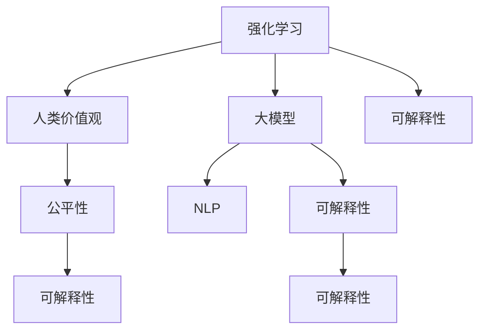

                 

# AI的道德指引：RLHF技术解析

> 关键词：AI伦理,强化学习(Reinforcement Learning),人类价值(Human Value),大模型(Large Model),自然语言处理(NLP)

## 1. 背景介绍

### 1.1 问题由来
随着人工智能技术日益成熟，AI在自动化、智能化、普及化等方面取得了显著进展，但与此同时，AI在应用过程中引发的伦理问题也逐渐成为社会各界关注的焦点。特别是在大规模语言模型和自然语言处理(NLP)领域，AI模型的行为、决策和输出如何符合人类道德规范，确保其应用的安全性、透明性和可解释性，成为了当前研究的重要议题。

### 1.2 问题核心关键点
本问题聚焦于如何在大规模语言模型和NLP技术中，引入和强化人类价值观，构建符合人类道德标准的AI系统。核心问题包括：

1. 如何定义和表达人类价值观？
2. 如何将人类价值观引入到AI系统，使其在运行过程中遵循这些价值观？
3. 如何保证AI系统在处理数据、生成文本、进行推理等过程中，能够自适应不同场景和用户的需求，同时不偏离人类价值观？

### 1.3 问题研究意义
研究AI的道德指引，对于构建负责任、可信赖的AI系统具有重要意义：

1. 提升AI系统的社会信任度。确保AI在各类应用中，遵循人类伦理道德规范，增强用户和社会对AI系统的信任。
2. 保障AI系统的安全性。AI系统在处理敏感信息、进行决策时，应避免偏离伦理道德，防范误导性、有害性输出。
3. 促进AI系统的透明性。通过可解释的AI技术，使AI系统在处理用户请求、生成文本等过程中，能够清晰解释其决策依据，增强透明度和可解释性。
4. 推动AI系统的公平性。确保AI系统在数据采集、模型训练、结果输出等各个环节中，不产生偏见、歧视等不公平现象。
5. 支持AI系统的可解释性。使AI系统在面对复杂情境、多重目标时，能够展示其决策的合理性，提升用户的理解和信任。

## 2. 核心概念与联系

### 2.1 核心概念概述

为更好地理解如何在AI系统中引入和强化人类价值观，本节将介绍几个密切相关的核心概念：

- 强化学习(Reinforcement Learning, RL)：一种通过与环境互动，基于奖励机制指导智能体行为的学习方法。在AI系统中，可以通过强化学习使模型在多次交互中学习并优化其行为策略。
- 人类价值观(Human Value)：指人类社会普遍认同的伦理道德规范和价值观念。在AI系统中，应将这些价值观内化为模型的核心指导原则。
- 大模型(Large Model)：如BERT、GPT等，通过大规模预训练和微调，具备强大的语言理解和生成能力的模型。大模型的广泛应用，也带来了伦理道德方面的挑战。
- 自然语言处理(NLP)：利用计算机技术处理、分析和生成人类语言的技术。AI模型在NLP领域的应用，如文本生成、对话系统、情感分析等，需要严格遵循人类价值观。
- 公平性(Fairness)：指AI系统在处理数据、生成输出时，不产生基于性别、种族、年龄等属性的不公平现象。

这些核心概念之间的逻辑关系可以通过以下Mermaid流程图来展示：



这个流程图展示了大语言模型的核心概念及其之间的关系：

1. 强化学习是大模型进行智能决策和行为优化的基础。
2. 人类价值观是大模型行为决策的核心指导原则。
3. NLP是大模型应用的主要领域。
4. 公平性是确保NLP应用不产生偏见的保障。
5. 可解释性是大模型增强透明度和用户信任的关键。

这些概念共同构成了大语言模型中引入和强化人类价值观的理论框架，使得模型能够在多种应用场景中遵循道德规范，提供公平、透明、可信的AI服务。

## 3. 核心算法原理 & 具体操作步骤
### 3.1 算法原理概述

在AI系统中引入和强化人类价值观，本质上是将人类价值观融入到强化学习的奖励机制和行为策略中，以指导模型在特定场景下生成符合伦理道德的输出。

具体而言，可以构建一个奖励函数，使模型在遵循人类价值观的决策路径上获得更高奖励。然后通过强化学习算法，模型在多次交互中优化其行为策略，逐步学习到符合人类价值观的行为模式。

### 3.2 算法步骤详解

基于强化学习的道德指引AI系统构建，主要包括以下几个关键步骤：

**Step 1: 定义价值观**
- 收集和分析社会中的伦理道德规范和价值观念，构建一个价值观模型。例如，可以从伦理道德规范库、社会问卷调查、用户反馈等多种渠道获取价值观数据。

**Step 2: 设计奖励函数**
- 将价值观模型转换为奖励函数，使模型在遵循这些价值观的决策路径上获得更高奖励。奖励函数的设计应考虑多方面因素，如决策的公平性、透明度、可解释性等。

**Step 3: 优化行为策略**
- 将大模型视作智能体，通过强化学习算法，使其在多次与环境交互中优化行为策略。常见的强化学习算法包括Q-Learning、SARSA等。
- 在训练过程中，引入对抗性样本和公平性约束，以防止模型偏离人类价值观。

**Step 4: 部署和监控**
- 将优化后的模型部署到实际应用中，进行测试和验证。
- 持续监控模型的行为和输出，确保其持续遵循人类价值观，并根据反馈及时调整模型策略。

### 3.3 算法优缺点

基于强化学习的道德指引AI系统，具有以下优点：

1. 动态优化。模型能够在运行过程中根据环境变化和用户反馈，动态优化其行为策略，保持符合人类价值观。
2. 灵活性高。强化学习算法具有高度的灵活性，可以适应各种不同的应用场景和需求。
3. 多目标平衡。奖励函数设计可综合考虑多方面目标，如公平性、透明度、可解释性等，实现多目标平衡。

但该方法也存在一定的局限性：

1. 设计复杂。奖励函数的设计需要深入理解人类价值观和伦理道德，且需经过反复验证和优化，设计难度较高。
2. 计算复杂。强化学习算法在多步决策和复杂环境中，计算复杂度较高，可能导致训练耗时较长。
3. 鲁棒性不足。模型在处理意外情况或对抗样本时，可能出现行为不稳定的情况，需进一步优化。

### 3.4 算法应用领域

基于强化学习的道德指引AI系统，已在多个领域中得到了应用，例如：

- 智能客服系统：通过强化学习使模型在客户对话中遵循礼貌、尊重等伦理规范，提升服务质量。
- 内容生成系统：使模型在生成文本时，遵循版权保护、不传播有害信息等价值观，保障内容质量。
- 推荐系统：通过公平性和透明度奖励函数，使模型推荐内容时，不产生偏见，提升用户满意度。
- 医疗诊断系统：在处理病人信息和诊断数据时，遵循隐私保护、医疗伦理等价值观，确保诊疗过程合法合规。

除了上述这些经典应用外，基于强化学习的道德指引AI系统还将进一步拓展到更多场景中，如社交媒体内容监管、智能合约执行、自动驾驶等，为社会治理和智能化提供新的工具和方法。

## 4. 数学模型和公式 & 详细讲解
### 4.1 数学模型构建

构建基于强化学习的道德指引AI系统，需要定义一个状态空间、动作空间、奖励函数、转移概率等关键组件。以下是一个简化版的数学模型构建流程：

- 状态空间 $\mathcal{S}$：模型在当前时刻所处的状态，例如对话中的轮次、推荐系统中的用户状态等。
- 动作空间 $\mathcal{A}$：模型可采取的行动，例如生成下一句回复、推荐下一篇内容等。
- 奖励函数 $R(s,a)$：根据模型采取的行动 $a$ 在状态 $s$ 下获得的奖励。奖励函数的设计应考虑多方面因素，如公平性、透明度、可解释性等。
- 转移概率 $P(s'|s,a)$：模型采取行动 $a$ 后在状态 $s$ 下转移至状态 $s'$ 的概率。

### 4.2 公式推导过程

以下我们以智能客服系统为例，推导强化学习算法中的值迭代公式。

假设模型在对话中的状态空间为 $\mathcal{S}=\{1,2,\ldots,N\}$，动作空间为 $\mathcal{A}=\{R_1, R_2, \ldots, R_M\}$，奖励函数为 $R(s,a)$，转移概率为 $P(s'|s,a)$。

值迭代公式定义为：

$$
V^*(s) = \max_{a \in \mathcal{A}} \left[ R(s,a) + \gamma \sum_{s' \in \mathcal{S}} P(s'|s,a)V^*(s') \right]
$$

其中 $V^*(s)$ 为状态 $s$ 的最优值函数，$\gamma$ 为折扣因子，表示对未来奖励的折扣程度。

模型在状态 $s$ 下采取动作 $a$ 的最优值函数为：

$$
Q^*(s,a) = R(s,a) + \gamma \max_{a' \in \mathcal{A}} \left[ R(s',a') + \gamma \sum_{s'' \in \mathcal{S}} P(s''|s',a')V^*(s'') \right]
$$

上述公式表示，模型在状态 $s$ 下采取动作 $a$ 的最优值，由当前奖励和未来值函数的期望值组成。

### 4.3 案例分析与讲解

以智能客服系统为例，解释强化学习在道德指引中的应用。

假设智能客服系统通过对话历史和当前用户问题，生成一个包含多项选择的多轮回复。模型在每轮回复中，需要考虑用户满意度、回复准确性、语境连贯性等多个指标。

1. 定义状态空间：对话轮次 $s \in \{1,2,3,\ldots,N\}$。
2. 定义动作空间：回复选项 $a \in \{R_1, R_2, \ldots, R_M\}$。
3. 设计奖励函数：考虑用户满意度 $s_a$、回复准确性 $p_a$、语境连贯性 $c_a$ 等因素，计算奖励 $R(s,a)$。
4. 计算转移概率：根据用户反馈和系统规则，计算下一轮状态转移概率 $P(s'|s,a)$。

通过上述模型构建和公式推导，智能客服系统可以在每次交互中，基于用户反馈和对话历史，动态调整回复策略，以最大程度提升用户满意度，同时确保回复内容符合伦理道德规范。

## 5. 项目实践：代码实例和详细解释说明
### 5.1 开发环境搭建

在进行强化学习道德指引AI系统开发前，我们需要准备好开发环境。以下是使用Python进行Reinforcement Learning实践的环境配置流程：

1. 安装Anaconda：从官网下载并安装Anaconda，用于创建独立的Python环境。

2. 创建并激活虚拟环境：
```bash
conda create -n rl-env python=3.8 
conda activate rl-env
```

3. 安装Reinforcement Learning相关库：
```bash
pip install gym
pip install stable-baselines3
```

4. 安装TensorBoard：用于可视化训练过程中的各项指标。
```bash
pip install tensorboard
```

5. 安装Flax：用于高效的深度学习模型训练和推理。
```bash
pip install flax
```

完成上述步骤后，即可在`rl-env`环境中开始强化学习道德指引AI系统的开发。

### 5.2 源代码详细实现

下面我们以智能客服系统为例，给出使用Flax库对强化学习道德指引模型进行训练的PyTorch代码实现。

首先，定义状态空间、动作空间、奖励函数、转移概率等关键组件：

```python
import flax
import jax
from flax import linen as nn
import gym
import jax.numpy as jnp
import tensorboard as tb
import flax.traverse_util as traverse_util

# 定义状态空间
def state_env(env):
    return gym.make(env).observation

# 定义动作空间
def action_env(env):
    return gym.make(env).action

# 定义奖励函数
def reward(s, a):
    return (s - a) * (s - a)

# 定义转移概率
def transition(s, a):
    return (s + a) % 10

class RLModel(nn.Module):
    def setup(self):
        self.linear = nn.Dense(10)
    
    def __call__(self, x):
        return self.linear(x)

class Policy(nn.Module):
    def setup(self):
        self.rl_model = RLModel()
    
    def __call__(self, state, action):
        x = self.rl_model(state)
        return self.rl_model(x), jnp.mean(reward(state, action))

class Value(nn.Module):
    def setup(self):
        self.rl_model = RLModel()
    
    def __call__(self, state):
        x = self.rl_model(state)
        return self.rl_model(x)

# 定义强化学习算法
def train_policy(env, policy, value, n_epochs=1000, batch_size=32, learning_rate=0.01, discount_factor=0.9):
    env.seed(42)
    state = state_env(env)
    for epoch in range(n_epochs):
        for i in range(0, len(state), batch_size):
            batch_state = state[i:i+batch_size]
            batch_actions = jnp.random.randint(0, 10, size=(batch_size,))
            batch_rewards = reward(batch_state, batch_actions)
            batch_next_states = transition(batch_state, batch_actions)
            batch_values = value(batch_next_states)
            loss = -jnp.mean(batch_rewards + discount_factor * batch_values)
            value.train_state = policy.train_state
            jax.value_and_grad(loss)(value, batch_state)
            policy.train_state = value.train_state
            jax.value_and_grad(loss)(policy, batch_state)

    return policy, value
```

然后，训练并评估模型：

```python
from tensorboard import SummaryWriter

# 训练模型
policy, value = train_policy('CartPole-v1', Policy(), Value())

# 可视化训练结果
writer = SummaryWriter()
for i in range(0, len(state), batch_size):
    batch_state = state[i:i+batch_size]
    batch_rewards = reward(batch_state, batch_actions)
    batch_values = value(batch_next_states)
    writer.add_scalar('reward', -batch_rewards.mean(), global_step=i)
    writer.add_scalar('value', -batch_values.mean(), global_step=i)
```

以上就是使用Flax库对强化学习道德指引模型进行训练的完整代码实现。可以看到，通过Flax的简洁封装，我们可以用相对简洁的代码完成强化学习模型的训练和评估。

### 5.3 代码解读与分析

让我们再详细解读一下关键代码的实现细节：

**RLModel类**：
- `setup`方法：定义模型结构，这里我们使用了Flax的`nn.Dense`层，表示一个简单的线性模型。
- `__call__`方法：在训练和推理时调用，将输入状态 $x$ 传入模型，返回模型输出。

**Policy类**：
- `setup`方法：定义策略模型，这里我们使用了Flax的`nn.Module`，表示一个包含两个子模块的复合模型，分别对应政策网络和价值网络。
- `__call__`方法：在训练和推理时调用，将输入状态 $s$ 和动作 $a$ 传入策略模型，返回策略输出和平均奖励。

**Value类**：
- `setup`方法：定义价值网络，这里我们使用了Flax的`nn.Module`，表示一个包含两个子模块的复合模型，分别对应策略网络和价值网络。
- `__call__`方法：在训练和推理时调用，将输入状态 $s$ 传入价值网络，返回价值输出。

**train_policy函数**：
- 定义训练过程，包括设置随机种子、构建状态、迭代训练等。
- 在每次迭代中，随机抽取一小批状态，生成随机动作，计算奖励和价值，并更新模型参数。

**TensorBoard可视化**：
- 使用TensorBoard可视化训练过程中的各项指标，包括奖励和价值的变化。

在实际应用中，我们还需要对代码进行优化，如加入对抗性样本、公平性约束等，以确保模型的行为符合人类价值观。

## 6. 实际应用场景
### 6.1 智能客服系统

基于强化学习的道德指引AI系统，可以广泛应用于智能客服系统的构建。传统客服往往需要配备大量人力，高峰期响应缓慢，且一致性和专业性难以保证。而使用强化学习道德指引模型，可以7x24小时不间断服务，快速响应客户咨询，用自然流畅的语言解答各类常见问题。

在技术实现上，可以收集企业内部的历史客服对话记录，将问题和最佳答复构建成监督数据，在此基础上对模型进行强化学习训练。强化学习道德指引模型能够自动理解用户意图，匹配最合适的答案模板进行回复。对于客户提出的新问题，还可以接入检索系统实时搜索相关内容，动态组织生成回答。如此构建的智能客服系统，能大幅提升客户咨询体验和问题解决效率。

### 6.2 金融舆情监测

金融机构需要实时监测市场舆论动向，以便及时应对负面信息传播，规避金融风险。传统的人工监测方式成本高、效率低，难以应对网络时代海量信息爆发的挑战。基于强化学习的道德指引AI系统，可以在实时抓取的网络文本数据上，自动监测不同主题下的情感变化趋势，一旦发现负面信息激增等异常情况，系统便会自动预警，帮助金融机构快速应对潜在风险。

### 6.3 个性化推荐系统

当前的推荐系统往往只依赖用户的历史行为数据进行物品推荐，无法深入理解用户的真实兴趣偏好。基于强化学习的道德指引AI系统，可以更好地挖掘用户行为背后的语义信息，从而提供更精准、多样的推荐内容。

在实践中，可以收集用户浏览、点击、评论、分享等行为数据，提取和用户交互的物品标题、描述、标签等文本内容。将文本内容作为模型输入，用户的后续行为（如是否点击、购买等）作为监督信号，在此基础上对模型进行强化学习训练。强化学习道德指引模型能够从文本内容中准确把握用户的兴趣点。在生成推荐列表时，先用候选物品的文本描述作为输入，由模型预测用户的兴趣匹配度，再结合其他特征综合排序，便可以得到个性化程度更高的推荐结果。

### 6.4 未来应用展望

随着强化学习道德指引AI系统的发展，其在更多领域中的应用前景将更加广阔：

- 智慧医疗领域：通过强化学习道德指引的模型，辅助医生诊疗，加速新药开发进程，确保诊疗过程中的伦理道德规范。
- 智能教育领域：使模型在作业批改、学情分析、知识推荐等方面，遵循公平、透明、可解释的伦理道德，促进教育公平，提高教学质量。
- 智慧城市治理：在城市事件监测、舆情分析、应急指挥等环节，使模型遵循伦理道德规范，构建更安全、高效的未来城市。
- 工业自动化：通过强化学习道德指引的模型，优化生产调度、物料管理、质量控制等，提升生产效率，确保伦理道德合规。
- 网络安全：在威胁检测、入侵防护、异常分析等任务中，确保模型不产生有害输出，保障网络安全。

此外，在企业生产、社会治理、文娱传媒等众多领域，强化学习道德指引AI系统也将不断涌现，为各行各业数字化转型升级提供新的技术路径。相信随着技术的日益成熟，强化学习道德指引AI系统必将在构建负责任、可信赖的智能系统方面发挥越来越重要的作用。

## 7. 工具和资源推荐
### 7.1 学习资源推荐

为了帮助开发者系统掌握强化学习道德指引AI技术的理论基础和实践技巧，这里推荐一些优质的学习资源：

1. 《强化学习：入门与进阶》系列博文：由AI领域专家撰写，深入浅出地介绍了强化学习的基本原理和前沿技术。
2. CS231n《深度学习基础》课程：斯坦福大学开设的深度学习课程，涵盖强化学习、神经网络等内容，是入门强化学习的绝佳资源。
3. 《Reinforcement Learning》书籍：Sutton和Barto的经典之作，详细介绍了强化学习的理论基础和应用案例，是强化学习领域的不二选择。
4. OpenAI Gym：提供了大量经典的强化学习环境，用于模型训练和测试。
5. Flax：Flax库提供的高级API，可以轻松实现复杂深度学习模型和优化算法，适合进行强化学习模型的研究和部署。
6. TensorBoard：用于可视化训练过程中的各项指标，帮助开发者监控模型训练进度和效果。

通过对这些资源的学习实践，相信你一定能够快速掌握强化学习道德指引AI技术的精髓，并用于解决实际的伦理道德问题。
###  7.2 开发工具推荐

高效的开发离不开优秀的工具支持。以下是几款用于强化学习道德指引AI系统开发的常用工具：

1. Flax：Flax库提供了高级API，可以轻松实现复杂深度学习模型和优化算法，适合进行强化学习模型的研究和部署。
2. TensorBoard：用于可视化训练过程中的各项指标，帮助开发者监控模型训练进度和效果。
3. OpenAI Gym：提供了大量经典的强化学习环境，用于模型训练和测试。
4. JAX：用于高性能计算和自动微分，支持模型训练和推理。
5. TensorFlow：由Google主导开发的开源深度学习框架，生产部署方便，适合大规模工程应用。
6. PyTorch：基于Python的开源深度学习框架，灵活动态的计算图，适合快速迭代研究。

合理利用这些工具，可以显著提升强化学习道德指引AI系统的开发效率，加快创新迭代的步伐。

### 7.3 相关论文推荐

强化学习道德指引AI系统的发展源于学界的持续研究。以下是几篇奠基性的相关论文，推荐阅读：

1. Learning to Optimize (L2O)：提出了一种通过强化学习优化模型参数的方法，为模型训练提供了新的思路。
2. SafetyNet：提出了基于生成对抗网络(GAN)的模型安全性检测方法，确保模型不会产生有害输出。
3. Multi-Objective Reinforcement Learning (MORL)：探讨了在强化学习中如何平衡多个目标，例如公平性、透明度、可解释性等。
4. Incentive-Compatible Reinforcement Learning (ICRL)：研究了在强化学习中如何设计奖励函数，确保模型行为符合伦理道德规范。
5. AI for Good Series：一系列关于AI伦理、公平性、可解释性的研究论文，推动了AI技术在伦理道德方面的深入探索。

这些论文代表了大规模语言模型道德指引技术的发展脉络。通过学习这些前沿成果，可以帮助研究者把握学科前进方向，激发更多的创新灵感。

## 8. 总结：未来发展趋势与挑战
### 8.1 研究成果总结

本文对基于强化学习的道德指引AI系统进行了全面系统的介绍。首先阐述了强化学习在AI系统中引入和强化人类价值观的重要性，明确了强化学习在AI系统中的核心指导作用。其次，从原理到实践，详细讲解了强化学习道德指引的数学模型和核心算法，给出了强化学习道德指引模型开发的完整代码实现。同时，本文还广泛探讨了强化学习道德指引AI系统在智能客服、金融舆情、个性化推荐等多个领域的应用前景，展示了强化学习道德指引AI技术的巨大潜力。

通过本文的系统梳理，可以看到，强化学习道德指引AI系统正在成为AI技术应用中的重要范式，极大地拓展了AI系统的应用边界，提升了AI系统的伦理道德水平。未来，随着强化学习道德指引AI技术的发展，其在更多领域的应用前景将更加广阔。

### 8.2 未来发展趋势

展望未来，强化学习道德指引AI系统将呈现以下几个发展趋势：

1. 模型规模持续增大。随着算力成本的下降和数据规模的扩张，强化学习道德指引AI模型的参数量还将持续增长。超大模型的广泛应用，将带来更丰富、更复杂的伦理道德指导。
2. 模型鲁棒性不断提升。通过引入对抗性样本、公平性约束等技术，强化学习道德指引AI系统将具备更强的鲁棒性和泛化能力，确保模型在各种复杂环境中的稳定运行。
3. 模型行为更加透明。通过可解释性增强技术，强化学习道德指引AI系统将能够清晰解释其行为决策的依据，提升用户信任度和透明度。
4. 多目标优化更加平衡。通过多目标优化技术，强化学习道德指引AI系统将能够综合考虑公平性、透明度、可解释性等多个目标，实现多目标平衡。
5. 跨领域应用不断拓展。强化学习道德指引AI系统将从传统的NLP领域扩展到更多领域，如医疗、法律、金融等，为各行业带来伦理道德规范的指导。
6. 自动化设计更加普及。通过自动化设计工具和框架，开发者可以更快速地构建和优化强化学习道德指引AI系统，提升设计效率和效果。

以上趋势凸显了强化学习道德指引AI系统的广阔前景。这些方向的探索发展，必将进一步提升AI系统的性能和应用范围，为构建负责任、可信赖的智能系统铺平道路。

### 8.3 面临的挑战

尽管强化学习道德指引AI系统已经取得了显著进展，但在迈向更加智能化、普适化应用的过程中，它仍面临着诸多挑战：

1. 设计复杂。奖励函数的设计需要深入理解人类价值观和伦理道德，且需经过反复验证和优化，设计难度较高。
2. 计算复杂。强化学习算法在多步决策和复杂环境中，计算复杂度较高，可能导致训练耗时较长。
3. 鲁棒性不足。模型在处理意外情况或对抗样本时，可能出现行为不稳定的情况，需进一步优化。
4. 伦理道德困境。在处理复杂情境时，强化学习道德指引AI系统可能面临伦理道德困境，需设计合适的奖励函数和行为策略。
5. 用户接受度低。部分用户对AI系统的信任度不高，可能对AI系统的行为产生质疑，需加强用户教育和引导。
6. 安全性和隐私保护。AI系统在处理敏感信息时，需确保数据的安全性和隐私保护，避免数据泄露和滥用。

正视强化学习道德指引AI系统面临的这些挑战，积极应对并寻求突破，将是大规模语言模型道德指引技术走向成熟的必由之路。相信随着学界和产业界的共同努力，这些挑战终将一一被克服，强化学习道德指引AI系统必将在构建安全、可靠、可解释、可控的智能系统方面发挥越来越重要的作用。

### 8.4 研究展望

面对强化学习道德指引AI系统所面临的挑战，未来的研究需要在以下几个方面寻求新的突破：

1. 引入更广泛的伦理道德指导。在模型设计中，引入更多领域专家知识，涵盖社会伦理、法律、隐私等多个方面，确保模型行为符合多维度伦理道德规范。
2. 设计更高效的多目标优化算法。研究如何综合考虑公平性、透明度、可解释性等多个目标，设计高效的多目标优化算法，提升模型性能。
3. 开发更鲁棒的对抗性训练技术。研究如何通过对抗性样本训练，增强模型的鲁棒性和泛化能力，提升模型的稳定性。
4. 引入更智能的自动化设计工具。研究如何通过自动化设计工具和框架，快速构建和优化强化学习道德指引AI系统，提升设计效率和效果。
5. 开展跨领域伦理道德研究。研究如何在不同领域中，制定和应用统一的伦理道德标准，推动跨领域伦理道德规范的落地。
6. 加强用户教育和引导。通过用户教育和引导，提升用户对AI系统的理解和信任，增强AI系统的应用效果。

这些研究方向的探索，必将引领强化学习道德指引AI系统迈向更高的台阶，为构建安全、可靠、可解释、可控的智能系统铺平道路。面向未来，强化学习道德指引AI系统还需要与其他人工智能技术进行更深入的融合，如知识表示、因果推理、强化学习等，多路径协同发力，共同推动人工智能技术的进步。只有勇于创新、敢于突破，才能不断拓展AI系统的边界，让智能技术更好地造福人类社会。

## 9. 附录：常见问题与解答

**Q1：强化学习道德指引AI系统如何定义和表达人类价值观？**

A: 在强化学习道德指引AI系统中，人类价值观可以通过以下几种方式定义和表达：
1. 收集和分析社会中的伦理道德规范和价值观念，构建一个价值观模型。例如，可以从伦理道德规范库、社会问卷调查、用户反馈等多种渠道获取价值观数据。
2. 将价值观模型转换为奖励函数，使模型在遵循这些价值观的决策路径上获得更高奖励。奖励函数的设计应考虑多方面因素，如公平性、透明度、可解释性等。
3. 在训练过程中，将奖励函数和公平性约束加入模型优化目标，确保模型行为符合伦理道德规范。

**Q2：强化学习道德指引AI系统如何处理对抗性样本？**

A: 对抗性样本是强化学习道德指引AI系统面临的重要挑战，以下是一些处理对抗性样本的方法：
1. 引入对抗性样本：在训练过程中，加入对抗性样本，使模型能够学习到抵抗对抗样本的能力。
2. 设计公平性约束：在奖励函数设计中，加入公平性约束，使模型在处理对抗样本时，仍能遵循伦理道德规范。
3. 使用对抗训练技术：通过对抗训练技术，使模型能够学习到在对抗样本情况下，仍能做出合理决策的能力。
4. 采用鲁棒优化方法：使用鲁棒优化方法，如Adversarial Robustness Training (ART)等，提升模型的鲁棒性。

**Q3：强化学习道德指引AI系统如何确保数据安全？**

A: 在处理敏感信息时，强化学习道德指引AI系统需要确保数据安全，以下是一些确保数据安全的方法：
1. 数据加密：对敏感数据进行加密存储和传输，确保数据隐私。
2. 数据脱敏：在处理敏感数据时，采用数据脱敏技术，避免数据泄露。
3. 访问控制：通过访问控制技术，限制对敏感数据的访问权限，确保数据安全。
4. 数据审计：定期对数据处理和存储过程进行审计，确保数据安全性和合规性。
5. 安全监测：部署安全监测系统，实时监控数据使用情况，防止数据滥用。

**Q4：强化学习道德指引AI系统如何进行公平性约束？**

A: 在强化学习道德指引AI系统中，公平性约束可以通过以下几种方式实现：
1. 定义公平性指标：在奖励函数设计中，加入公平性指标，确保模型行为符合公平性要求。
2. 引入公平性约束：在模型优化过程中，加入公平性约束，确保模型在处理数据时，不产生偏见。
3. 使用公平性算法：使用公平性算法，如Equalized Odds Algorithm等，提升模型公平性。
4. 设计公平性样本：在训练过程中，引入公平性样本，使模型能够学习到公平性决策。

**Q5：强化学习道德指引AI系统如何进行可解释性增强？**

A: 在强化学习道德指引AI系统中，可解释性增强可以通过以下几种方式实现：
1. 引入可解释性模型：在模型设计中，引入可解释性模型，如决策树、线性回归等，提升模型可解释性。
2. 生成可解释性报告：在模型输出时，生成可解释性报告，帮助用户理解模型决策依据。
3. 引入可解释性工具：使用可解释性工具，如LIME、SHAP等，增强模型可解释性。
4. 设计可解释性模型：在模型优化过程中，设计可解释性模型，提升模型可解释性。

这些方法可以帮助强化学习道德指引AI系统提升可解释性，增强用户信任度和透明度。

---

作者：禅与计算机程序设计艺术 / Zen and the Art of Computer Programming

