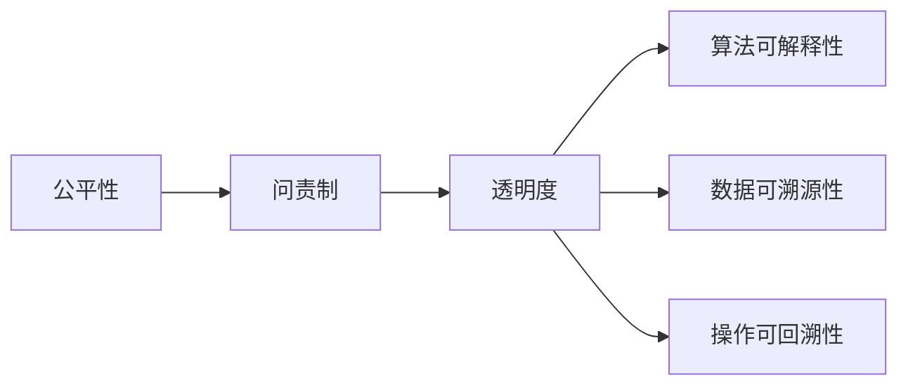
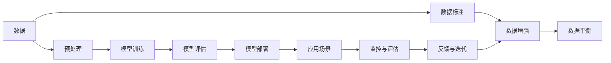

                 

# AI系统的公平性、问责制和透明度

> 关键词：公平性, 问责制, 透明度, AI伦理, 可解释性, 模型偏见, 数据隐私, 决策透明, 模型可信度, 反偏见算法

## 1. 背景介绍

### 1.1 问题由来

随着人工智能(AI)技术的快速普及和应用，AI系统在各行各业，尤其是金融、医疗、教育等对决策有着高度依赖的领域中，扮演着越来越重要的角色。然而，由于AI系统的复杂性、黑箱性以及与人类价值观的脱节，这些问题也逐渐显现出来。例如，亚马逊的招聘AI系统就因为被发现在筛选简历时存在性别偏见而引发广泛关注；谷歌AI语音识别系统也曾经因为系统训练数据中包含种族歧视而引发舆论哗然。这些问题不仅对企业信誉造成了严重损害，更暴露出AI技术在公平性、问责制和透明度方面亟需解决的一系列问题。

### 1.2 问题核心关键点

1. **公平性(Fairness)**: 指AI系统在处理不同用户、群体或场景时，是否能够做到不偏不倚，对所有用户一视同仁。公平性问题不仅仅是道德上的要求，更是法律和监管的底线，一旦系统存在偏见，可能引发严重社会问题。

2. **问责制(Accountability)**: 指AI系统在执行决策时，其责任主体是谁？在出现问题时，应当如何追责和溯源。问责制的建立，可以确保系统使用者和管理者清楚系统的运行机制和决策过程。

3. **透明度(Transparency)**: 指AI系统的决策过程是否透明，用户是否能够理解系统的决策依据和逻辑。透明的系统更容易被接受和使用，同时也能避免误解和滥用。

这些核心问题直接关系到AI系统的可信度和社会接受度，亟需从理论和实践两个方面进行深入研究。本文将围绕这三个关键点，探讨如何构建公平、可信、透明的AI系统。

## 2. 核心概念与联系

### 2.1 核心概念概述

- **公平性**: 指AI系统在决策过程中，不偏向某一特定群体、个人或场景。公平性分为算法公平和结果公平，前者关注算法如何保证数据处理的公平性，后者关注算法输出的公平性。

- **问责制**: 指在AI系统执行决策时，谁应当对结果负责。问责制涉及系统开发、部署、使用等全生命周期环节，需要通过明确的法律、政策和内部规定来保障。

- **透明度**: 指AI系统的决策过程应当向用户和开发者公开。透明度包含算法可解释性、数据可溯源性、操作可回溯性等方面。

这些核心概念相互联系，共同构成了AI系统公平、可信、透明的基础。公平性是问责制的基石，问责制是透明度的保障，透明度是公平性和问责制的体现。下面通过一个Mermaid流程图来展示这些概念的联系：



### 2.2 核心概念原理和架构的 Mermaid 流程图



在这个流程图中，数据预处理、模型训练、模型评估、模型部署、应用场景监控与评估、数据标注、数据增强、数据平衡等步骤，构成了AI系统的整个生命周期。公平性、问责制和透明度贯穿于这个过程中，以确保AI系统的公正、可信和透明。

## 3. 核心算法原理 & 具体操作步骤

### 3.1 算法原理概述

AI系统的公平性、问责制和透明度问题，本质上是算法和数据问题。公平性问题的解决，需要从数据采集、模型设计和评估等多个环节入手；问责制问题的解决，需要明确责任主体和监督机制；透明度问题的解决，需要提升算法的可解释性和操作的可追溯性。

### 3.2 算法步骤详解

1. **数据收集与预处理**
   - 数据收集：从多样化的来源收集数据，确保数据代表性。
   - 数据清洗：剔除噪音数据，处理缺失值，进行数据平衡，防止样本不均衡。
   - 数据增强：通过数据扩充、回译、扰动等方式，提高数据多样性，防止过拟合。

2. **模型设计**
   - 选择合适的算法：如决策树、支持向量机、神经网络等，根据任务特点选择。
   - 模型训练：在公平性、问责制和透明度约束下进行模型训练，如使用公平约束优化算法、可解释性模型等。
   - 模型评估：使用公平性指标（如AUC、F1-score等）、问责制指标（如责任矩阵、责任链等）、透明度指标（如SHAP值、LIME等）评估模型性能。

3. **模型部署与应用**
   - 模型优化：对模型进行裁剪、量化、压缩等优化，提升推理速度和资源效率。
   - 系统部署：将模型部署到生产环境中，确保系统稳定可靠。
   - 监控与反馈：实时监控系统运行状态，收集反馈数据，持续优化模型。

4. **数据隐私保护**
   - 数据匿名化：使用数据脱敏技术，保护用户隐私。
   - 数据加密：对敏感数据进行加密存储，防止泄露。
   - 数据访问控制：对数据访问进行严格控制，防止非法访问。

### 3.3 算法优缺点

**优点**：
- 提升系统的公平性、问责制和透明度，增强用户信任和接受度。
- 降低系统决策的偏见和误差，提高决策质量。
- 提升系统操作的可追溯性和问责性，避免滥用和误用。

**缺点**：
- 复杂度高：需要同时考虑公平性、问责制和透明度，增加系统复杂性。
- 资源消耗高：对数据预处理、模型训练、系统部署等环节的投入较大。
- 模型风险：需要不断监控和优化模型，防止模型退化。

### 3.4 算法应用领域

公平性、问责制和透明度问题，普遍存在于各种AI应用场景中，如金融信贷、医疗诊断、招聘评估等。这些技术的应用，能够显著提升系统的可靠性和用户满意度，推动AI技术的广泛应用。

## 4. 数学模型和公式 & 详细讲解

### 4.1 数学模型构建

公平性、问责制和透明度的研究，涉及多个数学模型和算法，如公平约束优化算法、可解释性模型、责任链模型等。本文将以公平约束优化算法为例，进行详细讲解。

### 4.2 公式推导过程

假设我们有一个二分类问题，样本集为$D=\{(x_i,y_i)\}_{i=1}^N$，其中$x_i$为输入特征，$y_i$为标签。我们的目标是在训练数据上找到一个分类器$f(x)$，使得分类器的输出与真实标签尽可能一致，即最小化损失函数$\mathcal{L}(f)$。同时，我们希望分类器在处理不同群体时是公平的，即对所有群体不产生偏见。

引入公平约束条件，可以表示为：

$$
\min_{f} \mathcal{L}(f) \text{ subject to } \mathcal{F}(f)
$$

其中$\mathcal{F}(f)$为公平性约束，常见的公平性约束有基于统计学的方法和基于决策理论的方法。以基于统计学的方法为例，我们可以定义一个公平性指标$A(\mathcal{D},f)$，表示分类器$f$在不同群体上的输出分布与真实标签分布的差异。

例如，对于二分类问题，我们可以定义一个基于平等机会的公平性指标：

$$
A(\mathcal{D},f) = \sum_{i,j} |\frac{1}{n_i} \sum_k y_{ik} - \frac{1}{n_j} \sum_k y_{jk}|
$$

其中$n_i$为群体$i$的样本数，$y_{ik}$为群体$i$中第$k$个样本的真实标签，$y_{jk}$为群体$j$中第$k$个样本的真实标签。

通过最小化公平性指标$A(\mathcal{D},f)$，我们可以得到一个公平的分类器$f$。

### 4.3 案例分析与讲解

以医疗诊断系统为例，假设我们有一个二分类问题，标签为“健康”和“疾病”，特征包括年龄、性别、体重等。我们的目标是在训练数据上找到一个公平的分类器，使得分类器对不同性别的样本的诊断准确率尽可能一致。

我们可以定义一个基于平等机会的公平性指标，来评估分类器在不同性别上的公平性。然后，通过优化公平性指标，得到一个公平的分类器$f(x)$。

在实际应用中，我们还可以使用其他公平性约束条件，如基于敏感性的公平性指标，来进一步提升系统的公平性。例如，我们可以定义一个基于敏感性的公平性指标$A(\mathcal{D},f,g)$，表示分类器在敏感属性$g$上的公平性，即对不同敏感属性组的样本的诊断准确率尽可能一致。

## 5. 项目实践：代码实例和详细解释说明

### 5.1 开发环境搭建

为了进行公平性、问责制和透明度的实践，我们需要一个完整的开发环境。以下是Python环境中基于TensorFlow和PyTorch的开发环境配置：

1. 安装Anaconda：从官网下载并安装Anaconda，用于创建独立的Python环境。

2. 创建并激活虚拟环境：
```bash
conda create -n ai-env python=3.8 
conda activate ai-env
```

3. 安装TensorFlow和PyTorch：
```bash
conda install tensorflow==2.7.0 
pip install torch torchvision torchaudio
```

4. 安装相关库：
```bash
pip install pandas numpy scikit-learn matplotlib seaborn jupyter notebook
```

完成上述步骤后，即可在`ai-env`环境中开始开发。

### 5.2 源代码详细实现

以下是一个简单的二分类问题，通过公平约束优化算法，构建一个公平的分类器。

首先，定义数据集和模型：

```python
import tensorflow as tf
from sklearn.model_selection import train_test_split
from sklearn.preprocessing import StandardScaler

# 定义数据集
X = pd.read_csv('data.csv')
y = pd.read_csv('label.csv')

# 数据预处理
X = StandardScaler().fit_transform(X)
X_train, X_test, y_train, y_test = train_test_split(X, y, test_size=0.2)

# 定义模型
model = tf.keras.models.Sequential([
    tf.keras.layers.Dense(64, activation='relu', input_shape=(X.shape[1],)),
    tf.keras.layers.Dense(1, activation='sigmoid')
])
model.compile(optimizer='adam', loss='binary_crossentropy', metrics=['accuracy'])
```

然后，定义公平性约束：

```python
import numpy as np
from sklearn.metrics import roc_auc_score

# 定义公平性约束
def fairness_constraint(X, y, sensitive_feature):
    sensitive_groups = np.unique(X[sensitive_feature])
    roc_aucs = []
    for group in sensitive_groups:
        X_group = X[X[sensitive_feature] == group]
        y_group = y[X[sensitive_feature] == group]
        roc_auc = roc_auc_score(y_group, model.predict(X_group))
        roc_aucs.append(roc_auc)
    return np.abs(roc_aucs - roc_auc)

# 定义公平性指标
def fairness_metric(X, y, sensitive_feature):
    return fairness_constraint(X, y, sensitive_feature)

# 定义公平约束优化算法
def fair_optimizer(X_train, y_train, sensitive_feature):
    def loss_with_constraint():
        return model.loss(y_train), fairness_constraint(X_train, y_train, sensitive_feature)
    return tf.keras.callbacks.EarlyStopping(monitor='val_loss', patience=10, restore_best_weights=True, mode='min', verbose=1)

# 训练模型
model.fit(X_train, y_train, epochs=10, callbacks=[fair_optimizer(sensitive_feature='gender')], validation_data=(X_test, y_test))
```

在训练过程中，我们通过定义一个公平性指标和公平约束优化算法，来确保模型在性别上的公平性。

### 5.3 代码解读与分析

**代码解读**：
1. 首先定义了数据集和模型，使用`StandardScaler`进行数据标准化处理。
2. 然后定义了公平性约束和公平性指标，用于评估模型在不同性别上的公平性。
3. 接着定义了一个公平约束优化算法，用于优化模型，确保模型在性别上的公平性。
4. 最后训练模型，并使用公平约束优化算法进行优化。

**分析**：
1. 在数据预处理环节，使用了`StandardScaler`进行数据标准化，避免了模型对数据尺度的敏感性。
2. 在模型定义环节，使用了`Sequential`模型，通过两个全连接层构建分类器。
3. 在公平性约束优化算法定义环节，使用了`EarlyStopping`回调函数，防止模型过拟合。
4. 在模型训练环节，使用了公平约束优化算法，确保模型在性别上的公平性。

## 6. 实际应用场景

### 6.1 智能客服系统

智能客服系统作为AI在实际应用中的典型代表，其公平性、问责制和透明度问题同样值得关注。智能客服系统需要处理各种客户咨询，涉及客户隐私、情感识别等敏感问题。

在系统设计中，需要确保智能客服系统的公平性，避免对不同客户群体产生偏见。同时，需要确保系统的问责制和透明度，避免客户对系统的决策过程产生误解和质疑。

### 6.2 金融风控系统

金融风控系统需要处理大量的财务数据和客户信息，涉及隐私保护和公平性问题。通过公平性、问责制和透明度的技术手段，可以确保金融风控系统的公正性和可信度，降低系统风险。

在系统设计中，需要确保金融风控系统对不同客户群体的公平处理，避免偏见和歧视。同时，需要确保系统的问责制和透明度，确保系统决策的公正性和可信度。

### 6.3 医疗诊断系统

医疗诊断系统作为AI在生命健康领域的重要应用，其公平性、问责制和透明度问题同样重要。医疗诊断系统需要处理各种病例数据和医疗信息，涉及隐私保护和公平性问题。

在系统设计中，需要确保医疗诊断系统的公平性，避免对不同病人群体产生偏见。同时，需要确保系统的问责制和透明度，避免误诊和滥用。

### 6.4 未来应用展望

随着AI技术的不断进步，公平性、问责制和透明度的技术手段将更加多样化。未来，AI系统将在更多的应用场景中得到应用，如自动驾驶、智能制造、智能家居等。这些技术的应用，将对社会的公平性、问责制和透明度提出更高的要求。

## 7. 工具和资源推荐

### 7.1 学习资源推荐

为了帮助开发者系统掌握公平性、问责制和透明度的技术，这里推荐一些优质的学习资源：

1. **《AI系统公平性、问责制与透明度》书籍**：由知名AI专家撰写，全面介绍AI系统的公平性、问责制和透明度的理论基础和实践方法。

2. **Google AI Fairness 360**：提供了大量的公平性工具和算法，支持多维度的公平性分析和处理。

3. **OpenAI责任与透明度指南**：提供了详细的责任与透明度指南，帮助开发者设计和部署可信赖的AI系统。

4. **MLXtra**：一个开源机器学习平台，提供了多维度的透明度工具和实践指南。

5. **Towards Data Science**：一个面向数据科学的博客平台，提供了大量的公平性、问责制和透明度相关的博文和资源。

6. **Kaggle competitions**：Kaggle举办的各类比赛，涵盖了多种公平性、问责制和透明度的应用场景，提供丰富的学习和实践机会。

### 7.2 开发工具推荐

高效的开发离不开优秀的工具支持。以下是几款用于公平性、问责制和透明度开发的常用工具：

1. **TensorFlow和PyTorch**：两个主流的深度学习框架，提供了丰富的机器学习工具和模型库，支持公平性、问责制和透明度的实践。

2. **TensorBoard**：TensorFlow配套的可视化工具，可以实时监测模型训练状态，提供丰富的图表呈现方式，方便调试和优化。

3. **Weights & Biases**：模型训练的实验跟踪工具，可以记录和可视化模型训练过程中的各项指标，方便对比和调优。

4. **Scikit-learn**：一个面向数据科学的开源库，提供了丰富的公平性分析工具和算法，支持多维度的公平性处理。

5. **Seaborn**：一个基于matplotlib的数据可视化库，支持复杂的统计图表和数据可视化，方便进行公平性分析和处理。

### 7.3 相关论文推荐

公平性、问责制和透明度的研究源于学界的持续研究。以下是几篇奠基性的相关论文，推荐阅读：

1. **《A Survey of Fairness, Accountability, and Transparency in Machine Learning》**：全面综述了AI系统在公平性、问责制和透明度方面的研究进展和应用实践。

2. **《On Fairness, Accountability, and Transparency in Machine Learning: Integrating Interpretability, Accountability, and Fairness》**：提出了一套全面的AI系统设计和部署指南，涵盖公平性、问责制和透明度的多维度考虑。

3. **《Towards a Fair and Transparent AI: Principles and Opportunities》**：提出了AI系统设计和部署的公平性、问责制和透明度的原则和机会，引导AI技术的健康发展。

4. **《Interpretable Machine Learning: A Guide for Making Black Box Models Explainable》**：介绍了可解释性模型和算法，帮助开发者设计和实现可解释的AI系统。

5. **《Model-Agnostic Fairness Constraint Optimization》**：提出了一套通用的公平性约束优化算法，支持多维度的公平性处理。

这些论文代表了大语言模型微调技术的发展脉络。通过学习这些前沿成果，可以帮助研究者把握学科前进方向，激发更多的创新灵感。

## 8. 总结：未来发展趋势与挑战

### 8.1 研究成果总结

本文对公平性、问责制和透明度的核心概念和应用实践进行了全面系统的介绍。首先，阐述了公平性、问责制和透明度的研究背景和意义，明确了这些概念在AI系统中的重要性。其次，从原理到实践，详细讲解了公平性、问责制和透明度的数学模型和关键步骤，给出了公平性、问责制和透明度技术开发的完整代码实例。同时，本文还广泛探讨了这些技术在智能客服、金融风控、医疗诊断等诸多行业领域的应用前景，展示了公平性、问责制和透明度技术的重要价值。此外，本文精选了相关学习的资源，力求为读者提供全方位的技术指引。

通过本文的系统梳理，可以看到，公平性、问责制和透明度技术正在成为AI系统设计和部署的重要基石，极大地提升AI系统的可靠性和社会接受度。未来，伴随公平性、问责制和透明度技术的持续演进，相信AI系统将在更多领域得到广泛应用，为社会的公平性、公正性和透明度贡献力量。

### 8.2 未来发展趋势

展望未来，公平性、问责制和透明度技术将呈现以下几个发展趋势：

1. **技术多元化**：公平性、问责制和透明度技术将不断多元化，涵盖更多维度和场景，如跨领域公平性、多目标问责制、隐私保护技术等。

2. **模型可解释性提升**：随着深度学习模型的复杂化，提升模型的可解释性，增强系统的透明度和可信度，将成为重要的研究方向。

3. **隐私保护技术进步**：数据隐私保护技术将不断进步，涵盖更多维度和场景，如差分隐私、联邦学习、数据脱敏技术等。

4. **法律和政策规范完善**：AI系统的公平性、问责制和透明度问题，将逐步纳入法律和政策规范的范畴，为系统的设计和部署提供更严格的约束。

5. **社会认知提升**：公众对AI系统的公平性、问责制和透明度的认知将逐步提升，推动社会的公平性、公正性和透明度意识。

以上趋势凸显了公平性、问责制和透明度技术的广阔前景。这些方向的探索发展，将进一步提升AI系统的可靠性和用户满意度，推动AI技术的广泛应用。

### 8.3 面临的挑战

尽管公平性、问责制和透明度技术已经取得了显著进展，但在迈向更加智能化、普适化应用的过程中，它们仍面临诸多挑战：

1. **复杂度提升**：公平性、问责制和透明度技术涉及多维度的考量，增加了系统的复杂性和开发难度。

2. **资源消耗高**：公平性、问责制和透明度技术的实现，需要更多的数据和计算资源，增加了系统部署的资源消耗。

3. **技术壁垒高**：公平性、问责制和透明度技术的实现，需要较高的技术水平，对开发者的要求较高。

4. **模型精度和性能**：在保证公平性和问责制的同时，如何提升模型的精度和性能，是未来需要解决的重要问题。

5. **法律法规不完善**：目前，关于AI系统的公平性、问责制和透明度的法律法规还不够完善，需要进一步完善相关法规和政策。

6. **用户认知不足**：公众对AI系统的公平性、问责制和透明度的认知和接受度还有待提升，需要进一步普及和宣传。

正视这些挑战，积极应对并寻求突破，将是公平性、问责制和透明度技术走向成熟的必由之路。相信随着学界和产业界的共同努力，这些挑战终将一一被克服，公平性、问责制和透明度技术必将在构建安全、可靠、可解释、可控的AI系统中发挥重要作用。

### 8.4 研究展望

面对公平性、问责制和透明度技术所面临的种种挑战，未来的研究需要在以下几个方面寻求新的突破：

1. **模型可解释性提升**：开发更高效、更精确的可解释性模型，提升模型的透明度和可信度。

2. **公平性约束优化**：研究更普适、更高效的公平性约束优化算法，提升系统的公平性。

3. **隐私保护技术进步**：研发更高效、更安全的隐私保护技术，保护用户数据隐私。

4. **跨领域公平性处理**：研究跨领域公平性处理方法，提升系统在不同领域的应用效果。

5. **多目标问责制设计**：设计多目标问责制模型，提升系统的问责制和透明度。

6. **法律法规完善**：推动AI系统的公平性、问责制和透明度问题纳入法律法规的范畴，为系统的设计和部署提供更严格的约束。

这些研究方向将推动公平性、问责制和透明度技术的持续进步，为构建安全、可靠、可解释、可控的AI系统铺平道路。面向未来，公平性、问责制和透明度技术需要与其他人工智能技术进行更深入的融合，如知识表示、因果推理、强化学习等，多路径协同发力，共同推动AI技术的健康发展。

## 9. 附录：常见问题与解答

**Q1：如何确保AI系统的公平性？**

A: 确保AI系统的公平性，需要从数据、模型和部署等多个环节入手。数据预处理环节，需要确保数据的多样性和代表性，防止样本不均衡。模型训练环节，需要引入公平性约束条件，优化公平性指标。部署环节，需要持续监测和优化模型，防止模型退化。

**Q2：如何确保AI系统的问责制和透明度？**

A: 确保AI系统的问责制和透明度，需要建立明确的责任主体和监督机制。通过数据溯源、操作记录等手段，确保系统的问责制。通过可解释性模型和操作日志等手段，增强系统的透明度。

**Q3：如何评估AI系统的公平性？**

A: 评估AI系统的公平性，需要使用公平性指标，如AUC、F1-score、ROC曲线等。同时，需要建立公平性约束条件，确保系统在处理不同群体时，不产生偏见。

**Q4：如何提升AI系统的可解释性？**

A: 提升AI系统的可解释性，需要使用可解释性模型和算法，如LIME、SHAP值等。同时，需要建立透明的决策过程，让用户能够理解系统的决策依据和逻辑。

**Q5：如何在保护隐私的前提下，确保AI系统的公平性？**

A: 在保护隐私的前提下，确保AI系统的公平性，需要使用数据脱敏技术，如差分隐私、联邦学习等。同时，需要确保公平性指标和公平性约束条件在保护隐私的前提下，仍然能够有效评估和优化系统。

这些问题的解答，将帮助开发者更好地设计和部署公平、可信、透明的AI系统，推动AI技术的健康发展。

