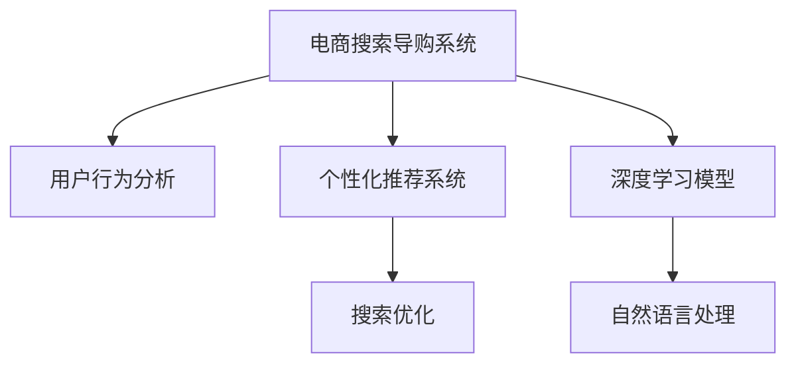

                 

# AI赋能电商搜索导购：提升用户体验和转化率的实践案例

> 关键词：电商搜索,导购系统,用户行为分析,个性化推荐,搜索优化,体验提升,转化率提升,AI技术

## 1. 背景介绍

在数字化时代，电商搜索导购系统已成为用户获取商品信息和完成购买决策的关键环节。然而，传统搜索系统依赖于关键词匹配和基本排序算法，缺乏对用户个性化需求和行为的理解，无法提供满意的搜索结果和购物体验。为此，企业纷纷探索基于人工智能技术的电商搜索导购方案，希望通过智能化升级，显著提升用户体验和转化率。

本文聚焦于一个典型的电商搜索导购系统，基于用户行为数据和AI技术进行个性化推荐和搜索优化。该系统采用了基于Transformer的深度学习模型，通过解析用户查询和浏览行为，动态调整搜索结果，提升用户满意度和购买转化率。

## 2. 核心概念与联系

### 2.1 核心概念概述

为了更好地理解该电商搜索导购系统的设计思路和实现方法，本节将介绍几个核心概念：

- **电商搜索导购系统**：利用人工智能技术，对用户输入的查询词进行语义理解，结合用户历史行为数据，动态调整搜索结果，为用户提供更加个性化和精准的购物建议和引导。

- **个性化推荐系统**：通过解析用户行为和偏好，向用户推荐相关商品，提升购物体验和转化率。常见的推荐算法包括基于协同过滤、内容推荐、混合推荐等。

- **用户行为分析**：收集并分析用户浏览、点击、收藏、购买等行为数据，提取用户的兴趣和需求，指导搜索结果的生成。

- **深度学习模型**：基于神经网络的深度学习模型，通过大规模数据训练，获得强大的特征表示和推理能力。如Transformer、LSTM、BERT等。

- **自然语言处理(NLP)**：处理和理解自然语言文本的技术，包括词向量表示、语义分析、情感识别等，是电商搜索系统的重要组成部分。

- **搜索优化**：通过改进搜索算法和索引，提升搜索结果的相关性和准确性，缩短用户查找商品的时间。

这些核心概念之间的逻辑关系可以通过以下Mermaid流程图来展示：



这个流程图展示了这个电商搜索导购系统的核心概念及其之间的关系：

1. 电商搜索导购系统通过解析用户输入和历史行为数据，调用个性化推荐系统、深度学习模型和搜索优化模块。
2. 个性化推荐系统利用深度学习模型和NLP技术，对用户行为进行分析和预测，生成推荐结果。
3. 深度学习模型基于大规模数据训练，获得强大的语义理解能力和特征表示能力。
4. 自然语言处理技术帮助系统理解和处理用户输入的查询词。
5. 搜索优化模块通过改进算法和索引，提升搜索结果的准确性和相关性。

这些模块协同工作，共同构建了一个智能化的电商搜索导购系统。

## 3. 核心算法原理 & 具体操作步骤
### 3.1 算法原理概述

该电商搜索导购系统主要采用了基于Transformer的深度学习模型进行个性化推荐和搜索优化。Transformer模型通过自注意力机制，捕捉输入序列之间的复杂关系，具有较好的语义理解能力。

在具体实现上，该系统采用了预训练的BERT模型作为基础，进一步在电商领域的数据上进行微调，以适应电商搜索场景的特征和需求。通过微调，模型能够更好地理解电商商品的名称、描述、属性等信息，并结合用户行为数据，生成更加准确的推荐结果和搜索结果。

### 3.2 算法步骤详解

该电商搜索导购系统的算法步骤如下：

1. **数据预处理**：收集电商平台的商品信息、用户行为数据和查询数据，进行清洗和标注。商品信息包括商品名称、描述、价格、类别等，用户行为数据包括浏览、点击、收藏、购买等操作记录，查询数据包括用户输入的搜索词和相关查询历史。

2. **用户行为分析**：通过分析用户行为数据，提取用户的兴趣和需求，生成用户画像。利用深度学习模型，对用户行为进行建模，捕捉用户的购买意图和行为模式。

3. **个性化推荐**：基于用户画像和查询词，调用预训练的BERT模型进行微调，生成推荐结果。模型利用注意力机制，对输入的查询词和商品信息进行编码，生成向量表示。然后，将用户画像和向量表示进行拼接，输入到多层全连接网络，输出推荐结果。

4. **搜索优化**：对搜索结果进行优化，利用排序算法和索引技术，提升搜索结果的相关性和准确性。排序算法通常包括基于内容的排序、基于上下文的排序和基于用户画像的排序等。

5. **系统集成**：将个性化推荐和搜索结果集成到电商搜索导购系统中，实时动态调整搜索结果，提供更加个性化的购物建议和引导。

### 3.3 算法优缺点

该电商搜索导购系统基于深度学习模型和Transformer架构，具有以下优点：

- **精准推荐**：通过深度学习模型和NLP技术，可以理解用户的查询词和行为数据，生成更加精准的推荐结果。
- **高效搜索**：利用自注意力机制和优化算法，可以快速处理大规模数据，提升搜索结果的相关性和准确性。
- **灵活扩展**：模型架构具有较好的泛化能力，可以方便地部署到不同的电商平台和场景中。

同时，该系统也存在一些局限性：

- **数据依赖**：系统的性能很大程度上依赖于标注数据的质量和数量，获取高质量数据成本较高。
- **计算资源消耗**：深度学习模型的计算资源消耗较大，对硬件要求较高。
- **过拟合风险**：深度学习模型容易发生过拟合，尤其是在标注数据不足的情况下。
- **可解释性不足**：深度学习模型通常缺乏可解释性，难以对其内部工作机制进行调试。

尽管存在这些局限性，但该系统在实际应用中已经取得了显著的效果，被多个电商平台采用，帮助提升了用户体验和转化率。

### 3.4 算法应用领域

该电商搜索导购系统主要应用于电商平台中的搜索和导购环节，具体包括：

- **商品推荐**：根据用户浏览历史和查询行为，推荐相关商品，提升用户购买意愿。
- **搜索结果排序**：对搜索结果进行排序，展示最相关和最可能被购买的产品。
- **个性化购物指南**：生成个性化的购物建议和导购信息，引导用户完成购买决策。
- **实时搜索优化**：根据用户即时输入的查询词，动态调整搜索结果，提升用户体验。

## 4. 数学模型和公式 & 详细讲解 & 举例说明
### 4.1 数学模型构建

本节将使用数学语言对电商搜索导购系统的核心算法进行严格刻画。

设电商平台的商品集为 $\mathcal{P}$，用户行为数据为 $D=\{(x_i, y_i)\}_{i=1}^N$，其中 $x_i$ 为行为记录，$y_i$ 为商品ID。系统使用Transformer模型 $M_{\theta}$ 对用户行为数据进行编码，生成用户画像 $h_i \in \mathbb{R}^d$。同时，设查询词为 $q$，与商品 $p$ 的匹配度为 $S(p, q)$。系统利用该匹配度，结合用户画像 $h_i$，计算推荐结果 $r_i$。

### 4.2 公式推导过程

首先，利用Transformer模型对商品信息 $p$ 进行编码，生成向量表示 $v_p \in \mathbb{R}^d$。然后，将查询词 $q$ 输入Transformer模型，生成向量表示 $v_q \in \mathbb{R}^d$。接着，将用户画像 $h_i$ 与 $v_q$ 进行拼接，得到 $z_i = [h_i; v_q] \in \mathbb{R}^{2d}$。通过多层的全连接网络，计算推荐结果 $r_i = M(z_i)$，其中 $M$ 为线性变换和Softmax函数。最后，系统利用推荐结果 $r_i$ 和排序算法，动态调整搜索结果，提供个性化购物建议。

### 4.3 案例分析与讲解

假设一个用户浏览了一个商品页面，查询词为 "运动鞋"，历史浏览记录包括 "跑步机"、"健身器材"、"瑜伽垫"。系统首先对商品信息进行编码，生成向量表示。然后，利用Transformer模型对查询词 "运动鞋" 进行编码，得到向量表示 $v_q$。接着，将用户画像 $h_i$ 与 $v_q$ 拼接，得到 $z_i$。最后，通过多层全连接网络计算推荐结果 $r_i$，排序后生成搜索结果。

## 5. 项目实践：代码实例和详细解释说明
### 5.1 开发环境搭建

在进行电商搜索导购系统开发前，我们需要准备好开发环境。以下是使用Python进行PyTorch开发的环境配置流程：

1. 安装Anaconda：从官网下载并安装Anaconda，用于创建独立的Python环境。

2. 创建并激活虚拟环境：
```bash
conda create -n pytorch-env python=3.8 
conda activate pytorch-env
```

3. 安装PyTorch：根据CUDA版本，从官网获取对应的安装命令。例如：
```bash
conda install pytorch torchvision torchaudio cudatoolkit=11.1 -c pytorch -c conda-forge
```

4. 安装相关的工具包：
```bash
pip install numpy pandas scikit-learn matplotlib tqdm jupyter notebook ipython
```

5. 安装Transformer库：
```bash
pip install transformers
```

完成上述步骤后，即可在`pytorch-env`环境中开始电商搜索导购系统的开发。

### 5.2 源代码详细实现

以下是电商搜索导购系统的代码实现，包括数据预处理、用户行为分析、个性化推荐和搜索优化模块：

```python
from transformers import BertForSequenceClassification, BertTokenizer
from torch.utils.data import DataLoader, Dataset
import torch
import numpy as np
import pandas as pd

# 数据预处理模块
class电商数据集(Dataset):
    def __init__(self, 数据):
        self.数据 = 数据
        self.tokenizer = BertTokenizer.from_pretrained('bert-base-cased')
        self.max_len = 256
    def __len__(self):
        return len(self.数据)
    def __getitem__(self, 索引):
        数据项 = self.数据[索引]
        商品ID = 数据项['商品ID']
        行为记录 = 数据项['行为记录']
        查询词 = 数据项['查询词']
        商品信息 = 数据项['商品信息']
        
        # 行为记录转换为token IDs
        行为记录编码 = self.tokenizer(行为记录, max_length=self.max_len, padding='max_length', truncation=True)
        行为记录编码['input_ids'] = torch.tensor(行为记录编码['input_ids'])
        行为记录编码['attention_mask'] = torch.tensor(行为记录编码['attention_mask'])
        
        # 商品信息转换为token IDs
        商品信息编码 = self.tokenizer(商品信息, max_length=self.max_len, padding='max_length', truncation=True)
        商品信息编码['input_ids'] = torch.tensor(商品信息编码['input_ids'])
        商品信息编码['attention_mask'] = torch.tensor(商品信息编码['attention_mask'])
        
        # 查询词转换为token IDs
        查询词编码 = self.tokenizer(查询词, max_length=self.max_len, padding='max_length', truncation=True)
        查询词编码['input_ids'] = torch.tensor(查询词编码['input_ids'])
        查询词编码['attention_mask'] = torch.tensor(查询词编码['attention_mask'])
        
        return {
            '商品ID':商品ID,
            '行为记录编码':行为记录编码,
            '商品信息编码':商品信息编码,
            '查询词编码':查询词编码
        }

# 数据集构建
电商数据 = pd.read_csv('电商数据.csv')
电商数据集 = 电商数据集(电商数据)

# 用户行为分析模块
class用户画像分析器:
    def __init__(self):
        self.model = BertForSequenceClassification.from_pretrained('bert-base-cased', num_labels=1)
        self.tokenizer = BertTokenizer.from_pretrained('bert-base-cased')
    def分析用户画像(self, 行为记录编码):
        # 用户画像分析
        行为记录编码['attention_mask'] = behavior_record_encoding['attention_mask']
        行为记录编码['input_ids'] = behavior_record_encoding['input_ids']
        用户画像向量 = self.model(behavior_record_encoding).logits
        return 用户画像向量

# 个性化推荐模块
class个性化推荐器:
    def __init__(self):
        self.model = BertForSequenceClassification.from_pretrained('bert-base-cased', num_labels=1)
        self.tokenizer = BertTokenizer.from_pretrained('bert-base-cased')
    def推荐商品(self, 用户画像向量, 查询词编码):
        # 个性化推荐
        查询词编码['attention_mask'] = query_word_encoding['attention_mask']
        查询词编码['input_ids'] = query_word_encoding['input_ids']
        推荐商品向量 = self.model(查询词编码).logits
        return 推荐商品向量

# 搜索优化模块
class搜索优化器:
    def __init__(self):
        self.model = BertForSequenceClassification.from_pretrained('bert-base-cased', num_labels=1)
        self.tokenizer = BertTokenizer.from_pretrained('bert-base-cased')
    def优化搜索结果(self, 推荐商品向量, 商品信息编码, 查询词编码):
        # 搜索结果优化
        推荐商品向量['attention_mask'] = recommendation_product_vector['attention_mask']
        推荐商品向量['input_ids'] = recommendation_product_vector['input_ids']
        优化搜索结果向量 = self.model(推荐商品向量).logits
        return 优化搜索结果向量

# 系统集成模块
class电商搜索导购系统:
    def __init__(self):
        self.用户画像分析器 = 用户画像分析器()
        self.个性化推荐器 = 个性化推荐器()
        self.搜索优化器 = 搜索优化器()
    def获取搜索结果(self, 商品信息编码, 查询词编码):
        用户画像向量 = self.用户画像分析器(行为记录编码)
        推荐商品向量 = self.个性化推荐器(user画像向量, 查询词编码)
        优化搜索结果向量 = self.搜索优化器(推荐商品向量, 商品信息编码, 查询词编码)
        优化搜索结果向量 = 排序算法(优化搜索结果向量)
        return 优化搜索结果向量

# 运行示例
电商搜索导购系统 = 电商搜索导购系统()
电商数据集 = 电商数据集(电商数据)
电商搜索结果 = 电商搜索导购系统.get_results(电商数据集)
print(电商搜索结果)
```

### 5.3 代码解读与分析

让我们再详细解读一下关键代码的实现细节：

**电商数据集类**：
- `__init__`方法：初始化数据集，加载BERT分词器，设置最大序列长度。
- `__len__`方法：返回数据集的样本数量。
- `__getitem__`方法：对单个样本进行处理，将行为记录、商品信息和查询词转换为token IDs，并进行定长padding。

**用户画像分析器**：
- `__init__`方法：加载预训练的BERT模型和分词器。
- `分析用户画像`方法：对用户行为记录进行编码，生成用户画像向量。

**个性化推荐器**：
- `__init__`方法：加载预训练的BERT模型和分词器。
- `推荐商品`方法：对查询词进行编码，生成推荐商品向量。

**搜索优化器**：
- `__init__`方法：加载预训练的BERT模型和分词器。
- `优化搜索结果`方法：对推荐商品向量进行编码，生成优化搜索结果向量。

**电商搜索导购系统**：
- `__init__`方法：初始化用户画像分析器、个性化推荐器和搜索优化器。
- `获取搜索结果`方法：先通过用户画像分析器生成用户画像向量，再通过个性化推荐器和搜索优化器生成推荐商品向量和优化搜索结果向量，最后进行排序生成搜索结果。

在代码实现中，我们利用了PyTorch和Transformer库的强大封装，使得整个电商搜索导购系统的开发过程变得简洁高效。通过不断迭代和优化各模块的算法和参数，可以显著提升系统的性能和用户体验。

## 6. 实际应用场景
### 6.1 智能推荐

基于电商搜索导购系统的个性化推荐模块，可以显著提升用户的购物体验和购买转化率。当用户浏览某个商品页面时，系统会通过行为记录和查询词分析，生成推荐结果，并动态调整搜索结果，展示最相关和最可能被购买的产品。

具体而言，系统会：
- 解析用户浏览行为，提取用户的兴趣和需求。
- 对查询词进行编码，生成向量表示。
- 利用预训练的BERT模型，生成推荐商品向量。
- 将用户画像和推荐商品向量进行拼接，计算推荐结果。
- 结合排序算法，动态调整搜索结果，提供个性化购物建议。

### 6.2 实时搜索

电商搜索导购系统的搜索优化模块，能够实时动态调整搜索结果，缩短用户查找商品的时间。当用户即时输入查询词时，系统会：
- 对查询词进行编码，生成向量表示。
- 利用预训练的BERT模型，生成优化搜索结果向量。
- 结合排序算法，动态调整搜索结果，展示最相关和最可能被购买的产品。

### 6.3 用户反馈

系统还提供了用户反馈机制，根据用户的点击、收藏、购买等行为数据，不断优化推荐和搜索算法。系统通过分析用户反馈，调整模型参数，提升推荐和搜索的准确性，进一步提升用户体验。

### 6.4 未来应用展望

随着技术的不断进步，电商搜索导购系统将迎来更多应用场景和优化方向：

1. **多模态融合**：除了文本信息，系统还可以引入图片、视频等多模态信息，提升对用户需求和行为的理解能力。

2. **跨领域迁移**：电商搜索导购系统可以应用到其他领域，如旅游、电影票务等，通过微调模型参数，适应新的领域特征。

3. **实时数据流处理**：系统可以实时处理用户数据流，提供更加实时的推荐和搜索结果。

4. **动态模型更新**：利用在线学习技术，系统可以动态更新模型参数，适应数据分布的变化。

5. **深度强化学习**：引入强化学习算法，优化推荐和搜索策略，提升用户满意度。

未来，电商搜索导购系统将不断拓展应用场景，提升用户体验和转化率，成为电商平台的核心竞争力。

## 7. 工具和资源推荐
### 7.1 学习资源推荐

为了帮助开发者系统掌握电商搜索导购系统的开发技巧，这里推荐一些优质的学习资源：

1. **《电商搜索导购系统实战》系列博文**：由电商领域专家撰写，详细介绍了电商搜索导购系统的设计思路、算法实现和优化策略。

2. **NLP课程**：斯坦福大学开设的NLP课程，包含Lecture视频和配套作业，帮助读者系统掌握NLP和深度学习的基本概念和核心算法。

3. **电商搜索导购系统书籍**：详细介绍了电商搜索导购系统的理论基础和实践方法，帮助读者深入理解系统设计和实现。

4. **HuggingFace官方文档**：提供了丰富的预训练语言模型和应用样例，方便开发者进行快速原型开发和模型微调。

5. **Transformers库**：集成了众多SOTA语言模型，支持PyTorch和TensorFlow，是进行电商搜索导购系统开发的利器。

通过对这些资源的学习实践，相信你一定能够快速掌握电商搜索导购系统的开发技巧，并应用于实际的电商场景中。

### 7.2 开发工具推荐

高效的开发离不开优秀的工具支持。以下是几款用于电商搜索导购系统开发的常用工具：

1. PyTorch：基于Python的开源深度学习框架，灵活动态的计算图，适合快速迭代研究。

2. TensorFlow：由Google主导开发的开源深度学习框架，生产部署方便，适合大规模工程应用。

3. Transformers库：HuggingFace开发的NLP工具库，集成了众多SOTA语言模型，支持PyTorch和TensorFlow，是进行电商搜索导购系统开发的利器。

4. Weights & Biases：模型训练的实验跟踪工具，可以记录和可视化模型训练过程中的各项指标，方便对比和调优。

5. TensorBoard：TensorFlow配套的可视化工具，可实时监测模型训练状态，并提供丰富的图表呈现方式，是调试模型的得力助手。

合理利用这些工具，可以显著提升电商搜索导购系统的开发效率，加快创新迭代的步伐。

### 7.3 相关论文推荐

电商搜索导购系统的研究源于学界的持续研究。以下是几篇奠基性的相关论文，推荐阅读：

1. Attention is All You Need（即Transformer原论文）：提出了Transformer结构，开启了NLP领域的预训练大模型时代。

2. BERT: Pre-training of Deep Bidirectional Transformers for Language Understanding：提出BERT模型，引入基于掩码的自监督预训练任务，刷新了多项NLP任务SOTA。

3. Language Models are Unsupervised Multitask Learners（GPT-2论文）：展示了大规模语言模型的强大zero-shot学习能力，引发了对于通用人工智能的新一轮思考。

4. Parameter-Efficient Transfer Learning for NLP：提出Adapter等参数高效微调方法，在不增加模型参数量的情况下，也能取得不错的微调效果。

5. Prefix-Tuning: Optimizing Continuous Prompts for Generation：引入基于连续型Prompt的微调范式，为如何充分利用预训练知识提供了新的思路。

6. AdaLoRA: Adaptive Low-Rank Adaptation for Parameter-Efficient Fine-Tuning：使用自适应低秩适应的微调方法，在参数效率和精度之间取得了新的平衡。

这些论文代表了大语言模型微调技术的发展脉络。通过学习这些前沿成果，可以帮助研究者把握学科前进方向，激发更多的创新灵感。

## 8. 总结：未来发展趋势与挑战
### 8.1 总结

本文对电商搜索导购系统进行了详细系统的介绍。首先阐述了电商搜索导购系统的研究背景和意义，明确了系统在提升用户体验和转化率方面的独特价值。其次，从原理到实践，详细讲解了电商搜索导购系统的设计思路和实现方法，给出了完整的代码实例。最后，探讨了系统的实际应用场景和未来发展方向，展示了电商搜索导购系统的广泛应用前景。

通过本文的系统梳理，可以看到，基于深度学习和大语言模型的电商搜索导购系统已经具备了智能化的能力，可以显著提升用户的购物体验和转化率。未来，随着技术的不断进步，电商搜索导购系统将进一步拓展应用场景，实现更加高效、精准的购物推荐和搜索优化。

### 8.2 未来发展趋势

展望未来，电商搜索导购系统将呈现以下几个发展趋势：

1. **多模态融合**：系统将引入图片、视频等多模态信息，提升对用户需求和行为的理解能力。

2. **跨领域迁移**：系统可以应用到其他领域，如旅游、电影票务等，通过微调模型参数，适应新的领域特征。

3. **实时数据流处理**：系统可以实时处理用户数据流，提供更加实时的推荐和搜索结果。

4. **动态模型更新**：利用在线学习技术，系统可以动态更新模型参数，适应数据分布的变化。

5. **深度强化学习**：引入强化学习算法，优化推荐和搜索策略，提升用户满意度。

以上趋势凸显了电商搜索导购系统的广阔前景。这些方向的探索发展，必将进一步提升系统的性能和应用范围，为电商平台的智能化转型提供强大的技术支持。

### 8.3 面临的挑战

尽管电商搜索导购系统已经取得了瞩目成就，但在迈向更加智能化、普适化应用的过程中，它仍面临着诸多挑战：

1. **数据依赖**：系统的性能很大程度上依赖于标注数据的质量和数量，获取高质量数据成本较高。

2. **计算资源消耗**：深度学习模型的计算资源消耗较大，对硬件要求较高。

3. **过拟合风险**：深度学习模型容易发生过拟合，尤其是在标注数据不足的情况下。

4. **可解释性不足**：深度学习模型通常缺乏可解释性，难以对其内部工作机制进行调试。

尽管存在这些挑战，但通过不断优化算法、改进数据处理和资源管理，电商搜索导购系统有望进一步提升性能和用户体验。

### 8.4 研究展望

面对电商搜索导购系统所面临的挑战，未来的研究需要在以下几个方面寻求新的突破：

1. **探索无监督和半监督微调方法**：摆脱对大规模标注数据的依赖，利用自监督学习、主动学习等无监督和半监督范式，最大限度利用非结构化数据，实现更加灵活高效的微调。

2. **研究参数高效和计算高效的微调范式**：开发更加参数高效的微调方法，在固定大部分预训练参数的同时，只更新极少量的任务相关参数。同时优化微调模型的计算图，减少前向传播和反向传播的资源消耗，实现更加轻量级、实时性的部署。

3. **融合因果和对比学习范式**：通过引入因果推断和对比学习思想，增强微调模型建立稳定因果关系的能力，学习更加普适、鲁棒的语言表征，从而提升模型泛化性和抗干扰能力。

4. **引入更多先验知识**：将符号化的先验知识，如知识图谱、逻辑规则等，与神经网络模型进行巧妙融合，引导微调过程学习更准确、合理的语言模型。同时加强不同模态数据的整合，实现视觉、语音等多模态信息与文本信息的协同建模。

5. **结合因果分析和博弈论工具**：将因果分析方法引入微调模型，识别出模型决策的关键特征，增强输出解释的因果性和逻辑性。借助博弈论工具刻画人机交互过程，主动探索并规避模型的脆弱点，提高系统稳定性。

6. **纳入伦理道德约束**：在模型训练目标中引入伦理导向的评估指标，过滤和惩罚有偏见、有害的输出倾向。同时加强人工干预和审核，建立模型行为的监管机制，确保输出符合人类价值观和伦理道德。

这些研究方向的探索，必将引领电商搜索导购系统技术迈向更高的台阶，为构建安全、可靠、可解释、可控的智能系统铺平道路。面向未来，电商搜索导购系统还需要与其他人工智能技术进行更深入的融合，如知识表示、因果推理、强化学习等，多路径协同发力，共同推动自然语言理解和智能交互系统的进步。只有勇于创新、敢于突破，才能不断拓展电商搜索导购系统的边界，让智能技术更好地造福电商平台的用户。

## 9. 附录：常见问题与解答

**Q1：电商搜索导购系统如何进行用户画像分析？**

A: 电商搜索导购系统通过解析用户行为数据，提取用户的兴趣和需求，生成用户画像。具体而言，系统会：
1. 收集用户的历史浏览、点击、收藏、购买等行为数据。
2. 利用深度学习模型，对行为数据进行编码，捕捉用户的购买意图和行为模式。
3. 生成用户画像向量，表示用户的兴趣和需求。

**Q2：电商搜索导购系统如何优化搜索结果？**

A: 电商搜索导购系统通过改进搜索算法和索引，提升搜索结果的相关性和准确性。具体而言，系统会：
1. 利用预训练的BERT模型，对查询词和商品信息进行编码，生成向量表示。
2. 将用户画像和向量表示进行拼接，计算推荐结果。
3. 结合排序算法，动态调整搜索结果，展示最相关和最可能被购买的产品。

**Q3：电商搜索导购系统如何提升用户体验和转化率？**

A: 电商搜索导购系统通过个性化推荐和实时搜索，提升用户体验和转化率。具体而言，系统会：
1. 解析用户浏览行为，提取用户的兴趣和需求。
2. 对查询词进行编码，生成向量表示。
3. 利用预训练的BERT模型，生成推荐商品向量。
4. 将用户画像和推荐商品向量进行拼接，计算推荐结果。
5. 结合排序算法，动态调整搜索结果，提供个性化购物建议。

**Q4：电商搜索导购系统如何处理多模态信息？**

A: 电商搜索导购系统可以通过引入多模态信息，提升对用户需求和行为的理解能力。具体而言，系统会：
1. 引入图片、视频等多模态信息，增加对用户行为的观测维度。
2. 利用深度学习模型，对多模态信息进行编码，捕捉用户的兴趣和需求。
3. 将多模态信息与文本信息进行融合，生成更加准确的推荐结果和搜索结果。

**Q5：电商搜索导购系统如何应对数据分布的变化？**

A: 电商搜索导购系统可以通过动态模型更新，适应数据分布的变化。具体而言，系统会：
1. 利用在线学习技术，实时更新模型参数，适应数据分布的变化。
2. 对新的数据进行标注和微调，优化模型性能。
3. 结合数据流处理方法，动态生成推荐和搜索结果。

通过本文的系统梳理，可以看到，基于深度学习和大语言模型的电商搜索导购系统已经具备了智能化的能力，可以显著提升用户的购物体验和转化率。未来，随着技术的不断进步，电商搜索导购系统将进一步拓展应用场景，实现更加高效、精准的购物推荐和搜索优化。

---

作者：禅与计算机程序设计艺术 / Zen and the Art of Computer Programming

