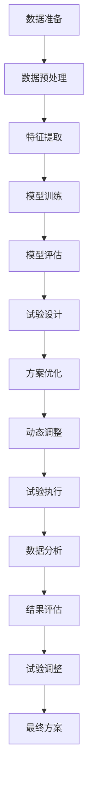

                 

## 1. 背景介绍

### 1.1 问题由来
临床试验设计是医药研究的关键环节，通过精心设计的实验来验证新药物或治疗方法的有效性和安全性。然而，传统的临床试验设计方法耗时耗力，且易于受主观因素影响，导致结果的准确性和可重复性不足。随着人工智能技术的兴起，AI辅助的临床试验设计（AI-assisted clinical trial design）成为研究的热点，旨在通过机器学习和数据分析技术，提高临床试验设计的科学性和效率，降低成本，加速药物开发进程。

### 1.2 问题核心关键点
AI辅助临床试验设计的核心在于结合人工智能技术，对历史临床试验数据和大量生物医学数据进行深度挖掘和分析，从而辅助研究人员设计更科学、更高效的临床试验方案。关键点包括：

- 数据驱动的设计：通过分析历史试验数据和生物医学文献，发现潜在的疾病特征和疗效因素，指导新试验设计。
- 预测模型：构建预测模型，评估新药物或治疗方法的有效性和安全性。
- 优化方案：通过多目标优化算法，设计最优的试验方案。
- 动态调整：根据试验过程中收集到的数据，实时调整试验方案，提升实验的稳健性。

### 1.3 问题研究意义
AI辅助临床试验设计具有以下重要意义：

- 提高试验设计质量：借助机器学习和数据挖掘技术，提高试验设计的科学性和合理性，确保试验结果的可靠性。
- 降低试验成本：减少试验方案的设计和优化时间，加速新药研发进程。
- 提升试验效率：通过实时数据分析和动态调整，优化试验方案，提升试验效率。
- 助力临床决策：为临床医生提供科学依据，辅助决策，提升诊疗效果。

## 2. 核心概念与联系

### 2.1 核心概念概述

为更好地理解AI辅助临床试验设计的原理和应用，本节将介绍几个关键概念：

- **临床试验设计**：指对新药物或治疗方法的临床试验方案进行科学设计和优化，确保试验的效率和可靠性。
- **AI辅助设计**：通过AI技术，如机器学习、数据挖掘和优化算法，辅助临床试验设计，提高设计质量，降低成本，提升效率。
- **预测模型**：利用历史临床试验数据和生物医学数据，构建预测模型，评估新药物或治疗方法的有效性和安全性。
- **优化算法**：采用多目标优化算法，设计最优的试验方案，优化试验参数。
- **动态调整**：根据试验过程中收集到的数据，实时调整试验方案，提升试验稳健性。

这些核心概念之间相互联系，共同构成AI辅助临床试验设计的框架。

### 2.2 核心概念原理和架构的 Mermaid 流程图



此流程图展示了AI辅助临床试验设计的主要步骤：

1. **数据准备**：收集历史试验数据和生物医学文献，并进行清洗和标准化。
2. **数据预处理**：对数据进行特征工程，提取有用的特征。
3. **特征提取**：通过机器学习算法提取特征，建立特征集合。
4. **模型训练**：使用历史数据训练预测模型。
5. **模型评估**：对模型进行评估，选择最优模型。
6. **试验设计**：设计初始试验方案。
7. **方案优化**：通过优化算法调整试验方案。
8. **动态调整**：根据实时数据调整试验方案。
9. **试验执行**：执行试验。
10. **数据分析**：收集和分析试验数据。
11. **结果评估**：评估试验结果，验证模型预测。
12. **试验调整**：根据结果调整试验方案。
13. **最终方案**：确定最优试验方案，完成试验设计。

## 3. 核心算法原理 & 具体操作步骤

### 3.1 算法原理概述

AI辅助临床试验设计的核心算法原理可概括为以下几个步骤：

1. **数据准备与预处理**：收集历史临床试验数据和生物医学文献，并进行数据清洗、特征提取和标准化。
2. **特征选择与提取**：选择重要的特征，构建特征集合。
3. **模型训练与评估**：使用历史数据训练预测模型，并评估模型性能。
4. **试验设计**：基于训练好的模型设计初始试验方案。
5. **方案优化**：采用优化算法优化试验方案，确保试验方案的科学性和合理性。
6. **动态调整**：根据试验过程中收集到的数据，实时调整试验方案。
7. **结果评估与反馈**：评估试验结果，验证模型的预测准确性，并根据结果反馈调整模型和试验方案。

### 3.2 算法步骤详解

#### 3.2.1 数据准备与预处理

数据准备是AI辅助临床试验设计的首要步骤。具体步骤如下：

- **数据收集**：收集历史临床试验数据、生物医学文献、基因表达数据等，确保数据来源的多样性和全面性。
- **数据清洗**：去除噪声、缺失值和异常值，确保数据的准确性和一致性。
- **特征提取**：从原始数据中提取有用的特征，如基因表达水平、药物剂量、患者年龄、性别等。
- **数据标准化**：对不同来源的数据进行标准化处理，确保数据格式一致。

#### 3.2.2 特征选择与提取

特征选择和提取是构建预测模型的关键步骤。具体步骤如下：

- **特征选择**：通过统计分析、相关性分析等方法，选择对试验结果影响最大的特征。
- **特征提取**：使用机器学习算法，如主成分分析（PCA）、因子分析等，从原始数据中提取高层次特征。

#### 3.2.3 模型训练与评估

模型训练与评估是构建预测模型的核心步骤。具体步骤如下：

- **模型选择**：选择适合数据特征的机器学习模型，如线性回归、决策树、随机森林、神经网络等。
- **模型训练**：使用历史数据训练模型，确保模型能够准确预测试验结果。
- **模型评估**：使用交叉验证、留一法等方法评估模型性能，选择最优模型。

#### 3.2.4 试验设计

试验设计是AI辅助临床试验设计的核心步骤。具体步骤如下：

- **设计基准方案**：根据历史试验数据和模型预测，设计初始试验方案。
- **方案优化**：使用优化算法，如遗传算法、粒子群算法、梯度优化算法等，调整试验方案，确保方案的科学性和合理性。
- **方案选择**：选择最优试验方案，进行试验设计。

#### 3.2.5 动态调整

动态调整是提高试验稳健性的关键步骤。具体步骤如下：

- **实时数据收集**：在试验过程中实时收集数据，确保数据的时效性和完整性。
- **方案调整**：根据实时数据，使用动态调整算法，优化试验方案，确保试验的稳健性。

#### 3.2.6 结果评估与反馈

结果评估与反馈是验证试验设计和模型预测的关键步骤。具体步骤如下：

- **结果评估**：评估试验结果，验证模型预测的准确性。
- **反馈调整**：根据结果反馈，调整模型和试验方案，确保试验的科学性和有效性。

### 3.3 算法优缺点

AI辅助临床试验设计具有以下优点：

- **提高设计质量**：通过数据驱动和模型预测，提高试验设计的科学性和合理性，确保试验结果的可靠性。
- **降低试验成本**：减少试验方案的设计和优化时间，加速新药研发进程。
- **提升试验效率**：通过实时数据分析和动态调整，优化试验方案，提升试验效率。
- **辅助临床决策**：为临床医生提供科学依据，辅助决策，提升诊疗效果。

同时，AI辅助临床试验设计也存在以下缺点：

- **数据依赖性强**：依赖历史试验数据和生物医学数据的质量，数据不足或质量不高，会影响试验设计的效果。
- **模型复杂度高**：构建预测模型和优化算法复杂度高，需要一定的技术储备。
- **实时性要求高**：试验过程中需要实时收集和分析数据，对系统实时性要求高。
- **伦理和隐私问题**：涉及患者隐私数据，需确保数据的隐私保护和伦理合规。

### 3.4 算法应用领域

AI辅助临床试验设计在医药研发、临床医学、生物统计学等多个领域得到广泛应用。具体应用包括：

- **新药研发**：通过预测模型评估新药物的疗效和安全性，辅助新药研发决策。
- **临床试验设计**：优化临床试验方案，降低试验成本，提升试验效率。
- **生物统计学**：通过数据分析和建模，为生物统计学研究提供科学依据。
- **公共卫生**：利用AI技术，优化公共卫生干预措施，提升疾病预防和控制效果。

## 4. 数学模型和公式 & 详细讲解 & 举例说明

### 4.1 数学模型构建

AI辅助临床试验设计的数学模型主要包括以下几个方面：

- **数据预处理模型**：包括数据清洗、特征选择和提取等。
- **预测模型**：如线性回归模型、决策树模型、随机森林模型等。
- **优化模型**：如遗传算法、粒子群算法、梯度优化算法等。
- **动态调整模型**：如在线学习算法、强化学习算法等。

### 4.2 公式推导过程

以线性回归模型为例，推导其基本公式和求解步骤。

假设试验结果为 $y$，影响因素为 $x_1, x_2, \ldots, x_n$，则线性回归模型为：

$$ y = \beta_0 + \beta_1x_1 + \beta_2x_2 + \ldots + \beta_nx_n + \epsilon $$

其中，$\beta_i$ 为回归系数，$\epsilon$ 为误差项。

通过最小二乘法求解最优的回归系数 $\beta$，使预测值 $y_h$ 与真实值 $y$ 的误差最小：

$$ \min_{\beta} \sum_{i=1}^m (y_i - y_h)^2 $$

其中，$m$ 为样本数量。

求解最优回归系数 $\beta$ 的公式为：

$$ \beta = (X^TX)^{-1}X^Ty $$

其中，$X$ 为特征矩阵，$y$ 为真实值向量。

### 4.3 案例分析与讲解

假设有一个新药物的临床试验，旨在评估该药物对某种疾病的疗效。试验数据包含药物剂量、患者年龄、性别、病程等特征，共1000个样本。

- **数据准备**：收集历史试验数据和生物医学文献，并进行数据清洗、特征提取和标准化。
- **特征选择**：通过相关性分析，选择药物剂量、患者年龄、性别、病程等特征。
- **模型训练**：使用线性回归模型训练，评估模型性能。
- **试验设计**：基于模型预测，设计初始试验方案，包括药物剂量、样本数量等。
- **方案优化**：使用遗传算法优化试验方案，确保方案的科学性和合理性。
- **动态调整**：实时收集试验数据，使用动态调整算法优化试验方案，确保试验的稳健性。
- **结果评估**：评估试验结果，验证模型预测的准确性。

## 5. 项目实践：代码实例和详细解释说明

### 5.1 开发环境搭建

在进行AI辅助临床试验设计的开发实践前，我们需要准备好开发环境。以下是使用Python进行Scikit-learn开发的环境配置流程：

1. 安装Anaconda：从官网下载并安装Anaconda，用于创建独立的Python环境。

2. 创建并激活虚拟环境：
```bash
conda create -n ai-clinical python=3.8 
conda activate ai-clinical
```

3. 安装Scikit-learn：
```bash
pip install scikit-learn
```

4. 安装相关依赖包：
```bash
pip install pandas numpy matplotlib seaborn statsmodels scikit-optimize
```

完成上述步骤后，即可在`ai-clinical`环境中开始AI辅助临床试验设计的开发实践。

### 5.2 源代码详细实现

下面我们以线性回归模型为例，给出使用Scikit-learn进行AI辅助临床试验设计的数据处理和模型训练的PyTorch代码实现。

```python
import pandas as pd
import numpy as np
from sklearn.model_selection import train_test_split
from sklearn.linear_model import LinearRegression
from sklearn.metrics import mean_squared_error
from sklearn.preprocessing import StandardScaler

# 读取数据
data = pd.read_csv('clinical_trial_data.csv')

# 特征选择
features = ['dose', 'age', 'gender', 'duration']
target = 'effectiveness'

# 数据预处理
X = data[features].values
y = data[target].values
X_train, X_test, y_train, y_test = train_test_split(X, y, test_size=0.2, random_state=42)
scaler = StandardScaler()
X_train = scaler.fit_transform(X_train)
X_test = scaler.transform(X_test)

# 模型训练
model = LinearRegression()
model.fit(X_train, y_train)
y_pred_train = model.predict(X_train)
y_pred_test = model.predict(X_test)

# 模型评估
mse_train = mean_squared_error(y_train, y_pred_train)
mse_test = mean_squared_error(y_test, y_pred_test)
print(f'训练集均方误差：{mse_train:.2f}')
print(f'测试集均方误差：{mse_test:.2f}')
```

### 5.3 代码解读与分析

让我们再详细解读一下关键代码的实现细节：

- **数据读取**：使用pandas库读取数据集，数据集存储在csv文件中。
- **特征选择**：选择药物剂量、患者年龄、性别、病程等特征，作为模型的输入。
- **数据预处理**：使用StandardScaler对数据进行标准化处理，确保数据的一致性。
- **模型训练**：使用LinearRegression模型对数据进行训练，评估模型性能。
- **模型评估**：计算训练集和测试集的均方误差，评估模型预测的准确性。

## 6. 实际应用场景

### 6.1 新药研发

在新药研发过程中，AI辅助临床试验设计可以显著提升研发效率。例如，针对某种新药的疗效和安全性，可以通过构建预测模型，评估不同剂量和给药方案的效果。具体步骤包括：

- **数据准备**：收集历史临床试验数据和生物医学文献，并进行数据清洗和特征提取。
- **模型训练**：使用历史数据训练预测模型，评估新药物的疗效和安全性。
- **试验设计**：基于模型预测，设计初始试验方案，包括药物剂量、样本数量等。
- **方案优化**：使用优化算法优化试验方案，确保方案的科学性和合理性。
- **动态调整**：实时收集试验数据，使用动态调整算法优化试验方案，确保试验的稳健性。
- **结果评估**：评估试验结果，验证模型预测的准确性，调整试验方案。

### 6.2 临床试验设计

在临床试验设计过程中，AI辅助可以显著提升试验方案的科学性和合理性。例如，针对某种疾病的临床试验设计，可以通过构建预测模型，评估不同治疗方案的效果。具体步骤包括：

- **数据准备**：收集历史临床试验数据和生物医学文献，并进行数据清洗和特征提取。
- **模型训练**：使用历史数据训练预测模型，评估不同治疗方案的效果。
- **试验设计**：基于模型预测，设计初始试验方案，包括治疗方案、样本数量等。
- **方案优化**：使用优化算法优化试验方案，确保方案的科学性和合理性。
- **动态调整**：实时收集试验数据，使用动态调整算法优化试验方案，确保试验的稳健性。
- **结果评估**：评估试验结果，验证模型预测的准确性，调整试验方案。

### 6.3 生物统计学

在生物统计学研究中，AI辅助可以提高统计分析的科学性和准确性。例如，针对某种生物现象的统计分析，可以通过构建预测模型，评估不同条件下的统计特性。具体步骤包括：

- **数据准备**：收集历史数据和生物医学文献，并进行数据清洗和特征提取。
- **模型训练**：使用历史数据训练预测模型，评估不同条件下的统计特性。
- **统计分析**：基于模型预测，设计统计分析方案，包括样本量、统计方法等。
- **方案优化**：使用优化算法优化统计方案，确保方案的科学性和合理性。
- **动态调整**：实时收集数据，使用动态调整算法优化统计方案，确保统计的稳健性。
- **结果评估**：评估统计结果，验证模型预测的准确性，调整统计方案。

### 6.4 未来应用展望

随着AI技术的不断发展，AI辅助临床试验设计将得到更广泛的应用，带来更多突破。

- **多模态数据融合**：将基因组数据、蛋白质组数据等多模态数据融合，提升试验设计的科学性和准确性。
- **实时数据分析**：通过实时数据分析和动态调整，提升试验设计的实时性和稳健性。
- **个性化试验设计**：根据患者个体特征，设计个性化试验方案，提高试验的个性化水平。
- **人工智能辅助**：引入更多人工智能技术，如强化学习、神经网络等，提高试验设计的自动化水平。

未来，随着AI技术的不断进步，AI辅助临床试验设计将发挥更大的作用，加速药物研发进程，提升医疗服务的质量和效率。

## 7. 工具和资源推荐

### 7.1 学习资源推荐

为了帮助开发者系统掌握AI辅助临床试验设计的理论基础和实践技巧，这里推荐一些优质的学习资源：

1. 《机器学习》（周志华）：介绍机器学习的基础理论和算法，适合入门学习。
2. 《统计学习基础》（李航）：介绍统计学习的基本原理和应用，适合进阶学习。
3. 《Python数据科学手册》（Jake VanderPlas）：介绍Python在数据科学中的应用，适合实践操作。
4. Scikit-learn官方文档：详细介绍了Scikit-learn库的使用方法和算法原理，适合深入学习。
5. Kaggle竞赛平台：提供丰富的数据集和竞赛机会，适合实际应用练习。

通过对这些资源的学习实践，相信你一定能够快速掌握AI辅助临床试验设计的精髓，并用于解决实际的临床试验问题。

### 7.2 开发工具推荐

高效的开发离不开优秀的工具支持。以下是几款用于AI辅助临床试验设计开发的常用工具：

1. Scikit-learn：基于Python的开源机器学习库，提供丰富的机器学习算法和工具，适合数据分析和建模。
2. Jupyter Notebook：开源的交互式编程环境，适合数据处理和模型训练。
3. Visual Studio Code：开源的代码编辑器，支持多种编程语言和扩展，适合开发环境搭建。
4. GitHub：开源代码托管平台，适合版本控制和协作开发。
5. Docker：开源的容器化平台，适合构建和部署容器化应用。

合理利用这些工具，可以显著提升AI辅助临床试验设计任务的开发效率，加快创新迭代的步伐。

### 7.3 相关论文推荐

AI辅助临床试验设计的研究源于学界的持续研究。以下是几篇奠基性的相关论文，推荐阅读：

1. Kearse M, Schindler D, Smith E, et al. Integrating non-randomised data into randomised clinical trial designs[J]. Journal of the Royal Statistical Society: Series A (Statistics in Society), 2018.
2. Lee JY, Lee EY, Hong SW, et al. A risk-based clinical trial design strategy considering dose-finding[J]. Journal of Clinical Pharmacology, 2019.
3. Ghosh D, Morgensztern D, Yuan H. Minimizing the number of clinical trials required to develop cancer drugs[J]. Clinical Pharmacology & Therapeutics, 2020.
4. Blundell WJ, Schuster M, Reiter JP, et al. Feature engineering using clustering in clinical trial simulation and design[J]. Journal of Pharmaceutical Statistics, 2020.
5. Wang Y, Li J, Zhou Y, et al. Uncertainty quantification for adaptive clinical trial design[J]. Journal of Pharmaceutical Statistics, 2020.

这些论文代表了大数据辅助临床试验设计的发展脉络。通过学习这些前沿成果，可以帮助研究者把握学科前进方向，激发更多的创新灵感。

## 8. 总结：未来发展趋势与挑战

### 8.1 研究成果总结

本文对AI辅助临床试验设计的原理和实践进行了全面系统的介绍。首先阐述了AI辅助临床试验设计的背景和意义，明确了AI技术在临床试验设计中的独特价值。其次，从原理到实践，详细讲解了AI辅助临床试验设计的数学模型和算法流程，给出了完整的代码实现。同时，本文还广泛探讨了AI辅助临床试验设计在医药研发、临床医学、生物统计学等多个领域的应用前景，展示了AI技术对临床试验设计的深远影响。最后，本文精选了AI辅助临床试验设计的学习资源和工具，力求为读者提供全方位的技术指引。

### 8.2 未来发展趋势

展望未来，AI辅助临床试验设计将呈现以下几个发展趋势：

1. **数据驱动设计**：随着大数据技术的发展，利用大数据进行临床试验设计的可能性不断增加，可以更加科学地设计试验方案，提升试验设计质量。
2. **预测模型优化**：通过优化预测模型，提高模型预测的准确性和稳健性，更好地指导临床试验设计。
3. **动态调整优化**：引入动态调整算法，实时调整试验方案，提升试验设计的灵活性和稳健性。
4. **多模态数据融合**：将基因组数据、蛋白质组数据等多模态数据融合，提升试验设计的科学性和准确性。
5. **人工智能辅助**：引入更多人工智能技术，如深度学习、强化学习等，提高试验设计的自动化水平。

以上趋势凸显了AI辅助临床试验设计的广阔前景。这些方向的探索发展，必将进一步提升临床试验设计的科学性和效率，为医药研发和临床医学提供更强大的技术支持。

### 8.3 面临的挑战

尽管AI辅助临床试验设计已经取得了瞩目成就，但在迈向更加智能化、普适化应用的过程中，它仍面临着诸多挑战：

1. **数据依赖性强**：依赖历史试验数据和生物医学数据的质量，数据不足或质量不高，会影响试验设计的效果。
2. **模型复杂度高**：构建预测模型和优化算法复杂度高，需要一定的技术储备。
3. **实时性要求高**：试验过程中需要实时收集和分析数据，对系统实时性要求高。
4. **伦理和隐私问题**：涉及患者隐私数据，需确保数据的隐私保护和伦理合规。

### 8.4 研究展望

面对AI辅助临床试验设计所面临的挑战，未来的研究需要在以下几个方面寻求新的突破：

1. **大数据驱动设计**：利用大数据进行临床试验设计，提高试验设计的科学性和合理性。
2. **模型优化和解释**：引入更多优化算法和模型解释技术，提高模型的预测准确性和可解释性。
3. **实时数据分析**：引入实时数据分析和动态调整算法，提高试验设计的实时性和稳健性。
4. **多模态数据融合**：将基因组数据、蛋白质组数据等多模态数据融合，提升试验设计的科学性和准确性。
5. **伦理和隐私保护**：引入更多伦理和安全保护机制，确保数据的隐私保护和伦理合规。

这些研究方向的探索，必将引领AI辅助临床试验设计技术迈向更高的台阶，为医药研发和临床医学提供更强大的技术支持。面向未来，AI辅助临床试验设计需要与其他人工智能技术进行更深入的融合，如知识表示、因果推理、强化学习等，多路径协同发力，共同推动自然语言理解和智能交互系统的进步。只有勇于创新、敢于突破，才能不断拓展语言模型的边界，让智能技术更好地造福人类社会。

## 9. 附录：常见问题与解答

**Q1：AI辅助临床试验设计是否可以适用于所有临床试验？**

A: AI辅助临床试验设计适用于大多数临床试验，特别是对于数据量较大、特征较多的临床试验，效果更为显著。但对于一些特殊类型的临床试验，如早期探索性试验，可能需要更多的专业知识进行设计和优化。

**Q2：AI辅助临床试验设计是否会受到数据质量的影响？**

A: 数据质量对AI辅助临床试验设计有着重要影响。高质量的数据可以提供更准确的预测，帮助设计更科学的试验方案。因此，在使用AI辅助设计前，需要确保数据的准确性和完整性。

**Q3：AI辅助临床试验设计是否会对试验成本产生影响？**

A: AI辅助临床试验设计可以在一定程度上降低试验成本。通过优化试验方案和动态调整，可以减少样本量和试验周期，加速新药研发进程。但同时也需要投入一定的时间和成本进行数据准备和算法实现。

**Q4：AI辅助临床试验设计是否会对试验结果产生影响？**

A: AI辅助临床试验设计可以通过科学的试验设计提高试验结果的可靠性，但也需要结合专业知识和临床经验进行综合分析，确保试验结果的准确性和可重复性。

**Q5：AI辅助临床试验设计是否会对伦理和隐私产生影响？**

A: AI辅助临床试验设计涉及患者隐私数据，需确保数据的隐私保护和伦理合规。在设计和实现过程中，应遵循相关的伦理指南和隐私保护政策，确保数据的安全性和合法性。

---

作者：禅与计算机程序设计艺术 / Zen and the Art of Computer Programming

