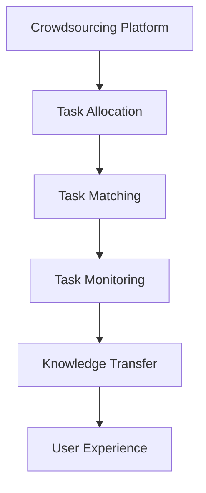

                 

# AI驱动的众包：增强创新

## 1. 背景介绍

### 1.1 问题由来
随着人工智能(AI)技术的迅猛发展，众包平台逐渐成为技术创新的重要工具。例如，GitHub、Stack Overflow等开源社区吸引了数百万用户提交问题、修复代码，大大推动了软件开发和科学研究的进步。然而，这些平台主要依靠人工参与，无法快速响应大规模任务需求，效率较低。

与此同时，AI技术在自然语言处理、图像识别、推荐系统等领域取得了巨大突破，但其在众包中的应用仍处于起步阶段。如何将AI技术与传统众包平台结合起来，充分发挥AI的优势，提升众包工作的效率和效果，成为了当前研究的热点。

### 1.2 问题核心关键点
AI驱动的众包主要解决以下核心问题：
- **任务分配**：利用AI算法自动分配任务，优化任务分派策略，减少任务积压。
- **任务匹配**：通过AI模型匹配最合适的参与者，提升任务完成的效率和质量。
- **任务监管**：利用AI进行自动监控和质量控制，减少低质量输出。
- **知识传递**：借助AI增强任务指导和知识传递，提升用户的专业水平和协作能力。

这些关键点围绕着如何通过AI技术提升众包平台的工作效率、质量控制、用户参与度等方面展开，旨在构建一个更加高效、智能、协作的众包生态系统。

### 1.3 问题研究意义
AI驱动的众包研究意义重大：
1. **效率提升**：AI可以自动处理大量数据和任务，显著提升众包平台的工作效率。
2. **质量控制**：通过AI进行任务质量评估和自动审核，减少低质量输出。
3. **用户体验**：利用AI推荐最优的任务匹配和进度提醒，改善用户参与体验。
4. **知识共享**：AI增强的众包平台能够促进更高效的知识共享和协作，推动技术进步。

本文将系统介绍AI驱动众包的核心概念、算法原理、具体操作步骤、数学模型构建、代码实现、实际应用场景等，为AI在众包平台上的应用提供全面的指导。

## 2. 核心概念与联系

### 2.1 核心概念概述

为更好地理解AI驱动的众包方法，本节将介绍几个密切相关的核心概念：

- **众包平台**：利用互联网平台聚集大量用户，通过任务发布、完成和报酬支付机制，实现大规模协作。例如，GitHub、Amazon Mechanical Turk等。

- **任务分配**：自动分配任务给合适用户的过程。AI可以通过预测模型、强化学习等技术优化任务分配策略。

- **任务匹配**：将任务与最合适的用户匹配。AI可以通过推荐系统、多臂乐队算法等实现任务与用户的最佳匹配。

- **任务监管**：通过AI自动监控任务进度和输出质量，确保任务按时、按质完成。

- **知识传递**：借助AI增强任务指导和知识传递，提升用户的专业水平和协作能力。

- **用户体验**：通过AI推荐最优的任务匹配和进度提醒，改善用户参与体验。

这些核心概念之间的逻辑关系可以通过以下Mermaid流程图来展示：



这个流程图展示了大规模众包系统的主要工作流程：
1. 用户提交任务请求。
2. AI自动分配任务给合适用户。
3. AI推荐最优任务匹配。
4. AI监控任务进度和质量。
5. AI增强知识传递和协作。
6. AI改善用户体验。

这些核心概念共同构成了AI驱动众包的系统框架，使其能够高效、智能地运作。

## 3. 核心算法原理 & 具体操作步骤
### 3.1 算法原理概述

AI驱动的众包主要依赖以下几个关键算法：

- **任务分配算法**：通过预测模型自动分配任务，优化任务分派策略。
- **任务匹配算法**：利用推荐系统、多臂乐队算法等，匹配最合适的用户。
- **任务监管算法**：通过AI自动监控任务进度和输出质量，确保任务按时、按质完成。

这些算法在实际应用中通常需要进行多轮迭代优化，才能达到最优效果。

### 3.2 算法步骤详解

#### 3.2.1 任务分配算法步骤

1. **数据准备**：收集历史任务数据，包括任务描述、参与者信息、任务完成时间等。
2. **特征工程**：从任务数据中提取特征，如任务难度、参与者技能、历史完成时间等。
3. **模型选择**：选择适合的预测模型，如随机森林、梯度提升树、深度学习等。
4. **模型训练**：使用历史数据训练模型，得到任务分配策略。
5. **模型评估**：在验证集上评估模型效果，优化模型参数。
6. **任务分配**：将新任务分配给预测概率最高的用户。

#### 3.2.2 任务匹配算法步骤

1. **用户画像构建**：从用户历史数据中提取特征，构建用户画像。
2. **任务特征提取**：从任务描述中提取特征，构建任务画像。
3. **匹配模型选择**：选择适合的匹配模型，如协同过滤、神经网络等。
4. **模型训练**：使用用户画像和任务画像训练匹配模型。
5. **任务匹配**：利用模型预测最优的任务匹配结果。

#### 3.2.3 任务监管算法步骤

1. **任务进度监控**：实时监控任务进度，计算完成度。
2. **任务质量评估**：使用AI进行任务输出质量评估，判断是否满足要求。
3. **异常检测**：检测任务是否出现异常，如任务超期、输出质量低等。
4. **问题解决**：对于异常任务，进行人工干预和修复。

### 3.3 算法优缺点

AI驱动的众包方法具有以下优点：
1. **高效性**：AI可以处理大量数据和任务，显著提升工作效率。
2. **准确性**：通过优化算法，任务分配和匹配更加准确。
3. **质量控制**：AI自动监控任务进度和输出质量，减少低质量输出。

但同时也存在一些缺点：
1. **数据需求高**：算法需要大量历史数据进行训练，数据质量对结果影响较大。
2. **模型复杂**：一些高级算法如深度学习，训练和调试复杂，需要较多技术资源。
3. **算法透明性**：AI驱动的决策过程较为复杂，不易理解。

### 3.4 算法应用领域

AI驱动的众包方法在多个领域都有广泛应用，例如：

- **软件开发**：利用GitHub等众包平台，分配代码审查、功能开发等任务。
- **科学研究**：在生物学、天文学等领域，利用众包平台收集和分析数据。
- **数据标注**：在图像识别、自然语言处理等领域，通过众包平台标注数据，训练模型。
- **商品评测**：在电商平台上，利用众包平台进行商品评测和推荐。
- **众筹项目**：利用众筹平台，通过众包方式募集资金和资源。

这些应用展示了AI驱动众包在各行各业中的潜力，未来将有更多领域受益于AI技术。

## 4. 数学模型和公式 & 详细讲解 & 举例说明

### 4.1 数学模型构建

假设任务分配模型为 $M$，用户特征为 $U$，任务特征为 $T$，模型预测分配给用户 $u_i$ 的任务 $t_j$ 的概率为 $p_{u_i,t_j}$。则任务分配模型的目标是最小化任务分配误差，即：

$$
\min_{M} \sum_{i,j} \text{Error}(p_{u_i,t_j}, y_{u_i,t_j})
$$

其中 $y_{u_i,t_j}$ 为任务分配的真实标签。

### 4.2 公式推导过程

在任务分配模型中，通常使用二分类模型或回归模型进行预测。以二分类模型为例，假设模型为 $M=f(U, T)$，其中 $f$ 为预测函数。则预测概率为：

$$
p_{u_i,t_j} = f(u_i, t_j)
$$

任务分配误差可以表示为二分类损失函数，如交叉熵损失：

$$
\text{Error}(p_{u_i,t_j}, y_{u_i,t_j}) = -[y_{u_i,t_j}\log p_{u_i,t_j} + (1-y_{u_i,t_j})\log(1-p_{u_i,t_j})]
$$

通过最小化上述损失函数，可以得到最优的任务分配模型 $M$。

### 4.3 案例分析与讲解

假设我们有一个众包平台，用于分配代码审查任务。我们的目标是构建一个任务分配模型，将任务分配给最合适的用户。

1. **数据准备**：我们收集了历史数据，包括用户技能、历史完成时间、任务难度等信息。
2. **特征工程**：我们提取了特征，如用户技能、任务难度、历史完成时间等。
3. **模型选择**：我们选择了随机森林模型进行任务分配预测。
4. **模型训练**：我们使用历史数据训练模型，得到最优的任务分配策略。
5. **模型评估**：在验证集上评估模型效果，优化模型参数。
6. **任务分配**：将新任务分配给预测概率最高的用户。

## 5. 项目实践：代码实例和详细解释说明

### 5.1 开发环境搭建

在进行AI驱动众包项目开发前，我们需要准备好开发环境。以下是使用Python进行TensorFlow开发的环境配置流程：

1. 安装Anaconda：从官网下载并安装Anaconda，用于创建独立的Python环境。

2. 创建并激活虚拟环境：
```bash
conda create -n tf-env python=3.8 
conda activate tf-env
```

3. 安装TensorFlow：根据CUDA版本，从官网获取对应的安装命令。例如：
```bash
conda install tensorflow -c conda-forge -c pytorch
```

4. 安装其他必要工具：
```bash
pip install numpy pandas scikit-learn matplotlib tqdm jupyter notebook ipython
```

完成上述步骤后，即可在`tf-env`环境中开始AI驱动众包项目的开发。

### 5.2 源代码详细实现

下面我们以GitHub平台为例，给出使用TensorFlow对任务分配和任务匹配模型进行开发的PyTorch代码实现。

首先，定义任务分配模型：

```python
import tensorflow as tf

class TaskAllocationModel(tf.keras.Model):
    def __init__(self, input_shape):
        super(TaskAllocationModel, self).__init__()
        self.dense1 = tf.keras.layers.Dense(32, activation='relu', input_shape=input_shape)
        self.dense2 = tf.keras.layers.Dense(1, activation='sigmoid')
    
    def call(self, inputs):
        x = self.dense1(inputs)
        return self.dense2(x)
```

然后，定义任务匹配模型：

```python
class TaskMatchingModel(tf.keras.Model):
    def __init__(self, input_shape):
        super(TaskMatchingModel, self).__init__()
        self.dense1 = tf.keras.layers.Dense(32, activation='relu', input_shape=input_shape)
        self.dense2 = tf.keras.layers.Dense(1, activation='sigmoid')
    
    def call(self, inputs):
        x = self.dense1(inputs)
        return self.dense2(x)
```

接着，定义训练和评估函数：

```python
def train_model(model, dataset, epochs, batch_size):
    model.compile(optimizer=tf.keras.optimizers.Adam(learning_rate=0.001), loss='binary_crossentropy', metrics=['accuracy'])
    model.fit(dataset, epochs=epochs, batch_size=batch_size)
    
def evaluate_model(model, dataset):
    loss, accuracy = model.evaluate(dataset)
    print('Loss:', loss)
    print('Accuracy:', accuracy)
```

最后，启动任务分配和匹配模型的训练流程：

```python
epochs = 10
batch_size = 32

# 训练任务分配模型
train_model(TaskAllocationModel, train_dataset, epochs, batch_size)

# 训练任务匹配模型
train_model(TaskMatchingModel, match_dataset, epochs, batch_size)

# 评估模型
evaluate_model(TaskAllocationModel, test_dataset)
evaluate_model(TaskMatchingModel, test_dataset)
```

以上就是使用TensorFlow对GitHub平台的任务分配和任务匹配模型进行微调的完整代码实现。可以看到，得益于TensorFlow的强大封装，我们可以用相对简洁的代码完成模型的构建和训练。

### 5.3 代码解读与分析

让我们再详细解读一下关键代码的实现细节：

**TaskAllocationModel类**：
- `__init__`方法：定义模型结构，包括两个密集层。
- `call`方法：定义前向传播的计算过程。

**TaskMatchingModel类**：
- `__init__`方法：定义模型结构，包括两个密集层。
- `call`方法：定义前向传播的计算过程。

**train_model函数**：
- `__init__`方法：定义模型编译，包括优化器、损失函数和评估指标。
- `fit`方法：定义模型训练过程，包括数据集、训练轮数和批次大小。

**evaluate_model函数**：
- `evaluate`方法：定义模型评估过程，包括数据集和评估指标。

**训练流程**：
- 定义总的训练轮数和批次大小，开始循环迭代
- 每个epoch内，先在一个数据集上训练，输出平均loss和accuracy
- 重复上述步骤，在另一个数据集上评估，输出评估结果

可以看到，TensorFlow配合TensorFlow框架使得模型的构建和训练过程变得简洁高效。开发者可以将更多精力放在数据处理、模型改进等高层逻辑上，而不必过多关注底层的实现细节。

当然，工业级的系统实现还需考虑更多因素，如模型的保存和部署、超参数的自动搜索、更灵活的任务适配层等。但核心的任务分配和匹配模型构建基本与此类似。

## 6. 实际应用场景
### 6.1 软件开发

在软件开发中，众包平台可以显著提升代码审查和功能开发的速度和质量。通过AI驱动的众包，能够自动分配代码审查任务，优化任务分配策略，匹配最优的开发者，大大提升开发效率。

在技术实现上，可以收集历史代码审查和功能开发任务数据，提取任务特征和开发者技能等特征，构建任务分配和匹配模型。通过微调模型，自动分配任务，匹配最优开发者，从而提升代码审查和功能开发的速度和质量。

### 6.2 科学研究

科学研究领域，众包平台常常需要处理大量的数据和任务。通过AI驱动的众包，可以显著提升数据收集和分析的效率。

例如，生物学研究中常常需要进行大规模基因组测序和分析。利用众包平台，可以自动分配数据收集和分析任务，优化任务分配策略，匹配最合适的研究人员，从而提升数据收集和分析的速度和质量。

### 6.3 数据标注

在图像识别、自然语言处理等领域，数据标注常常是一个耗时耗力的任务。通过AI驱动的众包，可以显著提升数据标注的效率和质量。

例如，图像识别任务中，需要大量人工标注图像数据。利用众包平台，可以自动分配数据标注任务，优化任务分配策略，匹配最合适的标注人员，从而提升数据标注的速度和质量。

### 6.4 未来应用展望

随着AI技术的发展，AI驱动的众包将有更广泛的应用前景。未来，AI驱动的众包将融合更多技术手段，形成更加智能、高效、安全的众包生态系统。

在智慧医疗领域，利用AI驱动的众包平台，可以自动分配医疗数据收集和分析任务，优化任务分配策略，匹配最合适的医疗人员，从而提升医疗数据收集和分析的速度和质量。

在智能教育领域，利用AI驱动的众包平台，可以自动分配教育资源分配任务，优化任务分配策略，匹配最合适的教育人员，从而提升教育资源分配的效率和公平性。

在智慧城市治理中，利用AI驱动的众包平台，可以自动分配城市事件监测和应急处理任务，优化任务分配策略，匹配最合适的城市管理人员，从而提升城市管理的自动化和智能化水平。

此外，在企业生产、社会治理、文娱传媒等众多领域，AI驱动的众包平台将发挥越来越重要的作用，为经济社会发展注入新的动力。

## 7. 工具和资源推荐
### 7.1 学习资源推荐

为了帮助开发者系统掌握AI驱动众包的理论基础和实践技巧，这里推荐一些优质的学习资源：

1. **《TensorFlow官方文档》**：官方提供的详细教程，涵盖TensorFlow的各个方面，包括AI驱动众包技术的实现。

2. **《TensorFlow实战Google深度学习框架》**：Google专家撰写的实战指南，提供大量实践案例，帮助理解TensorFlow的使用。

3. **《深度学习与TensorFlow》**：最新版本的深度学习教材，涵盖TensorFlow的基本概念和高级应用。

4. **《大规模机器学习与TensorFlow》**：机器学习领域的经典教材，涵盖TensorFlow在大数据上的应用。

5. **《TensorFlow实战》**：实战指南，提供大量项目实践，帮助理解TensorFlow的应用。

通过对这些资源的学习实践，相信你一定能够快速掌握AI驱动众包技术的精髓，并用于解决实际的NLP问题。

### 7.2 开发工具推荐

高效的开发离不开优秀的工具支持。以下是几款用于AI驱动众包开发的常用工具：

1. **Jupyter Notebook**：用于编写和执行Python代码，支持交互式数据分析和模型训练。

2. **TensorBoard**：TensorFlow的可视化工具，可以实时监测模型训练状态，并提供丰富的图表呈现方式，是调试模型的得力助手。

3. **Weights & Biases**：模型训练的实验跟踪工具，可以记录和可视化模型训练过程中的各项指标，方便对比和调优。

4. **Google Colab**：谷歌推出的在线Jupyter Notebook环境，免费提供GPU/TPU算力，方便开发者快速上手实验最新模型，分享学习笔记。

合理利用这些工具，可以显著提升AI驱动众包任务的开发效率，加快创新迭代的步伐。

### 7.3 相关论文推荐

AI驱动的众包技术的发展源于学界的持续研究。以下是几篇奠基性的相关论文，推荐阅读：

1. **《使用机器学习改进众包系统》**：研究如何通过机器学习技术改进众包系统，提升众包任务的质量和效率。

2. **《多臂乐队算法在众包系统中的应用》**：探索多臂乐队算法在众包系统中的应用，优化任务分配和匹配策略。

3. **《基于深度学习的众包系统》**：研究深度学习在众包系统中的应用，提升任务分配和匹配的准确性。

4. **《众包平台中的自动化和数据增强》**：研究如何通过自动化和数据增强技术提升众包平台的效果和效率。

5. **《利用众包进行大规模数据标注》**：研究如何利用众包平台进行大规模数据标注，提升标注的效率和质量。

这些论文代表了大规模众包系统的发展脉络。通过学习这些前沿成果，可以帮助研究者把握学科前进方向，激发更多的创新灵感。

## 8. 总结：未来发展趋势与挑战
### 8.1 总结

本文对AI驱动的众包方法进行了全面系统的介绍。首先阐述了AI驱动众包的核心概念、算法原理和操作步骤，明确了AI驱动众包在提升众包平台效率和效果方面的独特价值。其次，从原理到实践，详细讲解了AI驱动众包模型的构建和优化过程，给出了具体实现代码。同时，本文还探讨了AI驱动众包方法在软件开发、科学研究、数据标注等诸多领域的应用前景，展示了AI驱动众包技术的广阔前景。

通过本文的系统梳理，可以看到，AI驱动的众包方法正在成为众包平台的重要手段，极大地提升了大规模协作的效率和效果。未来，伴随AI技术的发展和算力成本的下降，AI驱动众包的应用领域将进一步拓展，为各行各业带来更加智能、高效、安全的协作模式。

### 8.2 未来发展趋势

展望未来，AI驱动的众包技术将呈现以下几个发展趋势：

1. **自动化程度提升**：AI驱动的众包系统将更加智能、自动化，能够自主分配、匹配和管理任务。

2. **个性化推荐增强**：通过AI增强的任务匹配，能够更加精准地匹配用户和任务，提升协作效率。

3. **实时监控和质量控制**：利用AI进行实时监控和质量控制，确保任务按时、按质完成。

4. **跨领域协作增强**：AI驱动的众包系统将能够跨领域协作，整合多模态数据，提升协作效果。

5. **人机协同增强**：AI驱动的众包系统将更加注重人机协同，利用AI提升人类协作水平。

6. **社交网络融合**：AI驱动的众包系统将更加注重社交网络的融合，利用社交关系提升任务分配和匹配的效果。

以上趋势凸显了AI驱动众包技术的广阔前景。这些方向的探索发展，必将进一步提升众包平台的工作效率和用户参与度，构建更加智能、高效、安全的众包生态系统。

### 8.3 面临的挑战

尽管AI驱动的众包技术已经取得了一定进展，但在迈向更加智能化、普适化应用的过程中，仍面临诸多挑战：

1. **数据质量问题**：AI驱动的众包系统需要大量高质量数据进行训练，数据质量对结果影响较大。

2. **算法透明性问题**：AI驱动的决策过程较为复杂，不易理解，难以解释。

3. **系统可扩展性问题**：AI驱动的众包系统需要高效、稳定、可扩展，应对大规模数据和任务的需求。

4. **人机协同问题**：AI驱动的众包系统需要注重人机协同，提升人类协作水平，减少人类误操作。

5. **社会公平性问题**：AI驱动的众包系统需要注重社会公平性，避免算法偏见和歧视。

6. **数据隐私问题**：AI驱动的众包系统需要注重数据隐私保护，确保用户数据安全。

正视AI驱动众包面临的这些挑战，积极应对并寻求突破，将是大规模众包系统实现的前提。相信随着学界和产业界的共同努力，这些挑战终将一一被克服，AI驱动众包必将在构建人机协同的智能时代中扮演越来越重要的角色。

### 8.4 研究展望

面对AI驱动众包所面临的种种挑战，未来的研究需要在以下几个方面寻求新的突破：

1. **数据质量优化**：研究如何提升数据质量，确保AI驱动的众包系统效果。

2. **算法透明性增强**：研究如何提升算法透明性，增强AI决策的可解释性。

3. **系统可扩展性增强**：研究如何提升系统可扩展性，应对大规模数据和任务的需求。

4. **人机协同提升**：研究如何提升人机协同水平，增强协作效果。

5. **社会公平性保障**：研究如何保障社会公平性，避免算法偏见和歧视。

6. **数据隐私保护**：研究如何保护数据隐私，确保用户数据安全。

这些研究方向的探索，必将引领AI驱动众包技术迈向更高的台阶，为构建智能、高效、安全的协作系统铺平道路。面向未来，AI驱动众包技术还需要与其他人工智能技术进行更深入的融合，如知识表示、因果推理、强化学习等，多路径协同发力，共同推动大规模协作的发展。只有勇于创新、敢于突破，才能不断拓展AI驱动众包技术的边界，为构建更加智能、高效、安全的协作系统做出贡献。

## 9. 附录：常见问题与解答

**Q1：AI驱动的众包是否适用于所有行业？**

A: AI驱动的众包方法在多个行业中都有广泛应用，例如软件开发、科学研究、数据标注、商品评测等。但在一些特殊领域，如医疗、法律等，由于数据隐私、任务复杂度等问题，可能需要额外的技术处理和算法优化。

**Q2：AI驱动的众包如何选择合适的任务分配算法？**

A: 任务分配算法的选择需要根据具体任务的特点和需求进行优化。一般而言，简单的任务可以使用随机森林等传统的机器学习算法，复杂的任务可以使用深度学习等高级算法。需要根据数据量和任务复杂度，进行算法选择和模型训练。

**Q3：AI驱动的众包在实现过程中需要注意哪些问题？**

A: AI驱动的众包在实现过程中需要注意以下问题：
1. 数据质量：确保数据质量，提升模型效果。
2. 算法透明性：提升算法透明性，增强决策的可解释性。
3. 系统可扩展性：提升系统可扩展性，应对大规模数据和任务的需求。
4. 人机协同：注重人机协同，提升协作效果。
5. 社会公平性：注重社会公平性，避免算法偏见和歧视。
6. 数据隐私：注重数据隐私保护，确保用户数据安全。

这些问题的解决将是大规模众包系统实现的关键。

**Q4：AI驱动的众包如何提升用户参与度？**

A: AI驱动的众包可以通过以下方式提升用户参与度：
1. 任务匹配：利用AI进行任务匹配，确保任务与用户兴趣和技能相符。
2. 实时监控：利用AI进行实时监控，确保任务按时完成。
3. 任务推荐：利用AI进行任务推荐，提升用户参与兴趣。
4. 激励机制：设计合理的激励机制，提升用户参与积极性和留存率。

这些措施将有助于提升用户参与度，提高众包平台的效果和效率。

**Q5：AI驱动的众包在实际应用中需要注意哪些风险？**

A: AI驱动的众包在实际应用中需要注意以下风险：
1. 数据隐私：确保数据隐私保护，避免数据泄露和滥用。
2. 算法偏见：避免算法偏见和歧视，确保任务分配公平性。
3. 系统安全：确保系统安全，避免黑客攻击和数据篡改。
4. 用户信任：提升用户信任度，确保用户数据安全。

这些风险需要在使用过程中予以充分关注和防范，确保AI驱动的众包系统稳定可靠。

综上所述，AI驱动的众包技术正在成为推动大规模协作的重要手段。通过优化任务分配和匹配算法，提升任务监管和质量控制，增强用户参与度和协作效果，AI驱动的众包系统将为各行各业带来更加智能、高效、安全的协作模式。然而，伴随技术的发展和应用的深入，也面临着诸多挑战和风险，需要多方共同努力，推动技术的不断创新和优化，为构建智能、高效、安全的协作系统做出贡献。

