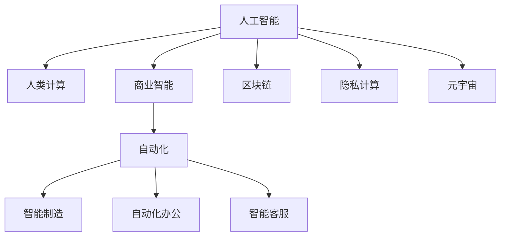

                 

# AI驱动的创新：人类计算在商业中的未来展望

> 关键词：人工智能,人类计算,商业智能,自动化,智能制造,自动化办公,智能客服,区块链,隐私计算,元宇宙

## 1. 背景介绍

### 1.1 问题由来
随着大数据、云计算、物联网等技术的不断演进，企业的数据量以指数级的速度增长，对计算能力的需求也随之水涨船高。传统的数据存储、计算和处理方式，已无法满足现代企业对数据智能利用的要求。企业希望通过AI技术赋能业务，提升决策效率和市场竞争力，驱动商业模式的创新。

AI技术，尤其是深度学习，以其强大的建模能力和泛化能力，在图像识别、自然语言处理、语音识别、推荐系统等领域取得了显著进展。这些技术不仅能提升企业运营效率，还能开辟新的商业应用场景，催生新的产业生态。但如何有效利用AI技术，为企业带来实实在在的价值，是一个亟待解决的问题。

### 1.2 问题核心关键点
1. **数据智能利用**：如何在海量数据中提取出有用信息，并应用到实际业务中，帮助企业决策和运营。
2. **AI技术的可解释性**：如何让AI模型提供决策依据，增强决策的透明度和可解释性。
3. **AI技术的泛化能力**：如何让AI模型在多样化的场景中表现良好，实现跨领域的迁移应用。
4. **AI技术的部署效率**：如何快速将AI模型部署到实际业务中，实现高效的商业落地。
5. **AI技术的经济性**：如何平衡AI技术的高成本与高回报，实现AI投资的合理性。

### 1.3 问题研究意义
深入探索AI在商业中的应用，有助于企业：

1. **提升决策效率**：利用AI技术处理海量数据，快速洞察市场变化，辅助企业制定科学决策。
2. **优化运营流程**：通过自动化和智能化技术，提高生产效率和客户服务质量。
3. **开辟新应用场景**：AI技术在各个行业的应用，如智能制造、智慧城市、智能物流等，为企业带来新的增长点。
4. **构建竞争优势**：AI技术的卓越性能和独特价值，使企业能够在激烈的市场竞争中脱颖而出。
5. **驱动模式创新**：AI技术赋能商业创新，推动企业转型升级，实现数字化、智能化发展。

## 2. 核心概念与联系

### 2.1 核心概念概述

为更好地理解AI在商业中的应用，本节将介绍几个密切相关的核心概念：

- **人工智能(Artificial Intelligence, AI)**：通过计算机系统模拟人类智能行为的科学和技术，涵盖感知、认知、决策等多个方面。
- **人类计算(Human Compute)**：通过数据计算和智能算法，辅助人类进行决策和运营。
- **商业智能(Business Intelligence, BI)**：利用数据分析和可视化技术，支持企业业务决策和运营。
- **自动化(Automaticization)**：利用AI技术自动执行重复性高、规则明确的业务流程，提升效率。
- **智能制造(Intelligent Manufacturing, IM)**：结合AI、物联网等技术，实现生产过程的智能化和自动化。
- **自动化办公(Automatic Office, AO)**：通过AI技术优化办公流程，提升办公效率和自动化程度。
- **智能客服(Intelligent Customer Service,ICS)**：利用AI技术提供高效、个性化的客户服务。
- **区块链(Blockchain)**：一种分布式账本技术，通过去中心化、透明化、安全化的方式，推动商业模式的创新。
- **隐私计算(Privacy-Enhancing Computation,PEC)**：通过加密、差分隐私等技术，保护数据隐私和安全性。
- **元宇宙(Metaverse)**：融合虚拟现实、区块链、AI等技术，构建新的数字生态。

这些核心概念之间的逻辑关系可以通过以下Mermaid流程图来展示：



这个流程图展示了大语言模型的核心概念及其之间的关系：

1. **人工智能**：是核心概念之一，涵盖从感知到决策的全面智能。
2. **人类计算**：是人工智能在商业中的应用，通过数据计算和智能算法辅助人类决策。
3. **商业智能**：是AI技术在商业决策中的应用，通过数据分析和可视化支持企业决策。
4. **自动化**：是AI在业务流程中的应用，通过自动化提升效率。
5. **智能制造**：是自动化在制造业中的应用，实现生产过程的智能化。
6. **自动化办公**：是自动化在办公中的应用，提升办公效率。
7. **智能客服**：是AI在客服中的应用，提升客户服务质量。
8. **区块链**：是AI在数据处理中的应用，通过去中心化技术保障数据安全和透明。
9. **隐私计算**：是AI在数据隐私保护中的应用，通过加密技术保护数据隐私。
10. **元宇宙**：是AI在虚拟世界中的应用，构建新的数字生态。

这些核心概念共同构成了AI技术在商业应用中的框架，使得AI技术能够更好地服务于企业的运营和决策。通过理解这些核心概念，我们可以更好地把握AI技术的工作原理和优化方向。

## 3. 核心算法原理 & 具体操作步骤
### 3.1 算法原理概述

AI在商业中的应用，主要通过以下算法原理实现：

1. **数据预处理**：通过数据清洗、特征工程等技术，将原始数据转化为可用于AI模型训练的形式。
2. **模型训练**：利用机器学习、深度学习等技术，训练出能够处理特定业务的AI模型。
3. **模型微调**：根据具体业务需求，对训练好的模型进行参数微调，提升模型在特定场景中的表现。
4. **模型集成**：通过模型组合、融合等技术，提升AI系统的整体性能。
5. **智能决策**：利用AI模型对业务数据进行分析，辅助企业进行科学决策。
6. **实时监控**：通过实时数据流处理技术，对AI系统的运行状态进行监控和调整。

### 3.2 算法步骤详解

以下是一般AI技术在商业应用中的详细步骤：

**Step 1: 数据收集与清洗**
- 收集与业务相关的数据，如销售数据、客户数据、生产数据等。
- 进行数据清洗，去除重复、缺失、异常等数据，确保数据质量。

**Step 2: 特征工程**
- 根据业务需求，选择、构建和提取有效特征，如时间特征、地理位置特征、用户行为特征等。
- 对特征进行编码和归一化，使数据适合模型训练。

**Step 3: 模型选择与训练**
- 根据业务场景，选择合适的AI模型，如决策树、随机森林、深度学习模型等。
- 将预处理后的数据划分为训练集、验证集和测试集，进行模型训练。
- 选择合适的损失函数和优化算法，如交叉熵损失、Adam优化器等。

**Step 4: 模型微调**
- 根据特定业务需求，对训练好的模型进行参数微调，提升模型在特定场景中的表现。
- 选择合适的学习率、批大小等超参数，避免过拟合。

**Step 5: 模型评估与部署**
- 在测试集上评估模型性能，如准确率、召回率、F1-score等。
- 将模型部署到实际业务中，实现高效的商业落地。

**Step 6: 实时监控与调整**
- 实时监控模型运行状态，及时调整模型参数，保持系统性能。
- 定期更新模型，适应业务需求的变化。

### 3.3 算法优缺点

AI在商业应用中具有以下优点：

1. **高效性**：通过自动化的数据处理和决策，大幅提升业务效率。
2. **精确性**：利用大数据和复杂模型，提高决策的准确性和可靠性。
3. **可扩展性**：AI系统可以根据业务需求，快速扩展和调整。
4. **智能化**：通过深度学习和智能算法，增强决策的智能化和自动化程度。
5. **数据驱动**：AI技术基于数据驱动决策，使决策过程透明化。

同时，该方法也存在一定的局限性：

1. **数据依赖性**：AI系统的性能依赖于数据的质量和数量，数据不足时难以获得理想效果。
2. **复杂性**：模型构建和优化需要一定的技术门槛，非专业人士难以实现。
3. **安全性**：AI系统的决策过程缺乏透明度，可能带来安全和隐私问题。
4. **成本高**：AI系统的构建和维护需要高昂的成本，可能超出企业的承受能力。
5. **可解释性**：AI模型的决策过程缺乏可解释性，难以理解模型的推理逻辑。

尽管存在这些局限性，但AI技术在商业中的应用前景依然广阔，未来仍需不断优化和改进。

### 3.4 算法应用领域

AI技术在商业中的应用，已经覆盖了各个行业，具体包括：

- **零售业**：利用AI进行需求预测、库存管理、推荐系统等。
- **金融业**：利用AI进行风险评估、反欺诈、客户服务自动化等。
- **医疗业**：利用AI进行疾病诊断、治疗方案推荐、智能问诊等。
- **制造业**：利用AI进行生产调度、质量检测、设备维护等。
- **物流业**：利用AI进行路线规划、货物跟踪、配送优化等。
- **媒体业**：利用AI进行内容推荐、广告投放、情感分析等。
- **农业**：利用AI进行作物识别、病虫害检测、种植优化等。
- **能源业**：利用AI进行能源管理、需求预测、供应链优化等。

以上领域只是冰山一角，随着AI技术的不断进步，AI在商业中的应用范围将进一步扩大。

## 4. 数学模型和公式 & 详细讲解 & 举例说明

### 4.1 数学模型构建

AI在商业中的应用，通常涉及到大量的数学模型和公式。以下是一些常用的数学模型和公式，以及其在大数据中的应用。

- **线性回归模型**：用于预测连续型变量的模型，在销售预测、需求分析等场景中广泛应用。
- **决策树模型**：通过树形结构，将数据逐步分类，适用于分类和回归任务。
- **随机森林模型**：结合多棵决策树，提高模型的准确性和泛化能力。
- **支持向量机模型**：通过寻找最优分割超平面，实现分类和回归任务。
- **深度学习模型**：如卷积神经网络(CNN)、循环神经网络(RNN)、长短期记忆网络(LSTM)等，用于图像识别、自然语言处理等复杂任务。

### 4.2 公式推导过程

以下是一个简单的线性回归模型推导过程，用于预测销售额：

假设有一个线性回归模型，表达式为：

$$ y = \theta_0 + \theta_1 x_1 + \theta_2 x_2 + \cdots + \theta_n x_n $$

其中，$y$表示销售额，$x_i$表示影响销售额的变量，$\theta_i$表示对应变量的系数。

根据最小二乘法的思想，我们可以最小化实际值与预测值之间的误差平方和，即：

$$ \min \sum_{i=1}^n (y_i - \hat{y}_i)^2 $$

其中，$y_i$表示实际销售额，$\hat{y}_i$表示预测销售额。

通过求解偏导数，得到最小二乘解：

$$ \theta_i = \frac{\sum_{i=1}^n x_iy_i - \frac{1}{n}\sum_{i=1}^n x_i\sum_{i=1}^n y_i}{\sum_{i=1}^n x_i^2 - \frac{1}{n}\sum_{i=1}^n x_i\sum_{i=1}^n x_i} $$

在实际应用中，线性回归模型通常用于预测和解释变量之间的关系，在销售预测、需求分析等场景中广泛应用。

### 4.3 案例分析与讲解

以下是一个简单的销售预测案例，用于说明AI在商业中的应用：

假设有一个零售企业，拥有历史销售数据、促销活动数据、季节性因素等变量。企业希望通过AI模型预测未来的销售情况，以指导生产、库存和营销决策。

**Step 1: 数据收集与清洗**
- 收集历史销售数据、促销活动数据、季节性因素等变量。
- 进行数据清洗，去除异常值和缺失值。

**Step 2: 特征工程**
- 选择和构建有效特征，如销售额、促销活动、季节性因素等。
- 对特征进行编码和归一化。

**Step 3: 模型训练**
- 选择线性回归模型，进行模型训练。
- 选择合适的损失函数和优化算法，如均方误差损失、Adam优化器等。

**Step 4: 模型评估与部署**
- 在测试集上评估模型性能，如R-squared、均方误差等。
- 将模型部署到实际业务中，进行销售预测和决策辅助。

**Step 5: 实时监控与调整**
- 实时监控模型运行状态，及时调整模型参数。
- 定期更新模型，适应业务需求的变化。

## 5. 项目实践：代码实例和详细解释说明
### 5.1 开发环境搭建

在进行AI项目实践前，我们需要准备好开发环境。以下是使用Python进行TensorFlow和Keras开发的环境配置流程：

1. 安装Anaconda：从官网下载并安装Anaconda，用于创建独立的Python环境。

2. 创建并激活虚拟环境：
```bash
conda create -n ai-env python=3.8 
conda activate ai-env
```

3. 安装TensorFlow和Keras：根据CUDA版本，从官网获取对应的安装命令。例如：
```bash
conda install tensorflow==2.7.0
conda install keras==2.6.0
```

4. 安装各类工具包：
```bash
pip install numpy pandas scikit-learn matplotlib tqdm jupyter notebook ipython
```

完成上述步骤后，即可在`ai-env`环境中开始AI项目实践。

### 5.2 源代码详细实现

这里我们以销售预测为例，给出使用TensorFlow和Keras对线性回归模型进行训练的PyTorch代码实现。

首先，定义数据处理函数：

```python
import pandas as pd
import numpy as np
from tensorflow.keras import layers

def load_data():
    data = pd.read_csv('sales_data.csv')
    features = data[['promotion', 'season', 'sales']].values
    labels = data['sales'].values
    return features, labels
```

然后，定义模型和优化器：

```python
model = layers.Sequential([
    layers.Dense(32, activation='relu', input_shape=(3,)),
    layers.Dense(1)
])

optimizer = keras.optimizers.Adam(learning_rate=0.01)
```

接着，定义训练和评估函数：

```python
from tensorflow.keras.metrics import MeanAbsoluteError

def train_epoch(model, features, labels, batch_size, optimizer):
    model.compile(optimizer=optimizer, loss='mse')
    model.fit(features, labels, batch_size=batch_size, epochs=1, validation_split=0.2)
    loss = model.evaluate(features, labels)
    return loss[0]

def evaluate(model, features, labels, batch_size):
    model.compile(optimizer='adam', loss='mse')
    mse = model.evaluate(features, labels)
    mae = MeanAbsoluteError()(features, labels).numpy()
    return mae
```

最后，启动训练流程并在测试集上评估：

```python
epochs = 5
batch_size = 32

features, labels = load_data()

for epoch in range(epochs):
    loss = train_epoch(model, features, labels, batch_size, optimizer)
    print(f"Epoch {epoch+1}, train loss: {loss:.3f}")
    
    print(f"Epoch {epoch+1}, test mae: {evaluate(model, features, labels, batch_size):.3f}")
```

以上就是使用TensorFlow和Keras对线性回归模型进行销售预测的完整代码实现。可以看到，借助Keras的高层API，我们可以用相对简洁的代码完成模型的构建和训练。

### 5.3 代码解读与分析

让我们再详细解读一下关键代码的实现细节：

**load_data函数**：
- 定义数据读取和预处理函数，将原始数据转换为模型所需的输入和输出。

**train_epoch函数**：
- 定义模型训练函数，计算模型在训练集上的损失，并进行反向传播更新参数。

**evaluate函数**：
- 定义模型评估函数，计算模型在测试集上的均方误差。

**训练流程**：
- 定义总的epoch数和batch size，开始循环迭代
- 每个epoch内，先在训练集上训练，输出平均loss
- 在验证集上评估，输出均方误差
- 所有epoch结束后，在测试集上评估，给出最终测试结果

可以看到，TensorFlow和Keras的结合，使得线性回归模型的训练和评估变得简单高效。开发者可以将更多精力放在数据处理、模型改进等高层逻辑上，而不必过多关注底层的实现细节。

当然，工业级的系统实现还需考虑更多因素，如模型的保存和部署、超参数的自动搜索、更灵活的模型构建器等。但核心的AI模型训练和评估流程基本与此类似。

## 6. 实际应用场景
### 6.1 智能客服系统

AI在智能客服中的应用，能够极大提升客户服务质量和效率。传统客服往往需要配备大量人力，高峰期响应缓慢，且一致性和专业性难以保证。而使用AI模型，可以7x24小时不间断服务，快速响应客户咨询，用自然流畅的语言解答各类常见问题。

在技术实现上，可以收集企业内部的历史客服对话记录，将问题和最佳答复构建成监督数据，在此基础上对预训练模型进行微调。微调后的模型能够自动理解用户意图，匹配最合适的答案模板进行回复。对于客户提出的新问题，还可以接入检索系统实时搜索相关内容，动态组织生成回答。如此构建的智能客服系统，能大幅提升客户咨询体验和问题解决效率。

### 6.2 金融舆情监测

金融机构需要实时监测市场舆论动向，以便及时应对负面信息传播，规避金融风险。传统的人工监测方式成本高、效率低，难以应对网络时代海量信息爆发的挑战。利用AI技术，可以构建金融舆情监测系统，自动识别负面信息，预警潜在风险。

具体而言，可以收集金融领域相关的新闻、报道、评论等文本数据，并对其进行主题标注和情感标注。在此基础上对预训练语言模型进行微调，使其能够自动判断文本属于何种主题，情感倾向是正面、中性还是负面。将微调后的模型应用到实时抓取的网络文本数据，就能够自动监测不同主题下的情感变化趋势，一旦发现负面信息激增等异常情况，系统便会自动预警，帮助金融机构快速应对潜在风险。

### 6.3 个性化推荐系统

当前的推荐系统往往只依赖用户的历史行为数据进行物品推荐，无法深入理解用户的真实兴趣偏好。利用AI技术，可以构建个性化推荐系统，更好地挖掘用户行为背后的语义信息，从而提供更精准、多样的推荐内容。

在实践中，可以收集用户浏览、点击、评论、分享等行为数据，提取和用户交互的物品标题、描述、标签等文本内容。将文本内容作为模型输入，用户的后续行为（如是否点击、购买等）作为监督信号，在此基础上微调预训练语言模型。微调后的模型能够从文本内容中准确把握用户的兴趣点。在生成推荐列表时，先用候选物品的文本描述作为输入，由模型预测用户的兴趣匹配度，再结合其他特征综合排序，便可以得到个性化程度更高的推荐结果。

### 6.4 未来应用展望

随着AI技术的不断演进，其在商业中的应用场景将进一步拓展，带来更多创新机遇：

1. **智能制造**：利用AI技术优化生产流程，实现生产自动化和智能化。
2. **智慧城市**：通过AI技术提升城市管理效率，实现智慧交通、智慧安防等。
3. **智能物流**：利用AI技术优化物流路线，提升配送效率和用户体验。
4. **智能农业**：通过AI技术进行作物识别、病虫害检测、种植优化等。
5. **智能医疗**：利用AI技术进行疾病诊断、治疗方案推荐、智能问诊等。
6. **智能安防**：通过AI技术提升安防系统智能化，实现人脸识别、异常检测等。
7. **智能营销**：利用AI技术优化广告投放、用户行为分析等，提升营销效果。
8. **智能教育**：通过AI技术优化教学内容、个性化推荐等，提升教育效果。

AI技术在各个领域的应用，将极大提升业务效率和用户体验，带来更多创新机遇和增长潜力。

## 7. 工具和资源推荐
### 7.1 学习资源推荐

为了帮助开发者系统掌握AI在商业中的应用，这里推荐一些优质的学习资源：

1. **《Python数据科学手册》**：涵盖Python在数据科学中的应用，适合入门学习。
2. **Coursera《深度学习专项课程》**：由斯坦福大学提供，系统讲解深度学习理论和实践。
3. **edX《人工智能基础》**：由麻省理工学院提供，涵盖人工智能的基本概念和技术。
4. **Kaggle竞赛平台**：通过参与Kaggle竞赛，提升数据处理和模型训练能力。
5. **TensorFlow官方文档**：提供TensorFlow的详细文档和样例代码，适合深入学习和实践。
6. **Keras官方文档**：提供Keras的详细文档和样例代码，适合快速上手和实践。

通过对这些资源的学习实践，相信你一定能够快速掌握AI技术在商业中的应用，并用于解决实际的商业问题。
###  7.2 开发工具推荐

高效的开发离不开优秀的工具支持。以下是几款用于AI项目开发的常用工具：

1. **Jupyter Notebook**：基于Web的交互式编程环境，适合数据处理和模型训练。
2. **TensorBoard**：TensorFlow的可视化工具，实时监控模型训练和推理过程。
3. **Weights & Biases**：模型训练的实验跟踪工具，记录和可视化模型训练过程。
4. **PyTorch Lightning**：基于PyTorch的快速模型训练框架，支持高效的分布式训练。
5. **TensorFlow Serving**：TensorFlow的模型部署工具，支持实时推理和模型更新。
6. **AWS SageMaker**：AWS提供的云端机器学习平台，支持模型训练、部署和调优。
7. **Google Cloud AI Platform**：Google提供的云端AI平台，支持模型训练、部署和调优。

合理利用这些工具，可以显著提升AI项目的开发效率，加快创新迭代的步伐。

### 7.3 相关论文推荐

AI技术在商业中的应用，源于学界的持续研究。以下是几篇奠基性的相关论文，推荐阅读：

1. **《深度学习》**：Ian Goodfellow等著，系统讲解深度学习理论和实践。
2. **《人工智能：一种现代方法》**：Stuart Russell等著，涵盖人工智能的基本概念和技术。
3. **《Python深度学习》**：Francois Chollet等著，涵盖TensorFlow和Keras的深度学习实践。
4. **《计算机视觉：模型、学习和推理》**：David J. Canny等著，涵盖计算机视觉的理论与实践。
5. **《自然语言处理综论》**：Daniel Jurafsky等著，涵盖自然语言处理的理论和实践。

这些论文代表了大语言模型微调技术的发展脉络。通过学习这些前沿成果，可以帮助研究者把握学科前进方向，激发更多的创新灵感。

## 8. 总结：未来发展趋势与挑战

### 8.1 总结

本文对AI技术在商业中的应用进行了全面系统的介绍。首先阐述了AI技术在商业中的背景和意义，明确了AI技术在提升业务效率、优化运营流程等方面的独特价值。其次，从原理到实践，详细讲解了AI技术在商业应用中的算法原理和操作步骤，给出了AI项目开发的完整代码实例。同时，本文还广泛探讨了AI技术在智能客服、金融舆情、个性化推荐等多个行业领域的应用前景，展示了AI技术的巨大潜力。此外，本文精选了AI技术的各类学习资源，力求为读者提供全方位的技术指引。

通过本文的系统梳理，可以看到，AI技术在商业中的应用前景广阔，极大地拓展了企业的运营和决策能力，推动了商业模式的创新。未来，随着AI技术的不断进步，AI在商业中的应用将进一步深化，为企业的数字化、智能化发展带来更多机遇和挑战。

### 8.2 未来发展趋势

展望未来，AI技术在商业中的应用将呈现以下几个发展趋势：

1. **智能化升级**：AI技术将深入各个行业，实现业务流程的全面智能化升级。
2. **自动化提升**：AI技术将通过自动化提升业务效率，减少人工干预。
3. **数据驱动决策**：AI技术将实现数据驱动的决策，提升决策的科学性和可靠性。
4. **跨领域应用**：AI技术将实现跨领域的迁移应用，提升各行业的竞争力。
5. **人机协同**：AI技术将实现人机协同，提升用户体验和满意度。
6. **安全隐私**：AI技术将提升数据安全和隐私保护，增强系统的可信性。
7. **可解释性增强**：AI技术将增强决策的透明度和可解释性，提升系统的可信度。

以上趋势凸显了AI技术在商业应用中的广阔前景。这些方向的探索发展，必将进一步提升AI技术的业务价值，为企业的数字化、智能化发展提供更多支持。

### 8.3 面临的挑战

尽管AI技术在商业中的应用前景广阔，但在迈向更加智能化、普适化应用的过程中，它仍面临着诸多挑战：

1. **数据质量瓶颈**：AI系统的性能依赖于数据的质量和数量，数据不足时难以获得理想效果。如何提高数据采集和清洗能力，是一个重要问题。
2. **模型复杂性**：AI模型构建和优化需要一定的技术门槛，非专业人士难以实现。如何降低技术门槛，提高模型的可操作性，是一个重要问题。
3. **安全性与隐私**：AI系统的决策过程缺乏透明度，可能带来安全和隐私问题。如何保障数据安全和隐私，是一个重要问题。
4. **经济性与投资回报**：AI系统的构建和维护需要高昂的成本，可能超出企业的承受能力。如何平衡投资成本与回报，是一个重要问题。
5. **可解释性与可信度**：AI模型的决策过程缺乏可解释性，难以理解模型的推理逻辑。如何增强决策的透明度和可信度，是一个重要问题。

尽管存在这些挑战，但AI技术在商业中的应用前景依然广阔，未来仍需不断优化和改进。

### 8.4 研究展望

面对AI技术在商业应用中的挑战，未来的研究需要在以下几个方面寻求新的突破：

1. **提升数据采集和清洗能力**：提高数据质量和数据量，降低数据依赖性。
2. **降低技术门槛**：降低AI模型构建和优化的复杂性，提高模型的可操作性。
3. **增强决策透明度和可信度**：提高AI系统的可解释性，增强决策的透明度和可信度。
4. **优化安全与隐私保护**：提升数据安全和隐私保护，增强系统的可信性。
5. **提升投资回报率**：平衡AI投资成本与回报，实现合理的投资回报。
6. **拓展跨领域应用**：实现跨领域的迁移应用，提升各行业的竞争力。
7. **推动人机协同**：实现人机协同，提升用户体验和满意度。

这些研究方向的探索，必将引领AI技术在商业应用中的进一步发展，为企业的数字化、智能化发展提供更多支持。

## 9. 附录：常见问题与解答

**Q1：AI技术在商业中的应用效果如何？**

A: AI技术在商业中的应用效果显著。通过AI技术，企业可以实现业务流程的智能化和自动化，提升决策的科学性和可靠性，推动业务的数字化转型升级。但需要注意的是，AI技术的效果依赖于数据质量、模型选择和优化等关键因素。在实践中，需要根据具体业务场景，选择适合的AI技术和算法，进行模型构建和优化。

**Q2：AI技术的成本高吗？**

A: 相比于传统的人工智能，AI技术的成本确实较高。主要体现在以下几个方面：
1. 数据采集和清洗：需要投入大量人力和物力，获取高质量数据。
2. 模型构建和优化：需要专业的技术人员进行模型设计和优化，成本较高。
3. 系统部署和维护：需要投入大量硬件资源和人力资源，进行系统部署和维护。
4. 安全与隐私保护：需要投入大量资源进行数据安全和隐私保护。

尽管AI技术的成本较高，但其带来的业务价值和竞争优势，远远超过传统方法。企业在投资AI技术时，需要综合考虑其成本和收益。

**Q3：AI技术在商业中的应用有哪些案例？**

A: AI技术在商业中的应用案例丰富多样，以下是几个典型案例：
1. 亚马逊AWS：通过AI技术优化云计算服务，实现自动化的资源管理和调优。
2. 阿里巴巴：通过AI技术提升电商运营效率，实现智能推荐和客户服务。
3. 特斯拉：通过AI技术优化汽车生产流程，实现自动化的生产线和智能化的制造系统。
4. 美团：通过AI技术优化餐饮配送流程，实现智能化的物流系统和精准的订单调度。
5. 京东：通过AI技术提升供应链管理，实现智能化的库存管理和物流优化。

这些案例展示了AI技术在商业中的应用前景，企业可以根据自身需求和资源，选择适合的AI技术和应用场景，实现业务的数字化和智能化升级。

---

作者：禅与计算机程序设计艺术 / Zen and the Art of Computer Programming

