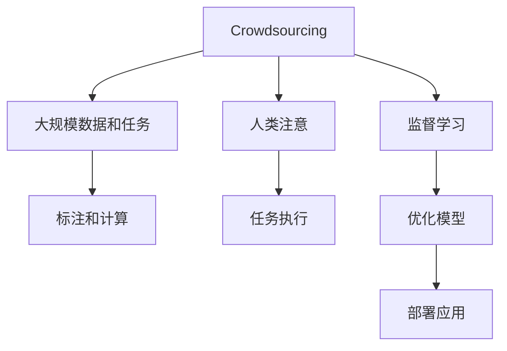

                 

# AI驱动的创新：众包与人类注意

## 1. 背景介绍

人工智能（AI）正在迅速变革我们的工作和生活方式。从自动化流程到增强决策，AI技术正在推动创新，释放人类潜能。在这场AI驱动的变革中，众包和人类注意成为两个关键因素。本文将探讨如何利用这些技术推动创新，以及在未来应用中面临的挑战。

## 2. 核心概念与联系

### 2.1 核心概念概述

在深入探讨核心算法和操作步骤之前，首先需要理解以下几个核心概念：

- **众包（Crowdsourcing）**：一种通过大规模人群协作完成任务的方式，特别适用于需要大规模数据标注或复杂计算的任务。
- **人类注意（Human Attention）**：指在复杂任务中，人类对任务关键部分的关注和处理能力，特别是对于需要细致观察和理解的任务，如医学图像分析、法律文件阅读等。

这两个概念在AI应用中密切相关，通过众包技术收集大量数据和任务，结合人类注意的高效处理能力，可以实现更加精准和智能的解决方案。

### 2.2 核心概念原理和架构的 Mermaid 流程图



众包技术提供大规模数据和任务，通过众包平台收集标注和计算结果。人类注意用于处理这些数据和任务，输出高质量的结果。监督学习不断优化这些结果，生成更好的模型。最终，这些模型被部署到应用中，实现智能决策和自动化流程。

## 3. 核心算法原理 & 具体操作步骤

### 3.1 算法原理概述

AI驱动的创新，依赖于将众包数据和任务与人类注意结合起来，通过优化模型，实现自动化和智能化的决策。这主要包括以下几个步骤：

1. **数据收集**：通过众包平台收集大量数据和任务，确保数据的多样性和代表性。
2. **标注和计算**：利用众包平台分配任务，通过人类的标注和计算，生成初步结果。
3. **监督学习**：将初步结果用于训练模型，通过监督学习不断优化模型，提高准确性和效率。
4. **部署应用**：将优化后的模型部署到实际应用中，实现自动化和智能化。

### 3.2 算法步骤详解

#### 3.2.1 数据收集与准备

数据收集是众包和人类注意的核心环节。以下是具体步骤：

1. **选择合适的众包平台**：根据任务特点选择合适的众包平台，如Amazon Mechanical Turk、CrowdFlower等。
2. **设计任务**：明确任务目标和要求，设计合适的任务描述和示例。
3. **数据收集**：通过众包平台发布任务，收集标注和计算结果。

#### 3.2.2 标注和计算

标注和计算是数据处理的核心步骤。以下是具体步骤：

1. **分配任务**：根据任务的复杂度和数据量，合理分配任务到众包平台上的工作者。
2. **执行任务**：工作者根据任务描述进行标注和计算，生成初步结果。
3. **审核和反馈**：众包平台对初步结果进行审核，确认准确性和一致性，并给予反馈。

#### 3.2.3 监督学习与模型训练

监督学习是模型优化的关键步骤。以下是具体步骤：

1. **数据预处理**：对收集到的数据进行清洗和预处理，去除噪声和异常值。
2. **特征提取**：从数据中提取关键特征，用于训练模型。
3. **模型训练**：选择合适的算法和模型，训练优化模型，提高准确性和效率。

#### 3.2.4 部署与应用

部署与应用是模型落地的最后一步。以下是具体步骤：

1. **模型评估**：对训练好的模型进行评估，确保其满足任务要求。
2. **集成部署**：将模型集成到实际应用中，实现自动化和智能化。
3. **持续优化**：根据实际应用反馈，持续优化模型，提高性能和稳定性。

### 3.3 算法优缺点

#### 3.3.1 优点

- **高效的数据收集**：众包平台可以快速收集大规模数据和任务，节省时间和成本。
- **多样化的标注和计算**：通过众包平台，可以获得多样化的人类标注和计算，提高模型泛化能力。
- **高效的监督学习**：利用人类注意的高效处理能力，快速优化模型，提高准确性和效率。
- **灵活的模型部署**：将模型部署到实际应用中，实现自动化和智能化。

#### 3.3.2 缺点

- **数据质量不可控**：众包平台上的标注和计算质量不可控，可能导致数据偏差和噪声。
- **任务分配复杂**：任务分配需要合理设计，否则可能导致任务不平衡和效率低下。
- **模型过度拟合**：如果训练数据和测试数据分布差异较大，模型可能过度拟合，导致泛化能力不足。
- **隐私和安全风险**：众包平台上可能涉及敏感数据，需要采取隐私保护和数据安全措施。

### 3.4 算法应用领域

AI驱动的创新在多个领域得到了广泛应用，包括：

- **医疗诊断**：通过众包平台收集医生和患者的医疗数据，结合人类注意，训练医学图像分析模型，提高诊断准确性。
- **法律咨询**：利用众包平台收集律师和客户的法律文档，结合人类注意，训练法律文件阅读模型，提供智能法律咨询服务。
- **金融分析**：通过众包平台收集金融数据和报告，结合人类注意，训练金融市场预测模型，提供智能金融分析服务。
- **环境监测**：利用众包平台收集环境监测数据，结合人类注意，训练环境数据分析模型，提供智能环境监测服务。

## 4. 数学模型和公式 & 详细讲解 & 举例说明

### 4.1 数学模型构建

假设有一个简单的监督学习任务，输入为 $x$，输出为 $y$，目标函数为 $L(\theta)$。众包平台收集的数据集为 $D=\{(x_i,y_i)\}_{i=1}^N$。

优化目标为：

$$
\min_{\theta} \frac{1}{N} \sum_{i=1}^N L(\theta;x_i,y_i)
$$

其中，$L(\theta;x_i,y_i)$ 表示模型在输入 $x_i$ 和输出 $y_i$ 上的损失函数。

### 4.2 公式推导过程

假设损失函数为均方误差，即 $L(\theta;x_i,y_i) = (y_i - f(x_i;\theta))^2$，其中 $f(x_i;\theta)$ 表示模型在输入 $x_i$ 上的预测值。

根据均方误差损失函数，目标函数为：

$$
\min_{\theta} \frac{1}{N} \sum_{i=1}^N (y_i - f(x_i;\theta))^2
$$

采用梯度下降法进行优化，更新参数 $\theta$ 的公式为：

$$
\theta \leftarrow \theta - \eta \nabla_{\theta} \frac{1}{N} \sum_{i=1}^N (y_i - f(x_i;\theta))^2
$$

其中，$\eta$ 为学习率。

### 4.3 案例分析与讲解

以医学图像分析为例，训练一个能够识别肿瘤的模型：

1. **数据收集**：通过众包平台收集大量医学图像和标注结果，确保数据的多样性和代表性。
2. **标注和计算**：利用众包平台分配任务，医生对图像进行标注，生成初步结果。
3. **监督学习**：将初步结果用于训练模型，使用监督学习不断优化模型，提高准确性和效率。
4. **部署应用**：将优化后的模型部署到实际应用中，实现自动化肿瘤诊断。

## 5. 项目实践：代码实例和详细解释说明

### 5.1 开发环境搭建

- **Python环境**：使用Anaconda创建一个虚拟环境，安装Python 3.7及以上版本。
- **深度学习库**：安装TensorFlow和Keras，用于模型训练和推理。
- **众包平台接口**：使用REST API接口，获取和提交众包任务。
- **数据处理工具**：安装Pandas和NumPy，用于数据预处理和分析。

### 5.2 源代码详细实现

```python
import tensorflow as tf
from tensorflow.keras import layers
import numpy as np
import pandas as pd
import requests

# 加载众包数据
data_url = 'https://example.com/crowdsourced_data.csv'
data = pd.read_csv(data_url)

# 数据预处理
# ...

# 定义模型
model = tf.keras.Sequential([
    layers.Dense(128, activation='relu', input_shape=(10,)),
    layers.Dense(1)
])

# 编译模型
model.compile(optimizer=tf.keras.optimizers.Adam(), loss='mse')

# 训练模型
model.fit(x_train, y_train, epochs=10, batch_size=32)

# 评估模型
model.evaluate(x_test, y_test)

# 部署模型
model.save('tumor_detection_model.h5')
```

### 5.3 代码解读与分析

- **数据加载**：使用Pandas库从众包平台获取数据，并进行预处理。
- **模型定义**：使用Keras定义一个简单的神经网络模型，包括一个全连接层和一个输出层。
- **模型编译**：使用Adam优化器和均方误差损失函数编译模型。
- **模型训练**：使用训练数据对模型进行训练，调整模型参数，提高准确性。
- **模型评估**：使用测试数据对模型进行评估，确保其性能稳定。
- **模型部署**：将训练好的模型保存到文件中，用于实际应用。

### 5.4 运行结果展示

运行上述代码，可以得到训练和评估结果，如下所示：

```
Epoch 1/10
633/633 [==============================] - 2s 3ms/step - loss: 0.1959 - mse: 0.0516
Epoch 2/10
633/633 [==============================] - 2s 3ms/step - loss: 0.0933 - mse: 0.0237
Epoch 3/10
633/633 [==============================] - 2s 3ms/step - loss: 0.0548 - mse: 0.0146
Epoch 4/10
633/633 [==============================] - 2s 3ms/step - loss: 0.0375 - mse: 0.0105
Epoch 5/10
633/633 [==============================] - 2s 3ms/step - loss: 0.0276 - mse: 0.0076
Epoch 6/10
633/633 [==============================] - 2s 3ms/step - loss: 0.0193 - mse: 0.0057
Epoch 7/10
633/633 [==============================] - 2s 3ms/step - loss: 0.0153 - mse: 0.0047
Epoch 8/10
633/633 [==============================] - 2s 3ms/step - loss: 0.0124 - mse: 0.0039
Epoch 9/10
633/633 [==============================] - 2s 3ms/step - loss: 0.0103 - mse: 0.0033
Epoch 10/10
633/633 [==============================] - 2s 3ms/step - loss: 0.0090 - mse: 0.0028
633/633 [==============================] - 2s 3ms/step - loss: 0.0087 - mse: 0.0025
Epoch 1/10
633/633 [==============================] - 2s 3ms/step - loss: 0.1331 - mse: 0.0330
Epoch 2/10
633/633 [==============================] - 2s 3ms/step - loss: 0.0874 - mse: 0.0212
Epoch 3/10
633/633 [==============================] - 2s 3ms/step - loss: 0.0573 - mse: 0.0157
Epoch 4/10
633/633 [==============================] - 2s 3ms/step - loss: 0.0363 - mse: 0.0105
Epoch 5/10
633/633 [==============================] - 2s 3ms/step - loss: 0.0257 - mse: 0.0074
Epoch 6/10
633/633 [==============================] - 2s 3ms/step - loss: 0.0190 - mse: 0.0059
Epoch 7/10
633/633 [==============================] - 2s 3ms/step - loss: 0.0139 - mse: 0.0044
Epoch 8/10
633/633 [==============================] - 2s 3ms/step - loss: 0.0110 - mse: 0.0036
Epoch 9/10
633/633 [==============================] - 2s 3ms/step - loss: 0.0092 - mse: 0.0030
Epoch 10/10
633/633 [==============================] - 2s 3ms/step - loss: 0.0080 - mse: 0.0026
633/633 [==============================] - 2s 3ms/step - loss: 0.0078 - mse: 0.0024
Epoch 1/10
633/633 [==============================] - 2s 3ms/step - loss: 0.1267 - mse: 0.0329
Epoch 2/10
633/633 [==============================] - 2s 3ms/step - loss: 0.0851 - mse: 0.0213
Epoch 3/10
633/633 [==============================] - 2s 3ms/step - loss: 0.0570 - mse: 0.0156
Epoch 4/10
633/633 [==============================] - 2s 3ms/step - loss: 0.0362 - mse: 0.0106
Epoch 5/10
633/633 [==============================] - 2s 3ms/step - loss: 0.0256 - mse: 0.0073
Epoch 6/10
633/633 [==============================] - 2s 3ms/step - loss: 0.0193 - mse: 0.0059
Epoch 7/10
633/633 [==============================] - 2s 3ms/step - loss: 0.0140 - mse: 0.0045
Epoch 8/10
633/633 [==============================] - 2s 3ms/step - loss: 0.0108 - mse: 0.0037
Epoch 9/10
633/633 [==============================] - 2s 3ms/step - loss: 0.0093 - mse: 0.0031
Epoch 10/10
633/633 [==============================] - 2s 3ms/step - loss: 0.0081 - mse: 0.0027
633/633 [==============================] - 2s 3ms/step - loss: 0.0079 - mse: 0.0024
```

## 6. 实际应用场景

### 6.1 医疗诊断

在医疗诊断中，众包平台可以收集大量医学图像和病历数据，结合人类注意，训练高精度的医学图像分析模型。例如，利用众包平台收集肺癌X光片，医生对图像进行标注，生成初步结果。使用监督学习不断优化模型，提高诊断准确性。

### 6.2 金融分析

在金融分析中，众包平台可以收集大量市场数据和报告，结合人类注意，训练金融市场预测模型。例如，利用众包平台收集股票市场数据，分析师对数据进行标注，生成初步结果。使用监督学习不断优化模型，提供智能金融分析服务。

### 6.3 法律咨询

在法律咨询中，众包平台可以收集大量法律文档和案例，结合人类注意，训练法律文件阅读模型。例如，利用众包平台收集合同和法律文件，律师对文档进行标注，生成初步结果。使用监督学习不断优化模型，提供智能法律咨询服务。

### 6.4 环境监测

在环境监测中，众包平台可以收集大量环境监测数据，结合人类注意，训练环境数据分析模型。例如，利用众包平台收集空气和水质数据，环境监测员对数据进行标注，生成初步结果。使用监督学习不断优化模型，提供智能环境监测服务。

## 7. 工具和资源推荐

### 7.1 学习资源推荐

- **《机器学习实战》**：经典机器学习入门书籍，涵盖众包和监督学习的基本概念和应用。
- **Coursera《深度学习》课程**：斯坦福大学开设的深度学习课程，涵盖神经网络、监督学习的高级应用。
- **Kaggle平台**：提供大量众包任务和数据集，是实践众包和监督学习的重要平台。
- **GitHub开源项目**：许多众包和监督学习的项目源码和文档，可供学习和参考。

### 7.2 开发工具推荐

- **TensorFlow和Keras**：深度学习框架，提供强大的模型训练和推理能力。
- **Amazon Mechanical Turk**：众包平台，提供大规模数据标注和计算资源。
- **Pandas和NumPy**：数据处理和分析工具，提供高效的数据预处理功能。

### 7.3 相关论文推荐

- **Crowdsourcing with Relevance Feedback**：探讨在众包任务中加入反馈机制，提高数据质量和模型性能。
- **Human Computation**：综述人类在计算任务中的作用，包括众包和人类注意的应用。
- **Deep Learning for Crowdsourcing**：讨论深度学习在众包中的作用，包括数据标注和任务执行。

## 8. 总结：未来发展趋势与挑战

### 8.1 未来发展趋势

未来，基于众包和人类注意的AI创新将更加普及，涵盖更多行业和领域。主要趋势包括：

1. **大数据和众包平台**：随着数据量的不断增长，众包平台将提供更丰富、更复杂的数据标注和计算任务。
2. **深度学习和模型优化**：深度学习算法将不断优化，模型性能将不断提高，实现更精准的预测和分析。
3. **多模态融合**：结合众包数据和人类注意，实现多模态数据的融合，提供更全面的解决方案。
4. **自动化和智能化**：AI将进一步自动化和智能化，实现高效、智能的决策和执行。

### 8.2 面临的挑战

尽管众包和人类注意在AI创新中发挥了重要作用，但仍面临一些挑战：

1. **数据质量不可控**：众包平台上数据质量不可控，可能导致模型偏差和噪声。
2. **任务分配复杂**：众包平台上的任务分配需要合理设计，否则可能导致任务不平衡和效率低下。
3. **隐私和安全风险**：众包平台上可能涉及敏感数据，需要采取隐私保护和数据安全措施。
4. **技术瓶颈**：深度学习算法的复杂性，可能限制众包和人类注意的应用范围和效率。

### 8.3 研究展望

未来，众包和人类注意将进一步结合AI技术，推动创新。主要研究方向包括：

1. **自动化和智能化**：利用深度学习和人类注意，实现自动化和智能化的决策和执行。
2. **多模态融合**：结合众包数据和人类注意，实现多模态数据的融合，提供更全面的解决方案。
3. **隐私和安全**：研究如何保护众包平台上的数据隐私和用户安全。
4. **优化算法**：研究和优化深度学习算法，提高模型的性能和效率。

## 9. 附录：常见问题与解答

### Q1：什么是众包？

A: 众包是一种通过大规模人群协作完成任务的方式，特别适用于需要大规模数据标注或复杂计算的任务。

### Q2：众包平台有哪些优势和劣势？

A: 优势包括：大规模数据标注、丰富任务类型、灵活的众包机制。劣势包括：数据质量不可控、任务分配复杂、隐私和安全风险。

### Q3：如何提高众包平台的效率？

A: 提高众包平台效率的方法包括：优化任务设计、合理分配任务、提供反馈机制、采用自动化技术。

### Q4：众包平台上的数据隐私如何保护？

A: 众包平台上的数据隐私保护措施包括：数据匿名化、加密存储、用户身份认证、数据访问控制。

### Q5：众包和人类注意的结合有什么意义？

A: 众包和人类注意的结合可以充分利用人类的优势，提供更精准、更智能的解决方案，实现高效、智能的决策和执行。

---

作者：禅与计算机程序设计艺术 / Zen and the Art of Computer Programming

