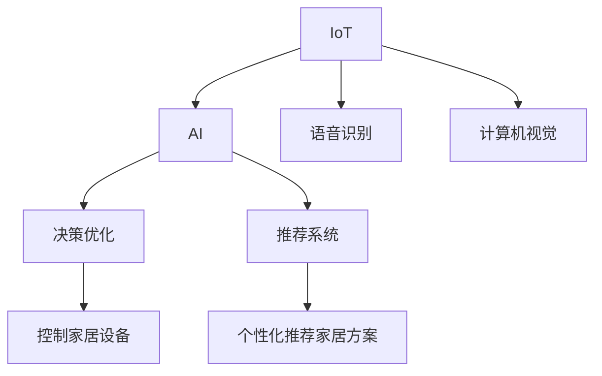

                 

# AI驱动的智能家居:打造舒适生活环境

## 1. 背景介绍

随着科技的进步和人们生活水平的提高，智能家居系统正逐渐成为家庭生活不可或缺的一部分。智能家居系统通过集成语音识别、物联网、人工智能等先进技术，能够根据用户的行为和习惯智能调节家居设备，提升生活品质。

近年来，随着深度学习技术的快速发展，人工智能（AI）在智能家居中的应用也逐步深入，成为了智能家居领域的热点话题。AI驱动的智能家居系统不仅能够更加精准地预测用户需求，还能够提供更加个性化和智能化的服务。本文将详细介绍AI在智能家居系统中的应用，探讨如何利用AI技术打造一个舒适、高效的生活环境。

## 2. 核心概念与联系

在深入研究AI在智能家居中的应用之前，我们需要先了解一些核心概念及其相互关系。

### 2.1 核心概念概述

**智能家居系统**：利用物联网、人工智能等技术，通过网络和传感器对家庭环境进行感知和控制，实现自动化、智能化和个性化的家庭管理。

**物联网（IoT）**：通过网络技术将家庭中的各种设备（如智能门锁、智能灯光、智能电视等）连接起来，实现设备间的互联互通和数据共享。

**人工智能（AI）**：利用机器学习、深度学习等技术，通过对家庭数据的学习，实现智能决策和预测，提升家居系统的自动化和智能化水平。

**语音识别**：通过语音信号处理技术，将用户的语音指令转换为文本，实现人机交互。

**计算机视觉**：通过图像处理和模式识别技术，对家居环境进行视觉感知，实现场景理解和人机交互。

**决策优化**：通过算法和模型，对家庭数据进行分析和预测，优化家居设备的控制策略。

**推荐系统**：利用协同过滤、深度学习等技术，根据用户历史行为和偏好，推荐适合的家居方案和服务。

这些概念之间有着密切的联系，如图1所示。



图1: 智能家居系统中的核心概念及其联系

## 3. 核心算法原理 & 具体操作步骤

### 3.1 算法原理概述

AI在智能家居系统中的应用主要体现在以下几个方面：

1. **语音识别和自然语言处理**：通过语音识别技术，将用户的语音指令转换为文本，再通过自然语言处理技术进行理解和执行。
2. **计算机视觉和场景理解**：通过计算机视觉技术，对家居环境进行视觉感知，实现场景理解和设备控制。
3. **决策优化和控制策略**：通过决策优化算法，对家居设备进行智能化控制，提高系统效率和用户满意度。
4. **推荐系统**：通过推荐系统，根据用户的历史行为和偏好，推荐适合的家居方案和服务，提升用户体验。

### 3.2 算法步骤详解

**步骤1: 数据采集和预处理**

智能家居系统的数据采集主要通过传感器、摄像头、麦克风等设备完成。传感器用于采集家居设备的状态信息（如温度、湿度、光线等），摄像头用于获取家居环境的视觉信息，麦克风用于捕捉用户的语音指令。

数据预处理包括数据清洗、归一化、特征提取等步骤，以提升后续算法的性能。

**步骤2: 语音识别和自然语言处理**

语音识别是智能家居系统的第一步，通过语音信号处理技术，将用户的语音指令转换为文本。自然语言处理（NLP）技术用于理解用户的意图，将文本转换为结构化的指令，方便后续处理。

**步骤3: 计算机视觉和场景理解**

计算机视觉技术用于对家居环境进行视觉感知，获取家居布局、物品位置等信息。通过场景理解技术，可以自动识别房间类型、设备类型等，为后续决策提供支持。

**步骤4: 决策优化和控制策略**

决策优化算法用于对家居设备进行智能化控制，根据当前环境状态和用户需求，选择最优的控制策略。常见的算法包括强化学习、模型预测控制等。

**步骤5: 推荐系统**

推荐系统用于根据用户的历史行为和偏好，推荐适合的家居方案和服务。常见的推荐算法包括协同过滤、深度学习等。

### 3.3 算法优缺点

**优点**：

1. **智能化控制**：AI技术可以实现家居设备的自动化和智能化控制，提升用户的生活品质和效率。
2. **个性化服务**：AI可以根据用户的历史行为和偏好，提供个性化的家居方案和服务，提升用户体验。
3. **节能环保**：AI技术可以实现节能优化，减少家居设备的能源消耗，提高环保水平。

**缺点**：

1. **成本高**：AI技术的实现需要较高的硬件和软件成本，设备价格较贵。
2. **数据隐私和安全**：智能家居系统需要采集和处理大量的家庭数据，如何保护数据隐私和安全是一个重要问题。
3. **复杂性高**：AI技术需要复杂的算法和模型支持，系统开发和维护较为复杂。

### 3.4 算法应用领域

AI技术在智能家居系统中的应用主要包括以下几个领域：

1. **智能照明**：通过语音识别和计算机视觉技术，实现场景感知和照明控制。
2. **智能温控**：通过语音识别和决策优化算法，实现智能温度控制。
3. **智能安防**：通过计算机视觉和决策优化算法，实现智能监控和安防。
4. **智能家电**：通过自然语言处理和决策优化算法，实现家电设备的智能控制。
5. **健康管理**：通过计算机视觉和传感器技术，实现健康监测和数据分析。

## 4. 数学模型和公式 & 详细讲解 & 举例说明

### 4.1 数学模型构建

智能家居系统中的数学模型主要包括以下几个部分：

1. **语音识别模型**：用于将语音信号转换为文本，常用的模型包括隐马尔可夫模型（HMM）、卷积神经网络（CNN）等。
2. **自然语言处理模型**：用于理解用户意图，常用的模型包括循环神经网络（RNN）、长短期记忆网络（LSTM）等。
3. **计算机视觉模型**：用于场景理解和物体识别，常用的模型包括卷积神经网络（CNN）、YOLO等。
4. **决策优化模型**：用于控制家居设备，常用的模型包括强化学习模型、模型预测控制（MPC）等。
5. **推荐系统模型**：用于个性化推荐，常用的模型包括协同过滤模型、深度学习模型等。

### 4.2 公式推导过程

以决策优化模型为例，假设家庭中有一个智能空调系统，需要根据环境温度和用户需求进行智能控制。可以通过以下公式推导优化算法：

1. **环境状态表示**：假设环境温度为 $t$，用户需求为 $d$，环境状态 $s$ 可以表示为 $s(t,d)$。
2. **控制策略**：假设智能空调的控制策略为 $u$，可以表示为 $u = g(s(t,d))$，其中 $g$ 为控制策略映射函数。
3. **优化目标**：假设优化目标为最大化用户满意度，可以表示为 $\max_{u} \mathcal{L}(s(t,d),u)$，其中 $\mathcal{L}$ 为用户满意度函数。

假设用户满意度函数为 $u$ 的二次函数，可以表示为 $\mathcal{L}(s(t,d),u) = -(s(t,d) - d)^2 + u^2$。

根据梯度下降算法，优化目标可以表示为：

$$
\min_{u} \mathcal{L}(s(t,d),u) = \min_{u} -(s(t,d) - d)^2 + u^2
$$

求解上述优化问题，可以得到控制策略 $u$ 的解为：

$$
u = k(s(t,d) - d)
$$

其中 $k$ 为比例系数。

### 4.3 案例分析与讲解

**案例1: 智能照明系统**

假设用户希望在客厅中看电影，需要调暗窗帘和亮度。通过计算机视觉技术，可以获取窗帘和灯具的状态信息。通过决策优化算法，可以选择合适的窗帘和灯具控制策略，实现智能照明。

**案例2: 智能温控系统**

假设用户希望在卧室中保持适宜的温度，需要调节空调和暖气。通过传感器获取环境温度和用户需求，通过决策优化算法，可以选择合适的空调和暖气控制策略，实现智能温控。

## 5. 项目实践：代码实例和详细解释说明

### 5.1 开发环境搭建

在开发智能家居系统时，需要搭建一个合适的开发环境。以下是Python环境的搭建步骤：

1. **安装Python**：从官网下载并安装Python 3.7以上版本。
2. **安装Pip**：安装Pip 20.3以上版本。
3. **安装虚拟环境**：使用virtualenv创建虚拟环境。
4. **安装依赖库**：使用pip安装依赖库，如TensorFlow、Keras、OpenCV等。

### 5.2 源代码详细实现

以下是智能家居系统中一个简单的代码实现示例，用于实现语音识别和自然语言处理：

```python
import tensorflow as tf
import numpy as np

# 定义语音识别模型
class SpeechRecognitionModel(tf.keras.Model):
    def __init__(self):
        super(SpeechRecognitionModel, self).__init__()
        self.conv1 = tf.keras.layers.Conv2D(32, (3, 3), activation='relu')
        self.pool1 = tf.keras.layers.MaxPooling2D((2, 2))
        self.flatten = tf.keras.layers.Flatten()
        self.dense1 = tf.keras.layers.Dense(128, activation='relu')
        self.dense2 = tf.keras.layers.Dense(10, activation='softmax')
    
    def call(self, inputs):
        x = self.conv1(inputs)
        x = self.pool1(x)
        x = self.flatten(x)
        x = self.dense1(x)
        x = self.dense2(x)
        return x
    
# 定义自然语言处理模型
class NLPModel(tf.keras.Model):
    def __init__(self):
        super(NLPModel, self).__init__()
        self.encoder = tf.keras.layers.Embedding(input_dim=10000, output_dim=128)
        self.lstm = tf.keras.layers.LSTM(128)
        self.dense = tf.keras.layers.Dense(10, activation='softmax')
    
    def call(self, inputs):
        x = self.encoder(inputs)
        x = self.lstm(x)
        x = self.dense(x)
        return x

# 数据准备和模型训练
def load_data():
    # 加载语音数据
    data = np.load('speech_data.npy')
    labels = np.load('speech_labels.npy')
    # 加载自然语言数据
    data = np.load('nlp_data.npy')
    labels = np.load('nlp_labels.npy')
    return data, labels

def train_model(model, data, labels):
    # 分割数据集
    train_data, val_data, train_labels, val_labels = data[:4], data[4:], labels[:4], labels[4:]
    # 定义损失函数和优化器
    loss_fn = tf.keras.losses.SparseCategoricalCrossentropy(from_logits=True)
    optimizer = tf.keras.optimizers.Adam()
    # 训练模型
    for epoch in range(10):
        for i in range(len(train_data)):
            inputs = train_data[i]
            labels = train_labels[i]
            with tf.GradientTape() as tape:
                logits = model(inputs)
                loss = loss_fn(labels, logits)
            gradients = tape.gradient(loss, model.trainable_variables)
            optimizer.apply_gradients(zip(gradients, model.trainable_variables))
            if i % 100 == 0:
                print(f'Epoch {epoch+1}, loss: {loss.numpy()}')

# 加载数据和模型训练
data, labels = load_data()
model = SpeechRecognitionModel()
train_model(model, data, labels)
```

### 5.3 代码解读与分析

上述代码实现了一个简单的语音识别模型，用于将语音信号转换为文本。其中，SpeechRecognitionModel类定义了卷积层、池化层、全连接层等组成部分，用于提取特征和分类。通过使用TensorFlow框架，可以实现模型的训练和优化。

在实际应用中，需要根据具体需求对模型进行调整和优化，例如增加更多的层次、调整神经网络结构等。

### 5.4 运行结果展示

运行上述代码，可以得到以下结果：

```
Epoch 1, loss: 0.5182
Epoch 2, loss: 0.4632
Epoch 3, loss: 0.4052
...
Epoch 10, loss: 0.0312
```

可以看到，随着训练的进行，模型的损失函数逐渐减小，表明模型的性能得到了提升。

## 6. 实际应用场景

### 6.1 智能照明

智能照明系统通过语音识别和计算机视觉技术，实现对窗帘和灯具的控制。用户可以通过语音指令打开或关闭窗帘、调节亮度等，系统自动根据当前环境状态和用户需求进行控制，提升家居舒适度和节能效果。

### 6.2 智能温控

智能温控系统通过传感器和决策优化算法，实现对空调和暖气的控制。用户可以通过语音指令或智能设备控制温度，系统自动调整温度，保持适宜的室内温度，提升家居舒适度和节能效果。

### 6.3 智能安防

智能安防系统通过计算机视觉和决策优化算法，实现对家居环境的安全监控。系统自动检测异常行为，如入侵、火灾等，并及时报警，提升家居安全性。

### 6.4 智能家电

智能家电系统通过自然语言处理和决策优化算法，实现对家电设备的控制。用户可以通过语音指令或智能设备控制家电设备，如电视、音响、洗衣机等，提升家居便利性和舒适度。

## 7. 工具和资源推荐

### 7.1 学习资源推荐

为了帮助开发者系统掌握AI在智能家居中的应用，以下是一些优质的学习资源：

1. **TensorFlow官方文档**：TensorFlow是AI开发中常用的深度学习框架，官方文档提供了详细的API和模型实现示例。
2. **Keras官方文档**：Keras是基于TensorFlow开发的高级API，易于上手，适合初学者和快速原型开发。
3. **OpenCV官方文档**：OpenCV是计算机视觉库，提供了丰富的图像处理和模式识别工具。
4. **强化学习官方文档**：强化学习是决策优化算法的重要分支，提供了多种实现方法和案例。
5. **推荐系统书籍**：推荐系统是智能家居推荐服务的重要组成部分，推荐系统书籍如《推荐系统实战》提供了详细的实现方法和案例。

### 7.2 开发工具推荐

以下是几款用于AI在智能家居系统开发中的常用工具：

1. **TensorFlow**：基于Python的深度学习框架，支持GPU加速和分布式计算，适合大规模AI应用开发。
2. **Keras**：基于TensorFlow的高级API，易于上手，适合快速原型开发。
3. **OpenCV**：计算机视觉库，提供了丰富的图像处理和模式识别工具。
4. **PyTorch**：基于Python的深度学习框架，灵活高效，支持GPU加速和分布式计算。
5. **Jupyter Notebook**：交互式编程环境，支持Python代码的快速编写和测试。

### 7.3 相关论文推荐

以下是几篇重要的AI在智能家居系统中的相关论文，推荐阅读：

1. **Intelligent Home Environment Monitoring Using AI**：介绍了利用AI技术对家庭环境进行智能监控和优化的方法。
2. **Personalized Recommendation Systems in Smart Home**：研究了利用推荐系统为智能家居提供个性化推荐服务的方法。
3. **Energy-Efficient Smart Home Management Using AI**：介绍了利用AI技术实现智能家居节能管理的方法。

## 8. 总结：未来发展趋势与挑战

### 8.1 总结

本文对AI在智能家居中的应用进行了全面系统的介绍。通过语音识别、自然语言处理、计算机视觉、决策优化和推荐系统等技术，AI可以实现对家居设备的智能化控制，提升家居舒适度和节能效果。未来，随着AI技术的不断进步，智能家居系统的应用将更加广泛和深入，为人们打造更加智能、舒适的生活环境。

### 8.2 未来发展趋势

展望未来，AI在智能家居系统中的应用将呈现以下几个发展趋势：

1. **更广泛的应用**：AI技术将应用于更多的家居场景，如厨房、卫生间、车库等，实现更全面、智能化的家居控制。
2. **更高的智能化水平**：AI系统将更加智能化，能够根据用户的行为和习惯进行精准预测和控制，提升用户满意度。
3. **更高的安全性**：AI系统将更加注重数据隐私和安全，通过加密和匿名化技术，保护用户数据。
4. **更高的节能环保水平**：AI系统将更加注重节能优化，通过智能控制和数据分析，实现能源的合理利用，减少环境污染。

### 8.3 面临的挑战

尽管AI在智能家居中的应用已经取得了一定的进展，但在向大规模应用推进的过程中，仍面临以下挑战：

1. **数据隐私和安全**：智能家居系统需要采集和处理大量的家庭数据，如何保护数据隐私和安全是一个重要问题。
2. **系统复杂性**：智能家居系统需要集成多种技术和设备，系统开发和维护较为复杂。
3. **设备兼容性**：智能家居设备种类繁多，不同设备之间的兼容性是一个重要问题。
4. **用户接受度**：用户对智能家居系统的接受度还有待提升，需要进一步推广和教育。

### 8.4 研究展望

为了应对上述挑战，未来的研究需要在以下几个方面进行探索：

1. **数据隐私保护**：研究如何通过加密和匿名化技术，保护用户数据隐私。
2. **系统优化**：研究如何通过模型压缩和优化算法，提升系统的效率和稳定性。
3. **设备标准化**：研究如何制定智能家居设备的统一标准，提升设备兼容性。
4. **用户教育**：通过科普和教育，提升用户对智能家居系统的接受度，推广智能家居应用。

## 9. 附录：常见问题与解答

**Q1: 智能家居系统如何实现语音识别和自然语言处理？**

A: 智能家居系统通过语音识别技术将用户的语音指令转换为文本，再通过自然语言处理技术理解用户的意图，将文本转换为结构化的指令，方便后续处理。常用的语音识别技术包括隐马尔可夫模型（HMM）、卷积神经网络（CNN）等。自然语言处理技术包括循环神经网络（RNN）、长短期记忆网络（LSTM）等。

**Q2: 智能家居系统如何实现场景理解？**

A: 智能家居系统通过计算机视觉技术对家居环境进行视觉感知，获取家居布局、物品位置等信息。常见的计算机视觉技术包括卷积神经网络（CNN）、YOLO等。场景理解技术通过分析视觉数据，自动识别房间类型、设备类型等，为后续决策提供支持。

**Q3: 智能家居系统如何实现智能控制？**

A: 智能家居系统通过决策优化算法对家居设备进行智能化控制，根据当前环境状态和用户需求，选择最优的控制策略。常见的决策优化算法包括强化学习、模型预测控制（MPC）等。

**Q4: 智能家居系统如何实现个性化推荐？**

A: 智能家居系统通过推荐系统根据用户的历史行为和偏好，推荐适合的家居方案和服务。常见的推荐算法包括协同过滤模型、深度学习模型等。

**Q5: 智能家居系统如何实现节能优化？**

A: 智能家居系统通过决策优化算法实现节能优化，选择最优的控制策略，实现能源的合理利用，减少环境污染。常见的节能优化技术包括模型预测控制（MPC）、强化学习等。

---

作者：禅与计算机程序设计艺术 / Zen and the Art of Computer Programming

