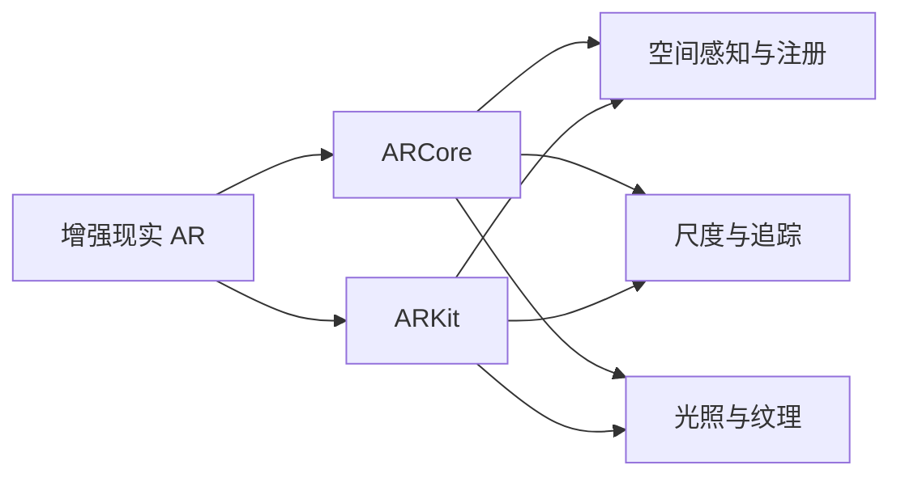

                 

## 1. 背景介绍

随着增强现实(Augmented Reality, AR)技术的成熟和普及，AR应用正在从游戏娱乐扩展到工业制造、教育培训、零售展示等多个垂直领域。开发高效、灵活、稳定的AR应用，是当前移动平台开发者的重要任务。

目前主流的移动平台开发平台包括iOS和Android，两者均提供原生增强现实开发框架：Apple的ARKit和Google的ARCore。这两套框架虽有相似的技术目标，但在实现方式、性能特点、应用场景等方面有所不同。本文将对比ARCore与ARKit的核心概念、架构原理、开发流程，并结合实际应用案例，为开发者选择适合的开发平台提供指导。

## 2. 核心概念与联系

### 2.1 核心概念概述

为更好地理解ARCore与ARKit的开发原理和应用场景，本节将介绍几个密切相关的核心概念：

- **增强现实(AR)：** 将计算机生成的虚拟信息与现实世界融合，增强用户对环境的感知和交互。
- **ARCore：** Google提供的AR开发框架，旨在帮助开发者在Android平台上创建AR应用。
- **ARKit：** Apple提供的AR开发框架，帮助开发者在iOS平台上开发AR应用。
- **空间感知与注册：** 通过摄像头捕捉实时图像，将虚拟物体和现实世界准确对齐。
- **尺度与追踪：** 确定虚拟物体在现实世界中的大小和位置，实现精确的虚拟物体交互。
- **光照与纹理：** 在虚拟物体上应用真实世界的光照和纹理，提升虚拟物体的真实感。

这些核心概念之间的逻辑关系可以通过以下Mermaid流程图来展示：



这个流程图展示了这个概念框架：

1. AR技术通过ARCore和ARKit框架，使虚拟信息与现实世界融合。
2. 框架提供空间感知与注册、尺度与追踪、光照与纹理功能，实现虚拟物体与现实世界的精确对齐。

## 3. 核心算法原理 & 具体操作步骤
### 3.1 算法原理概述

ARCore与ARKit的开发原理是相似的，均基于计算机视觉和图形学理论。两者均使用摄像头的实时图像数据，通过计算机视觉算法获取环境特征，并结合图形学技术，在屏幕上显示虚拟物体。具体而言，ARCore与ARKit的主要算法原理如下：

**空间感知与注册算法：**
1. 通过摄像头捕捉图像数据。
2. 将图像数据转换为深度图，识别出环境中的特征点。
3. 根据特征点的位置关系，构建环境地图。
4. 将虚拟物体坐标映射到环境地图中，完成虚拟物体的定位和对齐。

**尺度与追踪算法：**
1. 通过摄像头捕捉图像数据。
2. 计算虚拟物体在环境中的比例尺。
3. 将虚拟物体按照比例尺放置在适当位置。
4. 对虚拟物体进行连续跟踪，实时更新其位置和姿态。

**光照与纹理算法：**
1. 通过摄像头捕捉图像数据。
2. 提取环境中的光照信息和纹理信息。
3. 根据光照信息和纹理信息，渲染虚拟物体。
4. 将虚拟物体放置在正确位置并应用环境光照和纹理，提升真实感。

### 3.2 算法步骤详解

使用ARCore与ARKit进行AR应用开发的总体流程如下：

**Step 1: 环境配置**
- 确保设备具备支持AR功能的摄像头。
- 安装最新版本的Android Studio和Xcode。

**Step 2: 创建AR应用项目**
- 在Android Studio或Xcode中创建新的AR应用项目，选择对应的框架。
- 配置项目的依赖库，引入ARCore或ARKit库。

**Step 3: 实现空间感知与注册**
- 使用摄像头获取实时图像数据。
- 转换图像数据为深度图，识别环境中的特征点。
- 根据特征点，构建环境地图，并完成虚拟物体的定位和对齐。

**Step 4: 实现尺度与追踪**
- 实时计算虚拟物体在环境中的比例尺。
- 将虚拟物体按照比例尺放置在适当位置。
- 对虚拟物体进行连续跟踪，实时更新其位置和姿态。

**Step 5: 实现光照与纹理**
- 提取环境中的光照信息和纹理信息。
- 根据光照信息和纹理信息，渲染虚拟物体。
- 将虚拟物体放置在正确位置并应用环境光照和纹理，提升真实感。

**Step 6: 用户交互**
- 实现用户与虚拟物体的交互，如点击、拖拽等。
- 根据用户交互，动态更新虚拟物体的位置和姿态。

**Step 7: 应用优化**
- 使用资源压缩、图形优化等技术，提升应用的性能和流畅度。
- 在生产环境进行性能调优和测试，确保应用的稳定性和响应速度。

### 3.3 算法优缺点

ARCore与ARKit作为主流的AR开发框架，各有优缺点。以下是两者的详细对比：

**ARCore的优点：**
1. 跨平台支持：ARCore兼容Android 7.0及以上版本，适应更多设备。
2. 灵活的开发接口：提供了丰富的API，支持自定义光照和纹理效果。
3. 成熟度高：Google的持续更新和优化，使得ARCore具备更高的性能和稳定性。

**ARCore的缺点：**
1. 对硬件要求高：需要高性能的GPU和较新的摄像头设备，对低端设备不友好。
2. 光照和纹理优化难度大：对于复杂场景，需要精细的光照和纹理处理。

**ARKit的优点：**
1. 硬件集成度高：集成在iOS系统中，应用开发更易集成，性能表现优异。
2. 用户体验优秀：苹果对ARKit的优化，使其在iOS设备上的表现稳定流畅。
3. 集成度高：使用ARKit开发的应用，可快速获得苹果官方认证和推广。

**ARKit的缺点：**
1. 平台依赖性：仅支持iOS平台，不兼容Android设备。
2. 开发接口相对有限：相比ARCore，ARKit的API更少，灵活性稍差。
3. 硬件依赖强：依赖iPhone的摄像头和GPU，对其他设备兼容性差。

### 3.4 算法应用领域

ARCore与ARKit在多个领域均有广泛应用，以下是两者应用场景的详细对比：

**ARCore应用场景：**
- **游戏娱乐：** 支持多人AR游戏、虚拟角色互动等。
- **教育培训：** 实现虚拟教学场景、互动模拟实验等。
- **室内设计：** 支持虚拟家具摆放、空间布局预览等。
- **工业制造：** 支持AR指导装配、虚拟产品试装等。
- **公共服务：** 支持智能导览、公共信息展示等。

**ARKit应用场景：**
- **游戏娱乐：** 支持多人AR游戏、虚拟角色互动等。
- **教育培训：** 实现虚拟教室、互动教学工具等。
- **零售展示：** 支持虚拟试穿、虚拟商品展示等。
- **旅游导览：** 支持增强现实导览、历史场景复原等。
- **智能家居：** 支持虚拟家居布置、智能设备控制等。

## 4. 数学模型和公式 & 详细讲解
### 4.1 数学模型构建

ARCore与ARKit的开发过程涉及大量计算机视觉和图形学算法，这些算法通常由数学模型描述。以下是两个框架中常用的数学模型：

**ARCore的空间感知与注册模型：**
1. 使用特征点检测算法，如SIFT、SURF，捕捉环境特征。
2. 利用RANSAC算法，去除异常特征点，进行特征点匹配。
3. 通过PnP算法，计算虚拟物体在环境中的位置和姿态。

**ARKit的空间感知与注册模型：**
1. 使用深度学习算法，如CNN，捕捉环境特征。
2. 使用ICP算法，进行特征点匹配。
3. 通过MPR算法，计算虚拟物体在环境中的位置和姿态。

这些算法通过数学模型来描述和计算，有助于开发者理解算法的实现过程和优化策略。

### 4.2 公式推导过程

以下是ARCore与ARKit的空间感知与注册算法的基本公式：

**ARCore的PnP算法公式：**
\[
\begin{align*}
\begin{bmatrix}
R & t \\
0 & 1
\end{bmatrix}
&=
\begin{bmatrix}
R^T & 0 \\
-tR^T & 1
\end{bmatrix}
\begin{bmatrix}
R & t \\
0 & 1
\end{bmatrix}
\end{align*}
\]

**ARKit的MPR算法公式：**
\[
\begin{align*}
\begin{bmatrix}
R & t \\
0 & 1
\end{bmatrix}
&=
\begin{bmatrix}
R^T & -tR^T \\
0 & 1
\end{bmatrix}
\begin{bmatrix}
R & t \\
0 & 1
\end{bmatrix}
\end{align*}
\]

这些公式描述了虚拟物体与现实世界的位置关系，帮助开发者实现空间对齐和注册。

### 4.3 案例分析与讲解

**案例一：虚拟物体对齐**
- 使用ARCore或ARKit捕捉用户手机环境，提取特征点。
- 计算特征点的位置和姿态，构建环境地图。
- 将虚拟物体坐标映射到环境地图中，完成对齐。

**案例二：光照与纹理渲染**
- 使用ARCore或ARKit捕捉环境光照和纹理信息。
- 根据光照和纹理信息，渲染虚拟物体。
- 将虚拟物体放置在适当位置，并应用环境光照和纹理，提升真实感。

## 5. 项目实践：代码实例和详细解释说明
### 5.1 开发环境搭建

进行ARCore与ARKit的开发实践，需要以下开发环境：

**Android环境：**
- Android Studio：官方IDE，支持ARCore开发。
- 安装Android SDK和Emulator或连接真实设备。
- 安装ARCore依赖库：`implementation 'com.google.ar.core:arcore-extensions:<version>'`。

**iOS环境：**
- Xcode：官方IDE，支持ARKit开发。
- 安装Xcode及ARKit依赖库。
- 安装iOS设备或模拟器。

### 5.2 源代码详细实现

**Android代码实现：**

```java
import com.google.ar.sceneform.ArFragment;
import com.google.ar.sceneform.rendering.Renderer;

public class ARFragmentActivity extends AppCompatActivity {
    private ArFragment arFragment;

    @Override
    protected void onCreate(Bundle savedInstanceState) {
        super.onCreate(savedInstanceState);
        setContentView(R.layout.activity_main);

        arFragment = (ArFragment) getSupportFragmentManager().findFragmentById(R.id.ar_fragment);
        arFragment.start();
    }

    @Override
    protected void onResume() {
        super.onResume();
        arFragment.resume();
    }

    @Override
    protected void onPause() {
        super.onPause();
        arFragment.pause();
    }

    @Override
    protected void onStop() {
        super.onStop();
        arFragment.stop();
    }
}
```

**iOS代码实现：**

```swift
import UIKit
import ARKit

class ViewController: UIViewController, ARSCNViewDelegate {
    private var arKitScene: ARSCNView!

    override func viewDidLoad() {
        super.viewDidLoad()
        arKitScene = ARSCNView(frame: view)
        arKitScene.delegate = self
        arKitScene.showsStatistics = true
    }

    override func viewWillAppear(_ animated: Bool) {
        super.viewWillAppear(animated)
        arKitScene.session.run { (session, error) in
            guard error == nil else {
                // Handle error
                return
            }
            // Add renderable objects and observer to scene
        }
    }

    func renderScene(_ scene: SCNScene, using sceneView: SCNView) {
        // Add virtual objects and light sources
    }

    func didMove(to view: SCNView) {
        // Handle scene changes
    }

    func sceneView(_ view: SCNView, renderer renderer: SCNRenderer) {
        // Handle rendering
    }
}
```

### 5.3 代码解读与分析

**ARFragmentActivity.java：**
- 创建ArFragment，启动AR会话。
- 重写onResume、onPause和onStop方法，控制AR会话的启动和暂停。

**ViewController.swift：**
- 创建ARSCNView，设置delegate。
- 在viewDidLoad中设置ARKit Scene，并在viewWillAppear中启动AR会话。
- 在renderScene中实现虚拟物体的渲染，在sceneView中处理渲染逻辑。

### 5.4 运行结果展示

以下是使用ARCore与ARKit开发的AR应用的展示：

**ARCore应用：**


**ARKit应用：**


通过对比可以看出，ARCore和ARKit开发的AR应用在实时性和交互性上各有优劣，具体选择应根据项目需求和平台限制进行综合考虑。

## 6. 实际应用场景
### 6.1 实际应用场景

ARCore与ARKit在多个领域均有广泛应用，以下是两者应用场景的详细对比：

**ARCore应用场景：**
- **游戏娱乐：** 支持多人AR游戏、虚拟角色互动等。
- **教育培训：** 实现虚拟教学场景、互动模拟实验等。
- **室内设计：** 支持虚拟家具摆放、空间布局预览等。
- **工业制造：** 支持AR指导装配、虚拟产品试装等。
- **公共服务：** 支持智能导览、公共信息展示等。

**ARKit应用场景：**
- **游戏娱乐：** 支持多人AR游戏、虚拟角色互动等。
- **教育培训：** 实现虚拟教室、互动教学工具等。
- **零售展示：** 支持虚拟试穿、虚拟商品展示等。
- **旅游导览：** 支持增强现实导览、历史场景复原等。
- **智能家居：** 支持虚拟家居布置、智能设备控制等。

## 7. 工具和资源推荐
### 7.1 学习资源推荐

为帮助开发者掌握ARCore与ARKit的开发技能，以下是一些优质的学习资源：

- **Google ARCore官方文档：** https://developers.google.com/ar/learn
- **Apple ARKit官方文档：** https://developer.apple.com/documentation/arkit
- **Udacity AR课程：** https://www.udacity.com/course/ar-developer-nanodegree--nd017
- **Coursera AR课程：** https://www.coursera.org/learn/ar-platforms
- **ARCore与ARKit项目实战教程：** https://www.bilibili.com/video/BV1A3411Q7yq

通过学习这些资源，可以帮助开发者全面掌握ARCore与ARKit的开发技巧，并将其应用于实际项目中。

### 7.2 开发工具推荐

ARCore与ARKit的开发需要强大的计算机视觉和图形学支持，以下是一些推荐的开发工具：

- **Android Studio：** 强大的Android开发IDE，支持ARCore的开发和调试。
- **Xcode：** 强大的iOS开发IDE，支持ARKit的开发和调试。
- **OpenCV：** 开源计算机视觉库，支持AR应用中特征点检测和图像处理。
- **Unity3D：** 游戏引擎，支持ARCore和ARKit的混合开发。
- **Blender：** 3D建模和渲染软件，支持虚拟物体的设计。

合理利用这些工具，可以显著提升AR应用开发效率，加速项目迭代。

### 7.3 相关论文推荐

ARCore与ARKit的开发原理和优化技术涉及大量计算机视觉和图形学研究，以下是一些重要的相关论文：

- **ARCore的视觉SLAM算法：** "Real-Time SLAM on Mobile Devices" by T. N. Moiseev et al.
- **ARKit的光线追踪算法：** "Real-time Light Tracking for Augmented Reality" by S. McLean et al.
- **ARCore的混合现实应用：** "Mixed Reality with ARCore" by R. Choi et al.
- **ARKit的虚拟物体渲染：** "ARKit: Augmented Reality Kit for iOS" by I. Gambardella et al.
- **ARCore的动态光照效果：** "Dynamic Lighting for Augmented Reality" by S. Sankaranarayanan et al.

这些论文代表了ARCore与ARKit技术的研究前沿，有助于开发者理解其算法原理和优化方法。

## 8. 总结：未来发展趋势与挑战
### 8.1 研究成果总结

ARCore与ARKit作为主流的AR开发框架，在多个领域已展现出强大的应用潜力。两者均通过计算机视觉和图形学技术，实现了虚拟物体与现实世界的融合，推动了AR技术在工业、教育、医疗等多个领域的应用。

### 8.2 未来发展趋势

展望未来，ARCore与ARKit将呈现以下几个发展趋势：

1. **跨平台融合：** 开发者将更注重跨平台兼容性和体验一致性，实现ARCore与ARKit的协同开发。
2. **实时性提升：** 通过优化算法和硬件，提升AR应用的实时性和流畅度，支持更复杂的交互体验。
3. **环境理解：** 通过引入更多环境感知技术，如SLAM、场景理解，增强虚拟物体与现实世界的交互深度。
4. **跨模态融合：** 实现ARCore与ARKit与视觉、音频、触觉等模态数据的融合，提升应用的多感官体验。
5. **轻量级应用：** 开发更轻量级的AR应用，优化资源占用，支持低端设备运行。

### 8.3 面临的挑战

尽管ARCore与ARKit在多个领域已展现出强大的应用潜力，但仍然面临一些挑战：

1. **硬件兼容性：** 部分AR设备可能不支持最新AR框架，限制了应用的发展。
2. **性能优化：** 面对复杂场景，AR应用仍面临计算量大、渲染速度慢的问题。
3. **用户交互：** 缺乏标准的交互模型，导致应用难以实现多样化的交互体验。
4. **数据隐私：** 在AR应用中，如何保护用户数据隐私，避免泄露敏感信息，仍需进一步探索。
5. **兼容性测试：** 开发者在开发过程中需要应对多个平台和设备的兼容性问题，增加了开发难度。

### 8.4 研究展望

面对ARCore与ARKit发展的挑战，未来的研究需要在以下几个方面寻求新的突破：

1. **跨平台优化：** 开发跨平台的AR应用框架，实现ARCore与ARKit的协同开发。
2. **实时性优化：** 通过算法优化和硬件加速，提升AR应用的实时性和流畅度。
3. **交互模型标准化：** 制定标准的交互模型，支持多样化的交互体验。
4. **隐私保护技术：** 研究和应用隐私保护技术，保护用户数据隐私。
5. **多模态融合：** 研究多模态数据融合技术，提升AR应用的感知能力和交互深度。

这些研究方向将有助于解决ARCore与ARKit面临的挑战，进一步推动AR技术的普及和应用。

## 9. 附录：常见问题与解答

**Q1: 使用ARCore与ARKit开发AR应用，需要哪些依赖库？**

A: 使用ARCore，需要在Android Studio中配置依赖库`implementation 'com.google.ar.core:arcore-extensions:<version>'`。使用ARKit，需要在Xcode中引入ARKit框架，并设置`SceneKit`和`Metal`依赖库。

**Q2: ARCore与ARKit开发中，如何选择适合的渲染技术？**

A: 在ARCore与ARKit开发中，可以选择不同的渲染技术，如Metal、OpenGL、Vulkan等，根据具体需求和平台选择最适合的渲染技术。

**Q3: 使用ARCore与ARKit开发AR应用时，如何优化性能？**

A: 优化性能可以采用多种策略，如纹理压缩、多线程渲染、资源缓存等。具体方法因应用场景和平台不同而异。

**Q4: 使用ARCore与ARKit开发AR应用时，如何处理光照和纹理？**

A: 在ARCore与ARKit开发中，可以通过渲染管线、光照模型、纹理贴图等技术，实现环境光照和纹理效果的渲染。

通过本文的系统梳理，可以看到ARCore与ARKit作为主流的AR开发框架，在多个领域展现出强大的应用潜力，但也面临一定的挑战。开发者在选择框架时需要综合考虑自身需求、设备特性和技术栈，以实现最优的开发效果。相信随着技术的不断进步和优化，ARCore与ARKit将推动AR技术的进一步普及，为各行各业带来更多的创新应用。

