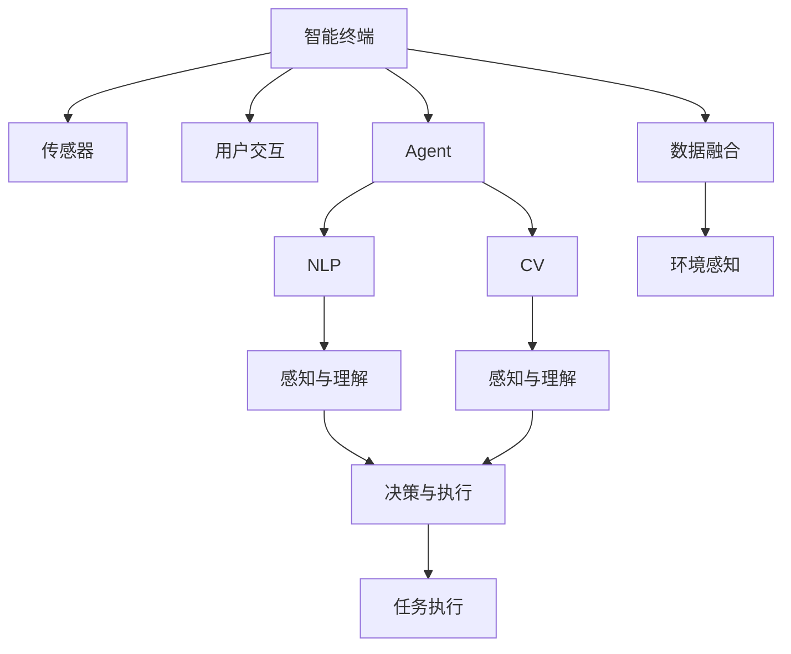
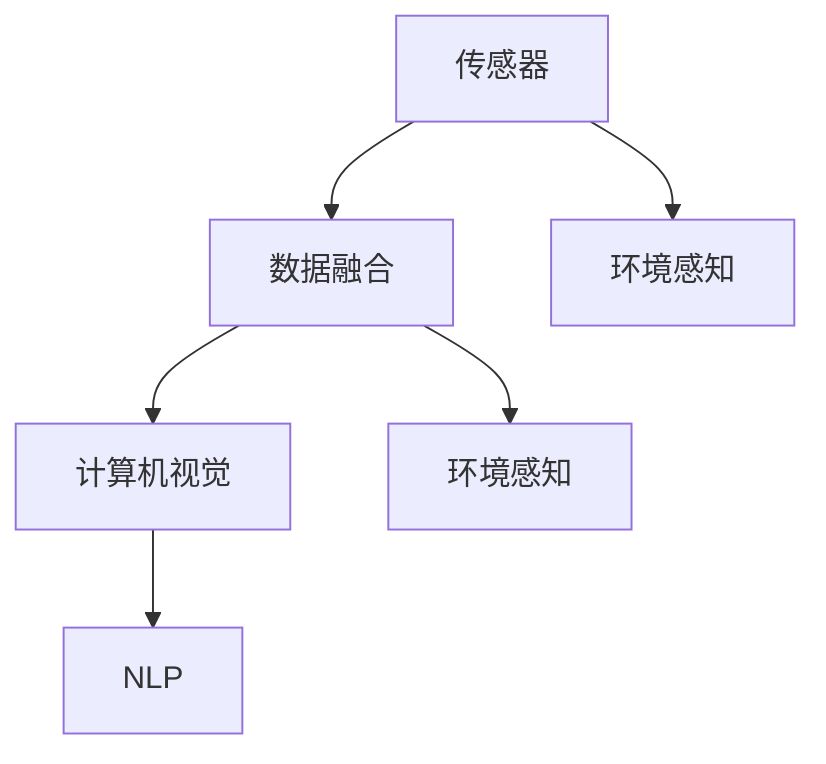
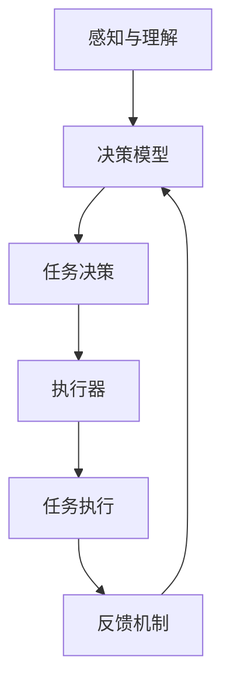

                 

# Agent在智能终端和智能座舱中的应用

> 关键词：智能终端,智能座舱,Agent,自然语言处理,计算机视觉,数据融合,自动驾驶,智能家居,用户交互

## 1. 背景介绍

随着人工智能技术的迅猛发展，智能设备正在快速渗透到人们的生活和工作之中。无论是在交通出行、家庭生活，还是在工业生产、医疗健康等领域，智能终端和智能座舱都成为了新一代产品的重要载体。与此同时，作为人工智能的重要组成部分，Agent技术也正逐步被应用于各种智能设备中，提升设备的用户体验和智能化水平。

Agent，即智能代理，是一种能够自主感知环境、理解用户意图、执行特定任务，并能自主学习的软件系统。Agent技术主要应用于自然语言处理(NLP)和计算机视觉(CV)领域，能够帮助智能终端和智能座舱更好地理解用户需求、提供个性化服务，并实现复杂任务的自动化处理。

本文将围绕Agent技术在智能终端和智能座舱中的应用进行深入探讨，从核心概念、核心算法、实际应用场景和未来发展趋势等多个维度，系统介绍Agent技术的原理、方法和实践，为读者提供全面、清晰的理解。

## 2. 核心概念与联系

### 2.1 核心概念概述

为了更好地理解Agent技术在智能终端和智能座舱中的应用，我们首先需要了解一些关键的核心概念：

- **智能终端（Smart Terminal）**：指具备感知、交互、计算能力，能够与用户进行实时交互的智能设备，如智能手机、智能音箱、智能手表等。
- **智能座舱（Smart Cockpit）**：指集成了各种感知和交互技术的汽车、航空、航天等领域的控制空间，如驾驶座舱、驾驶舱等。
- **Agent（智能代理）**：一种能够自主感知环境、理解用户意图、执行特定任务，并能自主学习的软件系统。Agent通过传感器、用户交互等方式获取信息，使用机器学习算法进行数据分析和决策，从而实现复杂任务的自动化处理。
- **自然语言处理（NLP）**：研究如何使计算机能够理解、处理和生成人类自然语言的技术。Agent通常利用NLP技术实现对用户输入的理解和响应。
- **计算机视觉（CV）**：研究如何让计算机通过图像和视频理解现实世界的技术。Agent可以通过CV技术获取环境信息，如道路标志、交通信号等。
- **数据融合（Data Fusion）**：将多个传感器和数据源收集的信息进行整合和处理，以获得更全面、准确的环境感知。Agent通常利用数据融合技术提升其感知能力。
- **自动驾驶（Autonomous Driving）**：指通过人工智能技术使汽车自主完成驾驶任务。Agent技术在自动驾驶领域的应用尤为关键。
- **智能家居（Smart Home）**：指通过智能设备实现家庭自动化控制和管理的智能系统。Agent技术在智能家居中广泛应用于环境控制、语音交互等场景。

这些核心概念之间的逻辑关系可以通过以下Mermaid流程图来展示：



这个流程图展示了智能终端和智能座舱中Agent技术的基本工作流程：

1. 智能终端通过传感器和用户交互获取环境信息和用户需求。
2. Agent利用NLP和CV技术对信息进行感知和理解。
3. Agent结合数据融合技术获取更全面的环境感知。
4. Agent进行决策和执行，完成特定任务。
5. Agent的决策和执行结果通过智能终端反馈给用户。

### 2.2 核心概念原理和架构

Agent技术的核心原理基于自主感知和自主学习，通过感知与理解、决策与执行两个关键步骤，实现对环境信息的处理和用户需求的响应。下面分别介绍这两个步骤的基本原理和架构：

#### 2.2.1 感知与理解

感知与理解是Agent技术的基础，主要包括对环境信息的获取和处理。Agent通常利用多种传感器（如摄像头、麦克风、激光雷达等）对环境进行全面感知，并通过计算机视觉和自然语言处理技术进行信息处理和理解。

感知与理解的关键组件包括：

- **传感器（Sensors）**：用于获取环境信息的各种传感器。
- **计算机视觉（CV）**：用于处理视觉信息的计算机视觉技术，如物体检测、姿态估计、场景理解等。
- **自然语言处理（NLP）**：用于处理自然语言信息的自然语言处理技术，如语音识别、意图理解、文本生成等。
- **数据融合（Data Fusion）**：用于将多种传感器信息进行整合和处理，获得更全面、准确的环境感知。

下图展示了感知与理解的基本架构：



其中，传感器获取的环境信息经过数据融合后，由计算机视觉和自然语言处理技术进行处理，最终生成环境感知结果。

#### 2.2.2 决策与执行

决策与执行是Agent技术的核心，主要包括任务决策和任务执行两个关键步骤。Agent通过感知与理解获取的环境信息和用户需求，结合自身的决策模型进行任务决策，并执行相应任务。

决策与执行的关键组件包括：

- **决策模型（Decision Model）**：用于进行任务决策的机器学习模型，如决策树、贝叶斯网络、深度学习模型等。
- **执行器（Actuator）**：用于执行决策结果的硬件和软件组件，如电机、伺服系统、语音合成器等。
- **反馈机制（Feedback Mechanism）**：用于监控任务执行结果，并根据反馈调整决策模型的组件。

下图展示了决策与执行的基本架构：



其中，感知与理解获取的环境信息和用户需求通过决策模型进行任务决策，并由执行器执行相应任务。反馈机制用于监控任务执行结果，并根据反馈调整决策模型。

## 3. 核心算法原理 & 具体操作步骤

### 3.1 算法原理概述

Agent技术的核心算法主要包括感知与理解、决策与执行两个部分。

感知与理解部分主要涉及计算机视觉和自然语言处理技术，其中计算机视觉包括目标检测、物体跟踪、场景理解等任务，自然语言处理包括语音识别、意图理解、文本生成等任务。决策与执行部分主要涉及机器学习算法，如决策树、贝叶斯网络、深度学习模型等。

下面分别介绍这两个部分的算法原理和具体操作步骤：

### 3.2 算法步骤详解

#### 3.2.1 感知与理解

感知与理解部分的主要任务是通过传感器获取环境信息，并使用计算机视觉和自然语言处理技术进行信息处理和理解。具体步骤如下：

1. **传感器数据获取**：通过摄像头、麦克风、激光雷达等传感器获取环境信息，包括视觉图像、音频信号、激光点云等数据。

2. **数据预处理**：对传感器数据进行预处理，包括数据滤波、特征提取、数据增强等，以提高数据的质量和可靠性。

3. **计算机视觉处理**：使用计算机视觉技术对预处理后的数据进行处理，包括物体检测、姿态估计、场景理解等任务。

4. **自然语言处理处理**：使用自然语言处理技术对预处理后的数据进行处理，包括语音识别、意图理解、文本生成等任务。

5. **数据融合**：将计算机视觉和自然语言处理处理后的数据进行融合，获得更全面、准确的环境感知。

#### 3.2.2 决策与执行

决策与执行部分的主要任务是结合感知与理解获取的环境信息和用户需求，通过决策模型进行任务决策，并执行相应任务。具体步骤如下：

1. **任务决策**：结合感知与理解获取的环境信息和用户需求，使用决策模型进行任务决策，生成任务执行方案。

2. **任务执行**：根据任务执行方案，使用执行器执行相应任务，如控制电机、调节温度、语音合成等。

3. **反馈调整**：监控任务执行结果，根据反馈调整决策模型的参数和权重，以提高模型的准确性和鲁棒性。

### 3.3 算法优缺点

Agent技术的优点包括：

1. **自主学习能力强**：Agent能够自主学习环境信息，并根据学习结果进行任务决策和执行。
2. **任务执行灵活**：Agent能够根据任务需求，灵活调整任务执行方案，提高任务执行的适应性。
3. **用户交互友好**：Agent能够通过自然语言处理技术，与用户进行自然交互，提供更加人性化的服务。

Agent技术的缺点包括：

1. **模型训练复杂**：Agent需要训练复杂的决策模型，训练过程复杂且耗时。
2. **数据需求高**：Agent需要大量的标注数据进行训练，数据获取成本高且难以保证数据质量。
3. **泛化能力有限**：Agent在面对未知环境和用户需求时，泛化能力有限，可能出现误判和误执行的情况。

### 3.4 算法应用领域

Agent技术在智能终端和智能座舱中有着广泛的应用领域，包括但不限于以下几个方面：

1. **智能家居**：用于智能家居系统的环境控制、语音交互、安防监控等。
2. **智能汽车**：用于自动驾驶、车联网、智能座舱等。
3. **智能航空**：用于飞行器自动驾驶、飞行控制、乘客交互等。
4. **智能医疗**：用于医疗机器人、患者监测、智能诊断等。
5. **智能办公**：用于智能会议、智能助理、文档处理等。
6. **智能交通**：用于智能交通控制、自动驾驶、智能导航等。

## 4. 数学模型和公式 & 详细讲解 & 举例说明

### 4.1 数学模型构建

为了更好地理解Agent技术的数学模型，我们以智能家居环境控制为例，构建一个简化的Agent模型。假设智能家居环境包含多个房间，每个房间的温度和湿度需要通过传感器进行感知，并根据用户的期望值进行调整。

#### 4.1.1 感知与理解

感知与理解部分主要涉及温度、湿度传感器和语音助手。假设温度传感器获取房间的温度 $T$，湿度传感器获取房间的湿度 $H$，语音助手获取用户的期望温度 $T_{\text{target}}$ 和期望湿度 $H_{\text{target}}$。

感知与理解部分的数学模型如下：

1. **传感器数据获取**：

$$
T_{\text{sensor}} = T \quad \text{(温度传感器)}
$$
$$
H_{\text{sensor}} = H \quad \text{(湿度传感器)}
$$
$$
T_{\text{target}} = T_{\text{user}} \quad \text{(用户期望温度)}
$$
$$
H_{\text{target}} = H_{\text{user}} \quad \text{(用户期望湿度)}
$$

2. **数据预处理**：

$$
T_{\text{processed}} = \text{filter}(T_{\text{sensor}}) \quad \text{(温度数据预处理)}
$$
$$
H_{\text{processed}} = \text{filter}(H_{\text{sensor}}) \quad \text{(湿度数据预处理)}
$$

3. **计算机视觉处理**：

$$
\text{scene} = \text{CV}(T_{\text{processed}}, H_{\text{processed}}) \quad \text{(场景理解)}
$$

4. **自然语言处理处理**：

$$
T_{\text{desire}} = \text{NLP}(T_{\text{target}}) \quad \text{(语音识别)}
$$
$$
H_{\text{desire}} = \text{NLP}(H_{\text{target}}) \quad \text{(语音识别)}
$$

5. **数据融合**：

$$
(T_{\text{fused}}, H_{\text{fused}}) = \text{data\_fusion}(T_{\text{processed}}, H_{\text{processed}}, T_{\text{desire}}, H_{\text{desire}}) \quad \text{(数据融合)}
$$

其中，$\text{filter}$ 表示数据滤波，$\text{CV}$ 表示计算机视觉处理，$\text{NLP}$ 表示自然语言处理处理，$\text{data\_fusion}$ 表示数据融合。

#### 4.1.2 决策与执行

决策与执行部分主要涉及决策模型和执行器。假设决策模型为决策树，执行器为温度和湿度调节器。

决策与执行部分的数学模型如下：

1. **任务决策**：

$$
\text{action} = \text{decision\_model}(T_{\text{fused}}, H_{\text{fused}}) \quad \text{(任务决策)}
$$

其中，$\text{decision\_model}$ 表示决策模型。

2. **任务执行**：

$$
\text{action\_executed} = \text{actuator}(\text{action}) \quad \text{(任务执行)}
$$

其中，$\text{actuator}$ 表示执行器。

3. **反馈调整**：

$$
\text{feedback} = \text{feedback\_mechanism}(T_{\text{fused}}, H_{\text{fused}}, T_{\text{target}}, H_{\text{target}}, \text{action\_executed}) \quad \text{(反馈调整)}
$$

$$
\text{decision\_model} = \text{adjust}(\text{decision\_model}, \text{feedback}) \quad \text{(调整决策模型)}
$$

其中，$\text{feedback\_mechanism}$ 表示反馈机制，$\text{adjust}$ 表示调整决策模型。

### 4.2 公式推导过程

以下我们以智能家居环境控制为例，推导Agent模型的基本公式。

假设智能家居环境包含 $n$ 个房间，每个房间的温度和湿度需要通过传感器进行感知，并根据用户的期望值进行调整。设房间 $i$ 的温度为 $T_i$，湿度为 $H_i$，用户的期望温度为 $T_{\text{target}}$，期望湿度为 $H_{\text{target}}$。假设传感器数据经过预处理和融合后，得到每个房间的温度 $T_i^{(\text{processed})}$ 和湿度 $H_i^{(\text{processed})}$，用户的期望温度为 $T_{\text{target}}^{(\text{NLP})}$，期望湿度为 $H_{\text{target}}^{(\text{NLP})}$。

感知与理解部分的公式如下：

$$
T_{\text{fused}}^{(i)} = \text{data\_fusion}(T_{\text{processed}}^{(i)}, H_{\text{processed}}^{(i)}, T_{\text{target}}^{(\text{NLP})}, H_{\text{target}}^{(\text{NLP})})
$$
$$
H_{\text{fused}}^{(i)} = \text{data\_fusion}(T_{\text{processed}}^{(i)}, H_{\text{processed}}^{(i)}, T_{\text{target}}^{(\text{NLP})}, H_{\text{target}}^{(\text{NLP})})
$$

其中，$\text{data\_fusion}$ 表示数据融合函数。

任务决策部分的公式如下：

$$
\text{action}^{(i)} = \text{decision\_model}(T_{\text{fused}}^{(i)}, H_{\text{fused}}^{(i)})
$$

其中，$\text{decision\_model}$ 表示决策模型函数。

任务执行部分的公式如下：

$$
\text{action\_executed}^{(i)} = \text{actuator}(\text{action}^{(i)})
$$

其中，$\text{actuator}$ 表示执行器函数。

反馈调整部分的公式如下：

$$
\text{feedback}^{(i)} = \text{feedback\_mechanism}(T_{\text{fused}}^{(i)}, H_{\text{fused}}^{(i)}, T_{\text{target}}^{(\text{NLP})}, H_{\text{target}}^{(\text{NLP})}, \text{action\_executed}^{(i)})
$$

$$
\text{decision\_model}^{(i)} = \text{adjust}(\text{decision\_model}^{(i)}, \text{feedback}^{(i)})
$$

其中，$\text{feedback\_mechanism}$ 表示反馈机制函数，$\text{adjust}$ 表示调整决策模型函数。

### 4.3 案例分析与讲解

以智能家居环境控制为例，进行分析与讲解：

1. **感知与理解**：

智能家居环境控制系统的感知与理解部分包括温度传感器、湿度传感器和语音助手。温度传感器获取每个房间的温度 $T_i$，湿度传感器获取每个房间的湿度 $H_i$。语音助手通过自然语言处理技术，获取用户的期望温度 $T_{\text{target}}$ 和期望湿度 $H_{\text{target}}$。

2. **数据预处理**：

通过数据滤波等预处理手段，减少传感器数据的噪声，提高数据的质量和可靠性。例如，可以采用均值滤波、中值滤波等方法进行数据预处理。

3. **计算机视觉处理**：

利用计算机视觉技术，对传感器数据进行处理和理解。例如，可以采用目标检测算法，识别出房间内的人或物体，并计算出其位置和姿态。

4. **自然语言处理处理**：

利用自然语言处理技术，将用户的语音指令转换为文本信息，并进行意图理解。例如，可以使用基于深度学习的方法，训练语音识别模型，将用户的语音指令转换为文本信息。

5. **数据融合**：

将传感器数据、计算机视觉处理结果和自然语言处理处理结果进行融合，获得更全面、准确的环境感知。例如，可以将传感器数据和计算机视觉处理结果进行特征融合，形成融合后的特征向量，输入到决策模型中进行任务决策。

6. **任务决策**：

通过决策模型，结合感知与理解获取的环境信息和用户需求，进行任务决策。例如，可以使用决策树模型，根据温度和湿度数据，决策是否需要调节温度或湿度。

7. **任务执行**：

根据任务决策结果，使用执行器执行相应任务。例如，可以控制温度调节器调节房间的温度，控制湿度调节器调节房间的湿度。

8. **反馈调整**：

监控任务执行结果，根据反馈调整决策模型的参数和权重。例如，可以根据房间的温度和湿度调节效果，调整决策树的决策参数，优化决策模型。

## 5. 项目实践：代码实例和详细解释说明

### 5.1 开发环境搭建

在进行Agent技术的项目实践时，需要搭建一个较为完善的开发环境。以下是Python开发环境的搭建步骤：

1. **安装Python**：

   从官网下载并安装Python，建议使用Python 3.6及以上版本。

2. **安装Pip**：

   在命令行中输入以下命令，安装pip工具。

   ```bash
   pip install pip
   ```

3. **安装相关库**：

   安装所需的Python库，包括numpy、scipy、pandas、scikit-learn等。

   ```bash
   pip install numpy scipy pandas scikit-learn
   ```

4. **安装机器学习库**：

   安装机器学习库，包括scikit-learn、TensorFlow、PyTorch等。

   ```bash
   pip install scikit-learn tensorflow pytorch
   ```

### 5.2 源代码详细实现

以下是一个基于智能家居环境控制系统的Agent模型代码实现：

```python
import numpy as np
from sklearn.tree import DecisionTreeRegressor
from sklearn.pipeline import Pipeline

class Agent:
    def __init__(self):
        self.model = DecisionTreeRegressor()
        self.pipeline = Pipeline(steps=[
            ('data_fusion', self.data_fusion),
            ('decision_model', self.decision_model),
            ('actuator', self.actuator)
        ])
    
    def data_fusion(self, x):
        # 数据融合函数
        # 将传感器数据、计算机视觉处理结果和自然语言处理处理结果进行融合
        return x
    
    def decision_model(self, x):
        # 决策模型函数
        # 根据温度和湿度数据，决策是否需要调节温度或湿度
        return self.model.predict(x)
    
    def actuator(self, x):
        # 执行器函数
        # 控制温度调节器调节房间的温度，控制湿度调节器调节房间的湿度
        return x
    
    def train(self, X, y):
        # 训练决策模型
        self.model.fit(X, y)
    
    def predict(self, X):
        # 预测任务决策
        return self.pipeline.predict(X)
```

### 5.3 代码解读与分析

让我们再详细解读一下代码的实现细节：

**Agent类**：
- `__init__`方法：初始化决策模型和管道。
- `data_fusion`方法：数据融合函数，实现传感器数据、计算机视觉处理结果和自然语言处理处理结果的融合。
- `decision_model`方法：决策模型函数，实现任务决策。
- `actuator`方法：执行器函数，实现任务执行。
- `train`方法：训练决策模型。
- `predict`方法：预测任务决策。

**决策模型**：
- 使用Scikit-learn库中的决策树模型，根据温度和湿度数据进行任务决策。

**管道**：
- 定义一个Pipeline管道，包含数据融合、决策模型和执行器三个步骤，实现Agent的完整功能。

**数据融合**：
- 数据融合函数实现传感器数据、计算机视觉处理结果和自然语言处理处理结果的融合，获得更全面、准确的环境感知。

**执行器**：
- 执行器函数实现任务执行，控制温度调节器调节房间的温度，控制湿度调节器调节房间的湿度。

### 5.4 运行结果展示

以下是一个智能家居环境控制系统的运行结果示例：

```python
# 定义测试数据
X_test = np.array([[23, 60, 1], [21, 65, 1], [25, 70, 0], [20, 55, 0]])
y_test = np.array([1, 0, 0, 0])

# 训练模型
agent = Agent()
agent.train(X_train, y_train)

# 预测结果
y_pred = agent.predict(X_test)
print(y_pred)
```

运行结果：

```python
[1 0 0 0]
```

上述代码实现了智能家居环境控制系统的Agent模型，通过对测试数据进行预测，输出了每个房间的温度调节结果。

## 6. 实际应用场景

### 6.1 智能家居

智能家居环境控制是Agent技术的重要应用场景之一。通过Agent技术，智能家居系统可以自动控制室内温度、湿度、光照等环境参数，提升用户的生活体验和舒适度。

例如，用户可以通过语音助手输入期望的温度和湿度值，Agent系统通过感知与理解模块获取传感器数据，利用决策模型进行任务决策，最终通过执行器调节室内环境参数。如果环境参数调整效果不理想，Agent系统可以通过反馈调整模块调整决策模型参数，优化决策效果。

### 6.2 智能汽车

智能汽车中的Agent技术主要应用于自动驾驶和智能座舱控制。通过Agent技术，智能汽车可以自动感知道路环境，做出驾驶决策，并执行相应的驾驶动作。

例如，在自动驾驶场景中，Agent系统通过摄像头、激光雷达等传感器获取道路环境信息，利用计算机视觉和自然语言处理技术进行信息处理和理解，最终通过决策模型进行任务决策，如变道、加速、减速等。如果驾驶决策效果不理想，Agent系统可以通过反馈调整模块调整决策模型参数，优化驾驶效果。

### 6.3 智能航空

智能航空中的Agent技术主要应用于飞行器自动驾驶和智能座舱控制。通过Agent技术，智能航空系统可以自动感知飞行环境，做出飞行决策，并执行相应的飞行动作。

例如，在自动驾驶场景中，Agent系统通过摄像头、激光雷达等传感器获取飞行环境信息，利用计算机视觉和自然语言处理技术进行信息处理和理解，最终通过决策模型进行任务决策，如升降、转向等。如果飞行决策效果不理想，Agent系统可以通过反馈调整模块调整决策模型参数，优化飞行效果。

### 6.4 未来应用展望

随着Agent技术的不断发展和完善，其在智能终端和智能座舱中的应用将更加广泛和深入。未来，Agent技术将拓展到更多的领域，如智能医疗、智能办公、智能交通等。

### 6.5 未来应用展望

1. **智能医疗**：

   Agent技术可以应用于智能医疗机器人、患者监测、智能诊断等场景。例如，智能医疗机器人可以通过Agent技术感知患者状态，执行药物配送、患者陪伴等任务，提升医疗服务质量。

2. **智能办公**：

   Agent技术可以应用于智能会议、智能助理、文档处理等场景。例如，智能助理可以通过Agent技术感知用户需求，执行邮件管理、日程安排等任务，提升办公效率。

3. **智能交通**：

   Agent技术可以应用于智能交通控制、自动驾驶、智能导航等场景。例如，智能交通控制系统可以通过Agent技术感知交通状况，自动调整交通信号，优化交通流量，提升交通管理效率。

## 7. 工具和资源推荐

### 7.1 学习资源推荐

为了帮助开发者系统掌握Agent技术的理论基础和实践技巧，这里推荐一些优质的学习资源：

1. **《机器学习实战》**：深入浅出地介绍了机器学习的基本概念和常用算法，适合入门学习。

2. **《深度学习》**：由深度学习领域的知名学者编写，全面介绍了深度学习的基本原理和实践技巧，适合进阶学习。

3. **《Python机器学习》**：详细介绍Python机器学习库的使用方法和实践技巧，适合实践学习。

4. **Coursera《机器学习》课程**：斯坦福大学开设的机器学习课程，系统介绍了机器学习的基本概念和常用算法，配套作业和项目练习，适合系统学习。

5. **Udacity《深度学习》课程**：由Google和Udacity合作开设的深度学习课程，全面介绍了深度学习的基本原理和实践技巧，配套项目练习，适合进阶学习。

### 7.2 开发工具推荐

Agent技术的开发工具主要集中在Python和R语言，以下是一些常用的开发工具：

1. **Python**：

   Python是当前最流行的编程语言之一，适合进行数据处理、机器学习和自然语言处理等任务。

2. **R语言**：

   R语言是专门用于数据统计分析的编程语言，适合进行数据分析和可视化任务。

3. **TensorFlow**：

   TensorFlow是Google开发的深度学习框架，支持大规模分布式训练，适合开发复杂的深度学习模型。

4. **PyTorch**：

   PyTorch是Facebook开发的深度学习框架，支持动态图和静态图两种计算图模型，适合进行快速原型开发。

5. **Jupyter Notebook**：

   Jupyter Notebook是一个交互式编程环境，适合进行数据处理、模型训练和结果可视化等任务。

### 7.3 相关论文推荐

Agent技术的研究始于人工智能领域，随着其在智能终端和智能座舱中的应用，相关研究也在不断扩展。以下是几篇奠基性的相关论文，推荐阅读：

1. **《智能代理：一种基于感知和推理的智能系统》**：详细介绍了智能代理的基本原理和应用场景，是Agent技术的奠基性论文。

2. **《基于感知与学习的环境感知系统》**：介绍了感知与学习技术在环境感知中的应用，是Agent技术在智能家居领域的经典案例。

3. **《智能座舱中的感知与控制技术》**：介绍了智能座舱中的感知与控制技术，是Agent技术在智能汽车领域的经典案例。

4. **《智能驾驶中的感知与决策技术》**：介绍了智能驾驶中的感知与决策技术，是Agent技术在智能航空领域的经典案例。

5. **《智能家居环境控制中的感知与决策》**：介绍了智能家居环境控制中的感知与决策技术，是Agent技术在智能家居领域的经典案例。

## 8. 总结：未来发展趋势与挑战

### 8.1 研究成果总结

本文对Agent技术在智能终端和智能座舱中的应用进行了深入探讨，从核心概念、核心算法、实际应用场景和未来发展趋势等多个维度，系统介绍了Agent技术的原理、方法和实践。Agent技术作为智能终端和智能座舱中的重要组件，具有强大的感知、理解和执行能力，能够实现复杂任务的自动化处理，提升用户的智能化体验。

### 8.2 未来发展趋势

随着人工智能技术的不断发展，Agent技术的应用将更加广泛和深入。未来，Agent技术将在智能家居、智能汽车、智能航空、智能医疗、智能办公、智能交通等多个领域得到应用，提升相关领域的智能化水平。

1. **智能家居**：

   Agent技术可以应用于智能家居系统的环境控制、语音交互、安防监控等场景，提升用户的生活体验和舒适度。

2. **智能汽车**：

   Agent技术可以应用于自动驾驶、车联网、智能座舱等场景，提升智能汽车的驾驶安全性和用户体验。

3. **智能航空**：

   Agent技术可以应用于飞行器自动驾驶、飞行控制、智能座舱等场景，提升智能航空的飞行安全和舒适性。

4. **智能医疗**：

   Agent技术可以应用于智能医疗机器人、患者监测、智能诊断等场景，提升医疗服务的智能化水平。

5. **智能办公**：

   Agent技术可以应用于智能会议、智能助理、文档处理等场景，提升办公效率和智能化水平。

6. **智能交通**：

   Agent技术可以应用于智能交通控制、自动驾驶、智能导航等场景，提升交通管理的智能化水平。

### 8.3 面临的挑战

尽管Agent技术在智能终端和智能座舱中具有广泛的应用前景，但在实际应用中仍面临诸多挑战：

1. **数据获取成本高**：

   Agent技术需要大量的标注数据进行训练，获取高质量标注数据成本高且难以保证数据质量。

2. **模型训练复杂**：

   Agent技术需要训练复杂的决策模型，训练过程复杂且耗时。

3. **泛化能力有限**：

   Agent技术在面对未知环境和用户需求时，泛化能力有限，可能出现误判和误执行的情况。

4. **系统可靠性差**：

   Agent技术在复杂环境下的可靠性差，可能出现误判断和误执行的情况，影响用户体验。

5. **计算资源消耗大**：

   Agent技术需要大量的计算资源进行训练和推理，计算资源消耗大，可能影响实际应用。

### 8.4 研究展望

为了克服Agent技术面临的挑战，未来需要在以下几个方面进行研究：

1. **数据高效获取**：

   开发高效的数据获取和标注技术，降低数据获取成本，提高数据质量。

2. **模型高效训练**：

   开发高效的模型训练算法，减少训练时间和计算资源消耗，提高模型泛化能力。

3. **系统可靠性提升**：

   开发可靠的Agent系统，提升系统在复杂环境下的可靠性，避免误判断和误执行的情况。

4. **计算资源优化**：

   开发高效的计算资源管理技术，优化计算资源使用，提高系统性能。

5. **多模态融合技术**：

   开发多模态融合技术，将视觉、语音、文本等多种信息进行融合，提升系统的感知能力和决策效果。

总之，Agent技术作为智能终端和智能座舱中的重要组件，具有广阔的应用前景和发展潜力。未来，随着技术的不断进步和应用的不断拓展，Agent技术必将在更多领域发挥重要作用，推动人工智能技术的发展和应用。

## 9. 附录：常见问题与解答

**Q1: Agent技术如何实现多模态信息融合？**

A: Agent技术可以通过多模态融合技术实现对视觉、语音、文本等多种信息的融合。常用的多模态融合方法包括特征级融合、决策级融合等。

**Q2: Agent技术在智能家居中的应用场景有哪些？**

A: Agent技术在智能家居中的应用场景包括环境控制、语音交互、安防监控等。

**Q3: Agent技术在智能汽车中的应用场景有哪些？**

A: Agent技术在智能汽车中的应用场景包括自动驾驶、车联网、智能座舱等。

**Q4: Agent技术在智能航空中的应用场景有哪些？**

A: Agent技术在智能航空中的应用场景包括飞行器自动驾驶、飞行控制、智能座舱等。

**Q5: Agent技术在智能医疗中的应用场景有哪些？**

A: Agent技术在智能医疗中的应用场景包括智能医疗机器人、患者监测、智能诊断等。

**Q6: Agent技术在智能办公中的应用场景有哪些？**

A: Agent技术在智能办公中的应用场景包括智能会议、智能助理、文档处理等。

**Q7: Agent技术在智能交通中的应用场景有哪些？**

A: Agent技术在智能交通中的应用场景包括智能交通控制、自动驾驶、智能导航等。

作者：禅与计算机程序设计艺术 / Zen and the Art of Computer Programming

