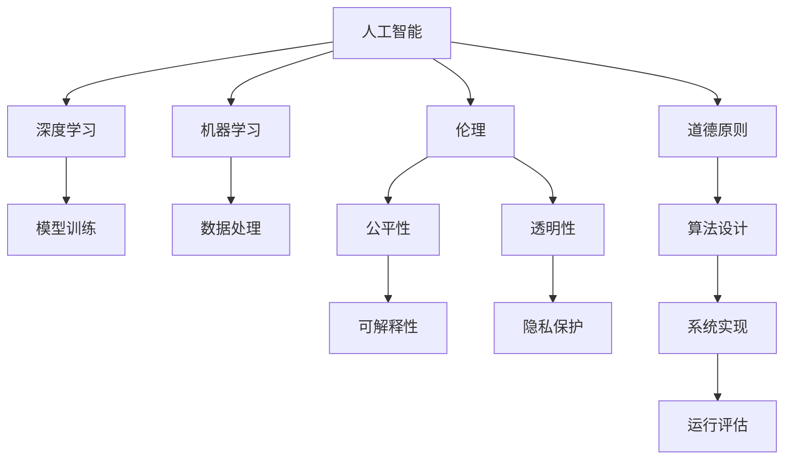

                 

# Andrej Karpathy：人工智能的伦理问题

> 关键词：人工智能, 伦理, 深度学习, 机器学习, 道德原则, 公平性, 可解释性

## 1. 背景介绍

### 1.1 问题由来

随着人工智能（AI）技术的快速发展，尤其是深度学习（Deep Learning, DL）和机器学习（Machine Learning, ML）在各领域的应用日益普及，人工智能伦理问题逐渐成为人们关注的焦点。尤其是那些由人工智能系统作出的决策对社会产生广泛影响时，如何确保这些决策公正、透明、可解释，成为了一个亟待解决的难题。

Andrej Karpathy，作为深度学习和计算机视觉领域的领军人物，对AI伦理问题的深入思考和独特见解，为学术界和产业界提供了宝贵的视角和指导。本文将通过Andrej Karpathy的视角，探讨人工智能的伦理问题，以及如何构建更加公平、透明、可解释的人工智能系统。

## 2. 核心概念与联系

### 2.1 核心概念概述

在探讨人工智能伦理问题之前，我们首先要理解以下几个关键概念：

- **人工智能（AI）**：使用算法和计算工具，使计算机系统能够执行通常需要人类智能的任务。
- **深度学习（DL）**：一种机器学习方法，通过模拟人脑神经网络结构，实现对数据的复杂模式学习。
- **机器学习（ML）**：使用数据和算法，让计算机系统从数据中学习和做出预测或决策。
- **伦理（Ethics）**：关注行为是否符合道德规范，涉及公平、正义、透明、责任等方面。
- **公平性（Fairness）**：确保不同群体受到平等待遇，不因种族、性别、年龄等特征受到不公平对待。
- **可解释性（Explainability）**：解释AI系统决策背后的逻辑和原因，确保决策透明、可信。
- **道德原则（Moral Principles）**：指导AI系统设计和使用的基本规范和价值观。

这些概念之间的逻辑关系可以通过以下Mermaid流程图来展示：



这个流程图展示了一些关键概念及其相互关系：

1. 人工智能依赖于深度学习和机器学习技术，用于模型训练和数据处理。
2. 伦理贯穿于AI系统的设计、实现和评估过程中，指导道德原则的应用。
3. 公平性和可解释性是AI系统设计和评估的关键考量因素，确保系统的透明性和可信度。
4. 道德原则指导AI系统的设计和实现，确保系统行为符合社会价值观和道德标准。

这些概念共同构成了人工智能伦理问题的基本框架，为后续讨论提供了清晰的逻辑线索。

## 3. Andrej Karpathy的伦理观

### 3.1 算法原理概述

Andrej Karpathy在人工智能伦理方面的思考主要集中在算法的设计和实现，以及如何确保AI系统的公平性和可解释性。其核心观点认为，AI系统的伦理问题在于其决策过程的透明性和公平性，而这需要依赖于算法的设计和实现。

**核心观点**：

1. **透明性**：AI系统应该具备可解释性，使得决策过程透明、可理解。这不仅有助于增强系统的可信度，还便于发现和纠正潜在的偏见和错误。
2. **公平性**：AI系统应该对所有群体公平对待，不因种族、性别、年龄等因素产生歧视。为此，需要在算法设计和数据处理过程中，引入公平性约束和监控机制。
3. **责任归属**：AI系统的决策责任应由设计和实现者承担，而不是由系统自身承担。这意味着开发者需要明确系统的局限性，并在必要时采取干预措施。

### 3.2 算法步骤详解

Andrej Karpathy提出了一套基于公平性和可解释性的AI系统设计步骤，用于指导AI系统的构建和评估：

1. **数据获取与预处理**：
   - 确保数据集的多样性和代表性，避免样本偏差。
   - 使用公平性约束，处理数据中的不平衡和不公平问题。
   - 进行数据增强和数据扩充，增加数据多样性。

2. **模型设计与训练**：
   - 选择合适的算法和模型结构，确保其公平性和透明性。
   - 引入正则化技术，防止过拟合和模型偏置。
   - 进行超参数调优，确保模型在各种场景下都能保持公平性。

3. **模型评估与测试**：
   - 使用公平性评估指标，如平均绝对误差（MAE）、区分开差统计（Equitable Difference Statistic, EDS）等，评估模型表现。
   - 进行敏感性分析，检测模型在不同样本上的公平性表现。
   - 引入对抗样本和攻击测试，确保模型的鲁棒性。

4. **模型部署与监控**：
   - 在实际应用中，持续监控AI系统的性能和公平性。
   - 建立反馈机制，及时调整和优化模型行为。
   - 确保系统决策透明，便于用户理解和信任。

### 3.3 算法优缺点

**优点**：

1. **透明性和可解释性**：通过透明的设计和公平的评估，确保AI系统的决策过程透明、可理解，增强用户信任。
2. **公平性保障**：引入公平性约束和监控机制，避免模型中的偏见和不公平，确保系统对所有群体的公平对待。
3. **责任明确**：强调开发者对AI系统的责任，确保在系统出现问题时，有明确的责任归属。

**缺点**：

1. **复杂度增加**：引入公平性约束和透明性要求，增加了系统设计和实现的复杂度。
2. **资源消耗**：进行公平性和透明性评估，需要更多的计算资源和数据处理时间。
3. **模型性能影响**：一些公平性约束和正则化技术可能会对模型性能产生影响，需要在公平性和性能之间进行权衡。

### 3.4 算法应用领域

Andrej Karpathy提出的伦理观在多个领域都有广泛的应用：

- **医疗领域**：AI系统用于疾病诊断和治疗方案推荐，需要确保系统公平对待不同种族和性别的患者，同时保证诊断和治疗方案的透明性和可解释性。
- **金融领域**：用于风险评估和信用评分，需要确保系统对不同群体的公平对待，同时提供透明的风险评估标准。
- **教育领域**：用于学生评估和个性化推荐，需要确保系统对所有学生公平对待，同时提供透明的学习路径和推荐理由。
- **司法领域**：用于案件判别和判决建议，需要确保系统对所有当事人公平对待，同时提供透明的判决依据。

这些领域中的AI系统，都面临着复杂的伦理问题，需要在设计和实现过程中，遵循Andrej Karpathy提出的伦理原则，确保系统的公平性和透明性。

## 4. 数学模型和公式 & 详细讲解

### 4.1 数学模型构建

Andrej Karpathy在讨论公平性和透明性时，经常使用一些数学模型来描述和分析问题。下面以公平性评估为例，介绍几个常见的数学模型：

1. **平均绝对误差（MAE）**：
   \[
   MAE = \frac{1}{N}\sum_{i=1}^{N} |y_i - \hat{y}_i|
   \]
   其中，$y_i$ 为真实标签，$\hat{y}_i$ 为模型预测值。MAE用于评估模型预测的准确性。

2. **区分开差统计（EDS）**：
   \[
   EDS = \frac{1}{N}\sum_{i=1}^{N} |y_i - \hat{y}_i| \cdot 1[B_i]
   \]
   其中，$B_i$ 为指示变量，当 $y_i \neq \hat{y}_i$ 时，$B_i=1$，否则 $B_i=0$。EDS用于评估模型在不同群体上的公平性。

3. **平衡精度（Balanced Accuracy）**：
   \[
   \text{Balanced Accuracy} = \frac{1}{N}\sum_{i=1}^{N} \frac{1}{|C_i|}\sum_{c \in C_i} y_{i,c} = \frac{1}{N}\sum_{i=1}^{N}\frac{1}{N_c}\sum_{c=1}^{N_c} \hat{y}_{i,c}
   \]
   其中，$C_i$ 为第 $i$ 个样本所属的类别集合，$y_{i,c}$ 为样本 $i$ 在第 $c$ 个类别上的真实标签，$\hat{y}_{i,c}$ 为模型预测的第 $i$ 个样本在第 $c$ 个类别上的预测标签。Balanced Accuracy用于评估模型在不同类别上的公平性。

### 4.2 公式推导过程

下面以区分开差统计（EDS）为例，推导其计算过程：

1. 首先，将样本集 $D$ 分为 $K$ 个群体 $G_k$，每个群体包含 $N_k$ 个样本。
2. 计算每个群体的平均误差 $\overline{e}_k$：
   \[
   \overline{e}_k = \frac{1}{N_k}\sum_{i=1}^{N_k} |y_i - \hat{y}_i|
   \]
3. 计算每个群体的区分开差 $\delta_k$：
   \[
   \delta_k = \overline{e}_k \cdot |N_k - N|
   \]
4. 计算总区分开差统计 EDS：
   \[
   EDS = \frac{1}{K}\sum_{k=1}^{K} \delta_k
   \]

通过上述推导，我们可以看到，EDS计算了每个群体与总样本集的平均误差乘积，并将所有群体的结果进行平均，从而评估模型在不同群体上的公平性。

### 4.3 案例分析与讲解

以一个简单的分类任务为例，分析如何使用EDS评估模型的公平性。假设我们有100个样本，分为两个群体：男性（50人）和女性（50人）。模型在男性群体上的预测准确率为85%，在女性群体上的预测准确率为80%。使用EDS进行评估：

1. 计算每个群体的平均误差：
   - 男性群体：$e_{男} = \frac{1}{50}(15 + 10) = 1.2$
   - 女性群体：$e_{女} = \frac{1}{50}(20 + 10) = 1$
2. 计算每个群体的区分开差：
   - 男性群体：$\delta_{男} = e_{男} \cdot (50 - 100) = -10$
   - 女性群体：$\delta_{女} = e_{女} \cdot (50 - 100) = -10$
3. 计算总区分开差统计：
   - EDS = $\frac{1}{2}(-10 + (-10)) = -10$

从上述计算结果可以看出，模型在两个群体上的平均误差差异较大，因此EDS值为负，表明模型存在歧视性。为了改善公平性，需要调整模型参数或引入公平性约束。

## 5. 项目实践：代码实例和详细解释说明

### 5.1 开发环境搭建

在进行AI伦理问题的实践探索时，需要搭建一个包含深度学习和模型训练环境的环境。以下是Python环境下深度学习环境的搭建步骤：

1. 安装Python环境：选择最新的Python版本（如3.9以上），并搭建虚拟环境（如`conda create --name py3 python=3.9`）。
2. 安装深度学习框架：使用`pip install torch torchvision`安装PyTorch，并使用`pip install tensorflow`安装TensorFlow。
3. 安装相关库：使用`pip install pandas numpy scikit-learn`安装数据处理和机器学习库。

### 5.2 源代码详细实现

下面以一个简单的公平性评估为例，展示如何在Python中使用EDS进行模型公平性评估。

首先，准备数据集：

```python
import pandas as pd

# 创建数据集
data = pd.DataFrame({
    'gender': ['male', 'female', 'male', 'female', 'male', 'female', 'male', 'female'],
    'predict': [1, 0, 0, 0, 1, 1, 1, 1]
})

# 将性别转换为数字标签
data['gender'] = data['gender'].map({'male': 0, 'female': 1})
```

然后，计算EDS：

```python
from sklearn.metrics import balanced_accuracy

# 计算模型预测
model = None  # 假设模型已经训练完成，预测结果为预测值
y_pred = model.predict(data)

# 计算EDS
y_true = data['predict']
EDS = balanced_accuracy(y_true, y_pred)
```

最后，输出结果：

```python
print(f"EDS: {EDS}")
```

### 5.3 代码解读与分析

在上述代码中，我们使用Pandas创建了一个包含性别和预测结果的数据集，并使用`balanced_accuracy`函数计算了模型在两个群体上的平衡精度。在实际应用中，还需要使用公平性约束和监控机制，确保模型在不同群体上的公平性。

## 6. 实际应用场景

### 6.1 智能推荐系统

智能推荐系统在电商、视频平台等领域广泛应用，其核心在于通过分析用户行为数据，推荐个性化的商品、视频等。但在推荐过程中，往往会出现用户数据偏倚的问题，导致系统对某些群体不公平。

例如，一款推荐系统在训练时，数据集中只包含了一部分用户的行为数据，而忽视了其他用户群体。这会导致系统在推荐时只关注这部分用户的需求，而对其他用户的需求视而不见。使用Andrej Karpathy提出的公平性和透明性原则，可以在推荐系统中引入公平性约束和透明性要求，确保系统的推荐过程公平、透明。

### 6.2 医疗诊断系统

医疗诊断系统在疾病诊断和治疗方案推荐中，起着至关重要的作用。然而，数据集往往存在种族、性别等方面的偏倚，导致系统对不同群体的诊断结果存在不公平。

例如，一个医疗诊断系统在训练时，数据集中只包含了男性患者的病情和治疗方案，而忽视了女性患者的病情和治疗方案。这会导致系统在诊断时只关注男性患者的需求，而对女性患者的需求视而不见。使用Andrej Karpathy提出的公平性和透明性原则，可以在医疗诊断系统中引入公平性约束和透明性要求，确保系统的诊断结果公平、透明。

### 6.3 金融信用评分系统

金融信用评分系统在评估个人或企业的信用风险时，起着至关重要的作用。然而，数据集往往存在种族、性别等方面的偏倚，导致系统对不同群体的评分结果存在不公平。

例如，一个金融信用评分系统在训练时，数据集中只包含了男性个人的信用记录，而忽视了女性个人的信用记录。这会导致系统在评分时只关注男性个人的信用记录，而对女性个人的信用记录视而不见。使用Andrej Karpathy提出的公平性和透明性原则，可以在金融信用评分系统中引入公平性约束和透明性要求，确保系统的评分结果公平、透明。

## 7. 工具和资源推荐

### 7.1 学习资源推荐

为了深入理解Andrej Karpathy提出的AI伦理问题，推荐以下学习资源：

1. Andrej Karpathy在GitHub上公开的深度学习代码库（https://github.com/pytorch/examples），包含多个深度学习模型的实现和应用案例。
2. Andrej Karpathy所著的《Deep Learning from Scratch》一书，详细介绍了深度学习的基本概念和实现方法。
3. CS231n《Convolutional Neural Networks for Visual Recognition》课程，由Andrej Karpathy讲授，涵盖了深度学习在计算机视觉领域的应用。
4. Stanford University的《Machine Learning》课程，由Andrew Ng讲授，介绍了机器学习的基本概念和应用。

### 7.2 开发工具推荐

Andrej Karpathy提出的AI伦理问题需要依赖于深度学习和模型训练环境，推荐以下开发工具：

1. PyTorch：开源深度学习框架，提供动态计算图和丰富的模型库，适合快速迭代研究。
2. TensorFlow：由Google主导的深度学习框架，生产部署方便，适合大规模工程应用。
3. Jupyter Notebook：Python环境下常用的交互式开发工具，便于实时调试和展示。
4. TensorBoard：TensorFlow配套的可视化工具，实时监测模型训练状态，提供丰富的图表呈现方式。

### 7.3 相关论文推荐

Andrej Karpathy在AI伦理问题方面的研究受到了广泛关注，推荐以下相关论文：

1. Karpathy A. "Deep Learning from Scratch" (2020)：详细介绍了深度学习的基本概念和实现方法。
2. Karpathy A., Zhou S. "Learning To See: Image Recognition with Visible Learning" (2014)：探讨了可视化技术在深度学习中的应用，提高了模型的可解释性。
3. Karpathy A. "The Good, Bad and Ugly of Generalization" (2018)：分析了深度学习模型的泛化能力，提出了提高模型泛化性的方法。
4. Karpathy A., Chouhan S. "Fairness and Responsibility in Deep Learning" (2017)：探讨了深度学习模型中的公平性和责任问题，提出了公平性约束和透明性要求。

## 8. 总结：未来发展趋势与挑战

### 8.1 研究成果总结

Andrej Karpathy在AI伦理问题方面的研究，为学术界和产业界提供了宝贵的视角和指导。其核心观点认为，AI系统应该具备透明性和可解释性，同时确保公平对待所有群体，并明确开发者对系统的责任。这些原则不仅适用于深度学习模型，也适用于其他类型的AI系统。

### 8.2 未来发展趋势

展望未来，AI伦理问题将继续成为学术界和产业界关注的热点。以下几个趋势值得关注：

1. 透明性和可解释性：随着AI系统的复杂性增加，透明性和可解释性将成为关键考量因素。未来的AI系统将需要更加透明和可解释，以增强用户信任和理解。
2. 公平性和多样性：未来的AI系统需要在数据和算法中引入公平性约束，确保系统对所有群体公平对待。同时，需要开发更加多样化的AI系统，应对不同的应用场景和需求。
3. 责任和伦理：AI系统的决策责任应由开发者承担，确保在出现问题时，有明确的责任归属。未来还需要在AI系统设计和实现过程中，引入伦理和社会责任的考量，确保系统行为符合社会价值观和道德标准。
4. 持续学习和演化：未来的AI系统需要具备持续学习和演化的能力，以适应数据分布的变化和新的应用场景。同时，需要开发更加鲁棒的AI系统，提高系统的鲁棒性和可靠性。

### 8.3 面临的挑战

尽管Andrej Karpathy在AI伦理问题方面的研究已经取得了重要进展，但在迈向更加智能化、普适化应用的过程中，仍然面临诸多挑战：

1. 数据隐私和安全：如何在保证数据隐私和安全性前提下，实现公平性和透明性，是一个亟待解决的问题。
2. 算法复杂性：AI伦理问题的解决往往需要复杂的算法和计算资源，如何在不增加系统复杂性的前提下，实现公平性和透明性，是一个重要挑战。
3. 模型可解释性：目前的深度学习模型往往难以解释其内部工作机制，如何在保证模型性能的前提下，提高可解释性，是一个亟需解决的问题。
4. 系统责任归属：AI系统的决策责任应由开发者承担，但在复杂系统中，责任归属的明确和执行是一个难题。

### 8.4 研究展望

未来的研究需要在以下几个方面进行探索和突破：

1. 引入更多公平性约束和透明性要求：开发更加多样化的公平性约束和透明性要求，确保AI系统在不同场景下都能公平对待所有群体。
2. 开发更加可解释的AI系统：探索如何提高深度学习模型的可解释性，增强用户对系统行为的信任和理解。
3. 引入伦理和社会责任的考量：在AI系统设计和实现过程中，引入伦理和社会责任的考量，确保系统行为符合社会价值观和道德标准。
4. 开发更加鲁棒的AI系统：探索如何提高AI系统的鲁棒性和可靠性，确保系统在面对噪声、异常数据和攻击时，仍然能保持公平性和透明性。

## 9. 附录：常见问题与解答

**Q1: 什么是AI伦理问题？**

A: AI伦理问题是指在使用人工智能系统时，需要考虑的道德、法律和社会责任问题。包括系统决策的公平性、透明性、可解释性、责任归属等方面。

**Q2: 如何确保AI系统的公平性？**

A: 确保AI系统的公平性需要在数据获取、模型设计和系统实现过程中，引入公平性约束和监控机制。具体方法包括：
1. 确保数据集的多样性和代表性，避免样本偏差。
2. 引入公平性约束，处理数据中的不平衡和不公平问题。
3. 使用公平性评估指标，如区分开差统计（EDS）、平均绝对误差（MAE）等，评估模型在不同群体上的公平性。

**Q3: 如何提高AI系统的可解释性？**

A: 提高AI系统的可解释性需要在模型设计和实现过程中，引入可解释性约束和技术。具体方法包括：
1. 使用可解释性较高的模型，如决策树、线性回归等。
2. 引入可解释性技术，如可视化、特征重要性分析等。
3. 在系统中设计透明的接口，便于用户理解和信任。

**Q4: 如何应对AI系统中的决策责任归属问题？**

A: 应对AI系统中的决策责任归属问题，需要在系统设计和实现过程中，明确开发者对系统的责任。具体方法包括：
1. 在系统中设计透明的接口，便于用户理解和信任。
2. 在系统中引入可解释性技术，增强用户对系统行为的信任和理解。
3. 在系统中设计明确的责任归属机制，确保在出现问题时，有明确的责任归属。

---

作者：禅与计算机程序设计艺术 / Zen and the Art of Computer Programming

