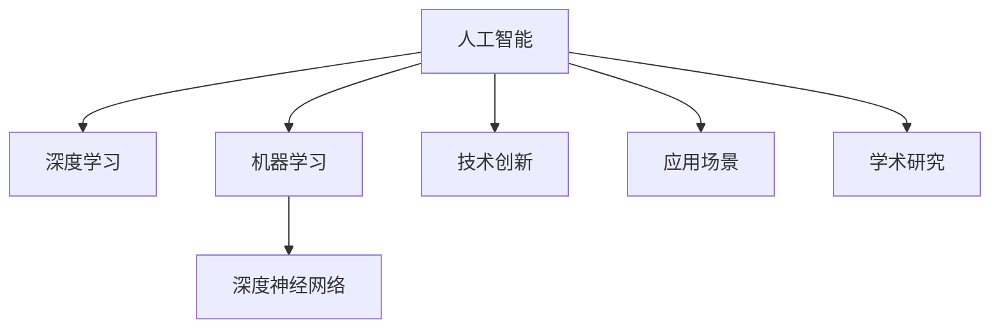

                 

# Andrej Karpathy：人工智能的未来发展挑战

> 关键词：人工智能,未来发展,挑战,Andrej Karpathy,深度学习,机器学习,深度神经网络,技术创新,应用场景,学术研究

## 1. 背景介绍

Andrej Karpathy是当今深度学习和计算机视觉领域的领军人物之一，斯坦福大学教授，OpenAI资深研究员，曾在人工智能和计算机视觉领域发表多篇突破性论文，对深度学习的发展产生了深远影响。他的研究跨越多个领域，从计算机视觉、自然语言处理、增强学习，到深度神经网络体系架构的创新，均展现出了前瞻性的洞察力。本文将深入探讨Andrej Karpathy对人工智能未来发展的展望，并分析其面临的主要挑战。

## 2. 核心概念与联系

### 2.1 核心概念概述

1. **人工智能（AI）**：利用计算机模拟人类智能行为，包括学习、推理、感知、决策、自然语言处理、图像识别、语音识别等。
2. **深度学习（Deep Learning）**：一种机器学习方法，基于多层神经网络模型，能够从数据中学习到特征表示，广泛应用于图像识别、语音识别、自然语言处理等领域。
3. **机器学习（Machine Learning）**：通过数据训练模型，使其能够自动学习规律并作出决策的算法，广泛应用于金融、医疗、推荐系统等领域。
4. **深度神经网络（Deep Neural Network）**：具有多层的神经网络结构，能够自动抽取数据中的高级特征，广泛应用于计算机视觉、自然语言处理等领域。
5. **技术创新**：指通过新的算法、模型架构、硬件优化等方法，提升AI系统的性能和效率。
6. **应用场景**：AI技术在不同领域的具体应用，如自动驾驶、医疗诊断、智能客服等。
7. **学术研究**：在AI领域的科学研究和创新，推动技术进步和应用拓展。

这些核心概念之间的关系可以通过以下Mermaid流程图来展示：



这个流程图展示了大语言模型微调的各个概念之间的联系。人工智能通过深度学习和机器学习技术创新，推动应用场景的发展和学术研究的深入。

## 3. 核心算法原理 & 具体操作步骤

### 3.1 算法原理概述

Andrej Karpathy指出，人工智能的未来发展将面临多方面的挑战，其中最重要的是技术的可持续发展和伦理问题。以下是几个关键领域：

1. **模型可解释性**：当前的深度学习模型在实际应用中往往表现为"黑盒"，难以解释其决策过程。未来的AI模型需要具备更高的可解释性，以增强用户信任和透明度。

2. **数据隐私与安全**：AI模型在训练和应用中对大量数据的需求，涉及隐私保护和数据安全问题。如何平衡数据利用和隐私保护，是未来AI发展的重要挑战。

3. **模型公平性**：AI模型可能继承并放大训练数据中的偏见，导致模型决策的公平性问题。未来的AI系统需要更为公平的算法和机制，避免歧视和不公。

4. **模型鲁棒性与泛化能力**：AI模型在面对新数据和新场景时，需要具备良好的鲁棒性和泛化能力。未来的AI模型需要更加稳健，能够应对复杂多变的环境。

5. **计算资源与成本**：大规模的AI模型训练和推理需要大量的计算资源，如何降低成本，提高效率，是未来的技术挑战之一。

### 3.2 算法步骤详解

基于Andrej Karpathy的研究，以下是一些关键步骤和细节：

1. **数据准备**：收集并预处理大量高质量数据，用于训练和验证AI模型。数据准备环节需要特别注意数据的多样性和代表性，避免过拟合。

2. **模型选择与设计**：选择合适的模型架构和算法，并进行相应的设计。常用的模型包括卷积神经网络（CNN）、循环神经网络（RNN）、变换器（Transformer）等。

3. **训练过程**：在大量数据上训练AI模型，通过反向传播等优化算法，调整模型参数。训练过程需要特别注意学习率的调整、正则化、早停策略等。

4. **模型评估与优化**：在验证集上评估模型性能，并通过交叉验证、超参数调优等方法，进一步提升模型效果。

5. **部署与应用**：将训练好的模型部署到实际应用中，并进行持续监控和优化。

### 3.3 算法优缺点

#### 优点：

1. **高精度与泛化能力**：深度学习模型在特定任务上能够达到高精度，并且具有良好的泛化能力。

2. **自动特征学习**：通过多层次的神经网络，自动学习数据的特征表示。

3. **快速迭代**：模型训练和优化过程中，可以不断调整参数，实现快速迭代和优化。

#### 缺点：

1. **模型复杂性**：深度学习模型参数量大，结构复杂，难以解释和调试。

2. **数据依赖性**：模型性能高度依赖于数据的质量和数量，获取高质量数据成本较高。

3. **计算资源需求高**：大规模模型的训练和推理需要大量的计算资源，成本较高。

4. **过拟合风险**：模型在训练数据上表现优异，但在测试数据上可能表现不佳，存在过拟合风险。

### 3.4 算法应用领域

AI技术在众多领域都有广泛的应用，以下是一些主要领域：

1. **医疗领域**：AI在医疗影像诊断、基因组学、药物研发等方面，能够显著提升诊断精度和效率。

2. **金融领域**：AI在风险控制、投资分析、客户服务等方面，能够提高金融机构的决策效率和客户满意度。

3. **自动驾驶**：AI在自动驾驶领域，通过计算机视觉、感知、决策等技术，实现无人驾驶汽车。

4. **自然语言处理**：AI在机器翻译、语音识别、自然语言生成等方面，能够实现高效的语言处理。

5. **机器人技术**：AI在机器人视觉、控制、感知等方面，能够提升机器人自主性和智能化水平。

6. **工业制造**：AI在智能制造、预测维护、质量控制等方面，能够提升生产效率和产品品质。

## 4. 数学模型和公式 & 详细讲解 & 举例说明

### 4.1 数学模型构建

Andrej Karpathy指出，深度学习模型的数学模型主要基于多层神经网络，通常包括以下几个部分：

1. **输入层**：接收原始数据，如图像像素、文本单词等。
2. **隐藏层**：通过多层神经网络，自动学习数据的特征表示。
3. **输出层**：根据任务的性质，输出相应的结果，如分类、回归、生成等。

以图像分类任务为例，数学模型可以表示为：

$$
y = M(x; \theta) = \sigma(W_n \sigma(W_{n-1} ... \sigma(W_1 x + b_1) + b_2) + ... + b_n)
$$

其中，$x$ 为输入图像，$y$ 为分类结果，$W_i$ 为权重矩阵，$b_i$ 为偏置向量，$\sigma$ 为激活函数。

### 4.2 公式推导过程

以卷积神经网络（CNN）为例，其核心思想是通过卷积和池化操作，自动学习图像中的特征。公式推导过程如下：

1. **卷积操作**：

$$
C_{i,j} = \sum_k W_{i,j,k} * I_{i+k,j+m} + b_i
$$

其中，$C$ 为卷积结果，$I$ 为输入图像，$W$ 为卷积核，$b$ 为偏置项，$i$ 和 $j$ 表示位置。

2. **池化操作**：

$$
C'_{i,j} = \max_{i,j} C_{i,j}
$$

其中，$C'$ 为池化结果，$C$ 为卷积结果，$max$ 表示取最大值。

3. **反向传播**：

$$
\frac{\partial L}{\partial W} = \frac{\partial L}{\partial O} \cdot \frac{\partial O}{\partial H} \cdot \frac{\partial H}{\partial W}
$$

其中，$L$ 为损失函数，$O$ 为输出结果，$H$ 为隐藏层结果，$\partial$ 表示偏导数。

### 4.3 案例分析与讲解

以图像识别任务为例，通过卷积神经网络对图像进行特征提取，并通过全连接层进行分类。以下是具体实现步骤：

1. **数据准备**：收集并预处理图像数据集，如CIFAR-10、MNIST等。

2. **模型选择**：选择卷积神经网络作为模型架构，包括卷积层、池化层、全连接层等。

3. **模型训练**：使用反向传播算法，通过训练数据对模型进行优化。

4. **模型评估**：在验证集上评估模型性能，并进行超参数调优。

5. **模型部署**：将训练好的模型部署到实际应用中，如图像识别系统、自动驾驶汽车等。

## 5. 项目实践：代码实例和详细解释说明

### 5.1 开发环境搭建

以下是使用Python和TensorFlow搭建深度学习模型的环境：

1. **安装Anaconda**：从官网下载并安装Anaconda，用于创建独立的Python环境。

2. **创建虚拟环境**：
```bash
conda create -n tf-env python=3.7
conda activate tf-env
```

3. **安装TensorFlow**：
```bash
pip install tensorflow-gpu==2.6.0
```

4. **安装其他库**：
```bash
pip install numpy pandas scikit-learn matplotlib
```

完成环境配置后，即可进行深度学习模型的开发。

### 5.2 源代码详细实现

以下是一个简单的卷积神经网络模型实现，用于图像分类任务：

```python
import tensorflow as tf
from tensorflow.keras import layers

class CNNModel(tf.keras.Model):
    def __init__(self):
        super(CNNModel, self).__init__()
        self.conv1 = layers.Conv2D(32, (3, 3), activation='relu', padding='same')
        self.maxpool1 = layers.MaxPooling2D((2, 2), padding='same')
        self.flatten = layers.Flatten()
        self.fc1 = layers.Dense(64, activation='relu')
        self.fc2 = layers.Dense(10, activation='softmax')

    def call(self, x):
        x = self.conv1(x)
        x = self.maxpool1(x)
        x = self.flatten(x)
        x = self.fc1(x)
        x = self.fc2(x)
        return x

model = CNNModel()
model.summary()
```

### 5.3 代码解读与分析

**CNNModel类**：
- `__init__`方法：初始化卷积层、池化层、全连接层等。
- `call`方法：定义前向传播过程，通过多层网络结构提取图像特征并分类。

**model.summary()**：
- 用于输出模型的结构信息，包括层数、节点数、激活函数等。

## 6. 实际应用场景

### 6.1 医疗领域

AI在医疗领域的应用包括图像识别、基因组学、药物研发等方面。例如，使用深度学习模型对医学影像进行分类，通过自动化的方式识别病灶位置和大小，辅助医生进行诊断。

### 6.2 金融领域

AI在金融领域的应用包括风险控制、投资分析、客户服务等方面。例如，使用深度学习模型对金融数据进行分析和预测，识别市场趋势，辅助投资者进行决策。

### 6.3 自动驾驶

AI在自动驾驶领域的应用包括计算机视觉、感知、决策等技术。例如，使用深度学习模型对道路环境进行感知，识别交通标志、行人、车辆等，辅助自动驾驶汽车进行决策和导航。

### 6.4 自然语言处理

AI在自然语言处理领域的应用包括机器翻译、语音识别、自然语言生成等。例如，使用深度学习模型对自然语言进行处理，实现自动翻译、语音识别和生成等任务。

## 7. 工具和资源推荐

### 7.1 学习资源推荐

以下是几本深度学习和计算机视觉领域的经典书籍：

1. **《深度学习》（Deep Learning）**：Ian Goodfellow、Yoshua Bengio、Aaron Courville著。

2. **《动手学深度学习》（Dive Into Deep Learning）**：李沐著。

3. **《计算机视觉：算法与应用》（Computer Vision: Algorithms, Applications, and Challenges）**：Aravind S. A. Krishnan著。

4. **《机器学习实战》（Python Machine Learning）**：Sebastian Raschka著。

### 7.2 开发工具推荐

以下是几个常用的深度学习开发工具：

1. **PyTorch**：由Facebook开发的深度学习框架，灵活性高，支持动态图和静态图。

2. **TensorFlow**：由Google开发的深度学习框架，生产部署方便，支持分布式训练。

3. **Keras**：基于TensorFlow的高层次API，简洁易用，适合快速原型开发。

4. **MXNet**：由Apache开发的深度学习框架，支持多种编程语言，支持分布式训练。

### 7.3 相关论文推荐

以下是几篇影响深远的深度学习和计算机视觉领域的论文：

1. **AlexNet**：Alex Krizhevsky等。

2. **VGGNet**：Karen Simonyan、Andrew Zisserman等。

3. **GoogLeNet**：Christian Szegedy等。

4. **ResNet**：Kaiming He等。

5. **Transformer**：Ashish Vaswani等。

## 8. 总结：未来发展趋势与挑战

### 8.1 研究成果总结

Andrej Karpathy在深度学习和计算机视觉领域发表了大量高质量论文，推动了AI技术的不断进步。其主要研究内容包括：

1. **卷积神经网络（CNN）**：提出了CNN的基本结构和优化方法，提升了图像识别精度。

2. **循环神经网络（RNN）**：提出了LSTM和GRU等长短期记忆网络，解决了序列数据处理问题。

3. **深度神经网络（DNN）**：提出了Transformer等新型网络结构，提升了自然语言处理效果。

4. **增强学习（RL）**：在自动驾驶、机器人等领域，提出基于深度学习的增强学习算法，提高了智能化水平。

### 8.2 未来发展趋势

1. **模型可解释性**：未来的AI模型需要具备更高的可解释性，以增强用户信任和透明度。

2. **数据隐私与安全**：AI模型在训练和应用中对大量数据的需求，涉及隐私保护和数据安全问题。

3. **模型公平性**：未来的AI系统需要更为公平的算法和机制，避免歧视和不公。

4. **模型鲁棒性与泛化能力**：未来的AI模型需要更加稳健，能够应对复杂多变的环境。

5. **计算资源与成本**：大规模的AI模型训练和推理需要大量的计算资源，如何降低成本，提高效率，是未来的技术挑战之一。

### 8.3 面临的挑战

1. **模型复杂性**：深度学习模型参数量大，结构复杂，难以解释和调试。

2. **数据依赖性**：模型性能高度依赖于数据的质量和数量，获取高质量数据成本较高。

3. **计算资源需求高**：大规模模型的训练和推理需要大量的计算资源，成本较高。

4. **过拟合风险**：模型在训练数据上表现优异，但在测试数据上可能表现不佳，存在过拟合风险。

5. **伦理与安全性**：AI模型可能继承并放大训练数据中的偏见，导致模型决策的公平性问题。

### 8.4 研究展望

未来AI研究需要重点关注以下几个方面：

1. **可解释性与透明性**：提升AI模型的可解释性，增强用户信任和透明度。

2. **隐私保护与数据安全**：研究隐私保护技术，确保数据安全和用户隐私。

3. **公平性与公正性**：开发公平性算法，避免歧视和不公，确保AI系统的公正性。

4. **鲁棒性与泛化能力**：提升AI模型的鲁棒性和泛化能力，应对复杂多变的环境。

5. **计算资源与成本**：优化计算资源使用，降低成本，提升AI系统的效率。

6. **伦理与安全性**：研究伦理导向的评估指标，确保AI系统的伦理性和安全性。

7. **跨领域融合**：将AI技术与多学科知识进行融合，提升跨领域应用能力。

8. **可持续性与可扩展性**：确保AI技术的可持续性，并提高系统的可扩展性。

总之，AI技术在未来的发展过程中，需要兼顾技术进步和伦理、安全等问题，才能真正实现其社会价值。

## 9. 附录：常见问题与解答

**Q1: 如何提高AI模型的可解释性？**

A: 提高AI模型的可解释性需要从多个方面进行改进：

1. **可视化技术**：使用可视化工具，如TensorBoard、Visdom等，可视化模型的内部结构和学习过程。

2. **注意力机制**：引入注意力机制，解释模型在输入数据中关注的重点。

3. **可解释性层**：设计可解释性层，解释模型对输入数据的理解。

4. **解释性模型**：使用解释性模型，如LIME、SHAP等，解释模型的决策过程。

**Q2: 如何保护数据隐私？**

A: 保护数据隐私需要从多个方面进行改进：

1. **差分隐私**：通过加入噪声，保护数据隐私，避免数据泄露。

2. **联邦学习**：在分布式环境中进行模型训练，保护数据隐私。

3. **加密技术**：使用加密技术，保护数据在传输和存储过程中的安全性。

4. **隐私计算**：使用隐私计算技术，在保护数据隐私的前提下进行数据处理。

**Q3: 如何降低AI模型的计算成本？**

A: 降低AI模型的计算成本需要从多个方面进行改进：

1. **模型压缩**：通过模型压缩技术，减少模型参数和计算量。

2. **量化加速**：使用量化加速技术，将浮点数模型转换为定点模型，减少存储空间和计算量。

3. **模型并行**：使用模型并行技术，提高计算效率。

4. **分布式训练**：使用分布式训练技术，提高训练速度。

5. **硬件优化**：使用GPU、TPU等高性能硬件，提高计算效率。

**Q4: 如何提高AI模型的鲁棒性？**

A: 提高AI模型的鲁棒性需要从多个方面进行改进：

1. **数据增强**：使用数据增强技术，增加训练数据的多样性。

2. **正则化**：使用正则化技术，避免过拟合。

3. **对抗训练**：使用对抗训练技术，提高模型的鲁棒性。

4. **鲁棒性模型**：使用鲁棒性模型，如Inception、VGG等，提高模型的鲁棒性。

总之，未来的AI技术需要从多个方面进行改进，才能在实际应用中发挥更大的价值。

---

作者：禅与计算机程序设计艺术 / Zen and the Art of Computer Programming

