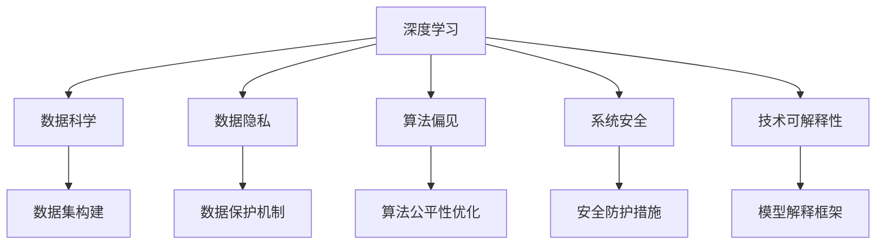

                 

# Andrej Karpathy：人工智能的未来发展挑战

> 关键词：人工智能, 未来发展, 技术挑战, 创新驱动, 深度学习, 数据科学, 研究前沿

## 1. 背景介绍

### 1.1 问题由来
Andrej Karpathy 是深度学习领域的先驱之一，曾任OpenAI资深AI研究员，现任Stanford大学教授。他对深度学习的研究和教学有着深远的影响。Karpathy的思考和论述，往往能引导我们更深入地思考人工智能技术的发展方向。本文将基于Karpathy的视角，探讨人工智能未来可能面临的若干挑战，并分析应对之策。

## 2. 核心概念与联系

### 2.1 核心概念概述
人工智能(AI)技术经过数十年的发展，已经从早期的专家系统、机器学习、深度学习等阶段逐步成熟。当前，AI正在广泛渗透到各行各业，推动着社会的深度变革。然而，AI技术的快速发展也伴随着一系列挑战，如数据隐私、算法偏见、系统安全等。

为更好地理解这些挑战，本节将介绍一些关键概念：

- **深度学习(Deep Learning)**：一种基于神经网络的机器学习技术，通过多层次的抽象，可以处理复杂、高维度的数据。
- **数据科学(Data Science)**：利用统计学、机器学习等方法，从海量数据中提取信息，推动决策和业务分析。
- **数据隐私(Data Privacy)**：保护用户个人信息不被不当使用和泄露，是AI应用中的重要议题。
- **算法偏见(Bias in Algorithms)**：AI系统在训练数据中学习到的模式，可能对某些群体存在歧视性。
- **系统安全(Security of AI Systems)**：确保AI系统不受攻击，避免被恶意利用。
- **技术可解释性(Explainability of AI)**：使AI决策过程透明、可理解，有助于提升信任度。

这些概念之间的关系可以通过以下Mermaid流程图来展示：



这个流程图展示了几大关键概念之间的联系：

1. 深度学习依赖数据科学的支持，通过数据驱动的模型构建，提升AI性能。
2. 数据隐私和算法偏见是AI系统的重要考量，关系到模型的公平性和道德性。
3. 系统安全和模型可解释性是确保AI系统可靠性的重要保障。
4. 数据集构建、算法公平性优化、安全防护措施和模型解释框架，共同构成了AI系统的技术支撑。

## 3. 核心算法原理 & 具体操作步骤
### 3.1 算法原理概述

人工智能的发展离不开算法的创新和优化。深度学习作为当前AI的核心算法，其原理基于多层神经网络对输入数据进行抽象和表示。其主要步骤如下：

1. **数据预处理**：将原始数据转化为模型可处理的形式。
2. **模型训练**：利用已标注数据对神经网络进行训练，调整网络参数以最小化损失函数。
3. **模型评估**：在验证集上评估模型的泛化性能，避免过拟合。
4. **模型应用**：将训练好的模型应用于新数据，进行推理预测。

### 3.2 算法步骤详解

以下是深度学习模型训练的一般流程：

1. **数据预处理**：
   - 数据清洗：去除噪声和异常值。
   - 数据增强：通过旋转、裁剪等方式扩充数据集，提高模型的泛化能力。
   - 数据标准化：将数据归一化到特定的范围，加快模型收敛速度。

2. **模型构建**：
   - 选择网络结构：如卷积神经网络(CNN)、循环神经网络(RNN)、Transformer等。
   - 定义损失函数：如交叉熵、均方误差等，用于衡量模型预测与真实标签的差异。
   - 设置优化器：如SGD、Adam等，用于更新模型参数。

3. **模型训练**：
   - 划分训练集、验证集和测试集。
   - 设置学习率、批大小等超参数。
   - 迭代训练，使用反向传播算法计算梯度并更新参数。

4. **模型评估**：
   - 在验证集上计算评估指标，如准确率、召回率、F1-score等。
   - 绘制学习曲线，监控模型性能变化。
   - 通过早停法(Early Stopping)避免过拟合。

5. **模型应用**：
   - 使用训练好的模型在新数据上推理预测。
   - 对模型输出进行后处理，如阈值调整、归一化等。
   - 部署模型至生产环境，提供服务。

### 3.3 算法优缺点

深度学习在处理图像、语音、自然语言处理等领域表现优异，但也存在一些限制：

**优点**：
- 能够处理非结构化数据。
- 通过大规模数据训练，可以提取到丰富的特征。
- 在特定任务上，表现优于传统机器学习方法。

**缺点**：
- 需要大量标注数据。
- 模型训练复杂度高，计算资源需求大。
- 模型可解释性差，难以理解内部决策过程。
- 对抗样本脆弱，易被攻击。
- 对数据分布变化敏感，泛化能力有限。

尽管存在这些缺点，深度学习仍然是当前AI技术的主流方向，能够处理复杂的非结构化数据，为各行各业带来深远影响。

### 3.4 算法应用领域

深度学习已经广泛应用于多个领域，例如：

- **计算机视觉**：如图像识别、目标检测、图像分割等。
- **自然语言处理**：如机器翻译、文本生成、语音识别等。
- **自动驾驶**：如自动驾驶汽车、智能交通系统等。
- **医疗健康**：如疾病诊断、医疗影像分析等。
- **金融服务**：如风险评估、信用评分等。
- **游戏与娱乐**：如视频游戏、虚拟现实等。

## 4. 数学模型和公式 & 详细讲解 & 举例说明

### 4.1 数学模型构建

深度学习的数学模型主要基于神经网络。以卷积神经网络为例，其基本模型结构如下：

$$
\mathcal{F}(x; \theta) = h^{(L)}(x; \theta)
$$

其中，$h^{(L)}$ 为深度网络的第 $L$ 层输出，$x$ 为输入数据，$\theta$ 为网络参数。

### 4.2 公式推导过程

卷积神经网络中的卷积操作可以表示为：

$$
h^{(l)}_i(x) = \sum_{j=0}^{k-1} w_j^{(l)} x_i^{(l-1)} * g_{i+j}^{(l)}
$$

其中，$w_j^{(l)}$ 为卷积核，$x_i^{(l-1)}$ 为第 $l-1$ 层的输出，$g_{i+j}^{(l)}$ 为第 $l$ 层的输出。

### 4.3 案例分析与讲解

以图像分类任务为例，使用卷积神经网络进行图像分类的过程如下：

1. **数据预处理**：将图像数据标准化，并划分为训练集、验证集和测试集。
2. **模型构建**：选择卷积神经网络结构，设置多个卷积层和池化层，加上全连接层输出分类结果。
3. **模型训练**：在训练集上使用反向传播算法进行梯度下降，调整网络参数。
4. **模型评估**：在验证集上计算准确率、召回率等指标，监控模型性能。
5. **模型应用**：将训练好的模型应用于新图像数据，进行分类预测。

## 5. 项目实践：代码实例和详细解释说明

### 5.1 开发环境搭建

以下是使用PyTorch进行卷积神经网络训练的开发环境搭建流程：

1. 安装Anaconda：从官网下载并安装Anaconda，用于创建独立的Python环境。
2. 创建并激活虚拟环境：
```bash
conda create -n pytorch-env python=3.8 
conda activate pytorch-env
```

3. 安装PyTorch：根据CUDA版本，从官网获取对应的安装命令。例如：
```bash
conda install pytorch torchvision torchaudio cudatoolkit=11.1 -c pytorch -c conda-forge
```

4. 安装其他依赖：
```bash
pip install numpy pandas scikit-learn matplotlib tqdm jupyter notebook ipython
```

### 5.2 源代码详细实现

以下是使用PyTorch进行图像分类任务训练的完整代码实现：

```python
import torch
import torch.nn as nn
import torch.optim as optim
import torchvision.transforms as transforms
from torchvision.datasets import CIFAR10
from torchvision.models import resnet18
from torch.utils.data import DataLoader

# 数据预处理
transform = transforms.Compose([
    transforms.Resize(256),
    transforms.CenterCrop(224),
    transforms.ToTensor(),
    transforms.Normalize(mean=[0.485, 0.456, 0.406], std=[0.229, 0.224, 0.225])
])

# 加载CIFAR-10数据集
train_set = CIFAR10(root='data', train=True, download=True, transform=transform)
train_loader = DataLoader(train_set, batch_size=128, shuffle=True)

# 定义模型
model = resnet18()

# 定义损失函数和优化器
criterion = nn.CrossEntropyLoss()
optimizer = optim.SGD(model.parameters(), lr=0.01, momentum=0.9)

# 训练过程
for epoch in range(10):
    running_loss = 0.0
    for i, data in enumerate(train_loader, 0):
        inputs, labels = data
        optimizer.zero_grad()
        outputs = model(inputs)
        loss = criterion(outputs, labels)
        loss.backward()
        optimizer.step()
        running_loss += loss.item()
    print('Epoch [%d/%d], loss: %.4f' % (epoch + 1, 10, running_loss / len(train_loader)))

# 评估模型
test_set = CIFAR10(root='data', train=False, download=True, transform=transform)
test_loader = DataLoader(test_set, batch_size=128, shuffle=False)

correct = 0
total = 0
with torch.no_grad():
    for data in test_loader:
        images, labels = data
        outputs = model(images)
        _, predicted = torch.max(outputs.data, 1)
        total += labels.size(0)
        correct += (predicted == labels).sum().item()

print('Accuracy of the network on the 10000 test images: %d %%' % (100 * correct / total))
```

### 5.3 代码解读与分析

**数据预处理**：
- `transform`定义了数据预处理流程，包括调整图像大小、中心裁剪、转换为张量等步骤。
- `transform.Normalize`将图像数据标准化，以适应模型的输入需求。

**模型定义**：
- `resnet18`是预定义的ResNet18模型，适合于图像分类任务。

**训练过程**：
- `criterion`定义了交叉熵损失函数。
- `optimizer`使用SGD优化器，设置学习率为0.01，动量为0.9。
- 在每个epoch中，循环遍历训练集数据，进行前向传播和反向传播，更新模型参数。

**模型评估**：
- 使用测试集数据评估模型性能，计算准确率。

**代码亮点**：
- 使用`torch.utils.data.DataLoader`对数据集进行批次化处理，方便模型的训练和推理。
- 通过`torch.no_grad()`在测试过程中关闭梯度计算，避免不必要的内存占用。
- 在每个epoch结束后，打印训练损失和测试准确率，监控模型训练效果。

## 6. 实际应用场景

### 6.1 智能监控

智能监控系统通过深度学习算法对视频流进行实时分析和处理，可以自动识别异常行为、异常事件等。例如，在公共场所中，监控系统可以通过人脸识别技术识别可疑人员，及时发出警报。

在技术实现上，可以通过预训练的人脸识别模型，结合特定场景的任务数据进行微调，以提升识别精度。同时，通过对抗训练等方法，增强模型的鲁棒性和泛化能力，减少误报和漏报。

### 6.2 智能推荐系统

智能推荐系统通过深度学习算法，根据用户历史行为数据，推荐个性化的产品或服务。例如，电商网站可以根据用户浏览历史、购买记录等数据，推荐用户可能感兴趣的商品。

在技术实现上，可以使用深度学习模型进行用户兴趣的建模和推荐。通过协同过滤、内容推荐等多种算法，结合用户反馈数据进行模型微调，提升推荐效果。

### 6.3 金融风险管理

金融机构通过深度学习算法，对大量历史数据进行分析，预测市场趋势，管理风险。例如，通过预测股票价格变化，帮助投资者做出更理性的投资决策。

在技术实现上，可以使用深度学习模型进行时间序列分析和预测。通过构建基于LSTM的模型，结合市场数据、经济指标等特征进行微调，提升预测准确度。

### 6.4 未来应用展望

随着深度学习技术的发展，未来AI将在更多领域得到广泛应用，为人类生活和工作带来深远影响。例如：

- **智慧城市**：通过深度学习算法，优化城市交通、能源管理等，提升城市运行效率。
- **医疗健康**：利用深度学习算法进行疾病诊断、影像分析等，提高医疗服务水平。
- **自动驾驶**：通过深度学习算法，实现自动驾驶汽车的技术突破，提升交通安全。
- **工业制造**：利用深度学习算法进行故障预测、质量检测等，提升制造效率和质量。
- **教育培训**：利用深度学习算法进行个性化教学、智能评估等，提升教育质量。

## 7. 工具和资源推荐

### 7.1 学习资源推荐

为了帮助开发者系统掌握深度学习技术，这里推荐一些优质的学习资源：

1. **《深度学习》书籍**：由Ian Goodfellow、Yoshua Bengio和Aaron Courville合著，全面介绍了深度学习的基本概念和前沿技术。
2. **Coursera深度学习课程**：由Andrew Ng教授开设，系统讲解深度学习的理论基础和实践应用。
3. **Kaggle竞赛平台**：提供大量机器学习和深度学习竞赛，练习和应用深度学习算法。
4. **PyTorch官方文档**：提供了丰富的深度学习模型和优化算法，适合实践和研究。
5. **TensorFlow官方文档**：提供了深度学习模型的构建和训练，适合工程应用。

### 7.2 开发工具推荐

高效的工具可以大大提升深度学习任务的开发效率。以下是几款常用的深度学习工具：

1. **PyTorch**：开源深度学习框架，具有灵活的动态计算图和强大的GPU支持，适合研究型任务。
2. **TensorFlow**：由Google开发，支持分布式计算和生产部署，适合大规模工程应用。
3. **Jupyter Notebook**：交互式笔记本环境，支持Python代码的快速编写和调试。
4. **Google Colab**：基于Jupyter Notebook的云服务，免费提供GPU资源，适合远程开发。
5. **Weights & Biases**：模型训练的实验跟踪工具，可以记录和可视化模型训练过程。

### 7.3 相关论文推荐

深度学习技术的快速发展，离不开学界的持续研究。以下是几篇经典的相关论文，推荐阅读：

1. **《ImageNet Classification with Deep Convolutional Neural Networks》**：Alex Krizhevsky等人的论文，提出了AlexNet模型，开启了深度学习在计算机视觉领域的突破。
2. **《Rethinking the Inception Architecture for Computer Vision》**：Google团队提出的Inception网络结构，提高了深度卷积神经网络的性能。
3. **《Understanding the difficulty of training deep feedforward neural networks》**：Yoshua Bengio等人的论文，提出了深度学习模型训练的困难性问题。
4. **《Playing Atari with deep reinforcement learning》**：OpenAI团队通过深度强化学习技术，使机器人在Atari游戏中取得了人类水平的表现。
5. **《Attention is All You Need》**：Google团队提出的Transformer模型，展示了自注意力机制在深度学习中的广泛应用。

## 8. 总结：未来发展趋势与挑战

### 8.1 研究成果总结

本文对深度学习技术的发展进行了总结，主要涵盖了以下内容：

- 深度学习技术的核心算法和原理。
- 深度学习在多个领域的实际应用。
- 深度学习技术在未来的发展趋势和面临的挑战。

### 8.2 未来发展趋势

深度学习技术的未来发展趋势主要体现在以下几个方面：

1. **模型规模和参数量不断增大**：随着算力成本的下降，深度学习模型的规模和参数量将不断增大，以提高模型的表达能力和泛化能力。
2. **多模态融合**：深度学习技术将逐步融合图像、语音、文本等多种模态信息，实现更为全面的智能应用。
3. **模型可解释性增强**：深度学习模型将逐渐引入可解释性技术，提升模型的透明性和可信度。
4. **AI伦理和安全问题**：随着深度学习技术的广泛应用，伦理和安全问题将受到更多关注，研究和应用将更加谨慎。
5. **跨领域和跨学科应用**：深度学习技术将逐步渗透到更多领域，与其它学科相结合，推动学科交叉发展。

### 8.3 面临的挑战

尽管深度学习技术已经取得了显著进展，但仍面临以下挑战：

1. **计算资源需求高**：深度学习模型通常需要大量的计算资源进行训练和推理，如何高效利用计算资源是一个重要问题。
2. **模型复杂度高**：深度学习模型结构复杂，难以理解和调试，需要更多可解释性和透明性的技术支持。
3. **数据分布变化敏感**：深度学习模型对数据分布的变化敏感，如何在不同的数据分布下保持一致的性能是一个难点。
4. **对抗样本脆弱**：深度学习模型容易受到对抗样本的攻击，需要更多的安全性和鲁棒性技术支持。
5. **数据隐私和伦理问题**：深度学习模型需要大量数据进行训练，如何保护用户隐私和数据安全是一个重要问题。

### 8.4 研究展望

未来的深度学习研究将更加注重以下几个方面：

1. **模型压缩和优化**：如何通过模型压缩、稀疏化等方法，提高深度学习模型的效率和可解释性。
2. **多模态融合**：如何实现图像、语音、文本等多种模态数据的融合，提升模型的泛化能力和应用范围。
3. **跨领域应用**：如何将深度学习技术应用到更多领域，如医疗、金融、教育等，提升其跨领域能力。
4. **模型透明性和可解释性**：如何提高深度学习模型的透明性和可解释性，提升其可信度和可靠性。
5. **AI伦理和安全**：如何保障AI技术的伦理和安全问题，避免数据隐私泄露和有害应用。

## 9. 附录：常见问题与解答

**Q1: 深度学习算法如何处理图像数据？**

A: 深度学习算法处理图像数据的过程通常包括以下步骤：
1. 数据预处理：调整图像大小、中心裁剪、转换为张量等。
2. 网络构建：选择卷积神经网络(CNN)结构，定义多个卷积层和池化层。
3. 模型训练：在训练集上进行前向传播和反向传播，调整网络参数。
4. 模型评估：在测试集上进行推理预测，计算准确率等指标。

**Q2: 如何防止深度学习模型的过拟合？**

A: 防止深度学习模型过拟合的方法包括：
1. 数据增强：通过旋转、裁剪等方式扩充数据集，提高模型的泛化能力。
2. 正则化：使用L2正则、Dropout等方法，避免模型复杂度过高。
3. 早停法(Early Stopping)：监控模型在验证集上的性能，避免过度训练。
4. 模型裁剪：去除不必要的层和参数，减小模型规模，提高推理速度。

**Q3: 深度学习算法在实际应用中需要注意哪些问题？**

A: 深度学习算法在实际应用中需要注意的问题包括：
1. 数据隐私：保护用户数据，避免数据泄露和滥用。
2. 算法偏见：避免算法偏见，确保公平性和透明性。
3. 系统安全：增强系统安全性，避免攻击和恶意利用。
4. 模型可解释性：提升模型可解释性，增强用户信任。
5. 资源优化：优化计算资源和内存使用，提高模型效率。

**Q4: 如何提高深度学习模型的泛化能力？**

A: 提高深度学习模型的泛化能力的方法包括：
1. 数据增强：扩充数据集，提高模型的泛化能力。
2. 正则化：使用L2正则、Dropout等方法，避免模型过拟合。
3. 模型裁剪：去除不必要的层和参数，减小模型规模，提高泛化能力。
4. 模型集成：通过多个模型的集成，提升泛化能力和鲁棒性。

**Q5: 深度学习算法在实际应用中如何解决计算资源瓶颈？**

A: 解决深度学习算法在实际应用中的计算资源瓶颈的方法包括：
1. 模型裁剪：去除不必要的层和参数，减小模型规模，提高推理速度。
2. 模型压缩：通过量化、稀疏化等方法，压缩模型存储空间和计算资源。
3. 分布式计算：利用分布式计算框架，提高模型训练和推理效率。
4. 混合精度训练：使用混合精度计算，提高模型训练速度。

---

作者：禅与计算机程序设计艺术 / Zen and the Art of Computer Programming

