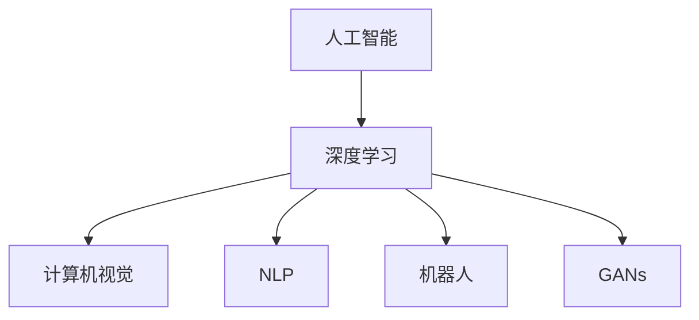

                 

# Andrej Karpathy：人工智能的未来发展机遇

## 1. 背景介绍

### 1.1 问题由来
Andrej Karpathy，作为斯坦福大学计算机视觉系副教授，Facebook AI Research（FAIR）的高级研究科学家，以及深度学习领域的重要人物，在人工智能的发展上有着丰富的见解和实践经验。通过对人工智能前沿技术的深度研究和探讨，Karpathy在多次公开演讲和著作中，提出了他对未来人工智能发展的深刻洞见。

### 1.2 问题核心关键点
Karpathy认为，人工智能的未来发展机遇在于其应用范围的拓展、算法的不断进步以及跨学科的融合。他强调，人工智能的最终目标是构建能够理解人类行为、情感和社会动态的智能系统，从而实现更好的社会服务。

### 1.3 问题研究意义
Karpathy的见解对未来人工智能的发展方向有着重要的指导意义。理解他的观点，能够帮助研究者和开发者明确人工智能的发展目标，合理规划研究方向和策略。

## 2. 核心概念与联系

### 2.1 核心概念概述

为了更好地理解Karpathy的观点，本节将介绍几个密切相关的核心概念：

- 人工智能(AI)：旨在创建能够模拟人类智能过程的机器系统。
- 深度学习(Deep Learning)：一种利用神经网络进行复杂模式识别和预测的技术，是实现人工智能的重要手段。
- 计算机视觉(Computer Vision)：研究如何让计算机理解和解释视觉数据的技术。
- 自然语言处理(Natural Language Processing, NLP)：让计算机能够理解和生成人类语言的技术。
- 机器人(Robotics)：结合计算机视觉、深度学习等技术，实现自主决策和执行任务的机器人系统。
- 生成对抗网络(Generative Adversarial Networks, GANs)：一种通过生成和对抗两个网络进行协同训练，生成逼真图像或视频的技术。

这些概念之间的逻辑关系可以通过以下Mermaid流程图来展示：



这个流程图展示了许多与AI相关的核心概念及其之间的关系：

1. 深度学习是实现人工智能的重要技术手段。
2. 计算机视觉和自然语言处理是人工智能在特定领域的具体应用。
3. 机器人涉及计算机视觉和深度学习的结合。
4. 生成对抗网络是深度学习的一种创新应用。

这些概念共同构成了人工智能的研究基础，是理解Karpathy观点和应用的背景。

## 3. 核心算法原理 & 具体操作步骤
### 3.1 算法原理概述

Karpathy在其演讲和著作中，多次强调了深度学习和神经网络在人工智能中的重要性。他认为，深度学习能够处理高维度、非线性的数据，通过多层的神经网络提取特征，进而实现复杂模式的识别和预测。

### 3.2 算法步骤详解

Karpathy将深度学习算法的开发分为以下几个关键步骤：

**Step 1: 准备数据集**
- 收集和标注数据，确保数据集具有代表性。
- 将数据集划分为训练集、验证集和测试集。
- 进行数据增强和预处理，确保模型能够处理多样化的数据。

**Step 2: 设计神经网络架构**
- 根据任务特点选择合适的神经网络结构。
- 定义网络中的隐藏层数、每层神经元数等超参数。
- 引入正则化技术，如Dropout、L2正则等，防止过拟合。

**Step 3: 训练神经网络**
- 选择合适的优化算法（如Adam、SGD等），设置学习率和批大小。
- 在训练集上使用小批量随机梯度下降（Mini-batch Stochastic Gradient Descent）更新参数。
- 在验证集上监测模型性能，提前终止训练避免过拟合。

**Step 4: 评估和调整**
- 在测试集上评估模型性能，使用准确率、精度、召回率等指标。
- 根据评估结果调整超参数，重新训练模型。
- 通过集成学习、参数微调等技术进一步提升模型性能。

**Step 5: 部署和应用**
- 将训练好的模型部署到实际应用场景中。
- 集成用户界面，提供交互式体验。
- 持续监控模型性能，定期更新模型。

通过这些步骤，可以高效地开发深度学习模型，并应用于实际问题中。

### 3.3 算法优缺点

深度学习的优势在于其强大的模式识别能力，能够处理复杂的数据结构，并在某些任务上取得显著的进展。然而，它也存在一些缺点：

**优点：**
- 高效处理大规模数据和高维特征。
- 通过多层次的特征提取，可以发现数据中的复杂关系。
- 可以应用于计算机视觉、自然语言处理等多个领域。

**缺点：**
- 对标注数据依赖度高，标注成本高。
- 模型结构复杂，训练时间长。
- 可解释性不足，难以理解模型的决策过程。

尽管存在这些局限性，但深度学习仍然是实现人工智能的重要手段，其高效性和广泛应用价值不可忽视。

### 3.4 算法应用领域

深度学习技术在众多领域得到了广泛应用，包括：

- 计算机视觉：图像识别、目标检测、图像生成等。
- 自然语言处理：文本分类、情感分析、机器翻译等。
- 语音识别：语音合成、语音识别、语音翻译等。
- 机器人：自动驾驶、智能家居、服务机器人等。
- 医疗：医学影像分析、病理诊断、药物发现等。

以上领域展示了深度学习技术的强大应用能力，为各行各业带来了显著的效率提升和成本降低。

## 4. 数学模型和公式 & 详细讲解 & 举例说明

### 4.1 数学模型构建

深度学习模型通常基于神经网络进行构建。以卷积神经网络（Convolutional Neural Networks, CNNs）为例，其基本结构包括卷积层、池化层和全连接层。数学上，可以表示为：

$$
y = W \cdot x + b
$$

其中，$y$ 表示输出向量，$x$ 表示输入向量，$W$ 和 $b$ 分别表示卷积核和偏置项。

### 4.2 公式推导过程

以卷积神经网络的卷积层为例，其推导过程如下：

1. 卷积操作：
$$
\text{Conv}(x, w) = \text{Pad}(x) * w
$$

2. 池化操作：
$$
\text{Pool}(x, w) = \max\limits_{i,j}(x * w)
$$

3. 激活函数：
$$
f(z) = \sigma(z)
$$

其中，$\sigma(z)$ 表示激活函数，如ReLU。

### 4.3 案例分析与讲解

以图像分类为例，使用卷积神经网络进行图像分类任务。假设输入为 $x$，输出为 $y$，卷积核为 $w$，激活函数为 $f(z)$。通过多层卷积和池化操作，将输入 $x$ 映射为输出 $y$，并使用softmax函数进行多分类预测：

$$
p(y|x) = \frac{e^{y^\top W \cdot x + b}}{\sum_k e^{k^\top W \cdot x + b}}
$$

## 5. 项目实践：代码实例和详细解释说明
### 5.1 开发环境搭建

为了进行深度学习开发，需要配置以下环境：

1. 安装Python：从官网下载并安装Python 3.x版本。
2. 安装深度学习库：使用pip安装TensorFlow、PyTorch、Keras等深度学习框架。
3. 安装GPU驱动：确保GPU驱动和CUDA版本与深度学习库兼容。
4. 配置虚拟环境：使用虚拟环境（如virtualenv）进行代码隔离。

### 5.2 源代码详细实现

以下是使用PyTorch进行图像分类任务的代码实现：

```python
import torch
import torch.nn as nn
import torch.optim as optim

# 定义卷积神经网络模型
class CNN(nn.Module):
    def __init__(self):
        super(CNN, self).__init__()
        self.conv1 = nn.Conv2d(3, 64, kernel_size=3, padding=1)
        self.pool = nn.MaxPool2d(kernel_size=2, stride=2)
        self.conv2 = nn.Conv2d(64, 128, kernel_size=3, padding=1)
        self.fc1 = nn.Linear(128 * 7 * 7, 256)
        self.fc2 = nn.Linear(256, 10)
    
    def forward(self, x):
        x = self.pool(F.relu(self.conv1(x)))
        x = self.pool(F.relu(self.conv2(x)))
        x = x.view(-1, 128 * 7 * 7)
        x = F.relu(self.fc1(x))
        x = self.fc2(x)
        return x

# 定义训练函数
def train(model, train_loader, criterion, optimizer, num_epochs):
    for epoch in range(num_epochs):
        for i, (inputs, labels) in enumerate(train_loader):
            optimizer.zero_grad()
            outputs = model(inputs)
            loss = criterion(outputs, labels)
            loss.backward()
            optimizer.step()
            print(f'Epoch {epoch+1}, batch {i+1}, loss: {loss.item()}')
    
# 训练模型
model = CNN()
criterion = nn.CrossEntropyLoss()
optimizer = optim.SGD(model.parameters(), lr=0.001, momentum=0.9)
train_loader = torch.utils.data.DataLoader(train_dataset, batch_size=64)
train(model, train_loader, criterion, optimizer, num_epochs=10)
```

### 5.3 代码解读与分析

**CNN类定义**：
- `__init__`方法：初始化卷积层和全连接层。
- `forward`方法：定义前向传播计算。

**训练函数**：
- 在每个epoch中，对训练集数据进行迭代。
- 使用小批量随机梯度下降（Mini-batch SGD）更新模型参数。
- 在每个batch后打印损失值。

**训练流程**：
- 定义模型、损失函数和优化器。
- 加载训练数据集。
- 调用训练函数。

可以看到，使用PyTorch进行深度学习模型的开发和训练，代码实现相对简洁高效。

### 5.4 运行结果展示

训练完成后，可以使用测试集评估模型性能：

```python
test_loader = torch.utils.data.DataLoader(test_dataset, batch_size=64)
model.eval()
with torch.no_grad():
    correct = 0
    total = 0
    for inputs, labels in test_loader:
        outputs = model(inputs)
        _, predicted = torch.max(outputs.data, 1)
        total += labels.size(0)
        correct += (predicted == labels).sum().item()
    print(f'Test Accuracy: {100 * correct / total:.2f}%')
```

以上就是使用PyTorch进行图像分类任务代码实现的完整流程。

## 6. 实际应用场景
### 6.1 智能交通系统

基于深度学习的智能交通系统，可以显著提高交通管理效率，降低事故发生率。通过计算机视觉技术，实时监测交通流、识别交通标志和行人，预测和调度交通信号，从而实现更高效的交通管理。

### 6.2 医疗影像诊断

深度学习在医学影像分析中有着广泛应用，可以自动分析X光片、CT、MRI等影像数据，辅助医生进行诊断。通过训练深度学习模型，自动识别肿瘤、骨折等病变区域，提高诊断的准确性和效率。

### 6.3 自动化驾驶

深度学习在自动驾驶中发挥了重要作用，用于图像识别、障碍物检测、路径规划等。通过多传感器数据融合，自动驾驶系统可以实时感知环境变化，做出安全决策，实现无人驾驶。

### 6.4 未来应用展望

未来，深度学习技术将在更多领域得到应用，为人类带来更多便利和效率提升。以下是几个潜在的应用方向：

- 智能家居：通过深度学习实现智能化的家居控制和个性化服务。
- 个性化推荐：基于用户行为和偏好，提供个性化的商品推荐。
- 工业自动化：通过计算机视觉和深度学习，实现工业生产的智能化和自动化。
- 自然语言生成：通过深度学习技术，生成逼真的文本和语音内容。

## 7. 工具和资源推荐
### 7.1 学习资源推荐

为了帮助开发者系统掌握深度学习技术，以下是几本优秀的学习资源：

1. 《深度学习》（Ian Goodfellow、Yoshua Bengio、Aaron Courville著）：全面介绍了深度学习的基本原理、算法和应用。
2. 《动手学深度学习》（李沐、陈冠杰著）：提供丰富的实践案例和代码实现，适合动手学习。
3. 《CS231n：卷积神经网络》（Coursera课程）：斯坦福大学的深度学习课程，涵盖计算机视觉领域的深度学习应用。
4. 《Deep Learning Specialization》（Andrew Ng著）：Coursera上的深度学习专项课程，涵盖深度学习的基本理论和实践。
5. Kaggle平台：提供大量公开数据集和竞赛，帮助开发者实践和应用深度学习技术。

通过对这些资源的学习实践，相信你一定能够快速掌握深度学习技术，并用于解决实际的AI问题。

### 7.2 开发工具推荐

高效的开发离不开优秀的工具支持。以下是几款用于深度学习开发的常用工具：

1. PyTorch：基于Python的开源深度学习框架，灵活动态的计算图，适合快速迭代研究。
2. TensorFlow：由Google主导开发的开源深度学习框架，生产部署方便，适合大规模工程应用。
3. Keras：高层深度学习框架，提供简单易用的API，适合初学者入门。
4. Jupyter Notebook：交互式编程环境，支持Python、R等多种语言，适合快速开发和实验。
5. Visual Studio Code：轻量级的代码编辑器，支持多种语言和框架。

合理利用这些工具，可以显著提升深度学习开发效率，加快创新迭代的步伐。

### 7.3 相关论文推荐

深度学习技术的发展源于学界的持续研究。以下是几篇奠基性的相关论文，推荐阅读：

1. AlexNet: ImageNet Classification with Deep Convolutional Neural Networks：提出了卷积神经网络（CNN）在图像分类任务上的突破性应用。
2. GoogleNet: Going Deeper with Convolutions：提出Inception模块，提高了神经网络的计算效率和表现力。
3. ResNet: Deep Residual Learning for Image Recognition：提出残差网络（ResNet），解决了深层网络训练过程中的梯度消失问题。
4. VGGNet: Very Deep Convolutional Networks for Large-Scale Image Recognition：提出VGG网络，通过增加卷积层数提升模型性能。
5. R-CNN: Rich Feature Hierarchies for Accurate Object Detection and Semantic Segmentation：提出R-CNN，用于目标检测任务。

这些论文代表了大深度学习技术的发展脉络。通过学习这些前沿成果，可以帮助研究者把握学科前进方向，激发更多的创新灵感。

## 8. 总结：未来发展趋势与挑战
### 8.1 总结

本文对Andrej Karpathy的观点进行了全面系统的介绍。通过理解他的见解，可以更好地把握深度学习技术的发展方向，合理规划研究方向和策略。

Karpathy强调了深度学习在人工智能中的重要性，以及其在计算机视觉、自然语言处理等领域的应用潜力。他提出，未来深度学习技术将在更多领域得到应用，为人类带来更多便利和效率提升。

### 8.2 未来发展趋势

展望未来，深度学习技术将呈现以下几个发展趋势：

1. 模型规模持续增大。随着算力成本的下降和数据规模的扩张，深度学习模型的参数量还将持续增长。超大批次的训练和推理也将更加高效。
2. 模型结构不断优化。新的网络结构、优化算法和正则化技术不断涌现，深度学习模型的性能将进一步提升。
3. 跨学科融合加速。深度学习与计算机视觉、自然语言处理、机器人等领域的结合将更加紧密，推动技术在更多领域的应用。
4. 应用场景不断拓展。深度学习技术将在医疗、自动驾驶、智能家居等更多领域得到应用，带来更多便利和效率提升。
5. 硬件和软件协同进化。新的硬件设计和软件优化技术将不断涌现，进一步提升深度学习的计算效率和应用效果。

这些趋势凸显了深度学习技术的发展前景，为人工智能的未来应用提供了新的可能性。

### 8.3 面临的挑战

尽管深度学习技术取得了显著进展，但在应用过程中仍面临诸多挑战：

1. 数据依赖度高。深度学习模型需要大量的标注数据进行训练，获取高质量标注数据的成本较高。
2. 计算资源需求高。大规模深度学习模型的训练和推理需要高性能硬件支持，如GPU、TPU等。
3. 模型复杂度高。深度学习模型结构复杂，难以理解和调试，可解释性不足。
4. 应用领域多样。深度学习技术在各个领域的应用场景复杂多样，难以一概而论。
5. 安全性问题。深度学习模型可能存在安全漏洞，如对抗样本攻击、数据泄露等。

这些挑战需要学界和产业界的共同努力，通过技术创新和跨学科合作，克服障碍，推动深度学习技术的进一步发展。

### 8.4 研究展望

未来的研究需要在以下几个方面寻求新的突破：

1. 减少数据依赖。研究无监督学习、半监督学习等方法，利用数据增强和生成对抗网络等技术，提高模型的泛化能力。
2. 优化模型结构。设计更高效的网络结构，如MobileNet、EfficientNet等，减少计算资源消耗。
3. 增强可解释性。引入可解释性技术，如注意力机制、梯度可视化等，提高深度学习模型的可解释性。
4. 推广应用场景。通过跨学科合作，将深度学习技术应用于更多领域，如医疗、金融、教育等，推动技术落地应用。
5. 保障安全性。研究安全性技术，如对抗样本检测、数据脱敏等，确保深度学习模型的安全可靠。

这些研究方向的探索，必将引领深度学习技术迈向更高的台阶，为构建安全、可靠、可解释、可控的智能系统铺平道路。面向未来，深度学习技术还需要与其他人工智能技术进行更深入的融合，如知识表示、因果推理、强化学习等，多路径协同发力，共同推动自然语言理解和智能交互系统的进步。

## 9. 附录：常见问题与解答

**Q1：深度学习对标注数据依赖度高，如何降低数据成本？**

A: 可以通过数据增强、迁移学习、半监督学习等方法，利用少量标注数据和大量无标注数据，进行深度学习模型的训练和微调。

**Q2：深度学习模型复杂度高，如何提高可解释性？**

A: 引入可解释性技术，如注意力机制、梯度可视化等，提高深度学习模型的可解释性。同时，设计更加简单的网络结构，如MobileNet、EfficientNet等，减少计算资源消耗。

**Q3：深度学习模型可能存在安全漏洞，如何保障模型安全？**

A: 研究安全性技术，如对抗样本检测、数据脱敏等，确保深度学习模型的安全可靠。同时，在模型训练过程中引入伦理导向的评估指标，过滤和惩罚有害的输出倾向。

**Q4：深度学习在特定领域的应用效果不佳，如何提高模型适应性？**

A: 可以采用预训练-微调的方式，在特定领域的数据上进行微调，提高模型对特定任务的适应能力。同时，引入领域知识，如知识图谱、逻辑规则等，增强模型的泛化能力。

这些问题的解答，可以帮助研究者和开发者更好地理解和应用深度学习技术，提升模型的性能和可解释性，保障模型的安全性。

---

作者：禅与计算机程序设计艺术 / Zen and the Art of Computer Programming

