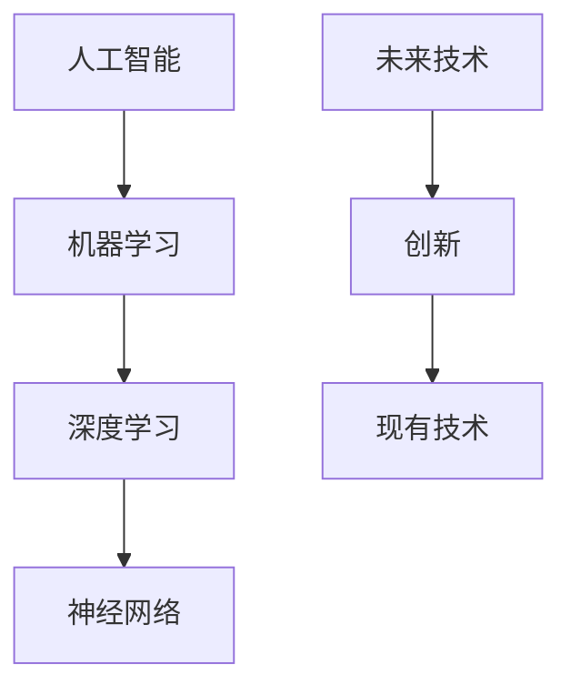

                 

# Andrej Karpathy：人工智能的未来发展目标

> 关键词：人工智能,机器学习,深度学习,神经网络,未来技术,创新

## 1. 背景介绍

### 1.1 问题由来
Andrej Karpathy，计算机科学界和人工智能领域的佼佼者，斯坦福大学的教授，也是人工智能社区的重要参与者。他不仅在学术界取得了卓越的成绩，同时也在工业界有着广泛的影响力。Karpathy的研究和开发工作涵盖了计算机视觉、深度学习、自动驾驶等多个领域，他的一些思考和见解被广泛认为是推动人工智能未来发展的关键。本文将深度剖析Karpathy关于人工智能未来发展目标的一些观点，探讨其对未来技术趋势的预测，以及如何应对当前挑战和抓住机遇。

## 2. 核心概念与联系

### 2.1 核心概念概述

为了理解Karpathy对未来人工智能发展的看法，我们需要先明确几个核心概念：

- **人工智能（AI）**：指由计算机系统执行的任务，这些任务传统上需要人类智能才能完成。

- **机器学习（ML）**：使计算机系统能够从数据中学习并改进其任务性能的算法和技术。

- **深度学习（DL）**：一种特殊的机器学习，使用多层次的神经网络来捕捉数据中的复杂关系。

- **神经网络（NN）**：受人类大脑结构启发，由大量相互连接的节点（神经元）组成的网络。

- **未来技术**：指正在研发或尚未完全实现但可能对社会产生重大影响的新技术。

- **创新**：在现有技术基础上提出的新想法、新方法，以解决特定问题或提升现有技术。

这些概念之间的联系通过以下Mermaid流程图来展示：



这个流程图展示了人工智能如何通过机器学习和深度学习中的神经网络这一关键技术分支不断进化，以及如何推动未来技术的创新和实现。

## 3. 核心算法原理 & 具体操作步骤

### 3.1 算法原理概述
Karpathy认为，未来人工智能的发展目标应聚焦于以下几个关键领域：

1. **提升模型的可解释性**：在神经网络中加入更多的解释机制，使得模型决策过程透明可理解。
2. **增强泛化能力**：开发更有效的迁移学习技术，使模型能够从新数据中快速学习和适应。
3. **优化计算效率**：提升模型在计算上的效率，降低资源消耗。
4. **推动多模态学习**：发展能够整合不同类型数据（如图像、文本、音频）的算法。
5. **改进自监督学习**：开发更高效的自监督学习算法，减少对标注数据的依赖。

### 3.2 算法步骤详解
Karpathy指出，实现上述目标的步骤主要包括以下几个方面：

1. **数据收集与预处理**：收集多样化的数据，并对其进行预处理，包括去噪、归一化、增强等步骤。
2. **模型设计**：选择合适的模型架构，如卷积神经网络、递归神经网络、变压器（Transformer）等，并对其进行参数调整。
3. **训练与优化**：使用大规模数据集进行模型训练，并根据误差进行调整，优化模型性能。
4. **评估与验证**：在验证集上评估模型性能，并根据结果进行进一步调整。
5. **部署与监测**：将模型部署到实际应用中，并持续监测其表现，及时进行更新和改进。

### 3.3 算法优缺点
Karpathy总结了当前深度学习技术的优缺点，强调了以下几个方面：

**优点**：
- **高效性能**：深度学习在处理大规模数据集时表现优异。
- **泛化能力强**：经过充分训练的深度学习模型能够很好地泛化到新数据上。
- **自动特征提取**：无需手动提取特征，直接从原始数据中学习特征表示。

**缺点**：
- **可解释性差**：深度学习模型被视作“黑箱”，难以理解其内部工作机制。
- **计算资源需求高**：深度学习模型通常需要大量的计算资源和时间进行训练。
- **数据依赖性强**：模型性能高度依赖于训练数据的质量和数量。

### 3.4 算法应用领域
Karpathy认为，未来人工智能将在以下领域发挥重要作用：

1. **医疗健康**：用于疾病诊断、治疗方案推荐、药物研发等。
2. **自动驾驶**：实现高精度地图导航、自动驾驶车辆决策、路径规划等。
3. **金融服务**：用于风险评估、欺诈检测、客户服务自动化等。
4. **制造业**：用于设备监控、预测性维护、供应链优化等。
5. **教育**：用于个性化学习、自动化评分、智能辅助教学等。

## 4. 数学模型和公式 & 详细讲解 & 举例说明

### 4.1 数学模型构建
Karpathy建议，在构建深度学习模型时，可以使用以下数学模型：

- **前向传播**：将输入数据经过神经网络各层传递，得到输出结果。
- **反向传播**：根据输出误差反向计算梯度，更新模型参数。
- **损失函数**：衡量模型预测结果与真实标签之间的差异，常见的有交叉熵损失、均方误差损失等。

### 4.2 公式推导过程
以简单的线性回归模型为例，其推导过程如下：

- **前向传播**：
$$ y = \theta^T x + b $$

- **损失函数**：
$$ L(y, \hat{y}) = \frac{1}{2}(y - \hat{y})^2 $$

- **反向传播**：
$$ \frac{\partial L}{\partial \theta} = x - \hat{y} \frac{\partial \hat{y}}{\partial \theta} $$

### 4.3 案例分析与讲解
以Karpathy的论文《Unsupervised Learning of Visual Representations by Transformers》为例，探讨了Transformer在图像分类任务中的性能提升。

Transformer模型通过自注意力机制和多头注意力机制，能够高效捕捉图像中的复杂关系。通过在大规模图像数据集上进行预训练，Transformer可以学习到良好的图像特征表示，从而在新图像分类任务上获得显著的性能提升。

## 5. 项目实践：代码实例和详细解释说明

### 5.1 开发环境搭建
Karpathy建议，使用Python和PyTorch库进行深度学习开发，具体步骤如下：

1. 安装Python和PyTorch库。
2. 准备数据集，如使用ImageNet数据集进行图像分类任务。
3. 设计模型架构，如使用Transformer模型。
4. 使用GPU进行训练和推理。

### 5.2 源代码详细实现
以下是一个简单的图像分类代码示例：

```python
import torch
import torch.nn as nn
import torch.optim as optim
from torchvision import datasets, transforms

# 定义模型架构
class TransformerNet(nn.Module):
    def __init__(self):
        super(TransformerNet, self).__init__()
        # 定义Transformer模型
        self.transformer = nn.Transformer(in_dim=3, out_dim=10)

    def forward(self, x):
        return self.transformer(x)

# 定义损失函数和优化器
model = TransformerNet()
criterion = nn.CrossEntropyLoss()
optimizer = optim.Adam(model.parameters(), lr=0.001)

# 加载数据集
train_dataset = datasets.ImageFolder(root='path/to/data', transform=transforms.ToTensor())
train_loader = torch.utils.data.DataLoader(train_dataset, batch_size=64, shuffle=True)

# 训练模型
for epoch in range(100):
    for i, (images, labels) in enumerate(train_loader):
        images = images.to(device)
        labels = labels.to(device)
        outputs = model(images)
        loss = criterion(outputs, labels)
        optimizer.zero_grad()
        loss.backward()
        optimizer.step()

# 测试模型
test_dataset = datasets.ImageFolder(root='path/to/data', transform=transforms.ToTensor())
test_loader = torch.utils.data.DataLoader(test_dataset, batch_size=64, shuffle=False)
with torch.no_grad():
    correct = 0
    total = 0
    for images, labels in test_loader:
        images = images.to(device)
        labels = labels.to(device)
        outputs = model(images)
        _, predicted = torch.max(outputs.data, 1)
        total += labels.size(0)
        correct += (predicted == labels).sum().item()
    print('Accuracy: {} %'.format(100 * correct / total))
```

### 5.3 代码解读与分析
代码中，我们定义了一个简单的Transformer模型，并使用Adam优化器进行训练。训练过程中，我们使用交叉熵损失函数来衡量模型预测与真实标签之间的差异。在测试阶段，我们评估模型的准确率，并打印输出。

## 6. 实际应用场景

### 6.4 未来应用展望
Karpathy对未来人工智能的应用展望主要集中在以下几个方面：

1. **增强可解释性**：开发新的方法，使深度学习模型能够提供更透明的决策过程。
2. **跨领域迁移学习**：通过模型迁移技术，实现不同领域之间的知识共享。
3. **自动化模型优化**：利用自动化技术，优化模型参数和超参数设置。
4. **多模态融合**：将视觉、文本、音频等多模态数据进行有效整合，提升模型的泛化能力。
5. **自监督学习**：利用未标注数据进行训练，减少对标注数据的依赖。

## 7. 工具和资源推荐

### 7.1 学习资源推荐
Karpathy推荐以下学习资源：

1. 《Deep Learning Specialization》：由Andrew Ng教授在Coursera上开设的深度学习课程系列。
2. 《PyTorch官方文档》：提供全面详细的PyTorch库使用指南。
3. 《TensorFlow官方文档》：提供全面的TensorFlow库使用指南。
4. 《Transformers论文》：介绍Transformer模型的核心原理和应用。

### 7.2 开发工具推荐
Karpathy推荐以下开发工具：

1. PyTorch：灵活高效的深度学习库，支持动态计算图。
2. TensorFlow：强大的深度学习库，支持大规模分布式训练。
3. Jupyter Notebook：交互式的编程环境，支持多种编程语言。

### 7.3 相关论文推荐
Karpathy推荐以下相关论文：

1. "Attention is All You Need"：提出Transformer模型，大幅提升NLP任务的性能。
2. "Visual and verbal attention"：探讨多模态学习，提升计算机视觉与语言理解的结合能力。
3. "Deep learning and reinforcement learning for self-driving cars"：介绍自动驾驶中的深度学习应用。

## 8. 总结：未来发展趋势与挑战

### 8.1 研究成果总结
Karpathy总结了深度学习在过去几年的发展成就，并指出未来研究的方向。

### 8.2 未来发展趋势
Karpathy认为，未来人工智能将朝着以下几个方向发展：

1. **提升可解释性**：开发可解释的模型，使决策过程透明可理解。
2. **增强泛化能力**：提高模型的跨领域泛化能力。
3. **优化计算效率**：提升模型在计算上的效率。
4. **发展多模态学习**：整合多种类型数据，提升模型的综合能力。
5. **改进自监督学习**：减少对标注数据的依赖，提高模型自适应能力。

### 8.3 面临的挑战
Karpathy指出，未来人工智能面临的挑战包括：

1. **数据隐私和安全**：如何保护训练数据隐私，防止数据泄露。
2. **模型鲁棒性**：提高模型对异常数据的鲁棒性，避免模型误判。
3. **计算资源限制**：如何在有限的计算资源下提升模型性能。
4. **可解释性**：开发可解释的模型，增强模型的可信度。

### 8.4 研究展望
Karpathy认为，未来人工智能的研究应重点关注以下几个方面：

1. **可解释性增强**：开发可解释性更强的模型，帮助理解模型决策过程。
2. **跨领域迁移学习**：实现不同领域之间的知识共享。
3. **自动化模型优化**：利用自动化技术优化模型参数和超参数。
4. **多模态融合**：提升多模态数据整合能力。
5. **自监督学习**：减少对标注数据的依赖，提高模型自适应能力。

## 9. Andrej Karpathy的核心理论和方法论

### 9.1 核心理论
Karpathy的核心理论包括：

1. **深度学习在多个领域的成功应用**：深度学习在图像识别、自然语言处理、自动驾驶等领域取得了显著进展。
2. **多模态学习的潜力**：多模态学习能够整合视觉、文本、音频等多种类型数据，提升模型的综合能力。
3. **自监督学习的重要性**：自监督学习利用未标注数据进行训练，减少对标注数据的依赖。

### 9.2 方法论
Karpathy的方法论包括：

1. **数据驱动**：以数据为中心，利用大量数据进行模型训练。
2. **模型可解释性**：开发可解释性更强的模型，帮助理解模型决策过程。
3. **跨领域迁移学习**：实现不同领域之间的知识共享。
4. **自动化模型优化**：利用自动化技术优化模型参数和超参数。
5. **多模态融合**：提升多模态数据整合能力。
6. **自监督学习**：减少对标注数据的依赖，提高模型自适应能力。

## 10. 附录：常见问题与解答

**Q1：为什么深度学习需要大量的数据进行训练？**

A: 深度学习模型的复杂性决定了其需要大量数据进行训练，以便捕捉数据中的复杂关系。

**Q2：深度学习模型有哪些应用场景？**

A: 深度学习模型在图像识别、自然语言处理、自动驾驶、金融预测等领域有广泛应用。

**Q3：如何提升深度学习模型的可解释性？**

A: 引入可解释性增强技术，如注意力机制、可视化工具等。

**Q4：深度学习模型的未来发展趋势是什么？**

A: 未来的发展趋势包括提升模型可解释性、增强泛化能力、优化计算效率、发展多模态学习、改进自监督学习等。

**Q5：如何应对深度学习模型的计算资源限制？**

A: 利用自动化技术优化模型参数和超参数，提升模型效率。

本文通过深入解析Andrej Karpathy对未来人工智能发展的见解，探讨了人工智能未来的发展目标和方向，为读者提供了丰富的理论基础和实践指南，有助于大家更好地理解和应用深度学习技术。

