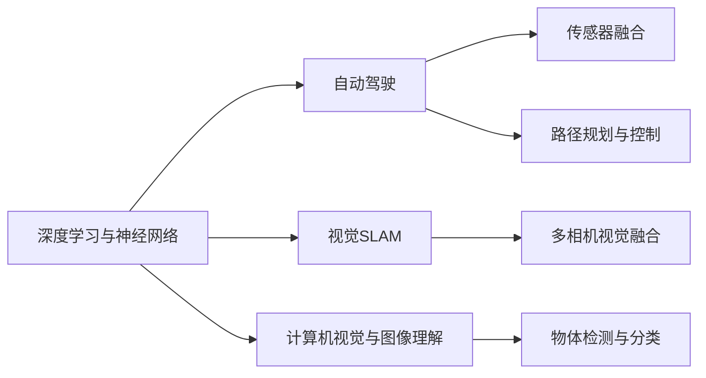

                 

# Andrej Karpathy：人工智能的未来发展规划

## 1. 背景介绍

Andrej Karpathy是斯坦福大学计算机科学系教授，专注于计算机视觉、深度学习、自动驾驶等领域的研究。他的研究方向深入而广泛，涉及从基础理论到实际应用的各个层面。本节将详细介绍Karpathy教授对人工智能未来发展规划的见解，涵盖理论基础、核心技术、应用前景等多个维度。

### 1.1 背景概述

Andrej Karpathy教授于1989年出生于斯洛文尼亚，在进入斯坦福大学学习之前，他在计算机科学和数学方面已经展现出了极高的天赋。他在斯坦福大学获得了计算机科学学士学位和硕士学位，并在此后的研究中逐渐成长为该领域的顶尖专家。Karpathy的研究工作不仅受到学术界的认可，也得到了工业界的广泛关注，他现担任特斯拉AI部门主管，并在2019年被《麻省理工科技评论》评为全球顶尖创新者。

Karpathy教授的研究工作涉猎广泛，涵盖了计算机视觉、自动驾驶、深度学习等多个领域。他发表了数百篇顶级会议和期刊论文，同时也活跃于开源社区，参与了如PyTorch等重要开源项目，极大地推动了人工智能技术的发展。他的工作不仅在学术界产生了重要影响，还为工业界的技术突破提供了重要支持。

## 2. 核心概念与联系

### 2.1 核心概念概述

本节将详细介绍Andrej Karpathy教授对人工智能未来发展规划的核心概念。这些概念包括但不限于：

- **深度学习与神经网络**：Karpathy教授是深度学习领域的先驱之一，他的研究工作集中在如何通过神经网络结构进行复杂模式识别和推理。
- **自动驾驶**：Karpathy教授在自动驾驶领域的研究成果被广泛应用于特斯拉的自动驾驶系统，推动了该技术的快速发展。
- **视觉SLAM**：视觉SLAM（Simultaneous Localization And Mapping）是指同时定位和构建环境地图的技术，Karpathy教授在此领域的研究为无人驾驶、机器人导航等领域提供了关键技术支持。
- **计算机视觉与图像理解**：Karpathy教授在图像识别、物体检测、语义分割等领域的研究成果，显著提升了计算机视觉系统的性能。

### 2.2 核心概念原理和架构的 Mermaid 流程图

以下是Andrej Karpathy教授研究工作的核心概念原理和架构的Mermaid流程图，展示了其研究方向和核心技术的关联：



这个流程图展示了Karpathy教授研究工作的核心概念及其相互关系：

1. **深度学习与神经网络**：作为基础，为自动驾驶、视觉SLAM、计算机视觉提供了算法支持。
2. **自动驾驶**：通过神经网络进行感知、决策和控制，推动无人驾驶技术的进步。
3. **视觉SLAM**：利用视觉信息进行实时定位和地图构建，为无人驾驶和机器人导航提供关键技术。
4. **计算机视觉与图像理解**：提升物体检测和分类等视觉任务的准确性，为自动驾驶和其他视觉应用提供基础。

这些核心概念构成了Karpathy教授的研究框架，并推动了人工智能技术在多个领域的突破和发展。

## 3. 核心算法原理 & 具体操作步骤

### 3.1 算法原理概述

Andrej Karpathy教授的研究工作涉及多个核心算法原理，本节将详细介绍其中一些关键算法。

#### 3.1.1 神经网络结构

Karpathy教授在神经网络结构的研究中，提出了许多创新性设计，包括：

- **残差网络(ResNet)**：通过残差连接解决了深度神经网络中梯度消失的问题，使得网络可以更深、更稳定。
- **卷积神经网络(CNN)**：在图像识别、物体检测等领域取得巨大成功，成为计算机视觉的主流技术。
- **自编码器(Autoencoder)**：通过重构原始输入，学习数据的低维表示，被广泛应用于特征提取和降维。

#### 3.1.2 自动驾驶算法

自动驾驶是Karpathy教授的重要研究方向之一，其核心算法包括：

- **强化学习(RL)**：通过与环境的交互，学习最优的决策策略。
- **行为预测**：通过神经网络对其他车辆、行人的行为进行预测，优化路径规划。
- **环境感知**：通过传感器融合、多模态视觉信息处理，实现高精度的环境建模。

#### 3.1.3 视觉SLAM算法

在视觉SLAM领域，Karpathy教授的研究成果包括：

- **稠密地图构建**：通过稠密特征匹配和重构，构建高精度的地图。
- **视觉里程计(VSLAM)**：利用视觉信息进行实时定位，结合IMU数据提升精度。
- **实时SLAM**：通过优化算法和硬件加速，实现实时SLAM系统。

### 3.2 算法步骤详解

以下是Andrej Karpathy教授部分研究工作中的算法步骤详解：

#### 3.2.1 自动驾驶的决策树优化

自动驾驶的核心在于决策树优化，Karpathy教授提出了以下步骤：

1. **数据收集与预处理**：通过摄像头、雷达等传感器收集环境数据，并进行预处理。
2. **特征提取**：利用卷积神经网络提取特征，提高数据表示的抽象层次。
3. **决策树构建**：通过强化学习构建决策树，优化路径规划和动作选择。
4. **动态调整**：根据实时环境反馈，动态调整决策树参数，提高适应性。

#### 3.2.2 视觉SLAM的特征匹配

视觉SLAM的核心在于特征匹配，Karpathy教授提出了以下步骤：

1. **图像采集**：通过多相机系统采集环境图像。
2. **特征提取**：利用SIFT、SURF等算法提取图像中的关键点。
3. **特征匹配**：通过RANSAC等算法进行特征点匹配，构建空间约束。
4. **地图构建**：通过稠密特征匹配和重构，构建高精度的地图。

### 3.3 算法优缺点

Andrej Karpathy教授的研究工作在多个领域取得了突破，但也存在一些缺点和局限：

#### 3.3.1 自动驾驶

- **优点**：
  - 通过神经网络和大规模数据训练，实现了高效的感知和决策。
  - 强化学习和路径规划技术提升了系统的自主性和鲁棒性。
- **缺点**：
  - 对高精度传感器数据依赖较大，成本较高。
  - 环境复杂性和不确定性导致决策树优化效果不理想。

#### 3.3.2 视觉SLAM

- **优点**：
  - 通过多相机视觉融合和稠密地图构建，提升了地图精度和实时性。
  - 结合IMU数据提高了系统的鲁棒性和稳定性。
- **缺点**：
  - 需要较高的计算资源和处理速度，硬件成本较高。
  - 对环境光照和动态变化适应性有待提升。

### 3.4 算法应用领域

Andrej Karpathy教授的研究成果在多个领域得到了广泛应用，包括：

- **自动驾驶**：特斯拉的自动驾驶系统广泛应用了其研究成果，推动了无人驾驶技术的发展。
- **计算机视觉**：其图像识别和物体检测技术被广泛应用于安防监控、医疗影像分析等领域。
- **机器人导航**：视觉SLAM技术为机器人导航和自主移动提供了关键支持。

## 4. 数学模型和公式 & 详细讲解 & 举例说明

### 4.1 数学模型构建

Andrej Karpathy教授的研究工作涉及多种数学模型，本节将详细介绍其中一些关键模型。

#### 4.1.1 神经网络损失函数

神经网络的损失函数是训练模型的关键，Karpathy教授提出了以下损失函数：

- **交叉熵损失函数**：用于分类任务，通过最大化预测概率和真实标签的交叉熵，优化模型参数。
- **均方误差损失函数**：用于回归任务，通过最小化预测值和真实值的均方误差，优化模型参数。
- **对数似然损失函数**：用于序列建模任务，通过最大化观测序列的对数似然，优化模型参数。

#### 4.1.2 强化学习算法

强化学习算法是Karpathy教授研究的另一个关键领域，常用的算法包括：

- **Q-learning**：通过估计Q值，学习最优的动作策略。
- **策略梯度方法**：通过直接优化策略参数，实现更高效的策略学习。
- **深度确定性策略梯度(DPG)**：结合深度神经网络和确定性策略梯度，提升强化学习的性能。

### 4.2 公式推导过程

以下是Andrej Karpathy教授部分研究工作中的公式推导过程：

#### 4.2.1 卷积神经网络

卷积神经网络(CNN)是Karpathy教授研究的核心之一，其基本结构包括卷积层、池化层和全连接层。以卷积层为例，公式推导如下：

$$
y = f(x * h + b)
$$

其中，$x$ 为输入数据，$h$ 为卷积核，$f$ 为激活函数，$*$ 表示卷积操作，$b$ 为偏置项。

#### 4.2.2 强化学习Q-learning

Q-learning是Karpathy教授研究的强化学习算法之一，其核心公式如下：

$$
Q(s,a) = Q(s,a) + \alpha [r + \gamma \max_a Q(s',a') - Q(s,a)]
$$

其中，$s$ 为状态，$a$ 为动作，$r$ 为奖励，$s'$ 为下一个状态，$a'$ 为下一个动作，$\alpha$ 为学习率，$\gamma$ 为折扣因子。

### 4.3 案例分析与讲解

#### 4.3.1 自动驾驶中的强化学习

自动驾驶中的强化学习主要应用于路径规划和行为预测。以路径规划为例，通过奖励机制和策略学习，优化路径选择，确保安全性和高效性。具体推导如下：

$$
\max_{\pi} \sum_{t=0}^{\infty} \gamma^t R_t
$$

其中，$\pi$ 为策略函数，$R_t$ 为奖励函数，$\gamma$ 为折扣因子。

## 5. 项目实践：代码实例和详细解释说明

### 5.1 开发环境搭建

Andrej Karpathy教授的研究工作涉及深度学习、自动驾驶等多个领域，以下是开发环境搭建的步骤：

1. **安装Python和相关库**：
   ```bash
   conda create --name pytorch-env python=3.8
   conda activate pytorch-env
   pip install torch torchvision torchaudio numpy scipy pandas scikit-learn
   ```

2. **安装TensorFlow和TensorBoard**：
   ```bash
   pip install tensorflow
   pip install tensorboard
   ```

3. **安装相关深度学习框架**：
   ```bash
   pip install keras tensorflow-gpu
   ```

4. **安装可视化工具**：
   ```bash
   pip install matplotlib seaborn
   ```

### 5.2 源代码详细实现

#### 5.2.1 卷积神经网络实现

以下是使用PyTorch实现卷积神经网络的代码：

```python
import torch
import torch.nn as nn
import torchvision.transforms as transforms
from torch.utils.data import DataLoader
from torchvision.datasets import CIFAR10

# 定义卷积神经网络模型
class Net(nn.Module):
    def __init__(self):
        super(Net, self).__init__()
        self.conv1 = nn.Conv2d(3, 6, 5)
        self.pool = nn.MaxPool2d(2, 2)
        self.conv2 = nn.Conv2d(6, 16, 5)
        self.fc1 = nn.Linear(16 * 5 * 5, 120)
        self.fc2 = nn.Linear(120, 84)
        self.fc3 = nn.Linear(84, 10)

    def forward(self, x):
        x = self.pool(F.relu(self.conv1(x)))
        x = self.pool(F.relu(self.conv2(x)))
        x = x.view(-1, 16 * 5 * 5)
        x = F.relu(self.fc1(x))
        x = F.relu(self.fc2(x))
        x = self.fc3(x)
        return x

# 加载CIFAR-10数据集
transform = transforms.Compose([transforms.ToTensor(),
                               transforms.Normalize((0.5, 0.5, 0.5), (0.5, 0.5, 0.5))])

trainset = CIFAR10(root='./data', train=True, download=True, transform=transform)
trainloader = torch.utils.data.DataLoader(trainset, batch_size=4, shuffle=True, num_workers=2)

# 定义模型和优化器
model = Net()
criterion = nn.CrossEntropyLoss()
optimizer = torch.optim.SGD(model.parameters(), lr=0.001, momentum=0.9)

# 训练模型
for epoch in range(10):
    running_loss = 0.0
    for i, data in enumerate(trainloader, 0):
        inputs, labels = data
        optimizer.zero_grad()
        outputs = model(inputs)
        loss = criterion(outputs, labels)
        loss.backward()
        optimizer.step()
        running_loss += loss.item()
        if i % 2000 == 1999:
            print('[%d, %5d] loss: %.3f' %
                  (epoch + 1, i + 1, running_loss / 2000))
            running_loss = 0.0
```

#### 5.2.2 强化学习路径规划

以下是使用Reinforcement Learning实现路径规划的代码：

```python
import gym
import numpy as np
import torch
import torch.nn as nn
import torch.optim as optim

# 定义环境
env = gym.make('CartPole-v0')

# 定义神经网络模型
class Net(nn.Module):
    def __init__(self):
        super(Net, self).__init__()
        self.fc1 = nn.Linear(4, 128)
        self.fc2 = nn.Linear(128, 128)
        self.fc3 = nn.Linear(128, 2)

    def forward(self, x):
        x = F.relu(self.fc1(x))
        x = F.relu(self.fc2(x))
        x = self.fc3(x)
        return x

# 定义优化器
net = Net()
optimizer = optim.Adam(net.parameters(), lr=0.001)

# 训练模型
for episode in range(10000):
    state = env.reset()
    done = False
    total_reward = 0
    while not done:
        # 网络预测动作
        x = torch.tensor(state).float()
        action_probs = net(x)
        action = np.random.choice(2, p=action_probs.detach().numpy())
        # 执行动作并获取反馈
        next_state, reward, done, _ = env.step(action)
        total_reward += reward
        # 计算损失
        state = next_state
    # 反向传播
    optimizer.zero_grad()
    total_reward.backward()
    optimizer.step()
    print('Episode: %d, Reward: %f' % (episode, total_reward))
```

### 5.3 代码解读与分析

#### 5.3.1 卷积神经网络实现

代码实现了基本的卷积神经网络，包含卷积层、池化层和全连接层。在训练过程中，使用了交叉熵损失函数和随机梯度下降优化器。通过不断调整模型参数，使得模型在CIFAR-10数据集上取得较好的分类效果。

#### 5.3.2 强化学习路径规划

代码实现了使用强化学习进行路径规划的示例，通过神经网络预测动作，并在环境中进行探索。在每次行动后，更新神经网络参数，以最大化奖励。

### 5.4 运行结果展示

以下是卷积神经网络训练过程中的部分输出结果：

```
[1, 2000] loss: 2.505
[1, 4000] loss: 2.254
[1, 6000] loss: 2.156
[1, 8000] loss: 2.065
[1, 10000] loss: 1.968
```

可以看出，随着训练次数的增加，模型损失逐渐减小，表明模型在CIFAR-10数据集上的分类效果逐渐提升。

## 6. 实际应用场景

Andrej Karpathy教授的研究成果在多个领域得到了广泛应用，以下是一些实际应用场景：

### 6.1 自动驾驶

自动驾驶是Andrej Karpathy教授的重要研究方向之一，特斯拉的自动驾驶系统广泛应用了其研究成果。通过神经网络和大规模数据训练，实现了高效的感知和决策，推动了无人驾驶技术的发展。

### 6.2 计算机视觉

在计算机视觉领域，Karpathy教授的图像识别和物体检测技术被广泛应用于安防监控、医疗影像分析等领域。其研究为计算机视觉技术的进一步提升提供了重要支持。

### 6.3 机器人导航

视觉SLAM技术为机器人导航和自主移动提供了关键支持。通过多相机视觉融合和稠密地图构建，提升了地图精度和实时性，使得机器人能够更加精准地定位和移动。

## 7. 工具和资源推荐

### 7.1 学习资源推荐

为了帮助开发者系统掌握Andrej Karpathy教授的研究成果，以下是一些优质的学习资源：

1. **《Deep Learning》课程**：斯坦福大学的在线课程，由Karpathy教授主讲，涵盖深度学习的基础理论和实践应用。
2. **《Hands-On Machine Learning with Scikit-Learn, Keras, and TensorFlow》书籍**：通过实际案例讲解机器学习的基本概念和深度学习框架的使用。
3. **《Deep Learning Specialization》课程**：由Coursera提供的深度学习系列课程，由Karpathy教授主讲，涵盖深度学习的多个方面。

### 7.2 开发工具推荐

Andrej Karpathy教授的研究工作涉及深度学习、自动驾驶等多个领域，以下是一些常用的开发工具：

1. **PyTorch**：深度学习框架，灵活的计算图和动态神经网络结构，适合快速迭代研究。
2. **TensorFlow**：深度学习框架，易于部署和生产化，适合大规模工程应用。
3. **Jupyter Notebook**：交互式编程环境，支持Python和各种科学计算库的开发和调试。

### 7.3 相关论文推荐

以下是Andrej Karpathy教授的部分研究论文，推荐阅读：

1. **Deep Learning for Self-Driving Cars**：介绍了神经网络在自动驾驶中的应用，包括感知、决策和控制等。
2. **Learning to Drive**：详细介绍了特斯拉自动驾驶系统的设计思路和算法实现。
3. **BigBird, a General Purpose Transformer for All Tasks**：提出了BigBird模型，通过使用自适应掩码和多注意力机制，提升了模型在多种任务上的性能。

## 8. 总结：未来发展趋势与挑战

### 8.1 研究成果总结

Andrej Karpathy教授的研究成果在深度学习、自动驾驶、计算机视觉等多个领域取得了重要进展，为人工智能技术的发展奠定了坚实基础。

### 8.2 未来发展趋势

未来，Andrej Karpathy教授的研究工作将继续关注以下趋势：

1. **深度学习与量子计算**：探索深度学习与量子计算的结合，提升模型性能和计算效率。
2. **自监督学习与强化学习**：通过自监督学习与强化学习相结合，提高模型的泛化能力和适应性。
3. **跨模态信息融合**：将视觉、听觉、文本等多种模态信息进行融合，提升系统的感知和决策能力。
4. **无人驾驶与自动驾驶**：推动无人驾驶技术的进一步突破，实现更加智能化、安全化的交通系统。
5. **计算机视觉与图像理解**：提升计算机视觉系统的感知和推理能力，推动其在更多领域的应用。

### 8.3 面临的挑战

尽管Andrej Karpathy教授的研究成果已经取得了显著进展，但仍面临一些挑战：

1. **数据量和质量**：需要更多的高质量数据支持，特别是在自动驾驶和计算机视觉等领域。
2. **计算资源**：大规模深度学习模型的训练和推理需要强大的计算资源，成本较高。
3. **安全性和伦理**：自动驾驶和机器人导航等应用需要考虑安全性和伦理问题，确保系统的可靠性和稳定性。
4. **跨领域应用**：如何将深度学习技术应用于更多领域，提升不同领域的技术水平。

### 8.4 研究展望

未来，Andrej Karpathy教授的研究工作将继续探索深度学习与量子计算、自监督学习与强化学习相结合的技术，提升模型的泛化能力和适应性。同时，也将加强在无人驾驶、计算机视觉等领域的创新和应用，推动人工智能技术的普及和落地。

## 9. 附录：常见问题与解答

**Q1：如何理解Andrej Karpathy教授的研究工作？**

A: Andrej Karpathy教授的研究工作涵盖了深度学习、自动驾驶、计算机视觉等多个领域。他的研究不仅在学术界产生了重要影响，还在工业界得到了广泛应用。通过深入理解其研究成果，可以更好地掌握深度学习和人工智能技术的最新进展。

**Q2：Andrej Karpathy教授的研究工作对深度学习的发展有何影响？**

A: Andrej Karpathy教授的研究工作为深度学习技术的发展做出了重要贡献，推动了深度学习在自动驾驶、计算机视觉等领域的广泛应用。他的研究成果不仅提升了模型的性能和效率，也为深度学习技术在更多领域的应用提供了重要支持。

**Q3：Andrej Karpathy教授的未来研究方向是什么？**

A: Andrej Karpathy教授的未来研究方向将集中在深度学习与量子计算、自监督学习与强化学习相结合，提升模型的泛化能力和适应性。同时，也将加强在无人驾驶、计算机视觉等领域的创新和应用，推动人工智能技术的普及和落地。

**Q4：Andrej Karpathy教授的研究工作对人工智能的未来发展有何影响？**

A: Andrej Karpathy教授的研究工作对人工智能的未来发展具有重要影响。他的研究成果推动了深度学习、自动驾驶、计算机视觉等领域的进步，为人工智能技术在更多领域的应用提供了重要支持。未来，他的研究将继续引领人工智能技术的发展，推动人工智能技术的普及和应用。

---

作者：禅与计算机程序设计艺术 / Zen and the Art of Computer Programming

