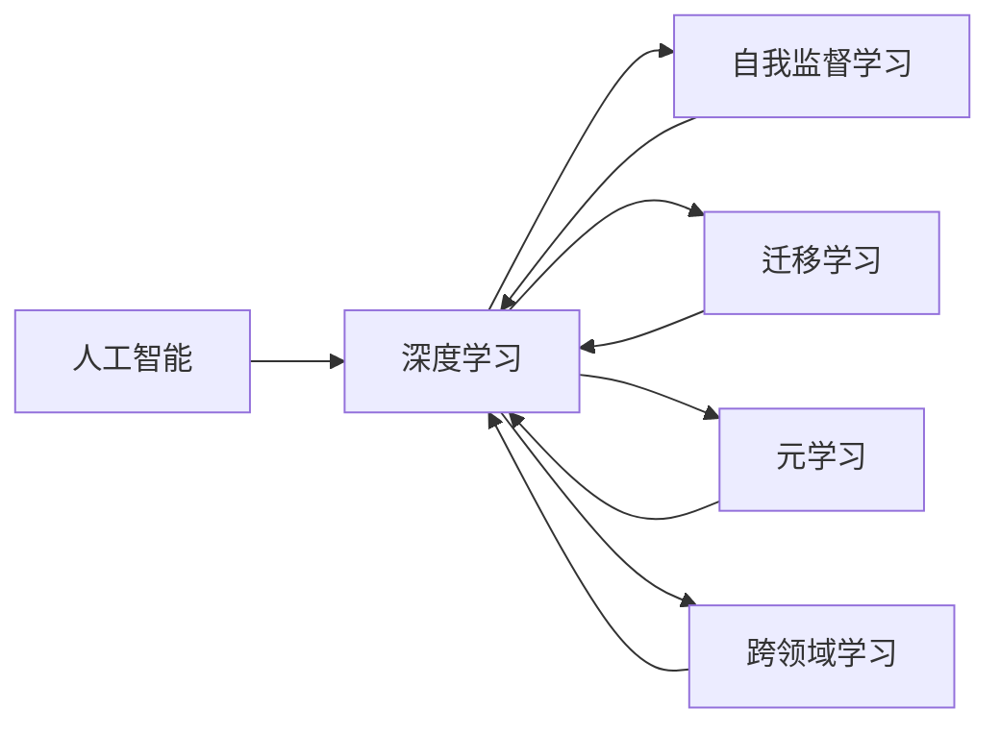

                 

## 1. 背景介绍

Andrej Karpathy，作为深度学习领域的知名学者和AI研究员，始终站在人工智能技术的最前沿。他不仅在学术界有着广泛的学术影响力，还在工业界有着丰富的工程实践经验，他的观点和预测对未来人工智能的发展具有重要的指导意义。本文将系统性地介绍Andrej Karpathy对人工智能未来发展规划的见解，帮助读者理解当前和未来人工智能技术的发展趋势。

## 2. 核心概念与联系

### 2.1 核心概念概述

为了深入探讨Andrej Karpathy的规划，首先需要理解几个关键概念：

- **人工智能 (AI)**：AI是指通过计算机系统模拟、延伸和扩展人的智能，实现学习、推理、感知、决策、规划等能力。
- **深度学习 (Deep Learning)**：深度学习是AI的一个分支，通过多层神经网络模拟人脑的信息处理方式，应用于图像识别、自然语言处理、语音识别等领域。
- **自我监督学习 (Self-Supervised Learning)**：一种无需人工标注数据就能训练模型的学习方式，通过利用数据的自身结构进行学习。
- **迁移学习 (Transfer Learning)**：将一个领域学习的知识应用于另一个领域，以提高在新领域中的学习效率和性能。
- **元学习 (Meta-Learning)**：学习如何学习，即训练模型在特定环境下快速适应新任务。
- **跨领域学习 (Cross-Domain Learning)**：研究模型在不同领域间的知识和技能迁移。

### 2.2 核心概念原理和架构的 Mermaid 流程图



## 3. 核心算法原理 & 具体操作步骤

### 3.1 算法原理概述

Andrej Karpathy认为，人工智能的未来规划应该建立在深度学习的基础上，特别是自我监督学习和迁移学习的框架内。他强调，深度学习已经展示了其在各种任务上的优越性，未来的人工智能系统应该能够利用数据本身的信息，实现自我学习和迁移适应。

### 3.2 算法步骤详解

#### 3.2.1 数据驱动的自我监督学习

自我监督学习是一种无需人工标注数据就能训练模型的学习方式。它通过利用数据的自身结构进行学习，从而提高模型的泛化能力。例如，通过利用数据的上下文信息、噪声性质等，可以训练出具有良好泛化能力的模型。

#### 3.2.2 迁移学习的跨领域应用

迁移学习是指将一个领域学习的知识应用于另一个领域。Andrej Karpathy强调，通过迁移学习，可以显著提高模型在不同领域中的学习效率和性能。例如，在自然语言处理中，可以将预训练语言模型应用于图像识别、语音识别等领域，提升这些领域的性能。

#### 3.2.3 元学习的快速适应

元学习是指学习如何学习，即训练模型在特定环境下快速适应新任务。Andrej Karpathy认为，元学习是未来人工智能发展的关键。通过元学习，模型可以更快地适应新环境，提升其在复杂环境中的表现。

### 3.3 算法优缺点

#### 3.3.1 优点

1. **泛化能力强**：自我监督学习能够利用数据的自身结构进行学习，提高了模型的泛化能力。
2. **适应性强**：迁移学习能够将一个领域的学习经验应用于另一个领域，提高了模型的适应性。
3. **学习效率高**：元学习能够快速适应新任务，提高了模型的学习效率。

#### 3.3.2 缺点

1. **数据依赖性强**：自我监督学习依赖于高质量的数据，数据质量对模型的效果有重要影响。
2. **跨领域适应性差**：迁移学习在特定领域间的适应性仍然存在挑战。
3. **模型复杂度高**：元学习需要更高的计算资源和更复杂的算法，对硬件要求较高。

### 3.4 算法应用领域

Andrej Karpathy认为，未来的人工智能将在以下几个领域得到广泛应用：

1. **自然语言处理 (NLP)**：自我监督学习和迁移学习在NLP中的应用，将使得模型具备更强的语言理解和生成能力。
2. **计算机视觉 (CV)**：深度学习在CV中的应用，使得模型能够更准确地识别和理解图像和视频。
3. **机器人技术**：通过迁移学习和元学习，机器人能够快速适应新环境和任务，提升自主决策能力。
4. **自动驾驶**：自我监督学习和迁移学习在自动驾驶中的应用，使得车辆能够更安全、高效地运行。
5. **医疗诊断**：迁移学习在医疗领域的应用，使得模型能够快速适应新的医疗数据和诊断任务。

## 4. 数学模型和公式 & 详细讲解 & 举例说明

### 4.1 数学模型构建

Andrej Karpathy强调，深度学习的数学模型应该建立在稳定的优化算法和高效的神经网络结构上。他建议，未来的深度学习模型应该采用优化算法，如Adam、RMSprop等，以提高训练速度和稳定性。

### 4.2 公式推导过程

以下是一个简单的线性回归模型的公式推导过程：

$$
\min_{\theta} \frac{1}{2m}\sum_{i=1}^m (y^{(i)} - \theta^T x^{(i)})^2
$$

其中，$m$ 是样本数，$y^{(i)}$ 是第$i$个样本的标签，$x^{(i)}$ 是第$i$个样本的特征。

### 4.3 案例分析与讲解

以自然语言处理中的机器翻译为例，Andrej Karpathy认为，未来的机器翻译系统应该能够通过自我监督学习，从大规模的文本数据中学习语言的通用表示。然后，通过迁移学习，将这个表示应用于特定的机器翻译任务，实现高精度的翻译。

## 5. 项目实践：代码实例和详细解释说明

### 5.1 开发环境搭建

为了实现上述规划，开发者需要准备好以下开发环境：

1. **Python**：作为深度学习的常用语言，Python提供了丰富的库和工具。
2. **PyTorch**：作为深度学习的主流框架，PyTorch提供了灵活的动态计算图和高效的GPU加速。
3. **TensorFlow**：作为另一个深度学习框架，TensorFlow提供了静态计算图和广泛的模型库。
4. **CUDA**：作为NVIDIA的并行计算平台，CUDA可以加速深度学习模型的训练和推理。

### 5.2 源代码详细实现

以下是使用PyTorch进行深度学习模型训练的代码实现：

```python
import torch
import torch.nn as nn
import torch.optim as optim

# 定义模型
class Model(nn.Module):
    def __init__(self):
        super(Model, self).__init__()
        self.fc1 = nn.Linear(784, 128)
        self.fc2 = nn.Linear(128, 10)

    def forward(self, x):
        x = F.relu(self.fc1(x))
        x = self.fc2(x)
        return F.log_softmax(x, dim=1)

# 加载数据
train_loader = torch.utils.data.DataLoader(train_dataset, batch_size=64, shuffle=True)
test_loader = torch.utils.data.DataLoader(test_dataset, batch_size=64, shuffle=False)

# 定义优化器和损失函数
model = Model()
optimizer = optim.Adam(model.parameters(), lr=0.01)
criterion = nn.NLLLoss()

# 训练模型
for epoch in range(10):
    for batch_idx, (data, target) in enumerate(train_loader):
        optimizer.zero_grad()
        output = model(data.view(-1, 784))
        loss = criterion(output, target)
        loss.backward()
        optimizer.step()
        
    # 测试模型
    with torch.no_grad():
        test_loss = 0
        correct = 0
        for data, target in test_loader:
            output = model(data.view(-1, 784))
            test_loss += criterion(output, target).item()
            pred = output.argmax(dim=1, keepdim=True)
            correct += pred.eq(target.view_as(pred)).sum().item()

        test_loss /= len(test_loader.dataset)
        print('Test set: Average loss: {:.4f}, Accuracy: {}/{} ({:.0f}%)'.format(
            test_loss, correct, len(test_loader.dataset),
            100. * correct / len(test_loader.dataset)))
```

### 5.3 代码解读与分析

在上述代码中，我们定义了一个简单的线性回归模型，使用Adam优化器进行训练，并在测试集上评估模型的性能。通过使用PyTorch的DataLoader，我们能够方便地加载数据集，并进行批处理。

## 6. 实际应用场景

Andrej Karpathy认为，未来的人工智能将在多个领域得到广泛应用：

### 6.1 自动驾驶

在自动驾驶中，深度学习模型可以应用于车道识别、障碍物检测、路径规划等任务。通过迁移学习，模型可以快速适应新环境和任务，提升自动驾驶的安全性和可靠性。

### 6.2 医疗诊断

在医疗诊断中，深度学习模型可以应用于图像识别、病理分析等任务。通过迁移学习和元学习，模型可以迅速适应新的医疗数据和诊断任务，提高诊断的准确性和效率。

### 6.3 机器人技术

在机器人技术中，深度学习模型可以应用于目标识别、动作规划等任务。通过迁移学习和元学习，机器人能够快速适应新环境和任务，提升自主决策能力。

### 6.4 未来应用展望

Andrej Karpathy认为，未来的人工智能将在以下几个方面得到突破：

1. **跨领域学习**：未来的深度学习模型将具备更强的跨领域适应性，能够灵活地应用在不同领域中。
2. **元学习**：通过元学习，模型能够快速适应新任务，提升学习效率和性能。
3. **自我监督学习**：未来的深度学习模型将能够利用数据本身的信息进行学习，提高模型的泛化能力和适应性。

## 7. 工具和资源推荐

### 7.1 学习资源推荐

为了帮助开发者系统掌握深度学习技术，Andrej Karpathy推荐以下学习资源：

1. **Deep Learning Specialization**：由Coursera提供的深度学习课程，涵盖了深度学习的基础和高级内容，由Andrew Ng等知名教授授课。
2. **CS231n**：斯坦福大学的计算机视觉课程，涵盖了深度学习在计算机视觉中的应用，是学习深度学习的重要资源。
3. **PyTorch官方文档**：PyTorch的官方文档，提供了丰富的教程和样例代码，是学习PyTorch的必备资料。
4. **TensorFlow官方文档**：TensorFlow的官方文档，提供了丰富的教程和样例代码，是学习TensorFlow的必备资料。
5. **arXiv**：深度学习的顶级学术期刊，可以获取最新的研究成果和论文。

### 7.2 开发工具推荐

Andrej Karpathy推荐以下开发工具：

1. **Jupyter Notebook**：一个交互式的开发环境，支持Python代码的编写、执行和可视化，是深度学习开发的重要工具。
2. **TensorBoard**：TensorFlow的可视化工具，可以实时监测模型训练状态，提供丰富的图表和分析功能。
3. **Weights & Biases**：一个模型训练的实验跟踪工具，可以记录和可视化模型训练过程中的各项指标，方便对比和调优。
4. **CUDA**：NVIDIA的并行计算平台，可以加速深度学习模型的训练和推理。
5. **MXNet**：一个高效的深度学习框架，支持多种编程语言和硬件平台。

### 7.3 相关论文推荐

为了深入了解深度学习技术的最新进展，Andrej Karpathy推荐以下论文：

1. **ImageNet Classification with Deep Convolutional Neural Networks**：AlexNet论文，引入了卷积神经网络，推动了深度学习在计算机视觉中的应用。
2. **Very Deep Convolutional Networks for Large-Scale Image Recognition**：Google Inception论文，提出了Inception模块，提高了深度神经网络的效率和性能。
3. **Deep Residual Learning for Image Recognition**：ResNet论文，提出了残差网络，解决了深度神经网络训练中的梯度消失问题。
4. **Learning Transferable Image Representations with Cross-Architecture Feature Alignment**：提出了跨架构特征对齐方法，提高了迁移学习的效率和性能。
5. **Meta-Learning as Transfer Learning from Self to Task**：提出了元学习的思想，提高了模型在新任务中的适应性和学习效率。

## 8. 总结：未来发展趋势与挑战

### 8.1 研究成果总结

Andrej Karpathy认为，未来的人工智能将在深度学习的基础上，通过自我监督学习、迁移学习和元学习等技术，实现更高效、更广泛的应用。

### 8.2 未来发展趋势

1. **自我监督学习**：未来的深度学习模型将能够利用数据本身的信息进行学习，提高模型的泛化能力和适应性。
2. **迁移学习**：未来的深度学习模型将具备更强的跨领域适应性，能够灵活地应用在不同领域中。
3. **元学习**：通过元学习，模型能够快速适应新任务，提升学习效率和性能。
4. **跨领域学习**：未来的深度学习模型将具备更强的跨领域适应性，能够灵活地应用在不同领域中。
5. **模型压缩**：未来的深度学习模型将采用模型压缩技术，减少计算资源和存储空间的需求。
6. **可解释性**：未来的深度学习模型将具备更好的可解释性，能够让人类理解模型的决策过程和推理逻辑。

### 8.3 面临的挑战

Andrej Karpathy认为，未来的人工智能在实现这些目标的过程中，将面临以下几个挑战：

1. **数据依赖性**：未来的深度学习模型将依赖于高质量的数据，数据质量对模型的效果有重要影响。
2. **计算资源需求**：未来的深度学习模型将需要更高的计算资源和更复杂的算法，对硬件要求较高。
3. **模型可解释性**：未来的深度学习模型需要具备更好的可解释性，能够让人类理解模型的决策过程和推理逻辑。
4. **伦理和社会问题**：未来的人工智能需要关注伦理和社会问题，确保其应用的安全性和公正性。

### 8.4 研究展望

Andrej Karpathy认为，未来的人工智能研究将在以下几个方面进行：

1. **跨领域学习**：研究模型在不同领域间的知识和技能迁移。
2. **元学习**：研究模型如何通过少量数据快速适应新任务。
3. **自我监督学习**：研究模型如何利用数据本身的信息进行学习。
4. **可解释性**：研究模型的决策过程和推理逻辑的可解释性。
5. **伦理和社会问题**：研究人工智能的伦理和社会影响，确保其应用的安全性和公正性。

## 9. 附录：常见问题与解答

### Q1: 深度学习在人工智能中扮演什么角色？

A: 深度学习是人工智能的核心技术之一，通过多层神经网络模拟人脑的信息处理方式，应用于图像识别、自然语言处理、语音识别等领域。

### Q2: 什么是自我监督学习和迁移学习？

A: 自我监督学习是一种无需人工标注数据就能训练模型的学习方式，通过利用数据的自身结构进行学习。迁移学习是将一个领域学习的知识应用于另一个领域，以提高在新领域中的学习效率和性能。

### Q3: 未来的人工智能将在哪些领域得到广泛应用？

A: 未来的人工智能将在自然语言处理、计算机视觉、自动驾驶、机器人技术、医疗诊断等领域得到广泛应用。

### Q4: 在开发深度学习模型时，需要注意哪些问题？

A: 在开发深度学习模型时，需要注意数据的质量和数量、计算资源的需求、模型的可解释性、伦理和社会问题等。

---

作者：禅与计算机程序设计艺术 / Zen and the Art of Computer Programming

