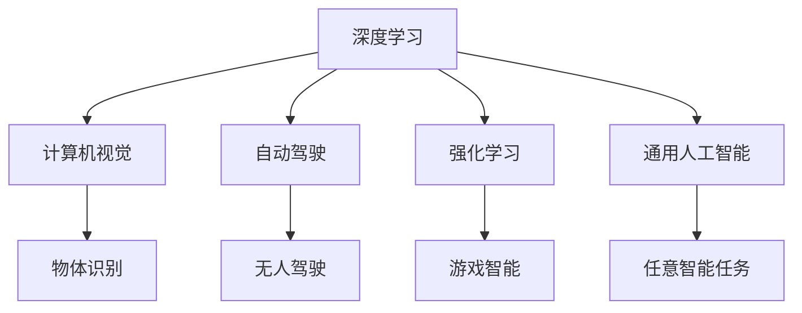

                 

# Andrej Karpathy：人工智能的未来发展规划

## 1. 背景介绍

Andrej Karpathy 是一位在深度学习和计算机视觉领域享有盛誉的专家。他不仅在学术界取得了卓越的成就，还曾在 Google 和 Tesla 担任关键职务，对人工智能的未来发展有着深刻的见解。在本篇文章中，我们将通过他的视角，探讨人工智能领域的前景和未来发展规划。

## 2. 核心概念与联系

### 2.1 核心概念概述

在探讨人工智能的未来发展规划之前，我们首先梳理一下其中涉及的核心概念。

- **深度学习**：一种基于神经网络的学习方法，通过多层神经元处理复杂数据，实现高效的学习和预测。
- **计算机视觉**：研究如何让计算机"看懂"图像和视频，进行物体识别、场景理解等任务。
- **自动驾驶**：通过人工智能技术，实现无人驾驶汽车，提升交通效率和安全性。
- **强化学习**：一种通过与环境交互学习最优决策策略的学习方法，应用于游戏、机器人等领域。
- **通用人工智能**：指构建能够进行任意智能任务的通用智能系统，如AlphaGo。

这些概念之间存在着紧密的联系，构成了人工智能的核心框架。深度学习和计算机视觉为视觉识别和理解提供了基础，自动驾驶和强化学习则将人工智能技术应用于具体场景，而通用人工智能则是所有这些技术的终极目标。

### 2.2 核心概念原理和架构的 Mermaid 流程图



## 3. 核心算法原理 & 具体操作步骤

### 3.1 算法原理概述

Andrej Karpathy 认为，人工智能的未来发展将依赖于以下几个关键算法和技术：

1. **自监督学习**：通过无标签数据进行学习，提升模型的泛化能力。
2. **迁移学习**：将在一个任务上训练的知识迁移到另一个任务上，减少训练时间。
3. **对抗训练**：通过添加对抗样本，增强模型的鲁棒性和泛化能力。
4. **强化学习**：通过与环境的交互，学习最优决策策略。
5. **泛化能力**：让模型能够适应新数据和新场景。

这些算法和技术共同构建了人工智能的基础框架，使得模型能够处理复杂的现实世界问题。

### 3.2 算法步骤详解

#### 3.2.1 自监督学习

自监督学习是通过无标签数据进行学习的技术，其核心思想是利用数据的内在结构进行学习。以计算机视觉中的ImageNet数据集为例，通过对图像的旋转、翻转、截断等操作生成新的训练样本，让模型从原始图像中学习到图像不变的特征。

#### 3.2.2 迁移学习

迁移学习是指将在一个任务上训练的知识迁移到另一个任务上的方法。例如，在图像分类任务上训练的模型，可以迁移到目标检测任务上进行微调，提升目标检测的性能。

#### 3.2.3 对抗训练

对抗训练是通过添加对抗样本来增强模型鲁棒性的方法。例如，在图像分类任务上，将经过轻微扰动的图像作为扰动数据，让模型学习到对噪声鲁棒的特征。

#### 3.2.4 强化学习

强化学习是通过与环境的交互，学习最优决策策略的方法。例如，AlphaGo通过与人类对弈，学习最优的下棋策略，从而在围棋中取得了人类无法匹敌的胜利。

#### 3.2.5 泛化能力

泛化能力是指模型能够适应新数据和新场景的能力。例如，经过大规模训练的图像分类模型，能够很好地适应新的数据集和图像风格，从而实现跨域泛化。

### 3.3 算法优缺点

#### 3.3.1 自监督学习

**优点**：
- 数据需求低：仅需少量标注数据。
- 模型鲁棒性高：通过数据的内在结构进行学习，模型对噪声和干扰具有较强的鲁棒性。

**缺点**：
- 学习效率低：自监督学习的训练时间较长。
- 模型泛化能力有限：自监督学习主要依赖数据的结构性信息，对复杂任务的泛化能力有限。

#### 3.3.2 迁移学习

**优点**：
- 训练时间短：通过迁移学习，可以显著减少训练时间。
- 模型泛化能力强：迁移学习能够利用已有知识，提升模型在新任务上的泛化能力。

**缺点**：
- 知识迁移困难：迁移学习的关键在于知识迁移，但不同任务之间的知识迁移可能存在障碍。
- 数据偏差问题：迁移学习中，源任务和目标任务的数据分布差异可能影响模型性能。

#### 3.3.3 对抗训练

**优点**：
- 模型鲁棒性高：对抗训练能够增强模型的鲁棒性，使其对噪声和干扰具有较强的抵抗能力。

**缺点**：
- 训练难度大：对抗训练需要生成高质量的对抗样本，训练难度较大。
- 模型泛化能力不确定：对抗训练可能提高模型在特定数据集上的性能，但对新数据的泛化能力仍需验证。

#### 3.3.4 强化学习

**优点**：
- 决策能力强：强化学习能够学习最优决策策略，适用于复杂问题的解决。
- 模型适应性强：强化学习模型能够根据环境反馈不断调整策略。

**缺点**：
- 训练时间较长：强化学习需要大量时间和数据进行训练。
- 模型复杂度高：强化学习模型通常较为复杂，训练和调试难度较大。

#### 3.3.5 泛化能力

**优点**：
- 模型适应性强：泛化能力强的模型能够适应新数据和新场景。
- 模型性能稳定：泛化能力强的模型在不同的数据集上都能取得稳定的性能。

**缺点**：
- 训练难度大：泛化能力强的模型通常需要大量数据和复杂的网络结构进行训练。
- 模型复杂度高：泛化能力强的模型通常较为复杂，训练和调试难度较大。

### 3.4 算法应用领域

自监督学习、迁移学习、对抗训练、强化学习和泛化能力等技术广泛应用于以下领域：

- **自动驾驶**：通过自监督学习和迁移学习，提升无人驾驶汽车的视觉感知和决策能力。
- **计算机视觉**：通过自监督学习和对抗训练，提升图像分类、目标检测等任务的性能。
- **游戏智能**：通过强化学习和自监督学习，训练智能游戏角色，提升游戏体验和难度。
- **自然语言处理**：通过迁移学习和对抗训练，提升自然语言处理任务的性能。
- **通用人工智能**：通过自监督学习、迁移学习和强化学习，构建能够进行任意智能任务的通用智能系统。

## 4. 数学模型和公式 & 详细讲解 & 举例说明

### 4.1 数学模型构建

以图像分类任务为例，构建一个基于深度学习的图像分类模型。假设输入为图像 $x$，输出为类别 $y$，模型参数为 $\theta$。

模型的训练过程可以表示为：
$$
\min_{\theta} \mathcal{L}(\theta) = \frac{1}{N} \sum_{i=1}^N \mathcal{L}(y_i, \hat{y}_i)
$$
其中 $\mathcal{L}(y_i, \hat{y}_i)$ 为损失函数，通常为交叉熵损失。

### 4.2 公式推导过程

以交叉熵损失函数为例，推导其公式。假设模型预测输出为 $\hat{y}$，真实标签为 $y$。则交叉熵损失函数可以表示为：
$$
\mathcal{L}(y_i, \hat{y}_i) = -\sum_{j=1}^K y_{ij} \log \hat{y}_{ij}
$$
其中 $K$ 为类别数，$y_{ij}$ 表示第 $i$ 个样本第 $j$ 个类别的标签，$\hat{y}_{ij}$ 表示模型对第 $i$ 个样本第 $j$ 个类别的预测概率。

### 4.3 案例分析与讲解

以 ImageNet 数据集为例，分析自监督学习的应用。ImageNet 数据集包含大量无标签图像，通过随机旋转、翻转等操作生成新的训练样本，模型从原始图像中学习到图像不变的特征。这一过程可以表示为：
$$
x' = T(x)
$$
其中 $T$ 为随机变换操作，$x'$ 为经过变换后的图像。模型通过学习 $x$ 和 $x'$ 的映射关系，学习到图像的不变特征。

## 5. 项目实践：代码实例和详细解释说明

### 5.1 开发环境搭建

安装 PyTorch 和 torchvision 库，以及 ImageNet 数据集，用于构建图像分类模型。

```bash
pip install torch torchvision
```

### 5.2 源代码详细实现

以 PyTorch 实现一个简单的图像分类模型为例，具体代码如下：

```python
import torch
import torch.nn as nn
import torch.optim as optim
from torchvision import datasets, transforms

# 定义模型
class Net(nn.Module):
    def __init__(self):
        super(Net, self).__init__()
        self.conv1 = nn.Conv2d(3, 6, 5)
        self.pool = nn.MaxPool2d(2, 2)
        self.conv2 = nn.Conv2d(6, 16, 5)
        self.fc1 = nn.Linear(16 * 5 * 5, 120)
        self.fc2 = nn.Linear(120, 84)
        self.fc3 = nn.Linear(84, 10)

    def forward(self, x):
        x = self.pool(F.relu(self.conv1(x)))
        x = self.pool(F.relu(self.conv2(x)))
        x = x.view(-1, 16 * 5 * 5)
        x = F.relu(self.fc1(x))
        x = F.relu(self.fc2(x))
        x = self.fc3(x)
        return x

# 定义数据预处理
transform = transforms.Compose(
    [transforms.ToTensor(),
     transforms.Normalize((0.5, 0.5, 0.5), (0.5, 0.5, 0.5))])

# 加载 ImageNet 数据集
trainset = datasets.ImageFolder(root='./data/train', transform=transform)
trainloader = torch.utils.data.DataLoader(trainset, batch_size=4, shuffle=True, num_workers=2)
testset = datasets.ImageFolder(root='./data/test', transform=transform)
testloader = torch.utils.data.DataLoader(testset, batch_size=4, shuffle=False, num_workers=2)

# 定义模型、损失函数和优化器
net = Net()
criterion = nn.CrossEntropyLoss()
optimizer = optim.SGD(net.parameters(), lr=0.001, momentum=0.9)

# 训练模型
for epoch in range(2):  # 多次遍历数据
    running_loss = 0.0
    for i, data in enumerate(trainloader, 0):
        inputs, labels = data

        # 零梯度
        optimizer.zero_grad()

        # 前向传播 + 反向传播 + 优化
        outputs = net(inputs)
        loss = criterion(outputs, labels)
        loss.backward()
        optimizer.step()

        # 输出日志信息
        running_loss += loss.item()
        if i % 2000 == 1999:
            print('[%d, %5d] loss: %.3f' %
                  (epoch + 1, i + 1, running_loss / 2000))
            running_loss = 0.0

# 测试模型
correct = 0
total = 0
with torch.no_grad():
    for data in testloader:
        images, labels = data
        outputs = net(images)
        _, predicted = torch.max(outputs.data, 1)
        total += labels.size(0)
        correct += (predicted == labels).sum().item()

print('Accuracy of the network on the 10000 test images: %d %%' % (
    100 * correct / total))
```

### 5.3 代码解读与分析

- 定义模型：通过继承 `nn.Module` 类，定义一个简单的卷积神经网络模型。
- 定义数据预处理：使用 `transforms.Compose` 对图像进行预处理，包括转换为张量并归一化。
- 加载数据集：使用 `ImageFolder` 类加载 ImageNet 数据集。
- 定义损失函数和优化器：使用交叉熵损失函数和随机梯度下降优化器。
- 训练模型：通过多次遍历数据集，前向传播计算损失函数，反向传播更新模型参数，优化器更新梯度。
- 测试模型：通过计算测试集上的准确率，评估模型性能。

## 6. 实际应用场景

### 6.1 自动驾驶

自动驾驶技术的发展依赖于计算机视觉和深度学习技术的进步。通过自监督学习和迁移学习，无人驾驶汽车能够实现视觉感知和决策，提升行驶安全性和效率。

### 6.2 计算机视觉

计算机视觉技术通过深度学习和计算机视觉技术，实现图像分类、目标检测、图像分割等任务。自监督学习和对抗训练技术的应用，提升了图像分类和目标检测的精度。

### 6.3 游戏智能

在游戏领域，强化学习技术被广泛应用于训练智能游戏角色，提升游戏体验和难度。通过自监督学习和迁移学习，智能游戏角色能够更好地适应不同的游戏环境和策略。

### 6.4 通用人工智能

通用人工智能的目标是构建能够进行任意智能任务的智能系统。自监督学习、迁移学习和强化学习技术的结合，使得通用人工智能系统能够处理复杂的现实世界问题。

## 7. 工具和资源推荐

### 7.1 学习资源推荐

- **深度学习基础课程**：由 Andrew Ng 教授的《深度学习》课程，系统介绍深度学习的基础概念和算法。
- **计算机视觉课程**：由 Geoffrey Hinton 教授的《Deep Learning Specialization》中的计算机视觉课程，深入讲解计算机视觉技术。
- **强化学习课程**：由 David Silver 教授的《Reinforcement Learning》课程，全面介绍强化学习的基本原理和算法。
- **开源项目**：参与 OpenAI、Google、Tesla 等公司的开源项目，积累实际开发经验。

### 7.2 开发工具推荐

- **PyTorch**：用于深度学习和计算机视觉任务的开发，提供了丰富的预训练模型和工具。
- **TensorFlow**：用于大规模深度学习任务的开发，支持分布式训练和部署。
- **Jupyter Notebook**：用于数据预处理、模型训练和结果展示，方便科研和开发。

### 7.3 相关论文推荐

- **ImageNet 大规模视觉识别竞赛**：ImageNet 数据集和竞赛促进了深度学习和计算机视觉技术的发展。
- **AlphaGo 论文**：DeepMind 团队开发的 AlphaGo 系统，通过强化学习实现了围棋的超级胜利。
- **Self-supervised Learning with Data-Efficient Augmentation**：提出了自监督学习中数据增强的方法，提升了模型泛化能力。
- **Understanding the difficulty of training deep feedforward neural networks**：研究了深度学习模型训练的难度，提出了缓解过拟合的方法。

## 8. 总结：未来发展趋势与挑战

### 8.1 研究成果总结

Andrej Karpathy 对人工智能的未来发展规划有着深刻的见解。他认为，人工智能的未来将依赖于自监督学习、迁移学习、对抗训练、强化学习和泛化能力等技术的发展。这些技术将推动人工智能在自动驾驶、计算机视觉、游戏智能和通用人工智能等领域取得突破。

### 8.2 未来发展趋势

- **自监督学习**：自监督学习将进一步提升模型的泛化能力，减少对标注数据的需求。
- **迁移学习**：迁移学习将推动模型在跨领域任务上的应用，提升模型的适应性和泛化能力。
- **对抗训练**：对抗训练将提升模型的鲁棒性和泛化能力，应对现实世界中的干扰和噪声。
- **强化学习**：强化学习将推动智能系统的决策能力和复杂性，应用于更加复杂的任务。
- **泛化能力**：泛化能力强的模型将能够适应新数据和新场景，提升系统的通用性和稳定性。

### 8.3 面临的挑战

- **数据需求**：自监督学习和迁移学习对标注数据的需求依然较高，获取高质量标注数据是未来发展的瓶颈。
- **训练时间**：强化学习和深度学习模型的训练时间较长，如何优化训练过程是一个重要挑战。
- **模型复杂度**：模型的复杂度和训练难度增加，需要更多资源进行调试和优化。
- **鲁棒性**：模型在对抗样本和噪声干扰下的鲁棒性需要进一步提升。
- **可解释性**：模型的决策过程需要具备更好的可解释性，确保算法的透明和可信。

### 8.4 研究展望

未来，人工智能的发展将依赖于更高效的数据获取和利用技术，更优化的训练算法和模型结构，更高的模型鲁棒性和泛化能力，以及更好的可解释性和透明性。这些方向的研究将推动人工智能技术在各个领域的深入应用，实现更加智能和普适的未来。

## 9. 附录：常见问题与解答

**Q1：人工智能的未来发展规划有哪些方向？**

A: 人工智能的未来发展规划主要依赖于自监督学习、迁移学习、对抗训练、强化学习和泛化能力等技术的发展。这些技术将推动人工智能在自动驾驶、计算机视觉、游戏智能和通用人工智能等领域取得突破。

**Q2：如何提升模型的泛化能力？**

A: 提升模型的泛化能力主要依赖于自监督学习和迁移学习。自监督学习通过无标签数据进行学习，提升模型的泛化能力；迁移学习将已有知识迁移到新任务上，减少训练时间和数据需求。

**Q3：如何优化训练过程？**

A: 优化训练过程主要依赖于自监督学习、迁移学习和对抗训练等技术。自监督学习通过数据增强提升模型的泛化能力；迁移学习通过知识迁移减少训练时间和数据需求；对抗训练通过添加对抗样本提升模型的鲁棒性。

**Q4：如何提升模型的可解释性？**

A: 提升模型的可解释性主要依赖于模型架构的简化和解释工具的应用。简化模型结构，使其更易于理解和解释；使用可解释性工具，如注意力机制、梯度热图等，帮助理解模型的决策过程。

---

作者：禅与计算机程序设计艺术 / Zen and the Art of Computer Programming

