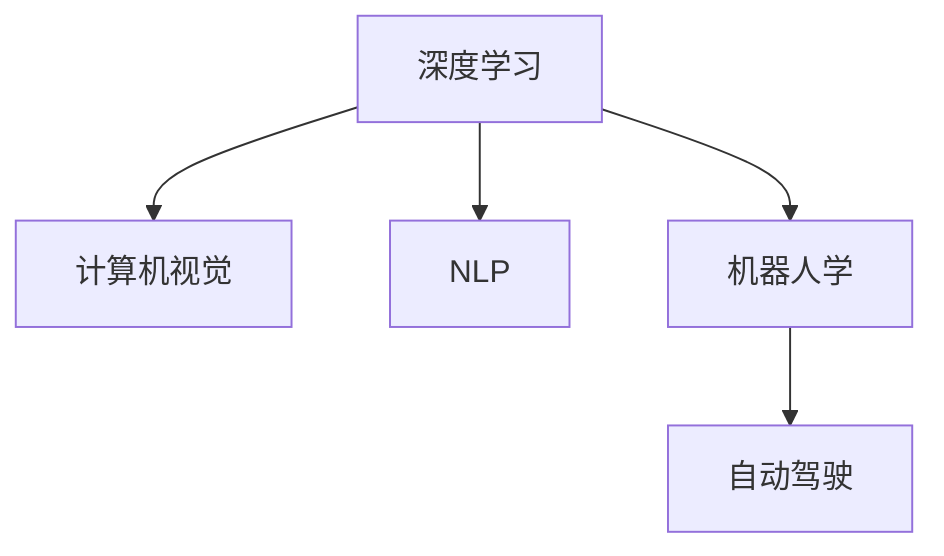

                 

# Andrej Karpathy：人工智能的未来发展趋势

> 关键词：人工智能,深度学习,深度神经网络,未来趋势,计算机视觉,自然语言处理,机器人学,自动驾驶

## 1. 背景介绍

### 1.1 问题由来
随着人工智能（AI）技术的不断进步，人工智能在各行各业中的应用愈发广泛。从智能助手到自动驾驶，从图像识别到自然语言处理，人工智能正深刻地影响着我们的生产和生活方式。然而，在人工智能领域，未来发展方向和技术趋势仍存在许多未解之谜。

### 1.2 问题核心关键点
为探索人工智能的未来发展趋势，本文章将基于著名AI专家Andrej Karpathy的研究成果，从深度学习、计算机视觉、自然语言处理和机器人学等多个角度，深入分析人工智能的发展方向和潜在挑战。

## 2. 核心概念与联系

### 2.1 核心概念概述

为更好地理解人工智能的未来发展趋势，本节将介绍几个密切相关的核心概念：

- 深度学习（Deep Learning）：利用深度神经网络实现复杂数据分析和模式识别的一种机器学习方法。
- 计算机视觉（Computer Vision）：使计算机能够理解图像和视频内容，如对象识别、场景理解、动作捕捉等。
- 自然语言处理（Natural Language Processing, NLP）：使计算机能够理解、处理和生成自然语言文本，如文本分类、情感分析、机器翻译等。
- 机器人学（Robotics）：结合AI和机械工程，实现自主操作和智能决策的机器人系统。
- 自动驾驶（Autonomous Driving）：基于AI的车辆导航系统，使车辆能够自动驾驶，实现交通和运输智能化。

这些核心概念之间的逻辑关系可以通过以下Mermaid流程图来展示：



这个流程图展示了几大人工智能领域之间的联系和互动：

1. 深度学习是计算机视觉、自然语言处理和机器人学等领域的核心算法基础。
2. 计算机视觉主要利用深度学习中的卷积神经网络（CNN）等模型实现图像和视频内容的理解。
3. NLP利用深度学习中的循环神经网络（RNN）等模型实现语言文本的生成和理解。
4. 机器人学将计算机视觉和自然语言处理技术应用于自主导航和智能决策中。
5. 自动驾驶是机器人学和计算机视觉技术的典型应用场景。

## 3. 核心算法原理 & 具体操作步骤
### 3.1 算法原理概述

人工智能的未来发展趋势涉及深度学习、计算机视觉、自然语言处理和机器人学等多个方面。这些领域的核心算法原理可以归纳为以下几个方面：

- **深度学习算法**：通过多层次神经网络结构，实现复杂模式和关系的自动学习。
- **计算机视觉算法**：结合卷积神经网络（CNN）、循环神经网络（RNN）等模型，实现图像和视频内容的自动分析和理解。
- **自然语言处理算法**：利用循环神经网络（RNN）、长短时记忆网络（LSTM）、变分自编码器（VAE）等模型，实现文本和语音的自动处理和生成。
- **机器人学算法**：融合计算机视觉和自然语言处理技术，实现机器人的自主导航和智能决策。
- **自动驾驶算法**：结合计算机视觉和机器人学技术，实现车辆的自主驾驶和交通智能化。

### 3.2 算法步骤详解

深度学习、计算机视觉、自然语言处理和机器人学的未来发展趋势涉及以下几个关键步骤：

**Step 1: 数据收集与预处理**
- 数据收集：从各种传感器、摄像头、文本数据库等渠道收集相关数据。
- 数据预处理：对数据进行清洗、去噪、增强等预处理操作。

**Step 2: 模型设计与训练**
- 模型设计：选择合适的深度神经网络结构，如卷积神经网络（CNN）、循环神经网络（RNN）、长短时记忆网络（LSTM）、变分自编码器（VAE）等。
- 模型训练：利用GPU/TPU等硬件资源，在大量数据集上进行模型训练。

**Step 3: 模型优化与调参**
- 模型优化：使用梯度下降、Adam等优化算法，调整模型参数。
- 调参：通过交叉验证、网格搜索等方法，调整模型超参数。

**Step 4: 模型评估与部署**
- 模型评估：在验证集上评估模型性能，如准确率、召回率、F1-score等指标。
- 模型部署：将模型部署到实际应用场景中，如智能助手、自动驾驶、机器人等。

**Step 5: 持续学习与迭代**
- 持续学习：在实际应用中不断收集新数据，更新和优化模型。
- 迭代改进：根据反馈数据，不断迭代改进模型性能。

### 3.3 算法优缺点

人工智能在深度学习、计算机视觉、自然语言处理和机器人学等领域的应用，具有以下优点：

- **高效性**：通过深度神经网络等模型，能够高效地处理和分析大量数据。
- **鲁棒性**：深度学习模型具有较强的泛化能力，能够在各种场景下稳定运行。
- **创新性**：AI技术不断推动科学技术的进步，带来新的研究范式和应用场景。

同时，也存在一些局限性：

- **数据依赖**：模型训练和优化需要大量的标注数据，数据收集和标注成本较高。
- **计算资源需求**：深度神经网络等模型的计算资源需求大，对硬件要求较高。
- **可解释性不足**：AI模型的决策过程难以解释，缺乏透明性和可信度。
- **伦理和安全问题**：AI技术可能带来伦理和法律风险，如数据隐私、偏见等问题。

### 3.4 算法应用领域

人工智能在深度学习、计算机视觉、自然语言处理和机器人学等领域的广泛应用，涵盖了许多实际场景：

- **计算机视觉**：应用于面部识别、医学影像分析、智能监控等领域。
- **自然语言处理**：应用于机器翻译、情感分析、智能客服等领域。
- **机器人学**：应用于工业自动化、家庭服务、医疗康复等领域。
- **自动驾驶**：应用于智能交通、自动驾驶汽车等领域。

## 4. 数学模型和公式 & 详细讲解 & 举例说明

### 4.1 数学模型构建

以下我们以计算机视觉中的图像分类任务为例，阐述其数学模型构建过程。

记输入图像为 $\mathbf{x}$，输出标签为 $y$，模型的预测结果为 $\hat{y}$。假设模型为一个简单的全连接神经网络，结构如下：

$$
\hat{y} = \sigma(\mathbf{W} \mathbf{x} + b)
$$

其中 $\sigma$ 为激活函数，$\mathbf{W}$ 和 $b$ 分别为权重和偏置向量。

### 4.2 公式推导过程

根据上述模型结构，损失函数通常采用交叉熵损失函数：

$$
L(\mathbf{W}, b) = -\frac{1}{N} \sum_{i=1}^N [y_i \log \hat{y}_i + (1-y_i) \log (1-\hat{y}_i)]
$$

其中 $N$ 为样本数。目标是最小化损失函数，即：

$$
\mathbf{W}^*, b^* = \mathop{\arg\min}_{\mathbf{W}, b} L(\mathbf{W}, b)
$$

通过反向传播算法计算损失函数对参数 $\mathbf{W}$ 和 $b$ 的梯度，并进行参数更新：

$$
\mathbf{W} \leftarrow \mathbf{W} - \eta \nabla_{\mathbf{W}} L(\mathbf{W}, b)
$$

$$
b \leftarrow b - \eta \nabla_{b} L(\mathbf{W}, b)
$$

其中 $\eta$ 为学习率。

### 4.3 案例分析与讲解

以计算机视觉中的图像分类任务为例，可以选取经典数据集如CIFAR-10、ImageNet等进行训练和测试。首先，利用神经网络对数据集进行特征提取，然后采用交叉熵损失函数进行模型训练，最终在验证集上评估模型性能。通过不断调整超参数和优化算法，提升模型精度和泛化能力。

## 5. 项目实践：代码实例和详细解释说明

### 5.1 开发环境搭建

在进行计算机视觉图像分类任务的实践前，我们需要准备好开发环境。以下是使用Python和TensorFlow进行代码实现的环境配置流程：

1. 安装Anaconda：从官网下载并安装Anaconda，用于创建独立的Python环境。

2. 创建并激活虚拟环境：
```bash
conda create -n tf-env python=3.8 
conda activate tf-env
```

3. 安装TensorFlow：
```bash
pip install tensorflow
```

4. 安装各类工具包：
```bash
pip install numpy pandas scikit-learn matplotlib tqdm jupyter notebook ipython
```

完成上述步骤后，即可在`tf-env`环境中开始项目实践。

### 5.2 源代码详细实现

下面我们以计算机视觉中的图像分类任务为例，给出使用TensorFlow进行图像分类任务开发的PyTorch代码实现。

首先，定义图像分类任务的数学模型：

```python
import tensorflow as tf
from tensorflow.keras import layers

# 定义模型结构
model = tf.keras.Sequential([
    layers.Conv2D(32, (3, 3), activation='relu', input_shape=(32, 32, 3)),
    layers.MaxPooling2D((2, 2)),
    layers.Conv2D(64, (3, 3), activation='relu'),
    layers.MaxPooling2D((2, 2)),
    layers.Conv2D(64, (3, 3), activation='relu'),
    layers.Flatten(),
    layers.Dense(64, activation='relu'),
    layers.Dense(10, activation='softmax')
])
```

然后，定义数据集和数据预处理：

```python
from tensorflow.keras.datasets import cifar10
from tensorflow.keras.preprocessing.image import ImageDataGenerator

# 加载数据集
(x_train, y_train), (x_test, y_test) = cifar10.load_data()

# 数据预处理
x_train = x_train / 255.0
x_test = x_test / 255.0

# 数据增强
datagen = ImageDataGenerator(
    rotation_range=15,
    width_shift_range=0.1,
    height_shift_range=0.1,
    horizontal_flip=True,
    fill_mode='nearest')
```

接着，定义训练和评估函数：

```python
def train_epoch(model, dataset, batch_size, optimizer):
    model.compile(optimizer=optimizer, loss='sparse_categorical_crossentropy', metrics=['accuracy'])
    model.fit(dataset, batch_size=batch_size, epochs=1, verbose=0)
    return model.evaluate(dataset, batch_size=batch_size, verbose=0)[1]

def evaluate(model, dataset, batch_size):
    return model.evaluate(dataset, batch_size=batch_size, verbose=0)[1]
```

最后，启动训练流程并在测试集上评估：

```python
epochs = 10
batch_size = 32

# 定义优化器
optimizer = tf.keras.optimizers.Adam(learning_rate=0.001)

# 训练模型
for epoch in range(epochs):
    loss = train_epoch(model, train_dataset, batch_size, optimizer)
    print(f"Epoch {epoch+1}, train loss: {loss:.3f}")
    
    # 在测试集上评估
    print(f"Epoch {epoch+1}, test accuracy: {evaluate(model, test_dataset, batch_size):.3f}")
```

以上就是使用TensorFlow进行计算机视觉图像分类任务微调的完整代码实现。可以看到，TensorFlow提供了丰富的模型和工具库，可以方便地进行深度学习模型的开发和训练。

### 5.3 代码解读与分析

让我们再详细解读一下关键代码的实现细节：

**模型定义**：
- `Sequential`模型：顺序组织网络层。
- `Conv2D`层：卷积层，用于特征提取。
- `MaxPooling2D`层：池化层，用于降低特征维度。
- `Flatten`层：将二维特征图展平。
- `Dense`层：全连接层，用于分类。

**数据集和预处理**：
- `cifar10.load_data()`：加载CIFAR-10数据集。
- `ImageDataGenerator`：用于数据增强，防止过拟合。

**训练和评估函数**：
- `train_epoch`函数：对模型进行单次迭代训练，返回损失和精度。
- `evaluate`函数：在测试集上评估模型精度。

**训练流程**：
- 循环训练多轮，在每个epoch后打印训练损失和精度。
- 在测试集上评估模型精度，输出结果。

可以看到，TensorFlow提供了灵活的模型定义和数据处理工具，可以方便地进行图像分类任务的开发。

## 6. 实际应用场景

### 6.1 智能监控系统

基于深度学习的计算机视觉技术，可以广泛应用于智能监控系统中。传统的监控系统主要依赖人工查看视频，耗费人力和时间，难以快速响应异常情况。而使用深度学习模型对监控视频进行自动分析和理解，能够快速识别出可疑行为，提高监控系统的智能化水平。

在技术实现上，可以收集大量监控视频数据，利用深度神经网络进行模型训练，然后在实时监控视频中应用模型，自动检测出异常事件。对于检测到的异常行为，系统可以自动触发报警，或者自动记录并回放，以便人工进一步处理。

### 6.2 医学影像分析

医学影像分析是计算机视觉的重要应用领域。传统的医学影像诊断主要依赖专业医生的经验，耗时且准确性有限。利用深度学习模型对医学影像进行自动分析和理解，能够快速识别出异常结构，提供准确的诊断结果，辅助医生做出更科学的决策。

在技术实现上，可以收集大量医学影像数据，利用深度神经网络进行模型训练，然后在新的医学影像中应用模型，自动检测出异常结构。对于检测到的异常情况，系统可以自动生成诊断报告，或者提供可视化提示，供医生进一步审核。

### 6.3 智能客服系统

基于自然语言处理的AI技术，可以广泛应用于智能客服系统中。传统的客服系统主要依赖人工客服，需要大量人力投入，高峰期响应速度较慢。而使用深度学习模型对客户提问进行自动理解和处理，能够快速回答客户问题，提升客户满意度。

在技术实现上，可以收集大量历史客服对话数据，利用深度神经网络进行模型训练，然后在客户提问中应用模型，自动匹配最合适的回复模板。对于客户提出的新问题，系统可以自动记录并分析，以便不断优化模型。

### 6.4 未来应用展望

随着深度学习、计算机视觉、自然语言处理和机器人学等技术的不断发展，未来AI的应用场景将更加广泛。以下列举一些可能的未来应用：

1. **智能医疗诊断**：基于医学影像和病历数据的深度学习模型，能够快速诊断出疾病，辅助医生做出更准确的诊断和治疗决策。
2. **自动驾驶汽车**：基于计算机视觉和机器人学技术的自动驾驶系统，能够实现高精度导航和决策，保障行车安全。
3. **智能家居系统**：基于自然语言处理和机器人学技术的智能家居系统，能够实现语音控制、自动导航等功能，提升家庭生活便利性。
4. **虚拟助手**：基于自然语言处理和深度学习技术的虚拟助手，能够提供语音助手、智能推荐等功能，改善用户体验。
5. **智能安防系统**：基于深度学习和计算机视觉技术的智能安防系统，能够实现人脸识别、行为分析等功能，提升公共安全水平。

## 7. 工具和资源推荐

### 7.1 学习资源推荐

为了帮助开发者系统掌握人工智能的未来发展趋势，这里推荐一些优质的学习资源：

1. Coursera《Deep Learning Specialization》课程：由Andrew Ng主讲，全面介绍深度学习的基本概念和实践技巧。
2. Udacity《Machine Learning Engineer》课程：涵盖机器学习算法和工程实践，适合初学者和进阶开发者。
3. Fast.ai《Practical Deep Learning for Coders》课程：适合编程人员学习，通过项目实战，快速掌握深度学习开发。
4. DeepLearning.AI《AI For Everyone》课程：由Andrew Ng主讲，涵盖人工智能的基本概念和应用场景。
5. Andrej Karpathy《Deep Learning》书籍：全面介绍深度学习的基本原理和实践技巧。

通过对这些资源的学习实践，相信你一定能够快速掌握人工智能的未来发展趋势，并用于解决实际的AI问题。

### 7.2 开发工具推荐

高效的开发离不开优秀的工具支持。以下是几款用于深度学习开发的工具：

1. PyTorch：基于Python的开源深度学习框架，灵活动态的计算图，适合快速迭代研究。
2. TensorFlow：由Google主导开发的开源深度学习框架，生产部署方便，适合大规模工程应用。
3. Keras：高层API，易于上手，支持多种深度学习框架，适合快速原型开发。
4. MXNet：支持多语言和多种硬件平台，适合高性能计算和分布式训练。
5. Caffe：支持深度神经网络和卷积神经网络，适合图像处理和计算机视觉应用。

合理利用这些工具，可以显著提升深度学习项目的开发效率，加快创新迭代的步伐。

### 7.3 相关论文推荐

人工智能在深度学习、计算机视觉、自然语言处理和机器人学等领域的发展源于学界的持续研究。以下是几篇奠基性的相关论文，推荐阅读：

1. AlexNet：ImageNet大规模视觉识别竞赛冠军，引入卷积神经网络（CNN）结构，开创计算机视觉深度学习时代。
2. ResNet：深度残差网络，解决深度神经网络梯度消失问题，提升模型深度和精度。
3. RNN和LSTM：循环神经网络（RNN）和长短时记忆网络（LSTM），应用于自然语言处理中的语言建模和文本生成任务。
4. Transformer：基于自注意力机制的神经网络模型，应用于自然语言处理中的机器翻译和文本生成任务。
5. Autoencoder：自编码器，用于数据降维和特征提取，广泛应用于图像处理和信号处理领域。

这些论文代表了大规模深度学习模型和算法的演进脉络。通过学习这些前沿成果，可以帮助研究者把握学科前进方向，激发更多的创新灵感。

## 8. 总结：未来发展趋势与挑战

### 8.1 总结

本文对人工智能的未来发展趋势进行了全面系统的介绍。首先阐述了深度学习、计算机视觉、自然语言处理和机器人学等技术的基本原理和核心算法。然后，通过TensorFlow等工具，展示了深度学习模型的具体实现过程。最后，从智能监控系统、医学影像分析、智能客服系统等多个实际应用场景，探讨了未来AI技术的发展方向和潜在挑战。

通过本文的系统梳理，可以看到，人工智能在深度学习、计算机视觉、自然语言处理和机器人学等领域的应用前景广阔。深度学习模型的广泛应用，不仅推动了AI技术的发展，也为各行各业带来了新的变革和机遇。

### 8.2 未来发展趋势

展望未来，人工智能在深度学习、计算机视觉、自然语言处理和机器人学等领域的发展趋势如下：

1. **深度学习算法**：深度神经网络结构将不断优化和升级，提升模型的精度和泛化能力。
2. **计算机视觉算法**：卷积神经网络（CNN）和自注意力机制（Transformer）将继续深化，应用于更广泛的图像和视频处理任务。
3. **自然语言处理算法**：语言模型（如GPT、BERT）将继续演化，提升模型的理解能力和生成能力。
4. **机器人学算法**：融合计算机视觉和自然语言处理技术，实现更智能、自主的机器人系统。
5. **自动驾驶算法**：基于深度学习和计算机视觉技术的自动驾驶系统，将实现更高级别的自动驾驶功能。

### 8.3 面临的挑战

尽管人工智能在深度学习、计算机视觉、自然语言处理和机器人学等领域取得了显著进展，但仍面临以下挑战：

1. **数据依赖**：深度学习模型对大量标注数据的需求，使得数据收集和标注成本较高。
2. **计算资源需求**：深度神经网络等模型的计算资源需求大，对硬件要求较高。
3. **可解释性不足**：深度学习模型的决策过程难以解释，缺乏透明性和可信度。
4. **伦理和安全问题**：AI技术可能带来伦理和法律风险，如数据隐私、偏见等问题。

### 8.4 研究展望

为了克服上述挑战，未来的研究需要在以下几个方面寻求新的突破：

1. **数据生成和增强**：开发更多无监督和半监督学习算法，减少对标注数据的依赖。
2. **模型压缩和优化**：开发更高效、更轻量级的模型结构，降低计算资源需求。
3. **可解释性和透明性**：开发更可解释的深度学习模型，提升决策过程的透明性和可信度。
4. **伦理和安全保障**：引入伦理和安全保障机制，确保AI技术的合规性和安全性。

这些研究方向将引领人工智能技术迈向更高的台阶，为构建安全、可靠、可解释、可控的智能系统铺平道路。面向未来，人工智能技术还需要与其他技术进行更深入的融合，如知识表示、因果推理、强化学习等，多路径协同发力，共同推动人工智能技术的进步。

## 9. 附录：常见问题与解答

**Q1：深度学习模型的训练过程中，如何选择最优的学习率？**

A: 学习率是深度学习模型训练中的关键参数，通常需要根据模型和数据进行调整。一般来说，初始学习率可以选择1e-3到1e-2之间，然后根据模型在验证集上的表现逐步减小学习率。另外，也可以使用学习率调度策略，如学习率衰减、指数衰减等，确保学习率的平稳变化。

**Q2：深度学习模型的泛化能力如何提升？**

A: 提升深度学习模型的泛化能力需要从多个方面进行优化：
1. 数据增强：通过数据扩充和增强技术，增加训练数据的样本多样性。
2. 正则化：使用L2正则、Dropout等正则化技术，防止过拟合。
3. 模型结构设计：选择合适的模型结构和层数，避免模型过于复杂或过于简单。
4. 迁移学习：在已有任务上预训练模型，然后应用于新任务，提升模型的泛化能力。

**Q3：深度学习模型在实际应用中，如何实现高效推理？**

A: 深度学习模型的推理速度通常较慢，需要优化推理过程以提升效率：
1. 量化加速：将浮点模型转为定点模型，降低计算资源消耗。
2. 模型裁剪：去除不必要的层和参数，减小模型尺寸。
3. 分布式计算：使用分布式计算技术，提高模型推理速度。
4. 硬件优化：采用GPU、TPU等高性能硬件，加速模型推理。

**Q4：深度学习模型在实际应用中，如何保证模型的可解释性？**

A: 深度学习模型的可解释性一直是一个重要问题，可以通过以下方法提升模型的可解释性：
1. 模型可视化：使用模型可视化工具，展示模型的关键特征和推理过程。
2. 可解释性模型：使用可解释性强的模型结构，如LIME、SHAP等。
3. 部分可解释：通过部分可解释技术，提供部分模型的解释，确保模型部分输出的可解释性。

**Q5：深度学习模型在实际应用中，如何避免数据偏见和伦理问题？**

A: 深度学习模型在实际应用中，需要注意数据偏见和伦理问题，可以通过以下方法避免：
1. 数据清洗：清洗数据集中的偏见和错误信息，确保数据集的多样性和公平性。
2. 模型公平性：开发公平性算法，确保模型对不同群体的公平性。
3. 伦理审查：在模型开发和部署过程中，进行伦理审查和监督，确保模型的合规性和安全性。

以上是深度学习模型在实际应用中常见问题的解答，希望能为您的深度学习实践提供参考和帮助。

---

作者：禅与计算机程序设计艺术 / Zen and the Art of Computer Programming

