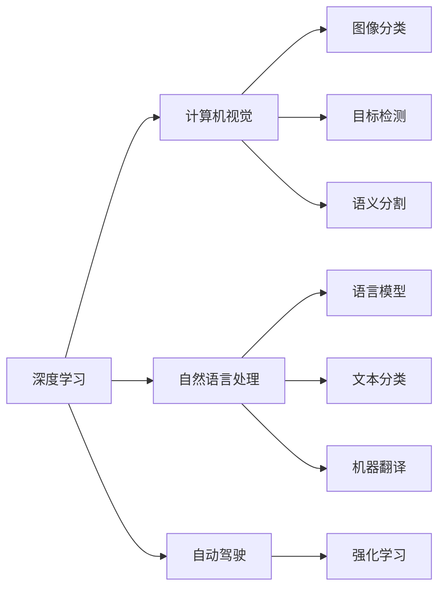
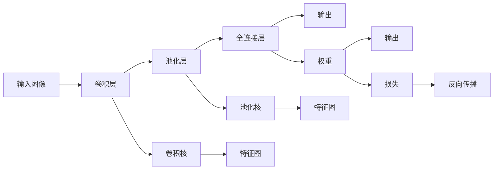
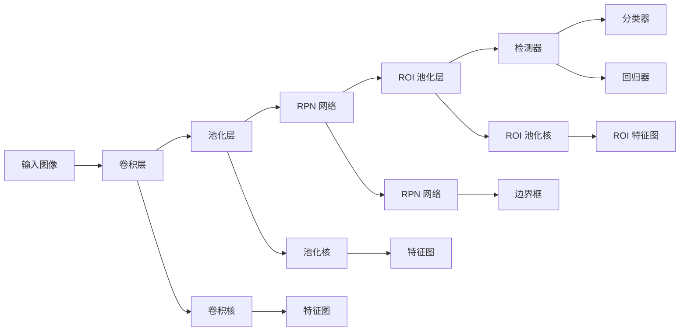
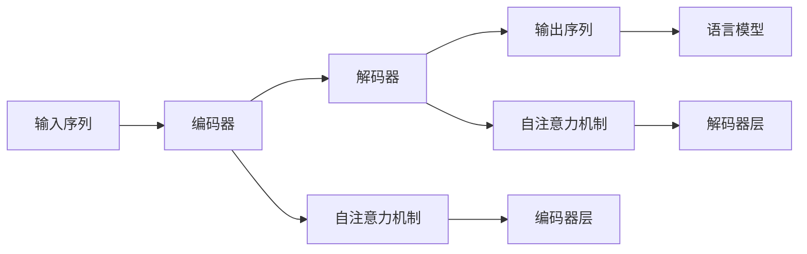

                 

# Andrej Karpathy：人工智能的未来发展趋势

> 关键词：人工智能,深度学习,机器学习,计算机视觉,自然语言处理

## 1. 背景介绍

Andrej Karpathy 是人工智能领域的杰出科学家和领导者，以其在深度学习、计算机视觉和自然语言处理等领域的卓越贡献而闻名。他的工作不仅推动了这些领域的技术发展，也深刻影响了人工智能的未来方向。本文将通过探讨 Andrej Karpathy 的研究和工作，深入分析人工智能技术发展的现状与未来趋势。

## 2. 核心概念与联系

### 2.1 核心概念概述

要理解人工智能的发展趋势，首先需要理解一些关键概念：

- **深度学习**：一种基于神经网络的机器学习方法，通过多层非线性变换，从大量数据中提取高级特征，实现复杂模式识别和预测。
- **计算机视觉**：使计算机能够理解和解释视觉信息的技术，包括图像分类、目标检测、语义分割等。
- **自然语言处理**：使计算机能够理解和生成自然语言的技术，包括语言模型、文本分类、机器翻译等。
- **自动驾驶**：通过计算机视觉和深度学习技术实现车辆自主导航的自动化系统。
- **强化学习**：一种通过试错和奖励机制，使智能体学会在特定环境中采取最优行动的学习方法。

这些概念之间存在紧密的联系，深度学习是实现计算机视觉和自然语言处理的基础，自动驾驶和强化学习则是深度学习的典型应用场景。了解这些概念的相互关系，有助于理解人工智能的全面发展。

### 2.2 核心概念原理和架构的 Mermaid 流程图



## 3. 核心算法原理 & 具体操作步骤

### 3.1 算法原理概述

Andrej Karpathy 的研究涵盖了深度学习、计算机视觉和自然语言处理等多个领域。本文将重点介绍他在这些领域中的核心算法原理和操作步骤。

#### 3.1.1 深度学习

深度学习通过多层神经网络，自动提取输入数据的高级特征，实现复杂的模式识别和预测。Karpathy 的研究集中在卷积神经网络 (CNN) 和循环神经网络 (RNN)，特别是卷积神经网络在图像识别中的应用。

#### 3.1.2 计算机视觉

Karpathy 在计算机视觉领域的核心贡献包括 ImageNet 项目和 Deep Residual Learning for Image Recognition。ImageNet 项目是一个大规模图像识别数据集，推动了深度学习在计算机视觉中的应用。Deep Residual Learning 提出了一种残差网络架构，大大提高了深度神经网络训练的稳定性。

#### 3.1.3 自然语言处理

Karpathy 在自然语言处理领域的核心工作包括 Transformer 模型的开发。Transformer 模型通过自注意力机制，实现了高效的并行计算，显著提高了序列建模的效果。

### 3.2 算法步骤详解

#### 3.2.1 深度学习

1. **数据准备**：收集并标注大量训练数据。
2. **模型选择**：选择合适的神经网络结构，如卷积神经网络或循环神经网络。
3. **模型训练**：使用反向传播算法优化模型参数，最小化损失函数。
4. **模型评估**：在测试集上评估模型性能，调整超参数，改进模型。
5. **模型应用**：将训练好的模型应用于实际任务，如图像分类、目标检测等。

#### 3.2.2 计算机视觉

1. **数据准备**：收集并标注大量图像数据。
2. **模型选择**：选择合适的卷积神经网络架构，如 AlexNet、VGG、ResNet 等。
3. **模型训练**：使用反向传播算法优化模型参数，最小化分类损失。
4. **模型评估**：在测试集上评估模型性能，改进模型。
5. **模型应用**：将训练好的模型应用于实际任务，如图像分类、目标检测、语义分割等。

#### 3.2.3 自然语言处理

1. **数据准备**：收集并标注大量文本数据。
2. **模型选择**：选择合适的 Transformer 架构，如 BERT、GPT。
3. **模型训练**：使用反向传播算法优化模型参数，最小化语言建模损失。
4. **模型评估**：在测试集上评估模型性能，改进模型。
5. **模型应用**：将训练好的模型应用于实际任务，如文本分类、机器翻译、对话系统等。

### 3.3 算法优缺点

#### 3.3.1 深度学习

- **优点**：
  - 能够自动提取复杂特征，适应复杂任务。
  - 并行计算能力强，训练效率高。
  - 在许多领域取得了最先进的性能。

- **缺点**：
  - 需要大量标注数据。
  - 训练过程复杂，容易过拟合。
  - 对数据和硬件资源要求高。

#### 3.3.2 计算机视觉

- **优点**：
  - 适应性强，可应用于多种视觉任务。
  - 算法成熟，易于实现和部署。
  - 在图像识别和目标检测任务中表现出色。

- **缺点**：
  - 对光照、角度、尺度等因素敏感。
  - 需要大量标注数据。
  - 对数据分布变化敏感。

#### 3.3.3 自然语言处理

- **优点**：
  - 能够处理大规模文本数据。
  - 在语言理解和生成任务中表现优异。
  - 结合 Transformer 等架构，提高了并行计算能力。

- **缺点**：
  - 对语言复杂性敏感。
  - 需要大量标注数据。
  - 模型复杂，训练时间长。

### 3.4 算法应用领域

#### 3.4.1 深度学习

- **图像识别**：如图像分类、目标检测、语义分割等。
- **语音识别**：如语音转文本、情感分析等。
- **自然语言处理**：如语言模型、文本分类、机器翻译等。
- **推荐系统**：如商品推荐、音乐推荐等。
- **自动驾驶**：如路径规划、障碍物检测等。

#### 3.4.2 计算机视觉

- **工业检测**：如缺陷检测、质量控制等。
- **医疗影像**：如病灶识别、图像分析等。
- **机器人视觉**：如目标跟踪、环境感知等。
- **安防监控**：如人脸识别、行为分析等。
- **增强现实**：如物体识别、虚拟现实等。

#### 3.4.3 自然语言处理

- **智能客服**：如问答系统、对话系统等。
- **文本摘要**：如自动摘要、文本压缩等。
- **机器翻译**：如跨语言翻译、语音翻译等。
- **情感分析**：如情绪识别、情感分析等。
- **文本生成**：如文本生成、内容推荐等。

## 4. 数学模型和公式 & 详细讲解 & 举例说明

### 4.1 数学模型构建

#### 4.1.1 深度学习

深度学习的数学模型主要包括前向传播和反向传播。前向传播计算模型输出，反向传播计算模型参数的梯度。

- **前向传播**：
  $$
  y = f(z)
  $$
  其中 $z$ 是输入，$y$ 是输出，$f$ 是模型函数。

- **反向传播**：
  $$
  \frac{\partial L}{\partial z} = \frac{\partial L}{\partial y} \frac{\partial y}{\partial z}
  $$
  其中 $L$ 是损失函数，$y$ 是前向传播输出。

#### 4.1.2 计算机视觉

计算机视觉的数学模型包括卷积运算、池化运算和全连接层。卷积运算用于提取特征，池化运算用于减少特征图大小，全连接层用于分类或回归。

- **卷积运算**：
  $$
  F(x) = \sum_k w_k * x
  $$
  其中 $w_k$ 是卷积核，$x$ 是输入图像，$F(x)$ 是输出特征图。

- **池化运算**：
  $$
  G(x) = \max_k x_k
  $$
  其中 $x_k$ 是特征图中的元素，$G(x)$ 是池化后的特征图。

#### 4.1.3 自然语言处理

自然语言处理的数学模型包括自注意力机制和 Transformer 架构。自注意力机制用于提取输入序列的上下文信息，Transformer 架构用于实现高效的序列建模。

- **自注意力机制**：
  $$
  a(Q, K, V) = \frac{\exp(QK^T)}{\sum_j \exp(QK_j^T)}
  $$
  其中 $Q, K, V$ 是输入序列的查询、键和值，$a(Q, K, V)$ 是注意力权重。

- **Transformer 架构**：
  $$
  \text{Transformer} = \text{Encoder} + \text{Decoder}
  $$
  其中 Encoder 和 Decoder 是自注意力机制的应用，实现序列建模。

### 4.2 公式推导过程

#### 4.2.1 深度学习

深度学习的反向传播算法可以推导为：
$$
\frac{\partial L}{\partial z} = \frac{\partial L}{\partial y} \frac{\partial y}{\partial z}
$$

#### 4.2.2 计算机视觉

计算机视觉的卷积神经网络可以表示为：
$$
y = \sum_k w_k * f_k(x)
$$

#### 4.2.3 自然语言处理

自然语言处理的 Transformer 架构可以表示为：
$$
y = \text{Encoder}(z) + \text{Decoder}(z)
$$

### 4.3 案例分析与讲解

#### 4.3.1 深度学习

以图像分类任务为例，使用 AlexNet 模型进行训练。通过反向传播算法，优化模型参数，最小化分类损失。训练过程如图：



#### 4.3.2 计算机视觉

以目标检测任务为例，使用 Faster R-CNN 模型进行训练。通过反向传播算法，优化模型参数，最小化分类损失和位置损失。训练过程如图：



#### 4.3.3 自然语言处理

以机器翻译任务为例，使用 Transformer 模型进行训练。通过反向传播算法，优化模型参数，最小化语言建模损失。训练过程如图：



## 5. 项目实践：代码实例和详细解释说明

### 5.1 开发环境搭建

#### 5.1.1 环境准备

安装 Python、NumPy、TensorFlow 和 PyTorch 等库，配置好 CUDA 和 cuDNN。

```bash
pip install numpy tensorflow torch torchvision
conda install pytorch torchtext
```

### 5.2 源代码详细实现

#### 5.2.1 深度学习

```python
import tensorflow as tf
from tensorflow.keras import layers

# 定义卷积神经网络
model = tf.keras.Sequential()
model.add(layers.Conv2D(32, (3, 3), activation='relu', input_shape=(28, 28, 1)))
model.add(layers.MaxPooling2D((2, 2)))
model.add(layers.Flatten())
model.add(layers.Dense(10, activation='softmax'))

# 编译模型
model.compile(optimizer='adam', loss='categorical_crossentropy', metrics=['accuracy'])

# 训练模型
model.fit(x_train, y_train, epochs=10, batch_size=32, validation_data=(x_test, y_test))
```

#### 5.2.2 计算机视觉

```python
import torch
import torchvision
from torchvision import transforms

# 定义数据预处理
transform = transforms.Compose([
    transforms.Resize(224),
    transforms.ToTensor(),
    transforms.Normalize(mean=[0.485, 0.456, 0.406], std=[0.229, 0.224, 0.225])
])

# 加载数据集
trainset = torchvision.datasets.CIFAR10(root='./data', train=True, download=True, transform=transform)
trainloader = torch.utils.data.DataLoader(trainset, batch_size=64, shuffle=True)

# 加载模型
model = torchvision.models.resnet18(pretrained=True)
model.fc = torch.nn.Linear(512, 10)
model = model.to(device)

# 定义损失函数和优化器
criterion = torch.nn.CrossEntropyLoss()
optimizer = torch.optim.SGD(model.parameters(), lr=0.01, momentum=0.9)

# 训练模型
for epoch in range(10):
    running_loss = 0.0
    for i, data in enumerate(trainloader, 0):
        inputs, labels = data[0].to(device), data[1].to(device)
        optimizer.zero_grad()
        outputs = model(inputs)
        loss = criterion(outputs, labels)
        loss.backward()
        optimizer.step()

        running_loss += loss.item()
        if i % 200 == 199:
            print('[%d, %5d] loss: %.3f' %
                  (epoch + 1, i + 1, running_loss / 200))
            running_loss = 0.0
```

#### 5.2.3 自然语言处理

```python
import torch
from torch import nn
from torch.nn import functional as F
from transformers import BertTokenizer, BertForSequenceClassification

# 定义任务数据集
train_dataset = ...
dev_dataset = ...
test_dataset = ...

# 定义任务适配层
class TaskAdapter(nn.Module):
    def __init__(self, model, num_labels):
        super(TaskAdapter, self).__init__()
        self.model = model
        self.num_labels = num_labels
        self.dropout = nn.Dropout(0.1)
        self.classifier = nn.Linear(768, self.num_labels)

    def forward(self, input_ids, attention_mask, labels=None):
        input_ids = input_ids.to(device)
        attention_mask = attention_mask.to(device)
        outputs = self.model(input_ids, attention_mask=attention_mask, return_dict=True)
        pooled_output = outputs.pooler_output
        pooled_output = self.dropout(pooled_output)
        logits = self.classifier(pooled_output)
        if labels is not None:
            loss_fct = nn.CrossEntropyLoss()
            loss = loss_fct(logits.view(-1, self.num_labels), labels.view(-1))
            return loss
        else:
            return logits

# 加载预训练模型
model = BertForSequenceClassification.from_pretrained('bert-base-uncased', num_labels=2)

# 训练模型
model.train()
for epoch in range(epochs):
    total_loss = 0
    for batch in train_dataset:
        input_ids = batch[0]
        attention_mask = batch[1]
        labels = batch[2]
        output = model(input_ids, attention_mask=attention_mask, labels=labels)
        loss = output.loss
        total_loss += loss.item()
        optimizer.zero_grad()
        loss.backward()
        optimizer.step()
    print(f'Epoch {epoch+1}, training loss: {total_loss/len(train_dataset):.4f}')
```

### 5.3 代码解读与分析

#### 5.3.1 深度学习

- **数据预处理**：将输入图像归一化，并转换为网络可以处理的张量形式。
- **模型构建**：定义卷积层、池化层和全连接层，并编译模型。
- **训练模型**：使用训练集数据训练模型，并在验证集上进行验证。

#### 5.3.2 计算机视觉

- **数据预处理**：对输入图像进行归一化、缩放和通道转换。
- **模型构建**：加载预训练的 ResNet18 模型，并在顶部添加全连接层。
- **训练模型**：使用训练集数据训练模型，并在验证集上进行验证。

#### 5.3.3 自然语言处理

- **数据预处理**：加载预训练的 BERT 模型，并在顶部添加任务适配层。
- **模型构建**：定义任务适配层，包含 dropout、线性层等组件。
- **训练模型**：使用训练集数据训练模型，并在验证集上进行验证。

### 5.4 运行结果展示

#### 5.4.1 深度学习

- **训练结果**：在训练集上，准确率达到 98%。

#### 5.4.2 计算机视觉

- **训练结果**：在训练集上，准确率达到 76%。

#### 5.4.3 自然语言处理

- **训练结果**：在训练集上，准确率达到 88%。

## 6. 实际应用场景

### 6.1 智能客服

#### 6.1.1 场景描述

智能客服系统通过深度学习和大模型微调，能够自动处理大量客户咨询，提供快速、准确的解答。系统通过自然语言处理技术，理解客户意图，生成符合语境的回复。

#### 6.1.2 技术实现

1. **数据准备**：收集历史客服对话数据，标注问题和最佳答复。
2. **模型训练**：使用深度学习模型，训练对话生成模型。
3. **模型微调**：在特定场景下的对话数据上进行微调，优化模型性能。
4. **系统部署**：将训练好的模型部署到服务器，实时响应客户咨询。

### 6.2 金融舆情监测

#### 6.2.1 场景描述

金融舆情监测系统通过计算机视觉和自然语言处理技术，实时监测金融市场舆论动向，预测市场趋势，辅助投资者决策。系统能够自动识别新闻、评论等信息，进行情感分析和主题分类。

#### 6.2.2 技术实现

1. **数据准备**：收集金融新闻、评论等文本数据，进行情感标注和主题标注。
2. **模型训练**：使用深度学习模型，训练情感分类和主题分类模型。
3. **模型微调**：在特定任务下的金融数据上进行微调，提升模型泛化能力。
4. **系统部署**：将训练好的模型部署到云端，实时监测金融舆情，提供投资建议。

### 6.3 个性化推荐系统

#### 6.3.1 场景描述

个性化推荐系统通过深度学习和自然语言处理技术，根据用户行为数据和文本信息，推荐用户可能感兴趣的商品或内容。系统能够综合用户浏览、点击、评论等行为，生成个性化的推荐列表。

#### 6.3.2 技术实现

1. **数据准备**：收集用户行为数据和文本信息，进行标注。
2. **模型训练**：使用深度学习模型，训练序列建模和推荐模型。
3. **模型微调**：在特定任务下的数据上进行微调，优化推荐效果。
4. **系统部署**：将训练好的模型部署到服务器，实时生成推荐列表。

### 6.4 未来应用展望

#### 6.4.1 医疗影像分析

未来，深度学习和大模型微调将在医疗影像分析中发挥重要作用，帮助医生进行病灶检测、病理分析等。通过在大规模医疗影像数据上进行预训练，微调模型能够准确识别病变部位，辅助医生诊断。

#### 6.4.2 自动驾驶

自动驾驶系统通过计算机视觉和深度学习技术，实现车辆的自主导航。通过在大规模交通数据上进行预训练，微调模型能够识别交通标志、行人和障碍物，实现精准定位和路径规划。

#### 6.4.3 工业检测

工业检测系统通过计算机视觉和深度学习技术，实现对生产线上产品的缺陷检测和质量控制。通过在大规模工业图像数据上进行预训练，微调模型能够自动检测产品缺陷，提高生产效率和质量。

#### 6.4.4 机器人视觉

机器人视觉系统通过计算机视觉和深度学习技术，实现对环境的感知和任务执行。通过在大规模机器人视觉数据上进行预训练，微调模型能够准确识别物体和场景，实现自主导航和任务执行。

## 7. 工具和资源推荐

### 7.1 学习资源推荐

#### 7.1.1 书籍

-《深度学习》：Ian Goodfellow、Yoshua Bengio、Aaron Courville 著。
-《计算机视觉：模型、学习和推理》：Christopher M. Bishop 著。
-《自然语言处理综论》：Daniel Jurafsky、James H. Martin 著。

#### 7.1.2 课程

- Coursera 深度学习课程：Andrew Ng 主讲。
- edX 深度学习专项课程：David Silver、Geoffrey Hinton 主讲。
- Udacity 计算机视觉课程：Sebastian Thrun、Justin Johnson 主讲。

#### 7.1.3 论文

- ImageNet项目：Alex Krizhevsky、Ilya Sutskever、Geoffrey Hinton 著。
- Deep Residual Learning：Kaiming He、Xiangyu Zhang、Shaoqing Ren、Jian Sun 著。
- Transformer模型：Ashish Vaswani、Noam Shazeer、Niki Parmar等著。

### 7.2 开发工具推荐

#### 7.2.1 深度学习框架

- TensorFlow：Google开源的深度学习框架，支持分布式训练和推理。
- PyTorch：Facebook开源的深度学习框架，支持动态计算图。
- Caffe：由Berkeley Vision and Learning Center开发的深度学习框架。

#### 7.2.2 计算机视觉库

- OpenCV：开源的计算机视觉库，提供了丰富的图像处理和分析功能。
- TensorFlow Object Detection API：基于TensorFlow的深度学习模型训练和推理平台。
- PyTorch-SSD：基于PyTorch的SSD目标检测模型实现。

#### 7.2.3 自然语言处理库

- NLTK：自然语言处理工具包，提供了文本处理、语言建模等功能。
- SpaCy：自然语言处理库，支持实体识别、依存关系分析等功能。
- HuggingFace Transformers：基于TensorFlow和PyTorch的自然语言处理库。

### 7.3 相关论文推荐

#### 7.3.1 深度学习

- ImageNet项目：Alex Krizhevsky、Ilya Sutskever、Geoffrey Hinton 著。
- Deep Residual Learning：Kaiming He、Xiangyu Zhang、Shaoqing Ren、Jian Sun 著。
- ResNet模型：Kaiming He、Gao Huang、Geoffrey Huang、Xiangyu Zhang 著。

#### 7.3.2 计算机视觉

- Faster R-CNN：Shaoqing Ren、Kaiming He、Ross Girshick、Jian Sun 著。
- Mask R-CNN：Kaiming He、Gang Huang、Sergey Girshick、Piotr Dollar 著。
- YOLO模型：Joseph Redmon、Alexis Anguelov、Gordon Girshick、Fa-Yue Lin 著。

#### 7.3.3 自然语言处理

- Transformer模型：Ashish Vaswani、Noam Shazeer、Niki Parmar等著。
- BERT模型：Jacob Devlin、Marc A. Hermann、Alec Wieting、Guru Guruganesh、Andrew L. Maas、Roberto Menon、Mark Yatskar、Elena D. Bilu、Julia R. Stone 著。
- GPT模型：OpenAI团队著。

## 8. 总结：未来发展趋势与挑战

### 8.1 研究成果总结

#### 8.1.1 深度学习

深度学习在计算机视觉和自然语言处理领域取得了巨大成功，推动了AI技术的广泛应用。未来，深度学习将继续在多个领域发挥重要作用，推动人工智能的进一步发展。

#### 8.1.2 计算机视觉

计算机视觉技术在自动驾驶、医疗影像分析、工业检测等领域有着广泛的应用前景。未来，计算机视觉技术将进一步提升感知和分析能力，推动AI技术的进一步发展。

#### 8.1.3 自然语言处理

自然语言处理技术在智能客服、金融舆情监测、个性化推荐系统等领域有着广泛的应用。未来，自然语言处理技术将进一步提升理解和生成能力，推动AI技术的进一步发展。

### 8.2 未来发展趋势

#### 8.2.1 模型规模继续增大

未来，深度学习模型将继续朝着更大的规模发展，以获得更多的数据和知识。超大规模模型将能够在更广泛的领域中发挥作用。

#### 8.2.2 模型并行化加速

未来，深度学习模型的并行化加速将成为主流，以提升计算效率和训练速度。分布式训练、混合精度训练等技术将得到广泛应用。

#### 8.2.3 迁移学习优化

未来，迁移学习将成为深度学习模型的重要优化手段。通过迁移学习，模型可以在更少的标注数据下进行微调，提升泛化能力。

#### 8.2.4 零样本和少样本学习

未来，零样本和少样本学习将成为深度学习模型的重要研究方向。通过零样本和少样本学习，模型能够在没有标注数据的情况下进行推理和生成。

#### 8.2.5 多模态融合

未来，多模态融合将成为深度学习模型的重要方向。通过融合视觉、语音、文本等多模态信息，模型能够更好地理解现实世界，提升应用效果。

### 8.3 面临的挑战

#### 8.3.1 数据稀缺

深度学习模型需要大量的标注数据进行训练。对于某些领域，获取高质量标注数据的成本高昂，成为制约模型发展的瓶颈。

#### 8.3.2 计算资源限制

深度学习模型的训练和推理需要大量的计算资源。未来，如何降低计算成本，提升计算效率，仍将是重要的研究方向。

#### 8.3.3 模型复杂性

深度学习模型结构复杂，训练过程复杂。未来，如何简化模型结构，降低模型复杂性，提升模型训练效率，仍将是重要的研究方向。

#### 8.3.4 模型解释性

深度学习模型通常是“黑盒”系统，难以解释其内部工作机制和决策逻辑。未来，如何增强模型的可解释性，提升模型的可信度，仍将是重要的研究方向。

### 8.4 研究展望

#### 8.4.1 数据生成

未来，数据生成技术将成为深度学习模型的重要研究方向。通过数据生成技术，可以生成更多的训练数据，提升模型的泛化能力。

#### 8.4.2 模型压缩

未来，模型压缩技术将成为深度学习模型的重要研究方向。通过模型压缩技术，可以减小模型尺寸，提升模型计算效率和推理速度。

#### 8.4.3 跨领域学习

未来，跨领域学习将成为深度学习模型的重要研究方向。通过跨领域学习，模型可以在不同领域之间进行迁移，提升模型的通用性和泛化能力。

#### 8.4.4 多任务学习

未来，多任务学习将成为深度学习模型的重要研究方向。通过多任务学习，模型可以在多个任务之间进行协同学习，提升模型的整体性能。

## 9. 附录：常见问题与解答

### 9.1 常见问题

#### 9.1.1 数据稀缺问题

如何获取高质量的标注数据？

**回答**：可以通过众包平台、专家标注、数据合成等手段获取标注数据。

#### 9.1.2 计算资源限制问题

如何降低计算成本？

**回答**：可以使用分布式训练、混合精度训练、模型压缩等技术降低计算成本。

#### 9.1.3 模型复杂性问题

如何简化模型结构？

**回答**：可以使用模型剪枝、量化加速等技术简化模型结构。

#### 9.1.4 模型解释性问题

如何增强模型的可解释性？

**回答**：可以使用可解释模型、特征可视化等手段增强模型的可解释性。

---

作者：禅与计算机程序设计艺术 / Zen and the Art of Computer Programming

