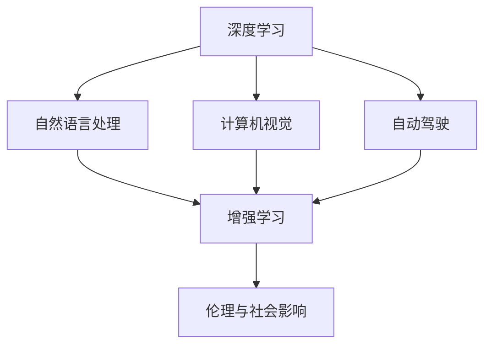

                 

# Andrej Karpathy：人工智能的未来愿景

> 关键词：人工智能(AI)，未来愿景，深度学习，机器学习，自然语言处理(NLP)，计算机视觉，自动驾驶，增强学习，伦理与社会影响

## 1. 背景介绍

### 1.1 问题由来
近年来，人工智能(AI)领域取得了前所未有的进步，尤其是在深度学习(Deep Learning)和机器学习(Machine Learning)方面。从图像识别到自然语言处理，从自动驾驶到机器人控制，AI技术正在迅速渗透到各行各业。面对这一波AI热潮，业界和学术界都在积极探讨和预测AI的未来发展方向，以便更好地把握机遇，应对挑战。

### 1.2 问题核心关键点
面对AI技术的快速演进，Andrej Karpathy作为AI领域的顶尖专家，曾在多个公开场合分享过他的未来愿景。他的观点主要聚焦于以下几个核心关键点：
- 深度学习与神经网络的前景与挑战。
- AI技术的广泛应用及其带来的社会影响。
- 增强学习的未来发展方向与理论突破。
- AI伦理与社会责任的思考与对策。

通过理解Karpathy的这些观点，我们可以对AI的未来发展有一个更加清晰和全面的认识。

### 1.3 问题研究意义
探讨Andrej Karpathy关于AI未来愿景的看法，对于了解AI技术的最新进展、预见其发展趋势、把握未来机遇和应对挑战具有重要意义：
- 预测未来：了解AI的发展方向，预见行业变革，提前做好布局。
- 技术选择：明确不同技术的优劣势，作出合理的技术选择。
- 伦理考量：提升对AI伦理和社会影响的认识，积极应对AI带来的挑战。
- 教育引导：为AI领域的教育和培养提供指导，培养未来的AI人才。

## 2. 核心概念与联系

### 2.1 核心概念概述

为更好地理解Andrej Karpathy关于AI未来愿景的讨论，本节将介绍几个关键概念：

- **深度学习**：利用神经网络模型，通过大量数据进行训练，实现对复杂非线性关系的建模。
- **机器学习**：通过数据驱动的方式，让机器从经验中学习，不断优化性能。
- **自然语言处理(NLP)**：让计算机理解、处理和生成自然语言。
- **计算机视觉**：让计算机“看”并理解图像和视频内容。
- **自动驾驶**：基于AI技术实现车辆自主导航和决策。
- **增强学习**：通过与环境的交互，让智能体不断学习最优策略。
- **伦理与社会影响**：研究AI技术对社会、道德和法律的影响。

这些概念之间的逻辑关系可以通过以下Mermaid流程图来展示：



这个流程图展示了大语言模型的核心概念及其之间的关系：

1. 深度学习是AI技术的基础，提供了强大的建模能力。
2. 自然语言处理、计算机视觉和自动驾驶等任务，都依赖于深度学习模型的能力。
3. 增强学习通过与环境的交互，不断优化智能体的决策策略。
4. 伦理与社会影响是AI技术应用过程中必须考虑的重要问题。

## 3. 核心算法原理 & 具体操作步骤

### 3.1 算法原理概述

Andrej Karpathy对AI未来的愿景主要基于深度学习和增强学习原理，具体包括：

- **深度学习**：通过多层神经网络，学习复杂的数据表示，实现对高维数据的有效建模。
- **增强学习**：通过与环境的交互，智能体通过试错不断优化其策略，实现最优的决策行为。
- **迁移学习**：利用已有的知识，在新任务上进行快速适应和优化。

这些原理构成了AI技术发展的基石，深刻影响了AI的应用前景和未来趋势。

### 3.2 算法步骤详解

基于Andrej Karpathy的观点，AI技术的发展和应用可以分为以下几个关键步骤：

**Step 1: 数据驱动的预训练**
- 收集和处理大规模数据集，通过自监督学习任务对深度模型进行预训练，学习到通用特征表示。

**Step 2: 迁移学习的微调**
- 将预训练模型应用于具体任务，通过微调学习新任务特定特征，优化模型性能。

**Step 3: 增强学习的应用**
- 在复杂的决策环境中，通过增强学习算法优化智能体策略，实现更优的决策行为。

**Step 4: 伦理与社会影响考量**
- 在AI技术应用过程中，重视伦理和社会影响，确保技术的公平、透明和可解释性。

**Step 5: 未来持续优化**
- 随着数据和算力的进步，不断优化和迭代AI模型，提升其性能和泛化能力。

### 3.3 算法优缺点

深度学习和增强学习算法具有以下优点：
1. 强大的建模能力：深度学习能够学习复杂的数据关系，增强学习能够优化复杂决策。
2. 广泛的应用场景：在NLP、CV、自动驾驶等领域都有广泛应用。
3. 高效的自动优化：通过大规模数据和复杂模型，自动优化模型性能。

同时，这些算法也存在一定的局限性：
1. 数据需求高：需要大量标注数据进行训练，获取高质量数据的成本较高。
2. 模型复杂度高：大规模深度模型需要高昂的计算资源和内存消耗。
3. 过拟合风险：深度模型容易过拟合，增强学习需要大量探索和试错。
4. 可解释性不足：深度模型通常是"黑盒"模型，难以解释其内部工作机制。
5. 伦理风险：AI技术可能带来隐私泄露、歧视等伦理问题。

尽管存在这些局限性，但就目前而言，深度学习和增强学习仍是AI技术的主流范式。未来相关研究的重点在于如何进一步降低对标注数据的依赖，提高模型的泛化能力和可解释性，同时兼顾伦理和社会影响。

### 3.4 算法应用领域

基于深度学习和增强学习算法的AI技术，已经在多个领域取得了显著成果，例如：

- **自然语言处理(NLP)**：机器翻译、文本分类、问答系统等。
- **计算机视觉(CV)**：图像识别、目标检测、图像生成等。
- **自动驾驶**：自动泊车、无人驾驶、路径规划等。
- **增强学习**：智能推荐系统、游戏AI、机器人控制等。
- **医疗健康**：疾病预测、影像诊断、个性化治疗等。
- **金融科技**：算法交易、风险管理、信用评分等。

除了这些经典应用外，AI技术还在更多领域得到创新应用，如智慧城市、智能制造、个性化教育等，为各行各业带来变革性影响。

## 4. 数学模型和公式 & 详细讲解

### 4.1 数学模型构建

本节将使用数学语言对深度学习和增强学习的基本模型进行描述。

假设我们有一个深度神经网络模型 $M_{\theta}$，其中 $\theta$ 为模型参数。对于自然语言处理任务，我们通常使用循环神经网络(RNN)或Transformer结构。对于计算机视觉任务，则使用卷积神经网络(CNN)。

### 4.2 公式推导过程

以循环神经网络为例，其基本模型结构如图：


其中，$x_t$ 为时间 $t$ 时刻的输入向量，$h_t$ 为时间 $t$ 时刻的隐藏状态向量，$y_t$ 为时间 $t$ 时刻的输出向量，$W$ 和 $b$ 为模型的权重和偏置。

在训练过程中，我们通常使用反向传播算法计算梯度，并使用优化算法（如Adam、SGD等）更新模型参数。假设当前时刻的损失函数为 $\ell$，则梯度更新公式为：

$$
\theta \leftarrow \theta - \eta \nabla_{\theta} \ell
$$

其中 $\eta$ 为学习率，$\nabla_{\theta} \ell$ 为损失函数对参数 $\theta$ 的梯度。

对于增强学习，我们通常使用Q-learning算法，其更新公式为：

$$
Q(s,a) \leftarrow Q(s,a) + \alpha (r + \gamma \max_{a'} Q(s',a') - Q(s,a))
$$

其中 $s$ 为当前状态，$a$ 为当前动作，$r$ 为即时奖励，$s'$ 为下一个状态，$\alpha$ 为学习率，$\gamma$ 为折扣因子。

### 4.3 案例分析与讲解

假设我们有一个情感分析模型，用于判断一段文本的情感极性。我们首先在大规模无标签文本数据上进行预训练，学习通用语言表示。然后在有标签的情感数据集上进行微调，学习情感极性分类任务。

具体来说，我们使用循环神经网络作为模型架构，预训练阶段使用语言建模任务，微调阶段使用二分类交叉熵损失函数进行训练。

在微调过程中，我们设置合适的学习率，并使用正则化技术防止过拟合。同时，我们通过数据增强等方式扩充训练集，提高模型的泛化能力。

最终，我们使用测试集评估模型的性能，通过调整模型结构和超参数，不断优化模型。

## 5. 项目实践：代码实例和详细解释说明

### 5.1 开发环境搭建

在进行AI项目实践前，我们需要准备好开发环境。以下是使用Python进行TensorFlow开发的环境配置流程：

1. 安装Anaconda：从官网下载并安装Anaconda，用于创建独立的Python环境。

2. 创建并激活虚拟环境：
```bash
conda create -n tf-env python=3.8 
conda activate tf-env
```

3. 安装TensorFlow：根据CUDA版本，从官网获取对应的安装命令。例如：
```bash
pip install tensorflow tensorflow-addons
```

4. 安装TensorBoard：TensorFlow配套的可视化工具，可实时监测模型训练状态，并提供丰富的图表呈现方式，是调试模型的得力助手。

5. 安装Weights & Biases：模型训练的实验跟踪工具，可以记录和可视化模型训练过程中的各项指标，方便对比和调优。

完成上述步骤后，即可在`tf-env`环境中开始AI项目的开发。

### 5.2 源代码详细实现

下面我们以情感分析任务为例，给出使用TensorFlow对深度模型进行训练和微调的PyTorch代码实现。

首先，定义数据处理函数：

```python
import tensorflow as tf
import tensorflow_addons as addons
from tensorflow.keras.datasets import imdb
from tensorflow.keras.preprocessing import sequence
import numpy as np

def load_data(path='imdb.npz'):
    data = np.load(path)
    (X_train, y_train), (X_test, y_test) = data['X'], data['y']
    return X_train, y_train, X_test, y_test

def pad_sequences(sequences, maxlen=300, padding='post', truncating='post'):
    return sequence.pad_sequences(sequences, maxlen=maxlen, padding=padding, truncating=truncating)
```

然后，定义模型：

```python
from tensorflow.keras.models import Sequential
from tensorflow.keras.layers import Embedding, LSTM, Dense

def build_model(vocab_size, maxlen):
    model = Sequential([
        Embedding(vocab_size, 128),
        LSTM(128, dropout=0.2, recurrent_dropout=0.2),
        Dense(1, activation='sigmoid')
    ])
    return model

def compile_model(model):
    model.compile(optimizer='adam', loss='binary_crossentropy', metrics=['accuracy'])
```

接着，定义训练和评估函数：

```python
def train_model(model, X_train, y_train, X_test, y_test, batch_size=32, epochs=10):
    model.fit(X_train, y_train, validation_data=(X_test, y_test), batch_size=batch_size, epochs=epochs, callbacks=[addons.callbacks.EarlyStopping(patience=3)])

def evaluate_model(model, X_test, y_test):
    score, acc = model.evaluate(X_test, y_test, verbose=0)
    print('Test loss:', score)
    print('Test accuracy:', acc)
```

最后，启动训练流程并在测试集上评估：

```python
vocab_size = 10000
maxlen = 300

(X_train, y_train, X_test, y_test) = load_data()

model = build_model(vocab_size, maxlen)
compile_model(model)

train_model(model, X_train, y_train, X_test, y_test)
evaluate_model(model, X_test, y_test)
```

以上就是使用TensorFlow对情感分析模型进行训练和微调的完整代码实现。可以看到，得益于TensorFlow的强大封装，我们可以用相对简洁的代码完成深度模型的训练和微调。

### 5.3 代码解读与分析

让我们再详细解读一下关键代码的实现细节：

**load_data函数**：
- 从IMDB数据集加载文本数据，并进行预处理和加载。

**pad_sequences函数**：
- 对文本数据进行填充，确保每个序列的长度一致。

**build_model函数**：
- 定义循环神经网络模型结构。
- 使用Embedding层将输入序列转换为密集向量。
- 使用LSTM层进行序列建模。
- 使用Dense层进行分类预测。

**compile_model函数**：
- 定义模型的优化器、损失函数和评估指标。

**train_model函数**：
- 对模型进行训练，设置合适的批量大小和迭代次数。
- 使用EarlyStopping回调函数防止过拟合。

**evaluate_model函数**：
- 对模型进行测试，计算损失和准确率。

**训练流程**：
- 定义词汇表大小和序列长度。
- 加载数据集。
- 构建模型。
- 编译模型。
- 训练模型。
- 评估模型。

可以看到，TensorFlow提供了强大的工具和库，使得深度学习模型的开发和训练变得相对简单。开发者可以将更多精力放在模型设计、超参数调整等高层逻辑上，而不必过多关注底层实现细节。

当然，工业级的系统实现还需考虑更多因素，如模型的保存和部署、超参数的自动搜索、更灵活的任务适配层等。但核心的深度学习微调流程基本与此类似。

## 6. 实际应用场景

### 6.1 智能客服系统

基于深度学习和大规模预训练模型的智能客服系统，可以显著提升客户咨询体验和问题解决效率。传统客服往往需要配备大量人力，高峰期响应缓慢，且一致性和专业性难以保证。而使用深度学习模型构建的智能客服系统，能够7x24小时不间断服务，快速响应客户咨询，用自然流畅的语言解答各类常见问题。

在技术实现上，可以收集企业内部的历史客服对话记录，将问题和最佳答复构建成监督数据，在此基础上对预训练模型进行微调。微调后的模型能够自动理解用户意图，匹配最合适的答案模板进行回复。对于客户提出的新问题，还可以接入检索系统实时搜索相关内容，动态组织生成回答。如此构建的智能客服系统，能大幅提升客户咨询体验和问题解决效率。

### 6.2 金融舆情监测

金融机构需要实时监测市场舆论动向，以便及时应对负面信息传播，规避金融风险。传统的人工监测方式成本高、效率低，难以应对网络时代海量信息爆发的挑战。基于深度学习技术的大规模预训练模型，如BERT等，为金融舆情监测提供了新的解决方案。

具体而言，可以收集金融领域相关的新闻、报道、评论等文本数据，并对其进行主题标注和情感标注。在此基础上对预训练语言模型进行微调，使其能够自动判断文本属于何种主题，情感倾向是正面、中性还是负面。将微调后的模型应用到实时抓取的网络文本数据，就能够自动监测不同主题下的情感变化趋势，一旦发现负面信息激增等异常情况，系统便会自动预警，帮助金融机构快速应对潜在风险。

### 6.3 个性化推荐系统

当前的推荐系统往往只依赖用户的历史行为数据进行物品推荐，无法深入理解用户的真实兴趣偏好。基于深度学习模型的大规模预训练模型，能够更好地挖掘用户行为背后的语义信息，从而提供更精准、多样的推荐内容。

在实践中，可以收集用户浏览、点击、评论、分享等行为数据，提取和用户交互的物品标题、描述、标签等文本内容。将文本内容作为模型输入，用户的后续行为（如是否点击、购买等）作为监督信号，在此基础上微调预训练语言模型。微调后的模型能够从文本内容中准确把握用户的兴趣点。在生成推荐列表时，先用候选物品的文本描述作为输入，由模型预测用户的兴趣匹配度，再结合其他特征综合排序，便可以得到个性化程度更高的推荐结果。

### 6.4 未来应用展望

随着深度学习和大规模预训练模型的不断发展，基于深度学习的AI技术将在更多领域得到应用，为传统行业带来变革性影响。

在智慧医疗领域，基于深度学习的大规模预训练模型，可以用于辅助诊断、智能问答、医学影像识别等任务，提高医疗服务的智能化水平，辅助医生诊疗，加速新药开发进程。

在智能教育领域，深度学习模型可应用于作业批改、学情分析、知识推荐等方面，因材施教，促进教育公平，提高教学质量。

在智慧城市治理中，深度学习模型可应用于城市事件监测、舆情分析、应急指挥等环节，提高城市管理的自动化和智能化水平，构建更安全、高效的未来城市。

此外，在企业生产、社会治理、文娱传媒等众多领域，基于深度学习的大规模预训练模型也将不断涌现，为经济社会发展注入新的动力。相信随着技术的日益成熟，深度学习和大规模预训练模型必将在更广阔的应用领域大放异彩。

## 7. 工具和资源推荐

### 7.1 学习资源推荐

为了帮助开发者系统掌握深度学习和自然语言处理的基本概念和实践技巧，这里推荐一些优质的学习资源：

1. Deep Learning Specialization课程：由Coursera和Andrew Ng联合推出的深度学习课程，涵盖深度学习的基础、应用和前沿技术。

2. TensorFlow官方文档：TensorFlow的官方文档，提供了丰富的教程和样例代码，是学习深度学习的重要资源。

3. Transformers库官方文档：由HuggingFace开发的NLP工具库，集成了多种预训练语言模型，提供了详细的API文档和微调样例。

4. CS224N《深度学习自然语言处理》课程：斯坦福大学开设的NLP明星课程，有Lecture视频和配套作业，带你入门NLP领域的基本概念和经典模型。

5. 《Deep Learning》书籍：Ian Goodfellow等著，全面介绍了深度学习的基础理论和实践技巧，是深度学习领域的经典教材。

通过对这些资源的学习实践，相信你一定能够快速掌握深度学习和大规模预训练模型的精髓，并用于解决实际的NLP问题。

### 7.2 开发工具推荐

高效的开发离不开优秀的工具支持。以下是几款用于深度学习模型开发的常用工具：

1. TensorFlow：由Google主导开发的开源深度学习框架，生产部署方便，适合大规模工程应用。

2. PyTorch：基于Python的开源深度学习框架，灵活动态的计算图，适合快速迭代研究。

3. Keras：高层深度学习框架，提供了简单易用的API，适合快速原型开发。

4. JAX：由Google开发的基于NumPy的深度学习库，提供了高效的自动微分和分布式计算功能。

5. HuggingFace Transformers库：HuggingFace开发的NLP工具库，集成了多种预训练语言模型，支持PyTorch和TensorFlow，是进行NLP任务开发的利器。

6. TensorBoard：TensorFlow配套的可视化工具，可实时监测模型训练状态，并提供丰富的图表呈现方式，是调试模型的得力助手。

合理利用这些工具，可以显著提升深度学习模型的开发效率，加快创新迭代的步伐。

### 7.3 相关论文推荐

深度学习和自然语言处理的发展源于学界的持续研究。以下是几篇奠基性的相关论文，推荐阅读：

1. ImageNet Classification with Deep Convolutional Neural Networks（卷积神经网络在图像分类中的应用）：AlexNet论文，提出了卷积神经网络结构，展示了其在图像分类上的优异性能。

2. BERT: Pre-training of Deep Bidirectional Transformers for Language Understanding（BERT预训练模型）：提出了BERT模型，引入基于掩码的自监督预训练任务，刷新了多项NLP任务SOTA。

3. Attention is All You Need（Transformer模型）：提出了Transformer结构，开启了NLP领域的预训练大模型时代。

4. Adversarial Examples in the Physical World（对抗样本在物理世界中的应用）：介绍了对抗样本对深度学习模型的影响，提出了防御对抗样本的方法。

5. Exploring the Limits of Transfer Learning with a Unified Text-to-Text Transformer（统一文本到文本变换器）：提出了统一文本到文本变换器模型，展示了其在多种NLP任务上的优异性能。

这些论文代表了大规模预训练模型的发展脉络。通过学习这些前沿成果，可以帮助研究者把握学科前进方向，激发更多的创新灵感。

## 8. 总结：未来发展趋势与挑战

### 8.1 总结

本文对Andrej Karpathy关于深度学习和自然语言处理未来愿景的讨论进行了全面系统的介绍。首先阐述了深度学习和大规模预训练模型的研究背景和意义，明确了深度学习和大规模预训练模型在AI技术中的重要地位。其次，从原理到实践，详细讲解了深度学习模型的基本结构和训练过程，给出了深度学习模型微调任务的完整代码实例。同时，本文还广泛探讨了深度学习模型在智能客服、金融舆情、个性化推荐等多个行业领域的应用前景，展示了深度学习模型的广泛应用潜力。此外，本文精选了深度学习模型的各类学习资源，力求为读者提供全方位的技术指引。

通过本文的系统梳理，可以看到，深度学习和自然语言处理技术正在成为AI技术的重要支柱，深刻影响着各行各业的发展。面对深度学习技术带来的变革性影响，我们应积极拥抱这些新技术，把握机遇，积极应对挑战。

### 8.2 未来发展趋势

展望未来，深度学习和自然语言处理技术将呈现以下几个发展趋势：

1. 模型规模持续增大。随着算力成本的下降和数据规模的扩张，深度学习模型和自然语言处理模型将不断增大，学习更多复杂的语言表示。

2. 模型架构不断优化。随着研究的深入，新的模型结构将被不断提出，如Transformer、BERT等，这些模型具有更好的性能和泛化能力。

3. 多模态融合加速。深度学习和自然语言处理技术正在不断拓展其应用范围，融入图像、视频、语音等多种模态信息，实现多模态融合的智能化系统。

4. 参数高效和计算高效的模型出现。未来的深度学习模型将更注重参数效率和计算效率，如LoRA、Prefix等参数高效模型，以及轻量级的嵌入式模型。

5. 增强学习不断突破。增强学习技术将在更多的领域得到应用，如游戏AI、智能制造等，推动AI技术的发展。

6. 伦理与社会影响得到重视。随着AI技术的广泛应用，其伦理和社会影响也逐步受到关注，如何制定规范和标准，确保AI技术的公平、透明和可解释性，将成为未来的重要课题。

以上趋势凸显了深度学习和自然语言处理技术的广阔前景。这些方向的探索发展，必将进一步提升AI技术的应用范围和效果，为人类认知智能的进化带来深远影响。

### 8.3 面临的挑战

尽管深度学习和自然语言处理技术已经取得了显著成就，但在迈向更加智能化、普适化应用的过程中，它仍面临着诸多挑战：

1. 数据需求高。深度学习模型和自然语言处理模型需要大量标注数据进行训练，高质量标注数据的获取成本较高。

2. 计算资源需求大。大规模深度学习模型和自然语言处理模型需要高昂的计算资源和内存消耗。

3. 模型复杂度高。深度学习模型和自然语言处理模型通常结构复杂，难以理解和解释。

4. 对抗样本风险。深度学习模型和自然语言处理模型容易受到对抗样本的攻击，导致错误预测。

5. 伦理风险。深度学习模型和自然语言处理模型可能带来隐私泄露、歧视等伦理问题。

6. 可解释性不足。深度学习模型和自然语言处理模型通常缺乏可解释性，难以解释其内部工作机制和决策逻辑。

尽管存在这些挑战，但深度学习和自然语言处理技术仍在不断进步，不断突破。未来，随着算力、数据和算法技术的进一步提升，这些挑战有望逐步克服，深度学习和自然语言处理技术必将在更多的领域得到应用，为人类认知智能的进化带来深远影响。

### 8.4 研究展望

面对深度学习和自然语言处理技术带来的变革性影响，未来的研究需要在以下几个方面寻求新的突破：

1. 探索无监督和半监督学习方法。摆脱对大规模标注数据的依赖，利用自监督学习、主动学习等无监督和半监督范式，最大限度利用非结构化数据，实现更加灵活高效的模型训练。

2. 研究参数高效和计算高效的模型。开发更加参数高效的模型，在固定大部分预训练参数的同时，只更新极少量的任务相关参数。同时优化模型的计算图，减少前向传播和反向传播的资源消耗，实现更加轻量级、实时性的部署。

3. 融合因果分析和博弈论工具。将因果分析方法引入深度学习和自然语言处理模型，识别出模型决策的关键特征，增强输出解释的因果性和逻辑性。借助博弈论工具刻画人机交互过程，主动探索并规避模型的脆弱点，提高系统稳定性。

4. 纳入伦理道德约束。在模型训练目标中引入伦理导向的评估指标，过滤和惩罚有偏见、有害的输出倾向。同时加强人工干预和审核，建立模型行为的监管机制，确保输出符合人类价值观和伦理道德。

这些研究方向的探索，必将引领深度学习和自然语言处理技术迈向更高的台阶，为构建安全、可靠、可解释、可控的智能系统铺平道路。面向未来，深度学习和自然语言处理技术还需要与其他人工智能技术进行更深入的融合，如知识表示、因果推理、强化学习等，多路径协同发力，共同推动自然语言理解和智能交互系统的进步。只有勇于创新、敢于突破，才能不断拓展语言模型的边界，让智能技术更好地造福人类社会。

## 9. 附录：常见问题与解答

**Q1：深度学习和自然语言处理技术未来有哪些发展方向？**

A: 深度学习和自然语言处理技术未来的发展方向主要包括：
1. 模型规模持续增大。随着算力成本的下降和数据规模的扩张，深度学习模型和自然语言处理模型将不断增大，学习更多复杂的语言表示。
2. 模型架构不断优化。随着研究的深入，新的模型结构将被不断提出，如Transformer、BERT等，这些模型具有更好的性能和泛化能力。
3. 多模态融合加速。深度学习和自然语言处理技术正在不断拓展其应用范围，融入图像、视频、语音等多种模态信息，实现多模态融合的智能化系统。
4. 参数高效和计算高效的模型出现。未来的深度学习模型将更注重参数效率和计算效率，如LoRA、Prefix等参数高效模型，以及轻量级的嵌入式模型。
5. 增强学习不断突破。增强学习技术将在更多的领域得到应用，如游戏AI、智能制造等，推动AI技术的发展。

**Q2：深度学习和自然语言处理技术面临哪些挑战？**

A: 深度学习和自然语言处理技术面临的挑战主要包括：
1. 数据需求高。深度学习模型和自然语言处理模型需要大量标注数据进行训练，高质量标注数据的获取成本较高。
2. 计算资源需求大。大规模深度学习模型和自然语言处理模型需要高昂的计算资源和内存消耗。
3. 模型复杂度高。深度学习模型和自然语言处理模型通常结构复杂，难以理解和解释。
4. 对抗样本风险。深度学习模型和自然语言处理模型容易受到对抗样本的攻击，导致错误预测。
5. 伦理风险。深度学习模型和自然语言处理模型可能带来隐私泄露、歧视等伦理问题。
6. 可解释性不足。深度学习模型和自然语言处理模型通常缺乏可解释性，难以解释其内部工作机制和决策逻辑。

尽管存在这些挑战，但深度学习和自然语言处理技术仍在不断进步，不断突破。未来，随着算力、数据和算法技术的进一步提升，这些挑战有望逐步克服，深度学习和自然语言处理技术必将在更多的领域得到应用，为人类认知智能的进化带来深远影响。

**Q3：深度学习和自然语言处理技术在实际应用中需要注意哪些问题？**

A: 在实际应用中，深度学习和自然语言处理技术需要注意的问题主要包括：
1. 数据质量。深度学习和自然语言处理技术需要高质量的标注数据，数据质量直接影响模型的性能。
2. 计算资源。大规模深度学习模型和自然语言处理模型需要高昂的计算资源和内存消耗，需要合理配置计算资源。
3. 模型复杂度。深度学习和自然语言处理模型的结构复杂，难以理解和解释，需要设计合理的模型结构和超参数。
4. 对抗样本攻击。深度学习和自然语言处理模型容易受到对抗样本的攻击，需要设计鲁棒的模型架构和训练策略。
5. 伦理道德。深度学习和自然语言处理技术可能带来隐私泄露、歧视等伦理问题，需要制定规范和标准，确保技术的公平、透明和可解释性。
6. 系统集成。深度学习和自然语言处理技术需要在实际系统中集成，需要注意系统的可扩展性和稳定性。

深度学习和自然语言处理技术的应用前景广阔，但要在实际系统中成功应用，需要综合考虑数据、模型、算法、工程等多个方面，不断优化和调整。

---

作者：禅与计算机程序设计艺术 / Zen and the Art of Computer Programming

