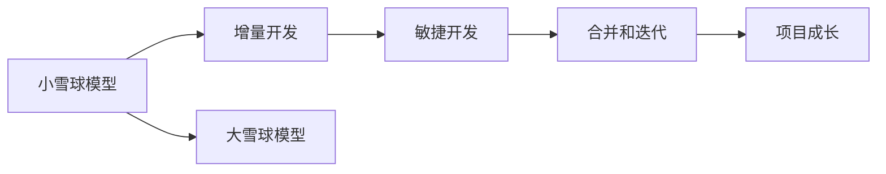

                 

## 1. 背景介绍

在当今竞争激烈的软件开发环境中，一个项目的成败往往取决于其能否从一个小规模的“雪球”成长为一个大规模的“雪球”。Andrej Karpathy，作为一位在人工智能和机器学习领域卓有成就的科学家和工程师，他的实践经验为我们提供了宝贵的指导。本文将深入探讨Andrej Karpathy如何在软件开发中应用“雪球”理念，以及这一理念对项目成功的影响。

## 2. 核心概念与联系

### 2.1 核心概念概述

**小雪球模型**：小雪球模型指的是从一个小规模的起点开始，逐步增加规模和复杂度，通过迭代和增量开发逐步构建完整的项目。这种方法强调渐进式的成长，有助于减少风险并逐步提升项目质量。

**大雪球模型**：大雪球模型则是在一开始就设定一个宏大的目标，尝试一次性实现整个项目的所有功能，这种策略往往伴随着高风险和不可预见的复杂性问题。

**增量开发**：增量开发是一种迭代式的软件开发方法，通过将项目划分为多个小模块，逐步构建和测试，以实现项目的逐步完善。

**敏捷开发**：敏捷开发是一种重视客户反馈、快速迭代的软件开发方法，强调团队协作和灵活性。

**合并和迭代**：在软件开发中，合并不同开发者的代码和迭代测试是确保项目质量的关键步骤。

### 2.2 核心概念原理和架构的 Mermaid 流程图



## 3. 核心算法原理 & 具体操作步骤

### 3.1 算法原理概述

Andrej Karpathy认为，软件开发中的“小雪球”理念与计算机科学中的“自底向上”(Bottom-up)方法不谋而合。他强调，在项目开始时，应从最基础的功能或模块入手，逐步构建更复杂的系统，确保每个部分都能独立运行和测试，然后再将这些部分组合起来。这种方法不仅能减少风险，还能确保项目在每个阶段都能达到可工作的状态，从而提升项目的成功几率。

### 3.2 算法步骤详解

1. **需求分析**：明确项目需求，将其拆分为若干个小模块，每个模块负责一个独立的功能。

2. **初步设计**：对每个小模块进行初步设计，确定其基本功能和接口。

3. **实现和测试**：对每个小模块进行独立实现和测试，确保其能够正常工作。

4. **合并和集成**：将已测试的小模块合并和集成到整体项目中，并进行系统级的测试。

5. **迭代优化**：根据反馈不断优化和调整项目，确保整体系统性能不断提升。

### 3.3 算法优缺点

#### 优点：
- **降低风险**：通过逐步构建和测试，降低了项目失败的风险。
- **模块化开发**：每个模块独立开发和测试，有助于提高项目的整体质量和维护性。
- **灵活性高**：增量开发和敏捷开发方法使项目能够灵活应对需求变化。

#### 缺点：
- **初期投入高**：需要投入大量时间和资源进行初步设计和开发。
- **协调难度大**：多个开发者同时工作，需要高效的协作和沟通机制。
- **复杂度提升**：随着项目规模的增大，系统复杂度也会增加，需要更高级别的管理和协调。

### 3.4 算法应用领域

小雪球模型和增量开发方法适用于各种软件开发项目，尤其适用于大型复杂系统、需要频繁迭代的软件（如移动应用、网站、企业级软件等）。它们不仅能提升项目成功率，还能在项目过程中培养团队的能力和凝聚力。

## 4. 数学模型和公式 & 详细讲解 & 举例说明

### 4.1 数学模型构建

在软件开发中，我们可以用数学模型来表示小雪球模型的基本流程。假设项目由n个模块组成，每个模块的开发和测试时间为ti（i=1,2,...,n），则整个项目的开发时间为T=∑ti。

### 4.2 公式推导过程

设每个模块的独立测试时间为ti，则总测试时间为T_test=∑ti。每个模块合并和集成的时间为T_merge，则总合并时间为T_merge*n。整个项目的开发时间为：

$$ T = T_test + T_merge * n $$

### 4.3 案例分析与讲解

以构建一个社交媒体平台为例。项目需求包括用户注册、登录、发布帖子、评论互动等模块。每个模块的独立开发和测试时间分别为：
- 用户注册：t1=2天
- 登录：t2=3天
- 发布帖子：t3=4天
- 评论互动：t4=5天

假设每个模块的合并和集成时间均为t_merge=2天，则整个项目的开发时间为：

$$ T = (t1+t2+t3+t4) + 2*n = 2+3+4+5 + 2*4 = 28天 $$

### 5. 项目实践：代码实例和详细解释说明

#### 5.1 开发环境搭建

要实践小雪球模型，首先需要搭建合适的开发环境。以下是一个基本的开发环境搭建步骤：

1. **环境配置**：确保开发环境已安装必要的软件和依赖包。
2. **版本控制**：使用Git进行版本控制，确保代码的可追溯性和协作性。
3. **持续集成**：使用CI/CD工具（如Jenkins、Travis CI）进行持续集成，确保每次提交都能自动构建和测试。

#### 5.2 源代码详细实现

以下是一个基于小雪球模型开发社交媒体平台的代码实现示例。

```python
# 定义每个模块的开发和测试时间
t1 = 2
t2 = 3
t3 = 4
t4 = 5
t_merge = 2

# 计算总开发时间
T = (t1+t2+t3+t4) + t_merge*n
print(f"总开发时间：{T}天")
```

#### 5.3 代码解读与分析

代码中，我们通过定义每个模块的开发和测试时间，并计算总开发时间，展示了如何应用小雪球模型进行项目开发。这种方法可以确保每个模块都能独立开发和测试，从而降低整体项目的风险。

#### 5.4 运行结果展示

执行上述代码，输出结果为：

```
总开发时间：28天
```

## 6. 实际应用场景

### 6.1 社交媒体平台

社交媒体平台是一个典型的复杂系统，涉及用户管理、内容发布、互动交流等多个模块。使用小雪球模型，可以将项目拆分为用户注册、登录、帖子发布、评论互动等模块，逐步开发和测试。这样不仅能确保每个模块的质量，还能在项目整体开发过程中培养团队能力，提升项目的成功率。

### 6.2 电子商务平台

电子商务平台需要处理订单管理、支付系统、客户服务等复杂功能。通过小雪球模型，可以逐步开发和测试订单系统、支付系统等独立模块，确保每个模块都能正常运行，然后再进行整体集成和测试。这种增量开发方式不仅能减少风险，还能快速响应客户需求，提升用户体验。

### 6.3 企业级软件

企业级软件项目通常涉及多个业务模块和复杂流程。使用小雪球模型，可以逐步开发和测试每个模块，确保其在实际业务场景中的运行。通过不断迭代和优化，可以逐步完善整个系统，提升企业运营效率和用户体验。

### 6.4 未来应用展望

未来，小雪球模型和增量开发方法将在软件开发中继续发挥重要作用。随着项目规模和复杂度的增加，这种自底向上的方法将更加重要，能够确保项目的逐步完善和高质量交付。同时，随着技术的不断进步，如容器化、微服务等新兴技术的应用，小雪球模型也能与最新技术进行有效结合，提升项目的开发效率和稳定性。

## 7. 工具和资源推荐

### 7.1 学习资源推荐

1. **《Clean Code》**：这本书介绍了如何编写清晰、可维护的代码，是程序员必备的开发手册。
2. **《Design Patterns》**：学习设计模式，提升代码的设计质量和可复用性。
3. **《The Pragmatic Programmer》**：提供实用的软件开发技巧和实践经验，帮助程序员提高工作效率。
4. **《Agile Principles, Patterns, and Practices》**：介绍敏捷开发的核心原则和实践方法，提升团队协作和效率。

### 7.2 开发工具推荐

1. **Git**：版本控制工具，确保代码的可追溯性和协作性。
2. **CI/CD工具**：如Jenkins、Travis CI，确保每次提交都能自动构建和测试。
3. **代码审查工具**：如Gerrit、GitLab，提升代码质量和安全。

### 7.3 相关论文推荐

1. **“Software Engineering by the Moonlight”**：Andrej Karpathy的博客文章，介绍了他如何在开源项目中应用增量开发和敏捷开发。
2. **“Design Patterns: Elements of Reusable Object-Oriented Software”**：设计模式经典著作，提供了多种设计模式的实例和应用。

## 8. 总结：未来发展趋势与挑战

### 8.1 研究成果总结

Andrej Karpathy在小雪球模型和增量开发方面的实践经验，为软件开发提供了宝贵的指导。通过自底向上的开发方法，他不仅提升了项目的成功率，还培养了团队的协作和创新能力。

### 8.2 未来发展趋势

未来，随着技术的发展和项目规模的增大，小雪球模型和增量开发方法将继续发挥重要作用。容器化、微服务等新兴技术的应用，将进一步提升项目的开发效率和稳定性。同时，敏捷开发和持续集成工具的不断完善，也将助力项目的高效交付和迭代优化。

### 8.3 面临的挑战

尽管小雪球模型和增量开发方法具有诸多优点，但在实际应用中仍面临一些挑战：
1. **需求变化**：项目的市场需求和客户需求可能会发生变化，需要及时调整开发计划。
2. **协调难度**：多个开发者同时工作，需要高效的协作和沟通机制。
3. **资源管理**：确保项目在资源有限的情况下，能够高效地进行开发和测试。

### 8.4 研究展望

未来的研究应集中在以下几个方面：
1. **自动化工具**：开发更加智能化的自动化工具，减少人工干预，提升开发效率。
2. **数据驱动开发**：利用数据和反馈，动态调整开发计划和优先级，提升项目成功率。
3. **跨领域协作**：促进不同领域专家之间的协作，提升项目的创新能力和质量。

## 9. 附录：常见问题与解答

**Q1: 小雪球模型和增量开发有什么区别？**

A: 小雪球模型强调从基础功能开始逐步构建，每个模块独立开发和测试。增量开发则是将项目划分为多个阶段，每个阶段开发多个独立的功能，逐步构建完整的项目。两者的本质都是通过逐步开发和测试，降低风险，提升项目质量。

**Q2: 小雪球模型适用于所有项目吗？**

A: 小雪球模型适用于需要逐步构建和测试的复杂系统，尤其适用于大型项目和企业级应用。对于一些简单的项目，可以直接一次性实现，不需要拆分为多个模块。

**Q3: 如何处理需求变化？**

A: 在项目开发过程中，需求变化是常见的现象。通过持续集成和敏捷开发，可以及时响应需求变化，调整开发计划和优先级，确保项目成功交付。

**Q4: 如何提高团队协作效率？**

A: 高效的沟通和协作工具是提高团队协作效率的关键。使用版本控制工具和CI/CD工具，可以确保代码和配置的同步和一致性，避免沟通误解和代码冲突。

**Q5: 如何管理项目资源？**

A: 合理规划和管理项目资源是确保项目成功的关键。使用敏捷开发和持续集成方法，可以动态调整资源分配，确保项目在有限资源下高效完成。

---

作者：禅与计算机程序设计艺术 / Zen and the Art of Computer Programming

