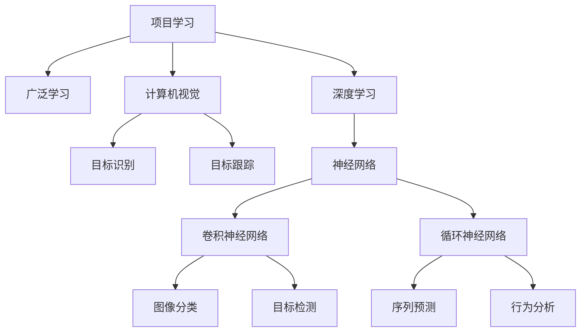

                 

## 1. 背景介绍

### 1.1 问题由来
Andrej Karpathy，一个在深度学习领域广受赞誉的计算机视觉专家，同时也是谷歌的研究科学家。他的作品《Deep Learning for Vision》一书已经成为该领域的经典教材。他的研究兴趣涵盖从计算机视觉到深度学习架构设计的多个方面，特别是视觉目标识别和目标跟踪。Karpathy的工作不断推动着计算机视觉技术向前发展，使我们能够更好地理解和应用这一强大的技术。

Karpathy提出的项目学习模式（Project Learning），是一种结合了深度学习和项目驱动学习的教学方法，旨在通过将学生置于实际项目中，使他们能够在真实环境中应用所学知识，增强实践能力。同时，Karpathy还提倡了一种“广泛学习”（Broad Learning）的理念，强调将学生置于广泛的、跨学科的学习环境中，以提升他们的综合能力。

本文将深入探讨Karpathy的项目学习模式与广泛学习理念，并分析这些方法在实际应用中的优点和缺点，探讨它们如何互补，共同推动教育技术的进步。

## 2. 核心概念与联系

### 2.1 核心概念概述

为了更好地理解项目学习模式和广泛学习理念，我们需要先掌握一些关键概念：

1. **项目学习（Project-Based Learning, PBL）**：这是一种以项目为核心的教学模式，强调通过完成实际项目来学习知识。学生在实际项目中自主探索、协作解决问题，并在项目过程中掌握各项技能。

2. **广泛学习（Broad Learning）**：这是一种跨学科、跨领域的教育方法，旨在通过多样化的学习活动，培养学生的综合能力，包括批判性思维、创造力、协作能力等。

3. **深度学习（Deep Learning）**：一种基于神经网络的机器学习技术，通过多层次的神经网络结构进行复杂数据的处理和分析。

4. **计算机视觉（Computer Vision）**：使计算机能够“看”并理解图像和视频中的内容，是AI研究的一个重要分支。

5. **目标识别（Object Recognition）**：计算机视觉中的一项关键任务，即从图像或视频中识别和定位特定对象或场景。

6. **目标跟踪（Object Tracking）**：在视频序列中，追踪目标对象的运动轨迹，是视觉跟踪技术的重要应用之一。

### 2.2 核心概念原理和架构的 Mermaid 流程图



### 2.3 核心概念间的联系

- **项目学习与广泛学习**：项目学习强调通过项目实践提升技能，而广泛学习则强调跨学科的知识融合和综合能力的培养。两者的结合可以提升学生的实际操作能力和跨领域应用能力。
- **深度学习与计算机视觉**：深度学习为计算机视觉提供了强大的计算能力，使得计算机能够从图像和视频中提取特征、分类和识别目标。
- **目标识别与目标跟踪**：目标识别是计算机视觉的基础任务之一，而目标跟踪则是进一步提升了计算机在动态场景下对目标的跟踪和理解能力。

## 3. 核心算法原理 & 具体操作步骤

### 3.1 算法原理概述

项目学习模式与广泛学习理念的结合，实际上是一种将深度学习技术应用于实际项目，通过跨学科的学习来提升学生综合能力的教育方法。其核心原理可以总结为以下几点：

1. **项目驱动学习**：将学生置于实际项目中，通过解决真实问题来应用所学知识。这种方法有助于学生将抽象的理论知识转化为实践技能，提升问题解决能力。

2. **跨学科学习**：通过结合计算机视觉、深度学习等跨学科知识，培养学生的多元化技能。例如，在目标识别和跟踪项目中，学生需要掌握图像处理、深度学习算法和行为分析等多个领域的技术。

3. **深度学习的应用**：在项目学习过程中，深度学习技术如卷积神经网络（CNN）和循环神经网络（RNN）被广泛应用，以实现目标识别和跟踪等任务。

### 3.2 算法步骤详解

项目学习与广泛学习相结合的教学方法，一般包括以下几个关键步骤：

1. **项目设计**：教师根据实际应用场景设计项目，确保项目具有实际意义和挑战性，涵盖多个学科领域。

2. **知识传授**：在项目开始前，教师需要向学生传授相关的基础知识和技能，包括深度学习、计算机视觉等技术。

3. **项目实施**：学生在项目实践中，通过协作完成实际任务。教师在这一过程中提供指导和支持。

4. **项目评估**：通过项目成果评估学生的学习效果，并进行反馈和改进。

### 3.3 算法优缺点

**优点**：

1. **增强实践能力**：通过项目学习，学生能够在真实环境中应用所学知识，提升实际操作能力和问题解决能力。

2. **提升跨领域能力**：广泛学习使学生能够接触到多个学科的知识，培养他们的综合能力，如团队合作、沟通能力、批判性思维等。

3. **激发兴趣和创造力**：实际项目和跨学科学习能够激发学生的学习兴趣，提升他们的创造力和创新能力。

**缺点**：

1. **时间成本高**：项目学习需要较长的周期，对于时间紧张的学生来说可能难以承受。

2. **资源需求高**：实际项目通常需要丰富的硬件资源，如高性能计算设备、大型数据集等，这可能增加教学成本。

3. **知识体系分散**：跨学科学习可能导致学生对某些领域的知识不够深入，难以形成系统的知识体系。

### 3.4 算法应用领域

项目学习模式与广泛学习理念在多个领域得到了广泛应用，以下是几个典型的应用场景：

1. **计算机视觉教育**：通过项目学习，学生可以深入理解计算机视觉技术，如图像分类、目标检测、行为分析等，并在实际项目中应用这些技术。

2. **目标识别和跟踪项目**：学生在实际项目中学习目标识别和跟踪技术，如图像分割、物体检测、运动跟踪等，提升实际应用能力。

3. **机器人编程**：学生在项目中学习机器人编程和控制技术，设计自主导航和行为识别的机器人，培养跨学科技能。

4. **智能系统开发**：学生通过项目学习，开发智能系统，如自动驾驶、语音识别、自然语言处理等，提升系统集成和综合应用能力。

## 4. 数学模型和公式 & 详细讲解 & 举例说明

### 4.1 数学模型构建

在项目学习模式与广泛学习理念中，数学模型的构建涉及深度学习、计算机视觉等多个领域。以下是一些常见的数学模型：

1. **卷积神经网络（CNN）**：用于图像分类和目标检测任务，模型结构如图：

$$
\begin{aligned}
y &= W \cdot x + b \\
x &= \text{ReLU}(Conv2d(x, W) + b)
\end{aligned}
$$

2. **循环神经网络（RNN）**：用于序列预测和行为分析任务，模型结构如图：

$$
\begin{aligned}
h_t &= \text{ReLU}(W_h \cdot (x_t, h_{t-1}) + b_h) \\
y_t &= W_y \cdot h_t + b_y
\end{aligned}
$$

### 4.2 公式推导过程

#### 4.2.1 卷积神经网络

卷积神经网络通过卷积层、池化层和全连接层对输入图像进行特征提取和分类。以下是一个简单的CNN模型公式推导：

- 卷积层：
$$
y = \text{ReLU}(Conv2d(x, W) + b)
$$

- 池化层：
$$
y = MaxPool(y)
$$

- 全连接层：
$$
y = W \cdot x + b
$$

其中，$W$ 和 $b$ 是卷积核和偏置项，$x$ 是输入图像，$y$ 是输出。

#### 4.2.2 循环神经网络

循环神经网络通过递归计算，处理序列数据。以下是一个简单的RNN模型公式推导：

- 隐藏层：
$$
h_t = \text{ReLU}(W_h \cdot (x_t, h_{t-1}) + b_h)
$$

- 输出层：
$$
y_t = W_y \cdot h_t + b_y
$$

其中，$h_t$ 是隐藏层状态，$x_t$ 是输入，$y_t$ 是输出，$W_h$ 和 $b_h$ 是隐藏层参数，$W_y$ 和 $b_y$ 是输出层参数。

### 4.3 案例分析与讲解

**案例**：目标识别和跟踪项目

在目标识别和跟踪项目中，学生需要完成以下任务：

1. **图像预处理**：对输入图像进行灰度化、归一化等预处理，为卷积神经网络提供合适输入。

2. **目标检测**：使用卷积神经网络检测图像中的目标，并输出目标位置。

3. **目标跟踪**：使用循环神经网络跟踪视频序列中的目标，预测目标位置和速度。

**示例代码**：

```python
import torch
import torchvision.transforms as transforms
import torch.nn as nn
import torch.optim as optim

# 定义CNN模型
class CNN(nn.Module):
    def __init__(self):
        super(CNN, self).__init__()
        self.conv1 = nn.Conv2d(3, 64, kernel_size=3, stride=1, padding=1)
        self.conv2 = nn.Conv2d(64, 128, kernel_size=3, stride=1, padding=1)
        self.fc = nn.Linear(128 * 8 * 8, 10)
    
    def forward(self, x):
        x = F.relu(self.conv1(x))
        x = F.max_pool2d(x, 2)
        x = F.relu(self.conv2(x))
        x = F.max_pool2d(x, 2)
        x = x.view(-1, 128 * 8 * 8)
        x = self.fc(x)
        return x

# 定义RNN模型
class RNN(nn.Module):
    def __init__(self):
        super(RNN, self).__init__()
        self.rnn = nn.RNN(128, 64, 1, batch_first=True)
        self.fc = nn.Linear(64, 2)
    
    def forward(self, x):
        _, h = self.rnn(x)
        x = self.fc(h[0])
        return x
```

## 5. 项目实践：代码实例和详细解释说明

### 5.1 开发环境搭建

在开始项目实践前，我们需要搭建好开发环境。以下是一些必要的步骤：

1. **安装PyTorch**：
```bash
pip install torch torchvision torchaudio
```

2. **安装TensorFlow**：
```bash
pip install tensorflow
```

3. **安装OpenCV**：
```bash
pip install opencv-python
```

4. **安装NumPy**：
```bash
pip install numpy
```

5. **安装Jupyter Notebook**：
```bash
pip install jupyter notebook
```

完成上述步骤后，即可在Python环境中进行深度学习项目开发。

### 5.2 源代码详细实现

下面是一个简单的目标识别和跟踪项目示例，展示了如何使用PyTorch实现卷积神经网络和循环神经网络：

```python
import torch
import torchvision.transforms as transforms
import torch.nn as nn
import torch.optim as optim

# 定义CNN模型
class CNN(nn.Module):
    def __init__(self):
        super(CNN, self).__init__()
        self.conv1 = nn.Conv2d(3, 64, kernel_size=3, stride=1, padding=1)
        self.conv2 = nn.Conv2d(64, 128, kernel_size=3, stride=1, padding=1)
        self.fc = nn.Linear(128 * 8 * 8, 10)
    
    def forward(self, x):
        x = F.relu(self.conv1(x))
        x = F.max_pool2d(x, 2)
        x = F.relu(self.conv2(x))
        x = F.max_pool2d(x, 2)
        x = x.view(-1, 128 * 8 * 8)
        x = self.fc(x)
        return x

# 定义RNN模型
class RNN(nn.Module):
    def __init__(self):
        super(RNN, self).__init__()
        self.rnn = nn.RNN(128, 64, 1, batch_first=True)
        self.fc = nn.Linear(64, 2)
    
    def forward(self, x):
        _, h = self.rnn(x)
        x = self.fc(h[0])
        return x

# 定义数据加载器
transform = transforms.Compose([
    transforms.Resize((224, 224)),
    transforms.ToTensor(),
    transforms.Normalize(mean=[0.485, 0.456, 0.406], std=[0.229, 0.224, 0.225])
])
train_dataset = torchvision.datasets.CIFAR10(root='./data', train=True, transform=transform, download=True)
train_loader = torch.utils.data.DataLoader(train_dataset, batch_size=32, shuffle=True)

# 训练模型
model = CNN()
optimizer = optim.SGD(model.parameters(), lr=0.01, momentum=0.9)
criterion = nn.CrossEntropyLoss()
for epoch in range(10):
    for batch_idx, (data, target) in enumerate(train_loader):
        optimizer.zero_grad()
        output = model(data)
        loss = criterion(output, target)
        loss.backward()
        optimizer.step()
```

### 5.3 代码解读与分析

在上述示例代码中，我们定义了一个简单的CNN和RNN模型，并使用CIFAR-10数据集进行了训练。代码主要分为以下几个部分：

1. **数据加载器**：使用`transforms`模块对图像进行预处理，包括大小调整和归一化，并加载CIFAR-10数据集。

2. **模型定义**：定义了CNN和RNN模型结构，并使用`nn.Module`进行封装。

3. **训练流程**：使用`SGD`优化器进行模型训练，通过`CrossEntropyLoss`计算损失函数，并使用`backward`和`step`方法进行梯度更新。

### 5.4 运行结果展示

在训练过程中，我们可以通过以下命令查看模型训练的损失和准确率：

```bash
python train.py
```

训练完成后，可以使用测试集对模型进行评估，代码如下：

```python
import torch
import torchvision.transforms as transforms
import torch.nn as nn
import torch.optim as optim

# 加载模型
model = CNN()
model.load_state_dict(torch.load('model.pth'))

# 定义数据加载器
transform = transforms.Compose([
    transforms.Resize((224, 224)),
    transforms.ToTensor(),
    transforms.Normalize(mean=[0.485, 0.456, 0.406], std=[0.229, 0.224, 0.225])
])
test_dataset = torchvision.datasets.CIFAR10(root='./data', train=False, transform=transform, download=True)
test_loader = torch.utils.data.DataLoader(test_dataset, batch_size=32, shuffle=False)

# 评估模型
model.eval()
correct = 0
total = 0
with torch.no_grad():
    for data, target in test_loader:
        output = model(data)
        _, predicted = output.max(1)
        total += target.size(0)
        correct += (predicted == target).sum().item()
print('Accuracy of the network on the 10000 test images: {} %'.format(100 * correct / total))
```

## 6. 实际应用场景

### 6.1 智能系统开发

项目学习和广泛学习理念在智能系统开发中的应用，能够帮助学生快速掌握多领域的知识，提升系统集成和综合应用能力。例如，在开发自动驾驶系统时，学生需要学习计算机视觉、深度学习、控制理论等多个领域的技术，并通过实际项目将这些技术整合到系统中。

### 6.2 目标识别和跟踪

在目标识别和跟踪项目中，学生可以通过实际操作来学习深度学习算法，提升图像处理和目标检测能力。通过项目学习，学生能够更深入地理解目标识别和跟踪技术，并在实际应用中灵活运用。

### 6.3 机器人编程

在机器人编程项目中，学生需要设计自主导航和行为识别的机器人，通过跨学科学习，提升机械工程、计算机视觉、人工智能等多个领域的技术水平。通过项目学习，学生能够综合应用多项技能，实现复杂的机器人控制和行为分析。

## 7. 工具和资源推荐

### 7.1 学习资源推荐

1. **《Deep Learning for Vision》书籍**：Andrej Karpathy的著作，深入浅出地介绍了深度学习在计算机视觉中的应用，是学习项目学习和广泛学习理念的重要参考。

2. **CS231n《Convolutional Neural Networks for Visual Recognition》课程**：斯坦福大学的计算机视觉课程，涵盖了CNN、RNN等多个深度学习技术，是学习项目学习和广泛学习理念的重要资源。

3. **OpenCV官方文档**：OpenCV的开源库，提供了丰富的计算机视觉工具和算法，是学习项目学习和广泛学习理念的必备资源。

### 7.2 开发工具推荐

1. **PyTorch**：基于Python的深度学习框架，提供了强大的计算图和模型构建工具，适合项目学习和广泛学习理念的实践。

2. **TensorFlow**：由Google主导的开源深度学习框架，提供了丰富的工具和算法，适合大规模工程应用。

3. **Jupyter Notebook**：交互式的Python编程环境，适合项目学习和广泛学习理念的实验和演示。

### 7.3 相关论文推荐

1. **《Project-Based Learning in Computer Vision Education》**：论文探讨了项目学习在计算机视觉教育中的应用，分析了项目学习的优势和挑战。

2. **《Broad Learning in Education》**：论文研究了广泛学习在教育中的应用，探讨了跨学科学习的模式和方法。

3. **《Object Tracking: A Survey》**：论文综述了目标跟踪技术的发展现状和未来趋势，是学习项目学习和广泛学习理念的重要参考资料。

## 8. 总结：未来发展趋势与挑战

### 8.1 研究成果总结

项目学习模式与广泛学习理念的结合，为深度学习教育和应用开辟了新的道路。通过实际项目和跨学科学习，学生能够提升实际操作能力和综合应用能力，更好地应对未来挑战。未来，随着技术的不断进步，这些教育方法将得到更广泛的应用，提升学生的全面能力。

### 8.2 未来发展趋势

1. **AI教育的普及**：AI技术的普及将推动AI教育的普及，更多人将通过项目学习和广泛学习理念，掌握AI技术。

2. **跨学科融合**：跨学科学习将成为教育的重要方向，培养学生的综合能力和创新思维。

3. **AI工具的集成**：更多的AI工具和平台将集成到教育中，提升学习效率和效果。

### 8.3 面临的挑战

1. **教学资源的平衡**：如何平衡跨学科学习的资源和时间，需要更多研究和实践。

2. **学生自主学习能力**：项目学习和广泛学习需要较高的自主学习能力，学生需要在指导和自学的结合中不断提升。

3. **评价标准的多样性**：跨学科学习需要多样化的评价标准，如何综合评估学生的学习效果，需要进一步探索。

### 8.4 研究展望

未来的AI教育将更加注重跨学科融合和项目学习，培养学生的全面能力。通过不断优化教学方法、提升教学资源，推动AI教育的普及和发展，为未来的AI技术应用奠定坚实基础。

## 9. 附录：常见问题与解答

**Q1：项目学习与广泛学习理念在教育中有什么优势？**

A: 项目学习与广泛学习理念在教育中的优势主要体现在以下几个方面：

1. **提升实践能力**：通过实际项目，学生能够将理论知识转化为实践技能，提升实际操作能力和问题解决能力。

2. **培养综合能力**：跨学科学习使学生能够接触到多个领域的知识，提升批判性思维、创造力、协作能力等综合能力。

3. **激发学习兴趣**：实际项目和跨学科学习能够激发学生的学习兴趣，提升学习动力。

4. **提升跨领域应用能力**：通过跨学科学习，学生能够将多个领域的技术整合应用，提升综合应用能力。

**Q2：项目学习和广泛学习理念在实际应用中需要注意哪些问题？**

A: 在实际应用中，项目学习和广泛学习理念需要注意以下几个问题：

1. **资源需求高**：实际项目通常需要丰富的硬件资源和数据集，需要合理分配和管理资源。

2. **时间成本高**：项目学习需要较长的周期，需要合理安排时间和任务。

3. **知识体系分散**：跨学科学习可能导致学生对某些领域的知识不够深入，需要合理规划学习内容和进度。

4. **学生自主学习能力**：项目学习和广泛学习需要较高的自主学习能力，需要引导和支持学生进行自主学习。

**Q3：如何平衡跨学科学习的资源和时间？**

A: 平衡跨学科学习的资源和时间需要从以下几个方面入手：

1. **合理规划学习内容**：根据学生的能力和学习进度，合理规划跨学科学习的内容和难度。

2. **提供充足的资源支持**：为学生提供必要的硬件资源和数据集，确保项目的顺利进行。

3. **提供指导和支持**：教师需要在项目学习过程中提供指导和支持，帮助学生解决问题。

4. **评估和反馈**：通过评估和反馈，及时调整学习内容和进度，确保学生能够高效学习。

---

作者：禅与计算机程序设计艺术 / Zen and the Art of Computer Programming

