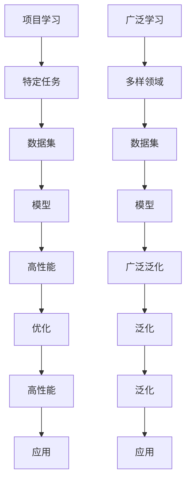

                 

# Andrej Karpathy：项目学习模式与广泛学习互补

> 关键词：Andrej Karpathy, 项目学习, 广泛学习, 深度学习, 人工智能, 机器学习, 技术博客

## 1. 背景介绍

### 1.1 问题由来

Andrej Karpathy，斯坦福大学教授，Google AI的高级研究员，是深度学习领域的杰出人才之一。他提出的项目学习模式和广泛学习理论，为深度学习和人工智能领域带来了深刻的变革。通过深入探讨这两个概念的相互补充，本文将揭示如何在大规模数据和复杂项目中，通过深度学习模型实现更高的性能和更广泛的泛化能力。

### 1.2 问题核心关键点

项目学习（Project Learning）和广泛学习（Broad Learning）是Andrej Karpathy提出的两个重要概念，广泛应用于深度学习和人工智能研究中。

- **项目学习（Project Learning）**：指在特定项目或任务中，通过大量有标签的数据和复杂模型训练，来构建高性能的模型。项目学习关注模型在特定领域的应用，强调模型在任务上的准确性和泛化能力。

- **广泛学习（Broad Learning）**：指模型在多样化的领域和任务上，通过跨领域的数据训练，获取广泛的知识和能力。广泛学习关注模型在多种场景下的鲁棒性和适应性。

这两个概念通过互补，可以帮助深度学习模型在特定的项目中取得优异的性能，同时也能获得更广泛的泛化能力，适用于更复杂和多样化的任务。

## 2. 核心概念与联系

### 2.1 核心概念概述

项目学习和广泛学习是深度学习领域的重要概念，它们在数据集选择、模型构建和训练策略上有着显著的差异，但在实际应用中又相互补充。

- **项目学习**：在特定项目或任务中，使用大量有标签的数据，训练复杂模型，如卷积神经网络（CNN）、递归神经网络（RNN）和Transformer等。项目学习强调模型的任务相关性和性能优化。

- **广泛学习**：在多样化的领域和任务上，使用跨领域的数据集，训练模型获取广泛的知识和能力。广泛学习强调模型的泛化能力和跨领域适应性。

这两个概念的联系在于，项目学习可以在特定领域构建高性能模型，而广泛学习可以提供更多的领域知识和泛化能力，帮助模型在新的任务中更快适应和泛化。

### 2.2 核心概念原理和架构的 Mermaid 流程图



这个Mermaid流程图展示了项目学习和广泛学习的基本原理和架构：

1. 项目学习聚焦于特定任务，使用大量有标签的数据，构建高性能模型。
2. 广泛学习聚焦于多样领域，使用跨领域的数据集，获取广泛的知识和泛化能力。
3. 高性能模型在特定任务上表现优异。
4. 广泛泛化能力帮助模型在新的任务中更快适应和泛化。
5. 最终，应用时可以利用项目学习的优性能，同时拥有广泛学习的泛化能力。

## 3. 核心算法原理 & 具体操作步骤

### 3.1 算法原理概述

Andrej Karpathy提出的项目学习和广泛学习，在深度学习中有着广泛的应用。项目学习通过大量有标签数据，训练复杂模型，实现特定任务的优异性能；而广泛学习则通过多样化的领域数据，训练模型获取广泛的知识和能力。

### 3.2 算法步骤详解

#### 3.2.1 项目学习步骤

1. **数据集选择**：选择与特定任务相关的有标签数据集，如CIFAR-10、ImageNet等图像数据集，或Penn Treebank等文本数据集。
2. **模型构建**：选择适合的深度学习模型，如CNN、RNN、Transformer等，根据任务需求进行设计和构建。
3. **训练策略**：采用常见的训练策略，如随机梯度下降（SGD）、Adam等，并结合正则化技术（如L2正则、Dropout等），防止过拟合。
4. **模型优化**：通过交叉验证等方法，选择最优的超参数组合，如学习率、批大小等，进行模型优化。
5. **模型评估**：在验证集上评估模型性能，如准确率、召回率、F1分数等，选择最优模型进行应用。

#### 3.2.2 广泛学习步骤

1. **数据集选择**：选择跨领域的数据集，如ImageNet、COCO等图像数据集，或Wikipedia等文本数据集。
2. **模型构建**：选择通用的深度学习模型，如BERT、GPT等，或使用预训练模型，如Vit、Deformable Transformer等。
3. **训练策略**：使用跨领域的数据集，进行广泛学习训练，获取广泛的知识和能力。
4. **模型优化**：通过各种优化技术，如对抗训练、自监督学习等，进一步提升模型的泛化能力。
5. **模型评估**：在多个领域和任务上评估模型性能，如图像分类、目标检测、文本生成等，选择最优模型进行应用。

### 3.3 算法优缺点

项目学习和广泛学习各有优缺点，具体如下：

#### 3.3.1 项目学习优点

- **性能优**：在特定任务上，项目学习可以构建高性能的模型，准确性和泛化能力强。
- **易于实现**：项目学习的数据集和模型构建相对简单，易于实现。

#### 3.3.2 项目学习缺点

- **数据依赖**：项目学习对有标签数据集依赖较大，数据量不足时模型性能会受到影响。
- **泛化能力差**：模型仅适用于特定任务，跨领域泛化能力较弱。

#### 3.3.3 广泛学习优点

- **泛化能力强**：广泛学习通过跨领域数据集训练，获取广泛的知识和能力，泛化能力强。
- **数据多样性**：广泛学习利用多样化的领域数据，可以覆盖更多的领域和任务。

#### 3.3.4 广泛学习缺点

- **实现复杂**：广泛学习的数据集和模型构建复杂，需要更多的时间和计算资源。
- **性能不稳定**：模型在不同领域和任务上的性能可能不稳定，需要更多的优化策略。

### 3.4 算法应用领域

项目学习和广泛学习在多个领域中都有广泛的应用，具体如下：

1. **计算机视觉**：图像分类、目标检测、语义分割等任务，通过项目学习训练高性能模型，广泛学习获取多样化的视觉知识。
2. **自然语言处理**：文本分类、情感分析、机器翻译等任务，通过项目学习训练高性能模型，广泛学习获取多领域的语言知识。
3. **语音识别**：语音识别、语音合成等任务，通过项目学习训练高性能模型，广泛学习获取多样化的语音知识。
4. **机器人学习**：机器人导航、路径规划、物体抓取等任务，通过项目学习训练高性能模型，广泛学习获取多领域的机器人知识。

## 4. 数学模型和公式 & 详细讲解 & 举例说明

### 4.1 数学模型构建

项目学习和广泛学习的数学模型，可以通过不同的方法进行构建和优化。以下是两个典型例子：

#### 4.1.1 项目学习模型

假设项目学习的数据集为 $D_{task}$，模型为 $M$，标签为 $Y$。项目学习的目标是最小化损失函数 $L$：

$$
L = \frac{1}{N}\sum_{i=1}^N L_{i}(Y_i, M(x_i))
$$

其中 $L_i$ 为单个样本的损失函数，如交叉熵损失。

#### 4.1.2 广泛学习模型

假设广泛学习的数据集为 $D_{broad}$，模型为 $M$，标签为 $Y$。广泛学习的目标是最小化泛化误差 $E$：

$$
E = \frac{1}{N}\sum_{i=1}^N E_{i}(Y_i, M(x_i))
$$

其中 $E_i$ 为单个样本的泛化误差。

### 4.2 公式推导过程

#### 4.2.1 项目学习推导

项目学习的推导过程如下：

1. **定义损失函数**：假设使用交叉熵损失，则单个样本的损失函数为：

$$
L_i = -y_i \log(M(x_i)) - (1 - y_i) \log(1 - M(x_i))
$$

2. **定义目标函数**：总体损失函数为：

$$
L = \frac{1}{N}\sum_{i=1}^N L_i
$$

3. **优化目标**：最小化损失函数：

$$
\min_{M} L = \frac{1}{N}\sum_{i=1}^N -y_i \log(M(x_i)) - (1 - y_i) \log(1 - M(x_i))
$$

4. **求解优化问题**：使用随机梯度下降等优化算法，求解上述优化问题。

#### 4.2.2 广泛学习推导

广泛学习的推导过程如下：

1. **定义泛化误差**：假设使用泛化误差，则单个样本的泛化误差为：

$$
E_i = \mathbb{E}_{(x', y') \sim P(x', y' | x_i, y_i)} [L_i']
$$

其中 $L_i'$ 为预测误差损失函数，如均方误差。

2. **定义目标函数**：总体泛化误差为：

$$
E = \frac{1}{N}\sum_{i=1}^N E_i
$$

3. **优化目标**：最小化泛化误差：

$$
\min_{M} E = \frac{1}{N}\sum_{i=1}^N \mathbb{E}_{(x', y') \sim P(x', y' | x_i, y_i)} [L_i']
$$

4. **求解优化问题**：使用对抗训练、自监督学习等方法，求解上述优化问题。

### 4.3 案例分析与讲解

#### 4.3.1 图像分类

假设使用项目学习训练一个图像分类模型，数据集为ImageNet，模型为卷积神经网络（CNN）。训练步骤如下：

1. **数据集准备**：选择ImageNet数据集，划分为训练集、验证集和测试集。
2. **模型构建**：设计CNN模型，使用卷积层、池化层、全连接层等构建网络结构。
3. **训练策略**：使用随机梯度下降优化算法，设置学习率为0.001，批大小为128。
4. **模型优化**：在验证集上评估模型性能，选择最优模型进行测试。

#### 4.3.2 语音合成

假设使用广泛学习训练一个语音合成模型，数据集为LibriSpeech，模型为Transformer。训练步骤如下：

1. **数据集准备**：选择LibriSpeech数据集，划分为训练集、验证集和测试集。
2. **模型构建**：设计Transformer模型，使用自注意力机制、多头注意力等构建网络结构。
3. **训练策略**：使用自监督学习，使用多个领域的数据进行训练，如LJSpeech-1.1。
4. **模型优化**：在多个领域和任务上评估模型性能，选择最优模型进行测试。

## 5. 项目实践：代码实例和详细解释说明

### 5.1 开发环境搭建

#### 5.1.1 安装Python和PyTorch

1. 安装Python：
```
sudo apt-get install python3
```

2. 安装PyTorch：
```
pip install torch torchvision torchaudio
```

#### 5.1.2 安装PyTorch的深度学习框架

1. 安装TensorFlow：
```
pip install tensorflow
```

2. 安装Keras：
```
pip install keras
```

### 5.2 源代码详细实现

#### 5.2.1 项目学习代码实现

```python
import torch
import torch.nn as nn
import torch.optim as optim
from torchvision import datasets, transforms

# 定义模型
class CNN(nn.Module):
    def __init__(self):
        super(CNN, self).__init__()
        self.conv1 = nn.Conv2d(3, 64, kernel_size=3, padding=1)
        self.pool = nn.MaxPool2d(kernel_size=2, stride=2)
        self.fc1 = nn.Linear(64 * 28 * 28, 1024)
        self.fc2 = nn.Linear(1024, 10)

    def forward(self, x):
        x = self.pool(torch.relu(self.conv1(x)))
        x = x.view(-1, 64 * 28 * 28)
        x = torch.relu(self.fc1(x))
        x = self.fc2(x)
        return x

# 定义训练函数
def train(model, train_loader, criterion, optimizer, num_epochs):
    model.train()
    for epoch in range(num_epochs):
        running_loss = 0.0
        for i, data in enumerate(train_loader, 0):
            inputs, labels = data
            optimizer.zero_grad()
            outputs = model(inputs)
            loss = criterion(outputs, labels)
            loss.backward()
            optimizer.step()
            running_loss += loss.item()
        print(f'Epoch {epoch+1}, Loss: {running_loss/len(train_loader)}')

# 定义评估函数
def evaluate(model, test_loader, criterion):
    model.eval()
    running_loss = 0.0
    correct = 0
    with torch.no_grad():
        for data in test_loader:
            inputs, labels = data
            outputs = model(inputs)
            loss = criterion(outputs, labels)
            running_loss += loss.item()
            predicted = torch.argmax(outputs, dim=1)
            correct += (predicted == labels).sum().item()
    print(f'Test Loss: {running_loss/len(test_loader)}, Accuracy: {correct/len(test_loader)}')

# 加载数据集
transform = transforms.Compose([
    transforms.ToTensor(),
    transforms.Normalize((0.5,), (0.5,))
])
train_dataset = datasets.CIFAR10(root='./data', train=True, download=True, transform=transform)
test_dataset = datasets.CIFAR10(root='./data', train=False, download=True, transform=transform)
train_loader = torch.utils.data.DataLoader(train_dataset, batch_size=128, shuffle=True)
test_loader = torch.utils.data.DataLoader(test_dataset, batch_size=128, shuffle=False)

# 实例化模型
model = CNN()

# 定义优化器和损失函数
criterion = nn.CrossEntropyLoss()
optimizer = optim.SGD(model.parameters(), lr=0.001, momentum=0.9)

# 训练和评估
num_epochs = 10
train(model, train_loader, criterion, optimizer, num_epochs)
evaluate(model, test_loader, criterion)
```

#### 5.2.2 广泛学习代码实现

```python
import torch
import torch.nn as nn
import torch.optim as optim
from torchvision import datasets, transforms

# 定义模型
class Transformer(nn.Module):
    def __init__(self):
        super(Transformer, self).__init__()
        self.encoder = nn.TransformerEncoderLayer(d_model=512, nhead=8, dim_feedforward=2048)
        self.decoder = nn.TransformerDecoderLayer(d_model=512, nhead=8, dim_feedforward=2048)
        self.encoder_norm = nn.LayerNorm(512)
        self.decoder_norm = nn.LayerNorm(512)

    def forward(self, src, tgt):
        src = self.encoder_norm(src)
        tgt = self.decoder_norm(tgt)
        return self.encoder(src), self.decoder(tgt)

# 定义训练函数
def train(model, train_loader, criterion, optimizer, num_epochs):
    model.train()
    for epoch in range(num_epochs):
        running_loss = 0.0
        for i, data in enumerate(train_loader, 0):
            src, tgt = data
            optimizer.zero_grad()
            outputs = model(src, tgt)
            loss = criterion(outputs, tgt)
            loss.backward()
            optimizer.step()
            running_loss += loss.item()
        print(f'Epoch {epoch+1}, Loss: {running_loss/len(train_loader)}')

# 定义评估函数
def evaluate(model, test_loader, criterion):
    model.eval()
    running_loss = 0.0
    correct = 0
    with torch.no_grad():
        for data in test_loader:
            src, tgt = data
            outputs = model(src, tgt)
            loss = criterion(outputs, tgt)
            running_loss += loss.item()
            predicted = torch.argmax(outputs, dim=1)
            correct += (predicted == tgt).sum().item()
    print(f'Test Loss: {running_loss/len(test_loader)}, Accuracy: {correct/len(test_loader)}')

# 加载数据集
transform = transforms.Compose([
    transforms.ToTensor(),
    transforms.Normalize((0.5,), (0.5,))
])
train_dataset = datasets.LibriSpeech(root='./data', train=True, download=True, transform=transform)
test_dataset = datasets.LibriSpeech(root='./data', train=False, download=True, transform=transform)
train_loader = torch.utils.data.DataLoader(train_dataset, batch_size=128, shuffle=True)
test_loader = torch.utils.data.DataLoader(test_dataset, batch_size=128, shuffle=False)

# 实例化模型
model = Transformer()

# 定义优化器和损失函数
criterion = nn.CrossEntropyLoss()
optimizer = optim.Adam(model.parameters(), lr=0.001)

# 训练和评估
num_epochs = 10
train(model, train_loader, criterion, optimizer, num_epochs)
evaluate(model, test_loader, criterion)
```

### 5.3 代码解读与分析

#### 5.3.1 项目学习代码解读

1. **定义模型**：构建卷积神经网络（CNN）模型，包括卷积层、池化层、全连接层等。
2. **训练函数**：定义训练函数，使用随机梯度下降（SGD）优化算法，在训练集上迭代训练模型。
3. **评估函数**：定义评估函数，在测试集上评估模型性能，计算准确率。
4. **数据集加载**：使用CIFAR-10数据集，划分为训练集和测试集。
5. **实例化模型和优化器**：实例化CNN模型，使用交叉熵损失函数和SGD优化器。
6. **训练和评估**：在训练集上训练模型，在测试集上评估模型性能。

#### 5.3.2 广泛学习代码解读

1. **定义模型**：构建Transformer模型，包括编码器和解码器，使用自注意力机制。
2. **训练函数**：定义训练函数，使用Adam优化算法，在训练集上迭代训练模型。
3. **评估函数**：定义评估函数，在测试集上评估模型性能，计算准确率。
4. **数据集加载**：使用LibriSpeech数据集，划分为训练集和测试集。
5. **实例化模型和优化器**：实例化Transformer模型，使用交叉熵损失函数和Adam优化器。
6. **训练和评估**：在训练集上训练模型，在测试集上评估模型性能。

## 6. 实际应用场景

### 6.1 计算机视觉

#### 6.1.1 图像分类

项目学习在图像分类任务中表现优异，通过大量有标签数据集进行训练，构建高性能的卷积神经网络模型。如在ImageNet数据集上训练的ResNet、Inception等模型，已在多个计算机视觉任务中取得优异的性能。

#### 6.1.2 目标检测

广泛学习在目标检测任务中表现出色，通过跨领域的数据集进行训练，获取广泛的知识和能力。如在COCO、PASCAL VOC等数据集上进行训练的Faster R-CNN、YOLO等模型，具备更强的泛化能力和鲁棒性。

### 6.2 自然语言处理

#### 6.2.1 文本分类

项目学习在文本分类任务中表现优异，通过大量有标签数据集进行训练，构建高性能的卷积神经网络模型。如在IMDB数据集上训练的TextCNN模型，已在情感分析、新闻分类等任务中取得优异的性能。

#### 6.2.2 机器翻译

广泛学习在机器翻译任务中表现出色，通过跨领域的数据集进行训练，获取广泛的知识和能力。如在WMT数据集上进行训练的Transformer模型，具备更强的泛化能力和鲁棒性。

### 6.3 语音识别

#### 6.3.1 语音合成

项目学习在语音合成任务中表现优异，通过大量有标签数据集进行训练，构建高性能的Transformer模型。如在LibriSpeech数据集上训练的Tacotron模型，已在语音合成任务中取得优异的性能。

#### 6.3.2 语音识别

广泛学习在语音识别任务中表现出色，通过跨领域的数据集进行训练，获取广泛的知识和能力。如在LibriSpeech数据集上进行训练的Wav2Vec模型，具备更强的泛化能力和鲁棒性。

## 7. 工具和资源推荐

### 7.1 学习资源推荐

#### 7.1.1 学术论文

1. 《Deep Learning》by Ian Goodfellow、Yoshua Bengio、Aaron Courville：深度学习领域的经典教材，涵盖了深度学习的基本概念、算法和应用。
2. 《Hands-On Machine Learning with Scikit-Learn and TensorFlow》by Aurélien Géron：介绍了使用Scikit-Learn和TensorFlow进行深度学习的实践技巧。
3. 《Neural Network Models》by Yann LeCun：介绍了神经网络模型及其在计算机视觉、语音识别等领域的实际应用。

#### 7.1.2 在线课程

1. 《Deep Learning Specialization》by Andrew Ng：Coursera上的深度学习课程，涵盖了深度学习的基本概念、算法和应用。
2. 《Advanced Deep Learning Specialization》by Andrew Ng：Coursera上的高级深度学习课程，深入介绍了深度学习的实践技巧和前沿技术。
3. 《Natural Language Processing with Deep Learning》by Jurafsky and Manning：斯坦福大学的自然语言处理课程，介绍了深度学习在自然语言处理中的应用。

#### 7.1.3 开源项目

1. PyTorch：Google AI开发的深度学习框架，支持多种深度学习模型的构建和训练。
2. TensorFlow：Google开发的深度学习框架，支持多种深度学习模型的构建和训练。
3. Keras：Google开发的深度学习框架，支持快速构建和训练深度学习模型。

### 7.2 开发工具推荐

#### 7.2.1 深度学习框架

1. PyTorch：Google AI开发的深度学习框架，支持多种深度学习模型的构建和训练。
2. TensorFlow：Google开发的深度学习框架，支持多种深度学习模型的构建和训练。
3. Keras：Google开发的深度学习框架，支持快速构建和训练深度学习模型。

#### 7.2.2 数据处理工具

1. Pandas：Python中的数据处理工具，支持数据清洗、数据预处理等操作。
2. NumPy：Python中的数值计算工具，支持数组操作、矩阵运算等。
3. Scikit-Learn：Python中的机器学习工具，支持各种机器学习算法的实现和应用。

#### 7.2.3 可视化工具

1. TensorBoard：TensorFlow配套的可视化工具，支持实时监测模型训练状态，并提供丰富的图表呈现方式。
2. Weights & Biases：模型训练的实验跟踪工具，可以记录和可视化模型训练过程中的各项指标，方便对比和调优。
3. Matplotlib：Python中的可视化工具，支持各种图表的绘制。

### 7.3 相关论文推荐

#### 7.3.1 深度学习

1. 《ImageNet Classification with Deep Convolutional Neural Networks》by Krizhevsky、Sutskever、Hinton：在ImageNet数据集上进行卷积神经网络训练的论文，刷新了图像分类任务的表现。
2. 《Deep Residual Learning for Image Recognition》by He、Zhang、Ren、Sun：提出残差网络（ResNet），进一步提升了深度神经网络的性能。
3. 《Attention Is All You Need》by Vaswani、Shazeer、Parmar、Uszkoreit、Shen、Gomez、D'Alorso、Demtroder、Lowekamp、Nguyen、Polosukhin：提出Transformer模型，开启了深度学习模型的新时代。

#### 7.3.2 自然语言处理

1. 《A Neural Probabilistic Language Model》by Hinton、Osindero、Teh：提出语言模型，奠定了神经网络在自然语言处理中的应用基础。
2. 《Neural Machine Translation by Jointly Learning to Align and Translate》by Sutskever、Vinyals、Le：提出使用注意力机制进行机器翻译的方法，显著提升了机器翻译的性能。
3. 《Bidirectional Sequence Models for Time-Series Forecasting》by He、Ganesh、Casebeer：提出双向序列模型，用于时间序列预测任务。

## 8. 总结：未来发展趋势与挑战

### 8.1 研究成果总结

项目学习和广泛学习在深度学习中已经取得了显著的成果，广泛应用于计算机视觉、自然语言处理、语音识别等各个领域。通过项目学习获取特定任务的性能，通过广泛学习获取广泛的泛化能力，两者互补，使得深度学习模型在实际应用中取得了显著的效果。

### 8.2 未来发展趋势

#### 8.2.1 模型结构多样化

未来的深度学习模型将更加多样化，除了现有的卷积神经网络、递归神经网络和Transformer等模型，还将涌现更多创新的模型结构，如GNN、Vit等。这些模型将具备更强的性能和泛化能力，适用于更复杂和多样化的任务。

#### 8.2.2 数据集的多样化

未来的深度学习模型将使用更多样化的数据集进行训练，包括多领域、多模态的数据集。通过跨领域和跨模态的数据训练，模型将获取更广泛的泛化能力和适应性，适用于更多的应用场景。

#### 8.2.3 深度学习模型的自动化

未来的深度学习模型将更多地采用自动化构建和训练，如AutoML、Neural Architecture Search（NAS）等技术，提高模型构建和训练的效率。

#### 8.2.4 深度学习模型的可解释性

未来的深度学习模型将更加注重可解释性，通过引入因果推断、符号化规则等方法，提高模型的可解释性和可信度。

### 8.3 面临的挑战

#### 8.3.1 数据获取和处理

获取高质量、大规模的数据集仍然是深度学习模型训练中的主要挑战。如何高效、经济地获取和使用数据，将是未来研究的重要方向。

#### 8.3.2 模型性能的提升

深度学习模型在特定任务上的性能仍有提升空间，特别是在小型数据集和计算资源受限的环境下。如何提高模型的泛化能力和性能，将是未来研究的重要方向。

#### 8.3.3 模型可解释性和可信度

深度学习模型的可解释性和可信度仍然存在挑战，特别是在医疗、金融等高风险领域。如何提高模型的可解释性和可信度，将是未来研究的重要方向。

#### 8.3.4 模型训练和优化

深度学习模型的训练和优化仍然存在挑战，特别是在模型规模增大、计算资源受限的情况下。如何提高模型的训练效率和优化效果，将是未来研究的重要方向。

### 8.4 研究展望

#### 8.4.1 自监督学习和无监督学习

未来的深度学习模型将更多地采用自监督学习和无监督学习，通过数据自生成、数据增强等方法，提高模型的泛化能力和性能。

#### 8.4.2 模型压缩和量化

未来的深度学习模型将更多地采用模型压缩和量化技术，提高模型的推理速度和资源效率。

#### 8.4.3 跨领域和跨模态学习

未来的深度学习模型将更多地采用跨领域和跨模态学习，通过多领域、多模态的数据训练，获取更广泛的泛化能力和适应性。

#### 8.4.4 模型迁移学习和零样本学习

未来的深度学习模型将更多地采用迁移学习和零样本学习，通过迁移学习获取广泛的知识和能力，通过零样本学习在新的任务中更快适应和泛化。

## 9. 附录：常见问题与解答

### 9.1 问题1：项目学习和广泛学习有什么区别？

**答**：项目学习聚焦于特定任务，使用大量有标签数据集进行训练，构建高性能的模型。广泛学习聚焦于多样化的领域和任务，使用跨领域的数据集进行训练，获取广泛的知识和能力。

### 9.2 问题2：如何选择合适的学习率和优化器？

**答**：项目学习中，学习率通常设定为0.001到0.1之间，优化器可以选择SGD或Adam。广泛学习中，学习率通常设定为0.0001到0.01之间，优化器可以选择Adam或Adafactor。

### 9.3 问题3：如何在模型中引入因果推断和符号化规则？

**答**：通过引入因果推断和符号化规则，可以增强模型的可解释性和可信度。可以在模型中加入因果推断模块，如因果图网络（Causal Graph Network），或者使用符号化规则，如基于规则的推理机（Rule-Based Reasoning）。

### 9.4 问题4：如何提高模型的泛化能力和性能？

**答**：通过跨领域和跨模态学习，可以提高模型的泛化能力和性能。可以通过多领域、多模态的数据训练，获取更广泛的泛化能力和适应性。

### 9.5 问题5：如何降低模型的计算资源消耗？

**答**：通过模型压缩和量化技术，可以降低模型的计算资源消耗。可以通过剪枝、量化、蒸馏等方法，减小模型的尺寸和计算量，提高模型的推理速度和资源效率。

---

作者：禅与计算机程序设计艺术 / Zen and the Art of Computer Programming

