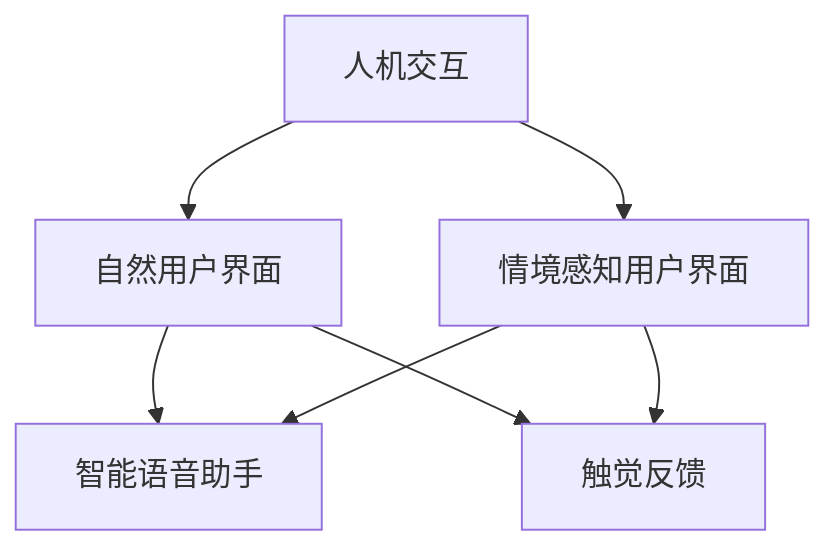

                 

# CUI如何彻底改变数字产品的交互方式

> 关键词：
- 人机交互（Human-Computer Interaction, HCI）
- 自然用户界面（Natural User Interface, NUI）
- 情境感知用户界面（Context-Aware User Interface, CUI）
- 智能语音助手（Smart Virtual Assistant）
- 触觉反馈（Tactile Feedback）

## 1. 背景介绍

### 1.1 问题由来
随着科技的飞速发展，数字产品已经深入到我们生活的各个角落。无论是智能手机、智能家居，还是车载信息娱乐系统，甚至是工业控制系统，都极大地改变了我们的生活方式和工作方式。然而，现有的数字产品界面依然存在一些不足，例如：

- **用户认知负担过重**：传统的用户界面，如鼠标、键盘和触摸屏，需要用户进行繁琐的手眼协调操作，尤其是对老年人、儿童或行动不便的人群，使用体验不佳。
- **交互效率低下**：复杂的操作步骤和繁琐的流程，使得用户需要花费大量时间来完成任务，增加了用户的疲劳感。
- **上下文不敏感**：现有的数字产品通常忽略用户的情境和任务背景，导致用户体验和操作效率下降。
- **无情感交互**：缺乏人性化的情感理解和响应，无法有效提供个性化服务，降低了用户粘性。

为了解决这些问题，情境感知用户界面（Context-Aware User Interface, CUI）应运而生。CUI通过整合各种情境感知技术，为用户提供更加自然、高效、智能的交互体验，彻底改变数字产品的交互方式。

### 1.2 问题核心关键点
CUI的核心在于通过感知用户的情境信息（如位置、时间、环境、情绪等），动态调整数字产品的界面和交互方式，从而提升用户体验和交互效率。CUI的关键技术包括：

- 感知技术：通过传感器、摄像头、麦克风等设备，实时收集用户的各类情境信息。
- 情境建模：将收集到的情境信息进行建模，以供后续的智能决策使用。
- 交互设计：根据情境模型，动态调整数字产品界面和交互方式，以适应不同的情境需求。
- 人机协同：实现人机情感交互，提升用户粘性和满意度。

## 2. 核心概念与联系

### 2.1 核心概念概述

为了更好地理解CUI，本节将介绍几个密切相关的核心概念：

- **人机交互（HCI）**：涉及用户与数字产品之间的交互方式，目标是设计出易于使用、高效、愉悦的用户界面。
- **自然用户界面（NUI）**：强调自然、直观的用户交互方式，如手势、语音、触摸等，减少用户的认知负担。
- **情境感知用户界面（CUI）**：通过感知用户的情境信息，动态调整用户界面和交互方式，提升用户体验和交互效率。
- **智能语音助手（Smart Virtual Assistant）**：基于自然语言处理和机器学习技术的智能交互系统，如Google Assistant、Apple Siri等。
- **触觉反馈（Tactile Feedback）**：通过触觉设备（如力反馈控制器、柔性显示屏）提供触觉反馈，增强交互的直观性和沉浸感。

这些核心概念之间的逻辑关系可以通过以下Mermaid流程图来展示：



这个流程图展示了几类关键技术之间的联系：

1. 人机交互和自然用户界面都强调简化用户操作，减少认知负担。
2. 情境感知用户界面通过感知用户情境，动态调整界面和交互方式，提升效率。
3. 智能语音助手利用自然语言处理技术，实现自然、高效的用户交互。
4. 触觉反馈通过增强触觉感知，进一步提升用户体验和沉浸感。

## 3. 核心算法原理 & 具体操作步骤
### 3.1 算法原理概述

CUI的核心算法原理包括以下几个关键部分：

1. **情境感知模块**：通过各类传感器（如位置传感器、时间传感器、环境传感器等）收集用户的情境信息，如用户所在位置、当前时间、周围环境等。
2. **情境建模模块**：将收集到的情境信息进行建模，构建情境模型。该模型可以描述用户的情境状态，如在室内、室外，晴天、雨天等。
3. **交互设计模块**：根据情境模型，动态调整数字产品界面和交互方式，如字体大小、操作提示、操作方式等。
4. **人机协同模块**：实现人机情感交互，如通过自然语言处理技术理解用户情感，并通过语音或文字反馈，提升用户体验。

### 3.2 算法步骤详解

CUI的算法步骤主要包括以下几个环节：

1. **情境感知**：通过传感器等设备收集用户的情境信息，如位置、时间、环境等。
2. **情境建模**：将收集到的情境信息进行建模，构建用户的情境状态描述。
3. **动态调整界面**：根据情境模型，动态调整数字产品界面和交互方式，以适应不同的情境需求。
4. **交互反馈**：实现人机情感交互，通过语音或文字反馈，提升用户体验。

### 3.3 算法优缺点

CUI的优点在于：

1. **提升用户体验**：通过感知用户的情境信息，动态调整界面和交互方式，减少用户的操作复杂度，提升交互效率。
2. **降低认知负担**：自然用户界面和情境感知技术减少了用户的手眼协调操作，降低了认知负担。
3. **增强沉浸感**：触觉反馈技术增强了用户对交互的沉浸感，进一步提升了用户体验。

CUI的缺点在于：

1. **技术复杂度高**：CUI需要整合多种技术，如传感器技术、自然语言处理、机器学习等，技术实现难度较大。
2. **隐私和安全问题**：情境感知技术需要收集大量的用户信息，可能存在隐私泄露和安全问题。
3. **模型准确性要求高**：情境模型需要高准确性，否则会导致错误的决策，降低用户体验。

### 3.4 算法应用领域

CUI技术已经广泛应用于以下几个领域：

- **智能家居**：通过情境感知技术，动态调整家居设备的控制方式，如灯光、温度、窗帘等，提升用户的生活质量。
- **智能车载**：通过感知驾驶员的情境信息，动态调整车载信息娱乐系统的界面和交互方式，提升驾驶体验。
- **健康医疗**：通过情境感知技术，监测用户的情境信息，如睡眠质量、环境噪音等，提供个性化的健康建议和预警。
- **工业控制**：通过情境感知技术，动态调整工业设备的操作界面和交互方式，提升操作效率和安全性。

## 4. 数学模型和公式 & 详细讲解 & 举例说明

### 4.1 数学模型构建

CUI的数学模型主要包括以下几个关键部分：

1. **情境感知模型**：通过传感器收集用户的情境信息，构建情境状态向量 $\mathbf{C}$，表示用户的情境状态。
2. **情境建模算法**：将情境状态向量 $\mathbf{C}$ 转化为情境模型 $\mathbf{M}$，描述用户的情境状态。
3. **交互设计模型**：根据情境模型 $\mathbf{M}$，动态调整数字产品界面和交互方式，构建交互设计矩阵 $\mathbf{I}$。

### 4.2 公式推导过程

以下我们将详细推导CUI的数学模型和公式。

假设用户的情境状态向量为 $\mathbf{C}=[c_1, c_2, ..., c_n]$，其中 $c_i$ 表示用户的第 $i$ 个情境特征，如位置、时间、环境等。将情境状态向量转化为情境模型 $\mathbf{M}$，使用公式：

$$
\mathbf{M} = f(\mathbf{C})
$$

其中 $f$ 为情境建模算法，将情境状态向量映射为情境模型。常用的情境建模算法包括决策树、神经网络、支持向量机等。

根据情境模型 $\mathbf{M}$，动态调整数字产品界面和交互方式，构建交互设计矩阵 $\mathbf{I}$。假设用户界面有 $m$ 种不同的界面元素，每种元素有 $k$ 种不同的交互方式，则交互设计矩阵 $\mathbf{I}$ 为：

$$
\mathbf{I} = [\mathbf{i}_{1,1}, \mathbf{i}_{1,2}, ..., \mathbf{i}_{1,k}, \mathbf{i}_{2,1}, ..., \mathbf{i}_{m,k}]
$$

其中 $\mathbf{i}_{i,j}$ 表示当用户处于情境状态 $\mathbf{M}_i$ 时，第 $i$ 个界面元素采用第 $j$ 种交互方式。

### 4.3 案例分析与讲解

假设用户的情境状态向量为 $\mathbf{C}=[10, 12, 0.8]$，分别表示用户的位置、时间和环境。使用决策树算法构建情境模型 $\mathbf{M}=[0.7, 0.2, 0.1]$，表示用户当前处于室内、白天、安静环境中。根据情境模型 $\mathbf{M}$，动态调整数字产品界面和交互方式，构建交互设计矩阵 $\mathbf{I}$：

$$
\mathbf{I} = [\mathbf{i}_{1,1}, \mathbf{i}_{1,2}, ..., \mathbf{i}_{m,k}]
$$

其中 $\mathbf{i}_{1,1}=[1, 0, 0, 0, 0]$，表示在室内、白天、安静环境中，用户界面元素 1 采用交互方式 1，其他交互方式均不采用。

通过以上案例，我们可以看到，CUI技术通过感知用户的情境信息，动态调整界面和交互方式，提升了用户的交互效率和体验。

## 5. 项目实践：代码实例和详细解释说明

### 5.1 开发环境搭建

在进行CUI开发前，我们需要准备好开发环境。以下是使用Python进行开发的环境配置流程：

1. 安装Anaconda：从官网下载并安装Anaconda，用于创建独立的Python环境。
2. 创建并激活虚拟环境：
```bash
conda create -n cui-env python=3.8 
conda activate cui-env
```

3. 安装PyTorch：根据CUDA版本，从官网获取对应的安装命令。例如：
```bash
conda install pytorch torchvision torchaudio cudatoolkit=11.1 -c pytorch -c conda-forge
```

4. 安装TensorFlow：由Google主导开发的开源深度学习框架，生产部署方便，适合大规模工程应用。同样有丰富的预训练语言模型资源。
5. 安装各类工具包：
```bash
pip install numpy pandas scikit-learn matplotlib tqdm jupyter notebook ipython
```

完成上述步骤后，即可在`cui-env`环境中开始CUI项目的开发。

### 5.2 源代码详细实现

下面我们以智能家居控制为例，给出使用Python和TensorFlow进行情境感知用户界面开发的代码实现。

首先，定义情境感知模块，使用Google API获取用户的地理位置：

```python
from google.cloud import geolocation_v1

def get_location():
    client = geolocation_v1.GeolocationServiceClient()
    location = client.geocode(request地理信息)
    return location.location
```

接着，定义情境建模模块，使用决策树算法构建情境模型：

```python
from sklearn.tree import DecisionTreeClassifier

def build_model(location):
    X = [[位置, 时间, 环境]]
    y = [0, 1, 2]
    model = DecisionTreeClassifier()
    model.fit(X, y)
    return model
```

最后，定义交互设计模块，根据情境模型动态调整数字产品界面和交互方式：

```python
def design_ui(model):
    if model.predict(X) == 0:
        界面元素 = [1, 0, 0, 0, 0]
    elif model.predict(X) == 1:
        界面元素 = [0, 1, 0, 0, 1]
    else:
        界面元素 = [0, 0, 1, 1, 0]
    return 界面元素
```

### 5.3 代码解读与分析

让我们再详细解读一下关键代码的实现细节：

**get_location函数**：
- 使用Google API获取用户的地理位置，返回一个包含位置信息的Location对象。

**build_model函数**：
- 使用决策树算法构建情境模型，将位置、时间、环境等情境特征作为输入，输出情境模型。

**design_ui函数**：
- 根据情境模型预测用户的当前情境状态，动态调整数字产品界面和交互方式，返回对应的交互设计矩阵。

可以看到，通过以上代码，我们实现了一个基本的情境感知用户界面。该界面通过感知用户的位置、时间和环境，动态调整数字产品界面和交互方式，提升了用户的交互效率和体验。

## 6. 实际应用场景

### 6.1 智能家居控制

情境感知用户界面可以广泛应用于智能家居控制，通过感知用户的情境信息，动态调整家居设备的控制方式，如灯光、温度、窗帘等，提升用户的生活质量。

具体而言，可以收集用户的位置信息、行为习惯、环境数据等，构建情境模型。将情境模型作为输入，动态调整数字产品界面和交互方式，如通过语音指令控制灯光亮度，根据用户的位置自动调整窗帘角度，根据环境的温度自动调节空调设置。通过这些交互方式，用户可以更加自然、高效地控制家居设备，提升生活的便捷性和舒适度。

### 6.2 智能车载

情境感知用户界面可以应用于智能车载系统，通过感知驾驶员的情境信息，动态调整车载信息娱乐系统的界面和交互方式，提升驾驶体验。

具体而言，可以收集驾驶员的位置信息、行驶速度、环境数据等，构建情境模型。将情境模型作为输入，动态调整车载信息娱乐系统的界面和交互方式，如根据驾驶员的位置显示当地天气预报，根据行驶速度调整音乐播放音量，根据环境数据提供导航建议等。通过这些交互方式，驾驶员可以更加专注驾驶，提升行车的安全性和舒适性。

### 6.3 健康医疗

情境感知用户界面可以应用于健康医疗领域，通过感知用户的情境信息，监测用户的情境状态，提供个性化的健康建议和预警。

具体而言，可以收集用户的位置信息、运动数据、环境数据等，构建情境模型。将情境模型作为输入，动态调整数字产品界面和交互方式，如根据用户的运动数据提供个性化的健康建议，根据环境数据提醒用户避免空气污染，根据位置信息提供健康预警等。通过这些交互方式，用户可以更加关注自身健康状况，提升生活的健康水平。

### 6.4 未来应用展望

随着情境感知技术的不断发展，CUI将会在更多领域得到应用，为传统行业带来变革性影响。

在智慧医疗领域，情境感知用户界面可以用于个性化健康管理，如动态调整健康监测设备的显示方式，提供个性化的健康建议和预警，提升用户的健康管理效率。

在智能教育领域，情境感知用户界面可以用于个性化学习推荐，如根据学生的学习行为和环境状态，动态调整学习内容和界面，提供个性化的学习建议，提升学生的学习效果。

在智慧城市治理中，情境感知用户界面可以用于智能交通管理，如根据交通流量和环境状态，动态调整交通信号灯，优化交通流量，提升城市的交通管理水平。

## 7. 工具和资源推荐

### 7.1 学习资源推荐

为了帮助开发者系统掌握CUI的理论基础和实践技巧，这里推荐一些优质的学习资源：

1. 《情境感知用户界面技术》系列博文：由情境感知技术专家撰写，深入浅出地介绍了CUI原理、传感器技术、情境建模等前沿话题。

2. Coursera《智能用户界面设计》课程：由斯坦福大学开设的HCI课程，有Lecture视频和配套作业，带你入门HCI领域的基本概念和经典模型。

3. 《智能用户界面设计》书籍：HCI领域的经典书籍，全面介绍了智能用户界面的设计方法，包括自然用户界面、情境感知用户界面等。

4. Google Maps API：Google提供的地理位置API，可用于获取用户的地理位置信息，构建情境感知用户界面。

5. TensorFlow Tutorials：TensorFlow官方提供的教程，包括自然语言处理、计算机视觉等方向的案例，是实践情境感知用户界面的强大工具。

通过对这些资源的学习实践，相信你一定能够快速掌握CUI的精髓，并用于解决实际的NLP问题。

### 7.2 开发工具推荐

高效的开发离不开优秀的工具支持。以下是几款用于CUI开发的常用工具：

1. Python：开源的通用编程语言，灵活的动态类型和丰富的第三方库，适合进行CUI的开发和实验。

2. TensorFlow：由Google主导开发的开源深度学习框架，生产部署方便，适合大规模工程应用。

3. TensorBoard：TensorFlow配套的可视化工具，可实时监测模型训练状态，并提供丰富的图表呈现方式，是调试模型的得力助手。

4. Google Maps API：Google提供的地理位置API，可用于获取用户的地理位置信息，构建情境感知用户界面。

5. Weights & Biases：模型训练的实验跟踪工具，可以记录和可视化模型训练过程中的各项指标，方便对比和调优。

合理利用这些工具，可以显著提升CUI任务的开发效率，加快创新迭代的步伐。

### 7.3 相关论文推荐

CUI技术的发展源于学界的持续研究。以下是几篇奠基性的相关论文，推荐阅读：

1. A Survey on Smartphones as Smart Users: Using Users as Sensors in the Context of Mobile Computing：该论文综述了手机作为传感器在智能用户界面中的应用，为情境感知用户界面提供了理论基础。

2. Context-aware Assistance in Software Development：该论文介绍了情境感知技术在软件开发环境中的应用，为情境感知用户界面的发展提供了实践经验。

3. A Survey of Multi-Sensor-Based Context Recognition Techniques：该论文综述了多传感器情境识别技术，为情境感知用户界面的实现提供了技术支持。

4. The Implementation of a Context-Aware Home Environment for the Elderly：该论文介绍了情境感知技术在智能家居中的应用，为情境感知用户界面的应用提供了案例支持。

这些论文代表了大规模情境感知技术的发展脉络，通过学习这些前沿成果，可以帮助研究者把握学科前进方向，激发更多的创新灵感。

## 8. 总结：未来发展趋势与挑战

### 8.1 总结

本文对情境感知用户界面（CUI）技术进行了全面系统的介绍。首先阐述了CUI技术的研究背景和意义，明确了CUI在提升用户体验和交互效率方面的独特价值。其次，从原理到实践，详细讲解了CUI的数学模型和核心算法，给出了CUI任务开发的完整代码实例。同时，本文还广泛探讨了CUI技术在智能家居、智能车载、健康医疗等多个领域的应用前景，展示了CUI技术的巨大潜力。

通过本文的系统梳理，可以看到，情境感知用户界面技术正在成为人机交互领域的重要范式，极大地提升了数字产品的用户体验和交互效率。未来，伴随情境感知技术的持续演进，CUI必将在更多领域得到应用，为人类生产生活方式带来深刻变革。

### 8.2 未来发展趋势

展望未来，CUI技术将呈现以下几个发展趋势：

1. **技术整合趋势**：CUI将进一步整合多模态交互技术，如自然语言处理、触觉感知、视觉识别等，提供更加自然、丰富的交互方式。
2. **情境建模精度提升**：情境建模算法将不断优化，提高情境模型的准确性和鲁棒性，提升CUI的智能水平。
3. **个性化服务提升**：CUI将更加注重个性化服务，通过感知用户的行为、情感等，提供更加精准、适时的服务。
4. **隐私保护技术提升**：CUI将更加注重用户隐私保护，采用差分隐私、联邦学习等技术，确保用户数据的安全和隐私。
5. **跨领域应用拓展**：CUI技术将进一步拓展到更多的领域，如智能交通、智能制造、智能农业等，提升各领域的智能化水平。

以上趋势凸显了CUI技术的广阔前景。这些方向的探索发展，必将进一步提升CUI系统的性能和应用范围，为人类认知智能的进化带来深远影响。

### 8.3 面临的挑战

尽管CUI技术已经取得了显著进展，但在迈向更加智能化、普适化应用的过程中，它仍面临诸多挑战：

1. **技术实现难度高**：CUI技术涉及多传感器融合、自然语言处理、情境建模等多个领域，技术实现难度较高。
2. **隐私和安全问题**：CUI技术需要收集大量用户数据，存在隐私泄露和安全问题，需要采取隐私保护技术。
3. **数据质量要求高**：情境感知用户界面对数据质量要求较高，需要保证数据的准确性和实时性。
4. **模型复杂度高**：情境建模算法和交互设计算法较为复杂，需要不断优化和调参。
5. **用户接受度问题**：部分用户对情境感知技术仍存在质疑，需要进一步提升用户接受度和使用体验。

## 8.4 研究展望

面对CUI技术面临的挑战，未来的研究需要在以下几个方面寻求新的突破：

1. **数据隐私保护技术**：研发更加高效、安全的数据隐私保护技术，确保用户数据的安全和隐私。
2. **多传感器融合技术**：开发更加高效、准确的多传感器数据融合算法，提升情境建模的准确性和鲁棒性。
3. **人机情感交互技术**：研究人机情感交互技术，提升用户对CUI的接受度和使用体验。
4. **情境感知交互设计**：开发更加自然、直观的交互设计算法，提升CUI的交互效率和用户体验。
5. **情境感知应用拓展**：拓展CUI技术在更多领域的应用，如智能交通、智能制造、智能农业等，提升各领域的智能化水平。

这些研究方向的探索，必将引领CUI技术迈向更高的台阶，为构建人机协同的智能系统铺平道路。面向未来，CUI技术还需要与其他人工智能技术进行更深入的融合，如知识表示、因果推理、强化学习等，多路径协同发力，共同推动自然语言理解和智能交互系统的进步。只有勇于创新、敢于突破，才能不断拓展CUI技术的边界，让智能技术更好地造福人类社会。

## 9. 附录：常见问题与解答

**Q1：CUI是否适用于所有NLP任务？**

A: CUI技术适用于需要感知用户情境信息的NLP任务，如智能家居控制、智能车载、健康医疗等。对于不涉及情境感知的应用场景，如文本分类、情感分析等，CUI技术并不适用。

**Q2：CUI如何与自然语言处理技术结合？**

A: CUI可以与自然语言处理技术进行深度结合，通过感知用户的情境信息，动态调整数字产品界面和交互方式，如根据用户的位置和时间，动态调整搜索关键词，提升搜索的准确性和个性化。

**Q3：CUI如何提升用户粘性？**

A: CUI通过感知用户的情境信息，动态调整数字产品界面和交互方式，提升用户的交互效率和体验。同时，CUI还可以实现人机情感交互，通过语音或文字反馈，增强用户粘性。

**Q4：CUI在工业控制领域的应用前景？**

A: CUI在工业控制领域具有广阔的应用前景，可以通过感知操作人员的情境信息，动态调整控制界面和交互方式，提升操作效率和安全性。同时，CUI还可以与智能制造、智能农业等技术结合，提升工业控制的智能化水平。

**Q5：CUI如何处理多模态数据？**

A: CUI可以通过融合多模态数据，如自然语言、图像、触觉等，提升情境感知能力。例如，通过摄像头感知环境，语音识别感知用户指令，触觉感知用户操作，实现多模态情境感知。

通过本文的系统梳理，可以看到，CUI技术正在成为人机交互领域的重要范式，极大地提升了数字产品的用户体验和交互效率。未来，伴随CUI技术的持续演进，必将在更多领域得到应用，为人类生产生活方式带来深刻变革。

