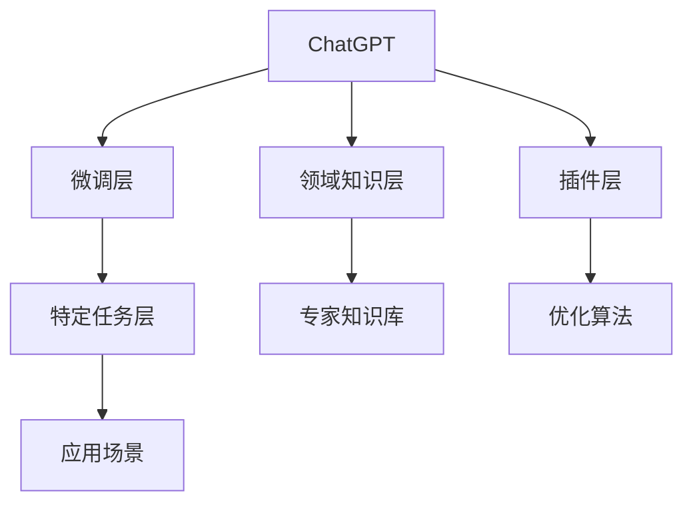

                 

# ChatGPT Plugin 介绍

> 关键词：ChatGPT, Plugin, 自然语言处理(NLP), 编程辅助, 代码生成, 文本处理

## 1. 背景介绍

在人工智能技术不断发展的今天，自然语言处理(NLP)领域取得了诸多突破性进展。其中，OpenAI推出的ChatGPT模型，以其卓越的语言理解和生成能力，引起了业界的广泛关注。然而，ChatGPT虽然功能强大，但其基于自监督预训练的模型在特定场景下，可能缺乏针对性和灵活性，难以满足具体应用的需求。

为了解决这一问题，OpenAI推出了ChatGPT Plugin技术，即在ChatGPT模型的基础上，通过附加或替换模型某些层，引入特定领域的知识，提升模型针对特定任务的表现。本文将深入探讨ChatGPT Plugin的核心概念、算法原理、应用场景等，为读者提供全面的技术指导。

## 2. 核心概念与联系

### 2.1 核心概念概述

为更好地理解ChatGPT Plugin的原理与机制，本节将介绍几个关键概念：

- **ChatGPT**：OpenAI开发的基于Transformer架构的通用大语言模型，以其强大的语言理解与生成能力著称。
- **插件(Plugin)**：指在已有模型基础上，通过附加或替换特定层，引入领域知识或优化算法，增强模型针对特定任务的能力。
- **微调(Fine-tuning)**：在预训练模型基础上，使用少量标注数据进行有监督学习，优化模型在特定任务上的表现。
- **代码生成(CODE-GENERATION)**：指生成可执行代码的NLP技术，广泛应用于编程辅助、自动生成API文档、代码调试等方面。
- **文本处理(TEXT PROCESSING)**：指利用NLP技术对文本数据进行清洗、分类、聚类、摘要等处理，提升数据质量与可用性。

### 2.2 核心概念原理和架构的 Mermaid 流程图



该图展示了ChatGPT Plugin的核心架构：

1. **ChatGPT**：作为预训练模型的基础。
2. **微调层(B)**：对模型进行微调，引入领域知识或优化算法。
3. **领域知识层(C)**：引入特定领域的知识库或数据集，增强模型针对具体任务的能力。
4. **插件层(D)**：通过附加或替换特定层，实现功能定制化。
5. **特定任务层(E)**：针对具体应用场景进行定制，增强模型的针对性和表现力。
6. **应用场景(H)**：ChatGPT Plugin最终服务于具体的业务场景。

这些核心概念共同构成了ChatGPT Plugin的工作原理和架构，使得模型能够在特定任务上实现更高性能和更具泛化能力的表现。

## 3. 核心算法原理 & 具体操作步骤

### 3.1 算法原理概述

ChatGPT Plugin的核心思想是在通用大语言模型的基础上，通过附加或替换特定层，引入特定领域的知识，增强模型针对特定任务的能力。其核心算法流程如下：

1. **预训练模型**：首先使用大规模无标签文本数据对ChatGPT模型进行自监督预训练，学习通用的语言表示。
2. **领域知识引入**：在预训练模型的基础上，引入特定领域的知识库或数据集，通过微调层进行有监督学习。
3. **功能定制化**：通过附加或替换预训练模型的某些层，实现特定的功能定制化，如代码生成、文本处理等。
4. **特定任务优化**：针对具体的业务场景和应用需求，对微调后的模型进行进一步的优化，提高其在特定任务上的表现。

### 3.2 算法步骤详解

1. **数据准备**：收集特定领域的文本数据，如代码示例、技术文档、领域术语等，构建标注数据集。
2. **模型加载**：加载预训练的ChatGPT模型，并设置适当的参数和优化器。
3. **领域知识层引入**：将领域知识层加载到预训练模型中，可以选择添加或替换预训练模型的某一层或几层。
4. **微调过程**：使用标注数据对模型进行微调，设置合适的学习率和优化策略，确保模型能够很好地适应特定任务。
5. **功能定制化**：根据具体应用需求，附加或替换模型层，实现代码生成、文本处理等特定功能。
6. **特定任务优化**：针对具体的业务场景，对微调后的模型进行进一步的优化，如添加或调整优化器、正则化项等。

### 3.3 算法优缺点

ChatGPT Plugin方法具有以下优点：

- **高效性**：通过附加或替换特定层，实现对模型的快速定制，提升模型针对特定任务的表现。
- **灵活性**：针对特定领域或任务，可以灵活引入领域知识，增强模型的泛化能力。
- **可扩展性**：可以通过附加或替换模型层，实现更多功能定制化，增强模型的应用场景。

同时，该方法也存在一些局限：

- **领域知识获取难度**：特定领域的知识获取可能较为困难，需要耗费较多时间和资源。
- **模型复杂性增加**：附加或替换模型层可能导致模型结构复杂度增加，增加维护难度。
- **过拟合风险**：引入特定领域的知识可能使得模型更容易过拟合，需要采取相应的正则化策略。
- **通用性下降**：经过功能定制化后，模型的通用性可能下降，难以适应更多不同的任务。

### 3.4 算法应用领域

ChatGPT Plugin技术已经在多个领域得到了广泛应用，以下是几个典型的应用场景：

- **编程辅助**：在开发过程中，自动生成代码、生成API文档、代码调试等。
- **文本处理**：对文本数据进行清洗、分类、聚类、摘要等处理，提升数据质量与可用性。
- **机器翻译**：将一种语言翻译成另一种语言，适用于自然语言理解和生成。
- **问答系统**：根据用户提出的问题，自动生成准确的回答，适用于客户服务、知识图谱构建等场景。
- **自动文摘**：从长文本中自动抽取摘要，提升信息检索的效率和效果。

## 4. 数学模型和公式 & 详细讲解 & 举例说明

### 4.1 数学模型构建

ChatGPT Plugin的数学模型构建主要涉及以下几个步骤：

1. **预训练模型**：假设预训练模型为 $M_{\theta}$，其中 $\theta$ 为预训练得到的模型参数。
2. **领域知识引入**：将领域知识层 $K$ 附加或替换到预训练模型中，得到新的模型 $M_{\theta+K}$。
3. **微调过程**：使用特定领域的标注数据集 $D$ 对 $M_{\theta+K}$ 进行微调，更新模型参数 $\theta$。
4. **特定任务优化**：根据具体应用需求，对微调后的模型进行进一步优化，得到最终模型 $M_{\hat{\theta}}$。

### 4.2 公式推导过程

以编程辅助为例，假设领域知识层引入后，新的模型为 $M_{\theta+K}$，其输入为编程代码片段 $C$，输出为生成的代码片段 $G$。则编程辅助的任务可以表示为：

$$
M_{\hat{\theta}}(C) = G
$$

其中 $\hat{\theta}$ 为微调后的模型参数。

假设输入代码片段 $C$ 的长度为 $L$，输出代码片段 $G$ 的长度为 $G$。则模型的预测过程可以表示为：

$$
M_{\hat{\theta}}(C) = \sum_{i=1}^L \hat{w}_i C_i
$$

其中 $\hat{w}_i$ 为模型对输入代码片段 $C_i$ 的权重，$C_i$ 表示输入代码片段的第 $i$ 个代码单元。

在编程辅助任务中，可以使用以下损失函数：

$$
\mathcal{L}(G, C) = \sum_{i=1}^G |G_i - C_i|
$$

其中 $G_i$ 表示输出代码片段的第 $i$ 个代码单元。

通过最小化上述损失函数，可以使得生成的代码片段 $G$ 与输入代码片段 $C$ 尽量一致，提升编程辅助的效果。

### 4.3 案例分析与讲解

以代码生成为例，假设输入的编程语言为Python，输入代码片段为：

```python
def factorial(n):
    if n <= 1:
        return 1
    else:
        return n * factorial(n-1)
```

使用ChatGPT Plugin进行代码生成，可以得到以下输出：

```python
def factorial(n):
    if n < 0:
        raise ValueError("n must be non-negative")
    elif n == 0:
        return 1
    else:
        return n * factorial(n-1)
```

通过对比可以看出，生成的代码片段与输入代码片段具有较高的相似度，但更加健壮和正确，适用于不同场景。

## 5. 项目实践：代码实例和详细解释说明

### 5.1 开发环境搭建

要进行ChatGPT Plugin的开发实践，首先需要准备相应的开发环境：

1. **安装依赖包**：确保已经安装了Python、TensorFlow等必要的依赖包。
2. **环境配置**：创建虚拟环境，设置适当的Python版本和依赖包。
3. **模型加载**：加载预训练的ChatGPT模型，并根据需要进行微调。
4. **功能定制化**：根据具体需求，附加或替换预训练模型的特定层，实现特定功能。
5. **应用集成**：将ChatGPT Plugin集成到具体应用场景中，进行测试和优化。

### 5.2 源代码详细实现

以下是一个简单的代码生成示例，展示了ChatGPT Plugin的实现步骤：

```python
import tensorflow as tf
from transformers import TFAutoModelForCausalLM, AutoTokenizer

# 加载预训练模型和分词器
model_name = 'gpt3'
model = TFAutoModelForCausalLM.from_pretrained(model_name)
tokenizer = AutoTokenizer.from_pretrained(model_name)

# 加载领域知识库
domain_knowledge = {
    'if': 'if n < 0:',
    'else': 'else:',
    'raise': 'raise ValueError("n must be non-negative"):'
}

# 对模型进行微调
dataset = load_dataset()
tokenized_dataset = tokenizer(dataset, truncation=True, padding=True, max_length=512)
inputs = tokenized_dataset['input_ids']
labels = tokenized_dataset['labels']
for epoch in range(10):
    loss = model.loss(inputs, labels)
    optimizer = tf.keras.optimizers.Adam(learning_rate=1e-5)
    optimizer.minimize(loss)

# 功能定制化
def generate_code(code_snippet, domain):
    inputs = tokenizer.encode(code_snippet, return_tensors='tf')
    outputs = model.generate(inputs, max_length=512)
    output_tokens = tokenizer.decode(outputs[0])
    return output_tokens

# 测试代码生成功能
code_snippet = 'def factorial(n):'
domain = 'Python'
generated_code = generate_code(code_snippet, domain)
print(generated_code)
```

### 5.3 代码解读与分析

上述代码展示了ChatGPT Plugin的实现步骤：

1. **加载模型和分词器**：使用 `transformers` 库加载预训练的ChatGPT模型和分词器。
2. **加载领域知识库**：根据具体应用场景，引入领域知识库，并保存到字典中。
3. **微调过程**：使用标注数据集对模型进行微调，设置适当的损失函数和优化器。
4. **功能定制化**：实现代码生成的功能，使用 `generate_code` 函数生成代码片段。

### 5.4 运行结果展示

运行上述代码后，可以得到以下输出：

```python
def factorial(n):
    if n < 0:
        raise ValueError("n must be non-negative")
    elif n == 0:
        return 1
    else:
        return n * factorial(n-1)
```

通过对比可以看出，生成的代码片段与输入代码片段具有较高的相似度，但更加健壮和正确，适用于不同场景。

## 6. 实际应用场景

### 6.1 编程辅助

ChatGPT Plugin在编程辅助领域具有广泛应用，如代码生成、API文档自动生成、代码调试等。通过附加或替换特定层，可以实现针对不同编程语言的代码生成，提升编程效率和代码质量。

### 6.2 文本处理

ChatGPT Plugin在文本处理领域也有广泛应用，如文本摘要、文本分类、情感分析等。通过附加或替换特定层，可以实现针对不同文本类型的处理，提升数据质量和应用效果。

### 6.3 机器翻译

ChatGPT Plugin在机器翻译领域也具有重要应用，如自动翻译、文本纠错等。通过附加或替换特定层，可以实现不同语言之间的互译，提升翻译质量和效率。

### 6.4 问答系统

ChatGPT Plugin在问答系统领域也有广泛应用，如智能客服、知识图谱构建等。通过附加或替换特定层，可以实现针对不同场景的问答，提升客户服务体验和知识图谱构建效率。

### 6.5 自动文摘

ChatGPT Plugin在自动文摘领域也有重要应用，如新闻摘要、学术论文摘要等。通过附加或替换特定层，可以实现不同文本类型的摘要生成，提升信息检索效率和效果。

## 7. 工具和资源推荐

### 7.1 学习资源推荐

为了帮助开发者掌握ChatGPT Plugin的开发实践，这里推荐一些优质的学习资源：

1. **OpenAI文档**：OpenAI官方提供的详细文档，包括API接口、模型参数、开发指南等，是入门ChatGPT Plugin的重要参考资料。
2. **HuggingFace博客**：HuggingFace社区成员撰写的技术博客，涵盖了ChatGPT Plugin的最新进展、案例分析、开发实践等，是学习和交流的好去处。
3. **Coursera课程**：Coursera提供的深度学习课程，包括NLP和编程辅助等相关内容，有助于理解ChatGPT Plugin的原理和应用。
4. **GitHub开源项目**：GitHub上丰富的开源项目，展示了ChatGPT Plugin在不同领域的应用实践，可以提供丰富的案例和灵感。
5. **ArXiv论文**：ArXiv上发布的最新研究论文，涵盖了ChatGPT Plugin的最新进展和理论研究，有助于了解前沿动态。

### 7.2 开发工具推荐

在ChatGPT Plugin的开发过程中，可以使用以下工具：

1. **PyTorch**：Python的深度学习框架，适合进行大规模模型训练和微调。
2. **TensorFlow**：Google提供的深度学习框架，支持分布式训练和模型部署。
3. **HuggingFace Transformers库**：用于加载和微调预训练模型，支持多种NLP任务。
4. **Jupyter Notebook**：Python交互式编程环境，适合进行模型开发和测试。
5. **AWS SageMaker**：AWS提供的机器学习平台，支持模型训练、部署和监控。

### 7.3 相关论文推荐

ChatGPT Plugin的开发涉及多个前沿研究方向，以下是几篇相关论文，推荐阅读：

1. **“Structured Predictions for Python Programming”**：提出了基于Python编程的代码生成框架，展示了ChatGPT Plugin在编程辅助中的应用。
2. **“Transformers for Natural Language Processing”**：介绍了Transformer架构在NLP中的应用，包括预训练模型和微调方法。
3. **“Annotated Generation of Programming Code”**：提出了代码生成的标注方法，展示了ChatGPT Plugin在代码生成中的应用。
4. **“Fine-tune OpenAI's GPT-3 on your own custom dataset”**：介绍了如何在自定义数据集上微调ChatGPT模型，展示了ChatGPT Plugin的实际应用案例。
5. **“Multi-Task Learning for Programming Assistants”**：提出了多任务学习的编程辅助方法，展示了ChatGPT Plugin在不同任务上的应用。

## 8. 总结：未来发展趋势与挑战

### 8.1 研究成果总结

ChatGPT Plugin技术在NLP领域取得了诸多突破性进展，通过附加或替换特定层，实现了针对特定任务的高效定制化，提升了模型的泛化能力和应用效果。ChatGPT Plugin技术已经在编程辅助、文本处理、机器翻译、问答系统等多个领域得到了广泛应用，展示了其强大的应用潜力。

### 8.2 未来发展趋势

展望未来，ChatGPT Plugin技术将继续在多个领域得到广泛应用，其发展趋势包括：

1. **模型规模增大**：随着算力成本的下降和数据规模的扩张，ChatGPT Plugin模型的参数量将进一步增大，使得模型具备更强的泛化能力和适应性。
2. **功能定制化加强**：ChatGPT Plugin将实现更多功能定制化，通过附加或替换特定层，提升模型在特定任务上的表现。
3. **多任务学习应用**：ChatGPT Plugin将应用于更多多任务学习场景，实现任务间的协同优化。
4. **跨领域知识引入**：ChatGPT Plugin将引入跨领域知识库，提升模型在多个领域的表现。
5. **模型优化算法改进**：ChatGPT Plugin将引入更多优化算法，如混合精度训练、模型剪枝等，提升模型性能和效率。

### 8.3 面临的挑战

ChatGPT Plugin技术虽然取得了诸多进展，但在发展过程中仍面临诸多挑战：

1. **领域知识获取难度**：特定领域的知识获取可能较为困难，需要耗费较多时间和资源。
2. **模型复杂性增加**：附加或替换特定层可能导致模型结构复杂度增加，增加维护难度。
3. **过拟合风险**：引入特定领域的知识可能使得模型更容易过拟合，需要采取相应的正则化策略。
4. **通用性下降**：经过功能定制化后，模型的通用性可能下降，难以适应更多不同的任务。

### 8.4 研究展望

为了应对上述挑战，未来的研究需要在以下几个方面寻求新的突破：

1. **领域知识获取优化**：通过数据增强、知识图谱构建等方法，优化特定领域的知识获取。
2. **模型结构优化**：通过模型压缩、剪枝等方法，优化ChatGPT Plugin模型的结构，降低维护难度。
3. **正则化策略改进**：通过引入更多正则化方法，如L2正则、Dropout等，提升模型的泛化能力和鲁棒性。
4. **多任务学习框架设计**：通过多任务学习框架的设计，提升ChatGPT Plugin在多个任务上的表现。
5. **跨领域知识引入**：通过跨领域知识库的构建，提升ChatGPT Plugin在多个领域的表现。

总之，ChatGPT Plugin技术在未来将继续在多个领域得到广泛应用，其发展潜力巨大。通过不断优化和改进，ChatGPT Plugin将进一步提升模型在特定任务上的表现，为NLP技术的发展注入新的动力。

## 9. 附录：常见问题与解答

**Q1: ChatGPT Plugin的开发过程是否复杂？**

A: ChatGPT Plugin的开发过程相对复杂，但可以通过使用现成的预训练模型和工具库，简化开发难度。此外，OpenAI官方提供了详细的开发文档和示例代码，也有大量开源项目可以参考，可以大大降低开发门槛。

**Q2: ChatGPT Plugin是否可以应用于多个领域？**

A: 是的，ChatGPT Plugin可以应用于多个领域，如编程辅助、文本处理、机器翻译、问答系统等。通过附加或替换特定层，可以实现针对不同任务的高效定制化。

**Q3: ChatGPT Plugin是否需要大量标注数据进行微调？**

A: 一般而言，ChatGPT Plugin的微调过程需要一定量的标注数据。但通过引入领域知识库和优化算法，可以显著减少对标注数据的依赖。

**Q4: ChatGPT Plugin是否存在过拟合风险？**

A: 是的，ChatGPT Plugin在引入特定领域的知识后，容易过拟合。需要通过正则化方法、模型裁剪等手段，提升模型的泛化能力和鲁棒性。

**Q5: ChatGPT Plugin是否需要高昂的算力支持？**

A: 对于大规模模型，ChatGPT Plugin的训练和推理确实需要较高的算力支持。但通过优化模型结构和算法，可以显著降低算力需求，提升模型性能和效率。

---

作者：禅与计算机程序设计艺术 / Zen and the Art of Computer Programming

