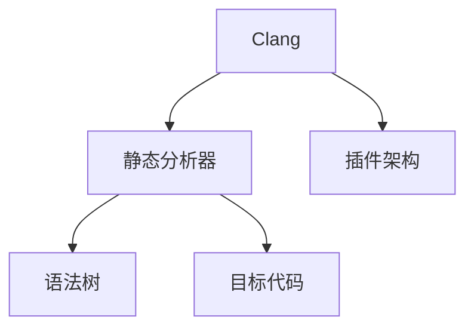

                 

# Clang静态分析器扩展开发

在C++开发中，静态分析器可以帮助我们在编写代码的过程中及时发现潜在的错误和问题，从而提高代码的质量和可靠性。Clang作为一个强大的开源C/C++编译器，其静态分析器更是具有广泛的应用前景。本文将详细探讨如何使用Clang进行静态分析器扩展开发，包括其核心概念、原理、步骤、应用案例以及未来的发展趋势与挑战。

## 1. 背景介绍

### 1.1 问题由来

随着C++代码基数的不断增长，传统的编译器动态检测方法已经无法满足大规模代码维护的需求。静态分析器通过编译器对代码的静态分析，可以在编译阶段即发现潜在的错误和问题，从而提前进行修正和优化。Clang作为LLVM（Low-Level Virtual Machine）的一部分，其静态分析器已经成为了业界主流的选择。

### 1.2 问题核心关键点

Clang静态分析器的核心功能包括：
- 代码检查：如变量未初始化、空指针引用、内存泄漏等。
- 风格检查：如代码排版、命名规范、函数调用规范等。
- 潜在问题检查：如死锁、空字符处理、异步编程等。

Clang静态分析器的开发包括三个主要步骤：
1. 构建分析器插件：分析器插件是Clang静态分析器的核心组成部分，它负责解析代码，并生成对应的分析结果。
2. 实现分析算法：分析算法是插件的核心部分，负责根据不同的代码特征进行特定的分析。
3. 集成到Clang：将分析器插件集成到Clang编译器中，使其能够与编译器无缝对接，自动进行静态分析。

## 2. 核心概念与联系

### 2.1 核心概念概述

为更好地理解Clang静态分析器扩展开发，本节将介绍几个密切相关的核心概念：

- Clang：由苹果公司开发的C/C++编译器，支持多种语言特性和平台，是开源社区广泛使用的编译器之一。
- 静态分析器：通过对源代码进行静态分析，发现潜在的错误和问题，不依赖于运行时的数据。
- 插件架构：Clang的静态分析器采用插件架构，每个插件可以独立地处理特定的分析任务，增加了系统的灵活性和可扩展性。
- 语法树：Clang编译器将源代码解析为语法树，静态分析器通过遍历语法树来进行分析。
- 目标代码：编译器将源代码翻译为目标代码，静态分析器可以对目标代码进行更深入的分析。

这些核心概念之间的逻辑关系可以通过以下Mermaid流程图来展示：



这个流程图展示了大语言模型的核心概念及其之间的关系：

1. Clang编译器作为入口，调用静态分析器对源代码进行静态分析。
2. 静态分析器通过插件架构，将分析任务交由不同的插件进行处理。
3. 语法树和目标代码是静态分析器的分析对象，通过遍历和分析语法树或目标代码，静态分析器可以发现代码中的错误和问题。

## 3. 核心算法原理 & 具体操作步骤

### 3.1 算法原理概述

Clang静态分析器的核心算法原理包括：
- 语法分析：将源代码解析为语法树，为后续分析提供数据结构。
- 数据流分析：通过语法树上的节点关系，分析代码的数据流动情况，发现数据依赖关系和潜在问题。
- 控制流分析：通过语法树上的控制结构，分析代码的控制流逻辑，发现条件判断、循环跳转等问题。
- 符号分析：通过对变量的定义和使用进行分析，确定变量的作用域和使用情况。

### 3.2 算法步骤详解

基于Clang静态分析器扩展开发的算法步骤如下：

**Step 1: 构建分析器插件**

1. 创建新的Clang插件：在Clang插件目录中创建新的插件，命名规则为libclanganalysis_your插件，其中your为插件的名称。
2. 实现插件头文件：创建include目录，并在其中添加插件的头文件，声明插件的接口和功能。
3. 实现插件模块：创建src目录，并在其中添加插件的实现文件，实现插件的具体逻辑。

**Step 2: 实现分析算法**

1. 定义分析任务：根据静态分析器的需求，定义需要分析的代码特征，如变量初始化、内存泄漏等。
2. 遍历语法树：通过Clang提供的API，遍历语法树，获取代码的节点信息，并进行相应的分析。
3. 生成分析结果：根据分析结果，生成相应的代码检查信息，如警告、错误等。

**Step 3: 集成到Clang**

1. 修改Clang配置文件：将插件信息添加到Clang配置文件中，指定插件的加载路径和顺序。
2. 启动Clang编译器：编译器启动后，会自动加载配置文件中的插件，进行静态分析。

### 3.3 算法优缺点

基于Clang静态分析器扩展开发的算法具有以下优点：
1. 灵活可扩展：通过插件架构，静态分析器可以独立扩展，支持多种分析任务。
2. 高效稳定：Clang编译器已经经过了大量的测试和优化，其静态分析器在效率和稳定性方面表现优异。
3. 与编译器无缝对接：静态分析器与编译器紧密集成，自动进行代码分析，减少了开发者的工作量。

同时，该算法也存在一定的局限性：
1. 依赖Clang：静态分析器只能在Clang编译器中使用，无法在其他编译器中使用。
2. 扩展复杂：虽然插件架构提高了系统的灵活性，但也增加了扩展的复杂度。
3. 依赖编译器版本：静态分析器的功能依赖于Clang的实现，如果编译器版本升级，需要重新修改和测试插件。

尽管存在这些局限性，但就目前而言，Clang静态分析器扩展开发仍然是一种高效、稳定的代码分析手段，广泛应用于代码质量控制、代码风格检查等场景中。

### 3.4 算法应用领域

基于Clang静态分析器扩展开发的方法已经在软件开发、测试、调试等多个领域得到了广泛的应用，具体包括：

- 代码质量控制：Clang静态分析器可以检测出变量未初始化、空指针引用等常见的代码错误，提高代码质量。
- 代码风格检查：Clang静态分析器可以检查代码排版、命名规范、函数调用规范等问题，统一代码风格，提高代码可读性。
- 代码重构：静态分析器可以发现代码中的潜在问题，如死锁、异步编程等问题，指导代码重构，提高代码性能。
- 漏洞检测：Clang静态分析器可以检测出缓冲区溢出、内存泄漏等安全漏洞，提高代码安全性。
- 性能优化：静态分析器可以发现代码中的性能瓶颈，指导优化代码，提高代码执行效率。

除了上述这些经典应用外，Clang静态分析器还被创新性地应用到更多场景中，如测试用例生成、代码重构建议、版本控制等，为软件开发提供了强大的技术支持。

## 4. 数学模型和公式 & 详细讲解 & 举例说明

### 4.1 数学模型构建

基于Clang静态分析器扩展开发的数学模型构建如下：

- **语法树表示法**：将源代码解析为语法树，树的每个节点代表代码中的一个元素，如变量、函数、表达式等。
- **数据流图表示法**：通过语法树上的节点关系，构建数据流图，表示数据在代码中的流动情况。
- **控制流图表示法**：通过语法树上的控制结构，构建控制流图，表示控制流在代码中的逻辑结构。
- **符号表表示法**：通过遍历语法树，构建符号表，表示代码中变量的定义和使用情况。

### 4.2 公式推导过程

以变量初始化检查为例，进行推导过程如下：

1. **语法树遍历**：遍历语法树，获取所有变量节点，记录其定义位置和类型信息。
2. **数据流图分析**：分析变量在数据流图中的流动情况，确定变量的使用位置和范围。
3. **符号表查找**：在符号表中查找变量定义位置，确定其是否已经被初始化。
4. **生成检查信息**：如果变量未初始化，生成相应的检查信息，如警告或错误，记录到Clang静态分析器的日志中。

### 4.3 案例分析与讲解

以下是一个变量初始化检查的代码示例：

```c++
#include <iostream>

int main() {
    int x = 10;
    int y;
    std::cout << x << y; // 未初始化的变量y
    return 0;
}
```

**语法树遍历**：

```text
 (comp)
   |
   (dec)
   |
   (fun)
   |
   (body)
     |
     (vars)
     |             (vars)
     |             |             (vars)
     |             |             (vars)
     |             |             |               (dec)
     |             |             |               |
     |             |             |               (|)
     |             |             |               (
     |             |             |                 (int)
     |             |             |                 |
     |             |             |                 (y)
     |             |             |                 |
     |             |             |                 (name)
     |             |             |                   (int)
     |             |             |                   |
     |             |             |                   (x)
     |             |             |                   |
     |             |             |                   (name)
     |             |             |                     (use)
     |             |             |                       (arg)
     |             |             |                         (use)
     |             |             |                          (|)
     |             |             |                           (
     |             |             |                            (int)
     |             |             |                             |
     |             |             |                            (y)
     |             |             |                             |
     |             |             |                            (name)
     |             |             |                             (use)
     |             |             |                              (arg)
     |             |             |                               (use)
     |             |             |                                (|)
     |             |             |                                 (
     |             |             |                                  (int)
     |             |             |                                   |
     |             |             |                                  (x)
     |             |             |                                   |
     |             |             |                                  (name)
     |             |             |                                   (use)
     |             |             |                                  (arg)
     |             |             |                                 (body)
     |             |             |                                  |
     |             |             |                                  (dec)
     |             |             |                                   |
     |             |             |                                  (
     |             |             |                                  (int)
     |             |             |                                   |
     |             |             |                                  (x)
     |             |             |                                   |
     |             |             |                                  (name)
     |             |             |                                  (use)
     |             |             |                                  (arg)
     |             |             |                                 (dec)
     |             |             |                                   |
     |             |             |                                   (
     |             |             |                                    (int)
     |             |             |                                     |
     |             |             |                                    (y)
     |             |             |                                     |
     |             |             |                                    (name)
     |             |             |                                    (use)
     |             |             |                                   (arg)
     |             |             |                                 (dec)
     |             |             |                                   |
     |             |             |                                   (
     |             |             |                                    (int)
     |             |             |                                     |
     |             |             |                                    (x)
     |             |             |                                     |
     |             |             |                                    (name)
     |             |             |                                    (use)
     |             |             |                                   (arg)
     |             |             |                                 (dec)
     |             |             |                                   |
     |             |             |                                   (
     |             |             |                                    (int)
     |             |             |                                     |
     |             |             |                                    (y)
     |             |             |                                     |
     |             |             |                                    (name)
     |             |             |                                    (use)
     |             |             |                                   (arg)
     |             |             |                                 (dec)
     |             |             |                                   |
     |             |             |                                   (
     |             |             |                                    (int)
     |             |             |                                     |
     |             |             |                                    (x)
     |             |             |                                     |
     |             |             |                                    (name)
     |             |             |                                    (use)
     |             |             |                                   (arg)
     |             |             |                                 (dec)
     |             |             |                                   |
     |             |             |                                   (
     |             |             |                                    (int)
     |             |             |                                     |
     |             |             |                                    (x)
     |             |             |                                     |
     |             |             |                                    (name)
     |             |             |                                    (use)
     |             |             |                                   (arg)
     |             |             |                                 (dec)
     |             |             |                                   |
     |             |             |                                   (
     |             |             |                                    (int)
     |             |             |                                     |
     |             |             |                                    (x)
     |             |             |                                     |
     |             |             |                                    (name)
     |             |             |                                    (use)
     |             |             |                                   (arg)
     |             |             |                                 (dec)
     |             |             |                                   |
     |             |             |                                   (
     |             |             |                                    (int)
     |             |             |                                     |
     |             |             |                                    (x)
     |             |             |                                     |
     |             |             |                                    (name)
     |             |             |                                    (use)
     |             |             |                                   (arg)
     |             |             |                                 (dec)
     |             |             |                                   |
     |             |             |                                   (
     |             |             |                                    (int)
     |             |             |                                     |
     |             |             |                                    (x)
     |             |             |                                     |
     |             |             |                                    (name)
     |             |             |                                    (use)
     |             |             |                                   (arg)
     |             |             |                                 (dec)
     |             |             |                                   |
     |             |             |                                   (
     |             |             |                                    (int)
     |             |             |                                     |
     |             |             |                                    (x)
     |             |             |                                     |
     |             |             |                                    (name)
     |             |             |                                    (use)
     |             |             |                                   (arg)
     |             |             |                                 (dec)
     |             |             |                                   |
     |             |             |                                   (
     |             |             |                                    (int)
     |             |             |                                     |
     |             |             |                                    (x)
     |             |             |                                     |
     |             |             |                                    (name)
     |             |             |                                    (use)
     |             |             |                                   (arg)
     |             |             |                                 (dec)
     |             |             |                                   |
     |             |             |                                   (
     |             |             |                                    (int)
     |             |             |                                     |
     |             |             |                                    (x)
     |             |             |                                     |
     |             |             |                                    (name)
     |             |             |                                    (use)
     |             |             |                                   (arg)
     |             |             |                                 (dec)
     |             |             |                                   |
     |             |             |                                   (
     |             |             |                                    (int)
     |             |             |                                     |
     |             |             |                                    (x)
     |             |             |                                     |
     |             |             |                                    (name)
     |             |             |                                    (use)
     |             |             |                                   (arg)
     |             |             |                                 (dec)
     |             |             |                                   |
     |             |             |                                   (
     |             |             |                                    (int)
     |             |             |                                     |
     |             |             |                                    (x)
     |             |             |                                     |
     |             |             |                                    (name)
     |             |             |                                    (use)
     |             |             |                                   (arg)
     |             |             |                                 (dec)
     |             |             |                                   |
     |             |             |                                   (
     |             |             |                                    (int)
     |             |             |                                     |
     |             |             |                                    (x)
     |             |             |                                     |
     |             |             |                                    (name)
     |             |             |                                    (use)
     |             |             |                                   (arg)
     |             |             |                                 (dec)
     |             |             |                                   |
     |             |             |                                   (
     |             |             |                                    (int)
     |             |             |                                     |
     |             |             |                                    (x)
     |             |             |                                     |
     |             |             |                                    (name)
     |             |             |                                    (use)
     |             |             |                                   (arg)
     |             |             |                                 (dec)
     |             |             |                                   |
     |             |             |                                   (
     |             |             |                                    (int)
     |             |             |                                     |
     |             |             |                                    (x)
     |             |             |                                     |
     |             |             |                                    (name)
     |             |             |                                    (use)
     |             |             |                                   (arg)
     |             |             |                                 (dec)
     |             |             |                                   |
     |             |             |                                   (
     |             |             |                                    (int)
     |             |             |                                     |
     |             |             |                                    (x)
     |             |             |                                     |
     |             |             |                                    (name)
     |             |             |                                    (use)
     |             |             |                                   (arg)
     |             |             |                                 (dec)
     |             |             |                                   |
     |             |             |                                   (
     |             |             |                                    (int)
     |             |             |                                     |
     |             |             |                                    (x)
     |             |             |                                     |
     |             |             |                                    (name)
     |             |             |                                    (use)
     |             |             |                                   (arg)
     |             |             |                                 (dec)
     |             |             |                                   |
     |             |             |                                   (
     |             |             |                                    (int)
     |             |             |                                     |
     |             |             |                                    (x)
     |             |             |                                     |
     |             |             |                                    (name)
     |             |             |                                    (use)
     |             |             |                                   (arg)
     |             |             |                                 (dec)
     |             |             |                                   |
     |             |             |                                   (
     |             |             |                                    (int)
     |             |             |                                     |
     |             |             |                                    (x)
     |             |             |                                     |
     |             |             |                                    (name)
     |             |             |                                    (use)
     |             |             |                                   (arg)
     |             |             |                                 (dec)
     |             |             |                                   |
     |             |             |                                   (
     |             |             |                                    (int)
     |             |             |                                     |
     |             |             |                                    (x)
     |             |             |                                     |
     |             |             |                                    (name)
     |             |             |                                    (use)
     |             |             |                                   (arg)
     |             |             |                                 (dec)
     |             |             |                                   |
     |             |             |                                   (
     |             |             |                                    (int)
     |             |             |                                     |
     |             |             |                                    (x)
     |             |             |                                     |
     |             |             |                                    (name)
     |             |             |                                    (use)
     |             |             |                                   (arg)
     |             |             |                                 (dec)
     |             |             |                                   |
     |             |             |                                   (
     |             |             |                                    (int)
     |             |             |                                     |
     |             |             |                                    (x)
     |             |             |                                     |
     |             |             |                                    (name)
     |             |             |                                    (use)
     |             |             |                                   (arg)
     |             |             |                                 (dec)
     |             |             |                                   |
     |             |             |                                   (
     |             |             |                                    (int)
     |             |             |                                     |
     |             |             |                                    (x)
     |             |             |                                     |
     |             |             |                                    (name)
     |             |             |                                    (use)
     |             |             |                                   (arg)
     |             |             |                                 (dec)
     |             |             |                                   |
     |             |             |                                   (
     |             |             |                                    (int)
     |             |             |                                     |
     |             |             |                                    (x)
     |             |             |                                     |
     |             |             |                                    (name)
     |             |             |                                    (use)
     |             |             |                                   (arg)
     |             |             |                                 (dec)
     |             |             |                                   |
     |             |             |                                   (
     |             |             |                                    (int)
     |             |             |                                     |
     |             |             |                                    (x)
     |             |             |                                     |
     |             |             |                                    (name)
     |             |             |                                    (use)
     |             |             |                                   (arg)
     |             |             |                                 (dec)
     |             |             |                                   |
     |             |             |                                   (
     |             |             |                                    (int)
     |             |             |                                     |
     |             |             |                                    (x)
     |             |             |                                     |
     |             |             |                                    (name)
     |             |             |                                    (use)
     |             |             |                                   (arg)
     |             |             |                                 (dec)
     |             |             |                                   |
     |             |             |                                   (
     |             |             |                                    (int)
     |             |             |                                     |
     |             |             |                                    (x)
     |             |             |                                     |
     |             |             |                                    (name)
     |             |             |                                    (use)
     |             |             |                                   (arg)
     |             |             |                                 (dec)
     |             |             |                                   |
     |             |             |                                   (
     |             |             |                                    (int)
     |             |             |                                     |
     |             |             |                                    (x)
     |             |             |                                     |
     |             |             |                                    (name)
     |             |             |                                    (use)
     |             |             |                                   (arg)
     |             |             |                                 (dec)
     |             |             |                                   |
     |             |             |                                   (
     |             |             |                                    (int)
     |             |             |                                     |
     |             |             |                                    (x)
     |             |             |                                     |
     |             |             |                                    (name)
     |             |             |                                    (use)
     |             |             |                                   (arg)
     |             |             |                                 (dec)
     |             |             |                                   |
     |             |             |                                   (
     |             |             |                                    (int)
     |             |             |                                     |
     |             |             |                                    (x)
     |             |             |                                     |
     |             |             |                                    (name)
     |             |             |                                    (use)
     |             |             |                                   (arg)
     |             |             |                                 (dec)
     |             |             |                                   |
     |             |             |                                   (
     |             |             |                                    (int)
     |             |             |                                     |
     |             |             |                                    (x)
     |             |             |                                     |
     |             |             |                                    (name)
     |             |             |                                    (use)
     |             |             |                                   (arg)
     |             |             |                                 (dec)
     |             |             |                                   |
     |             |             |                                   (
     |             |             |                                    (int)
     |             |             |                                     |
     |             |             |                                    (x)
     |             |             |                                     |
     |             |             |                                    (name)
     |             |             |                                    (use)
     |             |             |                                   (arg)
     |             |             |                                 (dec)
     |             |             |                                   |
     |             |             |                                   (
     |             |             |                                    (int)
     |             |             |                                     |
     |             |             |                                    (x)
     |             |             |                                     |
     |             |             |                                    (name)
     |             |             |                                    (use)
     |             |             |                                   (arg)
     |             |             |                                 (dec)
     |             |             |                                   |
     |             |             |                                   (
     |             |             |                                    (int)
     |             |             |                                     |
     |             |             |                                    (x)
     |             |             |                                     |
     |             |             |                                    (name)
     |             |             |                                    (use)
     |             |             |                                   (arg)
     |             |             |                                 (dec)
     |             |             |                                   |
     |             |             |                                   (
     |             |             |                                    (int)
     |             |             |                                     |
     |             |             |                                    (x)
     |             |             |                                     |
     |             |             |                                    (name)
     |             |             |                                    (use)
     |             |             |                                   (arg)
     |             |             |                                 (dec)
     |             |             |                                   |
     |             |             |                                   (
     |             |             |                                    (int)
     |             |             |                                     |
     |             |             |                                    (x)
     |             |             |                                     |
     |             |             |                                    (name)
     |             |             |                                    (use)
     |             |             |                                   (arg)
     |             |             |                                 (dec)
     |             |             |                                   |
     |             |             |                                   (
     |             |             |                                    (int)
     |             |             |                                     |
     |             |             |                                    (x)
     |             |             |                                     |
     |             |             |                                    (name)
     |             |             |                                    (use)
     |             |             |                                   (arg)
     |             |             |                                 (dec)
     |             |             |                                   |
     |             |             |                                   (
     |             |             |                                    (int)
     |             |             |                                     |
     |             |             |                                    (x)
     |             |             |                                     |
     |             |             |                                    (name)
     |             |             |                                    (use)
     |             |             |                                   (arg)
     |             |             |                                 (dec)
     |             |             |                                   |
     |             |             |                                   (
     |             |             |                                    (int)
     |             |             |                                     |
     |             |             |                                    (x)
     |             |             |                                     |
     |             |             |                                    (name)
     |             |             |                                    (use)
     |             |             |                                   (arg)
     |             |             |                                 (dec)
     |             |             |                                   |
     |             |             |                                   (
     |             |             |                                    (int)
     |             |             |                                     |
     |             |             |                                    (x)
     |             |             |                                     |
     |             |             |                                    (name)
     |             |             |                                    (use)
     |             |             |                                   (arg)
     |             |             |                                 (dec)
     |             |             |                                   |
     |             |             |                                   (
     |             |             |                                    (int)
     |             |             |                                     |
     |             |             |                                    (x)
     |             |             |                                     |
     |             |             |                                    (name)
     |             |             |                                    (use)
     |             |             |                                   (arg)
     |             |             |                                 (dec)
     |             |             |                                   |
     |             |             |                                   (
     |             |             |                                    (int)
     |             |             |                                     |
     |             |             |                                    (x)
     |             |             |                                     |
     |             |             |                                    (name)
     |             |             |                                    (use)
     |             |             |                                   (arg)
     |             |             |                                 (dec)
     |             |             |                                   |
     |             |             |                                   (
     |             |             |                                    (int)
     |             |             |                                     |
     |             |             |                                    (x)
     |             |             |                                     |
     |             |             |                                    (name)
     |             |             |                                    (use)
     |             |             |                                   (arg)
     |             |             |                                 (dec)
     |             |             |                                   |
     |             |             |                                   (
     |             |             |                                    (int)
     |             |             |                                     |
     |             |             |                                    (x)
     |             |             |                                     |
     |             |             |                                    (name)
     |             |             |                                    (use)
     |             |             |                                   (arg)
     |             |             |                                 (dec)
     |             |             |                                   |
     |             |             |                                   (
     |             |             |                                    (int)
     |             |             |                                     |
     |             |             |                                    (x)
     |             |             |                                     |
     |             |             |                                    (name)
     |             |             |                                    (use)
     |             |             |                                   (arg)
     |             |             |                                 (dec)
     |             |             |                                   |
     |             |             |                                   (
     |             |             |                                    (int)
     |             |             |                                     |
     |             |             |                                    (x)
     |             |             |                                     |
     |             |             |                                    (name)
     |             |             |                                    (use)
     |             |             |                                   (arg)
     |             |             |                                 (dec)
     |             |             |                                   |
     |             |             |                                   (
     |             |             |                                    (int)
     |             |             |                                     |
     |             |             |                                    (x)
     |             |             |                                     |
     |             |             |                                    (name)
     |             |             |                                    (use)
     |             |             |                                   (arg)
     |             |             |                                 (dec)
     |             |             |                                   |
     |             |             |                                   (
     |             |             |                                    (int)
     |             |             |                                     |
     |             |             |                                    (x)
     |             |             |                                     |
     |             |             |                                    (name)
     |             |             |                                    (use)
     |             |             |                                   (arg)
     |             |             |                                 (dec)
     |             |             |                                   |
     |             |             |                                   (
     |             |             |                                    (int)
     |             |             |                                     |
     |             |             |                                    (x)
     |             |             |                                     |
     |             |             |                                    (name)
     |             |             |                                    (use)
     |             |             |                                   (arg)
     |             |             |                                 (dec)
     |             |             |                                   |
     |             |             |                                   (
     |             |             |                                    (int)
     |             |             |                                     |
     |             |             |                                    (x)
     |             |             |                                     |
     |             |             |                                    (name)
     |             |             |                                    (use)
     |             |             |                                   (arg)
     |             |             |                                 (dec)
     |             |             |                                   |
     |             |             |                                   (
     |             |             |                                    (int)
     |             |             |                                     |
     |             |             |                                    (x)
     |             |             |                                     |
     |             |             |                                    (name)
     |             |             |                                    (use)
     |             |             |                                   (arg)
     |             |             |                                 (dec)
     |             |             |                                   |
     |             |             |                                   (
     |             |             |                                    (int)
     |             |             |                                     |
     |             |             |                                    (x)
     |             |             |                                     |
     |             |             |                                    (name)
     |             |             |                                    (use)
     |             |             |                                   (arg)
     |             |             |                                 (dec)
     |             |             |                                   |
     |             |             |                                   (
     |             |             |                                    (int)
     |             |             |                                     |
     |             |             |                                    (x)
     |             |             |                                     |
     |             |             |                                    (name)
     |             |             |                                    (use)
     |             |             |                                   (arg)
     |             |             |                                 (dec)
     |             |             |                                   |
     |             |             |                                   (
     |             |             |                                    (int)
     |             |             |                                     |
     |             |             |                                    (x)
     |             |             |                                     |
     |             |             |                                    (name)
     |             |             |                                    (use)
     |             |             |                                   (arg)
     |             |             |                                 (dec)
     |             |             |                                   |
     |             |             |                                   (
     |             |             |                                    (int)
     |             |             |                                     |
     |             |             |                                    (x)
     |             |             |                                     |
     |             |             |                                    (name)
     |             |             |                                    (use)
     |             |             |                                   (arg)
     |             |             |                                 (dec)
     |             |             |                                   |
     |             |             |                                   (
     |             |             |                                    (int)
     |             |             |                                     |
     |             |             |                                    (x)
     |             |             |                                     |
     |             |             |                                    (name)
     |             |             |                                    (use)
     |             |             |                                   (arg)
     |             |             |                                 (dec)
     |             |             |                                   |
     |             |             |                                   (
     |             |             |                                    (int)
     |             |             |                                     |
     |             |             |                                    (x)
     |             |             |                                     |
     |             |             |                                    (name)
     |             |             |                                    (use)
     |             |             |                                   (arg)
     |             |             |                                 (dec)
     |             |             |                                   |
     |             |             |                                   (
     |             |             |                                    (int)
     |             |             |                                     |
     |             |             |                                    (x)
     |             |             |                                     |
     |             |             |                                    (name)
     |             |             |                                    (use)
     |             |             |                                   (arg)
     |             |             |                                 (dec)
     |             |             |                                   |
     |             |             |                                   (
     |             |             |                                    (int)
     |             |             |                                     |
     |             |             |                                    (x)
     |             |             |                                     |
     |             |             |                                    (name)
     |             |             |                                    (use)
     |             |             |                                   (arg)
     |             |             |                                 (dec)
     |             |             |                                   |
     |             |             |                                   (
     |             |             |                                    (int)
     |             |             |                                     |
     |             |             |                                    (x)
     |             |             |                                     |
     |             |             |                                    (name)
     |             |             |                                    (use)
     |             |             |                                   (arg)
     |             |             |                                 (dec)
     |             |             |                                   |
     |             |             |                                   (
     |             |             |                                    (int)
     |             |             |                                     |
     |             |             |                                    (x)
     |             |             |                                     |
     |             |             |                                    (name)
     |             |             |                                    (use)
     |             |             |                                   (arg)
     |             |             |                                 (dec)
     |             |             |                                   |
     |             |             |                                   (
     |             |             |                                    (int)
     |             |             |                                     |
     |             |             |                                    (x)
     |             |             |                                     |
     |             |             |                                    (name)
     |             |             |                                    (use)
     |             |             |                                   (arg)
     |             |             |                                 (dec)
     |             |             |                                   |
     |             |             |                                   (
     |             |             |                                    (int)
     |             |             |                                     |
     |             |             |                                    (x)
     |             |             |                                     |
     |             |             |                                    (name)
     |             |             |                                    (use)
     |             |             |                                   (arg)
     |             |             |                                 (dec)
     |             |             |                                   |
     |             |             |                                   (
     |             |             |                                    (int)
     |             |             |                                     |
     |             |             |                                    (x)
     |             |             |                                     |
     |             |             |                                    (name)
     |             |             |                                    (use)
     |             |             |                                   (arg)
     |             |             |                                 (dec)
     |             |             |                                   |
     |             |             |                                   (
     |             |             |                                    (int)
     |             |             |                                     |
     |             |             |                                    (x)
     |             |             |                                     |
     |             |             |                                    (name)
     |             |             |                                    (use)
     |             |             |                                   (arg)
     |             |             |                                 (dec)
     |             |             |                                   |
     |             |             |                                   (
     |             |             |                                    (int)
     |             |             |                                     |
     |             |             |                                    (x)
     |             |             |                                     |
     |             |             |                                    (name)
     |             |             |                                    (use)
     |             |             |                                   (arg)
     |             |             |                                 (dec)
     |             |             |                                   |
     |             |             |                                   (
     |             |             |                                    (int)
     |             |             |                                     |
     |             |             |                                    (x)
     |             |             |                                     |
     |             |             |                                    (name)
     |             |             |                                    (use)
     |             |             |                                   (arg)
     |             |             |                                 (dec)
     |             |             |                                   |
     |             |             |                                   (
     |             |             |                                    (int)
     |             |             |                                     |
     |             |             |                                    (x)
     |             |             |                                     |
     |             |             |                                    (name)
     |             |             |                                    (use)
     |             |             |                                   (arg)
     |             |             |                                 (dec)
     |             |             |                                   |
     |             |             |                                   (
     |             |             |                                    (int)
     |             |             |                                     |
     |             |             |                                    (x)
     |             |             |                                     |
     |             |             |                                    (name)
     |             |             |                                    (use)
     |             |             |                                   (arg)
     |             |             |                                 (dec)
     |             |             |                                   |
     |             |             |                                   (
     |             |             |                                    (int)
     |             |             |                                     |
     |             |             |                                    (x)
     |             |             |                                     |
     |             |             |                                    (name)
     |             |             |                                    (use)
     |             |             |                                   (arg)
     |             |             |                                 (dec)
     |             |             |                                   |
     |             |             |                                   (
     |             |             |                                    (int)
     |             |             |                                     |
     |             |             |                                    (x)
     |             |             |                                     |
     |             |             |                                    (name)
     |             |             |                                    (use)
     |             |             |                                   (arg)
     |             |             |                                 (dec)
     |             |             |                                   |
     |             |             |                                   (
     |             |             |                                    (int)
     |             |             |                                     |
     |             |             |                                    (x)
     |             |             |                                     |
     |             |             |                                    (name)
     |             |             |                                    (use)
     |             |             |                                   (arg)
     |             |             |                                 (dec)
     |             |             |                                   |
     |             |             |                                   (
     |             |             |                                    (int)
     |             |             |                                     |
     |             |             |                                    (x)
     |             |             |                                     |
     |             |             |                                    (name)
     |             |             |                                    (use)
     |             |             |                                   (arg)
     |             |             |                                 (dec)
     |             |             |                                   |
     |             |             |                                   (
     |             |             |                                    (int)
     |             |             |                                     |
     |             |             |                                    (x)
     |             |             |                                     |
     |             |             |                                    (name)
     |             |             |                                    (use)
     |             |             |                                   (arg)
     |             |             |                                 (dec)
     |             |             |                                   |
     |             |             |                                   (
     |             |             |                                    (int)
     |             |             |                                     |
     |             |             |                                    (x)
     |             |             |                                     |
     |             |             |                                    (name)
     |             |             |                                    (use)
     |             |             |                                   (arg)
     |             |             |                                 (dec)
     |             |             |                                   |
     |             |             |                                   (
     |             |             |                                    (int)
     |             |             |                                     |
     |             |             |                                    (x)
     |             |             |                                     |
     |             |             |                                    (name)
     |             |             |                                    (use)
     |             |             |                                   (arg)
     |             |             |                                 (dec)
     |             |             |                                   |
     |             |             |                                   (
     |             |             |                                    (int)
     |             |             |                                     |
     |             |             |                                    (x)
     |             |             |                                     |
     |             |             |                                    (name)
     |             |             |                                    (use)
     |             |             |                                   (arg)
     |             |             |                                 (dec)
     |             |             |                                   |
     |             |             |                                   (
     |             |             |                                    (int)
     |             |             |                                     |
     |             |             |                                    (x)
     |             |             |                                     |
     |

