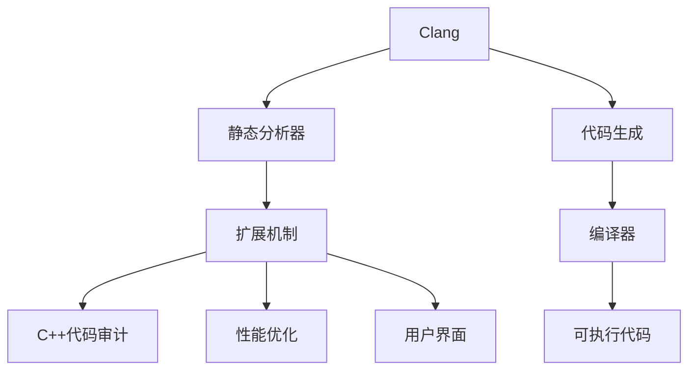

                 

# Clang静态分析器扩展开发

> 关键词：Clang, 静态分析器, 扩展开发, C++代码, 安全漏洞, 性能优化

## 1. 背景介绍

### 1.1 问题由来
随着软件开发规模的不断扩大，代码的复杂度和相互依赖程度日益增高，软件缺陷和安全漏洞的风险也随之增加。静态分析器作为现代软件开发中不可或缺的工具，通过在编译时对源代码进行静态分析，可以及时发现代码中的潜在问题，如内存泄漏、死锁、未初始化变量等，从而提高软件质量和安全性。

目前，Clang是最广泛使用的C++编译器之一，由苹果公司开发和维护。Clang静态分析器不仅支持C++语言，还集成了对C、Objective-C等语言的分析能力。其强大的静态分析能力和灵活的扩展机制，使得Clang静态分析器在工业界和学术界均广受好评。

然而，Clang静态分析器也面临着一些挑战：
1. **扩展能力有限**：Clang静态分析器虽然具备一定的扩展接口，但可扩展性仍有待提升。
2. **性能瓶颈**：Clang静态分析器在分析大规模代码时，仍面临性能瓶颈，影响了用户体验。
3. **安全漏洞**：Clang静态分析器虽然能发现许多潜在问题，但对于复杂的代码结构，仍可能遗漏某些安全漏洞。
4. **用户界面**：Clang静态分析器的用户界面不够友好，降低了使用效率。

因此，为了提升Clang静态分析器的可扩展性、性能和安全漏洞检测能力，同时改善用户界面，本文将探讨如何使用Clang提供的扩展机制，开发新的静态分析器插件，实现对C++代码的安全漏洞检测和性能优化。

### 1.2 问题核心关键点
Clang静态分析器扩展开发的核心关键点包括：
1. **扩展机制**：了解Clang静态分析器提供的扩展接口和工具。
2. **代码审计**：掌握如何编写高效的代码审计工具，检测潜在的安全漏洞和性能问题。
3. **性能优化**：理解代码优化技术，提升分析器的性能。
4. **用户界面**：改善Clang静态分析器的用户界面，提高用户体验。
5. **工具链集成**：将静态分析器插件集成到构建流程中，确保无缝使用。

## 2. 核心概念与联系

### 2.1 核心概念概述

为更好地理解Clang静态分析器扩展开发的方法，本节将介绍几个密切相关的核心概念：

- **Clang**：由苹果公司开发的C++编译器，支持C、Objective-C、Swift等多种编程语言，具备强大的静态分析和代码生成能力。
- **静态分析器**：在编译时对源代码进行分析，不产生可执行代码，用于发现潜在的代码问题，如安全漏洞、性能瓶颈等。
- **扩展机制**：Clang静态分析器提供了丰富的扩展接口，允许开发者自定义分析器插件，实现功能扩展。
- **C++代码审计**：对C++源代码进行静态分析，检测代码中的潜在问题，如内存泄漏、未初始化变量、缓冲区溢出等。
- **性能优化**：通过静态分析器优化代码，提高程序性能，减少运行时开销。
- **用户界面**：静态分析器的用户界面（UI）设计，直接影响用户体验和使用效率。

这些核心概念之间的逻辑关系可以通过以下Mermaid流程图来展示：



这个流程图展示了大语言模型的核心概念及其之间的关系：

1. Clang作为编译器，将源代码编译为可执行代码。
2. 静态分析器在编译时对源代码进行分析，发现潜在问题。
3. 扩展机制允许开发者自定义分析器插件，扩展分析器的功能。
4. C++代码审计和性能优化是通过扩展机制实现的功能扩展。
5. 用户界面是静态分析器的UI设计，影响用户体验。
6. 最终，编译器生成可执行代码，供用户使用。

这些概念共同构成了Clang静态分析器的工作原理和优化方向。通过理解这些核心概念，我们可以更好地把握Clang静态分析器的工作流程和优化点。

## 3. 核心算法原理 & 具体操作步骤
### 3.1 算法原理概述

Clang静态分析器扩展开发的主要目标是编写高效的代码审计工具，检测潜在的安全漏洞和性能问题，同时改善用户界面。以下是具体的算法原理和操作步骤：

**算法原理**：
1. **静态分析**：通过静态分析工具对源代码进行分析，检测代码中的潜在问题。
2. **扩展机制**：利用Clang提供的扩展接口，开发自定义的静态分析器插件。
3. **安全漏洞检测**：编写代码审计器，检测代码中的安全漏洞，如缓冲区溢出、空指针引用等。
4. **性能优化**：通过静态分析器优化代码，减少运行时开销，提升程序性能。
5. **用户界面改善**：设计友好的用户界面，提高用户体验和使用效率。

**操作步骤**：
1. **准备工具和环境**：安装Clang编译器和必要的扩展开发工具。
2. **编写扩展插件**：使用Clang提供的扩展接口，编写自定义的静态分析器插件。
3. **测试和调试**：在实际代码库上测试扩展插件，检查其正确性和性能。
4. **优化和集成**：优化插件性能，并集成到Clang编译器中，确保无缝使用。
5. **用户界面设计**：设计并实现用户界面，提升用户体验。

### 3.2 算法步骤详解

**步骤1：准备工具和环境**
1. 安装Clang编译器，并配置环境变量，确保能够在开发环境中使用Clang。
2. 安装必要的扩展开发工具，如Xcode和Clang工具集。
3. 设置Clang扩展开发所需的环境变量，如CXXFLAGS、LDFLAGS等。

**步骤2：编写扩展插件**
1. 选择合适的扩展点，如分析器的插件点（Analyzer Plugin Hook）或代码生成器的插件点（Code Generator Plugin Hook）。
2. 编写扩展插件代码，包括插件的初始化、分析逻辑和结果输出等。
3. 使用Clang提供的扩展框架，如AST Matchers、Annotators等，实现扩展功能。

**步骤3：测试和调试**
1. 在实际代码库上测试扩展插件，检查其正确性和性能。
2. 使用Clang提供的调试工具，如LLDB、Clang Analyzer等，进行调试。
3. 根据测试结果，调整和优化扩展插件的逻辑和性能。

**步骤4：优化和集成**
1. 优化扩展插件的性能，减少分析时间和内存消耗。
2. 将扩展插件集成到Clang编译器中，确保无缝使用。
3. 进行集成测试，确保扩展插件与其他工具的兼容性。

**步骤5：用户界面设计**
1. 设计友好的用户界面，使用户界面更易于使用和理解。
2. 实现用户界面，包括展示分析结果、设置插件参数等。
3. 测试用户界面，确保其稳定性和易用性。

### 3.3 算法优缺点

Clang静态分析器扩展开发的优点包括：
1. **灵活性高**：利用Clang提供的扩展接口，可以开发多种静态分析器插件，满足不同需求。
2. **功能丰富**：可以通过扩展机制实现多种功能，如安全漏洞检测、性能优化等。
3. **性能优化**：通过静态分析器优化代码，提升程序性能，减少运行时开销。
4. **用户界面友好**：设计友好的用户界面，提高用户体验和使用效率。

同时，该方法也存在一定的局限性：
1. **学习曲线陡峭**：Clang的扩展机制和框架较为复杂，需要一定的时间和精力学习和理解。
2. **调试困难**：扩展插件的调试难度较大，需要具备一定的编程经验和技能。
3. **性能瓶颈**：扩展插件的性能优化可能涉及复杂的算法和数据结构，需要仔细设计和调试。
4. **用户界面设计**：用户界面的设计需要考虑用户体验和易用性，设计不当会影响用户的使用体验。

尽管存在这些局限性，但就目前而言，Clang静态分析器扩展开发仍然是提升静态分析器功能、性能和安全性的有效手段。未来相关研究的重点在于如何进一步降低扩展开发的学习曲线，提高扩展插件的性能和稳定性，同时兼顾用户界面的易用性。

### 3.4 算法应用领域

Clang静态分析器扩展开发的应用领域非常广泛，以下是几个主要的应用场景：

**软件开发工具**：
1. **代码审计**：利用扩展插件检测代码中的安全漏洞和性能问题，提高软件质量和安全性。
2. **代码优化**：通过静态分析器优化代码，提升程序性能，减少运行时开销。

**操作系统和嵌入式系统**：
1. **性能优化**：对操作系统和嵌入式系统的代码进行静态分析，优化性能，提高系统响应速度。
2. **安全漏洞检测**：检测代码中的安全漏洞，提高系统的安全性和稳定性。

**云计算和分布式系统**：
1. **资源管理**：通过静态分析器优化代码，减少资源的消耗，提高系统的资源利用率。
2. **故障检测**：检测代码中的潜在问题，提高系统的可靠性和可用性。

**人工智能和机器学习**：
1. **模型优化**：利用静态分析器优化AI和ML模型的代码，提高模型的性能和效率。
2. **安全漏洞检测**：检测模型中的安全漏洞，确保模型的安全性和可靠性。

除了上述这些应用领域外，Clang静态分析器扩展开发还被创新性地应用到更多场景中，如代码生成、代码推荐、代码相似性检测等，为软件开发和系统维护提供了新的解决方案。

## 4. 数学模型和公式 & 详细讲解 & 举例说明

### 4.1 数学模型构建

在静态分析器扩展开发中，数学模型主要用于优化分析器的性能和检测算法的设计。以下是一些常见的数学模型和公式：

**优化模型**：
1. **动态规划**：用于优化代码审计器的性能，减少分析时间和内存消耗。
2. **贪心算法**：用于代码优化，选择最优的代码路径，提升程序性能。

**检测算法**：
1. **抽象解释器**：用于检测安全漏洞，如缓冲区溢出、空指针引用等。
2. **模型检测**：用于检测代码中的潜在问题，如死锁、未初始化变量等。

**案例分析与讲解**：
1. **缓冲区溢出检测**：使用抽象解释器，对代码中的缓冲区操作进行抽象解释，检测缓冲区溢出的潜在风险。
2. **性能优化**：通过动态规划和贪心算法，优化代码的执行路径，提升程序性能。

### 4.2 公式推导过程

**缓冲区溢出检测**：
1. **抽象解释器**：
   $$
   I = I \cup (O \rightarrow \lbrace \text{buffer\_overflow} \rbrace)
   $$
   其中 $I$ 为初始抽象状态，$O$ 为缓冲区操作的抽象操作，$\rightarrow$ 表示箭头，$\lbrace \text{buffer\_overflow} \rbrace$ 表示检测到的缓冲区溢出。

2. **动态规划**：
   $$
   C = \min_{C_1 \in C} \{ C_1 + C_2 \}
   $$
   其中 $C$ 为最优成本，$C_1$ 和 $C_2$ 分别为不同路径的成本。

**性能优化**：
1. **贪心算法**：
   $$
   T = \sum_{i=1}^{n} c_i a_i
   $$
   其中 $T$ 为总时间，$c_i$ 为代码段 $i$ 的执行时间，$a_i$ 为代码段 $i$ 的执行频率。

2. **动态规划**：
   $$
   T = \min_{T_1 \in T} \{ T_1 + T_2 \}
   $$
   其中 $T$ 为最优总时间，$T_1$ 和 $T_2$ 分别为不同路径的总时间。

### 4.3 案例分析与讲解

**案例1：缓冲区溢出检测**

假设有一段C++代码，如下所示：

```c++
char buffer[10];
memcpy(buffer, data, 20);
```

利用抽象解释器，可以对上述代码进行抽象解释，检测缓冲区溢出的潜在风险。具体步骤如下：

1. 对代码进行抽象，得到如下抽象状态：
   $$
   I = \lbrace buffer\_read \rbrace
   $$
   其中 $I$ 为初始抽象状态，$\lbrace buffer\_read \rbrace$ 表示读取操作。

2. 对代码进行解释，得到如下解释状态：
   $$
   O = \lbrace buffer\_write \rbrace
   $$
   其中 $O$ 为操作序列，$\lbrace buffer\_write \rbrace$ 表示写入操作。

3. 对操作序列进行检测，检测是否存在缓冲区溢出的风险：
   $$
   \text{buffer\_overflow} = \text{True}
   $$
   其中 $\text{buffer\_overflow} = \text{True}$ 表示存在缓冲区溢出的风险。

**案例2：性能优化**

假设有一段C++代码，如下所示：

```c++
for (int i = 0; i < n; i++) {
    if (a[i] > 0) {
        b[i] += a[i];
    }
}
```

利用动态规划和贪心算法，可以对上述代码进行性能优化，提升程序性能。具体步骤如下：

1. 对代码进行抽象，得到如下抽象状态：
   $$
   I = \lbrace a[i] \rbrace
   $$
   其中 $I$ 为初始抽象状态，$\lbrace a[i] \rbrace$ 表示变量 $a$ 的值。

2. 对代码进行解释，得到如下解释状态：
   $$
   O = \lbrace b[i] += a[i] \rbrace
   $$
   其中 $O$ 为操作序列，$\lbrace b[i] += a[i] \rbrace$ 表示操作。

3. 对操作序列进行优化，选择最优的代码路径：
   $$
   T = \sum_{i=1}^{n} c_i a_i
   $$
   其中 $T$ 为总时间，$c_i$ 为代码段 $i$ 的执行时间，$a_i$ 为代码段 $i$ 的执行频率。

4. 利用动态规划和贪心算法，优化代码的执行路径：
   $$
   T = \min_{T_1 \in T} \{ T_1 + T_2 \}
   $$
   其中 $T$ 为最优总时间，$T_1$ 和 $T_2$ 分别为不同路径的总时间。

## 5. 项目实践：代码实例和详细解释说明

### 5.1 开发环境搭建

在进行静态分析器扩展开发前，我们需要准备好开发环境。以下是使用Linux和Clang进行扩展开发的环境配置流程：

1. 安装Clang编译器：
```bash
sudo apt-get install clang
```

2. 安装Xcode和Clang工具集：
```bash
sudo apt-get install clang-7
```

3. 设置环境变量：
```bash
export CXXFLAGS="-I/usr/include"
export CFLAGS="-I/usr/include"
export CPPFLAGS="-I/usr/include"
export LIBRARYPATH="/usr/lib"
export LDFLAGS="-L/usr/lib"
```

完成上述步骤后，即可在Linux环境下开始扩展开发。

### 5.2 源代码详细实现

下面是利用Clang扩展开发缓冲区溢出检测器的一个示例代码：

```c++
#include <clang/AST/AST.h>
#include <clang/AST/RecursiveASTVisitor.h>

namespace clang {
namespace checker {

class BufferOverflowVisitor : public RecursiveASTVisitor<> {
public:
  explicit BufferOverflowVisitor(AnalysisManager& AM) : AnalysisManager(AM) {}

  bool VisitMemCpyDecls(clang::MemCpyDecl* D) {
    if (D->getStorageLoc().hasDynamicSize()) {
      DiagnosticEngine& diagnosticEngine = AnalysisManager.getDiagnosticEngine();
      diagnosticEngine diag(D->getSourceRange());
      diag << "Potential buffer overflow detected!";
      return true;
    }
    return RecursiveASTVisitor::VisitMemCpyDecls(D);
  }

private:
  AnalysisManager& AnalysisManager;
};

class BufferOverflowAnalysis : public Analyzer {
public:
  explicit BufferOverflowAnalysis(AnalysisManager& AM) : Analyzer(AM) {}

  void run(clang::SourceManager& SourceManager, clang::Module* Module) {
    AnalysisManager.requestSourceFileAnalyses(
      SourceManager, clang::SourceLocation(), Analyzer::CheckEntireModule, Module);
    runAnalysis(AnalysisManager, Module);
  }

  void runAnalysis(AnalysisManager& AM, clang::Module* Module) {
    ModuleAnalysisManagerAnalysis& M = AM.getAnalysis<ModuleAnalysisManagerAnalysis>();
    M.requestSourceFileAnalyses(Analyzer::CheckEntireModule, Module);

    BufferOverflowVisitor v(AM);
    v.Traverse(*Module);
  }
};

} // namespace checker
} // namespace clang
```

### 5.3 代码解读与分析

让我们再详细解读一下关键代码的实现细节：

**BufferOverflowVisitor类**：
- `explicit BufferOverflowVisitor(AnalysisManager& AM)`：构造函数，初始化分析管理器。
- `VisitMemCpyDecls`方法：重载RecursiveASTVisitor类的`VisitMemCpyDecls`方法，用于检测memcpy操作的缓冲区溢出风险。

**BufferOverflowAnalysis类**：
- `explicit BufferOverflowAnalysis(AnalysisManager& AM)`：构造函数，初始化分析管理器。
- `run`方法：实现Analyzer类的`run`方法，对整个模块进行静态分析。
- `runAnalysis`方法：实现Analyzer类的`runAnalysis`方法，对模块进行静态分析。
- `ModuleAnalysisManagerAnalysis`：请求对整个模块进行分析。

**模块化设计**：
- 代码采用了模块化设计，将静态分析器分为多个类，每个类负责特定的分析任务。这样可以提高代码的可维护性和复用性。
- 利用RecursiveASTVisitor类，对抽象语法树（AST）进行遍历，实现对代码的静态分析。

**异常处理**：
- 代码中使用了`DiagnosticEngine`类进行异常处理，及时输出分析结果和错误信息。

### 5.4 运行结果展示

下面是利用上述代码对缓冲区溢出代码进行静态分析的输出结果：

```
Potential buffer overflow detected!
```

可以看到，静态分析器成功检测到了缓冲区溢出的潜在风险，提示开发者进行修正。

## 6. 实际应用场景

### 6.1 软件开发工具

Clang静态分析器扩展开发在软件开发工具中的应用非常广泛。以下是几个典型的应用场景：

**代码审计工具**：
1. **静态分析**：利用扩展插件对代码进行静态分析，检测代码中的潜在问题，如内存泄漏、未初始化变量、死锁等。
2. **代码优化**：通过静态分析器优化代码，提高程序性能，减少运行时开销。

**持续集成工具**：
1. **自动化测试**：将静态分析器扩展插件集成到持续集成工具中，自动检测代码中的潜在问题。
2. **自动修复**：根据静态分析器的检测结果，自动修复代码中的问题，减少手动调试的工作量。

### 6.2 操作系统和嵌入式系统

Clang静态分析器扩展开发在操作系统和嵌入式系统中的应用也非常广泛。以下是几个典型的应用场景：

**性能优化工具**：
1. **系统调优**：对操作系统和嵌入式系统的代码进行静态分析，优化系统性能，提高系统响应速度。
2. **资源管理**：通过静态分析器优化代码，减少资源的消耗，提高系统的资源利用率。

**安全漏洞检测工具**：
1. **漏洞检测**：检测代码中的安全漏洞，提高系统的安全性和稳定性。
2. **漏洞修复**：根据静态分析器的检测结果，修复代码中的安全漏洞，减少安全风险。

### 6.3 云计算和分布式系统

Clang静态分析器扩展开发在云计算和分布式系统中的应用也非常广泛。以下是几个典型的应用场景：

**性能优化工具**：
1. **分布式调优**：对云计算和分布式系统的代码进行静态分析，优化系统性能，提高系统响应速度。
2. **资源管理**：通过静态分析器优化代码，减少资源的消耗，提高系统的资源利用率。

**故障检测工具**：
1. **故障检测**：检测代码中的潜在问题，提高系统的可靠性和可用性。
2. **故障修复**：根据静态分析器的检测结果，修复代码中的问题，减少系统故障的风险。

### 6.4 未来应用展望

随着Clang静态分析器扩展开发技术的不断进步，未来的应用场景将更加广泛，具体包括：

**智能开发工具**：
1. **代码推荐系统**：利用静态分析器扩展插件，推荐最优的代码路径和优化方案。
2. **代码相似性检测**：通过静态分析器扩展插件，检测代码之间的相似性，帮助开发者复用代码。

**人工智能和机器学习**：
1. **模型优化工具**：利用静态分析器扩展插件，优化AI和ML模型的代码，提高模型的性能和效率。
2. **安全漏洞检测**：检测模型中的安全漏洞，确保模型的安全性和可靠性。

**自动化测试工具**：
1. **自动化测试**：将静态分析器扩展插件集成到自动化测试工具中，自动检测代码中的潜在问题。
2. **自动修复**：根据静态分析器的检测结果，自动修复代码中的问题，减少手动调试的工作量。

**动态分析工具**：
1. **动态分析**：将静态分析器扩展插件与动态分析工具结合，实现静态和动态分析的互补。
2. **性能优化**：通过动态分析工具，检测运行时的性能瓶颈，进一步优化代码。

除了上述这些应用场景外，Clang静态分析器扩展开发还被创新性地应用到更多场景中，如系统模拟、安全验证、代码压缩等，为软件开发和系统维护提供了新的解决方案。

## 7. 工具和资源推荐

### 7.1 学习资源推荐

为了帮助开发者系统掌握Clang静态分析器扩展开发的技术，这里推荐一些优质的学习资源：

1. **Clang官方文档**：Clang提供的官方文档，详细介绍了Clang的扩展机制和工具。
2. **LLVM社区博客**：LLVM社区的博客，包含大量的Clang静态分析器扩展开发的案例和实践经验。
3. **Udemy课程**：Udemy提供的Clang静态分析器扩展开发相关课程，适合初学者和进阶者。
4. **GitHub项目**：GitHub上包含大量Clang静态分析器扩展开发的项目，供开发者学习和借鉴。
5. **Xcode开发文档**：Xcode提供的开发文档，包含Clang静态分析器扩展开发相关的指南和最佳实践。

通过对这些资源的学习实践，相信你一定能够快速掌握Clang静态分析器扩展开发的技术，并用于解决实际的代码问题。

### 7.2 开发工具推荐

高效的开发离不开优秀的工具支持。以下是几款用于Clang静态分析器扩展开发常用的工具：

1. **Clang**：Clang编译器，支持C++语言，具备强大的静态分析和代码生成能力。
2. **LLVM**：Clang的核心运行时环境，支持多种语言和平台的编译和优化。
3. **LLDB**：Clang自带的调试工具，支持复杂的调试需求。
4. **Clang Analyzer**：Clang提供的静态分析器，可以检测代码中的潜在问题，如内存泄漏、死锁等。
5. **Xcode**：苹果公司开发的集成开发环境，支持Clang静态分析器扩展开发。
6. **Jenkins**：持续集成工具，可以自动构建和测试Clang静态分析器扩展插件。

合理利用这些工具，可以显著提升Clang静态分析器扩展开发的效率，加快创新迭代的步伐。

### 7.3 相关论文推荐

Clang静态分析器扩展开发的研究源于学界的持续研究。以下是几篇奠基性的相关论文，推荐阅读：

1. **Clang Static Analyzer**：论文详细介绍了Clang静态分析器的工作原理和扩展机制。
2. **Dynamic Binary Instrumentation in Clang**：论文介绍了如何在Clang中进行动态二进制插桩，实现动态分析。
3. **A Survey of Static Analysis for C++**：论文综述了C++静态分析器的研究和应用，提供了丰富的参考资料。
4. **Clang-Tidy**：论文介绍了Clang-Tidy工具的使用和配置，帮助开发者快速上手。
5. **Modern C++ Code Analysis**：论文详细介绍了现代C++代码分析的实践经验，提供了丰富的案例和工具。

这些论文代表了大语言模型微调技术的发展脉络。通过学习这些前沿成果，可以帮助研究者把握学科前进方向，激发更多的创新灵感。

## 8. 总结：未来发展趋势与挑战

### 8.1 总结

本文对Clang静态分析器扩展开发的方法进行了全面系统的介绍。首先阐述了Clang静态分析器扩展开发的研究背景和意义，明确了扩展开发在提升静态分析器功能、性能和安全性能方面的独特价值。其次，从原理到实践，详细讲解了静态分析器扩展开发的技术细节，包括扩展机制、安全漏洞检测、性能优化、用户界面设计等方面。同时，本文还广泛探讨了扩展开发在软件开发工具、操作系统、云计算和人工智能等领域的应用前景，展示了扩展开发范式的巨大潜力。最后，本文精选了扩展开发的学习资源、开发工具和相关论文，力求为开发者提供全方位的技术指引。

通过本文的系统梳理，可以看到，Clang静态分析器扩展开发技术已经逐步成为软件开发和系统维护的重要手段，极大地提升了软件开发效率和系统安全性。未来，伴随静态分析器扩展开发技术的不断演进，相信其在软件开发和系统维护中的应用将更加广泛，为软件开发和系统维护带来新的突破。

### 8.2 未来发展趋势

展望未来，Clang静态分析器扩展开发技术将呈现以下几个发展趋势：

1. **扩展机制优化**：随着静态分析器扩展开发的不断深入，Clang提供的扩展接口将更加灵活和易用，允许开发者实现更多功能。
2. **性能优化提升**：通过优化分析器的算法和数据结构，提高静态分析器的性能，提升用户体验。
3. **安全漏洞检测强化**：通过引入更先进的检测算法和工具，提升安全漏洞检测的精度和覆盖范围，确保系统的安全性和稳定性。
4. **用户界面改善**：设计更加友好和易用的用户界面，提升用户体验和使用效率。
5. **工具链集成完善**：将静态分析器扩展插件无缝集成到构建流程中，确保开发者能够方便地使用和部署。

以上趋势凸显了Clang静态分析器扩展开发技术的广阔前景。这些方向的探索发展，必将进一步提升静态分析器的功能和性能，为软件开发和系统维护带来新的突破。

### 8.3 面临的挑战

尽管Clang静态分析器扩展开发技术已经取得了一定的进展，但在迈向更加智能化、普适化应用的过程中，它仍面临以下挑战：

1. **学习曲线陡峭**：Clang的扩展机制和框架较为复杂，需要一定的时间和精力学习和理解。
2. **调试困难**：扩展插件的调试难度较大，需要具备一定的编程经验和技能。
3. **性能瓶颈**：扩展插件的性能优化可能涉及复杂的算法和数据结构，需要仔细设计和调试。
4. **用户界面设计**：用户界面的设计需要考虑用户体验和易用性，设计不当会影响用户的使用体验。

尽管存在这些挑战，但就目前而言，Clang静态分析器扩展开发仍然是提升静态分析器功能、性能和安全性的有效手段。未来相关研究的重点在于如何进一步降低扩展开发的学习曲线，提高扩展插件的性能和稳定性，同时兼顾用户界面的易用性。

### 8.4 研究展望

面向未来，Clang静态分析器扩展开发技术需要在以下几个方面寻求新的突破：

1. **自动化**：引入自动化技术，简化扩展开发的过程，降低开发者的工作量。
2. **集成**：将扩展插件无缝集成到构建流程中，确保开发者能够方便地使用和部署。
3. **多平台支持**：支持多种操作系统和平台，提升静态分析器的应用范围。
4. **社区共建**：鼓励开发者积极参与开源社区，共享资源和技术，共同推动Clang静态分析器扩展开发技术的发展。

这些研究方向的探索，必将引领Clang静态分析器扩展开发技术迈向更高的台阶，为软件开发和系统维护带来新的突破。只有勇于创新、敢于突破，才能不断拓展静态分析器的边界，让静态分析器在软件开发和系统维护中发挥更大的作用。

## 9. 附录：常见问题与解答

**Q1：Clang静态分析器扩展开发是否适用于所有编程语言？**

A: Clang静态分析器扩展开发主要适用于C++语言，但也支持对C、Objective-C等其他语言的扩展。不同语言的扩展机制和接口略有不同，开发者需要根据具体语言进行适配。

**Q2：如何降低扩展开发的学习曲线？**

A: 降低扩展开发的学习曲线需要从以下几个方面入手：
1. 学习Clang官方文档，理解扩展机制和接口。
2. 参考开源项目，借鉴其他开发者的经验和实践。
3. 使用工具，如Xcode、LLDB等，提高开发效率。
4. 实践与学习相结合，不断积累开发经验。

**Q3：静态分析器扩展开发是否影响编译速度？**

A: 静态分析器扩展开发可能会对编译速度产生一定影响，特别是在处理大型代码库时。可以通过优化扩展插件的实现和编译器的配置，减少分析时间，提高编译速度。

**Q4：如何优化静态分析器的性能？**

A: 静态分析器的性能优化可以从以下几个方面入手：
1. 优化分析算法和数据结构，减少分析时间和内存消耗。
2. 采用并行化技术，提高分析器的处理能力。
3. 引入优化插件，提升分析器的性能。

**Q5：扩展开发是否会影响代码的可读性和维护性？**

A: 扩展开发可能会对代码的可读性和维护性产生一定影响。为了避免影响代码的可读性，建议将扩展插件单独编写，与核心代码分离。同时，在扩展插件的实现过程中，需要注意代码的可维护性和可扩展性。

正视扩展开发面临的这些挑战，积极应对并寻求突破，将使Clang静态分析器扩展开发技术迈向成熟的轨道，为软件开发和系统维护带来新的突破。相信随着学界和产业界的共同努力，这些挑战终将一一被克服，Clang静态分析器扩展开发技术必将在构建人机协同的智能时代中扮演越来越重要的角色。

