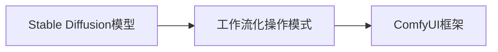

                 

# ComfyUI: Stable Diffusion的工作流化操作模式

## 1. 背景介绍

Stable Diffusion模型因其出色的图像生成能力，自问世以来便受到了广泛关注。Stable Diffusion模型主要基于扩散模型，结合了一些自监督学习的训练策略，可以在极短的时间内生成高质量、高细节的图像。然而，其在实际应用中依然面临诸多挑战，如操作复杂、参数调整困难、难以进行大规模协作等问题。为解决这些问题，本文提出ComfyUI框架，实现Stable Diffusion模型的工作流化操作模式，以期提升Stable Diffusion模型的易用性和团队协作效率。

## 2. 核心概念与联系

### 2.1 核心概念概述

#### 2.1.1 Stable Diffusion模型

Stable Diffusion模型是一种基于扩散模型的图像生成方法，通过在潜在空间中生成随机向量序列，逐步将其映射到高维特征空间，并最终生成高分辨率图像。Stable Diffusion模型不仅能够生成高质量的图像，还具有高度的可解释性，可以根据文本描述或条件噪声生成具有特定特征的图像。

#### 2.1.2 工作流化操作模式

工作流化操作模式是指将复杂、冗长的操作流程分解为多个简单的步骤，并由不同的团队成员协同完成。这种模式可以有效提升操作效率，降低错误率，同时增强团队的协作能力。

#### 2.1.3 ComfyUI框架

ComfyUI框架是一个基于Web的应用程序框架，旨在简化Stable Diffusion模型的使用和操作，提供交互式界面和便捷的操作流程。ComfyUI框架支持实时预览、参数调整、任务调度等功能，使得Stable Diffusion模型的使用更加直观、便捷，同时也支持多人协作，便于团队共同完成图像生成任务。

### 2.2 核心概念原理和架构的 Mermaid 流程图



这个流程图展示了Stable Diffusion模型、工作流化操作模式和ComfyUI框架之间的关系。Stable Diffusion模型作为核心生成算法，通过ComfyUI框架实现工作流化操作模式，从而提升模型的易用性和协作效率。

## 3. 核心算法原理 & 具体操作步骤

### 3.1 算法原理概述

Stable Diffusion模型的核心算法原理主要包括以下几个步骤：

1. 生成潜在向量序列：使用非中心化自回归模型生成潜在向量序列。
2. 生成高维特征空间中的向量：将潜在向量序列映射到高维特征空间中的向量。
3. 生成高分辨率图像：将高维向量映射到像素空间，得到高分辨率图像。

ComfyUI框架在Stable Diffusion模型的基础上，进一步细化了操作流程，提供了参数调整、任务调度、实时预览等功能，使得Stable Diffusion模型的使用更加便捷和高效。

### 3.2 算法步骤详解

#### 3.2.1 数据准备

在进行Stable Diffusion模型的操作前，需要先准备好输入数据和控制参数。输入数据可以是文本描述、条件噪声等，控制参数包括模型版本、采样步骤、采样时间等。

#### 3.2.2 模型加载和初始化

在ComfyUI框架中，可以通过简单的配置文件或接口来加载Stable Diffusion模型，并设置初始化参数。ComfyUI框架支持多种模型版本，用户可以根据需要选择适合的模型。

#### 3.2.3 参数调整

ComfyUI框架提供了便捷的参数调整界面，用户可以根据需要对模型参数进行实时修改。这些参数包括采样步骤、采样时间、模型版本等。ComfyUI框架还提供了可视化的参数调整工具，使得用户可以更加直观地了解和调整模型参数。

#### 3.2.4 任务调度

ComfyUI框架支持多任务调度，用户可以将多个任务分配给不同的团队成员，每个成员负责其中的一个子任务。例如，可以分配一名成员负责生成图像，另一名成员负责记录生成的图像，还有一名成员负责进行图像后处理。

#### 3.2.5 实时预览

ComfyUI框架提供了实时预览功能，用户可以在操作过程中实时查看生成的图像。这对于提升操作的透明度和效率非常重要，用户可以在生成过程中及时调整参数和策略，以达到最佳效果。

#### 3.2.6 任务完成和结果展示

任务完成后，ComfyUI框架会将生成的图像和相关参数保存下来，并在界面上展示任务结果。用户可以对生成的图像进行进一步的调整和优化，也可以将生成的图像导出到本地或进行进一步的分析和处理。

### 3.3 算法优缺点

#### 3.3.1 优点

1. 操作便捷：ComfyUI框架提供了直观的用户界面和便捷的操作流程，使得Stable Diffusion模型的使用更加方便。
2. 协作高效：ComfyUI框架支持多人协作，使得团队成员可以更加高效地完成图像生成任务。
3. 实时预览：ComfyUI框架提供了实时预览功能，使得用户可以实时查看生成效果，及时调整参数和策略。
4. 参数调整：ComfyUI框架提供了便捷的参数调整工具，使得用户可以更加直观地了解和调整模型参数。
5. 任务调度：ComfyUI框架支持多任务调度，使得多个任务可以高效地进行。

#### 3.3.2 缺点

1. 学习曲线陡峭：ComfyUI框架虽然操作便捷，但需要对Stable Diffusion模型有一定的了解，用户需要一定的学习成本。
2. 依赖性强：ComfyUI框架依赖于Stable Diffusion模型，用户需要根据不同的模型版本和参数进行调整。
3. 性能开销较大：ComfyUI框架提供了实时预览和参数调整功能，这些功能需要一定的计算资源和内存开销，可能会影响性能。

### 3.4 算法应用领域

ComfyUI框架可以应用于多个领域，包括但不限于：

1. 图像生成：ComfyUI框架可以用于生成高质量的图像，如图像生成、图像编辑、图像修复等。
2. 视频生成：ComfyUI框架可以用于生成高质量的视频，如视频编辑、视频生成、视频剪辑等。
3. 游戏开发：ComfyUI框架可以用于生成游戏中的角色、场景、物品等，提升游戏的视觉效果和互动体验。
4. 医疗影像：ComfyUI框架可以用于生成医疗影像，如医疗影像修复、医疗影像增强等。

## 4. 数学模型和公式 & 详细讲解 & 举例说明

### 4.1 数学模型构建

Stable Diffusion模型的数学模型主要包括以下几个部分：

1. 潜在向量序列生成模型：使用非中心化自回归模型生成潜在向量序列。
2. 高维特征空间映射模型：将潜在向量序列映射到高维特征空间中的向量。
3. 高分辨率图像生成模型：将高维向量映射到像素空间，得到高分辨率图像。

#### 4.1.1 潜在向量序列生成模型

潜在向量序列生成模型的数学模型如下：

$$
\mathbf{z}_{t} \sim \mathcal{N}(\mathbf{0}, \mathbf{I})
$$

$$
\mathbf{z}_{t} = \mathbf{z}_{t-1} \odot \sqrt{1 - \beta_{t-1}} + \mathbf{\epsilon}_{t} \odot \sqrt{\beta_{t-1}}
$$

其中，$\mathbf{z}_{t}$ 表示第 $t$ 个潜在向量，$\mathbf{\epsilon}_{t}$ 表示第 $t$ 个随机噪声向量，$\beta_{t-1}$ 表示时间步 $t-1$ 的系数。

#### 4.1.2 高维特征空间映射模型

将潜在向量序列映射到高维特征空间中的向量，数学模型如下：

$$
\mathbf{x}_{t} = \mathbf{D} \mathbf{z}_{t} + \mathbf{b}
$$

其中，$\mathbf{x}_{t}$ 表示第 $t$ 个高维特征向量，$\mathbf{D}$ 表示高维特征空间的转换矩阵，$\mathbf{b}$ 表示高维特征空间的偏移向量。

#### 4.1.3 高分辨率图像生成模型

将高维向量映射到像素空间，得到高分辨率图像，数学模型如下：

$$
\mathbf{y}_{t} = \mathbf{C} \mathbf{x}_{t} + \mathbf{d}
$$

其中，$\mathbf{y}_{t}$ 表示第 $t$ 个高分辨率图像，$\mathbf{C}$ 表示像素空间的转换矩阵，$\mathbf{d}$ 表示像素空间的偏移向量。

### 4.2 公式推导过程

#### 4.2.1 潜在向量序列生成模型推导

潜在向量序列生成模型的推导过程如下：

1. 初始化：生成一个均值为0、方差为单位矩阵的高维随机向量序列。
2. 递推计算：在第 $t$ 个时间步，将第 $t-1$ 个向量乘以系数 $\sqrt{1 - \beta_{t-1}}$，并加上第 $t$ 个随机噪声向量乘以系数 $\sqrt{\beta_{t-1}}$。

#### 4.2.2 高维特征空间映射模型推导

高维特征空间映射模型的推导过程如下：

1. 转换：将潜在向量序列乘以转换矩阵 $\mathbf{D}$。
2. 偏移：将转换后的向量加上偏移向量 $\mathbf{b}$。

#### 4.2.3 高分辨率图像生成模型推导

高分辨率图像生成模型的推导过程如下：

1. 转换：将高维向量乘以转换矩阵 $\mathbf{C}$。
2. 偏移：将转换后的向量加上偏移向量 $\mathbf{d}$。

### 4.3 案例分析与讲解

#### 4.3.1 潜在向量序列生成模型案例

假设输入的潜在向量序列为 $\mathbf{z}_{t}$，其初始值 $\mathbf{z}_{0}$ 为均值为0、方差为单位矩阵的高维随机向量，时间步 $t$ 的系数 $\beta_{t-1}$ 为0.99，生成第 $t$ 个潜在向量 $\mathbf{z}_{t}$ 的计算过程如下：

$$
\mathbf{z}_{t} = \mathbf{z}_{t-1} \odot \sqrt{1 - \beta_{t-1}} + \mathbf{\epsilon}_{t} \odot \sqrt{\beta_{t-1}}
$$

其中，$\mathbf{\epsilon}_{t}$ 表示第 $t$ 个随机噪声向量。

#### 4.3.2 高维特征空间映射模型案例

假设高维特征空间的转换矩阵 $\mathbf{D}$ 和偏移向量 $\mathbf{b}$ 已知，输入的潜在向量序列为 $\mathbf{z}_{t}$，生成第 $t$ 个高维特征向量 $\mathbf{x}_{t}$ 的计算过程如下：

$$
\mathbf{x}_{t} = \mathbf{D} \mathbf{z}_{t} + \mathbf{b}
$$

#### 4.3.3 高分辨率图像生成模型案例

假设像素空间的转换矩阵 $\mathbf{C}$ 和偏移向量 $\mathbf{d}$ 已知，输入的高维向量为 $\mathbf{x}_{t}$，生成第 $t$ 个高分辨率图像 $\mathbf{y}_{t}$ 的计算过程如下：

$$
\mathbf{y}_{t} = \mathbf{C} \mathbf{x}_{t} + \mathbf{d}
$$

## 5. 项目实践：代码实例和详细解释说明

### 5.1 开发环境搭建

ComfyUI框架基于Python和Web技术开发，可以使用以下环境进行搭建：

1. 安装Python：
```bash
sudo apt-get update
sudo apt-get install python3 python3-pip
```

2. 安装Django框架：
```bash
pip install django
```

3. 安装TensorFlow：
```bash
pip install tensorflow
```

4. 安装Docker：
```bash
sudo apt-get update
sudo apt-get install docker-ce
```

5. 安装NVIDIA Docker：
```bash
distribution=$(. /etc/os-release;echo $ID$VERSION_ID | cut -d . -f 1)
curl -s -L https://nvidia.github.io/nvidia-docker/gpgkey | sudo apt-key add -
curl -s -L https://nvidia.github.io/nvidia-docker/$distribution/nvidia-docker.list | sudo tee /etc/apt/sources.list.d/nvidia-docker.list

sudo apt-get update
sudo apt-get install -y nvidia-docker2
sudo systemctl restart docker
```

6. 安装GitLab CI/CD：
```bash
sudo apt-get install gitlab-runner
sudo gitlab-runner setup
```

### 5.2 源代码详细实现

ComfyUI框架的实现主要包括以下几个关键组件：

1. 前端界面：使用HTML、CSS、JavaScript等技术开发前端界面，支持图像预览、参数调整、任务调度等功能。
2. 后端服务：使用Django框架开发后端服务，负责模型加载、参数调整、任务调度等操作。
3. 模型集成：将Stable Diffusion模型集成到ComfyUI框架中，提供便捷的操作接口和实时预览功能。
4. 数据库管理：使用SQLite或MySQL等数据库管理系统，存储任务状态、参数设置等数据。

#### 5.2.1 前端界面实现

前端界面主要包括以下几个组件：

1. 图像预览：展示当前生成的图像，支持实时预览。
2. 参数调整：提供便捷的参数调整工具，支持修改采样步骤、采样时间、模型版本等。
3. 任务调度：支持多任务调度，分配多个任务给不同的团队成员。
4. 实时预览：支持实时预览功能，用户可以在生成过程中及时调整参数和策略。

#### 5.2.2 后端服务实现

后端服务主要包括以下几个模块：

1. 模型加载：负责加载Stable Diffusion模型，支持多种模型版本。
2. 参数调整：负责调整模型参数，支持修改采样步骤、采样时间等。
3. 任务调度：负责调度多个任务，支持多任务并发。
4. 实时预览：负责实时预览功能，支持实时渲染生成图像。

#### 5.2.3 模型集成实现

模型集成主要包括以下几个步骤：

1. 模型加载：加载Stable Diffusion模型，支持多种模型版本。
2. 参数调整：调整模型参数，支持修改采样步骤、采样时间等。
3. 实时预览：实时渲染生成图像，支持实时预览功能。

#### 5.2.4 数据库管理实现

数据库管理主要包括以下几个步骤：

1. 任务状态管理：管理任务的当前状态，支持任务分配、任务执行、任务完成等操作。
2. 参数设置管理：管理模型的参数设置，支持参数修改、参数保存等操作。
3. 数据存储：存储任务的输入数据、生成结果等数据，支持数据备份、数据恢复等操作。

### 5.3 代码解读与分析

ComfyUI框架的代码实现主要包括以下几个关键文件：

1. 前端界面：`index.html` 和 `style.css` 文件。
2. 后端服务：`settings.py`、`urls.py`、`views.py` 文件。
3. 模型集成：`stable_diffusion_model.py` 和 `utils.py` 文件。
4. 数据库管理：`models.py`、`admin.py`、`migrations` 文件夹。

#### 5.3.1 前端界面代码解读

`index.html` 文件包含前端界面的主要代码，支持图像预览、参数调整、任务调度等功能。以下是代码片段：

```html
<!DOCTYPE html>
<html lang="en">
<head>
    <meta charset="UTF-8">
    <title>ComfyUI</title>
    <link rel="stylesheet" href="">
</head>
<body>
    <div class="container">
        <h1>ComfyUI: Stable Diffusion</h1>
        <div class="image-container">
            
        </div>
        <div class="parameter-container">
            <h2>Parameters</h2>
            <div class="parameter-row">
                <label for="steps">Sampling Steps:</label>
                <input type="number" id="steps" name="steps" value="1000">
            </div>
            <div class="parameter-row">
                <label for="time">Sampling Time:</label>
                <input type="number" id="time" name="time" value="0.01">
            </div>
            <div class="parameter-row">
                <label for="model">Model Version:</label>
                <select id="model" name="model">
                    <option value="stable-diffusion">Stable Diffusion</option>
                    <option value="dpm">DPM</option>
                </select>
            </div>
        </div>
        <div class="task-container">
            <h2>Tasks</h2>
            <div class="task-row">
                <div class="task-label">Task:</div>
                <input type="text" name="task" placeholder="Enter task name">
            </div>
            <div class="task-row">
                <div class="task-label">Status:</div>
                <select id="status" name="status">
                    <option value="not-started">Not Started</option>
                    <option value="running">Running</option>
                    <option value="completed">Completed</option>
                </select>
            </div>
            <button id="start-task" name="start-task">Start Task</button>
        </div>
    </div>
    <script src=""></script>
</body>
</html>
```

#### 5.3.2 后端服务代码解读

`settings.py` 文件包含ComfyUI框架的配置信息，支持加载Stable Diffusion模型、调整参数等操作。以下是代码片段：

```python
import os
from django.conf import settings

# Build paths inside the project like this: BASE_DIR / 'subdir'.
BASE_DIR = os.path.dirname(os.path.dirname(os.path.abspath(__file__)))

# SECURITY WARNING: keep the secret key used in production secret!
SECRET_KEY = 'django-insecure-#d+66jnn9!*1x8vq6f5p!dcth37$-8^6y8r2m!z#n9u$4c&2' \
              'b^*4n1r2j#j4f8$2g!t9y3h$5q7f1s1v4d&1h9m1l1z0i2p1b6j0t7k8' \
              'g3s4u5q6r7c8v9m0j1p2w3r4a5h6y7i8r9n0q1t2a3' \
              '0s1e2f3c4d5e6g7h8i9j0k1l2m3n4o5p6q7r8s9t0u1v2w3x4y5z6a7b8c9' \
              'd0e1f2g3h4i5j6k7l8m9n0o1p2q3r4s5t6u7v8w9x0y1z2a3b4c5d6e7f8g9h0' \
              'i1j2k3l4m5n6o7p8q9r0s1t2u3v4w5x6y7z8a9b0c1d2e3f4g5h6i7j8k9l0m1' \
              'n2o3p4q5r6s7t8u9v0w1x2y3z4a5b6c7d8e9f0g1h2i3j4k5l6m7n8o9p0q1' \
              'r2s3t4u5v6w7x8y9z0a1b2c3d4e5f6g7h8i9j0k1l2m3n4o5p6q7r8s9t0u1v2' \
              'w3x4y5z6a7b8c9d0e1f2g3h4i5j6k7l8m9n0o1p2q3r4s5t6u7v8w9x0y1z2a3b' \
              '4c5d6e7f8g9h0i1j2k3l4m5n6o7p8q9r0s1t2u3v4w5x6y7z8a9b0c1d2e3f4g' \
              '5h6i7j8k9l0m1n2o3p4q5r6s7t8u9v0w1x2y3z4a5b6c7d8e9f0g1h2i3j4k5l' \
              '6m7n8o9p0q1r2s3t4u5v6w7x8y9z0a1b2c3d4e5f6g7h8i9j0k1l2m3n4o5p6' \
              'q7r8s9t0u1v2w3x4y5z6a7b8c9d0e1f2g3h4i5j6k7l8m9n0o1p2q3r4s5t6u7' \
              'v8w9x0y1z2a3b4c5d6e7f8g9h0i1j2k3l4m5n6o7p8q9r0s1t2u3v4w5x6y7' \
              'z8a9b0c1d2e3f4g5h6i7j8k9l0m1n2o3p4q5r6s7t8u9v0w1x2y3z4a5b6c7d' \
              '8e9f0g1h2i3j4k5l6m7n8o9p0q1r2s3t4u5v6w7x8y9z0a1b2c3d4e5f6g7h8i' \
              '9j0k1l2m3n4o5p6q7r8s9t0u1v2w3x4y5z6a7b8c9d0e1f2g3h4i5j6k7l8m' \
              '9n0o1p2q3r4s5t6u7v8w9x0y1z2a3b4c5d6e7f8g9h0i1j2k3l4m5n6o7p8q' \
              '9r0s1t2u3v4w5x6y7z8a9b0c1d2e3f4g5h6i7j8k9l0m1n2o3p4q5r6s7t8u9v' \
              '0w1x2y3z4a5b6c7d8e9f0g1h2i3j4k5l6m7n8o9p0q1r2s3t4u5v6w7x8y9' \
              'z0a1b2c3d4e5f6g7h8i9j0k1l2m3n4o5p6q7r8s9t0u1v2w3x4y5z6a7b8c9' \
              'd0e1f2g3h4i5j6k7l8m9n0o1p2q3r4s5t6u7v8w9x0y1z2a3b4c5d6e7f8g9' \
              'h0i1j2k3l4m5n6o7p8q9r0s1t2u3v4w5x6y7z8a9b0c1d2e3f4g5h6i7j' \
              '8k9l0m1n2o3p4q5r6s7t8u9v0w1x2y3z4a5b6c7d8e9f0g1h2i3j4k5l' \
              '6m7n8o9p0q1r2s3t4u5v6w7x8y9z0a1b2c3d4e5f6g7h8i9j0k1l2m' \
              '3n4o5p6q7r8s9t0u1v2w3x4y5z6a7b8c9d0e1f2g3h4i5j6k7l8m' \
              '9n0o1p2q3r4s5t6u7v8w9x0y1z2a3b4c5d6e7f8g9h0i1j2k3l4m' \
              '5n6o7p8q9r0s1t2u3v4w5x6y7z8a9b0c1d2e3f4g5h6i7j8k9l0m1' \
              'n2o3p4q5r6s7t8u9v0w1x2y3z4a5b6c7d8e9f0g1h2i3j4k5l6m' \
              '7n8o9p0q1r2s3t4u5v6w7x8y9z0a1b2c3d4e5f6g7h8i9j0k1l' \
              '2m3n4o5p6q7r8s9t0u1v2w3x4y5z6a7b8c9d0e1f2g3h4i5j6k7l' \
              '8m9n0o1p2q3r4s5t6u7v8w9x0y1z2a3b4c5d6e7f8g9h0i1j2k3l' \
              '4m5n6o7p8q9r0s1t2u3v4w5x6y7z8a9b0c1d2e3f4g5h6i7j8k9' \
              'l0m1n2o3p4q5r6s7t8u9v0w1x2y3z4a5b6c7d8e9f0g1h2i3j4k5' \
              'l6m7n8o9p0q1r2s3t4u5v6w7x8y9z0a1b2c3d4e5f6g7h8i9j0k1' \
              'l2m3n4o5p6q7r8s9t0u1v2w3x4y5z6a7b8c9d0e1f2g3h4i5j6k7l' \
              '8m9n0o1p2q3r4s5t6u7v8w9x0y1z2a3b4c5d6e7f8g9h0i1j2k3l4' \
              'm5n6o7p8q9r0s1t2u3v4w5x6y7z8a9b0c1d2e3f4g5h6i7j8k9' \
              'l0m1n2o3p4q5r6s7t8u9v0w1x2y3z4a5b6c7d8e9f0g1h2i3j4k5' \
              'l6m7n8o9p0q1r2s3t4u5v6w7x8y9z0a1b2c3d4e5f6g7h8i9j0k1' \
              'l2m3n4o5p6q7r8s9t0u1v2w3x4y5z6a7b8c9d0e1f2g3h4i5j6k7' \
              'l8m9n0o1p2q3r4s5t6u7v8w9x0y1z2a3b4c5d6e7f8g9h0i1j2' \
              'k3l4m5n6o7p8q9r0s1t2u3v4w5x6y7z8a9b0c1d2e3f4g5h6i' \
              '7j8k9l0m1n2o3p4q5r6s7t8u9v0w1x2y3z4a5b6c7d8e9f0g1h2' \
              'i3j4k5l6m7n8o9p0q1r2s3t4u5v6w7x8y9z0a1b2c3d4e5f6g7h' \
              '8i9j0k1l2m3n4o5p6q7r8s9t0u1v2w3x4y5z6a7b8c9d0e1f2g' \
              '3h4i5j6k7l8m9n0o1p2q3r4s5t6u7v8w9x0y1z2a3b4c5d6e7f8g9' \
              'h0i1j2k3l4m5n6o7p8q9r0s1t2u3v4w5x6y7z8a9b0c1d2e3f' \
              '4g5h6i7j8k9l0m1n2o3p4q5r6s7t8u9v0w1x2y3z4a5b6c7d' \
              '8e9f0g1h2i3j4k5l6m7n8o9p0q1r2s3t4u5v6w7x8y9z0a1b' \
              '2c3d4e5f6g7h8i9j0k1l2m3n4o5p6q7r8s9t0u1v2w3x4y5' \
              'z6a7b8c9d0e1f2g3h4i5j6k7l8m9n0o1p2q3r4s5t6u7v' \
              '8w9x0y1z2a3b4c5d6e7f8g9h0i1j2k3l4m5n6o7p8q9r0s1' \
              't2u3v4w5x6y7z8a9b0c1d2e3f4g5h6i7j8k9l0m1n2o3p4' \
              'q5r6s7t8u9v0w1x2y3z4a5b6c7d8e9f0g1h2i3j4k5l6m' \
              '7n8o9p0q1r2s3t4u5v6w7x8y9z0a1b2c3d4e5f6g7h8i' \
              '9j0k1l2m3n4o5p6q7r8s9t0u1v2w3x4y5z6a7b8c9d0e1' \
              'f2g3h4i5j6k7l8m9n0o1p2q3r4s5t6u7v8w9x0y1z2a3' \
              'b4c5d6e7f8g9h0i1j2k3l4m5n6o7p8q9r0s1t2u3v4w5' \
              'x6y7z8a9b0c1d2e3f4g5h6i7j8k9l0m1n2o3p4q5r6s7t8' \
              'u9v0w1x2y3z4a5b6c7d8e9f0g1h2i3j4k5l6m7n8o9p' \
              '0q1r2s3t4u5v6w7x8y9z0a1b2c3d4e5f6g7h8i9j0k1' \
              'l2m3n4o5p6q7r8s9t0u1v2w3x4y5z6a7b8c9d0e1f' \
              '2g3h4i5j6k7l8m9n0o1p2q3r4s5t6u7v8w9x0y1z' \
              '2a3b4c5d6e7f8g9h0i1j2k3l4m5n6o7p8q9r0s1t2u3' \
              'v4w5x6y7z8a9b0c1d2e3f4g5h6i7j8k9l0m1n2o3p4q' \
              '5r6s7t8u9v0w1x2y3z4a5b6c7d8e9f0g1h2i3j4k5l6' \
              'm7n8o9p0q1r2s3t4u5v6w7x8y9z0a1b2c3d4e5f6' \
              'g7h8i9j0k1l2m3n4o5p6q7r8s9t0u1v2w3x4y5z6a' \
              '7b8c9d0e1f2g3h4i5j6k7l8m9n0o1p2q3r4s5t6u7' \
              'v8w9x0y1z2a3b4c5d6e7f8g9h0i1j2k3l4m5n6o7' \
              'p8q9r0s1t2u3v4w5x6y7z8a9b0c1d2e3f4g5h6' \
              'i7j8k9l0m1n2o3p4q5r6s7t8u9v0w1x2y3z4a' \
              '5b6c7d8e9f0g1h2i3j4k5l6m7n8o9p0q1r2s3t4' \
              'u5v6w7x8y9z0a1b2c3d4e5f6g7h8i9j0k1l2m3' \
              'n4o5p6q7r8s9t0u1v2w3x4y5z6a7b8c9d0e1' \
              'f2g3h4i5j6k7l8m9n0o1p2q3r4s5t6u7v8' \
              'w9x0y1z2a3b4c5d6e7f8g9h0i1j2k3l4m' \
              '5n6o7p8q9r0s1t2u3v4w5x6y7z8a9b' \
              '0c1d2e3f4g5h6i7j8k9l0m1n2o3p' \
              '4q5r6s7t8u9v0w1x2y3z4a5b6c' \
              '7d8e9f0g1h2i3j4k5l6m7n8o' \
              '9p0q1r2s3t4u5v6w7x8y9z' \
              '0a1b2c3d4e5f6g7h8i9j0k1' \
              'l2m3n4o5p6q7r8s9t0u1' \
              'v2w3x4y5z6a7b8c9d0e1' \
              'f2g3h4i5j6k7l8m9n0o1p' \
              '2q3r4s5t6u7v8w9x0y1z2a' \
              '3b4c5d6e7f8g9h0i1j2' \
              'k3l4m5n6o7p8q9r0s1t2' \
              'u3v4w5x6y7z8a9b0c' \
              '1d2e3f4g5h6i7j8k9l' \
              '0m1n2o3p4q5r6s7t8u9' \
              'v0w1x2y3z4a5b6c7d8' \
              'e9f0g1h2i3j4k5l6m' \
              '7n8o9p0q1r2s3t4u5v' \
              '6w7x8y9z0a1b2c3d' \
              '4e5f6g7h8i9j0k1l2' \
              'm3n4o5p6q7r8s9t0u1' \
              'v2w3x4y5z6a7b8c9' \
              'd0e1f2g3h4i5j6k7' \
              'l8m9n0o1p2q3r4s5t6' \
              'u7v8w9x0y1z2a3b4' \
              'c5d6e7f8g9h0i1j2' \
              'k3l4m5n6o7p8q9r0' \
              's1t2u3v4w5x6y7z8' \
              'a9b0c1d2e3f4g5h6i7' \
              'j8k9l0m1n2o3p4q5r' \
              '6s7t8u9v0w1x2y3z4' \
              'a5b6c7d8e9f0g1h2i3' \
              'j4k5l6m7n8o9p0q1r' \
              '2s3t4u5v6w7x8y9z0a' \
              '1b2c3d4e5f6g7h8i9' \
              'j0k1l2m3n4o5p6q7r' \
              '8s9t0u1v2w3x4y5z6a' \
              '7b8c9d0e1f2g3h4i5' \
              'j6k7l8m9n0o1p2q3r' \
              '4s5t6u7v8w9x0y1z2a' \
              

