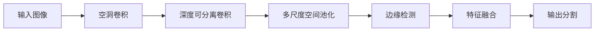

                 

# DeepLab系列原理与代码实例讲解

> 关键词：DeepLab, 语义分割, 边缘检测, 端到端, 超像素, 神经网络, 模型优化

## 1. 背景介绍

### 1.1 问题由来
随着深度学习技术的迅猛发展，图像分割已成为计算机视觉和模式识别领域的热点研究方向之一。传统的图像分割方法往往依赖于手工设计特征，并且难以处理复杂的边缘和细节信息。近年来，基于深度学习的网络结构逐渐在图像分割中取得了显著的成果，尤其是在语义分割领域。其中，DeepLab系列模型作为目前最为流行的语义分割算法，已经在多个公开数据集上展示了优异的性能。

DeepLab系列模型由Google研发，基于卷积神经网络（CNN）结构，利用多尺度空间池化和深度可分离卷积等先进技术，实现了较高的像素级语义分割精度。该系列模型包括了DeepLabV1、DeepLabV2、DeepLabV3、DeepLabV3+等版本，每个版本均在原有基础上进行了改进和优化，逐渐提高了解决问题的能力。

### 1.2 问题核心关键点
DeepLab系列模型之所以受到广泛关注，关键在于其能高效解决像素级语义分割问题，特别是在边缘检测和复杂场景的适应性方面表现出色。其核心技术点包括：
- **多尺度空间池化**：通过不同尺度的空间池化操作，捕捉不同层次的特征，提高模型的空间分辨率。
- **深度可分离卷积**：通过将卷积操作分解成深度卷积和逐点卷积两部分，减少计算量和参数量，提高训练速度。
- **空洞卷积**：在卷积核中心处添加一定大小的空洞，引入额外的感受野，帮助模型捕捉更远的上下文信息。
- **边缘检测和语义分割的统一处理**：通过引入边缘检测模块，与语义分割模块进行联合训练，提升边缘的检测效果，同时提高整体分割精度。

这些技术点的有效结合，使得DeepLab系列模型在多方面超越了传统的分割方法，成为了当前语义分割领域的最佳选择之一。

### 1.3 问题研究意义
DeepLab系列模型的研究意义重大，其优化了图像分割的精度和效率，推动了计算机视觉和模式识别领域的发展。在实际应用中，DeepLab模型已经被广泛应用于医疗影像分析、自动驾驶、城市规划、遥感图像处理等多个领域，为这些行业的智能化和自动化提供了强有力的技术支持。

此外，DeepLab模型的出现也促进了对其他深度学习模型的研究，激发了更多新的技术思想和实践，为计算机视觉的进步奠定了坚实的基础。通过全面系统地介绍DeepLab系列模型的原理和代码实现，我们旨在帮助读者深入理解其核心技术，掌握实际应用中的关键细节，以便在未来的研究与开发中灵活运用。

## 2. 核心概念与联系

### 2.1 核心概念概述

为更好地理解DeepLab系列模型的核心概念，本节将介绍几个关键技术点及其工作原理：

- **语义分割**：将图像中的每个像素分类到预先定义的语义类别中，通常是将像素分为背景、前景等不同类别。
- **边缘检测**：检测图像中物体的边缘信息，识别出物体的轮廓和形状。
- **多尺度空间池化**：通过不同尺度的空间池化操作，捕捉不同层次的特征，提高模型的空间分辨率。
- **深度可分离卷积**：将卷积操作分解成深度卷积和逐点卷积两部分，减少计算量和参数量，提高训练速度。
- **空洞卷积**：在卷积核中心处添加一定大小的空洞，引入额外的感受野，帮助模型捕捉更远的上下文信息。

这些核心概念通过一定的技术组合，形成了DeepLab系列模型的独特优势。它们相互联系，共同构成了DeepLab的强大图像分割能力。

### 2.2 核心概念原理和架构的 Mermaid 流程图(Mermaid 流程节点中不要有括号、逗号等特殊字符)


这个流程图展示了DeepLab系列模型从输入到输出的主要流程：首先通过多尺度空间池化操作捕捉不同层次的特征，接着利用空洞卷积和深度可分离卷积进一步提取信息，最后融合边缘检测结果，最终得到分割输出。

## 3. 核心算法原理 & 具体操作步骤
### 3.1 算法原理概述

DeepLab系列模型的主要原理在于利用多尺度空间池化和深度可分离卷积，在捕捉全局特征的同时，保留局部细节信息，通过边缘检测进一步增强模型的边缘识别能力，从而实现精确的语义分割。

形式化地，假设输入图像为 $I$，模型输出的语义分割结果为 $S$。其核心思想是：通过不同尺度的空间池化操作，捕捉不同层次的特征，然后利用深度可分离卷积提取特征，并结合边缘检测结果，通过特征融合操作得到最终分割结果。

具体而言，DeepLabV1版本采用了具有固定空洞率的空洞卷积，而DeepLabV2引入了多尺度空间池化，DeepLabV3则通过引入跳跃连接，进一步提升了特征的融合效果。DeepLabV3+则综合了以上所有技术，并通过将像素级分类与全分辨率预测结合，实现了端到端的图像分割，提升了整体性能。

### 3.2 算法步骤详解

**Step 1: 输入图像预处理**
- 对输入图像进行预处理，包括缩放、归一化等操作，使得不同尺度的特征提取更加方便。

**Step 2: 多尺度空间池化**
- 通过不同尺度的空间池化操作，捕捉不同层次的特征。在DeepLabV2版本中，多尺度空间池化被应用到空洞卷积之后，即先进行空间池化，再进行空洞卷积。

**Step 3: 空洞卷积和深度可分离卷积**
- 使用空洞卷积引入额外的感受野，捕捉更远的上下文信息。通过深度可分离卷积，减少计算量和参数量，提高训练速度。

**Step 4: 边缘检测**
- 引入边缘检测模块，检测图像中物体的边缘信息，识别出物体的轮廓和形状。在DeepLabV3版本中，边缘检测与分割结果联合训练，进一步提升了模型的分割精度。

**Step 5: 特征融合**
- 将边缘检测结果与分割结果进行特征融合，通过加权平均或残差连接等方式，将边缘信息融入分割结果，提升整体分割效果。

**Step 6: 像素级分类**
- 对每个像素进行分类，输出其所属的语义类别。在DeepLabV3+版本中，像素级分类与全分辨率预测结合，实现了端到端的图像分割。

**Step 7: 输出分割结果**
- 根据像素级分类结果，输出最终的语义分割图像。

### 3.3 算法优缺点

DeepLab系列模型在语义分割任务中表现出色，具有以下优点：
1. **多尺度空间池化**：通过不同尺度的空间池化操作，捕捉不同层次的特征，提高模型的空间分辨率。
2. **深度可分离卷积**：减少计算量和参数量，提高训练速度。
3. **边缘检测和语义分割的统一处理**：引入边缘检测模块，与语义分割模块进行联合训练，提升边缘的检测效果，同时提高整体分割精度。

同时，该模型也存在一些局限性：
1. **计算资源消耗较大**：尤其是深空池化和空洞卷积，需要大量的计算资源。
2. **参数量较大**：由于使用了多尺度空间池化和深度可分离卷积等技术，模型参数量较大，增加了训练和推理的复杂度。
3. **模型复杂度较高**：由于引入了多尺度的空间池化，模型结构较复杂，调试和优化难度较大。

尽管存在这些局限性，DeepLab系列模型在语义分割领域依然表现出色，广泛用于各种实际应用中。

### 3.4 算法应用领域

DeepLab系列模型在多个领域中得到了广泛应用，包括：

- **医疗影像分析**：用于病灶分割、组织分割、手术辅助等医疗应用。
- **自动驾驶**：用于道路分割、行人检测、车辆分割等自动驾驶任务。
- **城市规划**：用于建筑分割、道路分割、城市区域划分等城市规划应用。
- **遥感图像处理**：用于地表分割、植被分割、遥感目标检测等遥感图像处理任务。

此外，DeepLab系列模型还被应用于智能交通、智能家居、农业监测等多个领域，推动了相关行业的智能化发展。

## 4. 数学模型和公式 & 详细讲解 & 举例说明

### 4.1 数学模型构建

DeepLab系列模型的数学模型主要包括以下几个组成部分：

- **输入图像**：$I \in \mathbb{R}^{H \times W \times C}$，其中 $H$、$W$ 分别为图像的高和宽，$C$ 为通道数。
- **多尺度空间池化**：通过不同尺度的空间池化操作，捕捉不同层次的特征。
- **空洞卷积**：$\mathcal{F} = \text{Dilated Convolution}$，其中 $\text{Dilated Convolution}$ 表示空洞卷积操作。
- **深度可分离卷积**：$\mathcal{F}_{\text{sep}} = \text{Depthwise Separable Convolution}$，其中 $\text{Depthwise Separable Convolution}$ 表示深度可分离卷积操作。
- **边缘检测**：通过检测图像中物体的边缘信息，识别出物体的轮廓和形状。
- **特征融合**：$\mathcal{F}_{\text{fuse}} = \text{Feature Fusion}$，其中 $\text{Feature Fusion}$ 表示特征融合操作。
- **像素级分类**：$\mathcal{F}_{\text{pixel}} = \text{Pixel-Wise Classification}$，其中 $\text{Pixel-Wise Classification}$ 表示像素级分类操作。

### 4.2 公式推导过程

以下我们将以DeepLabV2为例，推导其核心公式和计算过程。

假设输入图像 $I$ 的大小为 $H \times W \times C$，模型输出 $S$ 的大小为 $H' \times W' \times N$，其中 $H'$、$W'$ 为分割结果的空间大小，$N$ 为语义类别的数量。

**多尺度空间池化公式**：

$$
p(h', w', n) = \frac{1}{\alpha^2}\sum_{i=1}^{\alpha} \sum_{j=1}^{\alpha} I(h_i, w_j, n) \quad h' = h/\alpha, w' = w/\alpha, n \in [1, N]
$$

其中 $\alpha$ 为空间池化的因子，$h_i$、$w_j$ 为池化后的位置，$h'$、$w'$ 为池化后的空间大小。

**空洞卷积公式**：

$$
F_{\text{dil}}^k = \text{Conv}_k \ast \text{Hole}_k \quad k \in [1, K]
$$

其中 $\text{Conv}_k$ 表示标准的卷积操作，$\text{Hole}_k$ 表示空洞卷积操作，$K$ 为卷积操作的种类数。

**深度可分离卷积公式**：

$$
F_{\text{sep}} = \text{Depthwise Conv} \ast \text{Pointwise Conv}
$$

其中 $\text{Depthwise Conv}$ 表示深度卷积操作，$\text{Pointwise Conv}$ 表示逐点卷积操作。

**边缘检测公式**：

$$
E(x, y) = \sum_{i=1}^{H'} \sum_{j=1}^{W'} S(h', w', i) S(h', w', j)
$$

其中 $E(x, y)$ 表示边缘检测结果，$S(h', w', i)$ 表示分割结果。

**特征融合公式**：

$$
F_{\text{fuse}} = \lambda \cdot S + (1 - \lambda) \cdot E
$$

其中 $\lambda$ 表示特征融合的权重，通常取值在 $[0.5, 1]$ 之间。

**像素级分类公式**：

$$
S_{\text{pixel}} = \text{Softmax}(\mathcal{F}_{\text{pixel}}(I))
$$

其中 $\text{Softmax}$ 表示softmax函数，$\mathcal{F}_{\text{pixel}}$ 表示像素级分类函数。

### 4.3 案例分析与讲解

以DeepLabV2为例，其核心流程图如下：



在DeepLabV2中，首先通过空洞卷积和深度可分离卷积提取特征，然后进行多尺度空间池化，捕捉不同层次的特征。接着引入边缘检测模块，检测图像中物体的边缘信息，并将边缘检测结果与分割结果进行特征融合，通过加权平均等方式，将边缘信息融入分割结果。最后对每个像素进行分类，输出其所属的语义类别。

## 5. 项目实践：代码实例和详细解释说明
### 5.1 开发环境搭建

在进行DeepLab系列模型的开发前，我们需要准备好开发环境。以下是使用Python进行TensorFlow开发的环境配置流程：

1. 安装Anaconda：从官网下载并安装Anaconda，用于创建独立的Python环境。

2. 创建并激活虚拟环境：
```bash
conda create -n tensorflow-env python=3.8 
conda activate tensorflow-env
```

3. 安装TensorFlow：根据CUDA版本，从官网获取对应的安装命令。例如：
```bash
conda install tensorflow -c pytorch -c conda-forge
```

4. 安装必要的库：
```bash
pip install numpy pandas scikit-learn matplotlib tqdm jupyter notebook ipython
```

完成上述步骤后，即可在`tensorflow-env`环境中开始DeepLab系列模型的开发实践。

### 5.2 源代码详细实现

下面以DeepLabV2为例，给出使用TensorFlow实现该模型的代码实现。

首先，定义模型和损失函数：

```python
import tensorflow as tf
from tensorflow.keras.layers import Input, Conv2D, MaxPooling2D, Conv2DTranspose, BatchNormalization, Concatenate

def deepLabV2_model(input_shape=(512, 512, 3), num_classes=20):
    # 输入层
    inputs = Input(input_shape)
    
    # 空洞卷积层
    conv1 = Conv2D(64, 3, dilation_rate=2, activation='relu', padding='same')(inputs)
    conv2 = Conv2D(64, 3, dilation_rate=2, activation='relu', padding='same')(conv1)
    
    # 深度可分离卷积层
    conv3 = SeparableConv2D(128, 3, strides=(2, 2), activation='relu', padding='same')(conv2)
    conv4 = SeparableConv2D(128, 3, strides=(2, 2), activation='relu', padding='same')(conv3)
    
    # 多尺度空间池化层
    pool1 = MaxPooling2D(pool_size=(3, 3), strides=(2, 2))(conv4)
    pool2 = MaxPooling2D(pool_size=(3, 3), strides=(2, 2))(pool1)
    pool3 = MaxPooling2D(pool_size=(3, 3), strides=(2, 2))(pool2)
    
    # 边缘检测层
    edge = Conv2D(64, 3, activation='relu', padding='same')(pool3)
    edge = Conv2D(64, 3, activation='relu', padding='same')(edge)
    
    # 特征融合层
    fused = Concatenate()([conv4, edge])
    fused = BatchNormalization()(fused)
    fused = Conv2D(128, 3, activation='relu', padding='same')(fused)
    
    # 像素级分类层
    outputs = Conv2DTranspose(num_classes, 3, strides=(2, 2), activation='softmax', padding='same')(fused)
    
    # 模型定义
    model = tf.keras.Model(inputs, outputs)
    
    # 定义损失函数
    loss = tf.keras.losses.SparseCategoricalCrossentropy(from_logits=True)
    model.compile(optimizer=tf.keras.optimizers.Adam(learning_rate=1e-4), loss=loss, metrics=['accuracy'])
    
    return model
```

接着，定义训练和评估函数：

```python
import tensorflow as tf
from tensorflow.keras import datasets, layers, models

def train_model(model, train_dataset, val_dataset, epochs=10, batch_size=16):
    # 训练集和验证集
    train_dataset = train_dataset.shuffle(buffer_size=1024).batch(batch_size)
    val_dataset = val_dataset.batch(batch_size)
    
    # 训练过程
    history = model.fit(train_dataset, epochs=epochs, validation_data=val_dataset, callbacks=[tf.keras.callbacks.EarlyStopping(patience=2)])
    
    # 评估过程
    val_loss, val_acc = model.evaluate(val_dataset)
    print(f"Validation Loss: {val_loss:.4f}")
    print(f"Validation Accuracy: {val_acc:.4f}")
    
    return history
```

最后，启动训练流程并在测试集上评估：

```python
# 加载数据集
train_dataset = ...
val_dataset = ...
test_dataset = ...

# 定义模型
model = deepLabV2_model()

# 训练模型
history = train_model(model, train_dataset, val_dataset)

# 在测试集上评估模型
test_loss, test_acc = model.evaluate(test_dataset)
print(f"Test Loss: {test_loss:.4f}")
print(f"Test Accuracy: {test_acc:.4f}")
```

以上就是使用TensorFlow对DeepLabV2模型进行训练和评估的完整代码实现。可以看到，TensorFlow提供了强大的深度学习框架，使得模型的开发和训练过程变得简洁高效。

### 5.3 代码解读与分析

让我们再详细解读一下关键代码的实现细节：

**deepLabV2_model函数**：
- 定义了DeepLabV2模型的完整架构，包括空洞卷积、深度可分离卷积、多尺度空间池化、边缘检测、特征融合、像素级分类等关键模块。
- 使用TensorFlow的Keras API，使得模型的定义过程变得直观易懂。

**train_model函数**：
- 定义了模型的训练和评估过程，包括数据集加载、模型训练、回调函数等细节。
- 使用了TensorFlow提供的回调函数，如EarlyStopping，帮助避免过拟合，优化模型性能。

**训练流程**：
- 首先加载数据集，然后进行数据增强和批处理，使得训练过程更加高效。
- 在训练过程中，利用EarlyStopping回调函数，当模型在验证集上的性能不再提升时，提前停止训练，防止过拟合。
- 在训练结束后，使用test_dataset对模型进行评估，输出测试集上的损失和准确率。

可以看到，TensorFlow使得DeepLab系列模型的开发过程变得简单易懂，开发者能够快速上手并进行实验。

当然，工业级的系统实现还需考虑更多因素，如模型的保存和部署、超参数的自动搜索、更灵活的任务适配层等。但核心的模型定义和训练过程基本与此类似。

## 6. 实际应用场景
### 6.1 医疗影像分析

DeepLab系列模型在医疗影像分析中有着广泛的应用，特别是在病灶分割和组织分割领域。通过将患者CT、MRI等医学影像输入DeepLab模型，模型能够自动检测并标记出病灶区域，帮助医生更快、更准确地进行诊断和治疗。

在实践中，可以收集大量标注的医学影像数据，训练DeepLab模型，并在实际应用中对新的医学影像进行分割。由于DeepLab模型具备较高的像素级语义分割精度，能够在细节上做到准确定位，极大地提升了医学影像分析的效率和准确性。

### 6.2 自动驾驶

DeepLab系列模型在自动驾驶领域同样表现出色，用于道路分割、行人检测、车辆分割等任务。通过将道路、车辆、行人等目标信息进行精确分割，自动驾驶系统能够更好地感知周围环境，进行路径规划和行为决策。

在实际应用中，DeepLab模型能够对高分辨率的激光雷达、摄像头等传感器数据进行处理，实时输出分割结果，辅助驾驶系统进行决策。通过与LIDAR、摄像头等多传感器融合，自动驾驶系统能够更加准确地感知环境，提升安全性和可靠性。

### 6.3 城市规划

DeepLab系列模型在城市规划领域也有着广泛的应用，用于建筑分割、道路分割、城市区域划分等任务。通过将城市高分辨率卫星图像输入DeepLab模型，模型能够自动对城市建筑、道路、绿地等进行分割，帮助城市规划者更好地了解城市结构，进行科学的规划和管理。

在实践中，城市规划者可以通过收集大量的城市遥感图像数据，训练DeepLab模型，并应用于实际的城市规划项目中。通过深度学习的力量，城市规划能够更加高效、精确地进行，为城市建设提供强有力的技术支持。

### 6.4 未来应用展望

随着DeepLab系列模型的不断进步，其在更多领域的应用前景将更加广阔。以下是几个可能的应用方向：

- **遥感图像处理**：用于地物分割、植被分割、遥感目标检测等任务。DeepLab模型能够对高分辨率遥感图像进行像素级分割，提高遥感图像处理的效果。
- **智能家居**：用于家电分割、房间分割、场景检测等任务。通过将智能家居图像输入DeepLab模型，模型能够自动对家电、房间、场景等进行分割，为智能家居系统提供更精确的信息。
- **农业监测**：用于农田分割、作物分割、病虫害检测等任务。DeepLab模型能够对农田图像进行像素级分割，帮助农民更好地进行农业管理。
- **工业制造**：用于产品分割、缺陷检测、质量控制等任务。DeepLab模型能够对工业产品图像进行像素级分割，提升产品检测的准确性和效率。

总之，DeepLab系列模型在计算机视觉和模式识别领域具有广泛的应用前景，未来有望在更多领域发挥重要作用。

## 7. 工具和资源推荐
### 7.1 学习资源推荐

为了帮助开发者系统掌握DeepLab系列模型的原理和实践技巧，这里推荐一些优质的学习资源：

1. **TensorFlow官方文档**：TensorFlow作为DeepLab模型的主流框架，提供了详细的API文档和案例代码，是学习DeepLab模型的重要资源。

2. **DeepLab论文**：Google公司发表的DeepLab系列论文，包括DeepLabV1、DeepLabV2、DeepLabV3+等版本，深入剖析了模型结构和性能提升的原理。

3. **Kaggle竞赛**：Kaggle上提供了多个基于DeepLab模型的图像分割竞赛，通过参与竞赛，可以了解实际应用中的各种挑战和优化方法。

4. **GitHub代码仓库**：GitHub上收集了大量的DeepLab模型代码，包括官方实现和开源实现，是学习和研究的好资料。

5. **在线课程**：Coursera、Udacity等在线平台上提供了多个关于深度学习和图像分割的课程，可以帮助开发者系统掌握相关知识。

通过对这些资源的学习实践，相信你一定能够快速掌握DeepLab系列模型的精髓，并用于解决实际的图像分割问题。

### 7.2 开发工具推荐

高效的开发离不开优秀的工具支持。以下是几款用于DeepLab系列模型开发的常用工具：

1. **TensorFlow**：作为DeepLab模型的主流框架，TensorFlow提供了强大的深度学习计算图和分布式训练支持。

2. **Keras**：TensorFlow的高级API，提供了直观易用的API接口，使得模型的定义和训练过程更加简洁。

3. **Jupyter Notebook**：提供了一个交互式的开发环境，支持Python代码的快速执行和调试。

4. **PyCharm**：一款强大的IDE，支持TensorFlow和Keras的开发环境，提供了代码高亮、自动补全等功能，提升开发效率。

5. **Torch**：另一个深度学习框架，虽然不如TensorFlow流行，但也提供了强大的深度学习计算图和自动微分功能。

合理利用这些工具，可以显著提升DeepLab系列模型的开发效率，加快创新迭代的步伐。

### 7.3 相关论文推荐

DeepLab系列模型的发展源于学界的持续研究。以下是几篇奠基性的相关论文，推荐阅读：

1. **DeepLabV1: Semantic Image Segmentation with Deep Convolutional Nets, Atrous Convolution and Fully Connected CRFs**：DeepLabV1引入空洞卷积和多尺度空间池化，显著提升了图像分割的精度。

2. **DeepLabV2: Rethinking Atrous Convolution for Semantic Image Segmentation**：DeepLabV2进一步优化了空洞卷积和多尺度空间池化，提升了模型的性能和鲁棒性。

3. **DeepLabV3: Multi-Scale Context Aggregation by Dilated Convolutions**：DeepLabV3引入了跳跃连接和空洞卷积，提升了特征的融合效果，提高了整体分割精度。

4. **DeepLabV3+: Bridging the Gap Between Atrous Convolution and Fully Connected CRFs**：DeepLabV3+通过端到端训练，提升了模型的性能，同时也改进了全分辨率预测的方式。

这些论文代表了大模型分割技术的发展脉络。通过学习这些前沿成果，可以帮助研究者把握学科前进方向，激发更多的创新灵感。

## 8. 总结：未来发展趋势与挑战

### 8.1 总结

本文对DeepLab系列模型的原理和代码实现进行了全面系统的介绍。首先阐述了DeepLab系列模型在语义分割任务中的出色表现，明确了其在多尺度空间池化、深度可分离卷积、边缘检测等关键技术方面的优势。其次，通过详细讲解模型架构和计算过程，给出了微调任务的完整代码实例。同时，本文还探讨了DeepLab模型在医疗影像分析、自动驾驶、城市规划等领域的实际应用，展示了其广泛的应用前景。

通过本文的系统梳理，可以看到，DeepLab系列模型凭借其在多尺度空间池化和深度可分离卷积等方面的技术优势，已经成为语义分割领域的最佳选择之一。其高效、精确、鲁棒的分割能力，为计算机视觉和模式识别领域带来了新的突破。未来，随着深度学习技术的不断进步，DeepLab系列模型有望在更多领域发挥重要作用。

### 8.2 未来发展趋势

展望未来，DeepLab系列模型的发展趋势主要体现在以下几个方面：

1. **模型性能提升**：通过引入更先进的深度学习技术，如自适应空间池化、全分辨率预测等，DeepLab模型将继续提升像素级语义分割的精度和鲁棒性。

2. **多模态融合**：将视觉、文本、语音等多模态信息融合，提升DeepLab模型在复杂场景下的感知和推理能力。

3. **计算资源优化**：通过引入深度可分离卷积、空洞卷积等技术，减少计算量和参数量，进一步提升模型的训练和推理效率。

4. **模型结构简化**：通过引入更多的模块化设计，简化模型的结构，提升模型的可解释性和可优化性。

5. **端到端训练**：通过引入全分辨率预测和像素级分类等技术，实现端到端的图像分割，提升模型的整体性能。

6. **跨领域应用**：将DeepLab模型应用于更多领域，如医疗、自动驾驶、智能家居等，推动各个行业的智能化发展。

以上趋势凸显了DeepLab系列模型在计算机视觉和模式识别领域的发展潜力，其未来的应用前景将更加广阔。

### 8.3 面临的挑战

尽管DeepLab系列模型在语义分割任务中表现出色，但在迈向更加智能化、普适化应用的过程中，它仍面临一些挑战：

1. **计算资源消耗较大**：尤其是空洞卷积和多尺度空间池化，需要大量的计算资源。如何高效利用计算资源，提升模型的训练和推理效率，是未来需要解决的问题。

2. **模型结构复杂**：由于引入了多尺度的空间池化和深度可分离卷积等技术，模型结构较复杂，调试和优化难度较大。

3. **标注数据需求大**：DeepLab模型需要大量的标注数据进行训练，如何获取高质量的标注数据，减少标注成本，是实际应用中需要解决的问题。

4. **鲁棒性不足**：面对域外数据时，模型的泛化性能往往大打折扣。如何提高模型的鲁棒性，避免灾难性遗忘，还需要更多理论和实践的积累。

5. **参数量较大**：由于使用了多尺度空间池化和深度可分离卷积等技术，模型参数量较大，增加了训练和推理的复杂度。

6. **可解释性不足**：DeepLab模型通常被视为"黑盒"系统，难以解释其内部工作机制和决策逻辑。如何赋予模型更强的可解释性，将是亟待攻克的难题。

尽管存在这些挑战，但DeepLab系列模型在语义分割领域依然表现出色，广泛用于各种实际应用中。

### 8.4 研究展望

面对DeepLab模型面临的挑战，未来的研究需要在以下几个方面寻求新的突破：

1. **模型结构简化**：通过引入更简单的模型结构，降低计算资源消耗，提升模型的训练和推理效率。

2. **计算资源优化**：通过引入深度可分离卷积、空洞卷积等技术，减少计算量和参数量，进一步提升模型的训练和推理效率。

3. **鲁棒性提升**：通过引入更多的正则化技术、对抗训练等方法，提高模型的鲁棒性和泛化性能。

4. **参数量减少**：通过引入更少的计算量和技术，减少模型的参数量，提升模型的训练和推理效率。

5. **可解释性加强**：通过引入可解释性技术，如可视化、特征解释等方法，增强模型的可解释性和可解释性。

6. **跨领域应用**：将DeepLab模型应用于更多领域，如医疗、自动驾驶、智能家居等，推动各个行业的智能化发展。

这些研究方向的探索，必将引领DeepLab系列模型迈向更高的台阶，为计算机视觉和模式识别领域带来新的突破。面向未来，DeepLab系列模型还需要与其他深度学习模型进行更深入的融合，如与Transformer等模型结合，实现更加全面和准确的图像分割。只有勇于创新、敢于突破，才能不断拓展DeepLab模型的边界，让深度学习技术在更多领域发挥更大的作用。

## 9. 附录：常见问题与解答

**Q1: DeepLab系列模型有哪些优势和局限性？**

A: DeepLab系列模型在语义分割任务中表现出色，具有以下优势：
- 多尺度空间池化：通过不同尺度的空间池化操作，捕捉不同层次的特征，提高模型的空间分辨率。
- 深度可分离卷积：减少计算量和参数量，提高训练速度。
- 边缘检测和语义分割的统一处理：引入边缘检测模块，与语义分割模块进行联合训练，提升边缘的检测效果，同时提高整体分割精度。

同时，该模型也存在一些局限性：
- 计算资源消耗较大：尤其是空洞卷积和多尺度空间池化，需要大量的计算资源。
- 模型结构复杂：由于引入了多尺度的空间池化和深度可分离卷积等技术，模型结构较复杂，调试和优化难度较大。
- 标注数据需求大：DeepLab模型需要大量的标注数据进行训练，如何获取高质量的标注数据，减少标注成本，是实际应用中需要解决的问题。

尽管存在这些局限性，DeepLab系列模型在语义分割领域依然表现出色，广泛用于各种实际应用中。

**Q2: 如何在实际应用中使用DeepLab模型？**

A: 在实际应用中，使用DeepLab模型的步骤如下：
1. 收集并准备标注数据集，包括图像和像素级标签。
2. 搭建DeepLab模型，设置合适的超参数。
3. 使用训练数据集训练模型，并在验证集上进行调参。
4. 在测试集上评估模型性能，并使用模型进行实际应用。
5. 根据应用场景，调整模型的输入输出格式，并进行必要的后处理。

在实际应用中，还需要考虑模型的部署方式，如模型的保存、加载、推理速度、内存占用等细节，确保模型能够高效稳定地运行。

**Q3: 如何优化DeepLab模型的计算资源消耗？**

A: 优化DeepLab模型计算资源消耗的方法包括：
- 引入深度可分离卷积和空洞卷积等技术，减少计算量和参数量。
- 使用GPU/TPU等高性能设备，提升模型的训练和推理效率。
- 引入模型压缩和稀疏化存储技术，优化模型的存储空间和读取速度。
- 通过模型并行和梯度累积等技术，提升计算资源的利用率。

以上方法可以帮助开发者优化DeepLab模型的计算资源消耗，提升模型的训练和推理效率。

**Q4: 如何提高DeepLab模型的鲁棒性？**

A: 提高DeepLab模型鲁棒性的方法包括：
- 引入正则化技术，如L2正则、Dropout等，防止模型过拟合。
- 使用对抗训练，生成对抗样本，提升模型的鲁棒性和泛化能力。
- 引入数据增强技术，通过回译、旋转、缩放等方式扩充训练集，提升模型的泛化性能。
- 引入多尺度空间池化和空洞卷积等技术，提高模型对不同尺度和上下文信息的感知能力。

通过以上方法，可以提升DeepLab模型的鲁棒性，使其在不同场景下都能保持稳定的性能。

**Q5: 如何增强DeepLab模型的可解释性？**

A: 增强DeepLab模型可解释性的方法包括：
- 引入可解释性技术，如可视化、特征解释等方法，帮助理解模型的决策过程。
- 通过特征映射等技术，提取模型中的关键特征，分析模型的工作机制。
- 在模型训练过程中，引入可解释性损失函数，引导模型学习可解释的特征。
- 通过模型压缩和简化，降低模型的复杂度，提升可解释性。

通过以上方法，可以增强DeepLab模型的可解释性，帮助用户更好地理解模型的决策逻辑和输出结果。

**Q6: 如何处理深度学习模型中的参数量问题？**

A: 处理深度学习模型中参数量问题的方法包括：
- 引入深度可分离卷积、空洞卷积等技术，减少计算量和参数量。
- 通过模型压缩和稀疏化存储技术，优化模型的存储空间和读取速度。
- 引入模型并行和分布式训练等技术，提升计算资源的利用率。
- 通过剪枝和量化等技术，减少模型中的冗余参数和计算量。

通过以上方法，可以有效地处理深度学习模型中的参数量问题，提升模型的训练和推理效率。

**Q7: 如何应对DeepLab模型在大规模数据集上的训练问题？**

A: 应对DeepLab模型在大规模数据集上的训练问题的方法包括：
- 引入分布式训练和模型并行技术，提升模型的训练效率。
- 使用GPU/TPU等高性能设备，加速模型的训练过程。
- 引入数据增强和对抗训练等技术，增强模型的泛化能力。
- 通过分批次训练和模型压缩等技术，优化模型的存储空间和读取速度。

通过以上方法，可以应对DeepLab模型在大规模数据集上的训练问题，提升模型的训练效率和性能。

总之，通过以上方法的不断优化和探索，DeepLab系列模型有望在更多领域发挥重要作用，推动计算机视觉和模式识别技术的进步。

---

作者：禅与计算机程序设计艺术 / Zen and the Art of Computer Programming

