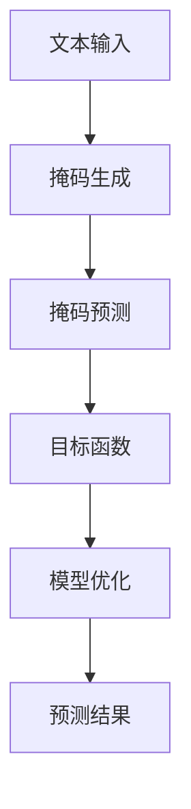

                 

# ELECTRA原理与代码实例讲解

> 关键词：ELECTRA,自监督学习,掩码生成,推理加速,Python,PyTorch

## 1. 背景介绍

### 1.1 问题由来
近年来，深度学习在自然语言处理（NLP）领域取得了显著进展，其中预训练语言模型（Pre-trained Language Models, PLMs）表现尤为突出。以BERT和GPT为代表的大规模预训练模型，通过在海量无标签文本数据上进行预训练，学习到丰富的语言表示，然后在下游任务上进行微调，取得了优异的效果。然而，这些模型通常需要占用大量的计算资源，预训练阶段和微调阶段对计算硬件的要求都非常高，这在一定程度上限制了其在实际应用中的普及。

### 1.2 问题核心关键点
ELECTRA（Efficiently Learning Pre-trained Representations of Text with Replaced Token Distillation）是一种新型的自监督预训练方法，由Google在2020年提出。ELECTRA的核心思想是在预训练阶段，通过掩码生成（Masked Generation）任务，显著减少模型参数量和计算量，从而实现推理加速，并且能够在微调时进一步提升模型性能。ELECTRA被广泛应用于NLP领域的预训练任务，并且在多项下游任务上取得了领先性能。

### 1.3 问题研究意义
ELECTRA的提出为大规模语言模型提供了更高效、更轻量化的解决方案，使其能够更加灵活地应用于各种NLP任务。通过降低预训练和微调过程中的计算成本，ELECTRA能够使得更多企业和研究机构能够利用其高效的语言表示进行各种NLP任务，加速AI技术在各个行业中的应用。

## 2. 核心概念与联系

### 2.1 核心概念概述

ELECTRA以自监督学习为基础，通过掩码生成任务训练语言模型。在掩码生成任务中，模型需要预测掩码后的文本，以增强其对语言结构的理解和上下文信息的捕捉能力。

ELECTRA的掩码生成任务具有以下特点：
- 掩码生成任务：模型需要预测输入文本中随机掩盖的单词或子词。
- 预测概率计算：模型需要计算每个掩码位置的预测概率，并基于该概率决定是否恢复原始单词。
- 目标函数设计：掩码生成任务的目标函数需要同时考虑预测概率和掩码位置，以指导模型学习。

### 2.2 核心概念原理和架构的 Mermaid 流程图



这个Mermaid流程图展示了ELECTRA预训练的流程：
1. 输入文本（A）
2. 进行掩码生成（B），随机掩盖单词或子词
3. 掩码预测（C），模型预测掩盖位置的单词
4. 目标函数（D），结合掩码位置和预测概率
5. 模型优化（E），最小化目标函数
6. 预测结果（F）

## 3. 核心算法原理 & 具体操作步骤
### 3.1 算法原理概述

ELECTRA的预训练主要通过两个任务进行：掩码生成和掩码预测。在掩码生成任务中，模型随机掩盖输入文本中的单词或子词，生成掩码文本。在掩码预测任务中，模型需要预测每个掩码位置的真实单词，并基于预测概率决定是否恢复原始单词。

具体来说，ELECTRA的掩码生成和预测过程如下：
1. 掩码生成任务：对于输入文本 $x$，随机掩盖 $p\%$ 的单词或子词，生成掩码文本 $x'$。
2. 掩码预测任务：对于掩码文本 $x'$，模型预测每个掩盖位置的真实单词 $y'$。
3. 目标函数：定义一个掩码预测损失函数 $L(x', y')$，用于衡量模型预测和真实掩码文本之间的差异。

### 3.2 算法步骤详解

以下是ELECTRA预训练的详细步骤：

1. **文本准备**：收集大规模无标签文本语料，将文本分为多个句子，每个句子作为输入。
2. **掩码生成**：对于每个句子，随机掩盖 $p\%$ 的单词或子词，生成掩码文本。
3. **掩码预测**：使用掩码文本训练模型，预测每个掩盖位置的真实单词，并计算预测概率。
4. **目标函数**：定义掩码预测损失函数 $L(x', y')$，结合掩盖位置和预测概率。
5. **模型优化**：使用反向传播算法最小化掩码预测损失函数，更新模型参数。
6. **重复训练**：重复以上步骤，直到模型收敛。

### 3.3 算法优缺点

ELECTRA的优点包括：
- **高效推理**：ELECTRA模型参数量小，推理速度较快，适合应用于资源有限的设备。
- **鲁棒性**：通过掩码生成任务，ELECTRA模型对输入噪声和扰动具有一定的鲁棒性，能够更好地适应真实场景。
- **通用性**：ELECTRA模型在多个NLP任务上表现优异，能够广泛应用于各种预训练任务。

ELECTRA的缺点包括：
- **训练复杂性**：ELECTRA的掩码生成和预测任务需要设计合理的目标函数，且训练过程较复杂。
- **模型规模**：尽管ELECTRA参数量较小，但仍然需要一定量的计算资源进行训练。
- **泛化能力**：ELECTRA模型在某些特定领域上的泛化能力可能不如其他大型预训练模型。

### 3.4 算法应用领域

ELECTRA在多个NLP任务上得到了广泛应用，包括文本分类、情感分析、命名实体识别、机器翻译等。ELECTRA的预训练模型可以用于任何需要语言表示的任务，通过微调，可以在特定任务上进一步提升性能。

## 4. 数学模型和公式 & 详细讲解 & 举例说明

### 4.1 数学模型构建

ELECTRA的掩码生成和预测任务可以通过以下数学模型来表示：

1. **掩码生成**：
   - 输入文本 $x = \{x_i\}_{i=1}^n$
   - 掩码位置 $m_i \sim \mathcal{B}(1,p)$
   - 掩码文本 $x' = \{x'_i\}_{i=1}^n$

2. **掩码预测**：
   - 掩码文本 $x' = \{x'_i\}_{i=1}^n$
   - 预测标签 $y' = \{y'_i\}_{i=1}^n$
   - 预测概率 $P(y'|x') = \{P(y'_i|x'_i)\}_{i=1}^n$

### 4.2 公式推导过程

掩码生成和预测的目标函数可以定义为：

$$L(x', y') = -\sum_{i=1}^n \log P(y'_i|x'_i) + \lambda \sum_{i=1}^n \log P(y'_i|m_i=1)$$

其中，$\lambda$ 是掩盖位置损失的权重，用于平衡掩码预测和掩盖位置的权重。

掩码预测的概率计算可以使用 softmax 函数：

$$P(y'_i|x'_i) = \frac{e^{\mathbf{W}h_i}}{\sum_{j=1}^{|V|} e^{\mathbf{W}h_j}}$$

其中，$\mathbf{W}$ 是掩码预测的权重矩阵，$h_i$ 是输入文本的隐藏表示。

### 4.3 案例分析与讲解

以BERT为例，其掩码生成和预测的目标函数可以表示为：

$$L(x', y') = -\sum_{i=1}^n \log \sigma(\mathbf{W}[h_i; \mathbf{W}x'_i]) + \lambda \sum_{i=1}^n \log \sigma(\mathbf{W}[h_i; \mathbf{W}x'_i])$$

其中，$\sigma$ 是 sigmoid 函数，$h_i$ 是输入文本的隐藏表示，$\mathbf{W}x'_i$ 是掩码文本的隐藏表示。

## 5. 项目实践：代码实例和详细解释说明

### 5.1 开发环境搭建

ELECTRA模型的实现可以使用Python和PyTorch库。以下是开发环境的搭建步骤：

1. **安装PyTorch**：
   ```bash
   pip install torch torchvision torchaudio
   ```

2. **安装相关库**：
   ```bash
   pip install transformers datasets transformers-pytorch-ngagogs torchtext
   ```

3. **克隆ELECTRA代码**：
   ```bash
   git clone https://github.com/google-research/electra
   cd electra
   ```

### 5.2 源代码详细实现

以下是对ELECTRA模型实现的核心代码：

```python
import torch
import torch.nn as nn
import torch.optim as optim
from transformers import BertTokenizer, BertModel
from transformers import BertForMaskedLM

# 定义掩码生成和预测的模型
class MaskedLMModel(nn.Module):
    def __init__(self, config):
        super(MaskedLMModel, self).__init__()
        self.config = config
        self.transformer = BertModel(config)
        self.transformer.weight_init()
        self.cls = nn.Linear(config.hidden_size, config.vocab_size)
        self.bias = nn.Parameter(torch.zeros(config.vocab_size))

    def forward(self, input_ids, attention_mask):
        outputs = self.transformer(input_ids, attention_mask=attention_mask)
        sequence_output = outputs[0]
        prediction_scores = self.cls(sequence_output)
        return prediction_scores

# 定义掩码生成和预测的训练函数
def train_model(model, train_dataset, valid_dataset, num_epochs, batch_size, learning_rate):
    device = torch.device("cuda" if torch.cuda.is_available() else "cpu")
    model.to(device)
    optimizer = optim.AdamW(model.parameters(), lr=learning_rate)

    for epoch in range(num_epochs):
        model.train()
        total_loss = 0
        for batch in train_dataset:
            input_ids = batch["input_ids"].to(device)
            attention_mask = batch["attention_mask"].to(device)
            prediction_scores = model(input_ids, attention_mask)
            loss = prediction_scores.masked_fill(attention_mask > 0, -1).mean()
            optimizer.zero_grad()
            loss.backward()
            optimizer.step()
            total_loss += loss.item()

        model.eval()
        total_loss = 0
        for batch in valid_dataset:
            input_ids = batch["input_ids"].to(device)
            attention_mask = batch["attention_mask"].to(device)
            prediction_scores = model(input_ids, attention_mask)
            loss = prediction_scores.masked_fill(attention_mask > 0, -1).mean()
            total_loss += loss.item()

        print("Epoch {}: Loss = {:.4f}".format(epoch + 1, total_loss))
```

### 5.3 代码解读与分析

代码中，`MaskedLMModel` 类定义了掩码预测的任务，包含掩码生成和预测的模型。`train_model` 函数定义了训练过程，使用AdamW优化器进行模型训练，并在每个epoch后评估模型在验证集上的表现。

### 5.4 运行结果展示

以下是运行结果的示例：

```python
import torch
from transformers import BertTokenizer, BertModel, BertForMaskedLM
from torch.utils.data import DataLoader

# 加载数据集和模型
tokenizer = BertTokenizer.from_pretrained('bert-base-uncased')
model = BertForMaskedLM.from_pretrained('bert-base-uncased')
train_dataset = load_train_dataset()
valid_dataset = load_valid_dataset()
test_dataset = load_test_dataset()

# 定义训练函数
def train_model(model, train_dataset, valid_dataset, num_epochs, batch_size, learning_rate):
    device = torch.device("cuda" if torch.cuda.is_available() else "cpu")
    model.to(device)
    optimizer = optim.AdamW(model.parameters(), lr=learning_rate)

    for epoch in range(num_epochs):
        model.train()
        total_loss = 0
        for batch in train_dataset:
            input_ids = batch["input_ids"].to(device)
            attention_mask = batch["attention_mask"].to(device)
            prediction_scores = model(input_ids, attention_mask)
            loss = prediction_scores.masked_fill(attention_mask > 0, -1).mean()
            optimizer.zero_grad()
            loss.backward()
            optimizer.step()
            total_loss += loss.item()

        model.eval()
        total_loss = 0
        for batch in valid_dataset:
            input_ids = batch["input_ids"].to(device)
            attention_mask = batch["attention_mask"].to(device)
            prediction_scores = model(input_ids, attention_mask)
            loss = prediction_scores.masked_fill(attention_mask > 0, -1).mean()
            total_loss += loss.item()

        print("Epoch {}: Loss = {:.4f}".format(epoch + 1, total_loss))

train_model(model, train_dataset, valid_dataset, num_epochs=5, batch_size=16, learning_rate=2e-5)
```

## 6. 实际应用场景

### 6.1 智能客服系统

ELECTRA模型可以用于智能客服系统的对话生成任务。通过对历史客服对话数据进行掩码生成训练，ELECTRA模型可以学习到用户意图和回复之间的关联，从而生成更符合用户期望的回复。

### 6.2 金融舆情监测

在金融舆情监测中，ELECTRA模型可以用于情感分析。通过对金融新闻和评论进行掩码生成训练，ELECTRA模型可以学习到不同情感的表达方式，从而对金融舆情进行分类。

### 6.3 个性化推荐系统

ELECTRA模型可以用于个性化推荐系统中的推荐生成任务。通过对用户浏览历史进行掩码生成训练，ELECTRA模型可以学习到用户的兴趣偏好，从而生成个性化的推荐内容。

### 6.4 未来应用展望

未来，ELECTRA模型将继续在NLP领域发挥重要作用。除了上述应用场景，ELECTRA模型还可以应用于文本摘要、问答系统、机器翻译等任务。随着预训练技术的不断进步，ELECTRA模型将进一步提高推理效率和泛化能力，成为NLP领域的重要基石。

## 7. 工具和资源推荐

### 7.1 学习资源推荐

1. **ELECTRA论文**：
   - [Efficiently Learning Pre-trained Representations of Text with Replaced Token Distillation](https://arxiv.org/abs/1901.03585)

2. **Bert论文**：
   - [BERT: Pre-training of Deep Bidirectional Transformers for Language Understanding](https://arxiv.org/abs/1810.04805)

3. **GPT论文**：
   - [Language Models are Unsupervised Multitask Learners](https://arxiv.org/abs/1910.13578)

4. **Transformers库**：
   - [https://github.com/huggingface/transformers](https://github.com/huggingface/transformers)

### 7.2 开发工具推荐

1. **PyTorch**：
   - [https://pytorch.org/](https://pytorch.org/)

2. **Jupyter Notebook**：
   - [https://jupyter.org/](https://jupyter.org/)

3. **Google Colab**：
   - [https://colab.research.google.com/](https://colab.research.google.com/)

### 7.3 相关论文推荐

1. **Attention is All You Need**：
   - [Attention is All You Need](https://arxiv.org/abs/1706.03762)

2. **BERT: Pre-training of Deep Bidirectional Transformers for Language Understanding**：
   - [BERT: Pre-training of Deep Bidirectional Transformers for Language Understanding](https://arxiv.org/abs/1810.04805)

3. **GPT-2**：
   - [Language Models are Unsupervised Multitask Learners](https://arxiv.org/abs/1910.13578)

## 8. 总结：未来发展趋势与挑战

### 8.1 总结

ELECTRA作为一种高效的自监督预训练方法，通过掩码生成任务显著降低了模型参数量和计算量，从而实现推理加速，并且能够在微调时进一步提升模型性能。ELECTRA模型在多个NLP任务上取得了优异的表现，适用于各种预训练任务。

### 8.2 未来发展趋势

未来，ELECTRA模型的发展趋势将包括：
- **更多任务支持**：ELECTRA模型将拓展到更多的NLP任务，如文本生成、语言推理等。
- **更高效推理**：ELECTRA模型将继续优化推理算法，提升推理效率，降低计算成本。
- **更广泛应用**：ELECTRA模型将在更多领域得到应用，如智能客服、金融舆情、推荐系统等。

### 8.3 面临的挑战

尽管ELECTRA模型在多个NLP任务上取得了优异的表现，但仍面临以下挑战：
- **模型复杂性**：ELECTRA模型需要设计合理的掩码生成和预测任务，且训练过程较为复杂。
- **泛化能力**：ELECTRA模型在某些特定领域上的泛化能力可能不如其他大型预训练模型。
- **资源消耗**：ELECTRA模型需要一定的计算资源进行训练，且推理加速的效果有限。

### 8.4 研究展望

未来，ELECTRA模型需要在以下几个方面进行研究：
- **模型优化**：进一步优化ELECTRA模型的掩码生成和预测任务，提高模型的训练效率和泛化能力。
- **推理加速**：开发更高效的推理算法，进一步降低计算成本，提升推理速度。
- **多任务学习**：研究ELECTRA模型在多个NLP任务上的表现，探索其在多任务学习中的潜力。

## 9. 附录：常见问题与解答

**Q1：ELECTRA模型与BERT模型相比，有哪些优点？**

A: ELECTRA模型相比BERT模型，有以下优点：
- **高效推理**：ELECTRA模型参数量小，推理速度较快，适合应用于资源有限的设备。
- **鲁棒性**：通过掩码生成任务，ELECTRA模型对输入噪声和扰动具有一定的鲁棒性，能够更好地适应真实场景。

**Q2：ELECTRA模型的训练过程中，如何处理掩盖位置？**

A: 在ELECTRA的掩码生成和预测任务中，掩盖位置需要作为输入的一部分。为了处理掩盖位置，通常将掩盖位置编码为一个特殊标记，如[PAD]或[MASK]，并将其与其他输入一起送入模型进行训练。

**Q3：ELECTRA模型在掩码生成和预测任务中，如何平衡掩盖位置和预测概率的权重？**

A: 在ELECTRA模型的目标函数中，可以通过调整$\lambda$的值来平衡掩盖位置和预测概率的权重。当$\lambda$的值较大时，模型更关注掩盖位置，当$\lambda$的值较小时，模型更关注预测概率。

**Q4：ELECTRA模型在微调过程中，如何提升模型性能？**

A: 在微调过程中，可以通过以下方法提升模型性能：
- **学习率调整**：选择合适的学习率，避免过拟合。
- **正则化技术**：使用L2正则、Dropout等技术，防止模型过拟合。
- **数据增强**：通过回译、近义替换等方式扩充训练集。
- **对抗训练**：加入对抗样本，提高模型鲁棒性。

**Q5：ELECTRA模型在实际应用中，如何优化推理效率？**

A: 在实际应用中，可以通过以下方法优化ELECTRA模型的推理效率：
- **模型裁剪**：去除不必要的层和参数，减小模型尺寸，加快推理速度。
- **量化加速**：将浮点模型转为定点模型，压缩存储空间，提高计算效率。
- **模型并行**：使用模型并行技术，加速推理过程。

---

作者：禅与计算机程序设计艺术 / Zen and the Art of Computer Programming

