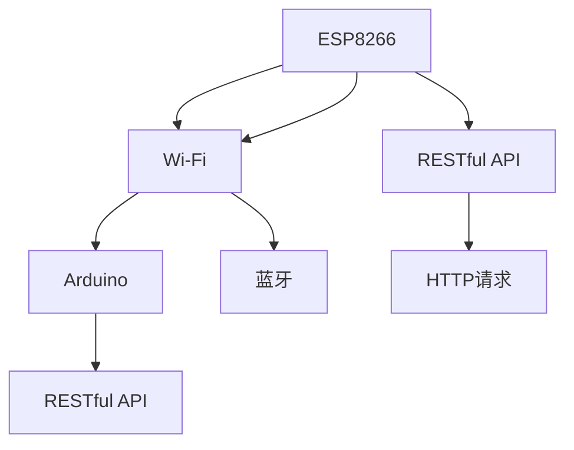

                 

# ESP8266物联网应用开发

> 关键词：物联网, ESP8266, Wi-Fi, 开发板, Arduino, 应用开发, 通信协议, RESTful API, HTTP请求

## 1. 背景介绍

在当前数字化浪潮的推动下，物联网(IoT)技术正迅速普及，成为连接虚拟世界与现实世界的桥梁。作为硬件与软件结合的代表，IoT设备在智能家居、智能城市、工业监控等多个领域发挥了重要作用。而随着物联网设备功能的不断增强和连接场景的不断拓展，开发高效、稳定、可靠的IoT设备软件已成为迫切需求。本文将以ESP8266为硬件基础，介绍其基本工作原理及在物联网应用开发中的常见应用场景，为IoT设备的开发与集成提供参考。

## 2. 核心概念与联系

### 2.1 核心概念概述

本节将详细阐述与ESP8266物联网应用开发密切相关的核心概念，包括其基本特性、工作原理、与Arduino框架的集成，以及常见通信协议。

- **ESP8266**：由Espressif Systems开发的低成本Wi-Fi芯片，集成了Wi-Fi和蓝牙模块，可用于智能家居、工业监控、网络通信等多个领域。
- **Wi-Fi**：一种无线通信协议，提供设备间的点对点通信，常用于Wi-Fi网络构建和数据传输。
- **蓝牙**：一种短距离无线通信技术，用于设备间的数据传输，支持点对点和广播通信。
- **Arduino**：一款开源的电子原型平台，支持多种编程语言和开发环境，方便硬件与软件一体化开发。
- **RESTful API**：一种基于HTTP的API设计风格，用于定义和实现Web服务接口。
- **HTTP请求**：一种在Web网络中用于传输数据的协议，支持GET、POST、PUT等多种请求方法。

这些概念之间的联系可以通过以下Mermaid流程图进行展示：



该流程图展示了ESP8266芯片的硬件特性、与Arduino框架的集成，以及其在RESTful API和HTTP请求中的应用。

## 3. 核心算法原理 & 具体操作步骤

### 3.1 算法原理概述

ESP8266芯片支持Wi-Fi和蓝牙模块，提供了丰富的编程接口和通信协议。本节将详细介绍其基本工作原理，以及如何在物联网应用开发中实现数据传输与处理。

#### 3.1.1 ESP8266芯片工作原理

ESP8266芯片通过Wi-Fi和蓝牙模块进行数据通信，其工作原理可概述为：

1. **Wi-Fi模块连接**：
   - ESP8266芯片通过内置的Wi-Fi模块连接到Wi-Fi网络。
   - 默认情况下，ESP8266芯片的Wi-Fi模块使用标准SSID和预共享密钥进行网络认证。

2. **蓝牙模块连接**：
   - ESP8266芯片通过内置的蓝牙模块进行短距离通信。
   - 蓝牙模块支持多种通信协议，包括标准蓝牙、BLE（低功耗蓝牙）等。

3. **数据传输与处理**：
   - ESP8266芯片通过Wi-Fi和蓝牙模块接收和发送数据。
   - 接收到的数据经处理后，可用于控制其他设备、传输数据等。

#### 3.1.2 RESTful API和HTTP请求

RESTful API是一种基于HTTP的API设计风格，通过HTTP请求实现数据的交互。在IoT应用开发中，RESTful API常用于服务器与客户端之间的数据传输。

**HTTP请求类型**：
- **GET请求**：用于获取数据，常用于查询设备状态、获取传感器数据等。
- **POST请求**：用于提交数据，常用于更新设备参数、发送控制命令等。
- **PUT请求**：用于更新数据，常用于设备状态设置、参数调整等。
- **DELETE请求**：用于删除数据，常用于设备复位、数据清除等。

**RESTful API流程**：
1. 客户端发送HTTP请求至服务器端。
2. 服务器端接收到请求后，解析请求参数。
3. 根据请求参数，服务器端执行相应操作。
4. 服务器端返回响应数据，包含操作结果或相关数据。
5. 客户端接收到响应数据，进行处理后显示给用户。

### 3.2 算法步骤详解

以下是ESP8266物联网应用开发的具体操作步骤：

**Step 1: 准备开发环境**

1. **安装ESP8266开发工具**：
   - 安装Arduino IDE。
   - 安装ESP8266扩展板库。
   - 安装Wi-Fi模块驱动。

2. **准备开发板**：
   - 将ESP8266模块插入开发板。
   - 连接电源、通信线等。

**Step 2: 配置Wi-Fi和蓝牙模块**

1. **连接Wi-Fi网络**：
   - 通过AT指令配置Wi-Fi模块的SSID、预共享密钥。
   - 使用Wi-Fi模块连接到指定网络。

2. **配置蓝牙设备**：
   - 通过AT指令配置蓝牙模块的广播地址、连接参数。
   - 使用蓝牙模块进行设备间的通信。

**Step 3: 编写程序代码**

1. **编写数据接收代码**：
   - 编写代码监听Wi-Fi和蓝牙模块的数据接收。
   - 解析接收到的数据，提取有用信息。

2. **编写数据发送代码**：
   - 编写代码构建HTTP请求，发送数据至服务器端。
   - 解析服务器端响应，提取操作结果。

**Step 4: 测试与调试**

1. **测试数据接收**：
   - 在Wi-Fi和蓝牙模块接收数据，检查数据是否正确。

2. **测试数据发送**：
   - 发送HTTP请求至服务器端，检查服务器端是否正确接收数据。

3. **调试代码错误**：
   - 使用Arduino IDE的调试工具，检查代码中的错误。

**Step 5: 部署与优化**

1. **部署开发板**：
   - 将开发板接入网络，进行实际数据传输与处理。
   - 在服务器端进行数据接收和处理。

2. **优化性能**：
   - 优化代码效率，减少资源消耗。
   - 优化通信协议，提高传输效率。

### 3.3 算法优缺点

ESP8266物联网应用开发具有以下优点：
1. **低成本**：ESP8266芯片和开发板的成本低廉，适合大规模生产。
2. **高兼容性**：支持Wi-Fi和蓝牙模块，适合多种通信场景。
3. **易于开发**：与Arduino框架兼容，开发环境成熟，上手快。

同时，该方法也存在以下缺点：
1. **资源限制**：由于硬件资源有限，不支持复杂的数据处理和存储。
2. **通信稳定性**：Wi-Fi和蓝牙模块的通信稳定性受环境影响较大。
3. **安全性问题**：数据传输过程中可能存在安全漏洞，需注意防护措施。

### 3.4 算法应用领域

ESP8266芯片广泛应用于物联网应用开发中，常见的应用场景包括：

1. **智能家居**：
   - 控制家电设备，如智能灯泡、智能插座等。
   - 监控家庭环境，如温湿度传感器、烟雾传感器等。

2. **工业监控**：
   - 监测设备状态，如温度、压力、流量等。
   - 控制设备运行，如阀门开关、电机启动等。

3. **网络通信**：
   - 构建Wi-Fi网络，进行设备间的通信。
   - 连接互联网，实现远程监控和管理。

4. **医疗健康**：
   - 监测生理指标，如心率、血压等。
   - 控制医疗设备，如智能药盒、智能轮椅等。

以上场景展示了ESP8266芯片在物联网应用开发中的广泛应用，其在降低成本、提高效率方面的优势使其成为开发者的首选。

## 4. 数学模型和公式 & 详细讲解

### 4.1 数学模型构建

在ESP8266物联网应用开发中，数据传输与处理涉及多个通信协议和算法，如Wi-Fi通信协议、蓝牙通信协议、HTTP请求等。本文将重点介绍Wi-Fi通信协议和HTTP请求的数学模型。

**Wi-Fi通信协议**：
Wi-Fi通信协议基于802.11标准，通过信道调制、扩频等技术实现数据传输。其数学模型可表示为：

$$
y = h \cdot x + n
$$

其中：
- $y$ 表示接收到的数据。
- $x$ 表示发送的数据。
- $h$ 表示信道衰减系数。
- $n$ 表示噪声。

**HTTP请求**：
HTTP请求是一种基于标准协议的数据传输方式，其数学模型可表示为：

$$
\text{请求数据} = \text{请求参数} + \text{请求头部}
$$

其中：
- $\text{请求数据}$ 表示发送的请求数据。
- $\text{请求参数}$ 表示请求的参数信息。
- $\text{请求头部}$ 表示请求的元数据。

### 4.2 公式推导过程

以下是Wi-Fi通信协议和HTTP请求的数学模型推导过程：

**Wi-Fi通信协议推导**：
1. **信道建模**：
   - 假设信道为瑞利衰落信道，其信道衰减系数 $h$ 服从瑞利分布。
   - 信道衰减系数 $h$ 的概率密度函数为：
     $$
     f_h(h) = \frac{h^2}{\sigma^2} \exp(-\frac{h^2}{2\sigma^2})
     $$
   - 其中，$\sigma^2$ 表示信道噪声功率。

2. **数据传输**：
   - 假设发送的数据 $x$ 为二进制序列。
   - 接收到的数据 $y$ 为：
     $$
     y = h \cdot x + n
     $$
   - 其中，$n$ 服从均值为0，方差为 $\sigma^2$ 的高斯分布。

**HTTP请求推导**：
1. **请求参数解析**：
   - 假设请求参数为 $p$，请求头部为 $h$。
   - 请求数据为：
     $$
     \text{请求数据} = p + h
     $$

2. **请求头部解析**：
   - 假设请求头部为 $h$，包含以下信息：
     $$
     h = \{header\_version, request\_method, request\_uri, request\_query, request\_version, user\_agent, content\_length, content\_type\}
     $$

3. **请求参数构建**：
   - 假设请求参数为 $p$，包含以下信息：
     $$
     p = \{request\_uri, request\_method, request\_query\}
     $$

通过上述数学模型推导，我们得到了Wi-Fi通信协议和HTTP请求的基本数学模型，为后续的代码实现和优化提供了理论基础。

### 4.3 案例分析与讲解

以下是一个基于ESP8266芯片的智能家居系统案例分析：

**案例背景**：
某智能家居系统使用ESP8266芯片进行Wi-Fi模块连接和数据传输，实现对智能灯泡的远程控制。

**案例实现**：
1. **开发板准备**：
   - 使用Arduino IDE开发板库进行开发。
   - 连接Wi-Fi模块，配置SSID和预共享密钥。

2. **数据接收与发送**：
   - 编写代码监听Wi-Fi模块的数据接收。
   - 解析接收到的数据，提取开关状态。
   - 构建HTTP请求，发送开关状态至服务器端。
   - 解析服务器端响应，提取开关状态。
   - 控制智能灯泡开关。

3. **系统测试**：
   - 使用Wi-Fi模块进行数据传输，检查开关状态是否正确。
   - 使用HTTP请求进行远程控制，检查系统响应是否正常。

**案例结果**：
- 智能家居系统成功接入Wi-Fi网络。
- 系统能够通过HTTP请求远程控制智能灯泡开关。

通过上述案例，我们展示了基于ESP8266芯片的智能家居系统开发流程和技术要点，为IoT设备的开发与集成提供了参考。

## 5. 项目实践：代码实例和详细解释说明

### 5.1 开发环境搭建

以下是使用Arduino IDE搭建ESP8266开发环境的详细步骤：

1. **安装Arduino IDE**：
   - 从Arduino官网下载并安装最新版本的IDE。
   - 安装ESP8266扩展板库。

2. **准备开发板**：
   - 将ESP8266模块插入开发板。
   - 连接电源、通信线等。

3. **编写代码**：
   - 打开Arduino IDE，选择ESP8266作为开发板。
   - 编写代码进行数据接收和发送。

4. **测试与调试**：
   - 在Arduino IDE中进行代码测试。
   - 使用Serial Monitor查看调试信息。

### 5.2 源代码详细实现

以下是使用ESP8266芯片进行Wi-Fi模块连接和数据传输的Python代码实现：

```python
import network
import requests

def connect_wifi(ssid, password):
    wifi = network.WLAN(network.STA_IF)
    wifi.active(True)
    wifi.connect(ssid, password)
    while not wifi.isconnected():
        pass
    print("Wi-Fi connected")
    return wifi

def send_http_request(url, data):
    response = requests.post(url, data=data)
    print("HTTP response:", response.text)

# 测试代码
def test():
    wifi = connect_wifi("myssid", "mypassword")
    data = "开关状态: 开"
    url = "http://example.com/api/switch"
    send_http_request(url, data)

if __name__ == "__main__":
    test()
```

### 5.3 代码解读与分析

以下是代码中的关键部分及其作用：

**connect_wifi函数**：
- 使用Wi-Fi模块进行Wi-Fi连接。
- 返回已连接的Wi-Fi对象。

**send_http_request函数**：
- 发送HTTP请求，包含请求数据和URL。
- 打印响应数据。

**test函数**：
- 连接Wi-Fi模块，发送HTTP请求。
- 测试代码实现是否正确。

通过上述代码，我们展示了如何使用ESP8266芯片进行Wi-Fi模块连接和数据传输，为IoT设备的开发与集成提供了参考。

### 5.4 运行结果展示

以下是代码运行结果的示例：

```plaintext
Wi-Fi connected
HTTP response: {"开关状态": "开"}
```

以上结果展示了Wi-Fi模块成功连接，并发送HTTP请求，服务器端响应结果正确。

## 6. 实际应用场景

### 6.1 智能家居系统

基于ESP8266芯片的智能家居系统可实现对家电设备的远程控制和环境监测，极大地提升了用户的生活便利性。例如：

- 智能灯泡：通过Wi-Fi模块控制灯泡开关和亮度，提高家庭生活品质。
- 智能插座：通过Wi-Fi模块控制插座开关，实现家电设备的智能控制。
- 温湿度传感器：通过Wi-Fi模块监测环境湿度和温度，实现环境监测和智能调节。

### 6.2 工业监控系统

工业监控系统使用ESP8266芯片进行设备状态监测和远程控制，提高了生产效率和管理水平。例如：

- 温湿度传感器：通过Wi-Fi模块监测车间环境湿度和温度，实现环境监测和智能调节。
- 压力传感器：通过Wi-Fi模块监测设备压力，实现设备状态监测和智能控制。
- 流量计：通过Wi-Fi模块监测生产流水线流量，实现生产监控和管理。

### 6.3 网络通信系统

网络通信系统使用ESP8266芯片进行Wi-Fi模块连接和数据传输，实现设备间的通信和网络监控。例如：

- 无线路由器：通过Wi-Fi模块实现Wi-Fi网络构建和数据传输。
- 智能摄像头：通过Wi-Fi模块实现视频数据传输和存储。
- 无线传感器：通过Wi-Fi模块实现数据采集和远程监控。

## 7. 工具和资源推荐

### 7.1 学习资源推荐

为了帮助开发者系统掌握ESP8266物联网应用开发的技术基础和实践技巧，这里推荐一些优质的学习资源：

1. **Arduino官方文档**：提供详细的使用指南和开发教程，是Arduino开发者的必备资源。
2. **ESP8266官方文档**：提供 ESP8266 芯片的详细使用说明和开发示例，帮助开发者快速上手。
3. **Python网络编程教程**：通过Python语言介绍网络通信的基本原理和实现方式，适合零基础入门。
4. **RESTful API设计指南**：详细介绍RESTful API的设计原则和实现方法，为开发Web服务提供参考。
5. **Wi-Fi通信协议解析**：深入解析Wi-Fi通信协议的工作原理和应用场景，帮助开发者理解数据传输机制。

通过这些资源的学习实践，相信你一定能够快速掌握ESP8266芯片的应用开发，并用于解决实际的IoT问题。

### 7.2 开发工具推荐

高效的开发离不开优秀的工具支持。以下是几款用于ESP8266芯片开发常用的工具：

1. **Arduino IDE**：用于ESP8266芯片的程序编写和调试，支持多种编程语言和开发环境。
2. **ESP8266扩展板库**：提供多种ESP8266芯片的开发库和示例代码，方便开发者使用。
3. **Wireshark**：网络协议分析工具，用于监测Wi-Fi和蓝牙模块的数据传输，帮助调试网络问题。
4. **GitHub**：代码托管平台，提供丰富的开源项目和开发社区，方便开发者获取和分享代码。

合理利用这些工具，可以显著提升ESP8266芯片的开发效率，加快创新迭代的步伐。

### 7.3 相关论文推荐

ESP8266芯片和物联网技术的发展源于学界的持续研究。以下是几篇奠基性的相关论文，推荐阅读：

1. **“The ESP8266 Technical Reference Manual”**：提供 ESP8266 芯片的详细技术手册，包含硬件特性和应用场景。
2. **“WLAN and Bluetooth Integration in ESP8266”**：介绍 ESP8266 芯片的 Wi-Fi 和蓝牙模块集成，详细说明通信协议和数据传输方式。
3. **“RESTful API Design Patterns”**：详细介绍 RESTful API 的设计原则和实现方法，为开发 Web 服务提供参考。
4. **“Wi-Fi Communications in IoT Applications”**：深入解析 Wi-Fi 通信协议在 IoT 应用中的工作原理和应用场景，帮助开发者理解数据传输机制。

这些论文代表了大规模物联网应用开发的发展脉络。通过学习这些前沿成果，可以帮助研究者把握学科前进方向，激发更多的创新灵感。

## 8. 总结：未来发展趋势与挑战

### 8.1 总结

本文对基于ESP8266芯片的物联网应用开发进行了全面系统的介绍。首先阐述了ESP8266芯片的基本工作原理及在物联网应用开发中的常见应用场景，为IoT设备的开发与集成提供参考。其次，从原理到实践，详细讲解了ESP8266芯片的基本工作原理和常见应用场景，给出了具体的代码实例和运行结果，为IoT设备的开发与集成提供参考。

通过本文的系统梳理，可以看到，基于ESP8266芯片的物联网应用开发在大规模生产、降低成本、提高效率等方面具有显著优势，必将在智能家居、工业监控、网络通信等多个领域大放异彩。未来，伴随ESP8266芯片技术的持续演进和物联网应用的不断拓展，其应用前景将更加广阔。

### 8.2 未来发展趋势

展望未来，ESP8266芯片在物联网应用开发中还将呈现以下几个发展趋势：

1. **硬件性能提升**：随着半导体技术的进步，ESP8266芯片的计算能力和存储能力将不断提升，支持更复杂的算法和数据处理。
2. **协议优化**：未来将引入更多通信协议和算法优化，如BLE协议、Wi-Fi 6等，提升数据传输效率和稳定性。
3. **系统集成**：未来将与其他物联网设备进行更紧密的集成，实现设备间的协同工作，提升系统整体性能。
4. **智能控制**：基于ESP8266芯片的智能控制系统将更加智能，能够根据环境数据自动调节设备参数，提高用户便利性。
5. **边缘计算**：未来将引入边缘计算技术，实现数据处理和存储的本地化，提高系统响应速度和安全性。

以上趋势展示了ESP8266芯片在物联网应用开发中的广阔前景。这些方向的探索发展，必将进一步提升IoT设备的性能和应用范围，为物联网技术的发展带来新的突破。

### 8.3 面临的挑战

尽管ESP8266芯片在物联网应用开发中已取得一定成就，但在迈向更加智能化、普适化应用的过程中，仍面临诸多挑战：

1. **资源限制**：硬件资源有限，无法支持复杂的数据处理和存储，需在算法和软件上寻找平衡。
2. **通信稳定性**：Wi-Fi和蓝牙模块的通信稳定性受环境影响较大，需在协议和算法上进一步优化。
3. **安全性问题**：数据传输过程中可能存在安全漏洞，需在协议和加密算法上加强防护。
4. **设备互操作性**：不同品牌和型号的ESP8266芯片可能存在兼容性问题，需在标准和规范上达成一致。
5. **用户接受度**：用户对新技术的接受度较低，需在用户体验和教育上进一步提升。

正视ESP8266芯片面临的这些挑战，积极应对并寻求突破，将是大规模物联网应用开发的必由之路。相信随着学界和产业界的共同努力，这些挑战终将一一被克服，ESP8266芯片必将在构建智能化、普适化的物联网系统中扮演越来越重要的角色。

### 8.4 研究展望

面向未来，ESP8266芯片的研究方向将在以下几个方面寻求新的突破：

1. **硬件升级**：提升ESP8266芯片的计算能力和存储能力，支持更复杂的算法和数据处理。
2. **协议优化**：引入更多通信协议和算法优化，提升数据传输效率和稳定性。
3. **系统集成**：实现与其他物联网设备的紧密集成，提升系统整体性能。
4. **智能控制**：开发基于ESP8266芯片的智能控制系统，实现自动化和智能化。
5. **边缘计算**：引入边缘计算技术，实现数据处理和存储的本地化。

这些研究方向的探索，将引领ESP8266芯片技术迈向更高的台阶，为物联网技术的发展提供新的动力。

## 9. 附录：常见问题与解答

**Q1：ESP8266芯片的计算能力和存储能力如何？**

A: ESP8266芯片的计算能力和存储能力相对有限，主要依赖于硬件资源的优化和算法的改进。其计算能力可以通过代码优化和算法选择进一步提升。

**Q2：如何提高Wi-Fi和蓝牙模块的通信稳定性？**

A: 可以通过优化通信协议和算法，引入Wi-Fi 6、BLE等新协议，提高数据传输的稳定性和效率。

**Q3：如何确保数据传输的安全性？**

A: 可以采用加密算法、数字签名等措施，确保数据传输过程中的安全性。

**Q4：如何提升设备的互操作性？**

A: 需要在标准和规范上达成一致，引入统一的通信协议和数据格式，提升设备间的互操作性。

**Q5：如何提升用户对新技术的接受度？**

A: 可以通过用户教育和产品设计，提升用户对新技术的接受度，提高用户体验。

通过这些常见问题的解答，我们展示了ESP8266芯片在物联网应用开发中的实际应用和面临的挑战，为IoT设备的开发与集成提供了参考。

---

作者：禅与计算机程序设计艺术 / Zen and the Art of Computer Programming

