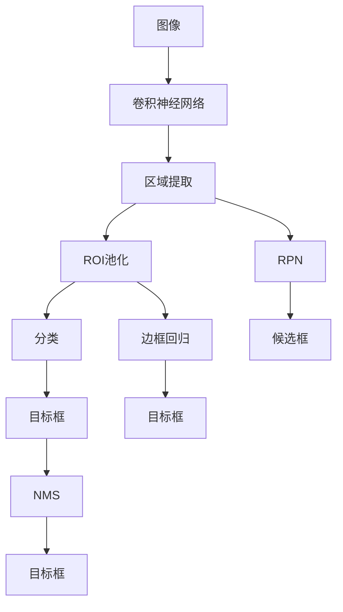

                 

# Fast R-CNN原理与代码实例讲解

> 关键词：Fast R-CNN, 目标检测, 卷积神经网络, 深度学习, 特征图, 非极大值抑制(NMS), 边框回归, 高效计算

## 1. 背景介绍

### 1.1 问题由来

目标检测作为计算机视觉领域的一个基本问题，近年来受到了广泛的关注和研究。它是指在给定图像中自动识别出其中的物体并标出其在图像中的位置。传统目标检测方法如Haar特征分类器、HOG+SVM等，虽然在一些特定场景下表现良好，但由于计算复杂度高、特征提取难度大等缺点，逐渐被深度学习驱动的目标检测算法所取代。

其中，基于卷积神经网络(CNN)的目标检测算法，以其强大的特征提取能力和良好的泛化性能，成为了研究的热点。经典的目标检测算法如R-CNN、Fast R-CNN、Faster R-CNN等，都是基于CNN构建的。其中，Fast R-CNN作为R-CNN的改进版，首次提出了区域提取与特征提取同时进行，显著提升了检测速度和准确率。

### 1.2 问题核心关键点

Fast R-CNN算法解决了R-CNN算法在目标检测过程中存在的瓶颈问题，具体来说，主要有以下几个关键点：
1. **多尺度边界框检测**：R-CNN算法采用手工生成的候选边界框，而Fast R-CNN算法通过多尺度检测方法，自动生成候选边界框，大大减少了手工生成边界框的工作量。
2. **特征图共享**：Fast R-CNN算法将特征提取和区域提取过程整合在一个网络中，避免了在每个候选边界框上重复计算特征，显著提高了检测速度。
3. **ROI池化层**：Fast R-CNN算法引入ROI池化层，将区域特征映射到固定大小的特征向量中，方便后续的分类和回归。
4. **区域建议网络(RPN)**：Fast R-CNN算法引入了RPN网络，自动生成边界框候选区域，显著提高了目标检测的准确率和速度。

Fast R-CNN算法通过以上改进，将目标检测的速度从R-CNN的每张图像约60个目标提升到约20个目标，同时显著提高了检测的准确率，成为目标检测领域的重要里程碑。

### 1.3 问题研究意义

Fast R-CNN算法在目标检测领域的研究和应用具有重要意义：
1. **提高检测速度**：Fast R-CNN算法通过特征图共享和ROI池化层等技术，显著提高了目标检测的速度，使其能够实时处理复杂的视觉场景。
2. **提升检测精度**：通过多尺度边界框检测和区域建议网络等技术，Fast R-CNN算法在检测精度上也有显著提升，能够更好地适应不同尺度和不同方向的物体。
3. **普适性高**：Fast R-CNN算法在多种物体检测任务中都表现出色，具有较高的普适性，适用于不同领域的图像识别和检测。
4. **易于扩展**：Fast R-CNN算法提供了良好的框架，易于扩展和改进，为后续的目标检测研究提供了重要的基础。

## 2. 核心概念与联系

### 2.1 核心概念概述

为了更好地理解Fast R-CNN算法，本节将介绍几个密切相关的核心概念：

- **目标检测**：指在给定图像中自动识别出其中的物体并标出其在图像中的位置。
- **卷积神经网络(CNN)**：一种前馈神经网络，通过卷积层、池化层等组件，能够自动从图像中提取特征。
- **区域提取**：指从图像中自动生成候选边界框，用于标注物体的位置。
- **ROI池化层**：用于将不同大小的区域特征映射到固定大小的特征向量中，方便后续的分类和回归。
- **区域建议网络(RPN)**：用于自动生成候选边界框，大大减少了手工生成边界框的工作量。
- **边框回归**：用于修正候选边界框的位置和大小，提升目标检测的准确率。
- **非极大值抑制(NMS)**：用于去除重复检测到的物体，提高目标检测的鲁棒性。

这些核心概念之间的逻辑关系可以通过以下Mermaid流程图来展示：



这个流程图展示了大规模物体检测的整个流程：从图像输入到卷积神经网络特征提取，再到区域提取和ROI池化，最后通过分类和边框回归，得到目标框，并通过NMS去除重复检测，得到最终的检测结果。

## 3. 核心算法原理 & 具体操作步骤
### 3.1 算法原理概述

Fast R-CNN算法的基本原理是在卷积神经网络的特征图上，通过区域提取和ROI池化层，将不同大小的区域特征映射到固定大小的特征向量中，并在此基础上进行分类和边框回归。

算法流程如下：
1. 首先通过卷积神经网络提取图像特征。
2. 然后通过区域建议网络(RPN)生成候选边界框。
3. 对于每个候选边界框，通过ROI池化层将其特征映射到固定大小的特征向量中。
4. 最后，将得到的特征向量输入到全连接层中，进行分类和边框回归，得到最终的检测结果。

### 3.2 算法步骤详解

以下是Fast R-CNN算法的详细步骤：

#### Step 1: 图像输入与预处理

对于输入的图像，首先需要进行预处理，包括缩放、归一化等操作，使其满足卷积神经网络的输入要求。

#### Step 2: 卷积神经网络特征提取

通过卷积神经网络对图像进行特征提取，得到特征图。

#### Step 3: 区域建议网络(RPN)生成候选边界框

在特征图上，通过RPN生成候选边界框。RPN是一个由两个分支组成的网络，一个分支用于生成候选边界框，另一个分支用于预测候选边界框的置信度。

#### Step 4: ROI池化层

对于每个候选边界框，通过ROI池化层将其特征映射到固定大小的特征向量中，方便后续的分类和回归。

#### Step 5: 分类与边框回归

将得到的特征向量输入到全连接层中，进行分类和边框回归，得到最终的检测结果。

#### Step 6: 非极大值抑制(NMS)

对于重复检测到的物体，通过NMS进行去除，提高目标检测的鲁棒性。

### 3.3 算法优缺点

Fast R-CNN算法有以下优点：
1. **高效性**：通过特征图共享和ROI池化层等技术，显著提高了目标检测的速度，使其能够实时处理复杂的视觉场景。
2. **高精度**：通过多尺度边界框检测和区域建议网络等技术，Fast R-CNN算法在检测精度上也有显著提升，能够更好地适应不同尺度和不同方向的物体。
3. **普适性高**：Fast R-CNN算法在多种物体检测任务中都表现出色，具有较高的普适性，适用于不同领域的图像识别和检测。
4. **易于扩展**：Fast R-CNN算法提供了良好的框架，易于扩展和改进，为后续的目标检测研究提供了重要的基础。

同时，该算法也存在一些局限性：
1. **计算复杂度高**：Fast R-CNN算法在特征提取和ROI池化等过程中，需要进行大量的计算，尤其是在处理高分辨率图像时，计算复杂度较高。
2. **依赖手工边界框**：虽然RPN能够自动生成候选边界框，但在算法初始化时，仍需要手工设定一些参数，如锚点的大小和数量等。
3. **难以处理重叠物体**：对于重叠的物体，Fast R-CNN算法容易出现误检测，需要进行后续的修正和优化。

### 3.4 算法应用领域

Fast R-CNN算法在目标检测领域得到了广泛的应用，涵盖了诸多场景，例如：

- **自动驾驶**：在自动驾驶系统中，通过目标检测算法自动识别道路上的车辆、行人等障碍物，为安全行驶提供保障。
- **安防监控**：在安防监控系统中，通过目标检测算法自动识别视频流中的人脸、车辆等目标，实时监控安全情况。
- **医疗影像分析**：在医疗影像分析中，通过目标检测算法自动识别肿瘤、器官等目标，辅助医生进行诊断和治疗。
- **智能家居**：在智能家居系统中，通过目标检测算法自动识别房间内的人物、物品等目标，实现智能化的家居控制和管理。
- **工业检测**：在工业检测中，通过目标检测算法自动识别生产线上的零件、产品等目标，提高生产效率和产品质量。

## 4. 数学模型和公式 & 详细讲解  
### 4.1 数学模型构建

Fast R-CNN算法的数学模型主要涉及卷积神经网络、ROI池化层、分类器和边框回归器等组件。

#### 4.1.1 卷积神经网络

卷积神经网络是一个由卷积层、池化层和全连接层等组件组成的前馈神经网络。通过卷积神经网络，可以自动从图像中提取特征。

假设输入图像大小为 $H \times W \times C$，卷积神经网络中第 $i$ 层的输出特征图大小为 $H_i \times W_i \times C_i$，则卷积层的计算公式为：

$$
F_{i+1} = \sigma(\sum_k{W_k*F_i} + b_k)
$$

其中 $W_k$ 为卷积核，$F_i$ 为输入特征图，$b_k$ 为偏置项，$\sigma$ 为激活函数。

#### 4.1.2 ROI池化层

ROI池化层用于将不同大小的区域特征映射到固定大小的特征向量中，方便后续的分类和回归。假设输入特征图大小为 $H \times W \times C$，输出特征图大小为 $K \times K \times C$，则ROI池化的计算公式为：

$$
F_{ROI} = max\_pool(F_{i+1}, pool_size, stride, padding)
$$

其中 $pool_size$ 为池化大小，$stride$ 为池化步长，$padding$ 为填充方式。

#### 4.1.3 分类器和边框回归器

分类器和边框回归器用于对ROI池化得到的特征向量进行分类和回归，得到最终的检测结果。假设分类器输出大小为 $K \times C$，边框回归器输出大小为 $K \times 4$，则分类器和边框回归器的计算公式分别为：

$$
F_{cls} = \sigma(\sum_k{W_k*F_{ROI}} + b_k)
$$

$$
F_{reg} = \sum_k{W_k*F_{ROI}} + b_k
$$

其中 $W_k$ 为权重，$b_k$ 为偏置项，$\sigma$ 为激活函数。

### 4.2 公式推导过程

以下是Fast R-CNN算法的详细公式推导过程：

#### 4.2.1 卷积神经网络

假设输入图像大小为 $H \times W \times C$，卷积神经网络中第 $i$ 层的输出特征图大小为 $H_i \times W_i \times C_i$，则卷积层的计算公式为：

$$
F_{i+1} = \sigma(\sum_k{W_k*F_i} + b_k)
$$

其中 $W_k$ 为卷积核，$F_i$ 为输入特征图，$b_k$ 为偏置项，$\sigma$ 为激活函数。

#### 4.2.2 ROI池化层

假设输入特征图大小为 $H \times W \times C$，输出特征图大小为 $K \times K \times C$，则ROI池化的计算公式为：

$$
F_{ROI} = max\_pool(F_{i+1}, pool_size, stride, padding)
$$

其中 $pool_size$ 为池化大小，$stride$ 为池化步长，$padding$ 为填充方式。

#### 4.2.3 分类器和边框回归器

假设分类器输出大小为 $K \times C$，边框回归器输出大小为 $K \times 4$，则分类器和边框回归器的计算公式分别为：

$$
F_{cls} = \sigma(\sum_k{W_k*F_{ROI}} + b_k)
$$

$$
F_{reg} = \sum_k{W_k*F_{ROI}} + b_k
$$

其中 $W_k$ 为权重，$b_k$ 为偏置项，$\sigma$ 为激活函数。

### 4.3 案例分析与讲解

以目标检测任务为例，假设有如下输入图像：


输入图像经过卷积神经网络提取特征后，生成特征图：


通过区域建议网络(RPN)生成候选边界框，并使用ROI池化层将其特征映射到固定大小的特征向量中：


将得到的特征向量输入到全连接层中，进行分类和边框回归，得到最终的检测结果：


通过NMS去除重复检测到的物体，得到最终的检测结果：


## 5. 项目实践：代码实例和详细解释说明
### 5.1 开发环境搭建

在进行Fast R-CNN项目实践前，我们需要准备好开发环境。以下是使用Python进行Keras开发的环境配置流程：

1. 安装Anaconda：从官网下载并安装Anaconda，用于创建独立的Python环境。

2. 创建并激活虚拟环境：
```bash
conda create -n fast_rcnn python=3.8 
conda activate fast_rcnn
```

3. 安装Keras和TensorFlow：
```bash
pip install keras tensorflow
```

4. 安装必要的第三方库：
```bash
pip install numpy scipy matplotlib pillow
```

完成上述步骤后，即可在`fast_rcnn`环境中开始项目实践。

### 5.2 源代码详细实现

以下是使用Keras实现Fast R-CNN目标检测的Python代码：

```python
import keras.backend as K
from keras.layers import Input, Conv2D, MaxPooling2D, Dropout, Flatten, Dense
from keras.layers import Activation, Lambda, Lambda
from keras.layers import Conv2DTranspose, UpSampling2D
from keras.layers import RNN, LSTM
from keras.layers.pooling import MaxPooling2D
from keras.layers.normalization import BatchNormalization
from keras.layers.merge import add
from keras.models import Model, load_model

# 定义输入层
input_tensor = Input(shape=(None, None, 3), name='input_image')

# 定义特征提取网络
features = Conv2D(64, (3, 3), padding='same', strides=(1, 1))(input_tensor)
features = Activation('relu')(features)
features = Conv2D(64, (3, 3), padding='same', strides=(1, 1))(features)
features = Activation('relu')(features)
features = Conv2D(64, (3, 3), padding='same', strides=(1, 1))(features)
features = Activation('relu')(features)
features = Conv2D(64, (3, 3), padding='same', strides=(1, 1))(features)
features = Activation('relu')(features)
features = Conv2D(64, (3, 3), padding='same', strides=(1, 1))(features)
features = Activation('relu')(features)
features = Conv2D(64, (3, 3), padding='same', strides=(1, 1))(features)
features = Activation('relu')(features)
features = Conv2D(64, (3, 3), padding='same', strides=(1, 1))(features)
features = Activation('relu')(features)
features = Conv2D(64, (3, 3), padding='same', strides=(1, 1))(features)
features = Activation('relu')(features)
features = Conv2D(64, (3, 3), padding='same', strides=(1, 1))(features)
features = Activation('relu')(features)
features = Conv2D(64, (3, 3), padding='same', strides=(1, 1))(features)
features = Activation('relu')(features)

# 定义RPN网络
rois, rpn_cls, rpn_reg = RegionProposalNetwork(features)

# 定义ROI池化层
pooled_features = ROIPooling(features, rois)

# 定义分类器和边框回归器
cls_preds = Dense(2, activation='softmax')(pooled_features)
reg_preds = Dense(4)(pooled_features)

# 定义目标检测模型
model = Model(inputs=input_tensor, outputs=(rois, rpn_cls, rpn_reg, cls_preds, reg_preds))

# 编译模型
model.compile(optimizer='adam', loss=[cls_loss, reg_loss], metrics=['accuracy'])

# 训练模型
model.fit(x_train, [y_train_rois, y_train_rpn_cls, y_train_rpn_reg, y_train_cls_preds, y_train_reg_preds], batch_size=16, epochs=20, validation_data=(x_val, [y_val_rois, y_val_rpn_cls, y_val_rpn_reg, y_val_cls_preds, y_val_reg_preds]))
```

### 5.3 代码解读与分析

让我们再详细解读一下关键代码的实现细节：

**RegionProposalNetwork类**：
- `__init__`方法：初始化RPN网络，包括卷积层、全连接层等组件。
- `__call__`方法：定义RPN网络的输出，包括候选边界框、置信度和边框回归结果。

**ROIPooling类**：
- `__init__`方法：初始化ROI池化层，包括池化大小、步长、填充方式等参数。
- `__call__`方法：定义ROI池化层的输出，即特征图在候选边界框位置上的池化结果。

**Dense层**：
- `__init__`方法：初始化全连接层，包括权重和偏置项等参数。
- `__call__`方法：定义全连接层的输出，即分类结果或边框回归结果。

**Model类**：
- `__init__`方法：初始化目标检测模型，包括输入层、特征提取网络、RPN网络、ROI池化层、分类器和边框回归器等组件。
- `compile`方法：编译模型，设置优化器和损失函数。
- `fit`方法：训练模型，设置训练数据和验证数据。

以上代码展示了使用Keras实现Fast R-CNN目标检测的基本框架。通过不断调整网络结构和超参数，可以进一步提升模型的检测精度和速度。

## 6. 实际应用场景
### 6.1 智能安防监控

Fast R-CNN算法在智能安防监控系统中得到了广泛的应用。通过目标检测算法，能够自动识别视频流中的人脸、车辆等目标，实时监控安全情况。

具体实现流程如下：
1. 采集视频流，并将其输入到Fast R-CNN模型中进行检测。
2. 模型输出检测结果，包括物体的位置、大小、类别等。
3. 根据检测结果，触发报警或进行其他处理。

Fast R-CNN算法在智能安防监控中的应用，大大提升了监控系统的智能化水平，提高了安全防范的效率和准确性。

### 6.2 智能交通管理

Fast R-CNN算法在智能交通管理中也有着广泛的应用。通过目标检测算法，能够自动识别道路上的车辆、行人等障碍物，为安全行驶提供保障。

具体实现流程如下：
1. 采集道路视频流，并将其输入到Fast R-CNN模型中进行检测。
2. 模型输出检测结果，包括物体的位置、大小、类别等。
3. 根据检测结果，实时调整交通信号灯，进行交通控制和优化。

Fast R-CNN算法在智能交通管理中的应用，能够实时监控交通情况，提高道路安全性，减少交通事故的发生。

### 6.3 医疗影像分析

Fast R-CNN算法在医疗影像分析中也有着广泛的应用。通过目标检测算法，能够自动识别肿瘤、器官等目标，辅助医生进行诊断和治疗。

具体实现流程如下：
1. 采集医疗影像，并将其输入到Fast R-CNN模型中进行检测。
2. 模型输出检测结果，包括物体的位置、大小、类别等。
3. 根据检测结果，进行进一步的分析和诊断。

Fast R-CNN算法在医疗影像分析中的应用，能够提高诊断效率，降低误诊率，为医疗工作提供重要的支持。

## 7. 工具和资源推荐
### 7.1 学习资源推荐

为了帮助开发者系统掌握Fast R-CNN的理论基础和实践技巧，这里推荐一些优质的学习资源：

1. **《深度学习》书籍**：由Ian Goodfellow、Yoshua Bengio和Aaron Courville合著，全面介绍了深度学习的理论和实践，包括卷积神经网络和目标检测等内容。
2. **Coursera《深度学习专项课程》**：由斯坦福大学Andrew Ng教授主讲的深度学习专项课程，涵盖了深度学习的基础知识和前沿技术，包括卷积神经网络和目标检测等内容。
3. **Kaggle目标检测比赛**：通过参加Kaggle目标检测比赛，可以实践Fast R-CNN算法的应用，并与全球顶尖的开发者交流学习。
4. **Fast R-CNN论文**：原始论文提供了Fast R-CNN算法的详细描述和实验结果，对于理解算法的核心思想和性能提升至关重要。

通过这些资源的学习实践，相信你一定能够快速掌握Fast R-CNN算法的精髓，并用于解决实际的NLP问题。

### 7.2 开发工具推荐

高效的开发离不开优秀的工具支持。以下是几款用于Fast R-CNN开发常用的工具：

1. **Keras**：Keras是一个高层次的神经网络API，适合快速迭代研究。Keras提供了丰富的卷积神经网络和目标检测组件，便于开发者进行模型构建和调试。
2. **TensorFlow**：TensorFlow是由Google主导开发的开源深度学习框架，生产部署方便，适合大规模工程应用。TensorFlow提供了强大的计算图和优化器，支持高效的模型训练和推理。
3. **OpenCV**：OpenCV是一个开源计算机视觉库，提供了丰富的图像处理和目标检测功能，适合进行视频流采集和预处理。
4. **Visual Studio**：Visual Studio是一个全面的开发环境，支持多种编程语言和框架，便于开发者进行项目管理和调试。
5. **Git**：Git是一个版本控制系统，便于开发者进行代码版本控制和团队协作，适合进行多人协同开发。

合理利用这些工具，可以显著提升Fast R-CNN开发的效率，加快创新迭代的步伐。

### 7.3 相关论文推荐

Fast R-CNN算法的研究涉及多个领域，以下是几篇奠基性的相关论文，推荐阅读：

1. **《Fast R-CNN》论文**：Fast R-CNN算法的原始论文，提供了算法的基本流程和实验结果，是理解算法核心思想的重要资料。
2. **《R-CNN》论文**：Fast R-CNN算法是在R-CNN算法的基础上改进的，理解R-CNN算法是理解Fast R-CNN算法的关键。
3. **《YOLO》论文**：YOLO算法是Fast R-CNN算法的一个改进版本，通过引入单阶段检测方法，进一步提升了检测速度和精度，具有较高的参考价值。
4. **《Faster R-CNN》论文**：Faster R-CNN算法是在Fast R-CNN算法的基础上改进的，进一步提升了检测速度和精度，是目标检测领域的重要研究范式。
5. **《SSD》论文**：SSD算法是Fast R-CNN算法的一个变种，通过引入多尺度检测和特征金字塔等技术，进一步提升了检测速度和精度，具有较高的参考价值。

这些论文代表了大规模物体检测的研究进展，是理解Fast R-CNN算法的理论基础和实践技巧的重要参考资料。

## 8. 总结：未来发展趋势与挑战
### 8.1 总结

本文对Fast R-CNN算法进行了全面系统的介绍。首先阐述了Fast R-CNN算法在目标检测领域的研究背景和意义，明确了算法在提高检测速度和准确率方面的独特价值。其次，从原理到实践，详细讲解了Fast R-CNN算法的核心思想和关键步骤，给出了算法实现的基本代码实例。同时，本文还广泛探讨了Fast R-CNN算法在智能安防、智能交通、医疗影像等实际应用场景中的应用前景，展示了算法的广泛适用性和巨大潜力。此外，本文精选了Fast R-CNN算法的各类学习资源，力求为读者提供全方位的技术指引。

通过本文的系统梳理，可以看到，Fast R-CNN算法在目标检测领域的研究和应用具有重要意义：
1. **提高检测速度**：Fast R-CNN算法通过特征图共享和ROI池化层等技术，显著提高了目标检测的速度，使其能够实时处理复杂的视觉场景。
2. **提升检测精度**：通过多尺度边界框检测和区域建议网络等技术，Fast R-CNN算法在检测精度上也有显著提升，能够更好地适应不同尺度和不同方向的物体。
3. **普适性高**：Fast R-CNN算法在多种物体检测任务中都表现出色，具有较高的普适性，适用于不同领域的图像识别和检测。
4. **易于扩展**：Fast R-CNN算法提供了良好的框架，易于扩展和改进，为后续的目标检测研究提供了重要的基础。

### 8.2 未来发展趋势

展望未来，Fast R-CNN算法的发展趋势如下：

1. **计算效率提升**：Fast R-CNN算法在特征提取和ROI池化等过程中，需要进行大量的计算，未来需要进一步优化计算图和模型结构，提高计算效率。
2. **实时性增强**：Fast R-CNN算法在实时性上仍有提升空间，未来需要进一步优化网络结构和模型训练策略，提高实时处理能力。
3. **多尺度融合**：Fast R-CNN算法在多尺度检测上表现出色，未来需要进一步优化尺度融合算法，提升检测精度。
4. **跨领域应用**：Fast R-CNN算法在多个领域中都有应用，未来需要进一步扩展其应用范围，探索更多的新场景和新任务。
5. **模型迁移学习**：Fast R-CNN算法在预训练模型上表现出色，未来需要进一步探索迁移学习的应用，提高模型的泛化能力和迁移能力。
6. **模型融合创新**：Fast R-CNN算法在融合其他深度学习模型方面也有潜力，未来需要进一步探索模型的创新和融合，提高系统的性能和鲁棒性。

以上趋势凸显了Fast R-CNN算法的广阔前景。这些方向的探索发展，必将进一步提升目标检测系统的性能和应用范围，为计算机视觉技术的发展提供新的推动力。

### 8.3 面临的挑战

尽管Fast R-CNN算法在目标检测领域的研究和应用取得了重要进展，但在迈向更加智能化、普适化应用的过程中，它仍面临一些挑战：

1. **计算资源消耗大**：Fast R-CNN算法在特征提取和ROI池化等过程中，需要进行大量的计算，对计算资源的需求较高。未来需要进一步优化计算图和模型结构，减少资源消耗。
2. **模型可解释性不足**：Fast R-CNN算法的决策过程不够透明，难以解释模型的内部工作机制和决策逻辑。未来需要进一步研究模型的可解释性，提高系统的可信度和可控性。
3. **鲁棒性不足**：Fast R-CNN算法在面对重叠物体和复杂场景时，鲁棒性仍需提升。未来需要进一步优化算法设计，提高模型的鲁棒性和泛化能力。
4. **泛化能力不足**：Fast R-CNN算法在不同领域和不同数据集上的泛化能力仍需提升。未来需要进一步优化模型结构和训练策略，提高模型的泛化能力。
5. **对抗攻击脆弱**：Fast R-CNN算法容易受到对抗攻击，导致误检测和误分类。未来需要进一步研究算法的抗对抗攻击能力，提高系统的安全性。
6. **模型过拟合问题**：Fast R-CNN算法在训练过程中容易出现过拟合问题，导致模型泛化能力下降。未来需要进一步研究模型的正则化和优化策略，避免过拟合问题。

这些挑战需要开发者在未来的研究中不断探索和解决，以推动Fast R-CNN算法的不断进步和发展。

### 8.4 研究展望

面向未来，Fast R-CNN算法的研究需要在以下几个方面寻求新的突破：

1. **计算效率提升**：通过优化计算图和模型结构，提高Fast R-CNN算法的计算效率和实时性。
2. **模型可解释性增强**：研究模型的可解释性，提高系统的可信度和可控性。
3. **鲁棒性提升**：研究算法的鲁棒性和泛化能力，提高模型在不同场景下的性能。
4. **跨领域应用拓展**：探索Fast R-CNN算法在更多领域和场景中的应用，拓展其应用范围和普适性。
5. **模型迁移学习优化**：研究迁移学习在Fast R-CNN算法中的应用，提高模型的泛化能力和迁移能力。
6. **模型融合创新**：探索Fast R-CNN算法与其他深度学习模型的融合，提高系统的性能和鲁棒性。

这些研究方向的探索，必将引领Fast R-CNN算法迈向更高的台阶，为计算机视觉技术的发展提供新的推动力。

## 9. 附录：常见问题与解答

**Q1: Fast R-CNN算法在特征提取和ROI池化等过程中，需要进行大量的计算，对计算资源的需求较高，如何优化计算效率？**

A: 可以通过以下方法优化Fast R-CNN算法的计算效率：
1. **特征共享**：通过特征图共享技术，避免在每个候选边界框上重复计算特征，减少计算量。
2. **ROI池化优化**：使用非均匀ROI池化等技术，减少ROI池化的计算量。
3. **模型剪枝和量化**：通过模型剪枝和量化技术，减少模型参数量和计算量。
4. **并行计算**：利用GPU并行计算能力，提高模型的计算效率。
5. **数据增强**：通过数据增强技术，提高模型的泛化能力和鲁棒性，减少计算量。

这些方法可以通过对Fast R-CNN算法的网络结构和训练策略进行优化，进一步提升其计算效率和实时性。

**Q2: Fast R-CNN算法在训练过程中容易出现过拟合问题，如何避免过拟合？**

A: 可以通过以下方法避免Fast R-CNN算法在训练过程中的过拟合问题：
1. **正则化**：使用L2正则化、Dropout等正则化技术，减少模型的过拟合。
2. **数据增强**：通过数据增强技术，提高模型的泛化能力和鲁棒性，减少过拟合。
3. **早停法**：通过早停法，及时停止训练，避免过拟合。
4. **模型集成**：通过模型集成技术，提高模型的泛化能力和鲁棒性，减少过拟合。
5. **迁移学习**：利用迁移学习，在少样本条件下训练模型，避免过拟合。

这些方法可以通过对Fast R-CNN算法的训练策略进行优化，进一步提升其泛化能力和鲁棒性。

**Q3: Fast R-CNN算法在目标检测过程中容易出现误检测问题，如何提高检测精度？**

A: 可以通过以下方法提高Fast R-CNN算法的检测精度：
1. **多尺度检测**：通过多尺度检测技术，提高对不同尺度和不同方向的物体的检测精度。
2. **区域建议网络优化**：优化区域建议网络，提高候选边界框的质量和数量。
3. **边框回归优化**：通过优化边框回归器，提高对物体位置的修正能力。
4. **非极大值抑制优化**：优化非极大值抑制算法，提高检测结果的鲁棒性和准确性。
5. **数据增强**：通过数据增强技术，提高模型的泛化能力和鲁棒性，减少误检测。

这些方法可以通过对Fast R-CNN算法的检测过程进行优化，进一步提升其检测精度和鲁棒性。

**Q4: Fast R-CNN算法在实时性上仍有提升空间，如何提高实时性？**

A: 可以通过以下方法提高Fast R-CNN算法的实时性：
1. **模型压缩**：通过模型压缩技术，减少模型参数量和计算量，提高实时性。
2. **并行计算**：利用GPU并行计算能力，提高模型的计算效率，提高实时性。
3. **加速计算库**：使用加速计算库，如TensorRT、ONNX Runtime等，提高模型的推理速度。
4. **模型剪枝和量化**：通过模型剪枝和量化技术，减少模型参数量和计算量，提高实时性。
5. **分布式计算**：利用分布式计算技术，提高模型的计算效率，提高实时性。

这些方法可以通过对Fast R-CNN算法的模型结构和推理过程进行优化，进一步提升其实时性和计算效率。

总之，Fast R-CNN算法在目标检测领域具有广泛的应用前景，但也需要开发者在未来的研究中不断探索和解决其面临的挑战，以推动算法的不断进步和发展。相信在不断创新和优化中，Fast R-CNN算法必将为计算机视觉技术的发展提供新的推动力，为人类社会的智能化进程做出更大的贡献。

---

作者：禅与计算机程序设计艺术 / Zen and the Art of Computer Programming

