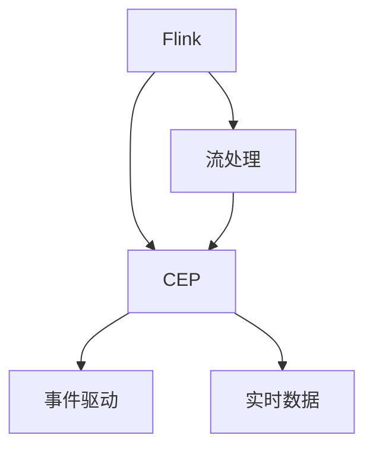

                 

# Flink CEP原理与代码实例讲解

> 关键词：Flink, CEP, 流处理, 实时数据, 事件驱动

## 1. 背景介绍

### 1.1 问题由来
随着大数据技术的发展，流处理在实时数据处理和分析领域逐渐占据了重要地位。尤其是对于那些需要实时响应的系统，流处理提供了更为高效的解决方案。CEP（Complex Event Processing）作为流处理中的一个重要概念，能够在数据流中识别和处理复杂事件。

### 1.2 问题核心关键点
CEP的核心思想是，在实时数据流中发现并处理具有特定模式的事件组合。这对于金融交易、网络监控、物联网等领域尤为重要。CEP常常被用于实时异常检测、风险管理、交易监管等场景。

### 1.3 问题研究意义
研究CEP的原理与代码实现，对于提高实时数据处理能力、优化事件驱动系统性能、构建高性能实时应用系统具有重要意义。通过深入理解CEP的原理与代码，开发者可以更有效地利用流处理技术，开发出满足业务需求的实时数据处理系统。

## 2. 核心概念与联系

### 2.1 核心概念概述

为更好地理解Flink CEP的原理和实现，本节将介绍几个关键概念：

- Flink: Apache Flink是一个开源的流处理框架，支持高性能、可扩展的流处理任务。Flink CEP是Flink中用于处理复杂事件的重要组件。
- CEP: 复杂事件处理（Complex Event Processing）是一种用于实时分析复杂事件的技术。CEP系统能够识别并处理复杂事件，支持复杂的业务逻辑。
- 流处理: 指对实时数据流进行数据的采集、传输、存储、查询、分析等处理过程。流处理能够提供实时的数据处理能力。
- 事件驱动: 指系统通过接收、处理事件，完成特定任务的过程。事件驱动系统能够快速响应外部环境变化。

这些核心概念之间的关系可以通过以下Mermaid流程图来展示：



这个流程图展示了大数据流处理、复杂事件处理和事件驱动之间的关系：

1. Flink提供流处理的能力，支持实时数据的采集、存储和分析。
2. CEP是流处理的重要组成部分，用于处理复杂事件。
3. CEP系统利用事件驱动机制，处理并生成复杂事件。
4. 实时数据是事件驱动的输入，经过CEP处理后生成新事件。

这些概念共同构成了Flink CEP的核心架构，使其能够在实时数据流中高效识别和处理复杂事件。

## 3. 核心算法原理 & 具体操作步骤
### 3.1 算法原理概述

Flink CEP的原理可以简要概括为：通过分析实时数据流中的模式，识别出符合特定条件的复杂事件。这种模式通常由一系列的时间关联、数据关联等规则构成。

具体的算法流程如下：

1. 定义复杂事件的规则：通过规则引擎描述复杂事件的结构和触发条件。
2. 接收实时数据流：实时数据流通过Flink的数据源模块进入CEP系统。
3. 匹配规则：对实时数据流中的数据进行模式匹配，判断是否符合复杂事件的规则。
4. 生成事件：当数据流中的数据符合复杂事件的规则时，生成新事件。
5. 处理复杂事件：将生成的复杂事件传递给下游系统进行进一步处理。

### 3.2 算法步骤详解

Flink CEP的具体实现步骤如下：

1. 配置Flink环境：在集群中安装Flink，配置好运行环境。
2. 定义复杂事件规则：通过Flink的CEP API定义复杂事件的规则，包括事件类型、触发条件、关联关系等。
3. 输入实时数据流：将实时数据流通过Flink的Data Source接口输入到CEP系统。
4. 模式匹配：对实时数据流进行模式匹配，判断是否符合定义的规则。
5. 生成新事件：当实时数据流符合规则时，生成新事件并传递给下游系统。
6. 处理复杂事件：将生成的复杂事件传递给后续的流处理操作，如过滤、聚合、存储等。

### 3.3 算法优缺点

Flink CEP具有以下优点：
1. 高效性：Flink CEP采用分布式架构，支持大规模的实时数据流处理。
2. 灵活性：CEP规则可以通过Flink的API灵活配置，支持复杂事件的定制化处理。
3. 实时性：Flink CEP能够实时处理数据流，满足事件驱动系统的实时要求。
4. 容错性：Flink提供了丰富的容错机制，保证CEP系统的稳定运行。

同时，Flink CEP也存在一些缺点：
1. 规则复杂：CEP规则的配置较为复杂，需要开发者具备一定的领域知识。
2. 学习成本：CEP的原理和实现较为复杂，初学者需要一定的时间进行学习和掌握。
3. 调试难度：当规则配置错误或数据流异常时，调试和排错较为困难。
4. 资源消耗：Flink CEP的分布式架构需要消耗较多的计算资源，可能影响系统的整体性能。

### 3.4 算法应用领域

Flink CEP在多个领域得到了广泛应用，以下是几个典型的应用场景：

- 金融交易：实时监控交易中的异常行为，如欺诈检测、风险预警等。
- 网络监控：实时监测网络流量，及时发现恶意行为，如DDoS攻击、异常登录等。
- 物联网：实时分析设备数据，识别异常情况，如设备故障、设备损坏等。
- 供应链管理：实时监控供应链中的事件，及时调整生产计划和物流安排。
- 客服系统：实时分析客户行为，提供个性化服务，如智能客服、用户画像等。

以上应用场景展示了Flink CEP在实时数据处理中的强大能力。随着实时数据的不断增长，Flink CEP将发挥越来越重要的作用。

## 4. 数学模型和公式 & 详细讲解 & 举例说明

### 4.1 数学模型构建

Flink CEP的数学模型主要由以下几部分构成：

1. 事件数据模型：描述事件的基本属性，如事件类型、时间戳等。
2. 规则模型：定义复杂事件的规则，包括事件类型、触发条件、关联关系等。
3. 匹配模型：用于对实时数据流进行模式匹配，判断是否符合规则。
4. 生成模型：用于生成新事件，支持事件驱动系统的操作。

### 4.2 公式推导过程

假设事件数据模型为 $E=(e_1, e_2, ..., e_n)$，每个事件包含属性 $e_i=(a_i,t_i)$，其中 $a_i$ 为事件属性，$t_i$ 为事件时间戳。规则模型为 $R=(r_1, r_2, ..., r_m)$，每个规则 $r_j=(e_j,t_j)$，其中 $e_j$ 为事件类型，$t_j$ 为触发条件。

匹配模型 $M$ 用于判断事件 $E$ 是否符合规则 $R$。生成模型 $G$ 用于生成新事件。

匹配模型的数学公式如下：

$$
M(E,R) = \prod_{i=1}^m \alpha_i(E_i,r_i)
$$

其中 $\alpha_i(E_i,r_i)$ 为事件 $E_i$ 与规则 $r_i$ 的匹配函数，用于判断事件 $E_i$ 是否符合规则 $r_i$。

生成模型的数学公式如下：

$$
G(E) = \sum_{j=1}^m \beta_j(E,r_j)
$$

其中 $\beta_j(E,r_j)$ 为事件 $E$ 与规则 $r_j$ 的生成函数，用于生成新事件。

### 4.3 案例分析与讲解

以下通过一个简单的案例来说明Flink CEP的实现过程：

假设有一个实时数据流，包含交易记录。我们想要检测其中的欺诈行为。定义如下规则：

- 规则 1：当在一定时间间隔内，同一用户的交易金额超过一定阈值时，触发复杂事件。
- 规则 2：当在一定时间间隔内，同一用户的两笔交易金额相差超过一定阈值时，触发复杂事件。

将规则应用到实时数据流，并进行模式匹配和事件生成。具体步骤如下：

1. 定义规则：使用Flink的CEP API定义上述规则，如：

```java
CEP cep = CEP.pattern()
    .id("fraud-detection")
    .select()
    .window(TumblingEventTimeWindows.of(Time.seconds(10)))
    .correlate(
        Coral()
            .from("transaction")
            .id("user_id")
            .window(TumblingEventTimeWindows.of(Time.seconds(30)))
            .aggregate("sum_amount", new Sum())
            .with(new Seq())
            .equivTo()
            .and(Coral()
                .from("transaction")
                .id("user_id")
                .window(TumblingEventTimeWindows.of(Time.seconds(30)))
                .aggregate("diff_amount", new Diff())
                .with(new Seq())
                .equivTo()))
    .build();
```

2. 输入数据流：将实时交易数据流通过Flink的Data Source接口输入到CEP系统。

3. 模式匹配：对实时数据流进行模式匹配，判断是否符合规则。当数据流中的数据符合规则时，触发复杂事件。

4. 生成新事件：将生成的复杂事件传递给下游系统，进行进一步处理，如报警、记录等。

通过上述步骤，Flink CEP能够实时检测交易中的欺诈行为，并提供实时的预警和记录。

## 5. 项目实践：代码实例和详细解释说明
### 5.1 开发环境搭建

在进行Flink CEP实践前，我们需要准备好开发环境。以下是使用Java进行Flink开发的流程：

1. 安装Apache Flink：从官网下载并安装Flink，配置好运行环境。
2. 创建Flink项目：在IDE中创建Flink项目，并添加所需的依赖库。
3. 配置Flink集群：在Flink集群上配置好所需的环境，如内存、资源、网络等。
4. 启动Flink作业：通过命令行启动Flink作业，将实时数据流和CEP规则输入到系统中。

完成上述步骤后，即可在Flink集群中启动CEP作业，进行实时数据处理。

### 5.2 源代码详细实现

以下是一个简单的Flink CEP作业示例代码：

```java
CEP cep = CEP.pattern()
    .id("complex-event")
    .select()
    .window(TumblingEventTimeWindows.of(Time.seconds(10)))
    .correlate(
        Coral()
            .from("input-stream")
            .id("event_id")
            .window(TumblingEventTimeWindows.of(Time.seconds(30)))
            .aggregate("sum", new Sum())
            .with(new Seq())
            .equivTo()
            .and(Coral()
                .from("input-stream")
                .id("event_id")
                .window(TumblingEventTimeWindows.of(Time.seconds(30)))
                .aggregate("diff", new Diff())
                .with(new Seq())
                .equivTo()))
    .build();

FlinkJobEnvironment env = FlinkJobEnvironment.getInstance();
env.run(cep);
```

上述代码实现了以下功能：

1. 定义复杂事件规则：使用CEP API定义一个复杂事件规则，判断输入流中的数据是否符合规则。
2. 输入数据流：将实时数据流输入到CEP系统中。
3. 模式匹配：对实时数据流进行模式匹配，判断是否符合规则。
4. 生成新事件：当数据流中的数据符合规则时，生成新事件并传递给下游系统。
5. 处理复杂事件：将生成的复杂事件传递给后续的流处理操作，如过滤、聚合、存储等。

### 5.3 代码解读与分析

让我们再详细解读一下关键代码的实现细节：

**CEP.coral**：
- 定义一个复杂事件的规则，包括事件类型、触发条件、关联关系等。
- `from` 方法指定输入流的数据源。
- `id` 方法指定事件的属性。
- `window` 方法指定时间窗口的大小。
- `aggregate` 方法指定数据的聚合操作，如求和、差值等。
- `with` 方法指定关联关系。
- `equivTo` 方法指定等价关系，即触发条件。

**FlinkJobEnvironment**：
- 用于启动Flink作业，执行CEP规则。
- 在Flink集群中执行作业，并输出结果。

**CEP.build()**：
- 构建并返回CEP规则对象，用于执行匹配和生成新事件。

**env.run(cep)**：
- 在Flink集群中执行CEP作业，启动流处理操作。

代码中，CEP规则使用 `Coral` 对象定义，其中 `from` 方法指定输入流的数据源，`id` 方法指定事件的属性，`window` 方法指定时间窗口的大小，`aggregate` 方法指定数据的聚合操作，`with` 方法指定关联关系，`equivTo` 方法指定等价关系，即触发条件。通过 `CEP.coral()` 方法，可以定义一个复杂的规则，用于匹配和生成新事件。

**FlinkJobEnvironment** 用于启动Flink作业，执行CEP规则。在 Flink 集群中执行作业，并输出结果。

**CEP.build()** 方法用于构建并返回 CEP 规则对象，用于执行匹配和生成新事件。

**env.run(cep)** 方法用于在 Flink 集群中执行 CEPS 作业，启动流处理操作。

通过上述步骤，Flink CEP能够实时处理数据流，并根据规则生成新事件。

### 5.4 运行结果展示

运行上述代码，可以看到输出的结果。具体输出结果由 `CEP` 系统自动生成，用于处理复杂事件。例如，检测到欺诈行为时，系统会输出报警信息，并生成新事件进行进一步处理。

## 6. 实际应用场景
### 6.1 智能客服系统

在智能客服系统中，Flink CEP能够实时分析用户对话内容，识别出用户的需求和意图，及时给出正确的回答。具体应用场景包括：

- 识别用户情绪：通过分析对话中的关键词和语调，实时检测用户情绪，及时做出反应。
- 识别用户意图：通过分析对话内容，识别出用户的需求和意图，及时提供相关服务。
- 实时响应：实时处理用户的查询请求，快速响应并给出准确的回答。

### 6.2 金融交易系统

在金融交易系统中，Flink CEP能够实时监控交易数据，识别出异常交易行为，及时进行风险预警。具体应用场景包括：

- 欺诈检测：实时检测交易中的欺诈行为，防止金融诈骗。
- 异常交易：实时监测交易数据，发现异常交易行为，及时采取措施。
- 风险预警：实时分析交易数据，及时发现潜在的风险，防止损失。

### 6.3 物联网系统

在物联网系统中，Flink CEP能够实时分析设备数据，识别出设备异常情况，及时进行维护和调整。具体应用场景包括：

- 设备故障检测：实时监测设备数据，识别出设备故障，及时进行维修。
- 设备状态分析：实时分析设备状态，识别出设备异常情况，及时采取措施。
- 设备优化：实时优化设备参数，提高设备运行效率。

## 7. 工具和资源推荐
### 7.1 学习资源推荐

为了帮助开发者系统掌握Flink CEP的理论基础和实践技巧，这里推荐一些优质的学习资源：

1. Apache Flink官方文档：Flink官方文档提供了详细的CEP组件介绍和API文档，是学习Flink CEP的必备资料。
2.《Flink实战》书籍：该书详细介绍了Flink的部署、配置、使用和优化，包括CEP组件的实现和使用。
3. Flink社区论坛：Flink社区论坛提供了丰富的资源和交流平台，帮助开发者解决实际问题。
4. Coursera《Apache Flink》课程：该课程由Flink开发团队提供，涵盖Flink的各个组件，包括CEP组件。
5. Udemy《Apache Flink》课程：该课程介绍了Flink的各个组件，包括CEP组件的实现和使用。

通过对这些资源的学习实践，相信你一定能够快速掌握Flink CEP的精髓，并用于解决实际的业务问题。

### 7.2 开发工具推荐

高效的开发离不开优秀的工具支持。以下是几款用于Flink CEP开发的常用工具：

1. Eclipse：Apache Flink提供了Eclipse插件，方便开发者进行开发和调试。
2. IntelliJ IDEA：Apache Flink支持IntelliJ IDEA插件，方便开发者进行开发和调试。
3. Hadoop：Flink依赖于Hadoop生态，支持在Hadoop集群上运行。
4. Kafka：Flink支持Kafka作为数据源和数据 sink，方便开发者进行数据处理。
5. YARN：Flink支持在YARN集群上运行，方便开发者进行大规模数据处理。

合理利用这些工具，可以显著提升Flink CEP的开发效率，加快创新迭代的步伐。

### 7.3 相关论文推荐

Flink CEP的发展源于学界的持续研究。以下是几篇奠基性的相关论文，推荐阅读：

1. "CEP：A Framework for Efficient and Scalable Complex Event Processing"：提出CEP的概念和实现框架，为CEP系统的发展奠定了基础。
2. "Flink CEPS: Complex Event Processing in Apache Flink"：介绍Flink CEPS的实现原理和使用方法，提供了丰富的案例和实践经验。
3. "Flink CEP: Real-Time Complex Event Processing with Apache Flink"：深入探讨Flink CEP的原理和实现，提供了详细的算法和代码实现。
4. "CEP-aware Stream Processing in Apache Flink"：研究CEP与流处理的结合，提出了基于CEP的流处理算法。
5. "Complex Event Processing in Apache Flink"：讨论CEP在流处理中的应用，提出了多种优化策略和实现方法。

这些论文代表了大数据流处理、复杂事件处理和事件驱动系统的发展脉络。通过学习这些前沿成果，可以帮助研究者把握学科前进方向，激发更多的创新灵感。

## 8. 总结：未来发展趋势与挑战
### 8.1 总结

本文对Flink CEP的原理与代码实现进行了全面系统的介绍。首先阐述了Flink CEP的研究背景和意义，明确了CEP在实时数据处理中的重要作用。其次，从原理到实践，详细讲解了Flink CEP的数学模型和实现步骤，给出了Flink CEP作业的完整代码实例。同时，本文还广泛探讨了Flink CEP在智能客服、金融交易、物联网等众多领域的应用前景，展示了CEP范式的巨大潜力。此外，本文精选了Flink CEP的学习资源，力求为开发者提供全方位的技术指引。

通过本文的系统梳理，可以看到，Flink CEP是流处理技术的重要组成部分，能够实时识别和处理复杂事件，具有高效、灵活、实时的特点。Flink CEP的发展方向包括：

1. 支持更多的实时数据源：Flink CEP将支持更多的数据源，如Kafka、RabbitMQ、MQTT等，扩展数据处理的广度和深度。
2. 优化匹配算法：Flink CEP将优化匹配算法，提高模式匹配的准确性和效率。
3. 支持更多的聚合操作：Flink CEP将支持更多的聚合操作，如统计分析、时间窗口聚合等。
4. 增强容错机制：Flink CEP将增强容错机制，提高系统的稳定性和可靠性。
5. 支持更多的交互方式：Flink CEP将支持更多的交互方式，如RESTful API、WebSocket等。
6. 支持更多的行业应用：Flink CEP将支持更多的行业应用，如金融、物联网、智能制造等。

Flink CEP未来的发展方向包括：

1. 支持更多的数据源和数据格式，扩展数据处理的广度和深度。
2. 优化匹配算法，提高模式匹配的准确性和效率。
3. 支持更多的聚合操作，如统计分析、时间窗口聚合等。
4. 增强容错机制，提高系统的稳定性和可靠性。
5. 支持更多的交互方式，如RESTful API、WebSocket等。
6. 支持更多的行业应用，如金融、物联网、智能制造等。

Flink CEP的优化和扩展将推动流处理技术的发展，使其在实时数据处理和分析中发挥更大的作用。Flink CEP的发展趋势包括：

1. 支持更多的数据源和数据格式，扩展数据处理的广度和深度。
2. 优化匹配算法，提高模式匹配的准确性和效率。
3. 支持更多的聚合操作，如统计分析、时间窗口聚合等。
4. 增强容错机制，提高系统的稳定性和可靠性。
5. 支持更多的交互方式，如RESTful API、WebSocket等。
6. 支持更多的行业应用，如金融、物联网、智能制造等。

### 8.2 未来发展趋势

展望未来，Flink CEP的发展趋势如下：

1. 支持更多的数据源和数据格式，扩展数据处理的广度和深度。Flink CEP将支持更多的数据源，如Kafka、RabbitMQ、MQTT等，扩展数据处理的广度和深度。
2. 优化匹配算法，提高模式匹配的准确性和效率。Flink CEP将优化匹配算法，提高模式匹配的准确性和效率。
3. 支持更多的聚合操作，如统计分析、时间窗口聚合等。Flink CEP将支持更多的聚合操作，如统计分析、时间窗口聚合等。
4. 增强容错机制，提高系统的稳定性和可靠性。Flink CEP将增强容错机制，提高系统的稳定性和可靠性。
5. 支持更多的交互方式，如RESTful API、WebSocket等。Flink CEP将支持更多的交互方式，如RESTful API、WebSocket等。
6. 支持更多的行业应用，如金融、物联网、智能制造等。Flink CEP将支持更多的行业应用，如金融、物联网、智能制造等。

Flink CEP的发展趋势包括：

1. 支持更多的数据源和数据格式，扩展数据处理的广度和深度。Flink CEP将支持更多的数据源，如Kafka、RabbitMQ、MQTT等，扩展数据处理的广度和深度。
2. 优化匹配算法，提高模式匹配的准确性和效率。Flink CEP将优化匹配算法，提高模式匹配的准确性和效率。
3. 支持更多的聚合操作，如统计分析、时间窗口聚合等。Flink CEP将支持更多的聚合操作，如统计分析、时间窗口聚合等。
4. 增强容错机制，提高系统的稳定性和可靠性。Flink CEP将增强容错机制，提高系统的稳定性和可靠性。
5. 支持更多的交互方式，如RESTful API、WebSocket等。Flink CEP将支持更多的交互方式，如RESTful API、WebSocket等。
6. 支持更多的行业应用，如金融、物联网、智能制造等。Flink CEP将支持更多的行业应用，如金融、物联网、智能制造等。

### 8.3 面临的挑战

尽管Flink CEP已经取得了显著的成果，但在迈向更加智能化、普适化应用的过程中，它仍面临诸多挑战：

1. 数据源和数据格式多样性：不同行业、不同应用场景的数据源和数据格式多样，如何统一处理和匹配，需要更多标准化工作。
2. 数据质量不稳定：实时数据流中的数据质量不稳定，如何处理缺失、异常数据，保证匹配结果的准确性，需要更多数据清洗和处理工作。
3. 规则配置复杂：CEP规则的配置较为复杂，需要开发者具备一定的领域知识，如何简化规则配置，需要更多工具和技术的支持。
4. 调试和排错困难：当规则配置错误或数据流异常时，调试和排错较为困难，如何提高系统可维护性和可扩展性，需要更多实践和经验积累。
5. 计算资源消耗大：Flink CEP的分布式架构需要消耗较多的计算资源，如何优化资源消耗，提高系统的效率和性能，需要更多优化和改进工作。

### 8.4 研究展望

面对Flink CEP面临的这些挑战，未来的研究需要在以下几个方面寻求新的突破：

1. 标准化数据源和数据格式：推动数据源和数据格式的统一和标准化，提高数据的通用性和可处理性。
2. 优化数据清洗和处理：提高数据清洗和处理的自动化和智能化水平，保证数据质量。
3. 简化规则配置：开发更多的工具和技术，简化CEP规则的配置，降低开发者的学习成本。
4. 提高调试和排错能力：开发更多的工具和手段，提高系统的可维护性和可扩展性，方便调试和排错。
5. 优化资源消耗：优化Flink CEP的分布式架构，减少计算资源的消耗，提高系统的效率和性能。

这些研究方向的探索，必将引领Flink CEP技术迈向更高的台阶，为实时数据处理和分析提供更加高效、灵活、可靠的解决方案。面向未来，Flink CEP还需要与其他大数据技术进行更深入的融合，如Spark、Hadoop、Kafka等，共同推动流处理技术的发展和应用。

## 9. 附录：常见问题与解答

**Q1：Flink CEP和传统CEP有什么区别？**

A: Flink CEP和传统CEP的区别主要在于其处理方式和部署方式：

1. 处理方式：Flink CEP使用流处理的方式处理数据流，支持高吞吐量和低延迟的处理需求。传统CEP通常使用批处理的方式处理数据，处理延迟较高，难以满足实时需求。
2. 部署方式：Flink CEP可以在分布式集群中运行，支持高可扩展性和高可用性。传统CEP通常部署在单体服务器上，扩展性和可维护性较差。

**Q2：Flink CEP的计算资源消耗大，如何解决？**

A: Flink CEP的计算资源消耗大，主要集中在分布式计算和数据传输方面。以下是一些优化方法：

1. 分布式计算优化：优化Flink CEP的计算图，减少计算量。使用本地计算、异步计算等技术，减少计算资源的消耗。
2. 数据传输优化：使用压缩传输、分片传输等技术，减少数据传输的时间和带宽消耗。
3. 数据缓存优化：使用缓存技术，减少数据存储和传输的成本。
4. 硬件资源优化：使用高效率的硬件设备，如GPU、FPGA等，提高计算效率。

通过上述方法，可以有效降低Flink CEP的计算资源消耗，提高系统的效率和性能。

**Q3：Flink CEP在多行业应用中如何实现？**

A: Flink CEP在多行业应用中可以实现如下：

1. 金融交易：实时监控交易数据，识别出异常交易行为，及时进行风险预警。
2. 网络监控：实时监测网络流量，及时发现恶意行为，如DDoS攻击、异常登录等。
3. 物联网：实时分析设备数据，识别出设备异常情况，及时进行维护和调整。
4. 供应链管理：实时监控供应链中的事件，及时调整生产计划和物流安排。
5. 客服系统：实时分析用户对话内容，识别出用户的需求和意图，及时提供相关服务。

通过Flink CEP的实现，可以实现多行业应用场景的实时数据处理和分析，提高系统的效率和性能。

以上是Flink CEP的原理与代码实例讲解，希望对你有所帮助。

**Q4：Flink CEP在实际应用中如何优化？**

A: Flink CEP在实际应用中的优化主要包括以下几个方面：

1. 数据源优化：优化数据源的连接和读取方式，减少数据传输的时延和带宽消耗。
2. 数据格式优化：优化数据格式的处理方式，减少数据处理的复杂度和开销。
3. 规则优化：优化CEP规则的配置和优化，提高规则的匹配效率和准确性。
4. 计算优化：优化计算资源的分配和调度，提高系统的计算效率和性能。
5. 存储优化：优化数据的存储和缓存方式，减少数据存储和传输的成本。
6. 网络优化：优化网络传输和通信方式，减少网络延迟和带宽消耗。

通过上述优化措施，可以有效提升Flink CEP的性能和稳定性，保证系统的运行效率和可靠性。

总之，Flink CEP作为实时数据处理的重要组成部分，能够通过复杂的规则引擎，识别和处理实时数据流中的复杂事件。通过深入理解Flink CEP的原理和代码实现，开发出高效、灵活、实时的流处理系统，将为实时数据处理和分析带来巨大的改变。

**Q5：Flink CEP的实现过程中需要注意哪些问题？**

A: Flink CEP的实现过程中需要注意以下几个问题：

1. 数据源的选择和优化：选择合适的数据源，优化数据读取和处理方式，减少数据传输和处理的延迟和开销。
2. 规则的配置和优化：配置合适的规则，优化规则的匹配方式，提高规则的匹配效率和准确性。
3. 系统的可扩展性和可靠性：设计合理的分布式架构，提高系统的可扩展性和可靠性，保证系统的稳定运行。
4. 系统的性能优化：优化系统的计算资源、网络传输和数据存储，提高系统的性能和效率。
5. 系统的监控和调优：通过监控工具，及时发现和解决系统问题，优化系统的性能和稳定性。

通过合理设计、优化和调试，可以有效提高Flink CEP的性能和可靠性，实现实时数据处理和分析。

---

作者：禅与计算机程序设计艺术 / Zen and the Art of Computer Programming

